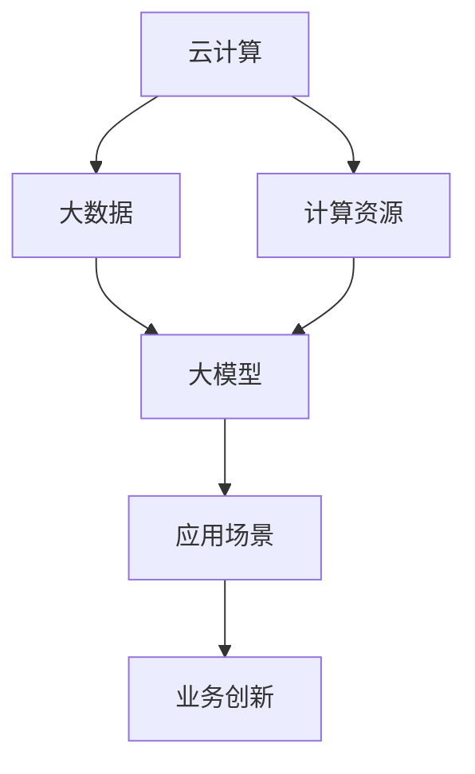

                 

关键词：大模型公司、默认应用、机遇、挑战、技术发展、业务拓展

> 摘要：本文旨在探讨大模型公司在当今技术环境中扮演的默认应用角色，分析其所面临的机遇与挑战，并展望未来发展趋势。随着人工智能技术的飞速发展，大模型成为企业应用的核心驱动力，本文将深入剖析其影响及应对策略。

## 1. 背景介绍

近年来，人工智能技术的迅猛发展带动了大数据、云计算、深度学习等领域的不断创新。大模型，作为人工智能领域的重要成果，以其强大的数据处理能力和智能决策能力，成为企业数字化转型的重要支撑。从搜索引擎到语音助手，从推荐系统到自动驾驶，大模型的应用无处不在，深刻改变了人们的生活方式和工作模式。

在大模型技术的推动下，许多公司开始将其作为默认应用，这不仅提高了业务效率，还为公司的创新和拓展提供了新的契机。然而，大模型的应用也带来了诸多挑战，如数据处理隐私、算法公平性、技术风险等。因此，如何在机遇与挑战并存的环境中，充分利用大模型的优势，同时有效应对其带来的挑战，成为企业关注的焦点。

## 2. 核心概念与联系

### 2.1 大模型的概念

大模型，通常指的是拥有数十亿至千亿参数规模的人工神经网络模型。这些模型通过对海量数据的训练，可以提取出复杂的数据特征，实现高度智能化的数据分析和决策能力。代表性的大模型包括GPT、BERT、Turing等。

### 2.2 大模型的应用场景

大模型的应用场景非常广泛，涵盖了自然语言处理、计算机视觉、语音识别、推荐系统等多个领域。例如，GPT在自然语言生成和文本理解方面具有卓越的表现，BERT在搜索引擎的语义检索中起到关键作用，Turing则在智能客服和语音助手等领域得到广泛应用。

### 2.3 大模型的联系

大模型的应用不仅依赖于自身的强大能力，还需要与云计算、大数据等技术紧密结合。云计算提供了大模型所需的计算资源，大数据则为大模型提供了丰富的训练数据。同时，大模型的应用也促进了云计算和大数据技术的发展，形成了一个相互促进的生态圈。

### 2.4 Mermaid 流程图



## 3. 核心算法原理 & 具体操作步骤

### 3.1 算法原理概述

大模型的核心算法主要基于深度学习，特别是神经网络。通过多层神经元的堆叠，大模型可以实现对复杂数据的建模和预测。其基本原理包括：

1. **前向传播**：输入数据通过网络传递，逐层计算并得到输出。
2. **反向传播**：根据输出误差，反向调整网络权重，优化模型参数。
3. **梯度下降**：通过调整权重，使得模型误差最小化。

### 3.2 算法步骤详解

1. **数据预处理**：对原始数据进行清洗、归一化等处理，使其适合模型训练。
2. **模型构建**：设计神经网络结构，初始化模型参数。
3. **模型训练**：使用训练数据对模型进行迭代训练，优化模型参数。
4. **模型评估**：使用验证数据评估模型性能，调整模型参数。
5. **模型部署**：将训练好的模型部署到生产环境，进行实际应用。

### 3.3 算法优缺点

**优点**：

- **强大的数据处理能力**：大模型可以处理大量复杂数据，提取出有价值的信息。
- **高度智能化**：大模型能够实现自动化决策，提高业务效率。
- **广泛的适用性**：大模型可以在多个领域得到应用，具有很高的灵活性。

**缺点**：

- **计算资源需求高**：大模型训练需要大量计算资源，成本较高。
- **数据隐私问题**：大模型训练需要海量数据，数据隐私保护成为挑战。
- **模型解释性差**：大模型黑盒性质较强，难以解释模型决策过程。

### 3.4 算法应用领域

大模型在以下领域具有广泛的应用：

- **自然语言处理**：如文本分类、机器翻译、情感分析等。
- **计算机视觉**：如图像识别、目标检测、图像生成等。
- **推荐系统**：如商品推荐、音乐推荐、新闻推荐等。
- **语音识别**：如语音合成、语音识别等。
- **自动驾驶**：如环境感知、路径规划、车辆控制等。

## 4. 数学模型和公式 & 详细讲解 & 举例说明

### 4.1 数学模型构建

大模型的数学模型主要基于多层感知机（MLP）和卷积神经网络（CNN）。

**多层感知机**：

$$
\text{输出} = \sigma(\text{权重} \cdot \text{输入} + \text{偏置})
$$

**卷积神经网络**：

$$
\text{输出} = \text{激活函数}(\sum_{k=1}^{K} w_{k} \cdot \text{卷积}(\text{输入}, k) + b)
$$

### 4.2 公式推导过程

以卷积神经网络为例，其推导过程如下：

1. **卷积操作**：

$$
\text{卷积}(\text{输入}, k) = \sum_{i=1}^{H} \sum_{j=1}^{W} \text{输入}_{i,j} \cdot k_{i,j}
$$

2. **权重求和**：

$$
\sum_{k=1}^{K} w_{k} \cdot \text{卷积}(\text{输入}, k) = \sum_{k=1}^{K} \sum_{i=1}^{H} \sum_{j=1}^{W} w_{k_{i,j}} \cdot \text{输入}_{i,j} \cdot k_{i,j}
$$

3. **偏置添加**：

$$
\sum_{k=1}^{K} w_{k} \cdot \text{卷积}(\text{输入}, k) + b = \sum_{k=1}^{K} \sum_{i=1}^{H} \sum_{j=1}^{W} w_{k_{i,j}} \cdot \text{输入}_{i,j} \cdot k_{i,j} + b
$$

4. **激活函数**：

$$
\text{激活函数}(\sum_{k=1}^{K} w_{k} \cdot \text{卷积}(\text{输入}, k) + b) = g(\sum_{k=1}^{K} w_{k} \cdot \text{卷积}(\text{输入}, k) + b)
$$

### 4.3 案例分析与讲解

以图像识别为例，我们使用卷积神经网络实现一个简单的图像分类任务。

1. **数据准备**：

   - 输入图像：32x32像素
   - 标签类别：10个

2. **模型构建**：

   - 卷积层：32x32x3的输入图像通过5x5的卷积核提取特征，得到32x32x64的特征图。
   - 池化层：对特征图进行2x2的最大池化，得到16x16x64的特征图。
   - 全连接层：将特征图展平为一维向量，通过全连接层进行分类，输出10个概率值。

3. **模型训练**：

   - 使用训练数据对模型进行迭代训练，优化模型参数。
   - 使用验证数据评估模型性能，调整模型参数。

4. **模型评估**：

   - 在测试数据上评估模型性能，计算准确率、召回率等指标。

## 5. 项目实践：代码实例和详细解释说明

### 5.1 开发环境搭建

1. 安装Python环境。
2. 安装TensorFlow框架。
3. 准备训练数据和测试数据。

### 5.2 源代码详细实现

```python
import tensorflow as tf
from tensorflow.keras import layers

# 数据准备
# ...

# 模型构建
model = tf.keras.Sequential([
    layers.Conv2D(64, (5, 5), activation='relu', input_shape=(32, 32, 3)),
    layers.MaxPooling2D((2, 2)),
    layers.Flatten(),
    layers.Dense(128, activation='relu'),
    layers.Dense(10, activation='softmax')
])

# 模型训练
model.compile(optimizer='adam',
              loss='sparse_categorical_crossentropy',
              metrics=['accuracy'])

model.fit(train_images, train_labels, epochs=10)

# 模型评估
test_loss, test_acc = model.evaluate(test_images, test_labels)
print(f'测试准确率：{test_acc}')
```

### 5.3 代码解读与分析

- **数据准备**：使用Keras库准备训练数据和测试数据，包括图像和标签。
- **模型构建**：使用TensorFlow的Sequential模型，添加卷积层、池化层、全连接层等。
- **模型训练**：编译模型，使用训练数据训练模型，设置优化器和损失函数。
- **模型评估**：使用测试数据评估模型性能，计算准确率。

## 6. 实际应用场景

### 6.1 自然语言处理

- **文本分类**：对大量文本进行分类，如新闻分类、情感分析等。
- **机器翻译**：将一种语言的文本翻译成另一种语言。
- **对话系统**：构建智能客服、聊天机器人等。

### 6.2 计算机视觉

- **图像识别**：对图像进行分类和标注。
- **目标检测**：检测图像中的多个目标并标注位置。
- **图像生成**：生成新的图像，如艺术作品、风景图片等。

### 6.3 推荐系统

- **商品推荐**：根据用户历史行为推荐商品。
- **音乐推荐**：根据用户听歌喜好推荐歌曲。
- **新闻推荐**：根据用户阅读习惯推荐新闻。

### 6.4 语音识别

- **语音合成**：将文本转换为语音。
- **语音识别**：将语音转换为文本。
- **语音助手**：实现与用户的语音交互。

## 7. 工具和资源推荐

### 7.1 学习资源推荐

- **《深度学习》**：Ian Goodfellow等著，系统介绍了深度学习的理论和技术。
- **《Python深度学习》**：François Chollet著，详细介绍了使用Python进行深度学习的方法。

### 7.2 开发工具推荐

- **TensorFlow**：Google开源的深度学习框架，功能强大且易于使用。
- **PyTorch**：Facebook开源的深度学习框架，具有灵活的动态计算图。

### 7.3 相关论文推荐

- **"A Theoretical Analysis of the Vision Transformer"**：分析Vision Transformer在计算机视觉中的应用。
- **"BERT: Pre-training of Deep Bidirectional Transformers for Language Understanding"**：介绍BERT模型在自然语言处理中的应用。

## 8. 总结：未来发展趋势与挑战

### 8.1 研究成果总结

- 大模型技术取得了显著的进展，已经在多个领域得到了广泛应用。
- 深度学习算法不断优化，计算效率不断提高。
- 大模型的应用推动了人工智能技术的进一步发展。

### 8.2 未来发展趋势

- **模型压缩与优化**：为应对计算资源的需求，模型压缩与优化将成为重要研究方向。
- **多模态融合**：将图像、文本、语音等多种数据融合，实现更全面的理解和决策。
- **自主学习和推理**：大模型将实现更高级的自主学习和推理能力，提高智能化的水平。

### 8.3 面临的挑战

- **数据隐私与安全**：如何在保护用户隐私的前提下，充分利用海量数据，是一个重要的挑战。
- **算法公平性**：如何确保算法的公平性，避免歧视和不公平现象，是一个亟待解决的问题。
- **技术门槛**：大模型技术的高门槛，使得中小企业难以应用，如何降低技术门槛，提高普及率，是一个重要议题。

### 8.4 研究展望

- 未来，大模型技术将在更多领域得到应用，推动人工智能技术的进一步发展。
- 同时，针对大模型技术面临的挑战，研究者将提出更多创新性的解决方案，实现大模型的可持续发展。

## 9. 附录：常见问题与解答

### 9.1 什么是大模型？

大模型指的是具有数十亿至千亿参数规模的人工神经网络模型，能够通过海量数据训练，实现高度智能化的数据分析和决策能力。

### 9.2 大模型有哪些应用场景？

大模型的应用场景非常广泛，包括自然语言处理、计算机视觉、语音识别、推荐系统等多个领域。

### 9.3 大模型有哪些优缺点？

优点包括强大的数据处理能力、高度智能化和广泛的适用性；缺点包括计算资源需求高、数据隐私问题和模型解释性差。

### 9.4 如何应对大模型技术面临的挑战？

可以通过模型压缩与优化、多模态融合和自主学习和推理等技术研究，应对大模型技术面临的挑战。

## 作者署名

作者：禅与计算机程序设计艺术 / Zen and the Art of Computer Programming
----------------------------------------------------------------

以上便是关于“大模型公司的默认应用：机遇与挑战并存”的文章内容。希望这篇文章能够帮助您更深入地理解大模型公司在当今技术环境中的重要地位，以及其所面临的机遇与挑战。未来，随着人工智能技术的不断发展，大模型的应用将越来越广泛，对企业和个人的影响也将更加深远。让我们共同期待这一天的到来！

