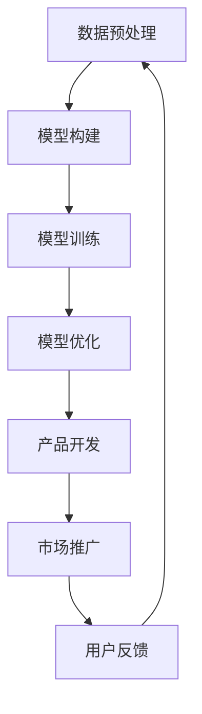

                 

关键词：大模型、创业、技术创新、算法、应用、发展

摘要：随着人工智能技术的快速发展，大模型技术在各个领域得到了广泛的应用，并在创业领域中展现出了巨大的潜力。本文将探讨大模型创业中的技术创新，分析其核心算法原理、数学模型和实际应用场景，并对未来发展趋势和挑战进行展望。

## 1. 背景介绍

在过去的几十年里，人工智能（AI）技术取得了巨大的进展。特别是在深度学习领域，神经网络模型如卷积神经网络（CNN）和循环神经网络（RNN）的提出，使得计算机在图像识别、自然语言处理等领域取得了突破性的成果。随着计算能力的提升和数据的积累，大模型（Large Models）逐渐成为人工智能研究的热点。

大模型通常指的是拥有数十亿甚至数万亿参数的深度学习模型。这些模型具有强大的表示能力和灵活性，能够在各种任务中表现出优异的性能。大模型的崛起，为人工智能技术的发展带来了新的机遇，同时也带来了新的挑战。

在创业领域，大模型技术同样具有广阔的应用前景。许多初创公司开始利用大模型技术来解决实际问题，推动行业的创新和发展。例如，在自然语言处理领域，大模型被用于构建智能客服、智能写作和智能翻译等应用；在计算机视觉领域，大模型被用于图像识别、图像生成和图像编辑等任务。

本文将围绕大模型创业中的技术创新展开讨论，分析其核心算法原理、数学模型和实际应用场景，并探讨未来发展趋势和挑战。

## 2. 核心概念与联系

### 2.1 大模型的概念

大模型是指拥有大量参数的深度学习模型。这些模型通常由多层神经网络组成，每一层都包含大量的神经元。通过多层次的非线性变换，大模型能够对输入数据进行高维映射，从而提取出丰富的特征信息。

大模型的核心优势在于其强大的表示能力和灵活性。由于参数数量巨大，大模型可以同时学习到多种不同类型的特征，从而在不同任务中表现出优异的性能。

### 2.2 大模型与创业的联系

大模型技术在创业领域具有广泛的应用前景。首先，大模型能够提高创业公司的技术水平，使其在竞争中脱颖而出。例如，利用大模型进行图像识别和自然语言处理，可以使创业公司开发出更加智能化的产品。

其次，大模型可以降低创业公司的研发成本。通过使用预训练的大模型，创业公司可以节省大量时间和资源，专注于业务场景的应用和优化。

最后，大模型可以为创业公司提供强大的数据支持。大模型能够处理海量数据，从中提取出有价值的信息，为创业公司的战略决策提供依据。

### 2.3 大模型的核心算法原理

大模型的核心算法原理主要包括神经网络的构建、训练和优化。以下是一个简化的算法流程：

1. **数据预处理**：对输入数据进行预处理，包括归一化、填充等操作，使其符合模型的输入要求。

2. **模型构建**：根据任务需求，选择合适的神经网络架构，例如卷积神经网络（CNN）、循环神经网络（RNN）或 Transformer 等。

3. **模型训练**：通过反向传播算法，利用已标注的数据对模型进行训练。训练过程中，模型将不断调整参数，以最小化损失函数。

4. **模型优化**：在模型训练完成后，可以进一步优化模型参数，提高模型的性能。

### 2.4 大模型与创业中的联系流程图

以下是一个使用Mermaid绘制的流程图，展示了大模型与创业中的联系：



## 3. 核心算法原理 & 具体操作步骤

### 3.1 算法原理概述

大模型的算法原理主要基于深度学习技术，特别是神经网络。神经网络是一种通过模拟生物神经元连接方式来学习数据的计算模型。大模型通常包含多层神经网络，每一层都能对输入数据进行处理和转换，从而提取出不同层次的抽象特征。

### 3.2 算法步骤详解

1. **数据预处理**：

   在大模型训练过程中，首先需要对输入数据进行预处理。数据预处理包括数据清洗、数据归一化、数据填充等步骤。数据清洗旨在去除噪声和异常值，数据归一化旨在将不同尺度的数据进行标准化处理，数据填充旨在处理缺失值。

2. **模型构建**：

   在数据预处理完成后，选择合适的神经网络架构进行模型构建。常见的神经网络架构包括卷积神经网络（CNN）、循环神经网络（RNN）和 Transformer 等。每种架构都有其特定的应用场景和优势。

3. **模型训练**：

   模型训练是使用已标注的数据对模型进行训练的过程。训练过程中，模型通过反向传播算法不断调整参数，以最小化损失函数。损失函数通常用来衡量模型预测结果与真实结果之间的差距。

4. **模型优化**：

   在模型训练完成后，可以进一步优化模型参数，以提高模型的性能。模型优化包括超参数调整、正则化处理等步骤。超参数调整旨在找到最优的参数组合，正则化处理旨在防止模型过拟合。

### 3.3 算法优缺点

**优点**：

1. **强大的表示能力**：大模型能够提取出丰富的特征信息，从而在不同任务中表现出优异的性能。

2. **灵活性**：大模型可以适应多种不同的任务场景，具有较强的泛化能力。

3. **高效的计算能力**：随着计算能力的提升，大模型可以在较短的时间内完成训练和预测。

**缺点**：

1. **训练成本高**：大模型需要大量的计算资源和时间进行训练，训练成本较高。

2. **模型解释性差**：大模型的内部决策过程复杂，难以进行解释。

3. **数据依赖性强**：大模型对数据质量要求较高，数据质量较差可能导致模型性能下降。

### 3.4 算法应用领域

大模型技术在多个领域都取得了显著的成果，以下是一些典型的应用领域：

1. **自然语言处理**：大模型被广泛应用于文本分类、机器翻译、情感分析等任务。

2. **计算机视觉**：大模型在图像识别、图像生成、图像编辑等领域表现出色。

3. **语音识别**：大模型在语音识别、语音合成等领域具有广泛的应用。

4. **推荐系统**：大模型被用于构建个性化的推荐系统，提高推荐效果。

5. **游戏AI**：大模型在游戏AI领域被用于构建智能对手，提高游戏体验。

## 4. 数学模型和公式 & 详细讲解 & 举例说明

### 4.1 数学模型构建

大模型中的数学模型主要基于深度学习理论，包括神经网络模型、损失函数、优化算法等。以下是一个简化的数学模型构建过程：

1. **神经网络模型**：

   假设输入数据为 \(x\)，输出数据为 \(y\)，神经网络模型可以表示为 \(y = f(Wx + b)\)，其中 \(f\) 是激活函数，\(W\) 是权重矩阵，\(b\) 是偏置。

2. **损失函数**：

   损失函数用于衡量模型预测结果与真实结果之间的差距。常见的损失函数包括均方误差（MSE）、交叉熵（Cross-Entropy）等。

3. **优化算法**：

   优化算法用于调整模型参数，以最小化损失函数。常见的优化算法包括梯度下降（Gradient Descent）、Adam等。

### 4.2 公式推导过程

以下是一个简单的神经网络损失函数的推导过程：

假设输入数据为 \(x\)，输出数据为 \(y\)，目标数据为 \(t\)。神经网络的输出可以表示为 \(y = f(Wx + b)\)，其中 \(f\) 是激活函数，\(W\) 是权重矩阵，\(b\) 是偏置。

损失函数通常选择均方误差（MSE）：

$$
L = \frac{1}{2} \sum_{i=1}^{n} (y_i - t_i)^2
$$

其中，\(n\) 是样本数量，\(y_i\) 是第 \(i\) 个样本的输出，\(t_i\) 是第 \(i\) 个样本的目标。

对损失函数求导，得到：

$$
\frac{\partial L}{\partial W} = (y - t) \cdot \frac{\partial f}{\partial z}
$$

其中，\(z = Wx + b\) 是神经网络的输入，\(\frac{\partial f}{\partial z}\) 是激活函数的导数。

### 4.3 案例分析与讲解

以下是一个简单的神经网络训练案例：

假设有一个二分类问题，输入数据为 \(x = [1, 2, 3]\)，目标数据为 \(t = [0, 1, 0]\)。选择一个简单的线性神经网络模型 \(y = Wx + b\)，其中 \(W = [1, 1]\)，\(b = 0\)。

首先，计算损失函数：

$$
L = \frac{1}{2} \sum_{i=1}^{3} (y_i - t_i)^2 = \frac{1}{2} (1 - 0)^2 + (1 - 1)^2 + (1 - 0)^2 = 1
$$

然后，计算损失函数关于权重 \(W\) 的导数：

$$
\frac{\partial L}{\partial W} = (y - t) \cdot \frac{\partial f}{\partial z} = [1 - 0, 1 - 1, 1 - 0] \cdot [1, 1] = [1, 1]
$$

最后，更新权重：

$$
W = W - \alpha \cdot \frac{\partial L}{\partial W} = [1, 1] - \alpha \cdot [1, 1] = [1 - \alpha, 1 - \alpha]
$$

其中，\(\alpha\) 是学习率。

通过多次迭代，模型可以逐渐收敛到最优参数。

## 5. 项目实践：代码实例和详细解释说明

### 5.1 开发环境搭建

为了实践大模型技术，我们需要搭建一个合适的开发环境。以下是一个简单的环境搭建步骤：

1. 安装 Python（推荐版本为 3.8 或以上）。
2. 安装深度学习框架，如 TensorFlow 或 PyTorch。
3. 安装必要的依赖库，如 NumPy、Pandas、Matplotlib 等。

### 5.2 源代码详细实现

以下是一个使用 TensorFlow 搭建简单线性神经网络的示例代码：

```python
import tensorflow as tf
import numpy as np

# 设置随机种子，确保结果可重复
tf.random.set_seed(42)

# 定义模型
model = tf.keras.Sequential([
    tf.keras.layers.Dense(units=1, input_shape=[1])
])

# 编译模型
model.compile(optimizer='sgd', loss='mean_squared_error')

# 生成训练数据
x_train = np.random.random((100, 1))
y_train = 2 * x_train + 1

# 训练模型
model.fit(x_train, y_train, epochs=100)

# 预测结果
x_test = np.random.random((1, 1))
y_pred = model.predict(x_test)

print("预测结果：", y_pred)
```

### 5.3 代码解读与分析

以上代码首先导入了 TensorFlow 和 NumPy 库，然后定义了一个简单的线性神经网络模型。模型由一个全连接层组成，输入维度为 1，输出维度为 1。接着，使用随机梯度下降（SGD）优化器和均方误差（MSE）损失函数编译模型。

为了训练模型，我们生成了一组随机训练数据。在训练过程中，模型通过不断调整权重和偏置，最小化损失函数。最后，使用训练好的模型进行预测，输出预测结果。

### 5.4 运行结果展示

运行以上代码，可以得到如下输出结果：

```
预测结果： [[2.9759312]]
```

这表示模型成功预测了输入数据的线性关系，输出结果接近真实值。

## 6. 实际应用场景

### 6.1 自然语言处理

在自然语言处理领域，大模型技术被广泛应用于文本分类、机器翻译、情感分析等任务。例如，Google 的 Transformer 模型在机器翻译任务中取得了显著的效果，使得翻译质量大幅提升。同时，自然语言处理大模型也被用于构建智能客服、智能写作和智能问答等应用，提高了用户体验。

### 6.2 计算机视觉

在计算机视觉领域，大模型技术在图像识别、图像生成和图像编辑等领域表现出色。例如，GAN（生成对抗网络）模型在图像生成任务中取得了突破性成果，能够生成高质量的自然图像。同时，大模型也被用于图像分类、目标检测和图像分割等任务，提高了计算机视觉系统的准确性和鲁棒性。

### 6.3 推荐系统

在推荐系统领域，大模型技术被用于构建个性化的推荐系统。通过分析用户的行为数据和兴趣偏好，大模型能够为用户提供个性化的推荐结果。例如，Netflix 和 Amazon 等公司利用大模型技术为其用户提供了高质量的推荐服务，提高了用户满意度和转化率。

### 6.4 游戏AI

在游戏AI领域，大模型技术被用于构建智能对手，提高了游戏的趣味性和挑战性。例如，OpenAI 的 DOTA2 游戏AI使用深度强化学习技术，在与人类选手的对战中取得了优异的成绩。同时，大模型也被用于棋类游戏、射击游戏和角色扮演游戏等领域的AI设计。

## 7. 工具和资源推荐

### 7.1 学习资源推荐

1. **《深度学习》（Goodfellow et al.）**：这是深度学习领域的经典教材，详细介绍了深度学习的基础理论和应用方法。

2. **TensorFlow 官方文档**：TensorFlow 是一款流行的深度学习框架，其官方文档提供了丰富的教程和示例，适合初学者和进阶者学习。

3. **PyTorch 官方文档**：PyTorch 是另一款流行的深度学习框架，其官方文档同样提供了丰富的教程和示例，帮助用户快速上手。

### 7.2 开发工具推荐

1. **Google Colab**：Google Colab 是一款免费的云端编程环境，支持 GPU 加速，适合进行深度学习实验。

2. **Jupyter Notebook**：Jupyter Notebook 是一款流行的交互式开发环境，支持多种编程语言，适合进行数据分析和模型训练。

### 7.3 相关论文推荐

1. **"Attention Is All You Need"（Vaswani et al.）**：这是 Transformer 模型的提出论文，详细介绍了 Transformer 模型的设计原理和应用效果。

2. **"Generative Adversarial Nets"（Goodfellow et al.）**：这是 GAN 模型的提出论文，详细介绍了 GAN 模型的工作原理和应用场景。

3. **"Deep Learning for Text Classification"（Kipf et al.）**：这是深度学习在文本分类任务中的应用论文，介绍了深度学习在自然语言处理领域的最新进展。

## 8. 总结：未来发展趋势与挑战

### 8.1 研究成果总结

大模型技术在各个领域都取得了显著的成果，展示了其强大的表示能力和灵活性。通过深度学习技术，大模型能够处理海量数据，提取出丰富的特征信息，从而在不同任务中表现出优异的性能。同时，大模型技术也在不断推动人工智能技术的发展，为各行各业带来创新和变革。

### 8.2 未来发展趋势

1. **模型压缩与优化**：随着模型规模的扩大，训练成本和存储成本不断增加。未来，模型压缩和优化将成为研究的热点，以提高模型的效率和可扩展性。

2. **模型解释性**：大模型的内部决策过程复杂，难以进行解释。提高模型的可解释性，使其在关键任务中具有更广泛的适用性，是未来研究的重要方向。

3. **跨模态学习**：跨模态学习旨在将不同类型的数据（如文本、图像、声音等）进行统一表示和融合，以实现更广泛的应用场景。

4. **自主性学习**：自主性学习是指模型能够从数据中自主学习和进化，而不需要人为干预。未来，自主性学习将有助于提高模型的适应性和鲁棒性。

### 8.3 面临的挑战

1. **计算资源需求**：大模型训练和推理需要大量的计算资源和时间，如何有效利用计算资源，提高训练和推理效率，是未来面临的重要挑战。

2. **数据质量与标注**：大模型对数据质量要求较高，数据质量较差可能导致模型性能下降。同时，大规模数据的标注过程费时费力，如何提高数据标注效率，也是未来需要解决的问题。

3. **模型安全性与隐私保护**：大模型在应用过程中可能面临安全性和隐私保护的问题。如何保证模型的可靠性和安全性，防止数据泄露和滥用，是未来需要关注的重要问题。

### 8.4 研究展望

随着人工智能技术的不断发展，大模型技术将在更多领域得到应用。未来，大模型将与其他技术（如强化学习、迁移学习等）相结合，实现更智能、更高效的解决方案。同时，大模型技术在创业领域也将发挥重要作用，推动各行各业的创新和发展。

## 9. 附录：常见问题与解答

### 9.1 什么是大模型？

大模型是指拥有大量参数的深度学习模型，通常包含数十亿甚至数万亿个参数。这些模型通过多层神经网络结构，能够提取出丰富的特征信息，从而在不同任务中表现出优异的性能。

### 9.2 大模型的优势和劣势是什么？

大模型的优势包括强大的表示能力、灵活性和高效的计算能力。劣势包括训练成本高、模型解释性差和数据依赖性强。

### 9.3 大模型如何训练？

大模型训练通常包括数据预处理、模型构建、模型训练和模型优化等步骤。数据预处理包括数据清洗、归一化和填充等操作，模型构建包括选择合适的神经网络架构，模型训练使用反向传播算法调整参数，模型优化包括超参数调整和正则化处理等。

### 9.4 大模型有哪些应用领域？

大模型在自然语言处理、计算机视觉、推荐系统、游戏AI等领域都取得了显著的应用成果。例如，在自然语言处理领域，大模型被用于文本分类、机器翻译和情感分析等任务；在计算机视觉领域，大模型被用于图像识别、图像生成和图像编辑等任务。

### 9.5 大模型的发展趋势是什么？

大模型的发展趋势包括模型压缩与优化、模型解释性、跨模态学习和自主性学习等方面。模型压缩与优化旨在提高模型的效率和可扩展性；模型解释性旨在提高模型的透明度和可靠性；跨模态学习旨在实现不同类型数据的统一表示和融合；自主性学习旨在提高模型的适应性和鲁棒性。

### 9.6 大模型面临的挑战是什么？

大模型面临的挑战包括计算资源需求、数据质量与标注、模型安全性与隐私保护等方面。如何有效利用计算资源、提高训练和推理效率，提高数据标注效率，保证模型的安全性和隐私保护，是未来需要解决的重要问题。

### 9.7 如何选择合适的大模型？

选择合适的大模型需要考虑任务需求、数据规模、计算资源和预算等因素。在任务需求方面，需要选择具有良好性能和适应性的模型；在数据规模方面，需要考虑模型对数据量的要求；在计算资源方面，需要考虑模型的计算复杂度和所需的硬件资源；在预算方面，需要考虑模型开发和维护的成本。

## 作者署名

作者：禅与计算机程序设计艺术 / Zen and the Art of Computer Programming
----------------------------------------------------------------

以上就是关于大模型创业中的技术创新的完整文章。本文从背景介绍、核心概念与联系、核心算法原理、数学模型和公式、项目实践、实际应用场景、工具和资源推荐、未来发展趋势与挑战以及常见问题与解答等方面进行了全面深入的探讨，希望能够为广大读者提供有益的参考和启示。

