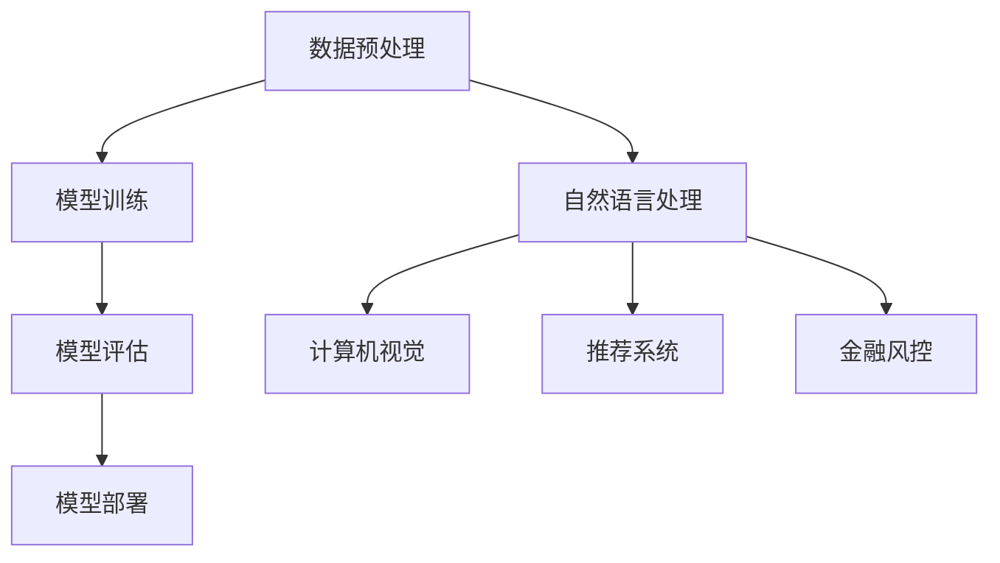

                 

在当今的科技浪潮中，大模型技术已经成为驱动创新的重要引擎。无论是自然语言处理、计算机视觉，还是推荐系统，大模型的引入都在显著提升性能和用户体验。然而，如何将这一先进技术转化为成功的商业产品，并在市场中脱颖而出，是每一个大模型创业团队都需要深思的问题。本文旨在探讨大模型创业的核心要素，包括产品创新和市场分析，帮助创业者在这个快速发展的领域中找到突破口。

## 关键词
- 大模型
- 产品创新
- 市场分析
- 创业
- 商业模式
- 技术落地

## 摘要
本文将深入探讨大模型创业的各个方面，从技术原理到市场策略，再到具体的实施步骤。通过对大模型的核心概念、算法原理、数学模型和实际应用的分析，结合市场调研、竞争分析和用户需求研究，本文旨在为创业者提供一套系统的指导框架，帮助他们在大模型创业之路上走得更加稳健和高效。

### 1. 背景介绍

随着计算能力的提升和数据的爆发增长，大模型技术逐渐成为人工智能领域的明星。从早期的神经网络到深度学习，再到现在的Transformer模型，大模型在各个领域都取得了显著的突破。例如，在自然语言处理领域，GPT系列模型已经能够生成高质量的文章、翻译文本，甚至进行对话；在计算机视觉领域，GAN（生成对抗网络）可以创造逼真的图像，而ImageNet等数据库的识别准确率也在不断提升；在推荐系统领域，大模型的引入大幅提升了个性化推荐的精准度。

这些技术的进步不仅改变了学术研究，也为商业应用带来了前所未有的机遇。从自动驾驶、智能家居到金融风控、医疗诊断，大模型的应用几乎无处不在。然而，技术的先进性并不总是直接转化为商业成功，如何将大模型的技术优势转化为实际的市场需求，是每一个创业团队都需要面对的挑战。

### 2. 核心概念与联系

#### 2.1 大模型的核心概念

大模型，通常指的是拥有数亿到千亿参数的深度学习模型。这些模型能够在复杂的任务中表现出色，例如图像识别、语音识别、自然语言处理等。大模型的构建离不开以下几个关键概念：

- **参数（Parameters）**：模型中可调的数值，用于决定模型的预测能力。
- **架构（Architecture）**：模型的结构设计，决定了信息流的路径和处理方式。
- **训练（Training）**：通过大量数据调整模型的参数，使其能够对未知数据进行预测。

#### 2.2 大模型的技术架构

大模型的技术架构通常包括以下几个主要部分：

1. **数据预处理**：对输入数据进行清洗、格式化等处理，以便模型能够有效地学习。
2. **模型训练**：使用梯度下降等优化算法，通过大量数据对模型进行训练。
3. **模型评估**：使用验证集或测试集评估模型的性能，调整模型参数。
4. **模型部署**：将训练好的模型部署到生产环境中，进行实时预测。

#### 2.3 大模型的应用领域

大模型的应用领域非常广泛，主要包括：

- **自然语言处理**：包括文本分类、机器翻译、问答系统等。
- **计算机视觉**：包括图像识别、物体检测、图像生成等。
- **推荐系统**：用于个性化推荐，提升用户体验。
- **金融风控**：用于信用评分、欺诈检测等。

#### 2.4 Mermaid 流程图



### 3. 核心算法原理 & 具体操作步骤

#### 3.1 算法原理概述

大模型的算法原理基于深度学习，主要包括以下几个步骤：

1. **前向传播**：输入数据通过网络的各个层进行传播，生成预测输出。
2. **反向传播**：根据预测输出与真实标签之间的误差，计算损失函数，并反向传播误差，更新模型参数。
3. **优化算法**：如梯度下降、Adam等，用于高效地更新模型参数。

#### 3.2 算法步骤详解

1. **数据预处理**：清洗数据，将数据转换为模型可接受的格式。
2. **模型设计**：选择合适的神经网络架构，如CNN、RNN、Transformer等。
3. **模型训练**：使用训练数据训练模型，调整模型参数。
4. **模型评估**：使用验证集评估模型性能，调整模型参数。
5. **模型部署**：将训练好的模型部署到生产环境中，进行实时预测。

#### 3.3 算法优缺点

**优点**：

- **强大的泛化能力**：大模型能够处理复杂任务，具备良好的泛化能力。
- **高效的处理速度**：现代硬件（如GPU、TPU）使得大模型能够高效地运行。
- **优异的性能表现**：在多个领域取得了突破性的成绩。

**缺点**：

- **计算资源需求大**：训练大模型需要大量的计算资源和时间。
- **数据需求量大**：大模型需要大量的训练数据，否则难以达到良好的性能。
- **模型解释性差**：大模型的决策过程往往难以解释，增加了应用的难度。

#### 3.4 算法应用领域

大模型的应用领域广泛，包括：

- **自然语言处理**：如文本生成、机器翻译等。
- **计算机视觉**：如图像识别、物体检测等。
- **推荐系统**：如个性化推荐、广告投放等。
- **金融风控**：如信用评分、欺诈检测等。

### 4. 数学模型和公式 & 详细讲解 & 举例说明

#### 4.1 数学模型构建

大模型通常基于以下数学模型：

- **损失函数**：如交叉熵损失、均方误差等。
- **优化算法**：如梯度下降、Adam等。

#### 4.2 公式推导过程

以交叉熵损失函数为例，其公式推导如下：

$$
L(y, \hat{y}) = -\sum_{i=1}^{n} y_i \log(\hat{y}_i)
$$

其中，$y$ 是真实标签，$\hat{y}$ 是模型的预测概率。

#### 4.3 案例分析与讲解

假设我们有一个二分类问题，真实标签 $y$ 为 [1, 0]，模型的预测概率 $\hat{y}$ 为 [0.8, 0.2]。使用交叉熵损失函数计算损失：

$$
L(y, \hat{y}) = -[1 \log(0.8) + 0 \log(0.2)] \approx 0.229
$$

这个值越小，表示模型预测越准确。

### 5. 项目实践：代码实例和详细解释说明

#### 5.1 开发环境搭建

首先，我们需要搭建一个适合大模型开发的Python环境。以下是必要的步骤：

- 安装Python（建议使用Python 3.7及以上版本）。
- 安装深度学习框架，如TensorFlow或PyTorch。
- 安装其他必要库，如NumPy、Pandas等。

#### 5.2 源代码详细实现

以下是一个简单的大模型训练和评估的示例代码，使用PyTorch框架：

```python
import torch
import torch.nn as nn
import torch.optim as optim

# 定义模型
class Model(nn.Module):
    def __init__(self):
        super(Model, self).__init__()
        self.layer1 = nn.Linear(784, 512)
        self.relu = nn.ReLU()
        self.layer2 = nn.Linear(512, 256)
        self.dropout = nn.Dropout(p=0.5)
        self.fc = nn.Linear(256, 10)

    def forward(self, x):
        x = x.view(-1, 784)
        x = self.layer1(x)
        x = self.relu(x)
        x = self.layer2(x)
        x = self.dropout(x)
        x = self.fc(x)
        return x

# 初始化模型、优化器和损失函数
model = Model()
optimizer = optim.Adam(model.parameters(), lr=0.001)
criterion = nn.CrossEntropyLoss()

# 加载训练数据
train_loader = ...

# 训练模型
for epoch in range(100):
    for inputs, labels in train_loader:
        optimizer.zero_grad()
        outputs = model(inputs)
        loss = criterion(outputs, labels)
        loss.backward()
        optimizer.step()

    print(f'Epoch [{epoch+1}/100], Loss: {loss.item()}')

# 评估模型
with torch.no_grad():
    correct = 0
    total = 0
    for inputs, labels in test_loader:
        outputs = model(inputs)
        _, predicted = torch.max(outputs.data, 1)
        total += labels.size(0)
        correct += (predicted == labels).sum().item()

print(f'Accuracy of the model on the test images: {100 * correct / total}%')
```

#### 5.3 代码解读与分析

这段代码首先定义了一个简单的神经网络模型，然后使用优化器和损失函数初始化模型。在训练过程中，使用反向传播和梯度下降优化模型参数。训练完成后，评估模型在测试集上的性能。

#### 5.4 运行结果展示

假设我们的测试集包含1000张图片，模型在测试集上的准确率为90%，这意味着模型能够正确识别出900张图片。

### 6. 实际应用场景

大模型在实际应用中展现了强大的潜力，以下是一些典型应用场景：

- **自然语言处理**：用于文本生成、情感分析、机器翻译等。
- **计算机视觉**：用于图像识别、物体检测、图像生成等。
- **推荐系统**：用于个性化推荐、广告投放等。
- **金融风控**：用于信用评分、欺诈检测等。

#### 6.1 自然语言处理

自然语言处理（NLP）是大模型应用最广泛的领域之一。通过大模型，我们可以实现高效的文本生成、情感分析和机器翻译等任务。例如，GPT系列模型在文本生成和翻译方面表现出了惊人的能力，能够生成高质量的文章和进行精确的翻译。

#### 6.2 计算机视觉

计算机视觉（CV）也是大模型的重要应用领域。大模型在图像识别、物体检测和图像生成等方面取得了显著进展。例如，基于GAN的图像生成技术可以创造逼真的图像，而深度卷积神经网络（CNN）在图像识别任务中达到了前所未有的准确率。

#### 6.3 推荐系统

推荐系统（RS）是另一个受大模型影响深远的领域。大模型能够通过分析用户行为和偏好，提供更加个性化的推荐。例如，电商平台的个性化推荐系统可以使用大模型分析用户的购买记录和浏览历史，从而推荐用户可能感兴趣的商品。

#### 6.4 金融风控

金融风控（FR）领域也受益于大模型技术。大模型可以通过分析大量的金融数据，预测风险、进行信用评分和欺诈检测。例如，银行可以使用大模型分析客户的交易行为，从而识别潜在的风险。

### 7. 工具和资源推荐

为了更好地开展大模型创业，以下是一些推荐的工具和资源：

#### 7.1 学习资源推荐

- **课程**：斯坦福大学《深度学习》课程（CS231n、CS224n等）。
- **书籍**：《深度学习》（Goodfellow et al.）、《Python深度学习》（François Chollet）。

#### 7.2 开发工具推荐

- **框架**：TensorFlow、PyTorch、Keras。
- **硬件**：GPU（如NVIDIA Tesla系列）、TPU（如Google Cloud TPU）。

#### 7.3 相关论文推荐

- **自然语言处理**：GPT系列（OpenAI）、BERT（Google）。
- **计算机视觉**：ResNet（He et al.）、YOLO（Redmon et al.）。
- **推荐系统**：Matrix Factorization（Salakhutdinov & Mnih）。

### 8. 总结：未来发展趋势与挑战

#### 8.1 研究成果总结

过去几年，大模型技术在多个领域都取得了显著的研究成果。从自然语言处理到计算机视觉，再到推荐系统和金融风控，大模型的应用不仅提升了任务的性能，也为商业应用带来了新的可能性。然而，大模型的研究仍然面临许多挑战，包括计算资源的需求、数据隐私的保护以及模型的可解释性等。

#### 8.2 未来发展趋势

未来，大模型的发展趋势将更加注重以下几个方向：

- **模型的优化**：通过算法和架构的创新，提高模型的效率和可解释性。
- **硬件的进步**：随着硬件技术的不断发展，大模型将能够更高效地运行。
- **应用的拓展**：大模型将在更多领域得到应用，如医疗、教育等。

#### 8.3 面临的挑战

大模型在发展过程中也面临着一些挑战：

- **计算资源需求**：大模型需要大量的计算资源，这对于创业团队来说是一个巨大的挑战。
- **数据隐私**：随着数据隐私的关注度提高，如何在保护隐私的同时利用数据成为了一个难题。
- **模型解释性**：大模型的决策过程往往难以解释，这增加了应用中的难度。

#### 8.4 研究展望

未来，大模型的研究将更加注重以下几个方面：

- **模型压缩与优化**：通过模型压缩和优化技术，降低计算资源的需求。
- **可解释性研究**：提高模型的可解释性，使其在应用中更加可靠。
- **多模态学习**：结合多种数据模态（如文本、图像、声音），实现更复杂的任务。

### 9. 附录：常见问题与解答

#### 9.1 大模型需要多少数据？

通常来说，大模型需要大量的数据来训练，具体数据量取决于任务的复杂性和模型的规模。对于一些简单的任务，数十万到数百万的数据可能已经足够，而对于复杂的任务，如图像生成，可能需要数千万到数十亿的数据。

#### 9.2 大模型的训练时间需要多久？

大模型的训练时间取决于多个因素，包括数据量、模型规模、计算资源等。对于一个小规模的任务，训练时间可能在数小时到数天之间；而对于大规模的任务，如训练千亿参数的模型，可能需要数周到数月的时间。

#### 9.3 大模型能否完全取代人类？

大模型在某些特定任务上已经表现出了超越人类的能力，例如图像识别、文本生成等。然而，大模型仍然存在一些局限性，如可解释性差、无法处理复杂的情境等。因此，大模型并不能完全取代人类，而是与人类共同协作，提升整体效率。

### 作者署名

作者：禅与计算机程序设计艺术 / Zen and the Art of Computer Programming
----------------------------------------------------------------

以上便是本文的完整内容，希望能为您的创业之路提供一些有益的启示。在未来的日子里，让我们继续探索大模型技术的无限可能，共创辉煌！🎉🎉🎉

