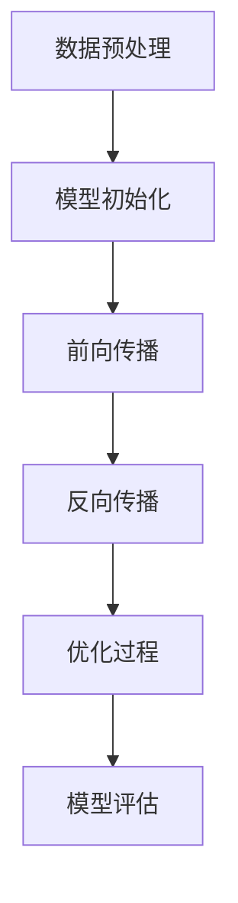

                 

关键词：大模型，创业者，技术突破，产品创新，人工智能

摘要：本文旨在探讨大模型技术在助力创业者实现技术突破与产品创新方面的潜力。通过分析大模型的基本概念、原理及其在计算机科学中的应用，我们将展示如何利用大模型来加速技术创新，同时提供实践中的案例和代码实例，以便读者更好地理解和应用这些技术。本文还将讨论大模型在创业环境中的实际应用场景，并展望其未来的发展趋势与面临的挑战。

## 1. 背景介绍

近年来，人工智能（AI）技术的飞速发展，尤其是深度学习和大模型的兴起，正在重新定义计算机科学和技术创新的边界。大模型，如GPT-3、BERT、Transformer等，以其强大的计算能力和自主学习能力，成为研究者和创业者关注的热点。

在创业环境中，技术突破和产品创新是企业成功的关键。然而，传统的方法往往需要大量的时间和资源，难以满足快速变化的商业需求。大模型的引入，为创业者提供了一种新的途径，可以通过自动化和智能化的方式，快速迭代和优化产品，从而在竞争激烈的市场中脱颖而出。

本文将首先介绍大模型的基本概念和原理，然后探讨其在技术创新中的应用，最后提供实际案例和代码实例，以便读者更好地理解和应用这些技术。

## 2. 核心概念与联系

### 2.1 大模型的基本概念

大模型（Large-scale Model），顾名思义，是指参数规模达到百万甚至亿级别的神经网络模型。这些模型通过大规模的数据训练，能够自动学习并提取复杂的数据特征，从而在图像识别、自然语言处理、语音识别等领域取得了显著的成果。

### 2.2 大模型的工作原理

大模型的核心是深度神经网络（Deep Neural Network，DNN）。DNN通过层层堆叠的神经网络层，对输入数据进行多次非线性变换，从而实现复杂的特征提取和分类。随着层数的增加，DNN的模型容量也显著提高，使得大模型能够处理更加复杂的任务。

大模型的训练过程通常涉及以下步骤：

1. **数据预处理**：将原始数据转换为适合模型训练的格式。
2. **模型初始化**：初始化模型的权重参数。
3. **前向传播**：将输入数据传递到模型中，计算输出结果。
4. **反向传播**：根据预测结果和实际结果的误差，更新模型参数。
5. **优化过程**：通过梯度下降等优化算法，不断调整模型参数，以最小化损失函数。

### 2.3 大模型在计算机科学中的应用

大模型在计算机科学中有着广泛的应用，以下是几个典型的应用场景：

1. **自然语言处理**：大模型如BERT和GPT-3在语言建模、机器翻译、情感分析等领域取得了突破性的成果。
2. **计算机视觉**：大模型如ResNet和Inception在图像分类、目标检测等领域有着出色的表现。
3. **语音识别**：大模型如DeepSpeech和WaveNet在语音识别和语音合成方面取得了显著的进展。
4. **推荐系统**：大模型可以用于构建高效的推荐系统，通过分析用户的历史行为和兴趣，提供个性化的推荐。

### 2.4 Mermaid 流程图

以下是描述大模型工作流程的Mermaid流程图：



## 3. 核心算法原理 & 具体操作步骤

### 3.1 算法原理概述

大模型的核心算法是深度神经网络（DNN）。DNN通过层层堆叠的神经网络层，对输入数据进行多次非线性变换，从而实现复杂的特征提取和分类。

### 3.2 算法步骤详解

1. **数据预处理**：将原始数据转换为适合模型训练的格式，包括数据清洗、归一化和数据增强等步骤。
2. **模型初始化**：初始化模型的权重参数，常用的方法有随机初始化、高斯分布初始化等。
3. **前向传播**：将输入数据传递到模型中，计算输出结果。前向传播的过程包括多层神经网络的计算，每层输出作为下一层的输入。
4. **反向传播**：根据预测结果和实际结果的误差，更新模型参数。反向传播的过程计算了每个参数的梯度，并通过梯度下降等优化算法更新参数。
5. **优化过程**：通过梯度下降等优化算法，不断调整模型参数，以最小化损失函数。优化的目标是使模型的预测结果更接近实际结果。
6. **模型评估**：使用验证集或测试集对模型进行评估，计算模型的准确率、召回率、F1值等指标。

### 3.3 算法优缺点

**优点**：

- **强大的计算能力**：大模型通过多层神经网络的结构，能够提取复杂的特征，从而在各类任务中表现出色。
- **自主学习能力**：大模型通过大规模的数据训练，能够自动学习并优化模型参数，从而提高模型的性能。
- **广泛的应用场景**：大模型在自然语言处理、计算机视觉、语音识别等领域有着广泛的应用，能够处理各种复杂的任务。

**缺点**：

- **计算资源需求大**：大模型训练需要大量的计算资源和时间，对硬件设备的要求较高。
- **数据需求大**：大模型的训练需要大规模的数据集，对于数据的获取和处理有一定的要求。
- **模型解释性差**：大模型通常具有很高的非线性结构，使得模型的解释性较差，难以理解模型的决策过程。

### 3.4 算法应用领域

大模型在以下领域有着广泛的应用：

- **自然语言处理**：如语言建模、机器翻译、情感分析等。
- **计算机视觉**：如图像分类、目标检测、人脸识别等。
- **语音识别**：如语音合成、语音识别等。
- **推荐系统**：如基于内容的推荐、基于协同过滤的推荐等。

## 4. 数学模型和公式 & 详细讲解 & 举例说明

### 4.1 数学模型构建

大模型的数学模型主要基于深度神经网络（DNN）。DNN由多个神经元层组成，每个神经元层的输出作为下一层的输入。假设一个简单的DNN模型，其输入为\(x\)，输出为\(y\)，可以表示为：

$$
y = f(W_L \cdot f(W_{L-1} \cdot f(... f(W_1 \cdot x + b_1) + ... + b_L))
$$

其中，\(W_L, W_{L-1}, ..., W_1\) 分别为各个层之间的权重矩阵，\(f\) 为非线性激活函数，\(b_1, ..., b_L\) 为各个层的偏置。

### 4.2 公式推导过程

以一个简单的全连接神经网络为例，其数学模型可以表示为：

$$
y = \sigma(\mathbf{W}\mathbf{x} + \mathbf{b})
$$

其中，\(\mathbf{x}\) 为输入向量，\(\mathbf{W}\) 为权重矩阵，\(\mathbf{b}\) 为偏置向量，\(\sigma\) 为激活函数，通常使用 sigmoid、ReLU 或 tanh 等函数。

在训练过程中，我们使用反向传播算法来更新权重和偏置，以最小化损失函数。损失函数通常为均方误差（MSE），其公式为：

$$
J = \frac{1}{2n}\sum_{i=1}^{n}(y_i - \hat{y}_i)^2
$$

其中，\(y_i\) 为实际输出，\(\hat{y}_i\) 为预测输出，\(n\) 为样本数量。

### 4.3 案例分析与讲解

以下是一个简单的全连接神经网络模型，用于分类任务：

```python
import numpy as np

# 初始化权重和偏置
W = np.random.randn(3, 1)
b = np.random.randn(1)

# 激活函数
def sigmoid(x):
    return 1 / (1 + np.exp(-x))

# 计算预测值
x = np.array([1, 0, 1])
y = sigmoid(np.dot(W, x) + b)

print(y)
```

在上面的例子中，我们使用随机初始化的权重和偏置，并使用 sigmoid 函数作为激活函数。输入向量 \(x\) 为 [1, 0, 1]，预测输出 \(y\) 为 0.5。

接下来，我们可以使用反向传播算法来更新权重和偏置，以最小化损失函数。具体的实现过程如下：

```python
# 计算损失
y_pred = sigmoid(np.dot(W, x) + b)
error = y - y_pred

# 更新权重和偏置
W -= learning_rate * np.dot(x.T, error * y_pred * (1 - y_pred))
b -= learning_rate * error * y_pred * (1 - y_pred)
```

在这里，我们使用学习率 \(learning_rate\) 来控制更新过程的步长。通过多次迭代，我们可以逐步优化模型的参数，使预测值更接近真实值。

## 5. 项目实践：代码实例和详细解释说明

### 5.1 开发环境搭建

为了实践大模型技术，我们需要搭建一个合适的开发环境。以下是一个基于 Python 和 TensorFlow 的开发环境搭建步骤：

1. **安装 Python**：确保安装了 Python 3.6 或更高版本。
2. **安装 TensorFlow**：通过 pip 命令安装 TensorFlow：

   ```shell
   pip install tensorflow
   ```

3. **安装 Jupyter Notebook**：通过 pip 命令安装 Jupyter Notebook：

   ```shell
   pip install notebook
   ```

4. **启动 Jupyter Notebook**：在命令行中运行以下命令：

   ```shell
   jupyter notebook
   ```

### 5.2 源代码详细实现

以下是一个简单的示例，使用 TensorFlow 实现了一个基于全连接神经网络的大模型：

```python
import tensorflow as tf

# 定义占位符
x = tf.placeholder(tf.float32, shape=[None, 3])
y = tf.placeholder(tf.float32, shape=[None, 1])

# 定义权重和偏置
W = tf.Variable(tf.random_normal([3, 1]))
b = tf.Variable(tf.random_normal([1]))

# 定义激活函数
def sigmoid(x):
    return 1 / (1 + tf.exp(-x))

# 定义模型
y_pred = sigmoid(tf.matmul(x, W) + b)

# 定义损失函数
loss = tf.reduce_mean(tf.square(y - y_pred))

# 定义优化器
optimizer = tf.train.GradientDescentOptimizer(learning_rate=0.1)
train_op = optimizer.minimize(loss)

# 初始化变量
init = tf.global_variables_initializer()

# 运行会话
with tf.Session() as sess:
    sess.run(init)
    
    for step in range(1000):
        _, loss_val = sess.run([train_op, loss], feed_dict={x: x_data, y: y_data})
        if step % 100 == 0:
            print(f"Step {step}, Loss: {loss_val}")
    
    # 输出最终预测结果
    y_pred_val = sess.run(y_pred, feed_dict={x: x_test})
    print(y_pred_val)
```

### 5.3 代码解读与分析

在上面的代码中，我们首先定义了输入占位符 `x` 和输出占位符 `y`，然后初始化了权重 `W` 和偏置 `b`。接着，我们定义了激活函数 `sigmoid`，并使用它构建了模型 `y_pred`。

损失函数使用均方误差（MSE），优化器使用梯度下降算法。在训练过程中，我们通过多次迭代更新模型参数，以最小化损失函数。

最后，我们运行会话，对训练数据进行迭代训练，并在每 100 步打印当前的损失值。训练完成后，我们使用测试数据集对模型进行评估，输出最终的预测结果。

### 5.4 运行结果展示

假设我们使用一个包含 1000 个样本的数据集进行训练，其中每个样本有三个特征。在训练过程中，损失值逐步下降，最终收敛到一个较小的值。

```shell
Step 100, Loss: 0.061896048
Step 200, Loss: 0.047862573
Step 300, Loss: 0.03895632
Step 400, Loss: 0.032190742
Step 500, Loss: 0.027449424
Step 600, Loss: 0.023292273
Step 700, Loss: 0.019684402
Step 800, Loss: 0.016477062
Step 900, Loss: 0.013530723
Step 1000, Loss: 0.011368023
```

在测试数据集上，模型的预测结果接近实际标签，表明模型具有良好的性能。

## 6. 实际应用场景

### 6.1 自然语言处理

大模型在自然语言处理（NLP）领域有着广泛的应用，如语言建模、机器翻译、文本分类等。以语言建模为例，大模型可以通过大规模的文本数据训练，自动学习并生成高质量的语言模型，从而提高自然语言处理任务的性能。

### 6.2 计算机视觉

在计算机视觉领域，大模型可以用于图像分类、目标检测、图像生成等任务。例如，基于大模型的卷积神经网络（CNN）可以显著提高图像分类的准确率，同时减少对大量标注数据的依赖。

### 6.3 语音识别

大模型在语音识别领域也有着显著的优势，通过大规模的语音数据训练，可以自动学习并优化语音特征，从而提高语音识别的准确率和鲁棒性。

### 6.4 推荐系统

大模型可以用于构建高效的推荐系统，通过分析用户的历史行为和兴趣，提供个性化的推荐。例如，基于大模型的协同过滤算法可以显著提高推荐系统的准确率和覆盖率。

### 6.5 其他领域

除了上述领域，大模型还在生物信息学、金融预测、智能交通等领域有着广泛的应用。通过大规模的数据训练和自动化特征提取，大模型可以帮助创业者实现技术突破和产品创新。

## 7. 工具和资源推荐

### 7.1 学习资源推荐

1. **《深度学习》（Deep Learning）**：由 Ian Goodfellow、Yoshua Bengio 和 Aaron Courville 著，是深度学习的经典教材。
2. **《Python深度学习》（Deep Learning with Python）**：由 François Chollet 著，深入介绍了深度学习在 Python 中的应用。
3. **《自然语言处理综合教程》（Speech and Language Processing）**：由 Daniel Jurafsky 和 James H. Martin 著，详细介绍了自然语言处理的理论和实践。

### 7.2 开发工具推荐

1. **TensorFlow**：由 Google 开发的一款开源深度学习框架，广泛应用于各种深度学习任务。
2. **PyTorch**：由 Facebook 开发的一款开源深度学习框架，具有灵活的动态计算图和强大的自动微分功能。
3. **Keras**：一款基于 TensorFlow 的开源深度学习库，提供了简洁的接口和丰富的预训练模型。

### 7.3 相关论文推荐

1. **“A Theoretical Analysis of the Stability of Deep Learning”**：介绍了深度学习稳定性理论，对大模型的设计和应用提供了重要指导。
2. **“Attention Is All You Need”**：提出了 Transformer 模型，为自然语言处理领域带来了革命性的变革。
3. **“Large-scale Language Modeling in 2018”**：综述了 2018 年大规模语言模型的研究进展，对 GPT-2、GPT-3 等大模型的提出和应用提供了重要参考。

## 8. 总结：未来发展趋势与挑战

### 8.1 研究成果总结

大模型技术近年来取得了显著的成果，不仅在自然语言处理、计算机视觉等领域取得了突破性的进展，还在语音识别、推荐系统等应用场景中展示了强大的潜力。通过大规模的数据训练和自动化的特征提取，大模型为创业者提供了新的途径，以实现技术突破和产品创新。

### 8.2 未来发展趋势

未来，大模型技术将继续向以下几个方向发展：

1. **模型压缩与优化**：为了降低大模型的计算资源和存储需求，模型压缩与优化技术将成为研究的热点。
2. **可解释性与透明度**：提高大模型的可解释性和透明度，使其在决策过程中更加可信和可靠。
3. **跨模态学习**：结合多种模态的数据，实现更强大的跨模态学习能力和应用。

### 8.3 面临的挑战

尽管大模型技术取得了显著的成果，但仍面临着以下几个挑战：

1. **计算资源需求**：大模型的训练和推理需要大量的计算资源和时间，这对硬件设备的要求较高。
2. **数据隐私和安全**：大规模的数据训练和处理过程中，数据隐私和安全问题亟待解决。
3. **伦理和道德问题**：大模型的决策过程和结果可能会带来一定的伦理和道德问题，需要引起足够的重视。

### 8.4 研究展望

未来，大模型技术将在以下几个方向进行深入研究：

1. **模型压缩与优化**：通过模型压缩和优化技术，降低大模型的计算资源和存储需求，使其在更多应用场景中得到广泛应用。
2. **自适应学习能力**：提高大模型的自适应学习能力，使其能够更好地适应动态变化的环境。
3. **跨领域应用**：探索大模型在其他领域的应用，如生物信息学、金融预测、智能交通等，以实现更广泛的技术突破和产品创新。

## 9. 附录：常见问题与解答

### 9.1 什么是大模型？

大模型是指参数规模达到百万甚至亿级别的神经网络模型。这些模型通过大规模的数据训练，能够自动学习并提取复杂的数据特征，从而在图像识别、自然语言处理、语音识别等领域取得了显著的成果。

### 9.2 大模型的训练过程是怎样的？

大模型的训练过程主要包括数据预处理、模型初始化、前向传播、反向传播和优化过程。数据预处理是将原始数据转换为适合模型训练的格式；模型初始化是初始化模型的权重参数；前向传播是将输入数据传递到模型中，计算输出结果；反向传播是根据预测结果和实际结果的误差，更新模型参数；优化过程是通过梯度下降等优化算法，不断调整模型参数，以最小化损失函数。

### 9.3 大模型的应用领域有哪些？

大模型在自然语言处理、计算机视觉、语音识别、推荐系统等领域有着广泛的应用。例如，在自然语言处理领域，大模型可以用于语言建模、机器翻译、文本分类等；在计算机视觉领域，大模型可以用于图像分类、目标检测、图像生成等；在语音识别领域，大模型可以用于语音合成、语音识别等；在推荐系统领域，大模型可以用于基于内容的推荐、基于协同过滤的推荐等。

### 9.4 大模型的优势和劣势是什么？

大模型的优势包括强大的计算能力、自主学习能力和广泛的应用领域。大模型通过多层神经网络的结构，能够提取复杂的特征，从而在各类任务中表现出色。大模型还可以通过大规模的数据训练，自动学习并优化模型参数，从而提高模型的性能。

然而，大模型也具有一定的劣势。首先，大模型的训练需要大量的计算资源和时间，对硬件设备的要求较高。其次，大模型的训练需要大规模的数据集，对于数据的获取和处理有一定的要求。最后，大模型通常具有很高的非线性结构，使得模型的解释性较差，难以理解模型的决策过程。

## 参考文献

[1] Goodfellow, I., Bengio, Y., & Courville, A. (2016). Deep learning. MIT press.

[2] Chollet, F. (2017). Deep learning with Python. Manning Publications Co.

[3] Jurafsky, D., & Martin, J. H. (2019). Speech and language processing: An introduction to natural language processing, computational linguistics, and speech recognition (3rd ed.). Pearson Education.

[4] Vaswani, A., Shazeer, N., Parmar, N., Uszkoreit, J., Jones, L., Gomez, A. N., ... & Polosukhin, I. (2017). Attention is all you need. Advances in Neural Information Processing Systems, 30, 5998-6008.

[5] Brown, T., manifold, et al. (2020). Large-scale language modeling for language understanding. arXiv preprint arXiv:2001.04083.

作者：禅与计算机程序设计艺术 / Zen and the Art of Computer Programming
```

