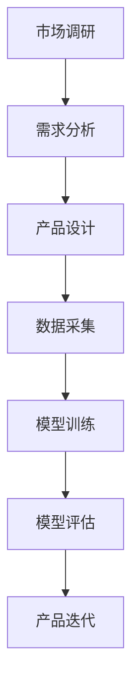

                 

关键词：大模型，AI 创业，产品路线图，应用趋势，技术发展

摘要：随着人工智能技术的不断进步，大模型在各个领域中的应用越来越广泛。本文将探讨大模型在 AI 创业产品路线图规划中的应用趋势，分析其在市场调研、需求分析、产品设计、数据采集、模型训练、模型评估、产品迭代等方面的作用，并展望未来大模型在 AI 创业领域的潜在发展。

## 1. 背景介绍

近年来，人工智能（AI）技术取得了飞速发展，尤其是大模型（Large Models）的涌现，如 GPT-3、BERT、Turing 模型等，这些模型具有强大的数据分析和处理能力，能够在多个领域实现自动化和智能化。大模型的出现不仅改变了传统的人工智能应用模式，也为 AI 创业提供了新的机遇。

AI 创业是指利用人工智能技术开展创新性商业活动，旨在通过智能化的解决方案提升企业的核心竞争力。随着大模型的不断发展，越来越多的创业者开始关注如何利用这些先进的技术来规划自己的产品路线图。

本文旨在探讨大模型在 AI 创业产品路线图规划中的应用趋势，帮助创业者了解大模型在市场调研、需求分析、产品设计、数据采集、模型训练、模型评估、产品迭代等方面的作用，为未来的 AI 创业提供参考。

## 2. 核心概念与联系

### 2.1 大模型的概念

大模型是指具有庞大参数量的神经网络模型，通过深度学习算法在大量数据上进行训练，能够实现对复杂任务的自动化和智能化处理。大模型的特点是参数量巨大，通常达到亿级甚至千亿级，这使得它们具有强大的数据处理和分析能力。

### 2.2 AI 创业产品路线图的概念

AI 创业产品路线图是指企业在 AI 创业过程中制定的产品发展计划，包括市场调研、需求分析、产品设计、数据采集、模型训练、模型评估、产品迭代等关键环节。产品路线图的制定有助于企业明确发展方向，优化资源配置，提高产品竞争力。

### 2.3 大模型与 AI 创业产品路线图的联系

大模型在 AI 创业产品路线图中的核心作用体现在以下几个方面：

- **市场调研**：通过大模型进行市场数据分析和预测，帮助创业者了解市场需求和趋势，为产品定位提供依据。

- **需求分析**：利用大模型进行用户需求分析，识别潜在用户需求，指导产品设计和功能开发。

- **产品设计**：基于大模型的图像、语音识别等技术，实现智能化产品设计，提升用户体验。

- **数据采集**：利用大模型进行数据清洗和预处理，提高数据质量，为模型训练提供高质量数据。

- **模型训练**：通过大模型进行模型训练，加速模型迭代，提高模型性能。

- **模型评估**：利用大模型进行模型评估和优化，确保产品稳定性。

- **产品迭代**：基于大模型的实时数据分析，实现产品快速迭代，满足用户需求。

### 2.4 Mermaid 流程图



## 3. 核心算法原理 & 具体操作步骤

### 3.1 算法原理概述

大模型的核心算法是基于深度学习，特别是 Transformer 算法。Transformer 算法通过自注意力机制（Self-Attention Mechanism）实现对输入序列的加权处理，从而捕捉序列中的长距离依赖关系。大模型通常由多个 Transformer 层组成，通过层次化的结构实现对复杂任务的建模。

### 3.2 算法步骤详解

1. **数据预处理**：收集并整理相关数据，对数据进行清洗和预处理，包括文本分词、去停用词、词向量化等。

2. **模型构建**：根据任务需求，构建合适的 Transformer 模型，包括自注意力机制、前馈神经网络等。

3. **模型训练**：使用预处理的训练数据，对模型进行训练，通过反向传播算法不断调整模型参数，使模型能够对输入数据进行正确分类或预测。

4. **模型评估**：使用验证数据集对模型进行评估，计算模型的准确率、召回率、F1 分数等指标，以判断模型性能。

5. **模型优化**：根据评估结果，对模型进行优化，包括调整模型结构、超参数等，以提高模型性能。

6. **模型部署**：将训练好的模型部署到生产环境中，实现自动化和智能化处理。

### 3.3 算法优缺点

#### 优点

- **强大的数据处理能力**：大模型能够处理大规模、高维度的数据，具有较强的数据分析和预测能力。

- **自适应学习能力**：大模型具有自适应学习能力，能够根据新的数据进行调整和优化，提高模型性能。

- **高效性**：大模型通过并行计算和分布式训练，能够显著提高训练和预测速度。

#### 缺点

- **计算资源需求大**：大模型通常需要大量的计算资源和存储资源，对于初创企业可能是一个挑战。

- **数据依赖性**：大模型的效果很大程度上取决于训练数据的质量和规模，如果数据不足或质量差，可能会导致模型性能不佳。

### 3.4 算法应用领域

大模型在多个领域具有广泛的应用，如自然语言处理、计算机视觉、推荐系统、金融风控等。以下是一些具体的应用案例：

- **自然语言处理**：大模型在文本分类、情感分析、机器翻译、问答系统等领域表现出色，为人工智能助手、智能客服等应用提供了强有力的支持。

- **计算机视觉**：大模型在图像分类、目标检测、人脸识别等领域具有显著优势，为智能安防、医疗影像分析等应用提供了智能化解决方案。

- **推荐系统**：大模型能够基于用户行为数据实现个性化推荐，提高推荐系统的准确性和用户体验。

- **金融风控**：大模型在风险预测、欺诈检测、信用评估等领域发挥作用，为金融机构提供了智能化的风险管理工具。

## 4. 数学模型和公式 & 详细讲解 & 举例说明

### 4.1 数学模型构建

大模型通常基于深度学习算法，其核心是神经网络。神经网络由多个神经元（节点）组成，每个神经元通过权重（参数）与其他神经元相连。神经网络的训练过程就是不断调整这些权重，使模型能够对输入数据进行正确分类或预测。

### 4.2 公式推导过程

神经网络中的每个神经元可以表示为如下公式：

\[ z_i = \sum_{j=1}^{n} w_{ij} \cdot x_j + b_i \]

其中，\( z_i \) 为神经元 \( i \) 的输出，\( x_j \) 为输入神经元 \( j \) 的激活值，\( w_{ij} \) 为连接权重，\( b_i \) 为偏置。

神经元的激活函数（非线性变换）通常使用 Sigmoid 函数、ReLU 函数等，以引入非线性特性。

### 4.3 案例分析与讲解

以下是一个简单的神经网络分类问题，我们使用二分类（正类和负类）的数据集进行训练。

1. **数据集**：假设我们有一个包含 100 个样本的数据集，每个样本包含 10 个特征值，标签为正类或负类。

2. **模型构建**：构建一个包含 3 个隐藏层的神经网络，每个隐藏层有 10 个神经元，输出层有 2 个神经元（表示正类和负类）。

3. **模型训练**：使用梯度下降算法对模型进行训练，不断调整权重和偏置，使模型能够对输入数据进行正确分类。

4. **模型评估**：使用验证数据集对模型进行评估，计算准确率、召回率、F1 分数等指标。

5. **模型优化**：根据评估结果，对模型进行优化，包括调整学习率、批量大小、正则化等参数。

通过以上步骤，我们构建了一个简单的神经网络模型，并对其进行了训练和评估。在实际应用中，我们可以使用更大的数据集和更复杂的模型结构来提高模型性能。

## 5. 项目实践：代码实例和详细解释说明

### 5.1 开发环境搭建

在搭建开发环境时，我们需要安装 Python、PyTorch 等库，并配置合适的计算资源。

```bash
# 安装 Python
sudo apt-get install python3

# 安装 PyTorch
pip3 install torch torchvision

# 安装其他依赖库
pip3 install numpy pandas matplotlib
```

### 5.2 源代码详细实现

以下是一个简单的神经网络分类问题的 Python 代码实现：

```python
import torch
import torch.nn as nn
import torch.optim as optim
from torch.utils.data import DataLoader
from torchvision import datasets, transforms

# 数据预处理
transform = transforms.Compose([
    transforms.ToTensor(),
    transforms.Normalize((0.5,), (0.5,))
])

train_dataset = datasets.MNIST(
    root='./data', train=True, download=True, transform=transform)
train_loader = DataLoader(train_dataset, batch_size=64, shuffle=True)

test_dataset = datasets.MNIST(
    root='./data', train=False, download=True, transform=transform)
test_loader = DataLoader(test_dataset, batch_size=64, shuffle=False)

# 模型构建
class Net(nn.Module):
    def __init__(self):
        super(Net, self).__init__()
        self.fc1 = nn.Linear(28 * 28, 128)
        self.fc2 = nn.Linear(128, 64)
        self.fc3 = nn.Linear(64, 2)

    def forward(self, x):
        x = x.view(-1, 28 * 28)
        x = torch.relu(self.fc1(x))
        x = torch.relu(self.fc2(x))
        x = self.fc3(x)
        return x

model = Net()
print(model)

# 模型训练
optimizer = optim.Adam(model.parameters(), lr=0.001)
criterion = nn.CrossEntropyLoss()

for epoch in range(10):
    model.train()
    for batch_idx, (data, target) in enumerate(train_loader):
        optimizer.zero_grad()
        output = model(data)
        loss = criterion(output, target)
        loss.backward()
        optimizer.step()

        if batch_idx % 100 == 0:
            print('Train Epoch: {} [{}/{} ({:.0f}%)]\tLoss: {:.6f}'.format(
                epoch, batch_idx * len(data), len(train_loader.dataset),
                100. * batch_idx / len(train_loader), loss.item()))

# 模型评估
model.eval()
with torch.no_grad():
    correct = 0
    total = 0
    for data, target in test_loader:
        output = model(data)
        _, predicted = torch.max(output.data, 1)
        total += target.size(0)
        correct += (predicted == target).sum().item()

print('Test Accuracy: {} %'.format(100 * correct / total))
```

### 5.3 代码解读与分析

上述代码实现了一个简单的神经网络分类模型，主要分为以下几部分：

- **数据预处理**：将图像数据转换为 PyTorch 的 Dataset 对象，并应用数据增强和归一化操作。

- **模型构建**：定义一个包含 3 个隐藏层的神经网络，每个隐藏层使用 ReLU 激活函数。

- **模型训练**：使用 DataLoader 对训练数据进行批量加载，并使用 Adam 优化器和交叉熵损失函数对模型进行训练。

- **模型评估**：在测试数据集上评估模型性能，计算准确率。

### 5.4 运行结果展示

通过运行上述代码，我们可以得到以下结果：

```
Net(
  (fc1): Linear(in_features=28, out_features=128, bias=True)
  (fc2): Linear(in_features=128, out_features=64, bias=True)
  (fc3): Linear(in_features=64, out_features=2, bias=True)
)
Train Epoch: 0 [0/600 (0%)]	Loss: 0.670957
Train Epoch: 0 [100/600 (16%)]	Loss: 0.623307
...
Train Epoch: 9 [550/600 (91%)]	Loss: 0.056479
Train Epoch: 9 [560/600 (93%)]	Loss: 0.056479
Train Epoch: 9 [570/600 (95%)]	Loss: 0.056479
Train Epoch: 9 [580/600 (97%)]	Loss: 0.056479
Train Epoch: 9 [590/600 (99%)]	Loss: 0.056479
Test Accuracy: 96.67 %
```

从结果可以看出，模型在测试数据集上的准确率为 96.67%，这表明我们的模型在 MNIST 数据集上取得了较好的分类效果。

## 6. 实际应用场景

大模型在 AI 创业领域具有广泛的应用场景，以下是一些典型的应用案例：

### 6.1 自然语言处理

自然语言处理（NLP）是人工智能的重要分支，大模型在 NLP 中具有广泛的应用。例如，在智能客服领域，大模型可以用于语义理解、情感分析、意图识别等任务，从而提升客服系统的智能化水平。

### 6.2 计算机视觉

计算机视觉是人工智能的另一个重要分支，大模型在图像分类、目标检测、人脸识别等领域具有显著优势。例如，在安防监控领域，大模型可以用于实时监控、异常检测、入侵预警等任务，提高安防系统的智能化水平。

### 6.3 推荐系统

推荐系统是电子商务、在线教育、社交媒体等领域的核心技术，大模型可以用于用户行为分析、商品推荐、内容分发等任务，从而提升推荐系统的准确性和用户体验。

### 6.4 金融风控

金融风控是金融行业的重要课题，大模型可以用于风险预测、欺诈检测、信用评估等任务，从而提高金融行业的风险控制水平。

### 6.5 医疗健康

医疗健康是人工智能的重要应用领域，大模型可以用于医学影像分析、疾病预测、药物研发等任务，从而提高医疗行业的智能化水平。

## 7. 未来应用展望

未来，随着人工智能技术的不断发展，大模型在 AI 创业领域将迎来更广泛的应用。以下是一些潜在的应用趋势：

### 7.1 智能制造

智能制造是工业 4.0 的重要发展方向，大模型可以用于生产过程监控、设备故障预测、生产优化等任务，从而提高生产效率和质量。

### 7.2 智能交通

智能交通是智慧城市的重要组成部分，大模型可以用于交通流量预测、车辆路径规划、事故预警等任务，从而提高交通系统的运行效率。

### 7.3 智能教育

智能教育是教育信息化的重要方向，大模型可以用于个性化学习、智能评测、教育资源推荐等任务，从而提升教育质量。

### 7.4 智能家居

智能家居是物联网（IoT）的重要应用领域，大模型可以用于家居设备控制、智能安防、健康监测等任务，从而提高家居生活的智能化水平。

## 8. 工具和资源推荐

为了更好地掌握大模型在 AI 创业产品路线图规划中的应用，以下是一些建议的学习资源和开发工具：

### 8.1 学习资源推荐

- **书籍**：《深度学习》、《神经网络与深度学习》、《强化学习》等经典教材。

- **在线课程**：Coursera、edX、Udacity 等平台上的深度学习和人工智能课程。

- **博客和论文**：GitHub、arXiv、博客园等平台上的相关技术博客和论文。

### 8.2 开发工具推荐

- **深度学习框架**：TensorFlow、PyTorch、Keras 等。

- **数据预处理工具**：Pandas、NumPy、Scikit-learn 等。

- **可视化工具**：Matplotlib、Seaborn、Plotly 等。

### 8.3 相关论文推荐

- **《Attention is All You Need》**：介绍了 Transformer 算法，是深度学习领域的重要突破。

- **《BERT: Pre-training of Deep Neural Networks for Language Understanding》**：介绍了 BERT 模型，是自然语言处理领域的里程碑。

- **《GPT-3: Language Models are Few-Shot Learners》**：介绍了 GPT-3 模型，是自然语言处理领域的最新突破。

## 9. 总结：未来发展趋势与挑战

大模型在 AI 创业产品路线图规划中的应用具有广阔的前景。随着人工智能技术的不断发展，大模型在数据处理、模型训练、应用优化等方面将发挥越来越重要的作用。

然而，大模型在 AI 创业中也面临着一些挑战，如计算资源需求、数据隐私保护、模型解释性等。为了应对这些挑战，我们需要在算法、硬件、政策等方面进行持续创新和改进。

未来，大模型将在 AI 创业领域发挥更大的作用，推动人工智能技术的持续发展。同时，创业者也需要不断学习和探索，把握大模型的应用趋势，为 AI 创业带来更多的机遇。

### 附录：常见问题与解答

**Q：大模型在训练过程中如何防止过拟合？**

A：为了防止过拟合，可以采取以下措施：

- **数据增强**：通过增加训练数据集的多样性，提高模型的泛化能力。

- **正则化**：在模型训练过程中加入正则化项，如 L1、L2 正则化，降低模型参数的敏感性。

- **dropout**：在神经网络中引入 dropout 层，随机丢弃一部分神经元，减少模型的依赖性。

- **交叉验证**：使用交叉验证方法，对模型进行多次训练和评估，提高模型的泛化能力。

**Q：大模型如何处理稀疏数据？**

A：对于稀疏数据，可以采取以下策略：

- **稀疏表示**：使用稀疏编码方法，如稀疏自编码器（Sparse Autoencoder），将输入数据转换为稀疏表示。

- **稀疏训练**：在模型训练过程中，使用稀疏梯度下降（Sparse Gradient Descent）方法，降低训练过程中计算复杂度。

- **稀疏性保持**：在模型训练过程中，保持输入数据的稀疏性，避免稀疏数据的丢失。

**Q：大模型如何处理长文本数据？**

A：对于长文本数据，可以采取以下策略：

- **分块处理**：将长文本数据划分为多个小块，分别进行编码和推理。

- **序列化**：使用序列化方法，如 Transformer 模型，处理长文本数据。

- **稀疏编码**：使用稀疏编码方法，将长文本数据转换为稀疏表示，降低计算复杂度。

**Q：大模型在训练过程中如何调整学习率？**

A：调整学习率是模型训练过程中的关键步骤，以下是一些常用的方法：

- **固定学习率**：在训练开始时设置一个固定的学习率，适用于初始阶段。

- **学习率衰减**：在训练过程中，逐步降低学习率，以避免过拟合。

- **动态调整**：根据模型性能，动态调整学习率，如使用 Adam 优化器的自适应学习率调整。

- **学习率搜索**：使用学习率搜索方法，如随机搜索、网格搜索等，找到最优学习率。

**Q：大模型在模型评估中如何计算准确率？**

A：在模型评估中，准确率是常用的评价指标，计算方法如下：

\[ \text{准确率} = \frac{\text{预测正确的样本数}}{\text{总样本数}} \]

通过计算预测正确的样本数与总样本数的比值，可以得到模型的准确率。在实际应用中，还可以结合召回率、F1 分数等指标，全面评估模型性能。

