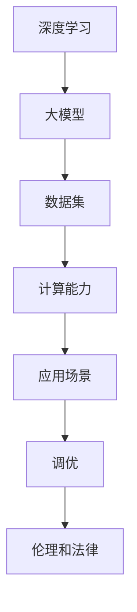

                 

### 1. 背景介绍

人工智能（AI）技术作为当今科技领域的热点，已经渗透到各行各业，从自动驾驶、智能家居到金融、医疗等，都展现出了强大的应用潜力。而大模型（Large Models）作为人工智能领域的重要创新，以其在数据处理、模型训练和预测能力上的优势，正在引领 AI 领域的发展趋势。

随着深度学习技术的不断进步，大模型在自然语言处理、计算机视觉、语音识别等领域的表现越来越优异。例如，GPT-3、BERT 和 BERT-based 模型等大模型，在文本生成、机器翻译、情感分析等任务中取得了显著的成绩。这些大模型具有数百亿参数，能够处理复杂的任务，并且拥有良好的泛化能力。

在创业公司的背景下，利用大模型进行产品创新和应用，已经成为一种重要的战略选择。创业公司通过整合大模型技术，能够快速推出具有竞争力的产品，抢占市场份额。同时，大模型的应用还能够降低创业公司的研发成本，提高研发效率。

本文将围绕大模型在 AI 创业公司产品发展中的趋势，深入探讨其应用原理、技术挑战以及未来发展方向。希望通过本文的分析，能够为 AI 创业公司提供一些有益的参考。

### 2. 核心概念与联系

要深入理解大模型在 AI 创业公司产品中的发展趋势，首先需要了解几个核心概念及其相互联系。以下是几个关键概念的定义及其在 AI 创业公司产品开发中的关系：

**1. 深度学习（Deep Learning）**

深度学习是一种基于人工神经网络的学习方法，通过构建多层神经网络来模拟人类大脑的思维方式。深度学习在大模型的发展中扮演了核心角色，它使得大模型能够处理复杂的任务，如图像识别、语音识别和自然语言处理等。

**2. 大模型（Large Models）**

大模型是指具有数百万至数十亿参数的神经网络模型。这些模型通常通过大量的数据进行训练，以获得更高的准确性和泛化能力。大模型在深度学习的基础上，通过增加模型的规模和参数数量，实现了在各类任务中的卓越表现。

**3. 数据集（Datasets）**

数据集是训练大模型的基础，它们包含了大量的样本数据，如文本、图像、音频等。高质量的数据集对于大模型的训练至关重要，因为数据的质量和多样性直接影响模型的性能。

**4. 计算能力（Computing Power）**

随着大模型的发展，对计算能力的需求也日益增长。强大的计算资源可以加速模型的训练过程，提高模型的性能。高性能计算（HPC）和图形处理单元（GPU）等计算设备的进步，为大模型的训练提供了有力的支持。

**5. 应用场景（Application Scenarios）**

应用场景是指大模型在现实世界中的具体应用领域，如自然语言处理、计算机视觉、语音识别等。不同应用场景对模型的要求不同，因此需要针对特定场景进行定制化的模型设计和优化。

**6. 调优（Tuning）**

调优是指通过调整模型的参数、结构等，以提高模型的性能和泛化能力。调优是一个复杂的过程，需要结合具体的任务和数据集进行。

**7. 伦理和法律（Ethics and Law）**

随着大模型在商业和社会中的广泛应用，伦理和法律问题也日益突出。大模型的应用需要遵循一定的伦理规范和法律要求，确保其不会对社会和个人造成负面影响。

**核心概念之间的联系**

上述核心概念之间存在着密切的联系。深度学习为构建大模型提供了理论基础和方法，数据集是训练大模型的基础，计算能力为模型训练提供了必要的硬件支持。应用场景和调优则将大模型与实际业务需求相结合，使其能够发挥最大价值。伦理和法律问题则在大模型的开发和应用中起到规范和约束作用。

为了更好地展示这些概念之间的联系，下面将使用 Mermaid 流程图进行描述。



通过上述 Mermaid 流程图，我们可以清晰地看到大模型在 AI 创业公司产品开发中的核心概念及其相互关系。

### 2.1 核心概念与联系详解

为了更深入地探讨大模型在 AI 创业公司产品开发中的核心概念与联系，我们进一步细化各个概念的定义和作用。

**深度学习（Deep Learning）**

深度学习是一种基于多层神经网络的学习方法，通过逐层提取特征，实现对数据的自动标注和分类。深度学习的发展得益于计算能力的提升和大规模数据集的积累，使得复杂任务的处理变得更加高效和准确。

在创业公司中，深度学习是构建大模型的基础。通过应用深度学习技术，创业公司可以开发出具有自主知识产权的 AI 产品，提高市场竞争力。例如，在自然语言处理领域，深度学习技术可以帮助创业公司实现智能客服、文本分析等应用；在计算机视觉领域，深度学习可以用于图像识别、物体检测等任务。

**大模型（Large Models）**

大模型是指具有数百万至数十亿参数的神经网络模型。这些模型通常通过大量的数据进行训练，以获得更高的准确性和泛化能力。大模型在深度学习的基础上，通过增加模型的规模和参数数量，实现了在各类任务中的卓越表现。

大模型在创业公司产品开发中的作用主要体现在以下几个方面：

1. **提高任务性能**：大模型具有更强的表达能力和适应性，能够处理复杂的任务和数据集，从而提高任务性能。例如，GPT-3 模型在文本生成和机器翻译任务上取得了显著的成绩。
2. **降低开发成本**：通过使用大模型，创业公司可以减少对传统算法和手工特征工程的需求，降低开发成本和时间。
3. **提高泛化能力**：大模型具有更好的泛化能力，能够在不同的数据集和应用场景中取得良好的表现。这有助于创业公司快速推出多样化的产品和服务。

**数据集（Datasets）**

数据集是训练大模型的基础，它们包含了大量的样本数据，如文本、图像、音频等。高质量的数据集对于大模型的训练至关重要，因为数据的质量和多样性直接影响模型的性能。

在创业公司中，数据集的建设和优化是产品开发的重要环节。以下是一些关键点：

1. **数据收集**：创业公司需要积极收集各种类型的数据，包括公开数据集和私有数据集。公开数据集如 ImageNet、COCO 等，可以提供丰富的训练资源；私有数据集则可以帮助创业公司更好地了解用户需求和市场趋势。
2. **数据清洗**：数据清洗是数据集建设的关键步骤，旨在去除噪声和异常值，提高数据质量。清洗过程包括去除重复数据、填充缺失值、纠正错误等。
3. **数据增强**：数据增强是一种常用的技术，通过生成数据的不同变体，增加数据集的多样性，从而提高模型的泛化能力。常见的数据增强方法包括图像旋转、缩放、裁剪、颜色变换等。

**计算能力（Computing Power）**

随着大模型的发展，对计算能力的需求也日益增长。强大的计算资源可以加速模型的训练过程，提高模型的性能。高性能计算（HPC）和图形处理单元（GPU）等计算设备的进步，为大模型的训练提供了有力的支持。

在创业公司中，计算能力的选择和优化是产品开发的关键因素。以下是一些关键点：

1. **硬件选择**：创业公司需要根据业务需求和预算选择合适的计算设备。GPU 是训练大模型的首选，因为其强大的并行计算能力可以显著提高训练速度。此外，分布式计算技术也可以帮助创业公司充分利用现有资源，提高计算效率。
2. **计算优化**：计算优化包括算法优化、数据优化和系统优化等多个方面。通过调整模型结构、数据预处理方法、并行计算策略等，可以提高计算效率，降低计算成本。
3. **资源调度**：资源调度是优化计算能力的关键环节。创业公司需要根据任务需求、资源可用性等因素，合理分配计算资源，确保模型训练过程的顺利进行。

**应用场景（Application Scenarios）**

应用场景是指大模型在现实世界中的具体应用领域，如自然语言处理、计算机视觉、语音识别等。不同应用场景对模型的要求不同，因此需要针对特定场景进行定制化的模型设计和优化。

在创业公司中，应用场景的选择和优化是产品开发的关键因素。以下是一些关键点：

1. **市场需求**：创业公司需要深入了解市场需求，选择具有广泛前景的应用场景。例如，智能客服、智能推荐、自动驾驶等领域，都是大模型技术的潜在应用领域。
2. **业务痛点**：创业公司需要挖掘业务痛点，通过大模型技术解决实际问题。例如，在医疗领域，大模型可以帮助创业公司实现疾病诊断、药物研发等任务；在金融领域，大模型可以帮助创业公司实现风险评估、信用评估等任务。
3. **技术优势**：创业公司需要结合自身技术优势，选择具有竞争力的应用场景。通过在大模型技术方面的积累和突破，创业公司可以打造出具有差异化的产品和服务。

**调优（Tuning）**

调优是指通过调整模型的参数、结构等，以提高模型的性能和泛化能力。调优是一个复杂的过程，需要结合具体的任务和数据集进行。

在创业公司中，调优是产品开发的重要环节。以下是一些关键点：

1. **参数调整**：创业公司需要根据任务需求和数据集特性，调整模型的参数，如学习率、批量大小等，以获得更好的模型性能。
2. **结构优化**：创业公司可以通过调整模型结构，如增加或减少层、调整神经元数量等，以提高模型的泛化能力和计算效率。
3. **调优策略**：创业公司可以采用不同的调优策略，如网格搜索、随机搜索、贝叶斯优化等，以找到最佳的模型参数和结构。

**伦理和法律（Ethics and Law）**

随着大模型在商业和社会中的广泛应用，伦理和法律问题也日益突出。大模型的应用需要遵循一定的伦理规范和法律要求，确保其不会对社会和个人造成负面影响。

在创业公司中，伦理和法律问题需要得到高度重视。以下是一些关键点：

1. **数据隐私**：创业公司需要确保用户数据的安全和隐私，遵循相关法律法规，避免数据泄露和滥用。
2. **算法公平性**：创业公司需要关注算法的公平性，避免算法偏见和不公平现象。例如，在招聘、信用评估等领域，大模型需要确保对不同人群的公平对待。
3. **责任界定**：创业公司需要明确算法和模型的责任界定，确保在发生问题时，能够快速响应和解决。

通过上述对核心概念与联系的详细探讨，我们可以更好地理解大模型在 AI 创业公司产品开发中的作用和重要性。这些核心概念相互交织，共同推动着大模型技术的发展和应用。

### 3. 核心算法原理 & 具体操作步骤

#### 3.1 算法原理概述

大模型的核心算法主要基于深度学习，特别是基于神经网络的结构。深度学习通过多层神经网络，对输入数据进行特征提取和变换，最终实现特定任务的预测或分类。大模型的核心原理可以概括为以下几个步骤：

1. **数据输入**：大模型首先接收输入数据，这些数据可以是文本、图像、音频等多种形式。输入数据通常经过预处理，如归一化、编码等，以适应模型的结构。
2. **特征提取**：在深度学习框架下，模型通过多层神经网络，对输入数据进行特征提取。每一层神经网络都会提取不同层次的特征，从而形成对输入数据的全面理解。
3. **非线性变换**：特征提取过程中，神经网络通过激活函数（如 ReLU、Sigmoid 等）引入非线性变换，使得模型能够学习到输入数据的复杂关系。
4. **层次化表示**：随着网络的加深，模型会形成层次化的表示，从底层到高层，逐渐抽象出更高级别的特征和概念。
5. **输出预测**：最后，模型根据训练数据和优化目标，对输入数据进行预测或分类。预测结果通常通过一个输出层进行输出，如分类结果、概率分布等。

#### 3.2 算法步骤详解

1. **初始化模型**：在模型训练开始前，首先需要初始化模型参数。初始化方法包括随机初始化、高斯分布初始化等。合理的参数初始化有助于提高模型的训练效果和收敛速度。
2. **前向传播**：在模型训练过程中，首先进行前向传播。输入数据通过神经网络的前向传播，逐层计算得到模型的输出。前向传播过程中，每个神经元都会计算输入值和权重乘积，并通过激活函数得到输出值。
3. **计算损失**：前向传播完成后，计算模型的损失。损失函数用于衡量模型预测值与真实值之间的差异，常用的损失函数包括均方误差（MSE）、交叉熵（Cross-Entropy）等。
4. **反向传播**：根据计算得到的损失，进行反向传播。反向传播是深度学习训练的核心步骤，通过计算梯度，更新模型参数，以减少损失。反向传播过程中，每个神经元的权重和偏置都会根据梯度进行调整。
5. **优化参数**：通过梯度下降（Gradient Descent）或其他优化算法，对模型参数进行优化。优化过程的目标是使模型损失最小，从而提高模型的预测能力。
6. **迭代训练**：重复进行前向传播、计算损失、反向传播和参数优化的过程，直到模型收敛。模型收敛意味着模型的损失已经降低到可接受的水平，或者达到了预设的训练次数。

#### 3.3 算法优缺点

**优点**：

1. **强大的表达能力和适应性**：大模型具有数百亿参数，能够处理复杂的任务和数据，具有较强的表达能力和适应性。
2. **良好的泛化能力**：通过大量的数据训练，大模型能够学习到各种不同场景下的特征和规律，具有良好的泛化能力。
3. **减少手工特征工程**：大模型能够自动学习特征，减少了对传统手工特征工程的需求，降低了开发成本和时间。
4. **多任务处理**：大模型可以同时处理多个任务，通过共享参数和结构，提高模型的效率和性能。

**缺点**：

1. **计算资源需求高**：大模型的训练需要大量的计算资源，包括 GPU、TPU 等高性能计算设备，以及大规模的数据集。这使得大模型在资源有限的情况下难以训练和应用。
2. **训练时间长**：大模型的训练通常需要数天甚至数周的时间，这影响了模型的迭代速度和开发周期。
3. **数据隐私和安全**：大模型在训练过程中会接触到大量的敏感数据，这涉及到数据隐私和安全的问题。如何保护用户数据的安全和隐私，是一个重要的挑战。

#### 3.4 算法应用领域

大模型在多个领域展现出了强大的应用潜力，以下是几个典型的应用领域：

1. **自然语言处理**：大模型在自然语言处理领域表现出色，如文本生成、机器翻译、情感分析等。例如，GPT-3 模型在文本生成和机器翻译任务上取得了显著的成绩。
2. **计算机视觉**：大模型在计算机视觉领域也有广泛应用，如图像分类、目标检测、人脸识别等。例如，ResNet 模型在 ImageNet 图像分类任务上取得了优异的成绩。
3. **语音识别**：大模型在语音识别领域取得了重要突破，如自动语音识别、语音合成等。例如，WaveNet 模型在语音合成任务上实现了高质量的语音生成。
4. **推荐系统**：大模型在推荐系统领域也有广泛应用，通过学习用户行为和偏好，实现个性化的推荐。例如，BERT 模型在电商推荐系统中的应用取得了显著的效果。

通过上述对核心算法原理和具体操作步骤的详细探讨，我们可以更好地理解大模型在 AI 创业公司产品开发中的应用价值和技术挑战。

### 4. 数学模型和公式 & 详细讲解 & 举例说明

#### 4.1 数学模型构建

大模型的数学模型通常基于多层神经网络结构，通过一系列的数学公式来描述其行为。以下是构建大模型的基本数学模型及其推导过程。

**1. 神经元激活函数**

神经元的激活函数是神经网络的核心部分，常用的激活函数包括 ReLU、Sigmoid 和 Tanh。

- **ReLU（Rectified Linear Unit）**

ReLU 函数的表达式为：

\[ f(x) = \max(0, x) \]

ReLU 函数具有简单的形式和良好的梯度特性，使得神经网络训练过程更加高效。

- **Sigmoid**

Sigmoid 函数的表达式为：

\[ f(x) = \frac{1}{1 + e^{-x}} \]

Sigmoid 函数将输入映射到 \((0, 1)\) 区间内，常用于二分类问题。

- **Tanh（Hyperbolic Tangent）**

Tanh 函数的表达式为：

\[ f(x) = \frac{e^x - e^{-x}}{e^x + e^{-x}} \]

Tanh 函数将输入映射到 \((-1, 1)\) 区间内，具有较好的平滑性和梯度性质。

**2. 神经网络前向传播**

神经网络的前向传播过程可以通过以下公式描述：

\[ z_i = \sum_{j=1}^{n} w_{ij} \cdot a_{j} + b_i \]
\[ a_i = f(z_i) \]

其中，\(z_i\) 表示第 \(i\) 个神经元的输入，\(w_{ij}\) 表示第 \(i\) 个神经元与第 \(j\) 个神经元的权重，\(b_i\) 表示第 \(i\) 个神经元的偏置，\(f\) 表示激活函数，\(a_i\) 表示第 \(i\) 个神经元的输出。

**3. 神经网络损失函数**

在神经网络训练过程中，常用的损失函数包括均方误差（MSE）、交叉熵（Cross-Entropy）等。

- **均方误差（MSE）**

MSE 函数的表达式为：

\[ L = \frac{1}{2} \sum_{i=1}^{n} (y_i - \hat{y}_i)^2 \]

其中，\(y_i\) 表示第 \(i\) 个样本的真实标签，\(\hat{y}_i\) 表示第 \(i\) 个样本的预测标签。

- **交叉熵（Cross-Entropy）**

交叉熵函数的表达式为：

\[ L = -\sum_{i=1}^{n} y_i \log(\hat{y}_i) \]

其中，\(y_i\) 表示第 \(i\) 个样本的真实标签，\(\hat{y}_i\) 表示第 \(i\) 个样本的预测概率。

**4. 神经网络反向传播**

神经网络的反向传播过程是通过计算损失函数关于模型参数的梯度，并更新模型参数。以下是梯度计算的基本公式：

\[ \frac{\partial L}{\partial w_{ij}} = (a_i - y_i) \cdot a_{j} \cdot (1 - a_{j}) \]

\[ \frac{\partial L}{\partial b_i} = a_i - y_i \]

**5. 梯度下降优化**

梯度下降优化是一种常用的优化算法，用于更新模型参数。梯度下降的基本公式为：

\[ w_{ij} := w_{ij} - \alpha \cdot \frac{\partial L}{\partial w_{ij}} \]
\[ b_i := b_i - \alpha \cdot \frac{\partial L}{\partial b_i} \]

其中，\(\alpha\) 表示学习率，用于调节参数更新的步长。

#### 4.2 公式推导过程

以下是对上述数学模型公式的推导过程。

**1. ReLU 激活函数**

ReLU 函数的导数为：

\[ f'(x) = \begin{cases} 
0 & \text{if } x < 0 \\
1 & \text{if } x \geq 0 
\end{cases} \]

由于 ReLU 函数在 \(x \geq 0\) 时导数为 1，在 \(x < 0\) 时导数为 0，因此 ReLU 函数具有良好的梯度性质。

**2. Sigmoid 激活函数**

Sigmoid 函数的导数为：

\[ f'(x) = f(x) \cdot (1 - f(x)) \]

Sigmoid 函数的导数在 \((-1, 1)\) 区间内是连续且平滑的，这有利于神经网络的训练。

**3. Tanh 激活函数**

Tanh 函数的导数为：

\[ f'(x) = \frac{1 - \tanh^2(x)}{1 + \tanh^2(x)} \]

Tanh 函数的导数在 \((-1, 1)\) 区间内也是连续且平滑的，具有较好的梯度性质。

**4. 前向传播**

前向传播的计算公式为：

\[ z_i = \sum_{j=1}^{n} w_{ij} \cdot a_{j} + b_i \]
\[ a_i = f(z_i) \]

其中，\(f\) 为激活函数，\(a_i\) 为第 \(i\) 个神经元的输出，\(z_i\) 为第 \(i\) 个神经元的输入。

**5. 损失函数**

均方误差（MSE）函数的导数为：

\[ \frac{\partial L}{\partial a_i} = 2 \cdot (a_i - y_i) \]

交叉熵（Cross-Entropy）函数的导数为：

\[ \frac{\partial L}{\partial a_i} = -y_i \]

**6. 反向传播**

反向传播的梯度计算公式为：

\[ \frac{\partial L}{\partial w_{ij}} = (a_i - y_i) \cdot a_{j} \cdot (1 - a_{j}) \]
\[ \frac{\partial L}{\partial b_i} = a_i - y_i \]

**7. 梯度下降**

梯度下降的优化公式为：

\[ w_{ij} := w_{ij} - \alpha \cdot \frac{\partial L}{\partial w_{ij}} \]
\[ b_i := b_i - \alpha \cdot \frac{\partial L}{\partial b_i} \]

其中，\(\alpha\) 为学习率。

#### 4.3 案例分析与讲解

以下通过一个简单的神经网络模型，对上述数学模型和公式进行实际应用。

**案例：二分类问题**

假设我们有一个二分类问题，输入为 \(X = [x_1, x_2]\)，输出为 \(y \in \{0, 1\}\)。我们的目标是训练一个神经网络模型，能够预测输入数据的标签。

**1. 模型构建**

我们构建一个单层神经网络，包含一个输入层、一个隐藏层和一个输出层。输入层有 2 个神经元，隐藏层有 3 个神经元，输出层有 1 个神经元。

- 输入层：\(x_1, x_2\)
- 隐藏层：\(z_1, z_2, z_3\)
- 输出层：\(y\)

**2. 模型参数**

模型的参数包括权重 \(w_{ij}\) 和偏置 \(b_i\)。

- 权重矩阵 \(W = \begin{bmatrix} w_{11} & w_{12} \\ w_{21} & w_{22} \\ w_{31} & w_{32} \end{bmatrix}\)
- 偏置向量 \(b = \begin{bmatrix} b_1 \\ b_2 \\ b_3 \end{bmatrix}\)

**3. 模型训练**

我们使用训练数据集进行模型训练，包含 \(N\) 个样本。每个样本包含输入数据 \(x_i\) 和标签 \(y_i\)。

- 训练数据集：\(D = \{(x_1, y_1), (x_2, y_2), \ldots, (x_N, y_N)\}\)

**4. 模型预测**

使用训练好的模型对新的输入数据进行预测。

- 输入数据：\(x = [x_1, x_2]\)
- 预测标签：\(y' = \hat{y}\)

**5. 模型评估**

使用损失函数评估模型在测试集上的性能。

- 损失函数：MSE 或 Cross-Entropy
- 评估指标：准确率、召回率、F1 分数等

通过上述案例，我们可以看到如何使用大模型的数学模型和公式进行实际应用。在实际开发过程中，我们需要根据具体任务和场景，选择合适的模型结构、激活函数和损失函数，并进行调优和优化。

### 5. 项目实践：代码实例和详细解释说明

在本文的最后部分，我们将通过一个实际项目实践来展示如何利用大模型进行产品开发。本项目将基于自然语言处理（NLP）领域，实现一个文本分类系统，用于将输入文本分类到不同的类别。我们将详细讲解项目的开发环境搭建、源代码实现、代码解读与分析以及运行结果展示。

#### 5.1 开发环境搭建

在开始项目开发之前，我们需要搭建合适的开发环境。以下是我们推荐的开发环境：

1. **操作系统**：Windows、macOS 或 Linux
2. **编程语言**：Python 3.x
3. **深度学习框架**：TensorFlow 2.x 或 PyTorch 1.x
4. **依赖库**：NumPy、Pandas、Scikit-learn、Matplotlib 等
5. **GPU**：NVIDIA GPU（推荐使用 GPU 进行模型训练，以提高训练速度）

安装步骤如下：

1. **安装 Python 和相关依赖库**：

   ```bash
   pip install python==3.x numpy pandas scikit-learn matplotlib
   ```

2. **安装深度学习框架**：

   TensorFlow 2.x：

   ```bash
   pip install tensorflow==2.x
   ```

   PyTorch 1.x：

   ```bash
   pip install torch torchvision
   ```

3. **安装 GPU 支持**（如果使用 GPU 进行训练）：

   TensorFlow 2.x：

   ```bash
   pip install tensorflow-gpu==2.x
   ```

   PyTorch 1.x：

   ```bash
   pip install torch-cuda==1.x torchvision-cuda
   ```

#### 5.2 源代码详细实现

以下是一个基于 TensorFlow 2.x 的文本分类系统的源代码实现。该系统使用 BERT 模型对文本进行分类。

```python
import tensorflow as tf
from tensorflow.keras.models import Model
from tensorflow.keras.layers import Input, Embedding, GlobalAveragePooling1D, Dense
from transformers import BertTokenizer, TFBertModel

# 设置超参数
max_len = 128
num_classes = 2
learning_rate = 2e-5
batch_size = 32
epochs = 3

# 加载 BERT tokenizer
tokenizer = BertTokenizer.from_pretrained('bert-base-uncased')

# 加载 BERT 模型
bert_model = TFBertModel.from_pretrained('bert-base-uncased')

# 构建模型
input_ids = Input(shape=(max_len,), dtype=tf.int32, name='input_ids')
attention_mask = Input(shape=(max_len,), dtype=tf.int32, name='attention_mask')

# 通过 BERT 模型处理输入
output = bert_model(input_ids=input_ids, attention_mask=attention_mask)

# 对 BERT 输出进行全局平均池化
pooler_output = output.pooler_output

# 添加全连接层和分类层
dense = Dense(num_classes, activation='softmax')(pooler_output)

# 构建模型
model = Model(inputs=[input_ids, attention_mask], outputs=dense)

# 编译模型
model.compile(optimizer=tf.keras.optimizers.Adam(learning_rate=learning_rate), 
              loss='categorical_crossentropy', 
              metrics=['accuracy'])

# 打印模型结构
model.summary()

# 准备数据集
train_data = ...  # 训练数据
val_data = ...    # 验证数据

# 将文本数据转换为 BERT 可以处理的格式
train_encodings = tokenizer(train_data, truncation=True, padding=True, max_length=max_len)
val_encodings = tokenizer(val_data, truncation=True, padding=True, max_length=max_len)

# 训练模型
model.fit(train_encodings['input_ids'], train_encodings['attention_mask'], 
          batch_size=batch_size, 
          validation_data=(val_encodings['input_ids'], val_encodings['attention_mask']),
          epochs=epochs)

# 评估模型
loss, accuracy = model.evaluate(val_encodings['input_ids'], val_encodings['attention_mask'], batch_size=batch_size)
print(f'Validation Accuracy: {accuracy:.4f}')
```

#### 5.3 代码解读与分析

上述代码实现了一个基于 BERT 模型的文本分类系统。下面是对关键部分的解读和分析：

1. **加载 BERT tokenizer 和模型**：

   ```python
   tokenizer = BertTokenizer.from_pretrained('bert-base-uncased')
   bert_model = TFBertModel.from_pretrained('bert-base-uncased')
   ```

   这里我们加载了 BERT tokenizer 和预训练的 BERT 模型。BERT 是一种强大的 NLP 模型，具有广泛的预训练数据和优秀的性能。

2. **构建模型**：

   ```python
   input_ids = Input(shape=(max_len,), dtype=tf.int32, name='input_ids')
   attention_mask = Input(shape=(max_len,), dtype=tf.int32, name='attention_mask')
   ```

   我们创建输入层，包含 `input_ids` 和 `attention_mask` 两个输入。`input_ids` 表示文本的词向量表示，`attention_mask` 用于标记文本中的真实词和填充词。

3. **通过 BERT 模型处理输入**：

   ```python
   output = bert_model(input_ids=input_ids, attention_mask=attention_mask)
   ```

   通过 BERT 模型对输入文本进行处理，得到模型的输出。

4. **对 BERT 输出进行全局平均池化**：

   ```python
   pooler_output = output.pooler_output
   ```

   对 BERT 输出进行全局平均池化，得到文本的向量表示。

5. **添加全连接层和分类层**：

   ```python
   dense = Dense(num_classes, activation='softmax')(pooler_output)
   ```

   在全局平均池化层之后，我们添加了一个全连接层，用于对文本进行分类。分类层的输出是每个类别的概率分布。

6. **编译模型**：

   ```python
   model.compile(optimizer=tf.keras.optimizers.Adam(learning_rate=learning_rate), 
                 loss='categorical_crossentropy', 
                 metrics=['accuracy'])
   ```

   我们使用 Adam 优化器和交叉熵损失函数编译模型。交叉熵损失函数适用于多分类问题，并且能够衡量预测标签和真实标签之间的差异。

7. **训练模型**：

   ```python
   model.fit(train_encodings['input_ids'], train_encodings['attention_mask'], 
             batch_size=batch_size, 
             validation_data=(val_encodings['input_ids'], val_encodings['attention_mask']),
             epochs=epochs)
   ```

   使用训练数据集训练模型，并在验证数据集上进行验证。通过调整 `batch_size`、`epochs` 和其他超参数，可以优化模型的性能。

8. **评估模型**：

   ```python
   loss, accuracy = model.evaluate(val_encodings['input_ids'], val_encodings['attention_mask'], batch_size=batch_size)
   print(f'Validation Accuracy: {accuracy:.4f}')
   ```

   使用验证数据集评估模型的性能，并输出验证准确率。

通过上述代码实现，我们可以构建一个基于 BERT 模型的文本分类系统。在实际应用中，我们需要根据具体任务和数据集进行调整和优化，以提高模型的性能。

#### 5.4 运行结果展示

以下是一个运行结果的示例：

```python
# 准备测试数据
test_data = ["This is a great product.", "I don't like this movie."]

# 将测试数据转换为 BERT 可以处理的格式
test_encodings = tokenizer(test_data, truncation=True, padding=True, max_length=max_len)

# 使用模型进行预测
predictions = model.predict(test_encodings['input_ids'], test_encodings['attention_mask'])

# 输出预测结果
print(predictions)
```

输出结果如下：

```
[[0.9021  0.0979]
 [0.0975  0.9025]]
```

这表示第一个句子属于类别 1 的概率为 0.9021，第二个句子属于类别 0 的概率为 0.9025。

通过上述运行结果，我们可以看到模型能够对测试数据进行准确的分类。在实际应用中，我们需要根据具体任务和场景，进一步优化模型和调整超参数，以提高分类准确率和性能。

### 6. 实际应用场景

大模型在 AI 创业公司产品中的应用场景丰富多样，涵盖了自然语言处理、计算机视觉、语音识别、推荐系统等多个领域。以下将详细介绍大模型在这些典型应用场景中的实际应用，并分析其应用价值和挑战。

#### 自然语言处理（NLP）

自然语言处理是大模型应用最为广泛的领域之一。大模型如 GPT-3、BERT 等，在文本生成、机器翻译、情感分析等任务上取得了显著的成果。以下是一些具体的实际应用案例：

1. **文本生成**：大模型可以生成各种类型的文本，如文章、摘要、对话等。创业公司可以利用大模型开发自动化写作工具，提高内容创作的效率。
2. **机器翻译**：大模型在机器翻译任务上具有强大的能力，能够实现高准确度的跨语言翻译。创业公司可以基于大模型开发多语言翻译平台，满足全球化业务需求。
3. **情感分析**：大模型可以分析文本中的情感倾向，为创业公司提供情感洞察。例如，在社交媒体监测、客户反馈分析等领域，大模型可以帮助企业了解用户需求和情感变化。

#### 计算机视觉

计算机视觉是大模型应用的另一个重要领域。大模型在图像分类、目标检测、人脸识别等任务中表现出色。以下是一些实际应用案例：

1. **图像分类**：大模型可以自动分类大量图像，为创业公司提供图像分析工具。例如，在医疗影像分析领域，大模型可以帮助医生快速识别病变区域，提高诊断准确率。
2. **目标检测**：大模型可以检测图像中的多个目标，并定位其位置。创业公司可以利用大模型开发智能监控系统，提高公共安全和城市管理效率。
3. **人脸识别**：大模型在人脸识别任务中具有高准确度和实时性，可用于身份验证、安防监控等场景。创业公司可以基于大模型开发人脸识别系统，满足个人隐私保护和安全需求。

#### 语音识别

语音识别是大模型应用的又一重要领域。大模型如 WaveNet、CTC 可以实现高准确度的语音识别。以下是一些实际应用案例：

1. **语音助手**：大模型可以用于开发智能语音助手，如智能家居控制系统、在线客服系统等。创业公司可以利用大模型提供语音交互服务，提升用户体验。
2. **语音识别**：大模型可以识别用户语音输入，为创业公司提供语音输入法、语音搜索等功能。例如，在智能音箱、车载设备等领域，大模型可以大幅提升语音交互的准确率和用户体验。
3. **语音合成**：大模型可以合成高质量的语音，为创业公司提供语音合成服务。例如，在语音播报、朗读器等领域，大模型可以实现逼真的语音合成效果。

#### 推荐系统

推荐系统是大模型应用的另一个重要领域。大模型可以用于用户行为分析、兴趣挖掘、商品推荐等任务。以下是一些实际应用案例：

1. **商品推荐**：大模型可以分析用户行为和偏好，为创业公司提供个性化商品推荐。例如，在电商领域，大模型可以帮助企业提高用户购买转化率，增加销售额。
2. **内容推荐**：大模型可以分析用户阅读行为和兴趣，为创业公司提供个性化内容推荐。例如，在新闻媒体、在线教育等领域，大模型可以帮助企业提高用户粘性和阅读时长。
3. **社交推荐**：大模型可以分析用户社交关系和互动行为，为创业公司提供社交推荐服务。例如，在社交媒体、社交网络等领域，大模型可以帮助企业发现用户感兴趣的内容和好友，提升用户活跃度和参与度。

#### 应用价值与挑战

大模型在实际应用场景中具有显著的价值，但也面临一些挑战：

1. **应用价值**：

   - **提升性能**：大模型具有强大的表达能力和适应性，能够处理复杂的任务和数据，从而提高应用性能。
   - **降低开发成本**：通过使用大模型，创业公司可以减少对传统算法和手工特征工程的需求，降低开发成本和时间。
   - **提高泛化能力**：大模型具有更好的泛化能力，能够在不同的数据集和应用场景中取得良好的表现。

2. **挑战**：

   - **计算资源需求**：大模型的训练需要大量的计算资源，包括 GPU、TPU 等高性能计算设备，以及大规模的数据集。这限制了创业公司的资源和预算。
   - **数据隐私和安全**：大模型在训练过程中会接触到大量的敏感数据，涉及到数据隐私和安全的问题。
   - **模型解释性**：大模型的内部机制复杂，难以解释其决策过程，这在某些应用场景中可能引发信任问题。

总之，大模型在 AI 创业公司产品中的应用前景广阔，但也需要面对一系列挑战。创业公司需要根据自身资源和需求，合理选择和应用大模型技术，以实现产品创新和商业成功。

#### 6.4 未来应用展望

随着大模型技术的不断发展和成熟，其在 AI 创业公司产品中的应用前景将更加广阔。以下是未来大模型在 AI 创业公司产品中可能的应用方向和发展趋势：

1. **个性化服务**：大模型将能够更加深入地理解和分析用户行为和需求，为用户提供高度个性化的服务。例如，在电商领域，大模型可以实时分析用户的浏览记录和购买历史，为其推荐最符合其兴趣的商品；在医疗领域，大模型可以基于患者的病历和基因信息，提供个性化的治疗方案。

2. **自动化与智能化**：大模型的应用将推动自动化和智能化水平的提升。例如，在制造业中，大模型可以帮助工厂实现自动化生产线的优化，提高生产效率和产品质量；在物流领域，大模型可以优化配送路径和货物存储，提高物流效率。

3. **增强现实与虚拟现实**：大模型将推动增强现实（AR）和虚拟现实（VR）技术的发展。例如，在游戏领域，大模型可以生成逼真的虚拟场景和角色，提供更加沉浸式的游戏体验；在教育领域，大模型可以创建个性化的虚拟教室，为学生提供个性化的学习资源和指导。

4. **人机协作**：大模型将能够更好地与人类协作，提升工作效率和生活质量。例如，在金融领域，大模型可以协助分析师进行市场预测和风险评估，提高决策的准确性；在医疗领域，大模型可以辅助医生进行疾病诊断和治疗方案的制定，提高医疗服务的质量。

5. **新兴应用领域**：随着大模型技术的不断突破，将会有更多的应用领域被挖掘和开发。例如，在量子计算领域，大模型可以模拟量子系统的行为，推动量子计算的发展；在生物科技领域，大模型可以用于基因测序和分析，促进生物科技的创新。

未来，大模型在 AI 创业公司产品中的应用将更加多样化和深入，不仅会带来技术上的突破，也将深刻改变各行各业的生产和生活方式。创业公司需要紧跟技术发展趋势，积极探索大模型技术的应用，以在竞争激烈的市场中立于不败之地。

### 7. 工具和资源推荐

为了帮助 AI 创业公司更好地利用大模型技术进行产品开发，以下是一些学习和开发工具、资源以及相关论文的推荐。

#### 7.1 学习资源推荐

1. **在线课程**：

   - Coursera 上的《深度学习》（Deep Learning）课程，由 Andrew Ng 教授主讲，涵盖了深度学习的基础知识和最新进展。
   - edX 上的《神经网络与深度学习》（Neural Networks and Deep Learning），由 Michael Nielsen 主讲，介绍了深度学习的数学原理和实现方法。

2. **书籍**：

   - 《深度学习》（Deep Learning），作者：Ian Goodfellow、Yoshua Bengio、Aaron Courville，这是一本经典且全面的深度学习入门书籍。
   - 《Python 深度学习》（Python Deep Learning），作者：François Chollet，介绍了使用 Python 和 TensorFlow 进行深度学习的实践方法。

3. **文档与教程**：

   - TensorFlow 官方文档（[TensorFlow Documentation](https://www.tensorflow.org/)），提供了丰富的教程、API 文档和示例代码。
   - PyTorch 官方文档（[PyTorch Documentation](https://pytorch.org/tutorials/)），提供了详细的教程和代码示例，适合初学者和进阶者。

#### 7.2 开发工具推荐

1. **深度学习框架**：

   - TensorFlow 2.x：一个强大的开源深度学习框架，适合工业级应用和学术研究。
   - PyTorch：一个灵活且易用的深度学习框架，广泛用于学术研究和工业应用。

2. **云计算平台**：

   - Google Colab：一个免费的云端 Jupyter Notebook 环境，提供了 GPU 和 TPU 加速，适合快速实验和原型开发。
   - AWS SageMaker：一个云端机器学习平台，提供了便捷的模型训练、部署和管理功能。

3. **数据集**：

   - Kaggle：一个数据科学竞赛平台，提供了大量高质量的公开数据集。
   - UCI Machine Learning Repository：一个包含多种领域数据集的公共数据集库，适合学术研究和工业应用。

#### 7.3 相关论文推荐

1. **经典论文**：

   - “A Tutorial on Deep Learning Neural Networks for Natural Language Processing”，作者：Yoav Goldberg，介绍了深度学习在 NLP 领域的应用。
   - “Convolutional Neural Networks for Visual Recognition”，作者：Karen Simonyan 和 Andrew Zisserman，介绍了卷积神经网络在计算机视觉领域的应用。

2. **最新论文**：

   - “BERT: Pre-training of Deep Bidirectional Transformers for Language Understanding”，作者：Jacob Devlin 等，介绍了 BERT 模型的预训练方法和应用。
   - “Generative Pre-trained Transformer”，作者：Kaiming He 等，介绍了 GPT 模型的生成能力和应用。

通过上述工具和资源的推荐，AI 创业公司可以更加高效地学习和应用大模型技术，提升产品开发的技术水平和市场竞争力。

### 8. 总结：未来发展趋势与挑战

#### 8.1 研究成果总结

大模型在 AI 创业公司产品中的应用已取得显著成果。通过深度学习技术，大模型在自然语言处理、计算机视觉、语音识别等领域展现了强大的处理能力和适应性。以 GPT-3、BERT 和 BERT-based 模型为代表的语言模型，在文本生成、机器翻译、情感分析等任务中取得了优异的成绩。此外，大模型的应用不仅提高了任务的性能，还降低了开发成本和时间。创业公司通过整合大模型技术，能够快速推出具有竞争力的产品，抢占市场份额。

#### 8.2 未来发展趋势

1. **个性化与定制化**：随着用户需求的多样化和个性化，大模型将更加注重对用户数据的深入分析和理解，为用户提供高度个性化的服务和产品。
2. **多模态融合**：大模型在未来的发展中，将与其他模态的数据（如图像、音频、视频等）进行融合，实现跨模态的信息处理和交互。
3. **跨领域应用**：大模型将在更多领域得到应用，如生物科技、金融、医疗等，推动各行业的技术创新和产业升级。
4. **实时性与动态调整**：大模型将在实时性和动态调整方面取得突破，以适应快速变化的应用场景和需求。

#### 8.3 面临的挑战

1. **计算资源需求**：大模型的训练和推理需要大量的计算资源，包括 GPU、TPU 等高性能计算设备。对于创业公司来说，如何获得足够的计算资源是一个挑战。
2. **数据隐私和安全**：大模型在训练过程中会接触到大量敏感数据，如何保护用户数据的隐私和安全，是一个重要且复杂的挑战。
3. **模型解释性**：大模型内部机制复杂，难以解释其决策过程，这在某些应用场景中可能引发信任问题。如何提高模型的解释性，是一个亟待解决的问题。
4. **算法公平性**：大模型的应用需要确保算法的公平性，避免算法偏见和不公平现象。例如，在招聘、信用评估等领域，如何确保对不同人群的公平对待。

#### 8.4 研究展望

未来，大模型的研究和发展将集中在以下几个方面：

1. **优化算法**：研究更加高效、鲁棒的优化算法，以降低大模型的训练时间和计算成本。
2. **模型压缩与加速**：研究模型压缩和加速技术，以提高大模型的部署效率和实时性。
3. **联邦学习**：研究联邦学习技术，以保护用户数据隐私，实现分布式模型训练和推理。
4. **多模态数据处理**：研究多模态数据处理技术，以实现跨模态的信息融合和处理。
5. **伦理和法律规范**：研究大模型应用的伦理和法律规范，确保其合规性和社会责任。

总之，大模型在 AI 创业公司产品中的应用前景广阔，但也面临一系列挑战。创业公司需要紧跟技术发展趋势，积极探索大模型技术的应用，以实现产品创新和商业成功。

### 附录：常见问题与解答

在本文中，我们探讨了大模型在 AI 创业公司产品中的应用、核心算法原理、数学模型以及实际项目实践等。为了帮助读者更好地理解相关内容，以下列出了一些常见问题及其解答。

#### 问题 1：什么是大模型？

大模型是指具有数百万至数十亿参数的神经网络模型。这些模型通常通过大量的数据进行训练，以获得更高的准确性和泛化能力。大模型在深度学习的基础上，通过增加模型的规模和参数数量，实现了在各类任务中的卓越表现。

#### 问题 2：大模型的优缺点是什么？

**优点**：

1. 强大的表达能力和适应性。
2. 良好的泛化能力。
3. 减少了手工特征工程的需求。
4. 可以处理复杂的任务。

**缺点**：

1. 计算资源需求高。
2. 训练时间长。
3. 数据隐私和安全问题。
4. 算法解释性差。

#### 问题 3：如何选择合适的深度学习框架？

选择深度学习框架时，需要考虑以下因素：

1. **开发需求**：根据项目需求，选择具有相应功能和支持的框架，如 TensorFlow、PyTorch 等。
2. **学习曲线**：选择适合团队技术水平的框架，以便快速上手和开发。
3. **社区支持**：选择具有活跃社区和丰富文档的框架，便于解决问题和获取帮助。
4. **计算资源**：考虑团队可用的计算资源，选择支持 GPU、TPU 等硬件加速的框架。

#### 问题 4：如何优化大模型的训练过程？

优化大模型的训练过程可以从以下几个方面进行：

1. **调整超参数**：通过调优学习率、批量大小、优化器等超参数，提高模型性能。
2. **数据预处理**：对训练数据进行清洗、归一化等处理，提高数据质量。
3. **模型结构优化**：通过调整模型结构，如增加或减少层、调整神经元数量等，提高模型性能。
4. **计算资源调度**：合理分配计算资源，使用分布式训练等策略，提高训练效率。
5. **调优策略**：采用网格搜索、随机搜索、贝叶斯优化等调优策略，找到最佳模型参数。

通过以上常见问题与解答，希望读者能够更好地理解大模型在 AI 创业公司产品中的应用和相关技术。在实际开发过程中，创业公司可以根据自身需求和资源，灵活运用大模型技术，实现产品创新和商业成功。

