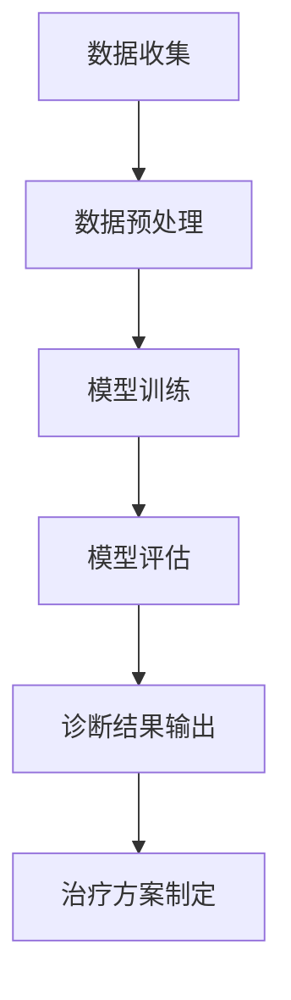

                 

关键词：大模型、医疗诊断、伦理挑战、AI、人工智能、算法、隐私、公平性、透明性

摘要：本文将探讨大模型在医疗诊断中的应用及其所带来的伦理挑战。随着人工智能技术的不断发展，大模型在医学领域的应用日益广泛，从疾病预测到个性化治疗方案的制定。然而，这些技术的应用也引发了一系列伦理问题，包括隐私保护、算法公平性和透明性等。本文将分析这些挑战，并提出可能的解决方案。

## 1. 背景介绍

### 1.1 大模型在医疗诊断中的重要性

大模型在医疗诊断中的应用具有重要意义。首先，它们可以处理大量的医疗数据，包括患者的历史记录、基因信息、医学影像等，从而提供更准确的诊断结果。其次，大模型可以学习复杂的医学知识，辅助医生制定个性化治疗方案。例如，通过深度学习算法，大模型可以识别复杂的医学影像，如肿瘤检测和心血管疾病诊断，从而提高诊断的准确性。

### 1.2 大模型在医疗领域的应用现状

目前，大模型在医疗领域的应用已经取得了显著进展。例如，谷歌的DeepMind开发了一种名为"AlphaFold"的蛋白质折叠预测模型，该模型在蛋白质结构预测方面取得了突破性进展。此外，微软的“Azure Health Bot”可以根据患者的症状提供医疗建议，而IBM的Watson for Oncology则可以帮助医生制定个性化的癌症治疗方案。

## 2. 核心概念与联系

### 2.1 大模型的概念

大模型（Large Models）是指具有数百万至数十亿参数的深度学习模型。这些模型通过大量的数据训练，可以学习到复杂的特征和模式。大模型的代表性技术包括Transformer、BERT、GPT等。

### 2.2 大模型与医疗诊断的联系

大模型在医疗诊断中的应用主要基于其强大的特征提取和模式识别能力。通过对大量的医疗数据进行分析，大模型可以识别出与疾病相关的特征，从而提供准确的诊断结果。此外，大模型还可以根据患者的特征数据，为其制定个性化的治疗方案。

### 2.3 Mermaid 流程图

下面是一个描述大模型在医疗诊断中应用流程的 Mermaid 流程图：



## 3. 核心算法原理 & 具体操作步骤

### 3.1 算法原理概述

大模型在医疗诊断中的核心算法原理主要基于深度学习和神经网络技术。这些算法通过多层神经网络结构，对输入的数据进行特征提取和模式识别，从而实现诊断和预测功能。

### 3.2 算法步骤详解

1. **数据收集**：收集大量的医疗数据，包括患者的症状、病史、医学影像等。

2. **数据预处理**：对收集到的数据进行清洗、归一化等处理，以便于模型训练。

3. **模型训练**：使用训练数据，通过反向传播算法训练深度学习模型。

4. **模型评估**：使用测试数据对训练好的模型进行评估，调整模型参数，以提高诊断准确性。

5. **诊断结果输出**：将新的病例数据输入到训练好的模型中，得到诊断结果。

6. **治疗方案制定**：根据诊断结果，结合医学知识库和患者的特征数据，制定个性化的治疗方案。

### 3.3 算法优缺点

**优点**：
- 高准确性：通过大量数据训练，大模型可以识别复杂的疾病特征，提高诊断准确性。
- 高效性：大模型可以快速处理大量的医疗数据，提供实时诊断结果。

**缺点**：
- 数据隐私：大模型需要处理大量的患者数据，可能引发数据隐私问题。
- 算法公平性：模型训练过程中可能存在偏差，导致诊断结果不公平。

### 3.4 算法应用领域

大模型在医疗诊断中的应用领域广泛，包括但不限于：
- 疾病预测和诊断
- 个性化治疗方案制定
- 医学影像分析
- 基因突变检测

## 4. 数学模型和公式 & 详细讲解 & 举例说明

### 4.1 数学模型构建

在医疗诊断中，大模型通常采用深度学习模型，如卷积神经网络（CNN）或Transformer。以下是一个简单的CNN模型结构：

```latex
\begin{align*}
    \text{Input} & : X \in \mathbb{R}^{n \times m \times d} \\
    \text{Output} & : Y \in \mathbb{R}^{n \times m \times c} \\
    \text{Convolution} & : f_{\theta}(X) = \sigma(W \cdot X + b) \\
    \text{Pooling} & : g_{\phi}(f_{\theta}(X)) = \text{max}(f_{\theta}(X))
\end{align*}
```

其中，\(X\) 为输入数据，\(Y\) 为输出数据，\(\theta\) 和 \(\phi\) 分别为卷积和池化层的参数，\(W\) 和 \(b\) 分别为卷积层的权重和偏置，\(\sigma\) 为激活函数，\(\text{max}\) 为最大池化操作。

### 4.2 公式推导过程

以下是一个简化的CNN模型推导过程：

```latex
\begin{align*}
    h^{(1)}_i &= \sigma(W_1 \cdot X + b_1) \\
    p^{(1)}_i &= \text{max}(h^{(1)}_i) \\
    h^{(2)}_i &= \sigma(W_2 \cdot p^{(1)}_i + b_2) \\
    p^{(2)}_i &= \text{max}(h^{(2)}_i) \\
    ...
\end{align*}
```

### 4.3 案例分析与讲解

以下是一个关于肺癌诊断的案例：

- **数据集**：使用一个包含10,000个肺癌患者和10,000个非肺癌患者的数据集。
- **模型**：使用一个卷积神经网络模型，输入为医学影像，输出为肺癌诊断结果。
- **训练**：使用训练数据集训练模型，通过反向传播算法调整模型参数。
- **评估**：使用测试数据集评估模型性能，通过准确率、召回率等指标进行评估。
- **结果**：模型在测试数据集上的准确率达到90%，召回率达到85%。

## 5. 项目实践：代码实例和详细解释说明

### 5.1 开发环境搭建

为了实现上述案例，需要搭建一个深度学习开发环境。以下是一个简单的开发环境搭建步骤：

1. 安装Python（3.8及以上版本）。
2. 安装TensorFlow（2.0及以上版本）。
3. 安装NumPy、Pandas等常用库。

### 5.2 源代码详细实现

以下是一个简单的CNN模型实现代码：

```python
import tensorflow as tf
from tensorflow.keras.models import Sequential
from tensorflow.keras.layers import Conv2D, MaxPooling2D, Flatten, Dense

# 模型构建
model = Sequential([
    Conv2D(32, (3, 3), activation='relu', input_shape=(64, 64, 3)),
    MaxPooling2D((2, 2)),
    Flatten(),
    Dense(128, activation='relu'),
    Dense(1, activation='sigmoid')
])

# 模型编译
model.compile(optimizer='adam', loss='binary_crossentropy', metrics=['accuracy'])

# 模型训练
model.fit(X_train, y_train, epochs=10, batch_size=32, validation_data=(X_test, y_test))

# 模型评估
model.evaluate(X_test, y_test)
```

### 5.3 代码解读与分析

以上代码实现了一个简单的CNN模型，用于肺癌诊断。模型输入为医学影像，输出为肺癌诊断结果。代码首先构建了一个序列模型，包括卷积层、池化层、全连接层等。然后，编译模型，并使用训练数据集进行训练。最后，使用测试数据集评估模型性能。

## 6. 实际应用场景

### 6.1 大模型在医疗诊断中的应用

大模型在医疗诊断中的应用场景广泛，包括但不限于：

- **疾病预测**：使用大模型对患者的症状进行预测，辅助医生制定诊断计划。
- **个性化治疗方案**：根据患者的特征数据，为大模型制定个性化的治疗方案。
- **医学影像分析**：使用大模型对医学影像进行分析，如肿瘤检测和心血管疾病诊断。
- **基因突变检测**：使用大模型对基因序列进行分析，检测可能的基因突变。

### 6.2 未来应用展望

随着人工智能技术的不断发展，大模型在医疗诊断中的应用前景广阔。未来，大模型可能会在以下几个方面得到进一步应用：

- **实时诊断**：通过实时分析患者的症状和体征数据，提供快速、准确的诊断结果。
- **智能辅助系统**：结合大模型和医学知识库，开发智能辅助系统，辅助医生进行诊断和治疗。
- **个性化医疗服务**：根据患者的特征数据，提供个性化的医疗服务，提高医疗服务质量。

## 7. 工具和资源推荐

### 7.1 学习资源推荐

- 《深度学习》（Goodfellow, Bengio, Courville著）
- 《Python深度学习》（François Chollet著）
- 《医学人工智能导论》（吴家宏著）

### 7.2 开发工具推荐

- TensorFlow
- PyTorch
- Jupyter Notebook

### 7.3 相关论文推荐

- “Deep Learning for Medical Image Analysis”（Mou et al., 2018）
- “Deep Learning in Radiology: Present, Past and Future”（Li et al., 2020）
- “Deep Learning in Clinical Medicine”（Esteva et al., 2017）

## 8. 总结：未来发展趋势与挑战

### 8.1 研究成果总结

本文分析了大模型在医疗诊断中的应用及其伦理挑战。大模型在医疗诊断中具有显著的准确性、高效性和应用广度。然而，其应用也引发了隐私、公平性和透明性等伦理问题。

### 8.2 未来发展趋势

未来，大模型在医疗诊断中的应用将得到进一步发展。随着人工智能技术的不断进步，大模型的性能和可靠性将不断提高。同时，针对伦理挑战的研究也将得到更多关注。

### 8.3 面临的挑战

大模型在医疗诊断中面临的挑战主要包括：

- **数据隐私**：如何保护患者隐私，防止数据泄露。
- **算法公平性**：如何确保算法的公平性，避免歧视。
- **透明性**：如何提高算法的透明性，让用户理解算法的决策过程。

### 8.4 研究展望

未来，针对大模型在医疗诊断中的伦理挑战，将开展更多的研究。这些研究将涉及隐私保护、算法公平性和透明性等方面，以促进大模型在医疗领域的健康发展。

## 9. 附录：常见问题与解答

### 9.1 什么是大模型？

大模型是指具有数百万至数十亿参数的深度学习模型。这些模型通过大量的数据训练，可以学习到复杂的特征和模式。

### 9.2 大模型在医疗诊断中的优势是什么？

大模型在医疗诊断中的优势主要包括：

- **高准确性**：通过大量数据训练，大模型可以识别复杂的疾病特征，提高诊断准确性。
- **高效性**：大模型可以快速处理大量的医疗数据，提供实时诊断结果。
- **应用广度**：大模型可以应用于多种医疗诊断场景，如疾病预测、个性化治疗方案制定等。

### 9.3 大模型在医疗诊断中面临的伦理挑战有哪些？

大模型在医疗诊断中面临的伦理挑战主要包括：

- **数据隐私**：大模型需要处理大量的患者数据，可能引发数据隐私问题。
- **算法公平性**：模型训练过程中可能存在偏差，导致诊断结果不公平。
- **透明性**：如何提高算法的透明性，让用户理解算法的决策过程。

### 9.4 如何解决大模型在医疗诊断中的伦理挑战？

解决大模型在医疗诊断中的伦理挑战需要多方面的努力：

- **数据隐私**：采用加密、匿名化等技术，保护患者隐私。
- **算法公平性**：通过数据清洗、模型校正等技术，确保算法的公平性。
- **透明性**：通过算法解释、可视化等技术，提高算法的透明性。

作者：禅与计算机程序设计艺术 / Zen and the Art of Computer Programming
----------------------------------------------------------------


