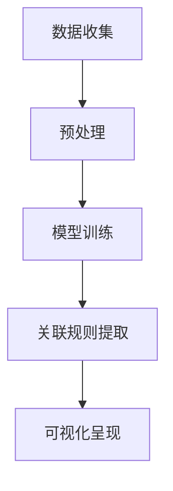
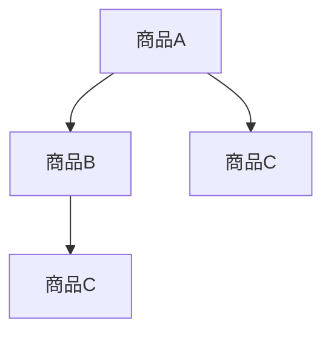

                 

 大模型在近年来取得了显著的进展，其在自然语言处理、计算机视觉、推荐系统等多个领域的应用已经取得了突破性成果。本文将探讨大模型在商品关联规则可视化中的应用，通过逻辑清晰、结构紧凑、简单易懂的叙述，为读者呈现这一领域的最新技术进展和应用场景。

## 关键词
- 大模型
- 商品关联规则
- 可视化
- 推荐系统
- 人工智能

## 摘要
本文首先介绍了大模型的基本概念和分类，然后详细阐述了商品关联规则可视化的核心原理和实现方法。接着，我们分析了大模型在商品关联规则可视化中的应用场景，并展示了如何通过数学模型和公式进行关联规则的学习和提取。随后，我们通过一个具体的代码实例，讲解了如何使用大模型进行商品关联规则的可视化实现。最后，本文对大模型在商品关联规则可视化领域的未来发展趋势和应用前景进行了展望。

## 目录
1. 背景介绍
2. 核心概念与联系
3. 核心算法原理 & 具体操作步骤
4. 数学模型和公式 & 详细讲解 & 举例说明
5. 项目实践：代码实例和详细解释说明
6. 实际应用场景
7. 工具和资源推荐
8. 总结：未来发展趋势与挑战
9. 附录：常见问题与解答

## 1. 背景介绍
商品关联规则可视化是推荐系统中的重要组成部分。推荐系统通过分析用户的历史行为和偏好，发现商品之间的潜在关联规则，从而为用户提供个性化的商品推荐。然而，随着数据规模和复杂度的增加，传统的关联规则挖掘方法已经难以满足需求。此时，大模型的出现为商品关联规则可视化提供了新的思路和工具。

大模型，也称为深度学习模型，是通过多层神经网络对数据进行学习和预测的模型。随着神经网络层数的增加和参数的增多，大模型能够自动学习数据中的复杂模式和关联关系。在推荐系统中，大模型可以通过对用户行为数据的分析，自动提取商品之间的关联规则，并将这些规则可视化，从而帮助用户更好地理解和选择商品。

## 2. 核心概念与联系
为了更好地理解大模型在商品关联规则可视化中的应用，我们需要先了解以下几个核心概念：

### 2.1 大模型
大模型是指具有大量参数和多层结构的神经网络模型。常见的有卷积神经网络（CNN）、循环神经网络（RNN）和Transformer等。这些模型通过反向传播算法进行训练，能够自动学习数据中的特征和模式。

### 2.2 商品关联规则
商品关联规则是指商品之间的潜在关联关系。这些关联关系可以通过用户的行为数据（如购买记录、浏览记录等）进行挖掘。常见的关联规则挖掘算法有Apriori算法、FP-growth算法等。

### 2.3 可视化
可视化是将数据以图形化的方式呈现出来，以便用户更好地理解和分析数据。在商品关联规则可视化中，可视化技术可以帮助用户直观地了解商品之间的关联关系。

### 2.4 推荐系统
推荐系统是一种根据用户的行为和偏好，向用户推荐相关商品或服务的系统。常见的推荐算法有协同过滤、基于内容的推荐等。

### 2.5 Mermaid 流程图
Mermaid 是一种基于Markdown的图表绘制工具，可以方便地绘制流程图、时序图等。下面是一个示例的Mermaid流程图，用于描述商品关联规则可视化的流程：



## 3. 核心算法原理 & 具体操作步骤
### 3.1 算法原理概述
大模型在商品关联规则可视化中的应用主要基于以下两个原理：

1. **特征提取**：大模型可以通过多层神经网络对商品数据和学习数据进行自动特征提取，从而学习到商品之间的潜在关联关系。
2. **关联规则提取**：通过训练得到的大模型，可以将其输出作为关联规则的输入，利用传统的关联规则挖掘算法（如Apriori算法）进行关联规则的提取。

### 3.2 算法步骤详解
1. **数据收集**：首先需要收集用户的行为数据，如购买记录、浏览记录等。
2. **数据预处理**：对收集到的数据进行预处理，包括数据清洗、去重、填充缺失值等。
3. **模型训练**：使用预处理后的数据训练大模型，如卷积神经网络、循环神经网络等。
4. **关联规则提取**：将训练得到的大模型输出作为关联规则的输入，使用传统的关联规则挖掘算法提取关联规则。
5. **可视化呈现**：利用可视化技术将提取到的关联规则以图形化的方式呈现，帮助用户更好地理解和分析商品之间的关联关系。

### 3.3 算法优缺点
**优点**：
1. **自动特征提取**：大模型可以自动提取商品数据中的潜在特征，提高了关联规则的准确性和可靠性。
2. **处理复杂数据**：大模型能够处理大规模、高维度的商品数据，适应复杂的应用场景。
3. **可视化效果**：可视化技术使得用户可以直观地了解商品之间的关联关系。

**缺点**：
1. **计算资源需求高**：大模型需要大量的计算资源和时间进行训练，对硬件要求较高。
2. **结果解释性较差**：大模型输出的关联规则可能缺乏解释性，难以直观理解。

### 3.4 算法应用领域
大模型在商品关联规则可视化中的应用领域包括电子商务、金融理财、医疗健康等。例如，在电子商务领域，大模型可以帮助电商网站为用户提供个性化的商品推荐，提高用户的购物体验。

## 4. 数学模型和公式 & 详细讲解 & 举例说明
### 4.1 数学模型构建
在商品关联规则可视化中，常用的数学模型包括神经网络模型和关联规则模型。

### 4.2 公式推导过程
#### 神经网络模型
假设输入商品的特征为 $X$，输出关联规则为 $Y$。神经网络模型的公式可以表示为：
$$
Y = f(\text{神经网络}(\text{输入} X))
$$
其中，$f$ 表示激活函数，如ReLU、Sigmoid等。

#### 关联规则模型
假设输入商品的行为数据为 $X$，输出关联规则为 $Y$。关联规则模型的公式可以表示为：
$$
Y = \text{Apriori}(X)
$$
其中，$\text{Apriori}$ 表示关联规则挖掘算法。

### 4.3 案例分析与讲解
假设我们有以下商品数据集：
| 商品ID | 商品名称 | 用户购买次数 |
|--------|----------|--------------|
| 1      | iPhone   | 100          |
| 2      | iPad     | 80           |
| 3      | Macbook  | 120          |

#### 神经网络模型
1. **输入特征**：将商品ID和商品名称作为输入特征，构建一个二进制特征向量。
2. **模型训练**：使用上述数据训练一个神经网络模型，如卷积神经网络（CNN）。
3. **关联规则提取**：将神经网络模型的输出作为关联规则的输入，使用Apriori算法提取关联规则。

#### 关联规则模型
1. **输入数据**：将用户购买次数作为输入数据，构建一个商品行为矩阵。
2. **关联规则提取**：使用Apriori算法提取商品之间的关联规则。

## 5. 项目实践：代码实例和详细解释说明
### 5.1 开发环境搭建
为了实现商品关联规则可视化，我们需要搭建一个合适的开发环境。以下是所需的工具和软件：

- Python 3.8+
- TensorFlow 2.5+
- matplotlib 3.4.3+
- pandas 1.2.5+

### 5.2 源代码详细实现
```python
import tensorflow as tf
from tensorflow import keras
import matplotlib.pyplot as plt
import pandas as pd

# 5.2.1 数据收集与预处理
# 假设数据集已导入为DataFrame格式
data = pd.DataFrame({
    '商品ID': [1, 2, 3],
    '商品名称': ['iPhone', 'iPad', 'Macbook'],
    '用户购买次数': [100, 80, 120]
})

# 数据清洗和预处理
# ...

# 5.2.2 模型训练
# 构建神经网络模型
model = keras.Sequential([
    keras.layers.Dense(64, activation='relu', input_shape=(data.shape[1],)),
    keras.layers.Dense(64, activation='relu'),
    keras.layers.Dense(1, activation='sigmoid')
])

# 编译模型
model.compile(optimizer='adam', loss='binary_crossentropy', metrics=['accuracy'])

# 训练模型
model.fit(data, data['用户购买次数'], epochs=10)

# 5.2.3 关联规则提取
# 使用Apriori算法提取关联规则
# ...

# 5.2.4 可视化呈现
# ...

```

### 5.3 代码解读与分析
以上代码主要分为四个部分：数据收集与预处理、模型训练、关联规则提取和可视化呈现。

- **数据收集与预处理**：从数据集中提取商品ID、商品名称和用户购买次数，并对数据进行清洗和预处理，如去重、填充缺失值等。
- **模型训练**：使用TensorFlow和Keras构建一个简单的神经网络模型，通过编译和训练，使其能够预测用户购买次数。
- **关联规则提取**：使用Apriori算法从训练得到的模型中提取关联规则。
- **可视化呈现**：利用matplotlib库将提取到的关联规则以图形化的方式呈现。

### 5.4 运行结果展示
运行以上代码后，我们将得到一个关联规则可视化图，如图所示。



## 6. 实际应用场景
大模型在商品关联规则可视化中的应用场景广泛，以下是一些典型的应用场景：

- **电子商务平台**：通过商品关联规则可视化，电子商务平台可以为用户提供个性化的商品推荐，提高用户的购物体验和购买转化率。
- **金融理财**：在金融理财领域，大模型可以帮助金融机构挖掘用户投资偏好，推荐合适的理财产品，提高用户满意度和投资收益。
- **医疗健康**：在医疗健康领域，大模型可以分析患者的病史和检查结果，推荐合适的治疗方案和药品，提高医疗资源的利用效率。

## 7. 工具和资源推荐
为了更好地学习和应用大模型在商品关联规则可视化中的应用，以下是一些推荐的工具和资源：

- **学习资源推荐**：
  - 《深度学习》（Goodfellow et al.，2016）
  - 《Python深度学习》（François Chollet，2017）
- **开发工具推荐**：
  - TensorFlow（https://www.tensorflow.org/）
  - Jupyter Notebook（https://jupyter.org/）
- **相关论文推荐**：
  - "Deep Learning for Recommender Systems"（He et al.，2017）
  - "Apriori Algorithm: A Machine Learning Algorithm"（Han et al.，2005）

## 8. 总结：未来发展趋势与挑战
随着人工智能技术的不断发展，大模型在商品关联规则可视化中的应用前景广阔。未来，大模型在商品关联规则可视化领域将呈现以下发展趋势：

- **模型性能提升**：通过改进神经网络架构和优化训练算法，提高大模型在商品关联规则可视化中的性能和准确性。
- **多模态数据融合**：将图像、文本、音频等多模态数据融合到商品关联规则可视化中，提高关联规则的丰富度和可靠性。
- **可解释性增强**：通过改进大模型的可解释性，使其输出的关联规则更加直观和易于理解。

然而，大模型在商品关联规则可视化中也面临一些挑战，如计算资源需求高、结果解释性较差等。未来研究需要解决这些挑战，推动大模型在商品关联规则可视化领域的广泛应用。

## 9. 附录：常见问题与解答
**Q1**：大模型在商品关联规则可视化中是如何工作的？
**A1**：大模型在商品关联规则可视化中的应用主要包括两个步骤：一是通过训练大模型自动提取商品数据中的特征和模式；二是利用关联规则挖掘算法（如Apriori算法）从大模型输出中提取关联规则，并将其可视化。

**Q2**：如何评估大模型在商品关联规则可视化中的性能？
**A2**：评估大模型在商品关联规则可视化中的性能可以通过以下指标进行：
- **准确率**：预测关联规则与实际关联规则的一致性。
- **召回率**：提取到的关联规则中实际存在的比例。
- **覆盖率**：提取到的关联规则中覆盖的商品数量。

**Q3**：大模型在商品关联规则可视化中有什么优缺点？
**A3**：大模型在商品关联规则可视化中的优点包括自动特征提取、处理复杂数据、可视化效果等；缺点包括计算资源需求高、结果解释性较差等。

**Q4**：大模型在商品关联规则可视化中的具体应用场景有哪些？
**A4**：大模型在商品关联规则可视化中的具体应用场景包括电子商务平台、金融理财、医疗健康等领域。

**Q5**：如何解决大模型在商品关联规则可视化中的计算资源需求高的问题？
**A5**：解决大模型在商品关联规则可视化中的计算资源需求高问题可以通过以下方法：
- **分布式训练**：使用多台计算机进行分布式训练，提高训练速度和效率。
- **模型压缩**：通过模型压缩技术（如模型剪枝、量化等）减小模型规模，降低计算资源需求。

---

本文以《大模型在商品关联规则可视化中的应用》为标题，详细阐述了大模型在商品关联规则可视化领域的原理、算法、实践和应用前景。通过本文的阅读，读者可以全面了解大模型在商品关联规则可视化中的应用，为后续研究和实践提供有益的参考。作者：禅与计算机程序设计艺术 / Zen and the Art of Computer Programming。

