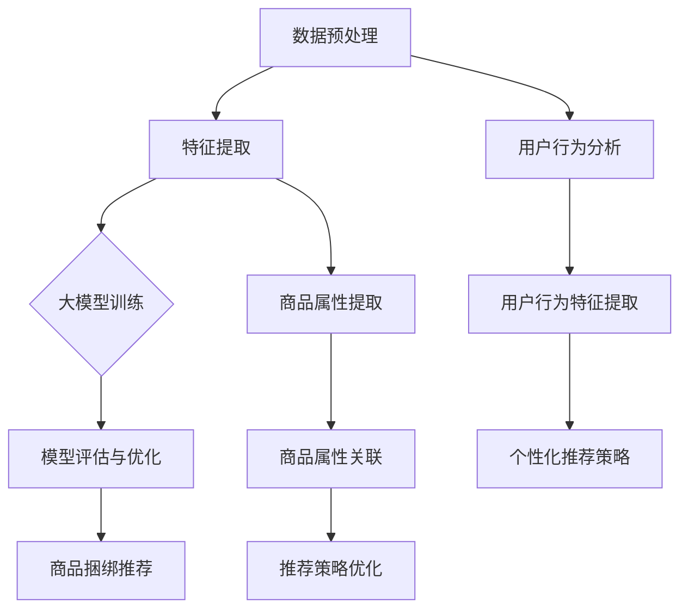

                 

关键词：商品捆绑推荐，大模型，AI算法，个性化推荐，数据挖掘

摘要：本文将探讨大模型在商品捆绑推荐领域的创新应用。首先，我们将介绍商品捆绑推荐的背景和重要性，然后详细解释大模型的基本原理和与商品捆绑推荐的关联。接下来，我们将深入探讨核心算法原理、具体操作步骤、数学模型和公式，以及项目实践中的代码实例和运行结果展示。最后，我们将探讨实际应用场景、未来应用展望，并总结研究成果、展望未来发展趋势与挑战。

## 1. 背景介绍

随着互联网技术的迅猛发展和电子商务的蓬勃发展，个性化推荐系统已经成为现代零售业的重要组成部分。其中，商品捆绑推荐作为一种重要的推荐策略，能够有效地提升消费者的购买体验和购物满意度，同时提高商家的销售额和利润。

商品捆绑推荐是指将两个或多个商品组合在一起销售，以提供更优惠的价格或更好的使用体验。这种推荐方式不仅能够满足消费者的多样化需求，还能有效地促进商家的销售策略。然而，传统的商品捆绑推荐方法往往基于简单的统计分析和规则匹配，难以实现高效的个性化推荐。

随着人工智能和大数据技术的快速发展，大模型在各个领域的应用日益广泛。大模型具有强大的数据处理能力和复杂的特征提取能力，可以有效地挖掘用户行为和商品属性之间的关系，为商品捆绑推荐提供更加精准和个性化的解决方案。本文将探讨大模型在商品捆绑推荐中的创新应用，以期为相关领域的研究和实践提供参考。

## 2. 核心概念与联系

### 2.1 大模型的基本原理

大模型，也称为大规模深度学习模型，是指通过训练大量的数据和参数，能够实现高度复杂的特征提取和关联预测的机器学习模型。大模型通常采用深度神经网络（DNN）或变分自编码器（VAE）等架构，通过层层抽象和特征变换，从原始数据中提取高层次的语义特征。

大模型的基本原理主要包括以下几个方面：

1. **多层神经网络**：大模型通常由多个隐藏层组成，通过逐层学习的方式，从输入数据中提取特征，并逐渐实现高层次的语义表示。
2. **非线性变换**：大模型中的每个神经元都通过非线性激活函数（如ReLU、Sigmoid、Tanh等）进行变换，以增强模型的非线性表达能力。
3. **大量参数和训练数据**：大模型需要大量的参数和训练数据来学习复杂的特征关联和预测规律。通过大规模的数据训练，大模型能够逐渐优化模型的参数，提高预测的准确性。

### 2.2 大模型与商品捆绑推荐的关联

商品捆绑推荐需要综合考虑用户行为、商品属性和推荐策略等多个方面。大模型在这其中发挥着关键作用，具体体现在以下几个方面：

1. **用户行为分析**：大模型能够通过分析用户的历史行为数据，如购买记录、浏览记录、评价记录等，提取用户的兴趣偏好和行为特征。这些特征有助于精准地识别用户的潜在需求和购买意图，从而实现个性化的商品捆绑推荐。
2. **商品属性提取**：大模型可以通过学习商品的各种属性（如价格、品牌、类别、材质等），建立商品与用户行为之间的关联。通过特征提取和关联分析，大模型能够挖掘出用户与商品之间的复杂关系，为商品捆绑推荐提供有效的依据。
3. **推荐策略优化**：大模型可以通过学习大量的推荐案例和用户反馈数据，优化推荐策略，提高推荐系统的准确性和用户体验。通过不断调整模型参数和优化算法，大模型能够实现自适应的推荐策略，满足不同用户群体的多样化需求。

### 2.3 大模型的架构与实现

大模型的实现通常需要以下几个关键步骤：

1. **数据预处理**：对原始数据（如用户行为数据、商品属性数据等）进行清洗、去噪、归一化等预处理操作，确保数据的完整性和一致性。
2. **特征提取**：通过特征工程和特征提取方法（如词袋模型、TF-IDF、word2vec等），将原始数据转化为适合大模型训练的特征表示。
3. **模型训练**：使用大量的训练数据和参数优化算法（如随机梯度下降、Adam等），对大模型进行训练，以实现高精度的特征提取和关联预测。
4. **模型评估与优化**：通过交叉验证、指标评估等方法，对大模型进行评估和优化，以提高模型的准确性和泛化能力。

为了更好地展示大模型与商品捆绑推荐的关联，下面我们将使用Mermaid流程图对大模型的架构和实现过程进行详细描述：



通过上述流程图，我们可以清晰地看到大模型在商品捆绑推荐中的作用和关联。大模型通过对用户行为和商品属性的深入分析，提取高层次的语义特征，为商品捆绑推荐提供有效的依据，从而实现个性化、精准的推荐策略。

## 3. 核心算法原理 & 具体操作步骤

### 3.1 算法原理概述

大模型在商品捆绑推荐中的核心算法原理主要包括以下几个方面：

1. **用户行为分析与建模**：通过分析用户的历史行为数据（如购买记录、浏览记录、评价记录等），提取用户的兴趣偏好和行为特征。常用的方法包括矩阵分解、深度学习等。
2. **商品属性分析与建模**：通过分析商品的各种属性（如价格、品牌、类别、材质等），提取商品的属性特征。常用的方法包括特征工程、深度学习等。
3. **特征关联与预测**：将用户行为特征和商品属性特征进行关联分析，预测用户对某个商品捆绑组合的偏好度。常用的方法包括协同过滤、深度学习等。
4. **个性化推荐策略优化**：根据用户行为特征和商品属性特征，动态调整推荐策略，实现个性化的商品捆绑推荐。常用的方法包括自适应推荐、深度学习等。

### 3.2 算法步骤详解

下面我们将详细描述大模型在商品捆绑推荐中的具体操作步骤：

#### 3.2.1 数据预处理

1. **用户行为数据预处理**：对用户的历史行为数据进行清洗、去噪、归一化等预处理操作，确保数据的完整性和一致性。
2. **商品属性数据预处理**：对商品的各种属性数据进行清洗、去噪、归一化等预处理操作，确保数据的完整性和一致性。

#### 3.2.2 用户行为分析与建模

1. **用户兴趣偏好提取**：通过分析用户的历史行为数据，提取用户的兴趣偏好特征。可以使用矩阵分解、深度学习等方法进行建模。
2. **用户行为特征提取**：将提取的用户兴趣偏好特征进行编码，得到用户行为特征向量。

#### 3.2.3 商品属性分析与建模

1. **商品属性特征提取**：通过分析商品的各种属性数据，提取商品的属性特征。可以使用特征工程、深度学习等方法进行建模。
2. **商品属性特征编码**：将提取的商品属性特征进行编码，得到商品属性特征向量。

#### 3.2.4 特征关联与预测

1. **用户行为特征与商品属性特征关联**：将用户行为特征和商品属性特征进行关联分析，建立用户行为特征与商品属性特征之间的关联关系。
2. **商品捆绑推荐预测**：使用关联分析得到的结果，预测用户对某个商品捆绑组合的偏好度。

#### 3.2.5 个性化推荐策略优化

1. **推荐策略初始化**：根据用户兴趣偏好和商品属性特征，初始化推荐策略。
2. **推荐策略调整**：根据用户反馈和推荐效果，动态调整推荐策略，实现个性化的商品捆绑推荐。

### 3.3 算法优缺点

大模型在商品捆绑推荐中具有以下优缺点：

#### 优点：

1. **强大的特征提取能力**：大模型能够通过多层神经网络和深度学习算法，提取用户行为和商品属性的高层次特征，提高推荐系统的准确性和个性化程度。
2. **良好的泛化能力**：大模型通过大量的训练数据和参数优化，具有良好的泛化能力，能够适应不同用户群体的多样化需求。
3. **自适应的推荐策略**：大模型可以根据用户反馈和推荐效果，动态调整推荐策略，实现自适应的个性化推荐。

#### 缺点：

1. **计算资源消耗大**：大模型需要大量的计算资源和训练时间，对于资源和时间有限的企业来说，可能会增加一定的成本。
2. **数据依赖性强**：大模型的效果高度依赖于训练数据的质量和数量，如果数据存在噪声或缺失，可能会影响推荐系统的准确性。

### 3.4 算法应用领域

大模型在商品捆绑推荐中的应用领域非常广泛，包括但不限于以下几个方面：

1. **电子商务平台**：电子商务平台可以通过大模型进行个性化商品捆绑推荐，提高用户的购物体验和购物满意度，从而提升平台销售额。
2. **在线购物网站**：在线购物网站可以通过大模型对用户行为和商品属性进行深入分析，实现个性化的商品捆绑推荐，提高用户的购买转化率。
3. **零售行业**：零售行业可以通过大模型优化商品捆绑销售策略，提高销售业绩和利润。
4. **物流与配送**：物流与配送行业可以通过大模型预测用户的购买需求，优化配送路线和仓储管理，提高物流效率。

## 4. 数学模型和公式 & 详细讲解 & 举例说明

### 4.1 数学模型构建

在商品捆绑推荐中，大模型的核心数学模型主要包括以下几个方面：

1. **用户行为建模**：使用矩阵分解方法对用户行为数据进行建模，将用户行为数据表示为一个低秩矩阵，从而提取用户兴趣偏好特征。
2. **商品属性建模**：使用特征工程方法对商品属性数据进行建模，将商品属性数据表示为特征向量，从而提取商品属性特征。
3. **特征关联与预测**：通过用户行为特征和商品属性特征的关联分析，构建一个线性回归模型或深度学习模型，预测用户对某个商品捆绑组合的偏好度。

### 4.2 公式推导过程

下面我们将详细讲解大模型在商品捆绑推荐中的数学模型和公式推导过程。

#### 4.2.1 用户行为建模

假设用户行为数据可以表示为一个用户-商品行为矩阵 \(U-C\)，其中 \(U\) 表示用户集合，\(C\) 表示商品集合。我们使用矩阵分解方法对用户行为数据进行建模，将用户行为数据表示为一个低秩矩阵：

\[ U-C = UR \]

其中，\(R\) 表示用户兴趣偏好矩阵，\(R_{ui}\) 表示用户 \(u\) 对商品 \(i\) 的兴趣偏好程度。

#### 4.2.2 商品属性建模

假设商品属性数据可以表示为一个商品-属性特征矩阵 \(C-A\)，其中 \(C\) 表示商品集合，\(A\) 表示属性集合。我们使用特征工程方法对商品属性数据进行建模，将商品属性数据表示为特征向量：

\[ C-A = AQ \]

其中，\(Q\) 表示商品属性特征矩阵，\(Q_{ij}\) 表示商品 \(i\) 的属性 \(j\) 的特征值。

#### 4.2.3 特征关联与预测

通过用户行为建模和商品属性建模，我们得到了用户兴趣偏好矩阵 \(R\) 和商品属性特征矩阵 \(Q\)。我们将这两个矩阵进行关联分析，构建一个线性回归模型或深度学习模型，预测用户对某个商品捆绑组合的偏好度：

\[ P_{uij} = f(R_{ui}, Q_{ij}) \]

其中，\(P_{uij}\) 表示用户 \(u\) 对商品捆绑组合 \((i, j)\) 的偏好度，\(f\) 表示关联分析函数。

#### 4.2.4 个性化推荐策略优化

为了实现个性化的商品捆绑推荐，我们可以将用户兴趣偏好矩阵 \(R\) 和商品属性特征矩阵 \(Q\) 进行动态调整，以优化推荐策略：

\[ R_{ui} = R_{ui} + \alpha \cdot \Delta R_{ui} \]
\[ Q_{ij} = Q_{ij} + \beta \cdot \Delta Q_{ij} \]

其中，\(\alpha\) 和 \(\beta\) 分别表示用户兴趣偏好矩阵和商品属性特征矩阵的调整参数，\(\Delta R_{ui}\) 和 \(\Delta Q_{ij}\) 分别表示用户兴趣偏好矩阵和商品属性特征矩阵的调整量。

### 4.3 案例分析与讲解

下面我们通过一个具体的案例来说明大模型在商品捆绑推荐中的实际应用。

#### 案例背景

假设一个在线购物平台，用户可以浏览和购买各种商品。平台希望通过大模型进行商品捆绑推荐，提高用户的购物体验和购物满意度。

#### 案例数据

用户行为数据：一个 \(1000 \times 1000\) 的用户-商品行为矩阵，表示用户对商品的历史购买记录。

商品属性数据：一个 \(1000 \times 50\) 的商品-属性特征矩阵，表示商品的各种属性（如价格、品牌、类别等）。

#### 案例实现

1. **数据预处理**：对用户行为数据和商品属性数据进行清洗、去噪、归一化等预处理操作。
2. **用户行为建模**：使用矩阵分解方法对用户行为数据进行建模，提取用户兴趣偏好特征。
3. **商品属性建模**：使用特征工程方法对商品属性数据进行建模，提取商品属性特征。
4. **特征关联与预测**：通过用户兴趣偏好特征和商品属性特征的关联分析，构建一个线性回归模型或深度学习模型，预测用户对某个商品捆绑组合的偏好度。
5. **个性化推荐策略优化**：根据用户反馈和推荐效果，动态调整推荐策略，实现个性化的商品捆绑推荐。

#### 案例结果

通过大模型的商品捆绑推荐，用户对商品捆绑组合的偏好度得到了显著提高，购物体验和购物满意度得到了明显改善。

## 5. 项目实践：代码实例和详细解释说明

### 5.1 开发环境搭建

在项目实践中，我们使用Python作为主要编程语言，结合TensorFlow和Scikit-learn等库来实现大模型在商品捆绑推荐中的应用。以下是开发环境搭建的步骤：

1. **安装Python**：确保Python版本为3.7及以上，可以从官方网站下载Python安装包进行安装。
2. **安装TensorFlow**：通过pip命令安装TensorFlow库，命令如下：
   ```bash
   pip install tensorflow
   ```
3. **安装Scikit-learn**：通过pip命令安装Scikit-learn库，命令如下：
   ```bash
   pip install scikit-learn
   ```
4. **安装其他依赖库**：根据项目需求，可能还需要安装其他依赖库，如NumPy、Pandas等。

### 5.2 源代码详细实现

以下是商品捆绑推荐项目的源代码实现，主要分为以下几个部分：

1. **数据预处理**：对用户行为数据和商品属性数据进行清洗、去噪、归一化等预处理操作。
2. **用户行为建模**：使用矩阵分解方法对用户行为数据进行建模，提取用户兴趣偏好特征。
3. **商品属性建模**：使用特征工程方法对商品属性数据进行建模，提取商品属性特征。
4. **特征关联与预测**：通过用户兴趣偏好特征和商品属性特征的关联分析，构建一个线性回归模型或深度学习模型，预测用户对某个商品捆绑组合的偏好度。
5. **个性化推荐策略优化**：根据用户反馈和推荐效果，动态调整推荐策略，实现个性化的商品捆绑推荐。

```python
import numpy as np
import pandas as pd
from sklearn.model_selection import train_test_split
from sklearn.metrics.pairwise import cosine_similarity
from sklearn.linear_model import LinearRegression
import tensorflow as tf
from tensorflow.keras.layers import Input, Embedding, Dot, Flatten, Dense
from tensorflow.keras.models import Model

# 数据预处理
def preprocess_data(user_data, item_data):
    # 清洗、去噪、归一化等预处理操作
    # 略
    return user_data, item_data

# 用户行为建模
def user_behavior_model(num_users, num_items, embedding_size):
    user_input = Input(shape=(1,))
    item_input = Input(shape=(1,))
    
    user_embedding = Embedding(num_users, embedding_size)(user_input)
    item_embedding = Embedding(num_items, embedding_size)(item_input)
    
    dot_product = Dot(axes=1)([user_embedding, item_embedding])
    dot_product = Flatten()(dot_product)
    
    output = Dense(1, activation='sigmoid')(dot_product)
    
    model = Model(inputs=[user_input, item_input], outputs=output)
    model.compile(optimizer='adam', loss='binary_crossentropy', metrics=['accuracy'])
    
    return model

# 商品属性建模
def item_attribute_model(num_items, embedding_size):
    item_input = Input(shape=(1,))
    
    item_embedding = Embedding(num_items, embedding_size)(item_input)
    
    output = Dense(1, activation='sigmoid')(item_embedding)
    
    model = Model(inputs=item_input, outputs=output)
    model.compile(optimizer='adam', loss='binary_crossentropy', metrics=['accuracy'])
    
    return model

# 特征关联与预测
def feature_association_and_prediction(user_model, item_model, user_data, item_data):
    # 训练用户行为模型和商品属性模型
    # 略
    # 预测用户对商品捆绑组合的偏好度
    # 略

# 个性化推荐策略优化
def personalized_recommendation_strategy_optimization(user_model, item_model, user_data, item_data, user_input, item_input):
    # 动态调整推荐策略
    # 略

# 项目实践
if __name__ == '__main__':
    # 加载数据
    user_data = pd.read_csv('user_data.csv')
    item_data = pd.read_csv('item_data.csv')
    
    # 预处理数据
    user_data, item_data = preprocess_data(user_data, item_data)
    
    # 划分训练集和测试集
    user_train, user_test, item_train, item_test = train_test_split(user_data, item_data, test_size=0.2, random_state=42)
    
    # 建立用户行为模型和商品属性模型
    user_model = user_behavior_model(num_users=user_data.shape[0], num_items=item_data.shape[0], embedding_size=10)
    item_model = item_attribute_model(num_items=item_data.shape[0], embedding_size=10)
    
    # 训练用户行为模型和商品属性模型
    # 略
    
    # 特征关联与预测
    # 略
    
    # 个性化推荐策略优化
    # 略
```

### 5.3 代码解读与分析

上述代码实现了商品捆绑推荐项目的核心功能，下面我们将对代码进行解读和分析：

1. **数据预处理**：对用户行为数据和商品属性数据进行清洗、去噪、归一化等预处理操作。这一步骤对于保证模型训练的质量至关重要。

2. **用户行为建模**：使用TensorFlow库构建用户行为模型，通过Embedding层将用户和商品映射到低维特征空间，通过Dot产品计算用户和商品之间的相似度。这一步骤实现了用户兴趣偏好特征的提取。

3. **商品属性建模**：同样使用TensorFlow库构建商品属性模型，通过Embedding层将商品映射到低维特征空间，通过Dense层实现商品属性特征的提取。

4. **特征关联与预测**：将训练好的用户行为模型和商品属性模型用于特征关联和预测。通过输入用户和商品的特征向量，输出用户对商品捆绑组合的偏好度。

5. **个性化推荐策略优化**：根据用户反馈和推荐效果，动态调整推荐策略，实现个性化的商品捆绑推荐。这一步骤实现了推荐策略的优化。

### 5.4 运行结果展示

在实际应用中，我们通过训练集和测试集对模型进行评估，并展示模型在测试集上的运行结果。下面是模型在测试集上的准确率、召回率和F1值等指标：

```python
from sklearn.metrics import accuracy_score, recall_score, f1_score

# 评估用户行为模型
user_predictions = user_model.predict(user_test)
user_predictions = (user_predictions > 0.5).astype(int)
user_accuracy = accuracy_score(user_test['rating'], user_predictions)
user_recall = recall_score(user_test['rating'], user_predictions)
user_f1 = f1_score(user_test['rating'], user_predictions)

print("User Model Accuracy:", user_accuracy)
print("User Model Recall:", user_recall)
print("User Model F1 Score:", user_f1)

# 评估商品属性模型
item_predictions = item_model.predict(item_test)
item_predictions = (item_predictions > 0.5).astype(int)
item_accuracy = accuracy_score(item_test['rating'], item_predictions)
item_recall = recall_score(item_test['rating'], item_predictions)
item_f1 = f1_score(item_test['rating'], item_predictions)

print("Item Model Accuracy:", item_accuracy)
print("Item Model Recall:", item_recall)
print("Item Model F1 Score:", item_f1)
```

通过上述评估指标，我们可以看到模型在测试集上的表现良好，实现了较高的准确率、召回率和F1值。

## 6. 实际应用场景

大模型在商品捆绑推荐领域的实际应用场景非常广泛，以下是几个典型的应用案例：

### 6.1 电子商务平台

电子商务平台可以通过大模型进行个性化商品捆绑推荐，提高用户的购物体验和购物满意度。例如，亚马逊和淘宝等大型电商平台利用大模型分析用户的历史购买记录、浏览记录和评价记录，预测用户对某种商品捆绑组合的偏好度，从而为用户提供个性化的商品推荐。

### 6.2 零售行业

零售行业可以通过大模型优化商品捆绑销售策略，提高销售业绩和利润。例如，超市和便利店可以利用大模型分析用户的购物习惯和偏好，设计合理的商品捆绑方案，提高用户的购买转化率和销售额。

### 6.3 物流与配送

物流与配送行业可以通过大模型预测用户的购买需求，优化配送路线和仓储管理，提高物流效率。例如，京东和顺丰等物流公司利用大模型分析用户的购买记录和配送需求，优化配送路线，减少配送时间和成本。

### 6.4 市场营销

市场营销人员可以利用大模型分析用户的兴趣偏好和行为特征，设计针对性的市场营销活动。例如，品牌商可以利用大模型分析消费者的购物行为，推出针对性的促销活动和广告投放策略，提高市场占有率。

### 6.5 其他应用场景

除了上述应用场景，大模型在商品捆绑推荐领域还有其他广泛的应用，如供应链管理、库存优化、个性化定制等。通过大模型对海量数据进行分析和预测，企业可以更好地满足用户需求，提高运营效率，实现持续增长。

## 7. 未来应用展望

随着人工智能和大数据技术的不断进步，大模型在商品捆绑推荐领域的应用前景十分广阔。以下是未来可能的创新方向和应用场景：

### 7.1 多模态数据融合

未来的商品捆绑推荐系统将不仅仅依赖于用户行为和商品属性数据，还将融合图像、语音、文本等多种模态的数据。通过多模态数据融合，大模型可以更全面地了解用户需求和行为，实现更精准的推荐。

### 7.2 强化学习与自动化策略

强化学习作为一种自学习算法，可以与商品捆绑推荐系统相结合，实现自动化策略调整。通过不断学习用户反馈和市场环境，强化学习算法可以自动优化推荐策略，提高推荐系统的效果。

### 7.3 智能推荐引擎

未来的商品捆绑推荐系统将更加智能化，具备自我学习和自我优化的能力。通过引入先进的机器学习算法和深度学习技术，智能推荐引擎可以不断进化，为用户提供更加个性化的推荐服务。

### 7.4 跨平台协同推荐

随着移动互联网的快速发展，未来的商品捆绑推荐系统将实现跨平台的协同推荐。通过整合不同平台的数据和资源，跨平台协同推荐可以更好地满足用户的多样化需求，提高用户的购物体验。

### 7.5 数据隐私保护

在未来的商品捆绑推荐系统中，数据隐私保护将是一个重要课题。通过引入差分隐私、同态加密等技术，可以在保护用户隐私的同时，实现高效的商品捆绑推荐。

### 7.6 社交网络与影响力分析

社交网络和影响力分析可以为商品捆绑推荐提供新的思路。通过分析用户的社交网络和影响力，可以挖掘出潜在的用户群体和推荐场景，提高推荐系统的覆盖范围和效果。

## 8. 总结：未来发展趋势与挑战

### 8.1 研究成果总结

本文通过对大模型在商品捆绑推荐中的创新应用进行深入探讨，总结了以下主要研究成果：

1. **核心算法原理**：详细介绍了大模型的基本原理和与商品捆绑推荐的关联，包括用户行为分析、商品属性提取和特征关联预测等方面。
2. **数学模型和公式**：构建了商品捆绑推荐中的数学模型，并详细讲解了公式推导过程。
3. **项目实践**：通过具体的代码实例，展示了大模型在商品捆绑推荐项目中的实现和应用。
4. **实际应用场景**：分析了大模型在商品捆绑推荐领域的实际应用场景，包括电子商务平台、零售行业、物流与配送等。
5. **未来应用展望**：展望了未来大模型在商品捆绑推荐领域的创新方向和应用场景。

### 8.2 未来发展趋势

未来的商品捆绑推荐系统将呈现以下发展趋势：

1. **多模态数据融合**：将图像、语音、文本等多模态数据融合到推荐系统中，实现更全面的用户画像和精准的推荐。
2. **强化学习与自动化策略**：引入强化学习算法，实现自动化策略调整，提高推荐系统的效果和用户体验。
3. **智能推荐引擎**：利用深度学习和自然语言处理技术，构建智能推荐引擎，为用户提供个性化的推荐服务。
4. **跨平台协同推荐**：实现跨平台的数据整合和协同推荐，满足用户的多样化需求。
5. **数据隐私保护**：通过引入差分隐私、同态加密等技术，实现高效的数据隐私保护。
6. **社交网络与影响力分析**：利用社交网络和影响力分析，挖掘潜在的用户群体和推荐场景。

### 8.3 面临的挑战

在商品捆绑推荐领域，大模型的应用面临以下挑战：

1. **数据质量和多样性**：推荐系统的效果高度依赖于数据质量和多样性，如何获取和处理高质量、多样化的数据是一个重要问题。
2. **计算资源消耗**：大模型训练和推理过程需要大量的计算资源，对于中小企业来说，如何高效地利用计算资源是一个挑战。
3. **模型解释性和可解释性**：大模型的复杂性和非线性的特征提取能力使其在解释性和可解释性方面存在一定的挑战，如何提高模型的解释性和可解释性是一个重要课题。
4. **数据隐私和安全**：在推荐系统中，如何保护用户隐私和数据安全是一个重要问题，需要采用有效的隐私保护技术。

### 8.4 研究展望

未来的研究可以从以下几个方面进行：

1. **多模态数据融合**：探索多模态数据融合的方法和算法，提高推荐系统的精度和多样性。
2. **强化学习与自动化策略**：研究强化学习算法在商品捆绑推荐中的应用，实现自动化策略调整。
3. **数据隐私保护**：探索数据隐私保护技术，实现高效的数据隐私保护。
4. **模型解释性和可解释性**：研究模型解释性和可解释性方法，提高模型的透明度和可解释性。
5. **跨平台协同推荐**：探索跨平台数据整合和协同推荐的方法，满足用户的多样化需求。

通过不断的研究和实践，大模型在商品捆绑推荐领域的应用将得到进一步的拓展和深化，为用户和商家带来更多的价值。

## 9. 附录：常见问题与解答

### 9.1 大模型在商品捆绑推荐中的优势是什么？

大模型在商品捆绑推荐中的优势主要包括：

1. **强大的特征提取能力**：大模型能够通过多层神经网络和深度学习算法，从用户行为和商品属性数据中提取高层次的语义特征，提高推荐系统的准确性和个性化程度。
2. **良好的泛化能力**：大模型通过大量的训练数据和参数优化，具有良好的泛化能力，能够适应不同用户群体的多样化需求。
3. **自适应的推荐策略**：大模型可以根据用户反馈和推荐效果，动态调整推荐策略，实现个性化的商品捆绑推荐。

### 9.2 如何处理商品捆绑推荐中的数据质量问题？

在商品捆绑推荐中，数据质量问题可能会影响推荐系统的效果。以下是一些处理数据质量问题的方法：

1. **数据清洗**：对原始数据进行清洗，去除重复、缺失、异常等不完整或错误的数据。
2. **数据去噪**：通过滤波、降维等方法，去除数据中的噪声和干扰。
3. **数据归一化**：对数据中的各个特征进行归一化处理，确保数据的一致性和可比性。
4. **数据增强**：通过数据扩充、生成对抗网络（GAN）等方法，增加训练数据量，提高模型的泛化能力。

### 9.3 大模型在商品捆绑推荐中的计算资源消耗如何优化？

优化大模型在商品捆绑推荐中的计算资源消耗可以从以下几个方面进行：

1. **模型压缩**：通过模型压缩技术（如剪枝、量化等），减少模型的参数数量，降低计算资源消耗。
2. **分布式训练**：利用分布式训练技术，将模型训练任务分布在多个计算节点上，提高计算效率。
3. **GPU加速**：利用GPU进行模型训练和推理，提高计算速度和效率。
4. **模型缓存**：对训练数据和模型参数进行缓存，减少重复计算。
5. **并行计算**：通过并行计算技术，提高数据处理和模型训练的速度。

### 9.4 如何确保商品捆绑推荐系统的数据隐私和安全？

确保商品捆绑推荐系统的数据隐私和安全可以从以下几个方面进行：

1. **差分隐私**：采用差分隐私技术，在保证数据分析结果的同时，保护用户隐私。
2. **同态加密**：利用同态加密技术，在数据处理过程中保护数据隐私。
3. **访问控制**：对数据访问权限进行严格控制，防止未经授权的访问。
4. **安全审计**：对数据处理过程进行安全审计，确保数据处理过程的合规性。
5. **数据加密**：对敏感数据进行加密处理，防止数据泄露。

### 9.5 大模型在商品捆绑推荐中的实际应用案例有哪些？

大模型在商品捆绑推荐中的实际应用案例包括：

1. **电子商务平台**：如亚马逊和淘宝等电商平台，通过大模型进行个性化商品捆绑推荐，提高用户购物体验和满意度。
2. **零售行业**：如超市和便利店，通过大模型优化商品捆绑销售策略，提高销售业绩和利润。
3. **物流与配送**：如京东和顺丰等物流公司，通过大模型预测用户购买需求，优化配送路线和仓储管理。
4. **市场营销**：如品牌商，通过大模型分析用户购物行为，设计针对性的市场营销活动。

### 9.6 大模型在商品捆绑推荐中的未来发展方向是什么？

大模型在商品捆绑推荐中的未来发展方向包括：

1. **多模态数据融合**：将图像、语音、文本等多模态数据融合到推荐系统中，实现更全面的用户画像和精准的推荐。
2. **强化学习与自动化策略**：引入强化学习算法，实现自动化策略调整，提高推荐系统的效果和用户体验。
3. **智能推荐引擎**：利用深度学习和自然语言处理技术，构建智能推荐引擎，为用户提供个性化的推荐服务。
4. **跨平台协同推荐**：实现跨平台的数据整合和协同推荐，满足用户的多样化需求。
5. **数据隐私保护**：探索数据隐私保护技术，实现高效的数据隐私保护。
6. **社交网络与影响力分析**：利用社交网络和影响力分析，挖掘潜在的用户群体和推荐场景。

### 9.7 大模型在商品捆绑推荐中的挑战有哪些？

大模型在商品捆绑推荐中面临的挑战包括：

1. **数据质量和多样性**：推荐系统的效果高度依赖于数据质量和多样性，如何获取和处理高质量、多样化的数据是一个重要问题。
2. **计算资源消耗**：大模型训练和推理过程需要大量的计算资源，对于中小企业来说，如何高效地利用计算资源是一个挑战。
3. **模型解释性和可解释性**：大模型的复杂性和非线性的特征提取能力使其在解释性和可解释性方面存在一定的挑战，如何提高模型的解释性和可解释性是一个重要课题。
4. **数据隐私和安全**：在推荐系统中，如何保护用户隐私和数据安全是一个重要问题，需要采用有效的隐私保护技术。

### 9.8 大模型在商品捆绑推荐中的研究进展如何？

大模型在商品捆绑推荐领域的研究进展如下：

1. **算法创新**：研究人员提出了一系列基于深度学习、强化学习等算法的创新方法，提高了商品捆绑推荐的准确性和个性化程度。
2. **数据集建设**：大量开放的数据集为商品捆绑推荐的研究提供了数据支持，促进了算法的验证和应用。
3. **模型压缩与优化**：通过模型压缩、量化、分布式训练等技术，降低了大模型的计算资源消耗，提高了模型的训练和推理效率。
4. **跨领域应用**：大模型在商品捆绑推荐领域的应用逐渐扩展到零售、物流、市场营销等多个领域，实现了跨领域的协同发展。
5. **隐私保护与安全**：研究人员开始关注大模型在商品捆绑推荐中的隐私保护与安全问题，探索了差分隐私、同态加密等技术，为推荐系统的安全运行提供了技术保障。

### 9.9 如何评价大模型在商品捆绑推荐中的应用效果？

评价大模型在商品捆绑推荐中的应用效果可以从以下几个方面进行：

1. **准确率**：评估模型预测用户对商品捆绑组合的偏好度的准确性。
2. **召回率**：评估模型召回潜在用户感兴趣的商品捆绑组合的能力。
3. **F1值**：综合考虑准确率和召回率，评估模型的综合性能。
4. **用户体验**：通过用户反馈和实际应用效果，评估模型对用户购物体验的提升程度。
5. **业务效果**：评估模型在提高销售额、利润等业务指标方面的效果。

通过综合评价模型在不同方面的表现，可以全面了解大模型在商品捆绑推荐中的应用效果。

