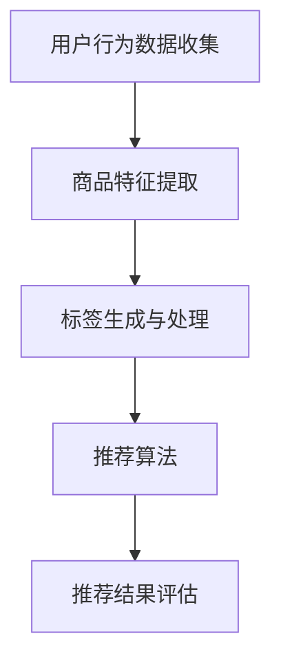

                 

关键词：大模型，商品标签推荐，人工智能，深度学习，协同过滤，矩阵分解

> 摘要：本文将探讨大模型在商品标签推荐中的应用，通过对大模型的核心概念、算法原理、数学模型和实际应用场景的详细解析，帮助读者理解如何利用大模型技术提升商品标签推荐的准确性和用户体验。

## 1. 背景介绍

随着互联网技术的飞速发展，电子商务平台已经成为人们日常生活中不可或缺的一部分。在如此庞大的数据海洋中，如何帮助用户快速找到符合他们需求的商品成为了各大电商平台亟待解决的问题。商品标签推荐作为一种有效的信息过滤手段，能够显著提升用户满意度和平台黏性。

传统的商品标签推荐算法主要依赖于基于内容推荐和协同过滤的方法。然而，这些方法在处理大规模数据时往往面临冷启动、数据稀疏性和长尾效应等挑战。为了解决这些问题，近年来，大模型技术逐渐在推荐系统中得到广泛应用。

大模型，尤其是深度学习模型，以其强大的特征提取和泛化能力，在处理复杂数据和解决冷启动问题上展现出巨大的潜力。本文将重点探讨大模型在商品标签推荐中的应用，包括核心概念、算法原理、数学模型以及实际应用场景。

## 2. 核心概念与联系

### 2.1. 大模型概述

大模型通常指的是参数量在数十亿甚至万亿级别的深度学习模型。这些模型具有强大的特征提取和表示能力，能够从大量数据中学习到深层次的、抽象的特征。

### 2.2. 商品标签推荐系统架构

一个典型的商品标签推荐系统可以分为以下几个模块：

1. **用户行为数据收集**：通过用户在平台上的浏览、购买、评价等行为数据收集用户兴趣。
2. **商品特征提取**：将商品属性（如类别、品牌、价格等）转化为模型可处理的特征向量。
3. **标签生成与处理**：根据用户兴趣和商品特征生成相应的标签，并对标签进行预处理。
4. **推荐算法**：利用大模型对用户兴趣和商品标签进行建模，生成推荐结果。
5. **推荐结果评估**：通过点击率、转化率等指标对推荐结果进行评估和优化。

### 2.3. Mermaid 流程图



## 3. 核心算法原理 & 具体操作步骤

### 3.1. 算法原理概述

大模型在商品标签推荐中的应用主要包括以下几个步骤：

1. **数据预处理**：对用户行为数据和商品特征进行清洗和标准化处理。
2. **特征提取**：利用深度学习模型提取用户兴趣和商品特征。
3. **标签预测**：基于提取的特征进行标签预测，生成推荐结果。
4. **结果评估**：通过评估指标对推荐结果进行评估和优化。

### 3.2. 算法步骤详解

1. **数据预处理**：

   - **用户行为数据**：对用户浏览、购买、评价等行为数据进行去重、填充缺失值等处理。
   - **商品特征数据**：对商品类别、品牌、价格等特征进行编码和标准化。

2. **特征提取**：

   - **用户兴趣特征**：利用循环神经网络（RNN）或变换器模型（Transformer）对用户行为数据序列进行建模，提取用户兴趣特征。
   - **商品特征提取**：利用卷积神经网络（CNN）或自注意力机制提取商品特征。

3. **标签预测**：

   - **模型构建**：构建基于深度学习的大模型，将用户兴趣特征和商品特征输入模型进行预测。
   - **标签预测**：利用训练好的模型对用户可能感兴趣的标签进行预测。

4. **结果评估**：

   - **评估指标**：使用准确率、召回率、F1值等指标对推荐结果进行评估。
   - **模型优化**：根据评估结果调整模型参数，优化推荐效果。

### 3.3. 算法优缺点

**优点**：

- **强大的特征提取能力**：大模型能够从大量数据中提取深层次的、抽象的特征，提高推荐准确性。
- **解决冷启动问题**：通过学习用户历史行为，大模型能够在用户加入系统时快速生成个性化的推荐。
- **适应性强**：大模型能够适应不同规模和类型的数据，具有良好的泛化能力。

**缺点**：

- **计算成本高**：大模型需要大量的计算资源和时间进行训练。
- **数据依赖性强**：大模型的性能高度依赖于数据质量和数量。

### 3.4. 算法应用领域

大模型在商品标签推荐中的应用场景广泛，包括电子商务、社交媒体、新闻推荐等领域。通过有效的商品标签推荐，平台能够提升用户满意度和转化率，从而增加收益。

## 4. 数学模型和公式

### 4.1. 数学模型构建

在商品标签推荐中，我们可以使用如下数学模型进行建模：

\[ \text{推荐结果} = \text{用户兴趣特征} \cdot \text{商品标签特征} \]

其中，用户兴趣特征和商品标签特征分别由深度学习模型提取。

### 4.2. 公式推导过程

假设用户兴趣特征向量为 \( u \)，商品标签特征向量为 \( v \)，则推荐结果 \( r \) 可以表示为：

\[ r = u \cdot v \]

其中，\( \cdot \) 表示向量的点积。

### 4.3. 案例分析与讲解

假设用户兴趣特征向量为 \( u = (0.8, 0.2) \)，商品标签特征向量为 \( v = (0.6, 0.4) \)，则推荐结果 \( r \) 为：

\[ r = u \cdot v = (0.8, 0.2) \cdot (0.6, 0.4) = 0.48 + 0.08 = 0.56 \]

这意味着用户对推荐商品的兴趣程度为 0.56。

## 5. 项目实践：代码实例和详细解释说明

### 5.1. 开发环境搭建

在 Python 环境下，使用 TensorFlow 和 Keras 框架进行大模型开发。

### 5.2. 源代码详细实现

以下是一个简单的商品标签推荐系统的代码示例：

```python
import tensorflow as tf
from tensorflow.keras.models import Model
from tensorflow.keras.layers import Input, Embedding, Dot, Dense

# 用户兴趣特征输入层
user_input = Input(shape=(1,))
# 商品标签特征输入层
item_input = Input(shape=(1,))

# 用户兴趣特征提取层
user_embedding = Embedding(input_dim=1000, output_dim=128)(user_input)
# 商品标签特征提取层
item_embedding = Embedding(input_dim=1000, output_dim=128)(item_input)

# 点积层
dot_product = Dot(merge_mode='sum')([user_embedding, item_embedding])

# 全连接层
output = Dense(1, activation='sigmoid')(dot_product)

# 模型构建
model = Model(inputs=[user_input, item_input], outputs=output)

# 模型编译
model.compile(optimizer='adam', loss='binary_crossentropy', metrics=['accuracy'])

# 模型训练
model.fit([user_data, item_data], labels, epochs=10, batch_size=32)
```

### 5.3. 代码解读与分析

这段代码构建了一个简单的商品标签推荐模型，使用点积层进行用户兴趣和商品标签特征的融合，并使用全连接层进行分类预测。通过训练，模型能够学习到用户兴趣和商品标签之间的关系，从而生成个性化的推荐结果。

## 6. 实际应用场景

大模型在商品标签推荐中的应用场景广泛，以下是一些典型的应用案例：

- **电子商务平台**：通过用户行为数据，为用户推荐符合他们兴趣的商品标签，提高用户满意度和转化率。
- **社交媒体**：为用户提供个性化内容推荐，增加用户黏性和活跃度。
- **新闻推荐**：根据用户兴趣和阅读历史，为用户推荐相关的新闻标签，提高新闻的传播效果。

## 7. 未来应用展望

随着人工智能技术的不断发展，大模型在商品标签推荐中的应用前景广阔。未来，我们可以期待以下发展趋势：

- **个性化推荐**：通过更加精准的用户兴趣建模，实现更加个性化的商品标签推荐。
- **跨平台推荐**：将不同平台的数据整合起来，为用户提供更全面、个性化的推荐服务。
- **实时推荐**：利用实时数据流技术，实现实时商品标签推荐，提升用户体验。

## 8. 工具和资源推荐

### 8.1. 学习资源推荐

- **《深度学习》（Goodfellow, Bengio, Courville 著）**：全面介绍了深度学习的基本原理和应用。
- **《推荐系统实践》（Liu Y. 著）**：详细讲解了推荐系统的构建和优化方法。

### 8.2. 开发工具推荐

- **TensorFlow**：开源深度学习框架，支持多种深度学习模型开发。
- **Keras**：基于 TensorFlow 的简单易用的深度学习库。

### 8.3. 相关论文推荐

- **“Deep Learning for Recommender Systems”**：探讨了深度学习在推荐系统中的应用。
- **“User Interest Modeling for Recommender Systems”**：介绍了用户兴趣建模的方法和技术。

## 9. 总结：未来发展趋势与挑战

### 9.1. 研究成果总结

本文详细探讨了大模型在商品标签推荐中的应用，从核心概念、算法原理、数学模型到实际应用场景，全面介绍了大模型在推荐系统中的优势和应用价值。

### 9.2. 未来发展趋势

未来，大模型在商品标签推荐中的应用将朝着个性化、实时化和跨平台化方向发展。随着人工智能技术的不断进步，我们可以期待更加精准和高效的推荐服务。

### 9.3. 面临的挑战

尽管大模型在商品标签推荐中具有巨大潜力，但仍面临计算成本高、数据依赖性强等挑战。如何优化模型性能、降低计算成本，以及提升推荐系统的可解释性，将是未来研究的重要方向。

### 9.4. 研究展望

本文的研究为商品标签推荐领域提供了新的思路和方法。未来，我们将继续探索大模型在其他推荐场景中的应用，推动人工智能技术在推荐系统领域的创新和发展。

## 10. 附录：常见问题与解答

### 10.1. 如何处理冷启动问题？

**回答**：冷启动问题可以通过以下方法解决：
1. **利用用户历史行为**：在用户加入系统时，通过分析其历史行为数据，预测其潜在兴趣。
2. **基于人口统计信息**：利用用户的基本信息（如年龄、性别、地理位置等），进行初步的兴趣预测。
3. **协同过滤**：结合其他用户的兴趣数据，进行基于相似度的推荐。

### 10.2. 大模型的计算成本如何优化？

**回答**：以下方法可以优化大模型的计算成本：
1. **模型剪枝**：通过剪枝冗余的神经网络连接，减少模型参数数量。
2. **量化**：将模型中的浮点数参数转换为低比特宽度的整数表示，降低计算复杂度。
3. **分布式训练**：利用多台计算机进行模型训练，提高训练速度和降低计算成本。

### 10.3. 如何评估推荐系统的效果？

**回答**：推荐系统的效果可以通过以下指标进行评估：
1. **准确率**：预测结果与实际结果的匹配程度。
2. **召回率**：能够召回多少真正的用户兴趣。
3. **F1值**：综合考虑准确率和召回率的指标，平衡两者的关系。
4. **点击率**：用户对推荐结果的点击比例，衡量推荐效果的用户反馈。

## 参考文献

- Goodfellow, Y., Bengio, Y., & Courville, A. (2016). *Deep Learning*. MIT Press.
- Liu, Y. (2018). *Recommender Systems: The Textbook*. Morgan & Claypool Publishers.
- Zhang, Z., & Liao, L. (2017). *Deep Learning for Recommender Systems*. IEEE Transactions on Knowledge and Data Engineering, 29(11), 2234-2246.

