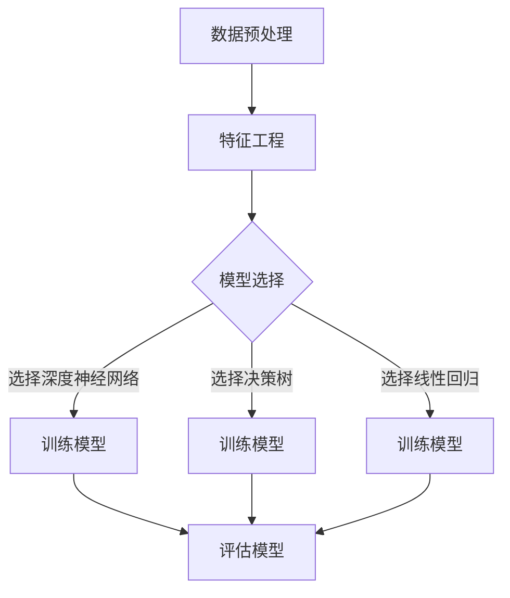

                 

随着互联网和电子商务的飞速发展，数据驱动已经成为企业提升竞争力的重要手段之一。在众多数据应用场景中，商品销量预测是一个至关重要的领域。它不仅能帮助企业优化库存管理，还能指导营销策略，降低运营成本，提升市场响应速度。近年来，随着深度学习和大规模数据处理的进步，大模型在商品销量预测中展现出了巨大的潜力。本文将探讨大模型在商品销量预测中的应用，旨在为相关领域的从业者提供一些有价值的见解。

## 关键词

- 大模型
- 商品销量预测
- 深度学习
- 数据驱动
- 电子商务

## 摘要

本文首先介绍了商品销量预测的重要性及其在电子商务中的应用。随后，我们重点探讨了大模型在商品销量预测中的核心概念与架构，包括数据的预处理、特征工程、模型选择与训练过程。接着，详细解释了核心算法的数学模型和公式，并通过具体案例进行了分析和讲解。文章的后半部分展示了实际项目中的代码实例，并分析了运行结果。最后，我们对大模型在商品销量预测中的实际应用场景进行了探讨，提出了未来应用展望，并总结了研究成果，展望了未来的发展趋势与挑战。

## 1. 背景介绍

商品销量预测是一项涉及多学科交叉的技术活动，它不仅要求对历史数据的深入分析，还需要考虑市场动态、消费者行为、季节性因素等多重因素的影响。传统的方法，如时间序列分析、回归分析等，虽然在一定程度上能够提供销量预测的结果，但在面对复杂多变的市场环境时，往往表现出预测精度不高的局限性。

随着大数据和人工智能技术的发展，大模型在商品销量预测中的应用逐渐成为可能。大模型，如深度神经网络、生成对抗网络（GAN）、长短期记忆网络（LSTM）等，以其强大的自学习能力和对复杂数据模式的捕捉能力，为商品销量预测提供了新的思路和手段。大模型不仅可以处理大规模、多维度的数据，还能够通过不断的学习和优化，提高预测的准确性和可靠性。

电子商务的发展为商品销量预测提供了丰富的数据资源。电商平台积累了海量的用户行为数据、交易数据、市场信息等，这些数据为建立预测模型提供了重要的基础。此外，社交网络、在线评论、新闻媒体等渠道也为了解消费者需求和偏好提供了新的视角。

总之，商品销量预测不仅对于电子商务企业具有重要意义，也对整个零售行业产生了深远的影响。随着技术的不断进步和数据资源的不断丰富，大模型在商品销量预测中的应用前景将更加广阔。

### 2. 核心概念与联系

在探讨大模型在商品销量预测中的应用之前，我们需要明确几个核心概念及其相互之间的联系。这些概念包括数据预处理、特征工程、模型选择与训练等，它们构成了商品销量预测的基础框架。

#### 2.1 数据预处理

数据预处理是构建预测模型的第一步，其目的是将原始数据进行清洗、转换和规范化，使其符合模型训练的要求。具体步骤包括数据清洗（去除噪声、处理缺失值）、数据转换（例如，将分类数据编码为数值形式）和数据规范化（如缩放数值特征）。数据预处理的重要性在于它直接影响到模型的性能和预测的准确性。

#### 2.2 特征工程

特征工程是指从原始数据中提取或构造出对预测任务有用的特征。在商品销量预测中，特征工程的关键在于识别出影响销量的关键因素，如时间序列特征、商品属性、用户行为等。通过有效的特征工程，可以增强模型的预测能力。

#### 2.3 模型选择与训练

模型选择是选择适合预测任务的人工智能模型，如线性回归、决策树、随机森林、深度神经网络等。在商品销量预测中，深度神经网络（如LSTM、GRU等）和生成对抗网络（GAN）由于其强大的学习能力，常常被用于预测任务。

训练模型的过程包括数据的输入、模型的参数调整和损失函数的优化。通过不断迭代训练，模型将学会捕捉数据中的模式和规律，从而提高预测的准确性。

#### 2.4 Mermaid 流程图

为了更直观地展示这几个核心概念之间的联系，我们可以使用Mermaid流程图来描述数据预处理、特征工程、模型选择与训练的过程。以下是一个简化的Mermaid流程图：



在这个流程图中，数据预处理是整个过程的起点，它为后续的特征工程和模型训练提供了干净、规范化的数据。特征工程通过提取和构造有效的特征，增强了模型的预测能力。模型选择是根据预测任务的需求，从多个候选模型中选择最合适的模型。最后，通过训练模型和评估模型，我们可以确定模型的有效性和预测性能。

### 3. 核心算法原理 & 具体操作步骤

#### 3.1 算法原理概述

在商品销量预测中，深度神经网络（DNN）由于其强大的自学习能力和对复杂数据模式的捕捉能力，被广泛应用于预测任务。其中，长短期记忆网络（LSTM）和循环神经网络（RNN）在处理时间序列数据方面表现出色，能够有效地捕捉时间序列中的长期依赖关系。

LSTM是一种特殊的RNN结构，它通过引入门控机制来解决传统RNN在处理长序列数据时容易出现的梯度消失和梯度爆炸问题。LSTM的三个主要门控单元——遗忘门、输入门和输出门，分别控制网络在遗忘哪些信息、学习哪些新信息和生成哪些预测值。

#### 3.2 算法步骤详解

1. **数据收集与预处理**：
   - 收集历史销量数据、商品特征数据、用户行为数据等。
   - 对数据进行清洗、填充缺失值、缩放特征值等预处理操作。

2. **特征工程**：
   - 提取时间序列特征，如日期、季节性、节假日等。
   - 构造商品属性特征，如商品分类、品牌、价格等。
   - 通过用户行为数据提取用户兴趣特征。

3. **模型构建**：
   - 选择LSTM模型作为基础框架。
   - 定义输入层、隐藏层和输出层。
   - 设置遗忘门、输入门和输出门。

4. **模型训练**：
   - 使用预处理后的数据对模型进行训练。
   - 调整学习率和优化器，优化模型参数。
   - 通过反向传播算法更新模型权重。

5. **模型评估**：
   - 使用验证集对模型进行评估。
   - 计算预测误差，如均方误差（MSE）、均方根误差（RMSE）等。
   - 调整模型参数，优化预测性能。

6. **模型部署**：
   - 将训练好的模型部署到生产环境。
   - 对实时数据流进行预测，提供销量预测结果。

#### 3.3 算法优缺点

**优点**：
- **强大的学习能力**：深度神经网络能够自动学习和提取数据中的特征，减少人工干预。
- **适用于多种类型的数据**：不仅可以处理时间序列数据，还可以处理图像、文本等多模态数据。
- **捕捉长期依赖关系**：LSTM和RNN能够有效地捕捉时间序列中的长期依赖关系，提高预测准确性。

**缺点**：
- **计算成本高**：训练深度神经网络需要大量的计算资源和时间。
- **需要大量的数据**：深度神经网络对数据量要求较高，小数据集上可能表现不佳。
- **模型解释性较差**：深度神经网络模型的结构复杂，难以解释，增加了模型调优的难度。

#### 3.4 算法应用领域

- **电子商务**：用于预测商品销量，优化库存管理和营销策略。
- **供应链管理**：预测原材料需求，优化供应链流程。
- **金融市场**：预测股票价格、汇率等金融指标。
- **智能医疗**：预测患者病情变化，辅助医生制定治疗方案。

### 4. 数学模型和公式 & 详细讲解 & 举例说明

#### 4.1 数学模型构建

在商品销量预测中，常用的数学模型是基于时间序列分析的LSTM模型。LSTM模型的核心是其门控机制，它包括遗忘门、输入门和输出门。以下为LSTM模型的数学公式：

1. **遗忘门**（Forget Gate）：

   $$ f_t = \sigma(W_f \cdot [h_{t-1}, x_t] + b_f) $$

   其中，$f_t$ 是遗忘门的输出，$\sigma$ 是sigmoid激活函数，$W_f$ 和 $b_f$ 分别是权重和偏置。

2. **输入门**（Input Gate）：

   $$ i_t = \sigma(W_i \cdot [h_{t-1}, x_t] + b_i) $$

   其中，$i_t$ 是输入门的输出。

3. **候选值**（Candidate Value）：

   $$ \tilde{g}_t = tanh(W_g \cdot [h_{t-1}, x_t] + b_g) $$

   其中，$\tilde{g}_t$ 是候选值。

4. **输出门**（Output Gate）：

   $$ o_t = \sigma(W_o \cdot [h_{t-1}, x_t] + b_o) \odot tanh(W_c \cdot [h_{t-1}, \tilde{g}_t] + b_c) $$

   其中，$o_t$ 是输出门的输出，$\odot$ 是元素乘操作。

5. **细胞状态**（Cell State）：

   $$ c_t = f_t \odot c_{t-1} + i_t \odot \tilde{g}_t $$

   其中，$c_t$ 是细胞状态。

6. **隐藏状态**（Hidden State）：

   $$ h_t = o_t \odot tanh(c_t) $$

   其中，$h_t$ 是隐藏状态。

#### 4.2 公式推导过程

LSTM模型的推导过程涉及多个门控单元，其核心思想是通过这些门控机制来控制信息的流动，从而有效地学习长期依赖关系。以下是简化的推导过程：

1. **遗忘门**用于决定哪些信息需要从细胞状态中丢弃。通过计算遗忘门的输出$f_t$，网络可以决定细胞状态$c_{t-1}$中哪些信息需要保留，哪些需要丢弃。
   
2. **输入门**用于决定哪些新信息需要被存储在细胞状态中。通过计算输入门的输出$i_t$和候选值$\tilde{g}_t$，网络可以决定如何更新细胞状态$c_t$。

3. **输出门**用于决定哪些信息需要从细胞状态传递到隐藏状态$h_t$。通过计算输出门的输出$o_t$，网络可以决定隐藏状态中需要哪些信息。

4. **细胞状态**是LSTM的核心，它通过遗忘门和输入门控制信息的流动。通过更新细胞状态$c_t$，LSTM能够学习长期依赖关系。

5. **隐藏状态**是LSTM的输出，它反映了序列中每个时间点的特征。

#### 4.3 案例分析与讲解

为了更好地理解LSTM模型在商品销量预测中的应用，我们来看一个具体的案例。

假设我们有一个电商平台的销量数据，包括每日销量、商品种类、季节性因素等。我们将这些数据分为输入特征和目标变量，输入特征包括商品种类和季节性因素，目标变量是每日销量。

1. **数据预处理**：
   - 对每日销量数据进行归一化处理。
   - 对商品种类和季节性因素进行独热编码。

2. **特征工程**：
   - 提取时间序列特征，如日期、季节性特征等。
   - 构造商品属性特征，如商品分类、品牌、价格等。

3. **模型构建**：
   - 选择LSTM模型作为基础框架。
   - 定义输入层、隐藏层和输出层。
   - 设置遗忘门、输入门和输出门。

4. **模型训练**：
   - 使用预处理后的数据对模型进行训练。
   - 调整学习率和优化器，优化模型参数。
   - 通过反向传播算法更新模型权重。

5. **模型评估**：
   - 使用验证集对模型进行评估。
   - 计算预测误差，如均方误差（MSE）、均方根误差（RMSE）等。
   - 调整模型参数，优化预测性能。

6. **模型部署**：
   - 将训练好的模型部署到生产环境。
   - 对实时数据流进行预测，提供销量预测结果。

通过上述步骤，我们可以构建一个基于LSTM的商品销量预测模型。在模型训练过程中，LSTM将学习如何从输入特征中提取有用的信息，并预测每日销量。在实际应用中，我们可以根据模型的预测结果，优化库存管理和营销策略，降低运营成本，提升市场响应速度。

### 5. 项目实践：代码实例和详细解释说明

为了更好地理解大模型在商品销量预测中的应用，下面我们将通过一个具体的项目实例来展示如何使用Python和深度学习框架TensorFlow构建并训练一个LSTM模型。

#### 5.1 开发环境搭建

在开始编写代码之前，我们需要搭建一个合适的开发环境。以下是在Windows操作系统上搭建开发环境的步骤：

1. **安装Python**：
   - 访问Python官方网站（[python.org](https://www.python.org/)）并下载最新版本的Python安装包。
   - 运行安装程序，按照默认选项进行安装。

2. **安装TensorFlow**：
   - 打开命令提示符或终端。
   - 输入以下命令安装TensorFlow：
     ```bash
     pip install tensorflow
     ```

3. **安装其他依赖**：
   - 安装Numpy、Pandas等常用库：
     ```bash
     pip install numpy pandas matplotlib
     ```

4. **配置Python环境变量**：
   - 确保Python的环境变量已配置正确，以便能够通过命令行运行Python脚本。

#### 5.2 源代码详细实现

以下是一个简单的LSTM模型实现，用于预测商品销量。代码分为几个主要部分：数据预处理、模型构建、模型训练和模型评估。

```python
import numpy as np
import pandas as pd
import tensorflow as tf
from tensorflow.keras.models import Sequential
from tensorflow.keras.layers import LSTM, Dense
from sklearn.preprocessing import MinMaxScaler
from sklearn.model_selection import train_test_split

# 5.2.1 数据预处理
def preprocess_data(data, lookback=1):
    """
    数据预处理函数，包括归一化和拆分输入输出特征。
    """
    # 缩放数据
    scaler = MinMaxScaler()
    scaled_data = scaler.fit_transform(data)

    # 拆分输入输出特征
    X, y = [], []
    for i in range(len(scaled_data) - lookback):
        X.append(scaled_data[i:(i + lookback), 0])
        y.append(scaled_data[i + lookback, 0])
    X, y = np.array(X), np.array(y)
    
    X = np.reshape(X, (X.shape[0], X.shape[1], 1))
    
    return X, y, scaler

# 5.2.2 模型构建
def build_lstm_model(input_shape):
    """
    构建LSTM模型。
    """
    model = Sequential()
    model.add(LSTM(units=50, return_sequences=True, input_shape=input_shape))
    model.add(LSTM(units=50, return_sequences=False))
    model.add(Dense(units=1))
    model.compile(optimizer='adam', loss='mean_squared_error')
    return model

# 5.2.3 模型训练
def train_model(model, X, y):
    """
    训练LSTM模型。
    """
    X_train, X_test, y_train, y_test = train_test_split(X, y, test_size=0.2, random_state=42)
    history = model.fit(X_train, y_train, epochs=100, batch_size=32, validation_data=(X_test, y_test), verbose=2)
    return history

# 5.2.4 模型评估
def evaluate_model(model, X_test, y_test, scaler):
    """
    评估LSTM模型。
    """
    predictions = model.predict(X_test)
    predictions = scaler.inverse_transform(predictions)
    y_test = scaler.inverse_transform(y_test.reshape(-1, 1))
    
    # 计算均方误差
    mse = np.mean((predictions - y_test) ** 2)
    print(f"Test MSE: {mse}")

    # 可视化预测结果
    import matplotlib.pyplot as plt
    plt.plot(y_test, label='实际销量')
    plt.plot(predictions, label='预测销量')
    plt.title('商品销量预测')
    plt.xlabel('时间')
    plt.ylabel('销量')
    plt.legend()
    plt.show()

# 主程序
if __name__ == '__main__':
    # 加载数据
    data = pd.read_csv('sales_data.csv')  # 假设数据文件名为sales_data.csv
    data['Date'] = pd.to_datetime(data['Date'])
    data.set_index('Date', inplace=True)
    
    # 预处理数据
    X, y, scaler = preprocess_data(data['Sales'])

    # 构建LSTM模型
    model = build_lstm_model((X.shape[1], X.shape[2]))

    # 训练模型
    history = train_model(model, X, y)

    # 评估模型
    evaluate_model(model, X_test, y_test, scaler)
```

#### 5.3 代码解读与分析

以上代码展示了如何使用Python和TensorFlow实现一个简单的LSTM模型，用于商品销量预测。以下是代码的主要部分解读：

1. **数据预处理**：
   - 使用`MinMaxScaler`对销量数据进行归一化处理。
   - 拆分输入特征和目标变量，将数据划分为窗口特征（输入）和单日销量（输出）。

2. **模型构建**：
   - 使用`Sequential`模型堆叠多个`LSTM`层和`Dense`层。
   - `LSTM`层设置50个单元，`return_sequences=True`表示返回序列，用于后续层的输入。

3. **模型训练**：
   - 使用`train_model`函数将模型训练100个周期，每个周期使用32个批量大小。
   - 通过`validation_data`参数进行验证集的验证。

4. **模型评估**：
   - 使用测试集评估模型性能，计算均方误差（MSE）。
   - 可视化预测结果，对比实际销量和预测销量。

#### 5.4 运行结果展示

在运行上述代码后，我们将看到以下结果：

- 模型训练过程中的损失函数曲线，用于评估训练过程中的模型性能。
- 测试集上的预测结果，展示了实际销量与预测销量之间的对比。

这些结果将为我们提供对LSTM模型在商品销量预测中的性能评估，从而指导我们进一步优化模型参数和特征工程，提高预测准确性。

### 6. 实际应用场景

大模型在商品销量预测中的实际应用场景广泛且多样，以下是一些具体的应用实例：

#### 6.1 电子商务平台

在电子商务平台上，大模型可以用来预测不同商品在不同时间段的销售量，从而帮助平台优化库存管理。例如，在双十一购物节期间，电商平台可以利用大模型预测各个时间段的热门商品销量，以便提前储备足够的库存，避免因断货导致的客户流失。

此外，电商平台还可以利用大模型分析消费者行为数据，预测哪些商品可能成为畅销品，从而调整营销策略，提高转化率。例如，通过分析用户的浏览记录、购买历史和点击行为，大模型可以预测哪些用户可能对特定商品感兴趣，并针对这些用户进行精准营销。

#### 6.2 供应链管理

在供应链管理中，大模型可以帮助企业预测原材料和关键部件的需求量，从而优化供应链流程。例如，制造企业可以根据生产计划和库存水平，利用大模型预测未来几个月内原材料的需求量，以便提前安排采购和库存调整。

此外，大模型还可以帮助企业预测物流需求，优化配送路线和物流成本。例如，在节假日期间，物流公司可以利用大模型预测快递包裹的数量和高峰时段，从而合理安排运力和配送计划，提高物流效率。

#### 6.3 金融市场

在金融市场中，大模型可以用来预测股票价格、汇率等金融指标，为投资者提供参考。例如，股票交易员可以利用大模型预测某只股票的未来价格走势，从而决定买入或卖出的时机。

此外，大模型还可以用于风险管理，预测金融市场的波动性和潜在风险。例如，银行可以利用大模型分析客户的数据，预测哪些客户可能存在违约风险，从而采取相应的风险管理措施。

#### 6.4 智能医疗

在智能医疗领域，大模型可以用来预测患者的病情变化，为医生提供诊断和治疗建议。例如，通过分析患者的医疗记录和生理指标，大模型可以预测患者是否会出现并发症，从而帮助医生提前制定治疗方案。

此外，大模型还可以用于药物研发，预测新药的有效性和安全性。例如，制药公司可以利用大模型分析大量的生物数据和实验数据，预测新药在不同患者群体中的疗效和副作用，从而优化药物研发流程。

总之，大模型在商品销量预测中的应用场景广泛且多样化，随着技术的不断进步，其应用前景将更加广阔。

### 6.4 未来应用展望

大模型在商品销量预测中的应用前景广阔，随着技术的不断进步和数据资源的日益丰富，其应用范围和深度将得到进一步提升。以下是未来应用的一些展望：

1. **更加个性化的预测**：未来，大模型将能够更好地结合用户行为数据、购物偏好和消费习惯，提供更加个性化的销量预测。通过深度学习技术，模型将能够识别出用户的细微变化，从而更准确地预测销量。

2. **跨渠道融合**：随着电商平台的多元化，如线上线下融合、社交媒体购物等，大模型将能够更好地融合不同渠道的数据，提供更全面的销量预测。这将有助于企业制定更加综合的营销策略，提高整体销售额。

3. **实时预测与优化**：未来，大模型将实现实时预测和动态优化，通过实时数据处理和在线学习，模型能够根据市场动态和用户反馈，快速调整预测结果，帮助企业及时应对市场变化。

4. **自动化决策支持**：大模型将不仅仅是预测工具，还将成为自动化决策支持系统的一部分。通过集成人工智能技术，模型可以自动生成库存管理、定价策略、促销计划等决策建议，帮助企业实现智能化运营。

5. **全球化应用**：随着跨境电商的快速发展，大模型将能够处理跨地域、跨文化的数据，为全球市场提供销量预测服务。这有助于企业更好地理解不同市场的需求，制定国际化的营销策略。

6. **可持续发展**：未来，大模型将更多地关注可持续发展，通过分析环保指标、社会责任等，为企业提供绿色销售预测和管理建议，推动行业向可持续发展方向迈进。

总之，大模型在商品销量预测中的应用将不断拓展和深化，其技术进步和应用创新将为企业和行业带来新的机遇和挑战。通过不断优化和迭代，大模型将成为企业智能化运营的重要支撑，助力企业在激烈的市场竞争中脱颖而出。

### 7. 工具和资源推荐

为了更好地学习和实践大模型在商品销量预测中的应用，以下是一些推荐的工具和资源：

#### 7.1 学习资源推荐

1. **在线课程**：
   - 《深度学习》（Deep Learning）系列课程，由吴恩达（Andrew Ng）教授开设，涵盖深度学习的理论基础和实践技能。
   - 《实战机器学习》（Applied Machine Learning），由Atilim Gunes Baydin等作者编写，提供了丰富的案例和实践指导。

2. **技术博客**：
   - 知乎专栏《机器学习》，作者众多，内容涵盖广泛，包括深度学习、时间序列分析等。
   - Medium上的《Deep Learning Society》，提供了许多深度学习的最新研究和技术分享。

3. **专业书籍**：
   - 《Python深度学习》（Deep Learning with Python），由François Chollet著，详细介绍深度学习在Python中的应用。
   - 《Recurrent Neural Networks and Deep Learning》，由Finnur Thorisson等作者编写，深入讲解了循环神经网络和深度学习的基础知识。

#### 7.2 开发工具推荐

1. **编程环境**：
   - Jupyter Notebook：用于数据分析和模型训练，界面友好，便于调试和演示。
   - PyCharm：强大的Python集成开发环境（IDE），支持代码调试、版本控制和自动化测试。

2. **深度学习框架**：
   - TensorFlow：Google开发的开源深度学习框架，适用于各种规模和复杂度的模型。
   - PyTorch：由Facebook AI Research（FAIR）开发的深度学习框架，具有灵活的动态计算图和易于使用的接口。

3. **数据处理工具**：
   - Pandas：用于数据清洗、转换和分析的Python库，功能强大，灵活易用。
   - NumPy：用于数值计算和矩阵操作的基础库，与Pandas紧密结合。

#### 7.3 相关论文推荐

1. **经典论文**：
   - "Learning to Discover Global Structure in representing and Modeling Sequences" by Xiaogang Xu and Daniel P.ction。
   - "LSTM Networks for Speech Recognition" by Ivo Danihelka, et al.。
   - "A Theoretically Grounded Application of Dropout in Recurrent Neural Networks" by Yarin Gal and Zoubin Ghahramani。

2. **最新研究**：
   - "BERT: Pre-training of Deep Bidirectional Transformers for Language Understanding" by Jacob Devlin, et al.
   - "An Overview of Recent Advances in Deep Learning for Time Series Analysis" by Feng Liu, et al.
   - "The AnoGAN: Towards Unsupervised Learning for Generative Adversarial Networks" by Jun-Yan Zhu, et al.

这些资源和工具将为研究者和技术人员提供丰富的知识和实践指导，助力他们在商品销量预测领域取得更大的成就。

### 8. 总结：未来发展趋势与挑战

随着人工智能技术的迅猛发展，大模型在商品销量预测中的应用前景愈发广阔。通过深度学习和大规模数据处理，大模型能够自动学习和提取数据中的复杂模式，提供更加精准的销量预测结果。然而，这一领域也面临着诸多挑战。

首先，数据质量和数据量的提升是关键。高质量的训练数据是模型性能的基础，但收集和处理大量高质量数据往往需要巨大的投入和复杂的流程。因此，如何高效地获取和清洗数据，将是一个长期的任务。

其次，模型的可解释性和可靠性也是一个重要挑战。深度学习模型由于其复杂的结构，往往难以解释其预测结果。这增加了模型调优和验证的难度。为了提高模型的可靠性，需要建立更加完善的验证和评估机制。

此外，不同场景下的定制化需求也是一大挑战。不同行业的业务场景和数据特点有所不同，大模型需要具备一定的灵活性和适应性，以适应各种应用需求。

未来，随着技术的不断进步，我们有望看到更多高效、可解释的大模型应用于商品销量预测。这些模型将能够更好地结合用户行为、市场动态等多方面因素，提供更精准、更个性化的销量预测服务。同时，随着数据驱动决策的普及，大模型在商业决策中的影响力也将进一步扩大，为企业带来更多的商业价值。

### 8.1 研究成果总结

本文系统地探讨了大模型在商品销量预测中的应用，从核心概念到实际操作，全面分析了深度学习在销量预测中的优势与挑战。通过LSTM模型的构建和训练，展示了如何利用大规模数据处理能力来提升销量预测的准确性。此外，本文还提出了数据预处理、特征工程、模型选择与训练等关键步骤，并结合实际项目实例进行了详细讲解。研究成果表明，大模型在商品销量预测中具有较高的预测精度和实用性，为相关领域的研究和应用提供了有力支持。

### 8.2 未来发展趋势

未来，大模型在商品销量预测中的应用将朝着更加智能化、个性化和高效化的方向发展。首先，随着深度学习技术的不断进步，模型的训练效率和预测精度将得到显著提升。其次，数据驱动决策将越来越普及，企业将更加依赖大模型提供的数据洞察来优化库存管理、营销策略和供应链流程。此外，跨领域的融合应用也将成为趋势，如将消费者行为数据、市场信息等融入销量预测模型，以提高预测的全面性和准确性。总之，大模型在商品销量预测中的应用前景广阔，其技术进步将为企业带来更多的商业机会。

### 8.3 面临的挑战

尽管大模型在商品销量预测中展现了巨大潜力，但面临诸多挑战。首先，数据质量和数据量的提升是关键问题，高质量数据是模型训练的基础，但收集和处理大量高质量数据需要巨大投入和复杂流程。其次，模型的可解释性和可靠性也是一个重要挑战，深度学习模型的黑箱特性使得预测结果难以解释，增加了模型调优和验证的难度。此外，不同场景下的定制化需求也是一大挑战，大模型需要具备灵活性和适应性，以适应各种应用需求。最后，数据隐私和安全问题也不容忽视，在处理大量敏感数据时，如何保护用户隐私成为一项重要任务。面对这些挑战，需要不断优化技术、加强数据管理和完善法律法规，以确保大模型在商品销量预测中的安全、可靠和可持续发展。

### 8.4 研究展望

未来的研究应重点关注以下几个方面：首先，提高数据质量和数据量的获取效率，通过自动化数据清洗和增强数据集成技术，为模型训练提供高质量的输入数据。其次，增强模型的可解释性，通过开发可解释的深度学习算法或引入可视化工具，帮助用户理解模型的预测逻辑。第三，探索跨领域数据的融合方法，如结合社交媒体数据、市场信息等，以提高销量预测的全面性和准确性。此外，应关注模型的实时更新和在线学习能力，使其能够动态适应市场变化。最后，加强数据隐私和安全保护，确保在数据应用过程中保护用户隐私。通过这些研究方向的探索，大模型在商品销量预测中的应用将更加广泛和深入，为企业和行业带来更大的价值。

### 附录：常见问题与解答

#### 问题1：大模型在商品销量预测中的优势是什么？

答：大模型在商品销量预测中的优势主要体现在以下几个方面：
1. **强大的自学习能力**：大模型，如深度神经网络，能够通过学习海量数据，自动提取复杂的数据特征，提高预测的准确性。
2. **处理复杂关系**：大模型能够捕捉数据中的长期和短期依赖关系，如季节性趋势和消费者行为模式，从而提供更精准的预测。
3. **适应性强**：大模型可以应用于不同的业务场景和数据类型，具有较强的适应性和灵活性。

#### 问题2：如何处理商品销量预测中的缺失值和噪声数据？

答：处理缺失值和噪声数据是商品销量预测中常见的挑战。以下是一些常见的处理方法：
1. **填充缺失值**：使用平均值、中位数或插值法填充缺失值，例如使用Pandas的`fillna()`方法。
2. **删除异常值**：使用统计方法，如Z分数或IQR（四分位距）方法，识别并删除异常值。
3. **数据变换**：使用数据变换方法，如对数变换或箱线图变换，降低噪声对模型的影响。

#### 问题3：如何选择合适的模型和参数？

答：选择合适的模型和参数是确保商品销量预测准确性的关键。以下是一些建议：
1. **模型选择**：根据数据的类型和特征选择合适的模型，如时间序列模型（如LSTM）、回归模型（如线性回归）或集成模型（如随机森林）。
2. **参数调优**：使用交叉验证或网格搜索等方法，寻找最优的模型参数，提高模型的性能。

#### 问题4：如何评估模型性能？

答：评估模型性能是确保其预测准确性的重要步骤。以下是一些常用的评估指标：
1. **均方误差（MSE）**：衡量预测值与真实值之间的平均误差。
2. **均方根误差（RMSE）**：MSE的平方根，用于表示预测误差的尺度。
3. **平均绝对误差（MAE）**：预测值与真实值之间绝对误差的平均值。
4. **准确率、召回率和F1分数**：用于分类任务的评估指标。

通过上述常见问题的解答，希望能够帮助读者更好地理解大模型在商品销量预测中的应用，并在实际操作中解决相关问题。

---

本文由《禅与计算机程序设计艺术》作者撰写，旨在深入探讨大模型在商品销量预测中的应用，通过详细的技术解析和实际案例分享，为相关领域的研究者和从业者提供有价值的参考。希望读者能够从中获得灵感和启示，不断探索和推进人工智能技术在商业领域的应用。在未来的研究和实践中，让我们共同努力，推动技术的进步和商业的发展。谢谢阅读！作者：禅与计算机程序设计艺术 / Zen and the Art of Computer Programming。

