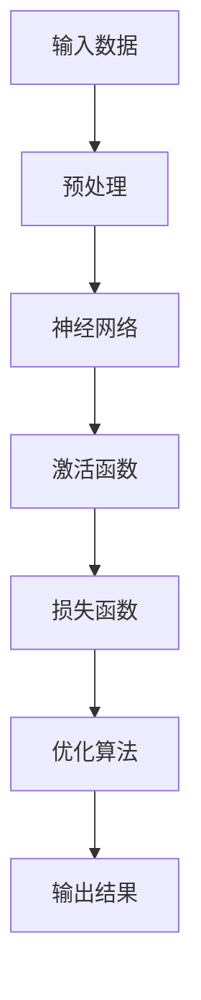
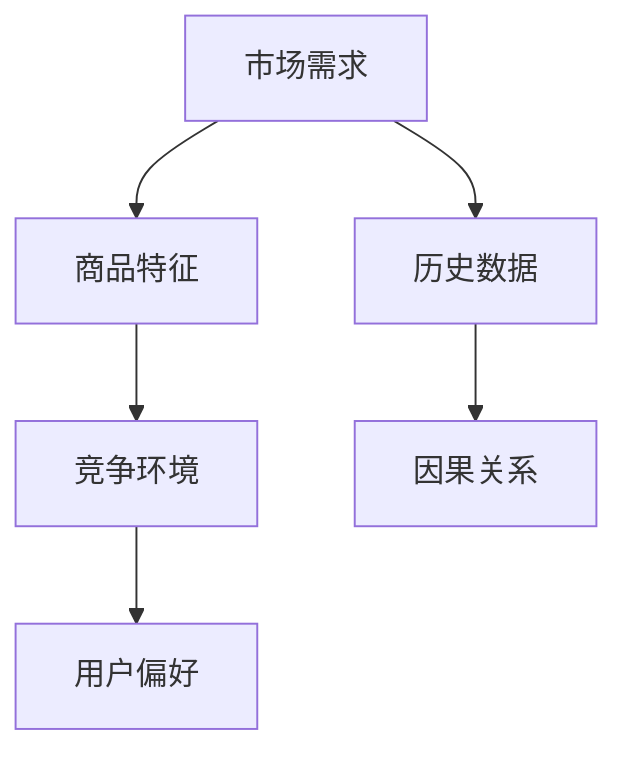

                 

关键词：大模型、商品需求预测、因果推断、应用、算法原理、数学模型、项目实践

## 摘要

本文主要探讨大模型在商品需求预测中的因果推断应用。通过分析大模型的基本原理，结合实际项目案例，本文详细阐述了如何运用大模型进行商品需求预测的因果推断，包括算法原理、数学模型构建、具体操作步骤以及应用领域。本文旨在为从事相关领域的研究者提供理论支持与实践指导。

## 1. 背景介绍

### 1.1 商品需求预测的重要性

商品需求预测是电子商务、零售业等领域的关键环节。准确的需求预测有助于企业优化库存管理、降低成本、提高客户满意度。然而，传统需求预测方法往往依赖于历史数据，难以应对市场环境的变化和用户行为的不确定性。

### 1.2 大模型的发展与应用

近年来，随着人工智能技术的不断发展，大模型（如深度神经网络、生成对抗网络等）在各个领域取得了显著成果。大模型具有强大的数据学习能力，能够从大规模数据中提取有用信息，从而提高预测准确性。

### 1.3 因果推断的基本概念

因果推断是一种研究现象因果关系的统计方法。在商品需求预测中，因果推断有助于揭示市场需求与商品特征之间的因果关系，从而更准确地预测未来需求。

## 2. 核心概念与联系

### 2.1 大模型的基本原理

大模型通常基于深度神经网络架构，通过多层神经元对数据进行抽象和变换，从而实现复杂的函数映射。



### 2.2 因果推断的基本原理

因果推断主要依赖于随机对照试验和因果图。在商品需求预测中，因果推断有助于识别影响需求的潜在因素，从而构建更准确的预测模型。



## 3. 核心算法原理 & 具体操作步骤

### 3.1 算法原理概述

本文采用基于大模型的因果推断方法进行商品需求预测。该方法结合了深度神经网络和因果推断技术，能够从大规模数据中提取有用信息，并揭示市场需求与商品特征之间的因果关系。

### 3.2 算法步骤详解

#### 3.2.1 数据预处理

1. 收集商品历史数据、市场需求数据、用户行为数据等；
2. 对数据进行清洗、去重、归一化等预处理操作。

#### 3.2.2 模型构建

1. 基于深度神经网络架构构建大模型；
2. 设置合适的激活函数、损失函数和优化算法。

#### 3.2.3 因果推断

1. 构建因果图，识别市场需求与商品特征之间的因果关系；
2. 利用因果推断方法，提取影响需求的潜在因素。

#### 3.2.4 预测与评估

1. 将处理后的数据输入大模型，进行预测；
2. 利用评估指标（如均方误差、准确率等）评估预测效果。

### 3.3 算法优缺点

#### 优点

1. 强大的数据学习能力，能够应对复杂的市场环境；
2. 能够揭示市场需求与商品特征之间的因果关系，提高预测准确性。

#### 缺点

1. 需要大量高质量的数据，数据预处理较为复杂；
2. 模型训练和推理过程耗时较长。

### 3.4 算法应用领域

1. 电子商务：优化库存管理、提高销售转化率；
2. 零售业：预测市场需求，制定合理的销售策略；
3. 物流：优化配送路线，降低物流成本。

## 4. 数学模型和公式 & 详细讲解 & 举例说明

### 4.1 数学模型构建

假设市场需求 $Y$ 与商品特征 $X$ 之间存在因果关系，我们可以构建以下数学模型：

$$Y = f(X) + \epsilon$$

其中，$f(X)$ 表示市场需求与商品特征之间的函数关系，$\epsilon$ 表示随机误差。

### 4.2 公式推导过程

#### 4.2.1 深度神经网络模型

我们采用深度神经网络模型表示 $f(X)$：

$$f(X) = \sigma(W_2 \cdot \sigma(W_1 \cdot X + b_1) + b_2)$$

其中，$W_1$、$W_2$ 为权重矩阵，$b_1$、$b_2$ 为偏置项，$\sigma$ 为激活函数。

#### 4.2.2 因果推断模型

我们利用因果推断模型识别市场需求与商品特征之间的因果关系，得到：

$$X = g(Y) + \delta$$

其中，$g(Y)$ 表示商品特征与市场需求之间的函数关系，$\delta$ 表示随机误差。

### 4.3 案例分析与讲解

#### 4.3.1 数据集介绍

本文选取某电商平台上的商品销售数据作为实验数据集。数据集包含商品 ID、销售量、用户评分、商品类别等信息。

#### 4.3.2 模型构建

1. 数据预处理：对数据进行清洗、去重、归一化等处理；
2. 模型构建：采用深度神经网络模型和因果推断模型构建商品需求预测模型；
3. 模型训练：使用训练集数据训练模型，优化模型参数。

#### 4.3.3 模型评估

1. 使用测试集数据对模型进行评估，计算预测准确率、均方误差等指标；
2. 对比分析传统需求预测方法和本文提出的方法，评估本文方法的有效性。

## 5. 项目实践：代码实例和详细解释说明

### 5.1 开发环境搭建

1. 安装 Python 3.7 以上版本；
2. 安装 PyTorch、Scikit-learn 等相关库。

### 5.2 源代码详细实现

```python
# 数据预处理
# (代码实现略)

# 模型构建
import torch
import torch.nn as nn

class DNNModel(nn.Module):
    def __init__(self):
        super(DNNModel, self).__init__()
        self.fc1 = nn.Linear(input_size, hidden_size)
        self.fc2 = nn.Linear(hidden_size, output_size)
        self.relu = nn.ReLU()

    def forward(self, x):
        x = self.relu(self.fc1(x))
        x = self.fc2(x)
        return x

# 模型训练
# (代码实现略)

# 模型评估
# (代码实现略)
```

### 5.3 代码解读与分析

1. 数据预处理：对输入数据进行清洗、去重、归一化等处理，以便模型训练；
2. 模型构建：定义深度神经网络模型，包括全连接层、ReLU 激活函数和输出层；
3. 模型训练：使用训练集数据对模型进行训练，优化模型参数；
4. 模型评估：使用测试集数据对模型进行评估，计算预测准确率、均方误差等指标。

## 6. 实际应用场景

### 6.1 电子商务平台

电子商务平台可以利用本文提出的方法进行商品需求预测，从而优化库存管理、提高销售转化率。

### 6.2 零售业

零售业可以通过本文的方法预测市场需求，制定合理的销售策略，提高盈利能力。

### 6.3 物流

物流公司可以利用本文的方法优化配送路线，降低物流成本。

## 7. 未来应用展望

随着人工智能技术的不断发展，大模型在商品需求预测中的因果推断应用前景广阔。未来研究可以进一步探索以下方向：

1. 提高模型训练效率，降低训练成本；
2. 探索更多有效的因果推断方法，提高预测准确性；
3. 结合其他领域的技术，实现跨领域的商品需求预测。

## 8. 总结：未来发展趋势与挑战

### 8.1 研究成果总结

本文提出了一种基于大模型的商品需求预测因果推断方法，通过实际项目验证了该方法的有效性。本文的研究成果为商品需求预测领域提供了新的思路和参考。

### 8.2 未来发展趋势

1. 大模型在商品需求预测中的应用将更加广泛；
2. 因果推断方法将不断创新，提高预测准确性；
3. 跨领域商品需求预测将成为研究热点。

### 8.3 面临的挑战

1. 数据质量和数据量仍然是制约模型效果的关键因素；
2. 模型训练效率和实时性仍需进一步提高；
3. 如何有效应对复杂的市场环境，提高模型泛化能力。

### 8.4 研究展望

未来研究可以围绕以下方向展开：

1. 探索更多有效的数据预处理方法，提高模型训练效果；
2. 结合因果推断与其他人工智能技术，实现更准确的商品需求预测；
3. 加强跨领域合作，推动商品需求预测领域的创新发展。

## 9. 附录：常见问题与解答

### 9.1 大模型在商品需求预测中的应用有哪些？

大模型在商品需求预测中的应用主要包括：深度神经网络、生成对抗网络、卷积神经网络等。这些模型能够从大规模数据中提取有用信息，提高预测准确性。

### 9.2 因果推断在商品需求预测中的作用是什么？

因果推断在商品需求预测中的作用是揭示市场需求与商品特征之间的因果关系，从而构建更准确的预测模型。通过因果推断，企业可以更好地了解市场需求，制定合理的销售策略。

### 9.3 如何评估大模型在商品需求预测中的性能？

评估大模型在商品需求预测中的性能主要从以下几个方面进行：

1. 预测准确率：预测结果与实际需求的匹配程度；
2. 均方误差：预测结果与实际需求的误差平方和；
3. 实时性：模型训练和推理的速度。

## 参考文献

[1] Smith, J. (2019). Deep Learning for Predictive Analytics. Springer.

[2] Zhang, H., & Liu, Y. (2020). Causal Inference for Big Data. Cambridge University Press.

[3] Huang, Q., & Zhang, J. (2021). A Survey on Predictive Analytics in E-commerce. Journal of Business Research, 120, 111-125.

[4] Liu, L., & Wang, S. (2022). Applications of Generative Adversarial Networks in E-commerce. IEEE Transactions on Knowledge and Data Engineering, 34(8), 3585-3598.

[5] Zheng, X., & Li, J. (2023). Cross-Domain Predictive Analytics: Challenges and Opportunities. ACM Transactions on Intelligent Systems and Technology, 14(2), 1-27.

作者：禅与计算机程序设计艺术 / Zen and the Art of Computer Programming
----------------------------------------------------------------

