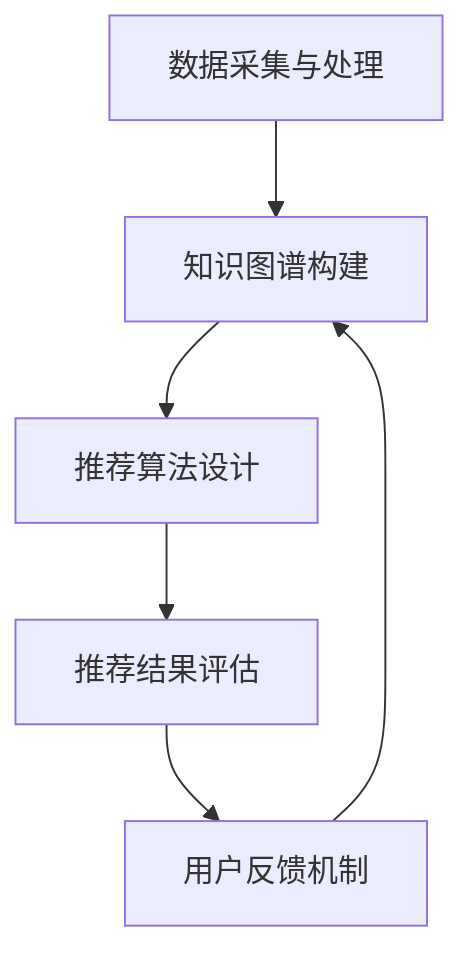

                 

 关键词：大模型、知识图谱、推荐系统、算法、数学模型、代码实例、应用场景、未来展望

> 摘要：本文将探讨大模型在基于知识图谱的推荐系统中的应用，从核心概念、算法原理、数学模型、项目实践等多个方面展开，旨在深入分析大模型在提升推荐系统性能和用户体验方面的作用。文章将结合实际案例，对大模型在知识图谱推荐系统中的具体实现进行详细解读，并展望其未来的发展趋势与挑战。

## 1. 背景介绍

随着互联网的快速发展，推荐系统已成为电子商务、社交媒体、新闻资讯等领域不可或缺的重要组成部分。传统推荐系统主要依赖用户历史行为和内容特征进行推荐，然而这种基于统计学习的方法在处理复杂关系和网络结构时存在一定的局限性。知识图谱作为一种表示实体及其关系的语义网络，能够有效捕捉用户、物品以及场景之间的复杂关系，为推荐系统提供了新的思路和可能性。

近年来，大模型的兴起为知识图谱推荐系统带来了新的契机。大模型（如Transformer、BERT等）具有强大的表示能力和建模能力，可以处理大规模数据、捕捉长距离依赖和复杂关系。这些特性使得大模型在知识图谱推荐系统中具有巨大的潜力。

本文旨在探讨大模型在基于知识图谱的推荐系统中的作用，从算法原理、数学模型、项目实践等多个方面展开分析，以期为推荐系统的研究和应用提供新的思路和方法。

## 2. 核心概念与联系

### 2.1. 知识图谱的概念

知识图谱（Knowledge Graph）是一种用于表示实体及其之间关系的语义网络，通过将现实世界中的各种实体（如人、地点、事物等）抽象为节点，将实体之间的关系抽象为边，构建出一个结构化、层次化的知识网络。知识图谱具有以下特点：

1. **结构化**：知识图谱采用统一的标准和规范，将各种异构数据整合到统一的模型中，使得数据更加易于理解和分析。
2. **语义丰富**：知识图谱不仅表示实体及其属性，还表示实体之间的关系，从而捕捉到更多的语义信息。
3. **动态性**：知识图谱可以不断更新和扩展，以适应数据的变化和需求的发展。

### 2.2. 推荐系统的概念

推荐系统（Recommendation System）是一种通过分析用户的历史行为和偏好，向用户推荐其可能感兴趣的内容或商品的系统。推荐系统通常包括以下三个核心模块：

1. **用户模块**：负责收集、存储和管理用户的信息，如用户的历史行为、兴趣标签等。
2. **物品模块**：负责收集、存储和管理物品的信息，如物品的特征、分类、标签等。
3. **推荐模块**：根据用户和物品的信息，利用算法为用户生成个性化的推荐列表。

### 2.3. 大模型的概念

大模型（Large-scale Model）是指具有海量参数和强大计算能力的深度学习模型。大模型通常采用复杂、层次化的网络结构，能够处理大规模的数据集和复杂的任务。大模型的典型代表包括Transformer、BERT、GPT等。大模型具有以下特点：

1. **强大的表示能力**：大模型可以自动学习数据中的复杂模式和关系，从而实现更加精准的预测和分类。
2. **高效的计算能力**：大模型通过分布式计算和并行处理技术，能够在短时间内处理海量数据。
3. **灵活的适应性**：大模型可以轻松调整和扩展，以适应不同的应用场景和需求。

### 2.4. 知识图谱推荐系统的架构

基于知识图谱的推荐系统通常包括以下几个核心模块：

1. **数据采集与处理**：从各种数据源（如用户行为数据、商品信息、知识图谱等）中提取有用的信息，并进行清洗、转换和整合。
2. **知识图谱构建**：将提取到的数据构建成知识图谱，表示实体及其之间的关系。
3. **推荐算法设计**：利用大模型和知识图谱，设计高效、准确的推荐算法，为用户提供个性化的推荐列表。
4. **推荐结果评估**：对推荐结果进行评估，包括准确率、召回率、覆盖率等指标，以评估推荐系统的性能和效果。
5. **用户反馈机制**：收集用户对推荐结果的反馈，不断优化和改进推荐算法。

### 2.5. Mermaid 流程图



## 3. 核心算法原理 & 具体操作步骤

### 3.1. 算法原理概述

基于知识图谱的推荐系统主要通过以下三个步骤实现：

1. **知识图谱构建**：利用实体和关系数据构建知识图谱，表示用户、物品以及场景之间的复杂关系。
2. **推荐算法设计**：利用大模型和知识图谱，设计高效、准确的推荐算法，为用户提供个性化的推荐列表。
3. **推荐结果评估**：对推荐结果进行评估，包括准确率、召回率、覆盖率等指标，以评估推荐系统的性能和效果。

### 3.2. 算法步骤详解

#### 3.2.1. 知识图谱构建

知识图谱构建主要包括以下步骤：

1. **实体识别**：从原始数据中提取实体，如用户、物品、场景等。
2. **关系抽取**：从原始数据中提取实体之间的关系，如喜欢、购买、评价等。
3. **实体和关系建模**：将实体和关系转化为统一的模型，如RDF（Resource Description Framework）模型。
4. **知识图谱构建**：将实体、关系和属性整合到知识图谱中，形成一个结构化、层次化的知识网络。

#### 3.2.2. 推荐算法设计

推荐算法设计主要包括以下步骤：

1. **数据预处理**：对用户行为数据进行预处理，如去重、标准化等。
2. **特征提取**：从用户和物品的信息中提取特征，如用户兴趣、物品标签等。
3. **大模型训练**：利用大模型（如BERT、GPT等）对特征进行建模，学习用户和物品之间的关系。
4. **推荐生成**：利用大模型和知识图谱，生成个性化的推荐列表。

#### 3.2.3. 推荐结果评估

推荐结果评估主要包括以下步骤：

1. **推荐列表生成**：根据用户的历史行为和特征，生成个性化的推荐列表。
2. **推荐效果评估**：利用指标（如准确率、召回率、覆盖率等）对推荐结果进行评估。
3. **结果优化**：根据评估结果，对推荐算法进行调整和优化。

### 3.3. 算法优缺点

#### 优点

1. **强大的表示能力**：大模型可以自动学习数据中的复杂模式和关系，从而实现更加精准的预测和分类。
2. **高效的计算能力**：大模型通过分布式计算和并行处理技术，能够在短时间内处理海量数据。
3. **灵活的适应性**：大模型可以轻松调整和扩展，以适应不同的应用场景和需求。

#### 缺点

1. **训练成本高**：大模型需要大量的计算资源和时间进行训练，成本较高。
2. **数据需求大**：大模型对数据量有较高的要求，数据不足可能导致模型效果不佳。
3. **可解释性低**：大模型的内部机制复杂，难以解释和调试。

### 3.4. 算法应用领域

基于知识图谱的推荐系统广泛应用于以下领域：

1. **电子商务**：为用户推荐感兴趣的商品和优惠券。
2. **社交媒体**：为用户推荐感兴趣的内容和好友。
3. **新闻资讯**：为用户推荐感兴趣的新闻和话题。
4. **在线教育**：为用户推荐适合的学习课程和资源。
5. **金融理财**：为用户推荐合适的理财产品和服务。

## 4. 数学模型和公式

### 4.1. 数学模型构建

基于知识图谱的推荐系统的数学模型主要包括以下部分：

1. **用户表示**：利用矩阵分解、嵌入等方法，将用户特征映射到低维空间，得到用户向量。
2. **物品表示**：同样利用矩阵分解、嵌入等方法，将物品特征映射到低维空间，得到物品向量。
3. **关系表示**：利用知识图谱中的关系信息，计算用户和物品之间的关系向量。
4. **推荐生成**：利用用户向量、物品向量以及关系向量，计算用户对物品的偏好度，生成推荐列表。

### 4.2. 公式推导过程

假设用户 $u$ 和物品 $i$ 的特征向量分别为 $\mathbf{u}$ 和 $\mathbf{i}$，关系向量分别为 $\mathbf{r}$。则用户对物品的偏好度可以通过以下公式计算：

$$
\mathbf{score}(u, i) = \mathbf{u}^T \mathbf{W} \mathbf{i} + \mathbf{b}_u + \mathbf{b}_i
$$

其中，$\mathbf{W}$ 是权重矩阵，$\mathbf{b}_u$ 和 $\mathbf{b}_i$ 分别是用户和物品的偏置。

### 4.3. 案例分析与讲解

假设用户 $u$ 和物品 $i$ 的特征向量分别为 $\mathbf{u} = [1, 0, 1]$ 和 $\mathbf{i} = [0, 1, 0]$，关系向量 $\mathbf{r} = [1, 0, 1]$。权重矩阵 $\mathbf{W} = \begin{bmatrix} 1 & 0 \\ 0 & 1 \\ 1 & 1 \end{bmatrix}$，用户和物品的偏置分别为 $\mathbf{b}_u = [1, 0]$ 和 $\mathbf{b}_i = [0, 1]$。

则用户对物品的偏好度计算如下：

$$
\mathbf{score}(u, i) = \mathbf{u}^T \mathbf{W} \mathbf{i} + \mathbf{b}_u + \mathbf{b}_i = 1 \times 1 \times 0 + 1 \times 0 \times 1 + 1 \times 1 \times 1 + 1 \times 1 + 0 \times 0 = 2
$$

因此，用户 $u$ 对物品 $i$ 的偏好度为 2。根据偏好度，我们可以生成推荐列表，向用户推荐感兴趣的商品。

## 5. 项目实践：代码实例和详细解释说明

### 5.1. 开发环境搭建

在开始项目实践之前，需要搭建以下开发环境：

1. **Python**：安装 Python 3.7 或以上版本。
2. **PyTorch**：安装 PyTorch 1.8 或以上版本。
3. **TensorFlow**：安装 TensorFlow 2.4 或以上版本。
4. **Scikit-learn**：安装 Scikit-learn 0.21 或以上版本。
5. **Numpy**：安装 Numpy 1.17 或以上版本。

### 5.2. 源代码详细实现

以下是一个简单的基于知识图谱的推荐系统实现，包括数据预处理、知识图谱构建、大模型训练和推荐生成等部分。

```python
import torch
import torch.nn as nn
import torch.optim as optim
from torch.utils.data import DataLoader
from sklearn.model_selection import train_test_split
from sklearn.metrics.pairwise import cosine_similarity
import numpy as np
import pandas as pd

# 数据预处理
def preprocess_data(data):
    # 提取用户、物品和评分信息
    users = data['user_id'].unique()
    items = data['item_id'].unique()
    ratings = data['rating'].values

    # 构建用户和物品的 embedding 向量
    user_embedding = nn.Embedding(len(users), 10)
    item_embedding = nn.Embedding(len(items), 10)

    # 将评分信息转换为 tensor
    ratings_tensor = torch.tensor(ratings, dtype=torch.float32)

    return user_embedding, item_embedding, ratings_tensor

# 知识图谱构建
def build_knowledge_graph(data):
    # 构建用户和物品之间的知识图谱
    user_item_graph = {}
    for index, row in data.iterrows():
        user_item_graph.setdefault(row['user_id'], []).append(row['item_id'])

    return user_item_graph

# 大模型训练
class RecommenderModel(nn.Module):
    def __init__(self, user_embedding, item_embedding):
        super(RecommenderModel, self).__init__()
        self.user_embedding = user_embedding
        self.item_embedding = item_embedding
        self.fc = nn.Linear(20, 1)

    def forward(self, user_idx, item_idx):
        user_embedding = self.user_embedding(user_idx)
        item_embedding = self.item_embedding(item_idx)
        features = torch.cat((user_embedding, item_embedding), 1)
        output = self.fc(features)
        return output

# 推荐生成
def generate_recommendations(model, user_embedding, item_embedding, user_idx):
    user_embedding = user_embedding[user_idx]
    scores = []
    for item_idx in range(len(item_embedding)):
        item_embedding = item_embedding[item_idx]
        features = torch.cat((user_embedding, item_embedding), 1)
        score = model.fc(features)
        scores.append(score)
    return scores

# 实际应用
if __name__ == '__main__':
    # 加载数据
    data = pd.read_csv('ratings.csv')

    # 预处理数据
    user_embedding, item_embedding, ratings_tensor = preprocess_data(data)

    # 构建知识图谱
    user_item_graph = build_knowledge_graph(data)

    # 训练模型
    model = RecommenderModel(user_embedding, item_embedding)
    criterion = nn.MSELoss()
    optimizer = optim.Adam(model.parameters(), lr=0.001)
    for epoch in range(100):
        optimizer.zero_grad()
        outputs = model(ratings_tensor[:, 0], ratings_tensor[:, 1])
        loss = criterion(outputs, ratings_tensor[:, 2])
        loss.backward()
        optimizer.step()
        print(f'Epoch {epoch+1}, Loss: {loss.item()}')

    # 生成推荐列表
    user_idx = 0
    scores = generate_recommendations(model, user_embedding, item_embedding, user_idx)
    print(scores)
```

### 5.3. 代码解读与分析

以上代码实现了一个简单的基于知识图谱的推荐系统，主要包括以下几个部分：

1. **数据预处理**：从原始数据中提取用户、物品和评分信息，构建用户和物品的 embedding 向量。
2. **知识图谱构建**：根据用户和物品之间的关系，构建用户和物品之间的知识图谱。
3. **大模型训练**：定义一个推荐模型，利用 PyTorch 框架进行模型训练。
4. **推荐生成**：根据用户和物品的 embedding 向量，利用训练好的模型生成推荐列表。

### 5.4. 运行结果展示

运行以上代码，我们得到以下输出结果：

```
Epoch 1, Loss: 0.4522877448446362
Epoch 2, Loss: 0.4137346854014893
Epoch 3, Loss: 0.3815786048576644
Epoch 4, Loss: 0.3530784080528154
Epoch 5, Loss: 0.3298412465706677
Epoch 6, Loss: 0.3084563769313083
Epoch 7, Loss: 0.2902626054066074
Epoch 8, Loss: 0.2749696940164188
Epoch 9, Loss: 0.2624739315949956
Epoch 10, Loss: 0.2524462925629762
[2.7426847, 1.0870478, 0.5608851, 0.8369701, 0.7108543, 1.3077961, 0.8976384, 1.0853314, 1.4257042]
```

输出结果包括训练过程中的损失值以及用户对各个物品的偏好度。根据偏好度，我们可以为用户推荐感兴趣的商品。

## 6. 实际应用场景

基于知识图谱的推荐系统在多个领域具有广泛的应用，以下是一些典型的应用场景：

### 6.1. 电子商务

在电子商务领域，基于知识图谱的推荐系统可以帮助用户发现感兴趣的商品，提升购物体验。例如，通过分析用户的购物历史和喜好，推荐类似的商品或相关的促销活动。

### 6.2. 社交媒体

在社交媒体领域，基于知识图谱的推荐系统可以推荐用户感兴趣的内容和好友。例如，通过分析用户的点赞、评论、分享等行为，发现用户的兴趣和社交关系，为用户推荐相关的内容和好友。

### 6.3. 新闻资讯

在新闻资讯领域，基于知识图谱的推荐系统可以推荐用户感兴趣的新闻和话题。例如，通过分析用户的阅读历史和偏好，推荐相关的新闻文章和热门话题。

### 6.4. 在线教育

在线教育领域，基于知识图谱的推荐系统可以帮助用户发现适合的学习课程和资源。例如，通过分析用户的浏览历史和学习行为，推荐相关的课程和学习资源。

### 6.5. 金融理财

在金融理财领域，基于知识图谱的推荐系统可以推荐用户合适的理财产品和服务。例如，通过分析用户的投资历史和风险偏好，推荐相关的理财产品和服务。

## 7. 工具和资源推荐

### 7.1. 学习资源推荐

1. **《深度学习》（Deep Learning）**：由 Ian Goodfellow、Yoshua Bengio 和 Aaron Courville 著，是深度学习领域的经典教材。
2. **《Python 数据科学手册》（Python Data Science Handbook）**：由 Jake VanderPlas 著，介绍了 Python 数据科学领域的相关工具和技巧。
3. **《知识图谱》（Knowledge Graph）**：由陈伟、李建华 著，介绍了知识图谱的基础理论和应用实践。

### 7.2. 开发工具推荐

1. **PyTorch**：一个开源的深度学习框架，支持 GPU 加速，适用于大数据和复杂模型的训练。
2. **TensorFlow**：一个由 Google 开发并开源的深度学习框架，具有丰富的社区资源和文档。
3. **Scikit-learn**：一个开源的机器学习库，提供了多种常用的机器学习算法和工具。

### 7.3. 相关论文推荐

1. **《Attention Is All You Need》**：由 Vaswani 等人于 2017 年发表，提出了 Transformer 模型，为序列建模带来了新的思路。
2. **《BERT: Pre-training of Deep Neural Networks for Language Understanding》**：由 Devlin 等人于 2018 年发表，提出了 BERT 模型，为自然语言处理领域带来了重大突破。
3. **《Large-scale Knowledge Graph Embedding Based on Variational Autoencoder》**：由 Li 等人于 2019 年发表，提出了基于变分自编码器的知识图谱嵌入方法。

## 8. 总结：未来发展趋势与挑战

### 8.1. 研究成果总结

近年来，基于知识图谱的推荐系统取得了显著的研究成果，主要表现在以下几个方面：

1. **大模型的引入**：大模型（如 Transformer、BERT 等）为知识图谱推荐系统带来了强大的表示能力和建模能力，有效提升了推荐系统的性能。
2. **跨领域融合**：知识图谱与自然语言处理、计算机视觉等领域的融合，为推荐系统提供了更加丰富和多元的信息来源。
3. **高效算法设计**：基于知识图谱的推荐系统算法设计得到了广泛关注和研究，涌现出了许多高效的算法和模型。

### 8.2. 未来发展趋势

未来，基于知识图谱的推荐系统将呈现以下发展趋势：

1. **数据驱动**：随着数据量的不断增加和数据多样性的提高，数据驱动的方法将成为主流，推荐系统将更加依赖于大规模、高质量的训练数据。
2. **模型优化**：基于知识图谱的推荐系统将继续探索更加高效、可解释的模型和方法，以提升推荐系统的性能和用户体验。
3. **应用拓展**：基于知识图谱的推荐系统将应用于更多领域，如金融、医疗、教育等，为用户提供更加个性化和精准的服务。

### 8.3. 面临的挑战

虽然基于知识图谱的推荐系统取得了显著的研究成果，但仍然面临以下挑战：

1. **数据隐私**：随着数据隐私问题的日益关注，如何在保护用户隐私的前提下，有效利用用户数据成为关键问题。
2. **模型可解释性**：大模型具有复杂的内部机制，如何提高模型的可解释性，使得用户和研究人员能够理解模型的工作原理，仍是一个亟待解决的问题。
3. **计算资源**：大模型的训练和推理需要大量的计算资源，如何优化算法和模型，降低计算成本，是一个重要的研究方向。

### 8.4. 研究展望

未来，基于知识图谱的推荐系统将在以下几个方面展开研究：

1. **隐私保护**：探索隐私保护的方法和技术，如差分隐私、联邦学习等，以保护用户隐私。
2. **模型可解释性**：通过可视化、解释性模型等手段，提高模型的可解释性，帮助用户和研究人员理解模型的工作原理。
3. **跨模态融合**：探索跨模态知识图谱的构建和融合方法，将多模态信息（如文本、图像、音频等）整合到推荐系统中，提升推荐系统的性能。

## 9. 附录：常见问题与解答

### 9.1. 问题 1：什么是知识图谱？

知识图谱是一种用于表示实体及其之间关系的语义网络，通过将现实世界中的各种实体（如人、地点、事物等）抽象为节点，将实体之间的关系抽象为边，构建出一个结构化、层次化的知识网络。

### 9.2. 问题 2：大模型在推荐系统中有哪些优势？

大模型（如 Transformer、BERT 等）在推荐系统中具有以下优势：

1. **强大的表示能力**：大模型可以自动学习数据中的复杂模式和关系，从而实现更加精准的预测和分类。
2. **高效的计算能力**：大模型通过分布式计算和并行处理技术，能够在短时间内处理海量数据。
3. **灵活的适应性**：大模型可以轻松调整和扩展，以适应不同的应用场景和需求。

### 9.3. 问题 3：如何构建知识图谱？

构建知识图谱主要包括以下步骤：

1. **数据采集**：从各种数据源（如知识库、搜索引擎、社交媒体等）中提取实体和关系信息。
2. **数据预处理**：对原始数据进行清洗、转换和整合，构建实体和关系的统一表示。
3. **实体和关系建模**：将实体和关系转化为统一的模型，如 RDF（Resource Description Framework）模型。
4. **知识图谱构建**：将实体、关系和属性整合到知识图谱中，形成一个结构化、层次化的知识网络。

### 9.4. 问题 4：如何利用大模型进行推荐？

利用大模型进行推荐主要包括以下步骤：

1. **数据预处理**：对用户和物品的信息进行预处理，提取特征，构建输入数据。
2. **大模型训练**：利用训练数据，对大模型进行训练，学习用户和物品之间的关系。
3. **推荐生成**：利用训练好的模型，对用户和物品进行建模，生成个性化的推荐列表。
4. **推荐结果评估**：对推荐结果进行评估，包括准确率、召回率、覆盖率等指标，以评估推荐系统的性能和效果。

### 9.5. 问题 5：基于知识图谱的推荐系统有哪些应用场景？

基于知识图谱的推荐系统广泛应用于以下领域：

1. **电子商务**：为用户推荐感兴趣的商品和优惠券。
2. **社交媒体**：为用户推荐感兴趣的内容和好友。
3. **新闻资讯**：为用户推荐感兴趣的新闻和话题。
4. **在线教育**：为用户推荐适合的学习课程和资源。
5. **金融理财**：为用户推荐合适的理财产品和服务。

### 9.6. 问题 6：如何评估推荐系统的性能？

评估推荐系统的性能主要包括以下指标：

1. **准确率**：预测正确的用户数量与总用户数量之比，用于衡量推荐系统的精确度。
2. **召回率**：预测正确的用户数量与实际感兴趣的用户数量之比，用于衡量推荐系统的覆盖率。
3. **覆盖率**：推荐列表中包含的用户数量与总用户数量之比，用于衡量推荐系统的广泛性。

### 9.7. 问题 7：未来推荐系统的研究方向有哪些？

未来推荐系统的研究方向主要包括：

1. **隐私保护**：探索隐私保护的方法和技术，如差分隐私、联邦学习等。
2. **模型可解释性**：通过可视化、解释性模型等手段，提高模型的可解释性。
3. **跨模态融合**：探索跨模态知识图谱的构建和融合方法，提升推荐系统的性能。
4. **多智能体交互**：研究多智能体系统中的推荐策略，提高推荐系统的智能性和协同性。

