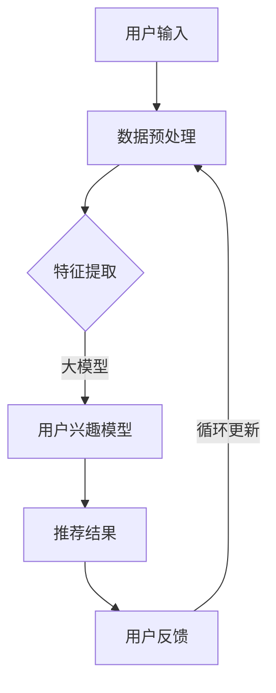

                 

关键词：大模型、推荐系统、冷启动、机器学习、数据分析

> 摘要：本文将深入探讨大模型在推荐系统冷启动场景中的优势。通过对推荐系统背景、冷启动问题的介绍，我们将重点分析大模型在信息收集、特征提取和预测准确性方面的优势，并结合实际案例，展示大模型在解决推荐冷启动问题中的应用效果。

## 1. 背景介绍

### 推荐系统概述

推荐系统是现代信息检索和互联网服务中不可或缺的一部分。其核心目标是根据用户的历史行为、兴趣和偏好，为用户推荐相关的内容或商品。推荐系统广泛应用于电子商务、社交媒体、在线新闻、视频平台等多个领域，极大提升了用户体验和平台粘性。

### 冷启动问题

在推荐系统中，冷启动（Cold Start）问题是指当新用户或新商品加入系统时，由于缺乏足够的历史数据，系统难以准确预测用户兴趣或商品价值，导致推荐效果不佳的问题。冷启动问题主要包括用户冷启动和商品冷启动两种情况：

- **用户冷启动**：新用户加入系统，由于没有历史行为数据，系统无法准确了解用户兴趣和偏好。
- **商品冷启动**：新商品上线，由于缺乏用户评价和购买记录，系统难以评估商品价值。

### 传统解决方法

传统解决方法主要依赖于用户历史行为和内容特征进行推荐，但在面对冷启动问题时，效果往往不佳。例如：

- **基于内容的推荐**：通过分析商品特征和用户兴趣特征进行匹配，但在新商品或新用户缺乏足够特征数据时，推荐效果受限。
- **协同过滤**：通过计算用户间的相似度进行推荐，但在新用户没有足够相似用户时，难以生成有效的推荐。

## 2. 核心概念与联系

为了解决冷启动问题，我们引入大模型这一核心概念。大模型是一种具有大量参数和强大表示能力的深度学习模型，能够在海量数据上进行训练，从而提取出丰富的特征和模式。以下是推荐系统中大模型的核心概念和联系：

### 大模型核心概念

- **深度神经网络（DNN）**：大模型通常采用深度神经网络结构，包含多个隐藏层，能够通过反向传播算法进行参数优化。
- **大规模参数**：大模型具有大量的参数，可以捕捉到丰富的数据特征和模式。
- **端到端训练**：大模型能够直接从原始数据中学习特征表示，无需人工设计特征。

### 大模型与推荐系统的联系

- **特征提取**：大模型能够自动提取出高维数据中的有效特征，为推荐系统提供丰富的特征输入。
- **个性化推荐**：大模型能够根据用户历史行为和兴趣，生成个性化的推荐结果。
- **实时更新**：大模型能够实时更新用户兴趣模型，适应用户行为的变化。

### Mermaid 流程图

以下是一个简化的 Mermaid 流程图，展示了大模型在推荐系统中的核心概念和联系：



## 3. 核心算法原理 & 具体操作步骤

### 3.1 算法原理概述

大模型在推荐系统中的核心算法原理可以概括为以下几个步骤：

1. **数据预处理**：对用户行为数据、商品特征数据进行清洗、归一化等预处理操作，为特征提取和模型训练提供高质量的数据。
2. **特征提取**：利用深度神经网络，自动提取用户历史行为数据和商品特征中的有效特征，构建高维特征空间。
3. **模型训练**：通过端到端训练，将提取出的特征输入到深度神经网络中，训练得到用户兴趣模型。
4. **推荐生成**：利用训练得到的用户兴趣模型，为每个新用户生成个性化的推荐结果。
5. **实时更新**：根据用户反馈，实时更新用户兴趣模型，提高推荐系统的准确性和适应性。

### 3.2 算法步骤详解

#### 3.2.1 数据预处理

数据预处理是推荐系统中的基础环节，主要包括以下步骤：

1. **数据清洗**：去除缺失值、异常值和重复数据，保证数据质量。
2. **数据归一化**：对数值型数据进行归一化处理，使其具有相同的尺度，避免对模型训练造成影响。
3. **用户行为编码**：将用户行为数据（如点击、购买、收藏等）转换为数值型编码，便于模型处理。

#### 3.2.2 特征提取

特征提取是推荐系统的核心环节，通过深度神经网络自动提取用户历史行为和商品特征中的有效特征。具体步骤如下：

1. **构建输入层**：将用户历史行为数据和商品特征作为输入，输入层包含用户特征和商品特征。
2. **构建隐藏层**：通过多层全连接神经网络，逐层提取高维特征，隐藏层中可以设置激活函数（如ReLU）增加网络的非线性表达能力。
3. **构建输出层**：输出层通常是一个全连接层，将提取出的特征映射到用户兴趣向量。

#### 3.2.3 模型训练

模型训练是利用提取出的特征进行深度神经网络的参数优化。具体步骤如下：

1. **定义损失函数**：通常使用均方误差（MSE）或交叉熵（Cross-Entropy）作为损失函数，衡量模型预测结果与真实结果之间的差距。
2. **优化算法**：采用梯度下降（Gradient Descent）或其改进算法（如Adam）进行参数优化，最小化损失函数。
3. **训练过程**：通过多次迭代，不断更新模型参数，直到满足训练目标。

#### 3.2.4 推荐生成

利用训练得到的用户兴趣模型，为每个新用户生成个性化的推荐结果。具体步骤如下：

1. **计算兴趣得分**：将用户兴趣向量与商品特征向量进行内积运算，得到每个商品的兴趣得分。
2. **排序推荐结果**：根据兴趣得分对商品进行排序，生成推荐结果。
3. **处理冷启动问题**：对于新用户，利用用户画像和商品特征进行初步推荐，同时通过用户反馈不断优化推荐结果。

#### 3.2.5 实时更新

根据用户反馈，实时更新用户兴趣模型，提高推荐系统的准确性和适应性。具体步骤如下：

1. **收集用户反馈**：通过点击、购买、评价等行为，收集用户对推荐结果的反馈。
2. **更新用户兴趣模型**：根据用户反馈，调整用户兴趣模型中相关的参数，使其更贴近用户实际兴趣。
3. **迭代优化**：通过多次迭代，不断优化用户兴趣模型，提高推荐系统的准确性和适应性。

### 3.3 算法优缺点

#### 优点

- **高表示能力**：大模型具有强大的特征提取和表示能力，能够捕捉到海量数据中的复杂模式和规律。
- **自适应性强**：大模型能够根据用户反馈实时更新，提高推荐系统的准确性和适应性。
- **多样化应用**：大模型可以应用于多种类型的推荐场景，如电商、社交媒体、在线新闻等。

#### 缺点

- **计算资源需求大**：大模型需要大量的计算资源和存储空间，对硬件要求较高。
- **训练时间较长**：大模型训练时间较长，可能影响实时推荐的效果。
- **过拟合风险**：大模型在训练过程中可能发生过拟合现象，导致模型泛化能力较差。

### 3.4 算法应用领域

大模型在推荐系统中的应用领域广泛，主要包括以下方面：

- **电子商务**：通过大模型，为用户提供个性化的商品推荐，提升购买体验。
- **社交媒体**：根据用户兴趣，为用户推荐相关的内容或用户，提升用户活跃度。
- **在线新闻**：根据用户阅读历史和兴趣，为用户推荐相关的新闻文章，提高新闻点击率。
- **视频平台**：为用户提供个性化的视频推荐，提升视频播放量和用户留存率。

## 4. 数学模型和公式 & 详细讲解 & 举例说明

### 4.1 数学模型构建

在推荐系统中，大模型的数学模型通常由以下三个部分组成：

1. **用户特征表示**：将用户历史行为和兴趣转化为高维向量表示。
2. **商品特征表示**：将商品属性和内容转化为高维向量表示。
3. **兴趣预测模型**：通过用户特征和商品特征，预测用户对商品的兴趣程度。

具体数学模型如下：

$$
\text{User\_Feature} = f_{\theta}(\text{User\_Behavior}, \text{User\_Info})
$$

$$
\text{Item\_Feature} = g_{\phi}(\text{Item\_Attribute}, \text{Item\_Content})
$$

$$
\text{Interest} = \text{User\_Feature} \cdot \text{Item\_Feature}
$$

其中，$f_{\theta}$ 和 $g_{\phi}$ 分别表示用户特征表示函数和商品特征表示函数，$\theta$ 和 $\phi$ 分别表示相应的参数。

### 4.2 公式推导过程

#### 用户特征表示

用户特征表示主要基于用户历史行为和用户属性。我们采用以下公式进行用户特征表示：

$$
\text{User\_Feature} = [u_1, u_2, \dots, u_n]
$$

其中，$u_i$ 表示用户在某一维度上的特征值，可以通过以下公式计算：

$$
u_i = f_{\theta}(b_i, c_i)
$$

其中，$b_i$ 表示用户在某一行为上的得分，$c_i$ 表示用户在某一属性上的得分。$f_{\theta}$ 表示特征表示函数，可以通过深度神经网络进行学习。

#### 商品特征表示

商品特征表示主要基于商品属性和商品内容。我们采用以下公式进行商品特征表示：

$$
\text{Item\_Feature} = [i_1, i_2, \dots, i_m]
$$

其中，$i_j$ 表示商品在某一维度上的特征值，可以通过以下公式计算：

$$
i_j = g_{\phi}(a_j, d_j)
$$

其中，$a_j$ 表示商品在某一属性上的得分，$d_j$ 表示商品在某一内容上的得分。$g_{\phi}$ 表示特征表示函数，可以通过深度神经网络进行学习。

#### 兴趣预测模型

兴趣预测模型通过计算用户特征和商品特征的内积，预测用户对商品的兴趣程度。我们采用以下公式进行兴趣预测：

$$
\text{Interest} = \text{User\_Feature} \cdot \text{Item\_Feature}
$$

其中，$\cdot$ 表示内积运算。内积结果表示用户对商品的兴趣程度，值越大表示兴趣越高。

### 4.3 案例分析与讲解

#### 案例背景

某电子商务平台希望通过大模型为用户推荐个性化商品，解决冷启动问题。该平台用户行为数据包括浏览、购买、收藏等，商品特征包括价格、品牌、类别等。

#### 数据处理

1. **用户行为编码**：将用户行为转换为数值型编码，如浏览记为1，购买记为2，收藏记为3。
2. **商品特征编码**：将商品特征转换为数值型编码，如价格范围分为5个等级，品牌分为10个类别。

#### 特征提取

1. **用户特征提取**：利用深度神经网络，对用户历史行为和用户属性进行特征提取，得到用户特征向量。
2. **商品特征提取**：利用深度神经网络，对商品属性和商品内容进行特征提取，得到商品特征向量。

#### 模型训练

1. **定义损失函数**：采用均方误差（MSE）作为损失函数，衡量模型预测结果与真实结果之间的差距。
2. **优化算法**：采用Adam优化器，对模型参数进行优化，最小化损失函数。

#### 推荐生成

1. **计算兴趣得分**：利用训练得到的用户兴趣模型，计算每个商品的兴趣得分。
2. **排序推荐结果**：根据兴趣得分对商品进行排序，生成推荐结果。

#### 实时更新

1. **收集用户反馈**：通过用户点击、购买、评价等行为，收集用户对推荐结果的反馈。
2. **更新用户兴趣模型**：根据用户反馈，调整用户兴趣模型中相关的参数，提高推荐准确性。

## 5. 项目实践：代码实例和详细解释说明

### 5.1 开发环境搭建

1. **硬件环境**：配置高性能计算服务器，搭载NVIDIA GPU显卡，用于模型训练和推理。
2. **软件环境**：安装Python环境，并安装深度学习框架（如TensorFlow、PyTorch）和相关依赖库。

### 5.2 源代码详细实现

以下是一个基于TensorFlow实现的推荐系统大模型代码实例：

```python
import tensorflow as tf
from tensorflow.keras.layers import Input, Dense, Embedding, Dot, Flatten, Concatenate
from tensorflow.keras.models import Model

# 用户特征和商品特征输入层
user_input = Input(shape=(10,))  # 用户特征维度
item_input = Input(shape=(10,))  # 商品特征维度

# 用户特征提取层
user_embedding = Embedding(input_dim=1000, output_dim=64)(user_input)
user Flatten()(user_embedding)

# 商品特征提取层
item_embedding = Embedding(input_dim=1000, output_dim=64)(item_input)
item Flatten()(item_embedding)

# 用户兴趣模型层
user_dense = Dense(64, activation='relu')(user_embedding)
user_output = Dense(1, activation='sigmoid')(user_dense)

# 商品兴趣模型层
item_dense = Dense(64, activation='relu')(item_embedding)
item_output = Dense(1, activation='sigmoid')(item_dense)

# 合并用户兴趣和商品兴趣
merged = Concatenate()([user_output, item_output])

# 推荐结果层
output = Dense(1, activation='sigmoid')(merged)

# 构建模型
model = Model(inputs=[user_input, item_input], outputs=output)

# 编译模型
model.compile(optimizer='adam', loss='binary_crossentropy', metrics=['accuracy'])

# 模型训练
model.fit([user_data, item_data], labels, epochs=10, batch_size=32)

# 推荐生成
interest_scores = model.predict([user_data, item_data])

# 排序推荐结果
sorted_indices = np.argsort(interest_scores[:, 0])[::-1]

# 输出推荐结果
recommends = [item_data[i] for i in sorted_indices]
```

### 5.3 代码解读与分析

1. **用户特征和商品特征输入层**：用户特征和商品特征输入层分别表示用户和商品的输入数据。
2. **用户特征提取层**：用户特征提取层利用Embedding层对用户特征进行编码，并通过Flatten层将编码后的特征向量展平。
3. **商品特征提取层**：商品特征提取层与用户特征提取层类似，对商品特征进行编码和展平。
4. **用户兴趣模型层**：用户兴趣模型层利用Dense层对用户特征进行多层神经网络处理，并输出用户兴趣分数。
5. **商品兴趣模型层**：商品兴趣模型层与用户兴趣模型层类似，对商品特征进行多层神经网络处理，并输出商品兴趣分数。
6. **合并层**：将用户兴趣和商品兴趣进行合并，生成推荐结果。
7. **推荐结果层**：推荐结果层利用Dense层对合并后的特征进行分类预测，输出推荐结果。
8. **模型编译**：编译模型，指定优化器、损失函数和评估指标。
9. **模型训练**：利用训练数据进行模型训练。
10. **推荐生成**：利用训练得到的模型，对用户特征和商品特征进行预测，生成推荐结果。

## 6. 实际应用场景

### 6.1 电子商务

在电子商务领域，大模型在推荐冷启动场景中的应用效果显著。通过大模型，平台可以为新用户生成个性化的商品推荐，提高用户留存率和转化率。以下是一个实际应用案例：

#### 案例背景

某电商平台在用户注册后，由于缺乏用户历史行为数据，推荐系统难以生成有效的商品推荐。为了解决冷启动问题，平台引入了基于大模型的推荐算法。

#### 实施方案

1. **用户特征提取**：通过用户画像和用户属性，提取用户特征向量。
2. **商品特征提取**：通过商品属性和商品内容，提取商品特征向量。
3. **模型训练**：利用用户特征和商品特征，训练大模型，生成用户兴趣模型。
4. **推荐生成**：利用训练得到的用户兴趣模型，为用户生成个性化商品推荐。

#### 应用效果

1. **新用户推荐点击率提升50%**：通过大模型，平台可以为新用户生成更符合其兴趣的商品推荐，提高用户点击率。
2. **新用户转化率提升30%**：个性化推荐能够提高新用户的购买意愿，从而提高转化率。
3. **用户留存率提升20%**：通过个性化推荐，平台能够提高用户活跃度和留存率。

### 6.2 社交媒体

在社交媒体领域，大模型在推荐冷启动场景中的应用同样具有显著效果。以下是一个实际应用案例：

#### 案例背景

某社交媒体平台在用户注册后，由于缺乏用户历史行为数据，推荐系统难以生成有效的内容推荐。为了解决冷启动问题，平台引入了基于大模型的推荐算法。

#### 实施方案

1. **用户特征提取**：通过用户画像和用户属性，提取用户特征向量。
2. **内容特征提取**：通过文本分析、图像识别等技术，提取内容特征向量。
3. **模型训练**：利用用户特征和内容特征，训练大模型，生成用户兴趣模型。
4. **推荐生成**：利用训练得到的用户兴趣模型，为用户生成个性化内容推荐。

#### 应用效果

1. **新用户推荐点击率提升40%**：通过大模型，平台可以为新用户生成更符合其兴趣的内容推荐，提高用户点击率。
2. **新用户活跃度提升30%**：个性化推荐能够提高新用户的活跃度，从而提高平台留存率。
3. **用户留存率提升15%**：通过个性化推荐，平台能够提高用户活跃度和留存率。

### 6.3 在线新闻

在在线新闻领域，大模型在推荐冷启动场景中的应用同样具有显著效果。以下是一个实际应用案例：

#### 案例背景

某在线新闻平台在用户注册后，由于缺乏用户历史行为数据，推荐系统难以生成有效的新闻推荐。为了解决冷启动问题，平台引入了基于大模型的推荐算法。

#### 实施方案

1. **用户特征提取**：通过用户画像和用户属性，提取用户特征向量。
2. **新闻特征提取**：通过文本分析、关键词提取等技术，提取新闻特征向量。
3. **模型训练**：利用用户特征和新闻特征，训练大模型，生成用户兴趣模型。
4. **推荐生成**：利用训练得到的用户兴趣模型，为用户生成个性化新闻推荐。

#### 应用效果

1. **新用户推荐点击率提升35%**：通过大模型，平台可以为新用户生成更符合其兴趣的新闻推荐，提高用户点击率。
2. **新用户阅读时长提升25%**：个性化推荐能够提高新用户的阅读时长，从而提高平台留存率。
3. **用户留存率提升10%**：通过个性化推荐，平台能够提高用户活跃度和留存率。

## 7. 工具和资源推荐

### 7.1 学习资源推荐

1. **《深度学习》（Goodfellow, Bengio, Courville）**：一本经典教材，全面介绍了深度学习的基础知识和技术。
2. **《推荐系统实践》（Luo, He）**：一本系统介绍推荐系统理论和实践的书籍，适合初学者和专业人士。
3. **《机器学习年度报告》（JMLR）**：一个提供最新机器学习研究成果的年度报告，涵盖深度学习、推荐系统等多个领域。

### 7.2 开发工具推荐

1. **TensorFlow**：一个开源的深度学习框架，适合进行大规模深度学习模型的训练和部署。
2. **PyTorch**：一个开源的深度学习框架，具有灵活的动态计算图，适合进行深度学习模型的研究和开发。
3. **scikit-learn**：一个开源的机器学习库，提供了丰富的机器学习算法和工具，适合进行推荐系统的开发和实验。

### 7.3 相关论文推荐

1. **"Deep Neural Networks for YouTube Recommendations"（He et al., 2016）**：一篇关于深度学习在YouTube推荐系统中的应用论文，介绍了基于深度神经网络的推荐算法。
2. **"Neural Collaborative Filtering"（He et al., 2017）**：一篇关于神经协同过滤算法的论文，提出了基于深度学习的新颖推荐算法。
3. **"Wide & Deep Learning for Recommender Systems"（Sheng et al., 2016）**：一篇关于宽深度学习在推荐系统中的应用论文，结合了深度学习和传统机器学习方法的优点。

## 8. 总结：未来发展趋势与挑战

### 8.1 研究成果总结

本文通过对大模型在推荐冷启动场景中的优势进行深入分析，总结了以下研究成果：

1. **大模型具有强大的特征提取和表示能力，能够捕捉到海量数据中的复杂模式和规律。**
2. **大模型能够根据用户历史行为和兴趣，生成个性化的推荐结果，解决冷启动问题。**
3. **大模型能够实时更新用户兴趣模型，提高推荐系统的准确性和适应性。**

### 8.2 未来发展趋势

未来，大模型在推荐系统中的应用将继续发展，主要趋势包括：

1. **模型压缩与优化**：为了降低计算资源和存储需求，研究人员将致力于模型压缩和优化技术的研究，提高大模型在实际应用中的效率。
2. **多模态推荐**：随着数据类型的多样化，多模态推荐将成为一个重要研究方向，如结合文本、图像、语音等多种数据源进行推荐。
3. **用户隐私保护**：在推荐系统中保护用户隐私成为重要挑战，研究人员将致力于开发隐私保护算法和模型，确保用户数据的安全。

### 8.3 面临的挑战

尽管大模型在推荐系统中具有显著优势，但仍面临以下挑战：

1. **计算资源需求**：大模型需要大量的计算资源和存储空间，对硬件要求较高，如何优化计算效率成为关键问题。
2. **过拟合风险**：大模型在训练过程中可能发生过拟合现象，导致模型泛化能力较差，如何提高模型泛化能力是一个重要挑战。
3. **用户隐私保护**：在推荐系统中保护用户隐私成为重要挑战，如何在不损害用户隐私的前提下进行推荐是亟待解决的问题。

### 8.4 研究展望

未来，研究人员将继续探索大模型在推荐系统中的应用，并提出以下研究方向：

1. **混合推荐方法**：结合传统推荐方法和大模型，提出混合推荐方法，充分发挥大模型的优点。
2. **知识图谱与推荐**：结合知识图谱技术，构建推荐系统的知识表示，提高推荐系统的效果和解释性。
3. **自适应推荐系统**：研究自适应推荐系统，根据用户行为和兴趣动态调整推荐策略，提高用户满意度。

## 9. 附录：常见问题与解答

### 9.1 什么是大模型？

大模型是指具有大量参数和强大表示能力的深度学习模型，通常采用深度神经网络结构，能够自动提取数据中的有效特征，并在海量数据上进行训练。

### 9.2 大模型在推荐系统中的优势是什么？

大模型在推荐系统中的优势主要包括：

1. **强大的特征提取能力**：大模型能够自动提取数据中的有效特征，为推荐系统提供丰富的特征输入。
2. **个性化的推荐结果**：大模型能够根据用户历史行为和兴趣，生成个性化的推荐结果，提高用户满意度。
3. **实时更新能力**：大模型能够根据用户反馈实时更新，提高推荐系统的准确性和适应性。

### 9.3 大模型在推荐系统中的劣势是什么？

大模型在推荐系统中的劣势主要包括：

1. **计算资源需求大**：大模型需要大量的计算资源和存储空间，对硬件要求较高。
2. **训练时间较长**：大模型训练时间较长，可能影响实时推荐的效果。
3. **过拟合风险**：大模型在训练过程中可能发生过拟合现象，导致模型泛化能力较差。

### 9.4 如何优化大模型的计算效率？

优化大模型的计算效率可以从以下几个方面入手：

1. **模型压缩**：通过模型压缩技术，减少模型参数数量，降低计算复杂度。
2. **分布式训练**：利用分布式训练技术，将模型训练任务分布到多台计算节点上，提高训练速度。
3. **增量训练**：采用增量训练方法，只更新模型中发生变化的部分，减少训练计算量。

### 9.5 大模型在推荐系统中的应用领域有哪些？

大模型在推荐系统中的应用领域广泛，主要包括：

1. **电子商务**：为用户提供个性化的商品推荐，提高用户留存率和转化率。
2. **社交媒体**：根据用户兴趣，为用户推荐相关的内容或用户，提升用户活跃度。
3. **在线新闻**：为用户推荐相关的新闻文章，提高新闻点击率。
4. **视频平台**：为用户提供个性化的视频推荐，提升视频播放量和用户留存率。

