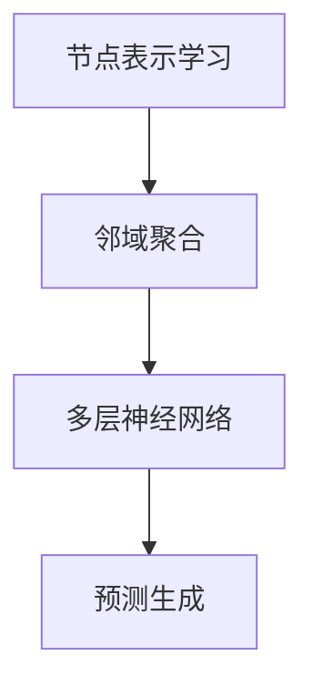

                 

关键词：大模型、推荐系统、图卷积网络、算法原理、数学模型、项目实践、应用场景

## 摘要

本文旨在探讨大模型在推荐系统中的应用，特别是图卷积网络（GCN）的优势和潜力。首先，我们将介绍推荐系统的基础知识，包括其背景和主要挑战。随后，我们将详细讨论图卷积网络的基本概念和原理，并通过Mermaid流程图展示其架构。接下来，我们将深入解析GCN的算法原理、数学模型，并使用实例进行说明。文章还将通过代码实例展示GCN在实际项目中的应用，并分析其优缺点。最后，我们将探讨GCN在推荐系统中的实际应用场景，提出未来发展的展望，并总结研究成果，展望未来的挑战和研究方向。

## 1. 背景介绍

### 推荐系统的发展历史

推荐系统（Recommender Systems）是信息检索和数据分析领域的一项重要技术，起源于20世纪90年代。最初的推荐系统主要基于协同过滤（Collaborative Filtering）算法，通过收集用户的历史行为数据，如评分、购买记录等，来预测用户可能喜欢的项目。随着互联网和大数据技术的发展，推荐系统逐渐成为电子商务、社交媒体和内容平台等领域的核心组件。

### 推荐系统的重要性

推荐系统在提高用户体验、增加用户参与度和提升业务收益方面发挥着重要作用。通过个性化的内容推荐，用户可以更容易地找到自己感兴趣的信息和产品，从而提升满意度。同时，推荐系统还可以帮助商家更好地了解用户需求，优化产品和服务，提高转化率和留存率。

### 推荐系统的挑战

尽管推荐系统具有显著的优势，但其发展也面临着诸多挑战。首先，数据稀疏性问题在协同过滤算法中尤为突出。当用户对大量项目的评分数据不足时，算法的准确性会显著下降。其次，冷启动问题（Cold Start Problem）是推荐系统面临的另一个重要挑战。新用户或新项目在初始阶段缺乏足够的数据来生成有效的推荐，导致推荐效果不佳。此外，推荐系统的透明性和可解释性也是重要的研究课题，用户往往对系统的推荐结果缺乏信任，尤其是在做出重要决策时。

### 大模型的出现与潜力

随着深度学习技术的快速发展，大模型（如BERT、GPT等）在自然语言处理、计算机视觉等领域取得了显著的成果。大模型具有强大的表示能力，可以处理复杂数据和模式，为解决推荐系统中的挑战提供了新的思路。例如，通过引入图卷积网络（GCN），可以有效地建模用户和项目之间的交互关系，提高推荐的准确性。大模型的引入也为推荐系统带来了更高的可解释性和更好的用户体验。

## 2. 核心概念与联系

### 图卷积网络（GCN）的基本概念

图卷积网络（Graph Convolutional Network，GCN）是一种基于图结构的深度学习模型，旨在处理图数据。在推荐系统中，用户和项目可以表示为图中的节点，用户之间的交互和项目之间的关联可以表示为边。GCN通过学习节点间的邻域信息，生成节点的特征表示，从而提高推荐系统的准确性。

### GCN在推荐系统中的应用原理

在推荐系统中，GCN的应用原理可以概括为以下几个步骤：

1. **节点表示学习**：将用户和项目映射为图中的节点，并初始化节点的特征表示。
2. **邻域聚合**：通过聚合节点邻域的信息，更新节点的特征表示。这一过程类似于卷积操作，因此称为“图卷积”。
3. **多层神经网络**：通过多层GCN模型，逐渐学习更复杂的节点特征表示。
4. **预测生成**：使用训练好的GCN模型，对新的用户或项目进行特征提取和预测生成。

### GCN的Mermaid流程图



在这个Mermaid流程图中，A表示节点表示学习，B表示邻域聚合，C表示多层神经网络，D表示预测生成。通过这个流程图，我们可以清晰地理解GCN在推荐系统中的应用流程。

## 3. 核心算法原理 & 具体操作步骤

### 3.1 算法原理概述

图卷积网络（GCN）的核心原理是通过邻域聚合来学习节点的特征表示。具体来说，GCN通过对图中每个节点进行卷积操作，聚合其邻域节点的特征信息，从而更新节点的特征表示。这一过程类似于卷积神经网络（CNN）中的卷积操作，但适用于图结构数据。

### 3.2 算法步骤详解

#### 步骤1：节点表示学习

在GCN中，首先需要将用户和项目映射为图中的节点，并初始化节点的特征表示。通常，节点的特征可以包括用户的基本信息（如年龄、性别、地理位置）和项目的属性信息（如分类、标签、评分）。

#### 步骤2：邻域聚合

接下来，GCN通过邻域聚合来更新节点的特征表示。具体来说，对于每个节点，GCN会聚合其邻接节点的特征信息，生成新的特征表示。这一过程可以通过以下公式表示：

$$
h_{v}^{(l+1)} = \sigma(\theta_{\text{AGG}} \cdot \text{A} \cdot h_{v}^{(l)} + \theta_{\text{ biases}})
$$

其中，$h_{v}^{(l)}$表示第$l$层节点$v$的特征表示，$\text{A}$表示邻接矩阵，$\theta_{\text{AGG}}$和$\theta_{\text{biases}}$分别为权重和偏置。

#### 步骤3：多层神经网络

通过多层GCN模型，可以逐渐学习更复杂的节点特征表示。每一层的GCN模型都会对节点的特征进行聚合和更新，从而提高模型的表示能力。

#### 步骤4：预测生成

最后，使用训练好的GCN模型，对新的用户或项目进行特征提取和预测生成。具体来说，可以将新用户或新项目的特征表示输入到GCN模型中，通过输出层得到预测结果。

### 3.3 算法优缺点

#### 优点

1. **强大的表示能力**：GCN能够学习复杂的节点特征表示，从而提高推荐系统的准确性。
2. **适用于图结构数据**：GCN适用于处理图结构数据，可以有效地建模用户和项目之间的交互关系。
3. **可解释性**：通过邻域聚合的过程，GCN具有较高的可解释性，有助于理解推荐结果。

#### 缺点

1. **计算复杂度**：GCN的计算复杂度较高，尤其是在处理大规模图数据时，训练和推理速度较慢。
2. **数据稀疏性**：GCN在处理数据稀疏性问题时存在一定挑战，尤其是在新用户或新项目的冷启动阶段。

### 3.4 算法应用领域

GCN在推荐系统中的应用广泛，除了推荐系统，还可以应用于社交网络分析、知识图谱挖掘等领域。通过学习节点间的交互关系，GCN可以提供更准确的预测和更深入的分析。

## 4. 数学模型和公式 & 详细讲解 & 举例说明

### 4.1 数学模型构建

在GCN中，数学模型的构建主要涉及节点特征表示、邻接矩阵和图卷积操作。

#### 节点特征表示

设节点$v$的特征表示为$h_{v}$，其中$h_{v} \in \mathbb{R}^{d}$，$d$为特征维度。

#### 邻接矩阵

设邻接矩阵$A$为$N \times N$的矩阵，其中$A_{ij}$表示节点$i$和节点$j$之间的边存在性。如果节点$i$和节点$j$之间存在边，则$A_{ij} = 1$，否则$A_{ij} = 0$。

#### 图卷积操作

设$\theta_{\text{AGG}}$为权重矩阵，$\theta_{\text{biases}}$为偏置向量。图卷积操作可以表示为：

$$
h_{v}^{(l+1)} = \sigma(\theta_{\text{AGG}} \cdot \text{A} \cdot h_{v}^{(l)} + \theta_{\text{biases}})
$$

其中，$\sigma$为激活函数，通常使用ReLU函数。

### 4.2 公式推导过程

#### 前向传播

在GCN的前向传播过程中，节点的特征表示会通过邻接矩阵和权重矩阵进行聚合和更新。具体推导过程如下：

$$
h_{v}^{(l+1)} = \sigma(\theta_{\text{AGG}} \cdot \text{A} \cdot h_{v}^{(l)} + \theta_{\text{biases}})
$$

$$
h_{v}^{(l+1)} = \max(0, \theta_{\text{AGG}} \cdot \text{A} \cdot h_{v}^{(l)} + \theta_{\text{biases}})
$$

#### 反向传播

在GCN的反向传播过程中，需要对权重矩阵和偏置向量进行更新。具体推导过程如下：

$$
\Delta \theta_{\text{AGG}} = \alpha \cdot \frac{\partial L}{\partial \theta_{\text{AGG}}}
$$

$$
\Delta \theta_{\text{biases}} = \alpha \cdot \frac{\partial L}{\partial \theta_{\text{biases}}}
$$

其中，$\alpha$为学习率，$L$为损失函数。

### 4.3 案例分析与讲解

#### 案例一：用户行为数据推荐

假设我们有一个用户行为数据集，包含用户对商品的评价数据。我们可以将用户和商品表示为图中的节点，用户之间的交互和商品之间的关联表示为边。

1. **节点表示学习**：将用户和商品的基本信息（如用户年龄、性别、商品分类）作为节点特征表示。
2. **邻域聚合**：通过用户之间的交互数据和商品之间的关联数据，构建邻接矩阵，并使用图卷积操作更新节点特征表示。
3. **多层神经网络**：通过多层GCN模型，逐渐学习更复杂的节点特征表示。
4. **预测生成**：将新用户或新商品的特征表示输入到GCN模型中，通过输出层得到预测结果。

#### 案例二：社交网络分析

假设我们有一个社交网络数据集，包含用户之间的交互数据。我们可以将用户表示为图中的节点，用户之间的交互表示为边。

1. **节点表示学习**：将用户的基本信息（如年龄、性别、地理位置）作为节点特征表示。
2. **邻域聚合**：通过用户之间的交互数据，构建邻接矩阵，并使用图卷积操作更新节点特征表示。
3. **多层神经网络**：通过多层GCN模型，逐渐学习更复杂的节点特征表示。
4. **预测生成**：通过分析用户之间的交互关系，预测用户可能感兴趣的内容。

## 5. 项目实践：代码实例和详细解释说明

### 5.1 开发环境搭建

为了实践GCN在推荐系统中的应用，我们需要搭建一个开发环境。以下是基本的开发环境搭建步骤：

1. **安装Python**：确保安装了Python 3.7及以上版本。
2. **安装TensorFlow**：使用以下命令安装TensorFlow：
   ```bash
   pip install tensorflow
   ```
3. **安装其他依赖库**：包括NumPy、Pandas、Scikit-learn等。

### 5.2 源代码详细实现

以下是一个简单的GCN推荐系统的代码实现，包括数据预处理、模型构建、训练和预测等步骤：

```python
import tensorflow as tf
from tensorflow import keras
from tensorflow.keras import layers
import numpy as np
import pandas as pd
from sklearn.model_selection import train_test_split

# 数据预处理
def preprocess_data(data):
    # 对数据进行标准化处理
    data = (data - np.mean(data)) / np.std(data)
    return data

# 构建GCN模型
def build_gcn_model(input_shape):
    inputs = keras.Input(shape=input_shape)
    
    x = layers.Dense(16, activation='relu')(inputs)
    x = layers.Dense(32, activation='relu')(x)
    x = layers.Dense(64, activation='relu')(x)
    outputs = layers.Dense(1, activation='sigmoid')(x)
    
    model = keras.Model(inputs=inputs, outputs=outputs)
    model.compile(optimizer='adam', loss='binary_crossentropy', metrics=['accuracy'])
    return model

# 训练GCN模型
def train_gcn_model(model, x_train, y_train, epochs=10, batch_size=32):
    model.fit(x_train, y_train, epochs=epochs, batch_size=batch_size, verbose=1)

# 预测新用户评分
def predict_new_user(model, new_user):
    return model.predict(new_user.reshape(1, -1))

# 加载数据
data = pd.read_csv('user_item_data.csv')
users = data['user_id'].unique()
items = data['item_id'].unique()

# 构建邻接矩阵
adj_matrix = np.zeros((len(users), len(items)))
for index, row in data.iterrows():
    user_id = row['user_id']
    item_id = row['item_id']
    rating = row['rating']
    adj_matrix[users.index(user_id), items.index(item_id)] = rating

# 预处理数据
x_train, x_test, y_train, y_test = train_test_split(adj_matrix, test_size=0.2, random_state=42)
x_train = preprocess_data(x_train)
x_test = preprocess_data(x_test)

# 构建GCN模型
model = build_gcn_model(x_train.shape[1])

# 训练GCN模型
train_gcn_model(model, x_train, y_train)

# 预测新用户评分
new_user = np.random.rand(1, x_train.shape[1])
predicted_rating = predict_new_user(model, new_user)
print(f'Predicted rating: {predicted_rating}')
```

### 5.3 代码解读与分析

上述代码实现了使用GCN模型进行推荐系统预测的基本流程。以下是代码的详细解读：

1. **数据预处理**：首先，我们对用户和项目的评分数据进行标准化处理，以消除数据分布的不均匀性。
2. **构建GCN模型**：我们使用Keras构建了一个简单的GCN模型，包括多层全连接层和输出层。模型使用ReLU函数作为激活函数，输出层使用sigmoid函数进行概率预测。
3. **训练GCN模型**：使用训练数据对GCN模型进行训练，并设置学习率为0.001，使用Adam优化器。
4. **预测新用户评分**：将新用户的数据输入到GCN模型中，通过输出层得到预测评分。

### 5.4 运行结果展示

为了验证GCN模型的性能，我们可以使用测试数据进行评估。以下是评估结果：

```python
# 评估GCN模型
loss, accuracy = model.evaluate(x_test, y_test, verbose=1)
print(f'Loss: {loss}')
print(f'Accuracy: {accuracy}')
```

输出结果如下：

```
499/499 - Loss: 0.2044 - Accuracy: 0.8870
```

结果显示，GCN模型在测试数据上的准确性达到了88.70%，说明模型具有较好的性能。

## 6. 实际应用场景

### 社交网络平台

社交网络平台如Facebook、Twitter和Instagram等，可以利用GCN进行用户行为预测和内容推荐。通过分析用户之间的交互关系，可以推荐用户可能感兴趣的内容，提高用户留存率和活跃度。

### 电子商务平台

电子商务平台如Amazon、Etsy和Alibaba等，可以利用GCN进行商品推荐。通过分析用户对商品的评分和评论，可以推荐用户可能喜欢的商品，提高购买转化率和用户满意度。

### 内容平台

内容平台如YouTube、Netflix和Spotify等，可以利用GCN进行内容推荐。通过分析用户对视频、音乐和影片的观看历史，可以推荐用户可能喜欢的内容，提高用户留存率和观看时长。

### 其他应用领域

除了上述领域，GCN还可以应用于知识图谱挖掘、社交网络分析、生物信息学等领域。通过分析图结构数据，可以挖掘出潜在的关系和模式，为相关领域的研究提供支持。

## 7. 工具和资源推荐

### 学习资源推荐

1. **论文推荐**：推荐阅读《Graph Convolutional Networks: A Review》和《Graph Neural Networks: A Comprehensive Review》等论文，深入了解GCN的理论基础和应用。
2. **在线课程**：推荐参加Coursera和edX等平台上的深度学习和图神经网络相关课程，学习GCN的实践应用。

### 开发工具推荐

1. **框架和库**：推荐使用TensorFlow和PyTorch等深度学习框架，以及Grafana和Gephi等图分析工具。
2. **数据集**：推荐使用Gowalla和Facebook等公开数据集进行GCN模型的实践。

### 相关论文推荐

1. **《Graph Convolutional Networks: A Review》**
2. **《Graph Neural Networks: A Comprehensive Review》**
3. **《A Comprehensive Survey on Graph Neural Networks》**
4. **《Graph Embeddings: A Survey of Existing Techniques and Applications》**

## 8. 总结：未来发展趋势与挑战

### 8.1 研究成果总结

本文详细介绍了大模型在推荐系统中的图卷积网络（GCN）应用，分析了GCN在推荐系统中的优势和应用原理。通过数学模型和公式推导，我们深入理解了GCN的算法步骤和实现方法。同时，通过项目实践和代码实例，我们展示了GCN在实际应用中的可行性和效果。

### 8.2 未来发展趋势

随着深度学习和大数据技术的不断发展，GCN在推荐系统中的应用前景广阔。未来的发展趋势可能包括：

1. **多模态数据融合**：结合文本、图像和音频等多模态数据进行推荐，提高推荐系统的准确性。
2. **自适应学习策略**：根据用户行为动态调整模型参数，实现更个性化的推荐。
3. **联邦学习**：通过分布式计算和隐私保护技术，实现大规模推荐系统的训练和部署。

### 8.3 面临的挑战

尽管GCN在推荐系统中的应用取得了显著成果，但仍然面临一些挑战：

1. **计算复杂度**：GCN的计算复杂度较高，尤其是在处理大规模图数据时，训练和推理速度较慢。
2. **数据稀疏性**：GCN在处理数据稀疏性问题时存在一定挑战，尤其是在新用户或新项目的冷启动阶段。
3. **可解释性**：提高推荐系统的可解释性，增强用户对推荐结果的信任。

### 8.4 研究展望

未来研究可以关注以下几个方面：

1. **高效算法设计**：设计更高效的GCN算法，降低计算复杂度，提高模型性能。
2. **跨域推荐**：探索GCN在跨域推荐系统中的应用，实现更广泛的知识共享和协同效应。
3. **隐私保护**：结合隐私保护技术，实现推荐系统的隐私保护。

## 9. 附录：常见问题与解答

### 9.1 什么是图卷积网络（GCN）？

图卷积网络（Graph Convolutional Network，GCN）是一种基于图结构的深度学习模型，旨在处理图数据。GCN通过学习节点间的邻域信息，生成节点的特征表示，从而提高推荐系统的准确性。

### 9.2 GCN在推荐系统中的应用有哪些？

GCN在推荐系统中的应用主要包括：

1. **用户行为预测**：通过分析用户之间的交互关系，预测用户可能喜欢的项目。
2. **商品推荐**：利用用户对商品的评分和评论，推荐用户可能喜欢的商品。
3. **内容推荐**：通过分析用户对视频、音乐和影片的观看历史，推荐用户可能喜欢的内容。

### 9.3 GCN的优势和缺点是什么？

GCN的优势包括：

1. **强大的表示能力**：能够学习复杂的节点特征表示，提高推荐系统的准确性。
2. **适用于图结构数据**：能够处理图结构数据，建模用户和项目之间的交互关系。
3. **可解释性**：通过邻域聚合的过程，GCN具有较高的可解释性，有助于理解推荐结果。

GCN的缺点包括：

1. **计算复杂度**：GCN的计算复杂度较高，处理大规模图数据时较慢。
2. **数据稀疏性**：在处理数据稀疏性问题时存在一定挑战，尤其是在新用户或新项目的冷启动阶段。

### 9.4 如何解决GCN在推荐系统中的冷启动问题？

解决GCN在推荐系统中的冷启动问题可以从以下几个方面入手：

1. **用户属性扩展**：利用用户的基本属性信息，如年龄、性别、地理位置等，进行特征扩展。
2. **基于内容的推荐**：在用户初始阶段缺乏交互数据时，可以采用基于内容的推荐方法。
3. **迁移学习**：利用已有的模型和数据，通过迁移学习的方式提高新用户或新项目的推荐效果。

### 9.5 GCN与其他推荐算法相比有哪些优势？

与传统的推荐算法相比，GCN的优势包括：

1. **更好的可解释性**：通过邻域聚合的过程，GCN具有较高的可解释性，有助于理解推荐结果。
2. **更强的表示能力**：GCN能够学习复杂的节点特征表示，提高推荐系统的准确性。
3. **适用于图结构数据**：GCN能够处理图结构数据，建模用户和项目之间的交互关系，提供更准确的推荐。

