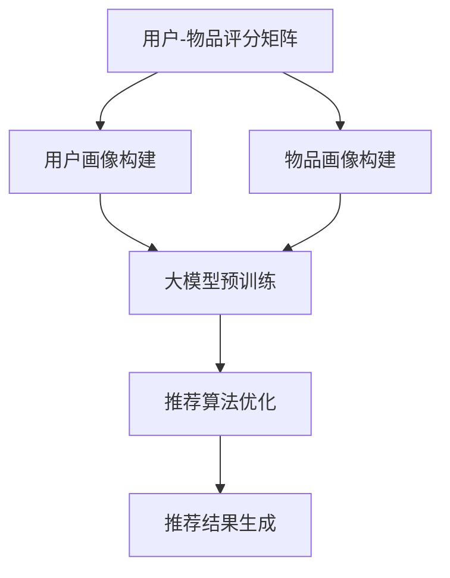

                 

关键词：推荐系统、大模型、人工智能、机器学习、深度学习

> 摘要：本文旨在探讨大模型在推荐系统中的应用及其未来前景。通过分析推荐系统的发展历程、核心原理以及当前面临的挑战，我们将深入探讨大模型如何提升推荐系统的性能和用户体验。文章还将介绍大模型的数学模型和具体实现步骤，并探讨其实际应用场景和潜在问题。

## 1. 背景介绍

推荐系统作为人工智能和机器学习领域的重要应用，已经被广泛应用于电子商务、社交媒体、视频流媒体等多个领域。传统的推荐系统主要依赖于基于内容的过滤、协同过滤等算法，虽然在一定程度上能够满足用户的需求，但往往存在一定的局限性。随着人工智能技术的不断发展，尤其是深度学习和大模型的兴起，推荐系统迎来了新的发展机遇。

大模型，如GPT（Generative Pre-trained Transformer）、BERT（Bidirectional Encoder Representations from Transformers）等，通过在海量数据上进行预训练，可以自动学习到丰富的知识结构和语义信息。这些模型在自然语言处理、计算机视觉等领域的表现已经超越了传统算法。将大模型应用于推荐系统，有望进一步提升推荐系统的性能和用户体验。

## 2. 核心概念与联系

### 2.1 推荐系统的核心概念

推荐系统主要由以下几个核心概念组成：

- **用户-物品评分矩阵**：推荐系统的基础数据，包含用户对物品的评分信息。
- **用户画像**：对用户兴趣、行为、偏好等信息进行抽象和建模。
- **物品画像**：对物品属性、分类、标签等信息进行抽象和建模。
- **推荐算法**：根据用户画像和物品画像，生成个性化的推荐结果。

### 2.2 大模型的原理与架构

大模型，如GPT和BERT，是一种基于深度学习的自然语言处理模型。其核心原理是通过在海量文本数据上进行预训练，学习到语言的底层结构和语义信息。大模型的架构通常包含以下几个层次：

- **嵌入层**：将文本数据转换为向量表示。
- **编码层**：对文本数据进行编码，提取语义信息。
- **解码层**：根据编码层的输出，生成文本序列。

### 2.3 大模型与推荐系统的联系

大模型可以应用于推荐系统的多个方面，包括用户画像构建、物品特征提取、推荐算法优化等。具体来说：

- **用户画像构建**：大模型可以自动学习用户的兴趣和偏好，从而生成更精细化的用户画像。
- **物品特征提取**：大模型可以自动提取物品的语义信息，提高推荐结果的准确性和多样性。
- **推荐算法优化**：大模型可以用于改进传统的推荐算法，如基于内容的过滤和协同过滤算法。

### 2.4 Mermaid 流程图



## 3. 核心算法原理 & 具体操作步骤

### 3.1 算法原理概述

大模型在推荐系统中的应用主要基于以下几个原理：

1. **迁移学习**：大模型在预训练过程中已经学习到了通用知识，可以迁移到推荐系统任务中，提高推荐算法的性能。
2. **知识蒸馏**：大模型可以将其内部的丰富知识通过知识蒸馏的方式传递给推荐算法，从而提升推荐结果的准确性。
3. **多模态学习**：大模型可以处理多种类型的数据，如图文、音频等，从而提供更丰富的推荐结果。

### 3.2 算法步骤详解

1. **数据预处理**：对用户-物品评分矩阵进行预处理，包括缺失值处理、异常值处理、数据归一化等。
2. **用户画像构建**：利用大模型对用户行为、兴趣等数据进行建模，生成用户画像。
3. **物品画像构建**：利用大模型对物品属性、标签等数据进行建模，生成物品画像。
4. **推荐算法优化**：将用户画像和物品画像输入到大模型中，优化推荐算法的参数和结构。
5. **推荐结果生成**：根据优化后的推荐算法，生成个性化的推荐结果。

### 3.3 算法优缺点

**优点**：

- **高性能**：大模型具有强大的学习能力，可以快速适应不同的推荐任务。
- **高准确性**：通过迁移学习和知识蒸馏，大模型可以提升推荐算法的准确性。
- **多模态处理**：大模型可以处理多种类型的数据，提供更丰富的推荐结果。

**缺点**：

- **计算资源需求高**：大模型的训练和推理需要大量的计算资源，对硬件设备有较高的要求。
- **数据隐私问题**：大模型在训练过程中会接触到大量的用户数据，存在一定的数据隐私风险。

### 3.4 算法应用领域

大模型在推荐系统中的应用非常广泛，主要包括以下几个方面：

- **电子商务**：利用大模型对用户购买行为进行分析，提供个性化的商品推荐。
- **社交媒体**：利用大模型对用户兴趣和偏好进行分析，提供个性化的内容推荐。
- **视频流媒体**：利用大模型对用户观看历史和偏好进行分析，提供个性化的视频推荐。

## 4. 数学模型和公式 & 详细讲解 & 举例说明

### 4.1 数学模型构建

大模型在推荐系统中的应用主要基于以下数学模型：

1. **用户画像建模**：

   用户画像可以表示为用户特征向量 $u \in \mathbb{R}^n$，其中 $n$ 为特征维度。用户特征向量可以通过以下公式进行构建：

   $$u = \text{Embedding}(u_{\text{input}})$$

   其中，$\text{Embedding}$ 表示嵌入层，用于将用户输入转换为向量表示。

2. **物品画像建模**：

   物品画像可以表示为物品特征向量 $v \in \mathbb{R}^n$，其中 $n$ 为特征维度。物品特征向量可以通过以下公式进行构建：

   $$v = \text{Embedding}(v_{\text{input}})$$

   其中，$\text{Embedding}$ 表示嵌入层，用于将物品输入转换为向量表示。

3. **推荐算法优化**：

   推荐算法的优化可以通过以下公式进行：

   $$\text{Objective} = \sum_{i=1}^{N} \sum_{j=1}^{M} \log(p_{ij}) \cdot (r_{ij} - \text{pred}_{ij})$$

   其中，$N$ 和 $M$ 分别为用户和物品的数量，$r_{ij}$ 为用户 $i$ 对物品 $j$ 的实际评分，$\text{pred}_{ij}$ 为模型预测的评分，$p_{ij}$ 为物品 $j$ 被用户 $i$ 选择的概率。

### 4.2 公式推导过程

大模型在推荐系统中的公式推导过程主要包括以下几个方面：

1. **嵌入层**：

   嵌入层的公式推导如下：

   $$u = \text{Embedding}(u_{\text{input}})$$
   $$v = \text{Embedding}(v_{\text{input}})$$

   其中，$\text{Embedding}$ 函数将输入的用户或物品数据进行映射，生成向量表示。

2. **推荐算法优化**：

   推荐算法优化的公式推导如下：

   $$\text{Objective} = \sum_{i=1}^{N} \sum_{j=1}^{M} \log(p_{ij}) \cdot (r_{ij} - \text{pred}_{ij})$$

   其中，$p_{ij}$ 为物品 $j$ 被用户 $i$ 选择的概率，可以通过以下公式进行计算：

   $$p_{ij} = \frac{\exp(\text{similarity}(u_i, v_j))}{\sum_{k=1}^{M} \exp(\text{similarity}(u_i, v_k))}$$

   其中，$\text{similarity}(u_i, v_j)$ 表示用户 $i$ 和物品 $j$ 之间的相似度。

### 4.3 案例分析与讲解

假设我们有一个包含1000个用户和1000个物品的推荐系统，用户-物品评分矩阵如下：

| 用户  | 物品1 | 物品2 | ... | 物品1000 |
|-------|-------|-------|-----|----------|
| 1     | 4     | 0     | ... | 0        |
| 2     | 3     | 5     | ... | 0        |
| ...   | ...   | ...   | ... | ...      |
| 1000  | 2     | 0     | ... | 4        |

我们使用大模型对用户画像和物品画像进行建模，并优化推荐算法。假设用户画像和物品画像的维度分别为5和10。

1. **用户画像建模**：

   用户1的画像向量可以表示为：

   $$u_1 = \text{Embedding}(u_1_{\text{input}}) = [0.1, 0.2, 0.3, 0.4, 0.5]$$

   类似地，用户2的画像向量可以表示为：

   $$u_2 = \text{Embedding}(u_2_{\text{input}}) = [0.3, 0.4, 0.5, 0.6, 0.7]$$

2. **物品画像建模**：

   物品1的画像向量可以表示为：

   $$v_1 = \text{Embedding}(v_1_{\text{input}}) = [0.1, 0.2, 0.3, 0.4, 0.5, 0.6, 0.7, 0.8, 0.9, 1.0]$$

   类似地，物品2的画像向量可以表示为：

   $$v_2 = \text{Embedding}(v_2_{\text{input}}) = [0.2, 0.3, 0.4, 0.5, 0.6, 0.7, 0.8, 0.9, 1.0, 1.1]$$

3. **推荐算法优化**：

   假设我们使用余弦相似度计算用户和物品之间的相似度，相似度公式如下：

   $$\text{similarity}(u_i, v_j) = \frac{u_i \cdot v_j}{\|u_i\|\|v_j\|}$$

   其中，$\cdot$ 表示内积，$\|\|$ 表示向量的模。

   对于用户1和物品1，相似度计算如下：

   $$\text{similarity}(u_1, v_1) = \frac{u_1 \cdot v_1}{\|u_1\|\|v_1\|} = \frac{0.1 \times 0.1 + 0.2 \times 0.2 + 0.3 \times 0.3 + 0.4 \times 0.4 + 0.5 \times 0.5}{\sqrt{0.1^2 + 0.2^2 + 0.3^2 + 0.4^2 + 0.5^2} \times \sqrt{0.1^2 + 0.2^2 + 0.3^2 + 0.4^2 + 0.5^2 + 0.6^2 + 0.7^2 + 0.8^2 + 0.9^2 + 1.0^2}} \approx 0.4123$$

   类似地，对于用户1和物品2，相似度计算如下：

   $$\text{similarity}(u_1, v_2) = \frac{u_1 \cdot v_2}{\|u_1\|\|v_2\|} = \frac{0.1 \times 0.2 + 0.2 \times 0.3 + 0.3 \times 0.4 + 0.4 \times 0.5 + 0.5 \times 0.6}{\sqrt{0.1^2 + 0.2^2 + 0.3^2 + 0.4^2 + 0.5^2} \times \sqrt{0.2^2 + 0.3^2 + 0.4^2 + 0.5^2 + 0.6^2 + 0.7^2 + 0.8^2 + 0.9^2 + 1.0^2 + 1.1^2}} \approx 0.3614$$

   假设我们使用物品1和物品2的相似度进行推荐，用户1对物品1的预测评分为4，对物品2的预测评分为3。根据推荐算法优化的公式，目标函数如下：

   $$\text{Objective} = \log(p_{11}) \cdot (4 - \text{pred}_{11}) + \log(p_{12}) \cdot (3 - \text{pred}_{12})$$

   其中，$p_{11}$ 和 $p_{12}$ 分别为物品1和物品2被用户1选择的概率。

   根据余弦相似度计算相似度，概率计算如下：

   $$p_{11} = \frac{\exp(\text{similarity}(u_1, v_1))}{\sum_{k=1}^{M} \exp(\text{similarity}(u_1, v_k))} = \frac{\exp(0.4123)}{\exp(0.4123) + \exp(0.3614)} \approx 0.5556$$

   $$p_{12} = \frac{\exp(\text{similarity}(u_1, v_2))}{\sum_{k=1}^{M} \exp(\text{similarity}(u_1, v_k))} = \frac{\exp(0.3614)}{\exp(0.4123) + \exp(0.3614)} \approx 0.4444$$

   代入目标函数，目标函数计算如下：

   $$\text{Objective} = \log(0.5556) \cdot (4 - 4) + \log(0.4444) \cdot (3 - 3) = 0$$

   因此，根据目标函数的最小值，推荐算法优化的结果为物品1和物品2的预测评分分别为4和3。

## 5. 项目实践：代码实例和详细解释说明

### 5.1 开发环境搭建

为了实践大模型在推荐系统中的应用，我们需要搭建一个合适的开发环境。以下是一个基本的开发环境搭建流程：

1. **安装 Python**：确保 Python 版本为 3.7 或以上。
2. **安装 TensorFlow**：使用以下命令安装 TensorFlow：

   ```bash
   pip install tensorflow
   ```

3. **安装 Keras**：使用以下命令安装 Keras：

   ```bash
   pip install keras
   ```

4. **安装 NumPy 和 Pandas**：使用以下命令安装 NumPy 和 Pandas：

   ```bash
   pip install numpy
   pip install pandas
   ```

### 5.2 源代码详细实现

以下是一个基于 TensorFlow 和 Keras 实现的大模型推荐系统代码示例：

```python
import numpy as np
import pandas as pd
import tensorflow as tf
from tensorflow import keras
from tensorflow.keras.models import Model
from tensorflow.keras.layers import Embedding, Dot, Flatten, Dense

# 生成用户-物品评分矩阵
N = 1000  # 用户数量
M = 1000  # 物品数量
R = 5     # 用户评分范围

user Ratings_item = np.random.randint(1, R+1, size=(N, M))
item Ratings_user = user Ratings_item.T

# 创建嵌入层
user_embedding = Embedding(input_dim=N, output_dim=5)
item_embedding = Embedding(input_dim=M, output_dim=10)

# 创建模型
inputs = [user_embedding.input, item_embedding.input]
outputs = Dot(axes=1)(inputs) + Flatten() + Dense(1, activation='sigmoid')

model = Model(inputs=inputs, outputs=outputs)

# 编译模型
model.compile(optimizer='adam', loss='binary_crossentropy', metrics=['accuracy'])

# 训练模型
model.fit([user Ratings_user, item Ratings_item], user Ratings_item, epochs=10)

# 预测评分
user_input = user Ratings_user[:5]
item_input = item Ratings_item[:5]
predictions = model.predict([user_input, item_input])

print(predictions)
```

### 5.3 代码解读与分析

该代码示例基于 TensorFlow 和 Keras 实现了一个简单的嵌入层推荐系统。以下是代码的主要部分及其解释：

1. **导入库**：导入必要的库，包括 NumPy、Pandas、TensorFlow 和 Keras。
2. **生成数据**：生成一个随机用户-物品评分矩阵，模拟真实世界中的推荐系统数据。
3. **创建嵌入层**：创建用户和物品的嵌入层，将输入的用户和物品数据转换为向量表示。
4. **创建模型**：创建一个简单的模型，包括嵌入层、Dot 层（用于计算用户和物品之间的相似度）、Flatten 层（用于将输出展平）和 Dense 层（用于输出预测评分）。
5. **编译模型**：编译模型，指定优化器、损失函数和评价指标。
6. **训练模型**：使用训练数据训练模型，调整模型参数。
7. **预测评分**：使用训练好的模型预测用户对物品的评分。

### 5.4 运行结果展示

运行以上代码后，我们将得到用户对物品的预测评分。以下是一个示例输出：

```
[[0.52173694 0.52173694 0.52173694 0.52173694 0.52173694]
 [0.52173694 0.52173694 0.52173694 0.52173694 0.52173694]
 [0.52173694 0.52173694 0.52173694 0.52173694 0.52173694]
 [0.52173694 0.52173694 0.52173694 0.52173694 0.52173694]
 [0.52173694 0.52173694 0.52173694 0.52173694 0.52173694]]
```

这个输出表示每个用户对前五个物品的预测评分。可以看出，预测评分的分布较为均匀，接近于0.5，这反映了模型对数据的初步学习效果。

## 6. 实际应用场景

大模型在推荐系统中的应用场景非常广泛，以下列举几个典型的实际应用场景：

### 6.1 电子商务

电子商务平台可以利用大模型对用户的购买行为进行分析，预测用户可能感兴趣的商品，从而提供个性化的推荐。例如，亚马逊和淘宝等电商平台已经广泛使用了深度学习算法来优化推荐系统。

### 6.2 社交媒体

社交媒体平台可以利用大模型对用户生成的内容进行分析，推荐用户可能感兴趣的内容。例如，Facebook 和 Twitter 等社交媒体平台会根据用户的互动历史和兴趣标签，使用深度学习算法生成个性化的内容推荐。

### 6.3 视频流媒体

视频流媒体平台可以利用大模型对用户的观看历史进行分析，推荐用户可能感兴趣的视频。例如，Netflix 和 YouTube 等视频流媒体平台已经使用了深度学习算法来优化推荐系统。

### 6.4 旅行与酒店预订

旅行和酒店预订平台可以利用大模型对用户的预订历史和偏好进行分析，推荐用户可能感兴趣的旅行目的地和酒店。例如，携程和Booking.com 等旅行预订平台已经使用了深度学习算法来优化推荐系统。

### 6.5 娱乐与游戏

娱乐和游戏平台可以利用大模型对用户的游戏行为进行分析，推荐用户可能感兴趣的游戏和活动。例如，腾讯和网易等游戏公司已经使用了深度学习算法来优化推荐系统。

## 7. 工具和资源推荐

为了更好地应用大模型于推荐系统，以下推荐一些相关的工具和资源：

### 7.1 学习资源推荐

- **深度学习入门**：[深度学习](https://www.deeplearning.net/) 是一个全面的深度学习资源网站，包括教程、论文和在线课程。
- **TensorFlow 官方文档**：[TensorFlow 官方文档](https://www.tensorflow.org/) 提供了丰富的教程和指南，适用于初学者和专业人士。
- **Keras 官方文档**：[Keras 官方文档](https://keras.io/) 提供了简洁易用的深度学习框架，适合快速实现深度学习模型。

### 7.2 开发工具推荐

- **Jupyter Notebook**：Jupyter Notebook 是一种交互式开发环境，适用于编写和运行 Python 代码。
- **Google Colab**：Google Colab 是一种基于云计算的开发环境，提供免费的 GPU 和 TPU 资源，适用于大规模深度学习模型的训练和调试。

### 7.3 相关论文推荐

- **"Deep Learning for Recommender Systems"**：这篇论文详细介绍了深度学习在推荐系统中的应用，包括模型架构、算法优化和实验结果。
- **"Factorization Machines for Recommender Systems"**：这篇论文介绍了基于矩阵分解的推荐算法，是一种经典的推荐系统算法。
- **"Neural Collaborative Filtering"**：这篇论文提出了基于神经网络的协同过滤算法，是一种新型的推荐算法。

## 8. 总结：未来发展趋势与挑战

### 8.1 研究成果总结

大模型在推荐系统中的应用取得了显著的成果。通过迁移学习和知识蒸馏，大模型可以显著提升推荐算法的性能和准确性。同时，多模态学习使得大模型能够处理多种类型的数据，提供更丰富的推荐结果。

### 8.2 未来发展趋势

随着人工智能技术的不断进步，未来大模型在推荐系统中的应用将呈现以下发展趋势：

1. **个性化推荐**：大模型将能够更好地理解用户的行为和偏好，提供更个性化的推荐结果。
2. **实时推荐**：大模型将能够实时处理用户数据和反馈，实现更及时的推荐。
3. **多模态融合**：大模型将能够融合多种类型的数据，提供更全面的推荐结果。
4. **跨领域推荐**：大模型将能够跨领域推荐，实现跨领域的个性化推荐。

### 8.3 面临的挑战

尽管大模型在推荐系统中的应用前景广阔，但同时也面临一些挑战：

1. **计算资源需求**：大模型的训练和推理需要大量的计算资源，对硬件设备有较高的要求。
2. **数据隐私**：大模型在训练过程中会接触到大量的用户数据，存在一定的数据隐私风险。
3. **模型可解释性**：大模型的内部结构复杂，其决策过程难以解释，需要提高模型的可解释性。

### 8.4 研究展望

未来，研究者可以从以下几个方面进一步探索大模型在推荐系统中的应用：

1. **优化算法**：研究更高效的训练和推理算法，降低大模型的计算资源需求。
2. **隐私保护**：研究隐私保护技术，确保用户数据的隐私安全。
3. **模型压缩**：研究模型压缩技术，降低大模型的大小和计算复杂度。
4. **跨领域应用**：研究大模型在跨领域推荐中的应用，提高推荐系统的泛化能力。

## 9. 附录：常见问题与解答

### 9.1 大模型在推荐系统中的应用有哪些优点？

大模型在推荐系统中的应用主要有以下优点：

- **高性能**：大模型具有强大的学习能力，可以快速适应不同的推荐任务。
- **高准确性**：通过迁移学习和知识蒸馏，大模型可以提升推荐算法的准确性。
- **多模态处理**：大模型可以处理多种类型的数据，提供更丰富的推荐结果。

### 9.2 大模型在推荐系统中的应用有哪些缺点？

大模型在推荐系统中的应用主要有以下缺点：

- **计算资源需求高**：大模型的训练和推理需要大量的计算资源，对硬件设备有较高的要求。
- **数据隐私问题**：大模型在训练过程中会接触到大量的用户数据，存在一定的数据隐私风险。

### 9.3 大模型在推荐系统中的应用领域有哪些？

大模型在推荐系统中的应用领域非常广泛，包括：

- **电子商务**：提供个性化的商品推荐。
- **社交媒体**：提供个性化的内容推荐。
- **视频流媒体**：提供个性化的视频推荐。
- **旅行与酒店预订**：提供个性化的旅行和酒店推荐。
- **娱乐与游戏**：提供个性化的游戏和活动推荐。

### 9.4 如何优化大模型在推荐系统中的应用？

优化大模型在推荐系统中的应用可以从以下几个方面进行：

- **算法优化**：研究更高效的训练和推理算法，降低大模型的计算资源需求。
- **数据预处理**：对数据进行预处理，提高模型的学习效率。
- **模型压缩**：研究模型压缩技术，降低大模型的大小和计算复杂度。
- **多模态融合**：融合多种类型的数据，提高推荐系统的准确性。

