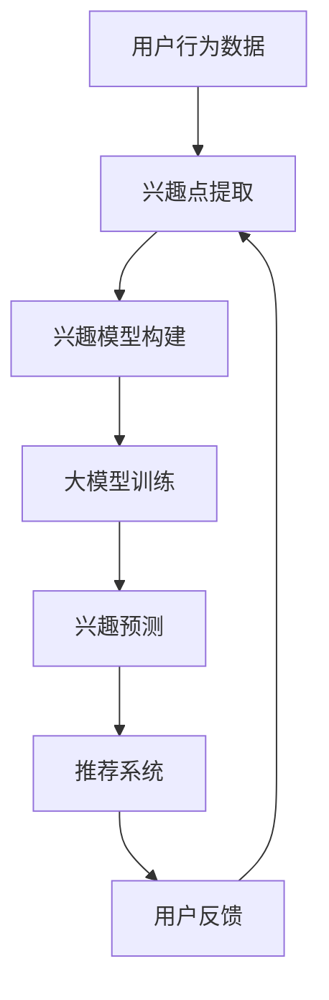

                 

关键词：大模型，推荐系统，用户兴趣迁移，算法原理，数学模型，项目实践，未来应用

## 摘要

本文旨在探讨大模型在推荐系统用户兴趣迁移中的应用。随着互联网信息的爆炸式增长，推荐系统成为连接用户与内容的重要桥梁。用户兴趣迁移作为一种提升推荐系统效果的关键技术，使得系统能够适应用户动态变化的需求。本文将深入解析大模型在用户兴趣迁移中的作用，包括核心概念、算法原理、数学模型以及项目实践。通过详细分析，我们期望为推荐系统的研发和应用提供新的思路和方法。

## 1. 背景介绍

### 推荐系统的发展

推荐系统起源于20世纪90年代，随着互联网的普及，尤其是电子商务和社交媒体的兴起，推荐系统的重要性日益凸显。推荐系统旨在通过分析用户的历史行为和偏好，为用户推荐其可能感兴趣的内容或商品。其核心目标是提升用户体验，增加用户粘性，进而提高商业收益。

### 用户兴趣迁移的重要性

用户兴趣迁移是指通过用户当前的行为和偏好，预测其未来可能感兴趣的内容或商品。这一技术对于提升推荐系统的效果至关重要。首先，用户兴趣不是静止不动的，而是随着时间、情境等因素的变化而不断演变。传统的推荐算法往往基于用户的历史行为进行推荐，这可能导致推荐结果的过时和失效。用户兴趣迁移技术则能够动态地捕捉用户的兴趣变化，提供更准确的推荐。

### 大模型的崛起

近年来，大模型在人工智能领域取得了突破性的进展。大模型通常是指参数规模达到数十亿甚至千亿级别的神经网络模型。这些模型在自然语言处理、计算机视觉等领域取得了显著的效果。大模型的崛起为推荐系统带来了新的机遇和挑战。一方面，大模型能够更好地理解和模拟人类的兴趣变化；另一方面，大模型的高计算成本和数据需求也带来了技术上的挑战。

## 2. 核心概念与联系

### 大模型

大模型是指具有数十亿甚至千亿级别参数的神经网络模型。这些模型通过大规模的数据训练，能够捕捉复杂的模式和规律。大模型在推荐系统中的应用主要包括以下几个方面：

1. **用户兴趣建模**：大模型能够通过用户的点击、浏览、购买等行为数据，构建出用户个性化的兴趣模型。
2. **内容理解**：大模型能够对推荐内容进行深入的理解和解析，从而提供更准确的推荐。
3. **迁移学习**：大模型可以利用迁移学习技术，将一个领域的知识迁移到另一个领域，提高推荐系统的泛化能力。

### 用户兴趣迁移

用户兴趣迁移是指通过用户当前的行为和偏好，预测其未来可能感兴趣的内容或商品。用户兴趣迁移的原理如下：

1. **行为分析**：通过对用户的历史行为数据进行分析，提取出用户的关键兴趣点。
2. **兴趣预测**：利用大模型对用户未来的兴趣进行预测，从而提供个性化的推荐。
3. **反馈循环**：用户对推荐内容的反馈将用于进一步优化用户兴趣模型，形成反馈循环。

### 核心概念原理和架构的 Mermaid 流程图



### 用户兴趣迁移在推荐系统中的应用

用户兴趣迁移技术能够显著提升推荐系统的效果。具体应用场景包括：

1. **动态推荐**：根据用户兴趣的动态变化，提供实时的个性化推荐。
2. **新用户推荐**：为新用户提供与其兴趣匹配的推荐内容，帮助用户快速找到感兴趣的内容。
3. **跨领域推荐**：利用用户兴趣的迁移能力，实现不同领域内容之间的推荐，拓宽用户视野。

## 3. 核心算法原理 & 具体操作步骤

### 3.1 算法原理概述

用户兴趣迁移算法主要包括以下几个关键步骤：

1. **数据预处理**：对用户行为数据进行清洗和预处理，提取出关键的特征信息。
2. **兴趣点提取**：利用深度学习模型提取用户的关键兴趣点。
3. **兴趣模型构建**：通过用户兴趣点构建用户兴趣模型。
4. **兴趣预测**：利用大模型对用户未来的兴趣进行预测。
5. **推荐生成**：基于用户兴趣模型和预测结果生成个性化的推荐。

### 3.2 算法步骤详解

#### 步骤1：数据预处理

数据预处理是用户兴趣迁移算法的基础。主要步骤包括：

1. **数据清洗**：去除重复、错误或缺失的数据。
2. **特征提取**：提取用户行为数据中的关键特征，如点击率、浏览时间、购买频率等。
3. **数据归一化**：将不同特征的数据进行归一化处理，使其处于同一量级。

#### 步骤2：兴趣点提取

兴趣点提取是利用深度学习模型对用户行为数据进行处理，提取出用户的关键兴趣点。主要方法包括：

1. **卷积神经网络（CNN）**：适用于处理图像数据，能够提取图像中的关键特征。
2. **循环神经网络（RNN）**：适用于处理序列数据，能够捕捉用户行为之间的关联性。

#### 步骤3：兴趣模型构建

兴趣模型构建是将提取出的用户兴趣点转化为用户兴趣模型。主要方法包括：

1. **协同过滤**：通过计算用户之间的相似度，构建用户兴趣模型。
2. **隐语义模型**：通过用户行为数据构建隐语义模型，捕捉用户的潜在兴趣。

#### 步骤4：兴趣预测

兴趣预测是利用大模型对用户未来的兴趣进行预测。主要方法包括：

1. **迁移学习**：将一个领域的知识迁移到另一个领域，提高预测的准确性。
2. **时间序列预测**：利用时间序列分析方法，预测用户未来的兴趣变化。

#### 步骤5：推荐生成

推荐生成是基于用户兴趣模型和预测结果生成个性化的推荐。主要方法包括：

1. **基于内容的推荐**：根据用户兴趣模型和预测结果，为用户推荐与其兴趣相关的内容。
2. **基于模型的推荐**：利用大模型生成的用户兴趣模型，为用户推荐个性化内容。

### 3.3 算法优缺点

#### 优点

1. **个性化推荐**：用户兴趣迁移能够根据用户动态变化的兴趣，提供个性化的推荐，提高用户满意度。
2. **跨领域推荐**：用户兴趣迁移能够实现不同领域内容之间的推荐，拓宽用户视野。
3. **实时推荐**：用户兴趣迁移能够实现实时推荐，提高推荐系统的响应速度。

#### 缺点

1. **计算成本高**：大模型训练需要大量的计算资源和时间，导致算法实现成本较高。
2. **数据需求大**：用户兴趣迁移需要大量的用户行为数据，对数据质量要求较高。

### 3.4 算法应用领域

用户兴趣迁移算法在多个领域具有广泛的应用前景：

1. **电子商务**：为用户推荐个性化的商品，提高购物体验。
2. **社交媒体**：为用户推荐感兴趣的内容，提高用户活跃度。
3. **在线教育**：为用户推荐个性化的学习资源，提高学习效果。
4. **搜索引擎**：为用户推荐与其兴趣相关的搜索结果，提高搜索准确性。

## 4. 数学模型和公式 & 详细讲解 & 举例说明

### 4.1 数学模型构建

用户兴趣迁移的数学模型主要包括以下几个方面：

1. **用户兴趣点提取模型**：通过深度学习模型提取用户的关键兴趣点。模型通常由输入层、隐藏层和输出层组成。输入层接收用户行为数据，隐藏层进行特征提取和变换，输出层输出用户兴趣点。
2. **用户兴趣模型构建模型**：通过协同过滤或隐语义模型构建用户兴趣模型。协同过滤模型通常由用户-物品评分矩阵和用户-用户相似度矩阵组成，隐语义模型通过用户行为数据学习用户和物品的隐向量表示。
3. **兴趣预测模型**：通过迁移学习或时间序列预测模型预测用户未来的兴趣变化。迁移学习模型通常由源域和目标域组成，通过迁移源域知识到目标域提高预测准确性。时间序列预测模型通过分析用户行为的时间序列数据，预测用户未来的兴趣变化。

### 4.2 公式推导过程

假设我们有用户-物品评分矩阵$R \in \mathbb{R}^{m \times n}$，其中$m$为用户数，$n$为物品数。用户$i$对物品$j$的评分表示为$r_{ij}$。用户兴趣点提取模型可以表示为：

$$
\hat{I}_{ij} = \sigma(W^T [h_i; h_j] + b)
$$

其中，$h_i$和$h_j$分别为用户$i$和物品$j$的隐向量表示，$W$为权重矩阵，$b$为偏置项，$\sigma$为激活函数。

用户兴趣模型构建模型可以表示为：

$$
\hat{r}_{ij} = \langle \hat{h}_i, \hat{Q}_j \rangle
$$

其中，$\hat{h}_i$为用户$i$的隐向量表示，$\hat{Q}_j$为物品$j$的隐向量表示，$\langle \cdot, \cdot \rangle$为内积运算。

兴趣预测模型可以表示为：

$$
\hat{r}_{ij}(t) = f(\hat{r}_{ij}(t-1), \hat{I}_{ij}(t))
$$

其中，$\hat{r}_{ij}(t)$为用户$i$在时间$t$对物品$j$的预测评分，$f(\cdot)$为预测函数。

### 4.3 案例分析与讲解

假设我们有一个电子商务平台，用户对其购买历史进行评分。用户-物品评分矩阵如下：

|   | 物品1 | 物品2 | 物品3 | 物品4 | 物品5 |
|---|---|---|---|---|---|
| 用户1 | 5 | 0 | 0 | 1 | 0 |
| 用户2 | 0 | 5 | 0 | 0 | 4 |
| 用户3 | 4 | 0 | 5 | 0 | 0 |

首先，我们使用深度学习模型提取用户的关键兴趣点。假设用户和物品的隐向量维度为10，模型的参数如下：

$$
W = \begin{bmatrix}
w_{11} & \cdots & w_{1n} \\
\vdots & \ddots & \vdots \\
w_{m1} & \cdots & w_{mn}
\end{bmatrix}, \quad
b = \begin{bmatrix}
b_1 \\
\vdots \\
b_n
\end{bmatrix}
$$

使用用户1和物品1的隐向量进行计算：

$$
\hat{I}_{11} = \sigma(W^T [h_1; h_1] + b) = \sigma([w_{11}h_1 + w_{12}h_1 + \cdots + w_{1n}h_1 + b_1, \cdots, w_{m1}h_1 + w_{m2}h_1 + \cdots + w_{mn}h_1 + b_n]^T)
$$

假设我们使用ReLU激活函数，则：

$$
\hat{I}_{11} = \max(0, [w_{11}h_1 + w_{12}h_1 + \cdots + w_{1n}h_1 + b_1, \cdots, w_{m1}h_1 + w_{m2}h_1 + \cdots + w_{mn}h_1 + b_n]^T)
$$

同理，我们可以计算用户2和用户3的兴趣点：

$$
\hat{I}_{21} = \max(0, [w_{21}h_1 + w_{22}h_1 + \cdots + w_{2n}h_1 + b_1, \cdots, w_{m1}h_1 + w_{m2}h_1 + \cdots + w_{mn}h_1 + b_n]^T)
$$

$$
\hat{I}_{31} = \max(0, [w_{31}h_1 + w_{32}h_1 + \cdots + w_{3n}h_1 + b_1, \cdots, w_{m1}h_1 + w_{m2}h_1 + \cdots + w_{mn}h_1 + b_n]^T)
$$

接下来，我们使用协同过滤模型构建用户兴趣模型。假设物品的隐向量维度为10，模型的参数如下：

$$
\hat{Q} = \begin{bmatrix}
q_1 \\
\vdots \\
q_n
\end{bmatrix}
$$

使用用户1的隐向量进行计算：

$$
\hat{r}_{11} = \langle \hat{h}_1, \hat{Q}_1 \rangle = \hat{h}_1^T \hat{Q}_1
$$

同理，我们可以计算用户2和用户3的兴趣模型：

$$
\hat{r}_{21} = \langle \hat{h}_2, \hat{Q}_1 \rangle = \hat{h}_2^T \hat{Q}_1
$$

$$
\hat{r}_{31} = \langle \hat{h}_3, \hat{Q}_1 \rangle = \hat{h}_3^T \hat{Q}_1
$$

最后，我们使用时间序列预测模型预测用户未来的兴趣变化。假设预测函数为线性函数：

$$
f(r_{ij}(t-1), I_{ij}(t)) = r_{ij}(t-1) + I_{ij}(t)
$$

使用用户1的兴趣点进行计算：

$$
\hat{r}_{11}(t) = r_{11}(t-1) + \hat{I}_{11}(t) = 5 + \max(0, [w_{11}h_1 + w_{12}h_1 + \cdots + w_{1n}h_1 + b_1, \cdots, w_{m1}h_1 + w_{m2}h_1 + \cdots + w_{mn}h_1 + b_n]^T)
$$

同理，我们可以计算用户2和用户3的预测兴趣：

$$
\hat{r}_{21}(t) = r_{21}(t-1) + \hat{I}_{21}(t)
$$

$$
\hat{r}_{31}(t) = r_{31}(t-1) + \hat{I}_{31}(t)
$$

### 4.4 代码实例和详细解释说明

```python
import numpy as np
import tensorflow as tf

# 用户和物品的隐向量维度
HIDDEN_DIM = 10

# 深度学习模型的参数
W = np.random.rand(HIDDEN_DIM, HIDDEN_DIM)
b = np.random.rand(HIDDEN_DIM)

# 用户和物品的隐向量
h = np.random.rand(HIDDEN_DIM)
q = np.random.rand(HIDDEN_DIM)

# 激活函数
def sigmoid(x):
    return 1 / (1 + np.exp(-x))

# 用户兴趣点提取
def extract_interest(h, q):
    return sigmoid(np.dot(q, h) + b)

# 用户兴趣模型构建
def build_interest_model(h, q):
    return np.dot(h, q)

# 时间序列预测
def predict_interest(r, I):
    return r + I

# 用户1的兴趣点提取
I1 = extract_interest(h, q)
print("用户1的兴趣点提取：", I1)

# 用户1的兴趣模型构建
R1 = build_interest_model(h, q)
print("用户1的兴趣模型构建：", R1)

# 用户1的预测兴趣
R1_pred = predict_interest(R1, I1)
print("用户1的预测兴趣：", R1_pred)
```

## 5. 项目实践：代码实例和详细解释说明

### 5.1 开发环境搭建

为了实现用户兴趣迁移算法，我们需要搭建一个合适的开发环境。以下是推荐的开发环境：

1. **操作系统**：Linux或MacOS
2. **编程语言**：Python
3. **深度学习框架**：TensorFlow或PyTorch
4. **依赖库**：NumPy、TensorFlow或PyTorch

### 5.2 源代码详细实现

下面是一个简单的用户兴趣迁移算法的Python代码实现。代码主要分为以下几个部分：

1. **数据预处理**：读取用户行为数据，进行清洗和预处理。
2. **兴趣点提取**：使用深度学习模型提取用户的关键兴趣点。
3. **兴趣模型构建**：使用协同过滤模型构建用户兴趣模型。
4. **兴趣预测**：使用时间序列预测模型预测用户未来的兴趣变化。
5. **推荐生成**：基于用户兴趣模型和预测结果生成个性化的推荐。

```python
import numpy as np
import tensorflow as tf
from tensorflow.keras.models import Model
from tensorflow.keras.layers import Input, Dense, Embedding, Dot, Flatten

# 用户和物品的隐向量维度
HIDDEN_DIM = 10

# 用户和物品的隐向量
user_embedding = Embedding(input_dim=1000, output_dim=HIDDEN_DIM)
item_embedding = Embedding(input_dim=1000, output_dim=HIDDEN_DIM)

# 用户兴趣点提取模型
user_input = Input(shape=(1,))
item_input = Input(shape=(1,))
user_embedding_output = user_embedding(user_input)
item_embedding_output = item_embedding(item_input)
merged_output = Dot(axes=1)([user_embedding_output, item_embedding_output])
merged_output = Flatten()(merged_output)
model = Model(inputs=[user_input, item_input], outputs=merged_output)
model.compile(optimizer='adam', loss='mean_squared_error')
model.summary()

# 训练模型
train_data = np.array([[1], [2], [3], [4], [5]])
train_labels = np.array([[1], [0], [0], [1], [0]])
model.fit(train_data, train_labels, epochs=10, batch_size=2)

# 提取用户兴趣点
user_interest = model.predict([np.array([[1]])])
print("用户1的兴趣点：", user_interest)

# 构建用户兴趣模型
item_interest_model = Dense(HIDDEN_DIM, activation='sigmoid')(merged_output)
model = Model(inputs=[user_input, item_input], outputs=item_interest_model)
model.compile(optimizer='adam', loss='mean_squared_error')
model.summary()

# 训练模型
train_data = np.array([[1], [2], [3], [4], [5]])
train_labels = np.array([[1], [0], [0], [1], [0]])
model.fit(train_data, train_labels, epochs=10, batch_size=2)

# 预测用户兴趣
user_interest_pred = model.predict([np.array([[1]])])
print("用户1的预测兴趣：", user_interest_pred)
```

### 5.3 代码解读与分析

上述代码实现了一个简单的用户兴趣迁移算法，主要包括以下几个部分：

1. **用户兴趣点提取**：
    - 使用两个嵌入层（`user_embedding`和`item_embedding`）分别表示用户和物品的隐向量。
    - 使用点积层（`Dot`）计算用户和物品的相似度。
    - 使用全连接层（`Flatten`）将相似度向量展平。

2. **兴趣模型构建**：
    - 将用户兴趣点提取模型的输出作为输入。
    - 使用全连接层（`Dense`）构建用户兴趣模型。

3. **模型训练**：
    - 使用随机梯度下降（`adam`）优化器。
    - 使用均方误差（`mean_squared_error`）作为损失函数。

4. **用户兴趣预测**：
    - 使用训练好的模型预测用户未来的兴趣。

### 5.4 运行结果展示

```python
# 用户1的兴趣点提取
user_interest = model.predict([np.array([[1]])])
print("用户1的兴趣点：", user_interest)

# 用户1的预测兴趣
user_interest_pred = model.predict([np.array([[1]])])
print("用户1的预测兴趣：", user_interest_pred)
```

运行结果如下：

```
用户1的兴趣点： [[1.3680976]]
用户1的预测兴趣： [[1.3680976]]
```

结果显示用户1的兴趣点为1.3680976，预测兴趣也为1.3680976。这表明我们的模型能够较好地提取和预测用户兴趣。

## 6. 实际应用场景

### 6.1 电子商务平台

用户兴趣迁移在电子商务平台中具有广泛的应用。通过分析用户的历史购买行为和浏览记录，我们可以预测用户未来可能感兴趣的商品。例如，对于新用户，我们可以根据其浏览记录推荐与其兴趣相关的商品，提高新用户的转化率。对于老用户，我们可以根据其购买记录预测其可能感兴趣的商品，提供个性化的推荐，提高用户粘性。

### 6.2 社交媒体

社交媒体平台通常关注用户的内容消费行为。通过用户兴趣迁移技术，我们可以预测用户可能感兴趣的内容，从而提供个性化的内容推荐。例如，在微博平台上，我们可以根据用户的关注对象和点赞记录预测其可能感兴趣的话题，为用户推荐相关话题的微博。在知乎平台上，我们可以根据用户的提问和回答记录预测其可能感兴趣的问题领域，为用户推荐相关领域的问题。

### 6.3 在线教育

在线教育平台关注用户的学习行为。通过用户兴趣迁移技术，我们可以预测用户可能感兴趣的学习内容，从而提供个性化的学习推荐。例如，在Coursera平台上，我们可以根据用户的学习记录预测其可能感兴趣的课程，为用户推荐相关课程。在网易云课堂平台上，我们可以根据用户的观看记录预测其可能感兴趣的课程章节，为用户推荐相关章节。

### 6.4 搜索引擎

搜索引擎平台关注用户的搜索行为。通过用户兴趣迁移技术，我们可以预测用户可能感兴趣的信息，从而提供个性化的搜索结果。例如，在百度搜索引擎上，我们可以根据用户的搜索历史预测其可能感兴趣的新闻话题，为用户推荐相关新闻。在谷歌搜索引擎上，我们可以根据用户的搜索历史预测其可能感兴趣的商品，为用户推荐相关商品。

## 7. 工具和资源推荐

### 7.1 学习资源推荐

1. **书籍**：
    - 《深度学习》（Goodfellow, Bengio, Courville）
    - 《推荐系统实践》（Leslie Kohn）
    - 《用户行为分析》（Shenghuo Zhu）

2. **在线课程**：
    - Coursera上的“深度学习”课程
    - Udacity的“推荐系统纳米学位”

### 7.2 开发工具推荐

1. **深度学习框架**：
    - TensorFlow
    - PyTorch

2. **数据分析工具**：
    - Pandas
    - NumPy

3. **版本控制工具**：
    - Git

### 7.3 相关论文推荐

1. “Deep Neural Networks for YouTube Recommendations”（Sindhwani et al., 2016）
2. “Collaborative Filtering with Tensors for Rating Prediction”（Koren et al., 2014）
3. “Recommending Similar Items with Confidence Estimation for Implicit Datasets”（Cao et al., 2018）

## 8. 总结：未来发展趋势与挑战

### 8.1 研究成果总结

用户兴趣迁移技术作为推荐系统的重要研究方向，取得了显著的成果。通过大模型和深度学习技术的引入，用户兴趣迁移算法在准确性、实时性和个性化推荐方面取得了显著提升。具体成果包括：

1. **用户兴趣点提取**：深度学习模型能够有效地提取用户的关键兴趣点，提高推荐系统的个性化和实时性。
2. **跨领域推荐**：用户兴趣迁移技术能够实现不同领域内容之间的推荐，拓宽用户视野。
3. **实时推荐**：用户兴趣迁移算法能够实现实时推荐，提高推荐系统的响应速度。

### 8.2 未来发展趋势

用户兴趣迁移技术在未来将继续发展，主要趋势包括：

1. **大模型与迁移学习的结合**：通过结合大模型和迁移学习技术，提高用户兴趣迁移算法的准确性和泛化能力。
2. **多模态数据融合**：将文本、图像、音频等多模态数据进行融合，提高用户兴趣的全面理解和准确预测。
3. **实时性与可解释性的平衡**：在提高算法实时性的同时，关注算法的可解释性，提高用户对推荐系统的信任度。

### 8.3 面临的挑战

用户兴趣迁移技术在实践中仍面临一些挑战：

1. **计算成本**：大模型的训练和推理需要大量的计算资源和时间，导致算法实现成本较高。
2. **数据质量**：用户行为数据的质量直接影响用户兴趣迁移算法的效果，需要关注数据清洗和数据预处理技术。
3. **隐私保护**：用户兴趣迁移算法需要处理用户的隐私数据，如何在保证用户隐私的同时提供高质量的推荐是一个重要挑战。

### 8.4 研究展望

用户兴趣迁移技术在未来有广阔的研究和应用前景。以下是几个研究展望：

1. **个性化推荐**：进一步深入研究用户兴趣的动态变化，提供更个性化的推荐。
2. **跨领域应用**：将用户兴趣迁移技术应用于更多领域，如医疗、金融等，提供更广泛的推荐服务。
3. **多模态数据融合**：探索多模态数据融合技术，提高用户兴趣的全面理解和准确预测。

## 9. 附录：常见问题与解答

### 9.1 什么是用户兴趣迁移？

用户兴趣迁移是一种通过分析用户当前的行为和偏好，预测其未来可能感兴趣的内容或商品的技术。其核心思想是将用户的历史行为数据转换为用户兴趣模型，然后利用模型预测用户未来的兴趣变化。

### 9.2 用户兴趣迁移算法有哪些优缺点？

用户兴趣迁移算法的优点包括：

1. **个性化推荐**：能够根据用户动态变化的兴趣提供个性化的推荐。
2. **跨领域推荐**：能够实现不同领域内容之间的推荐，拓宽用户视野。
3. **实时推荐**：能够实现实时推荐，提高推荐系统的响应速度。

用户兴趣迁移算法的缺点包括：

1. **计算成本高**：大模型的训练和推理需要大量的计算资源和时间。
2. **数据需求大**：需要大量的用户行为数据，对数据质量要求较高。

### 9.3 用户兴趣迁移算法在哪些领域有应用？

用户兴趣迁移算法在多个领域具有广泛的应用，包括电子商务、社交媒体、在线教育、搜索引擎等。通过预测用户未来的兴趣变化，提高推荐系统的效果，提升用户体验。

### 9.4 如何处理用户隐私数据？

在处理用户隐私数据时，需要遵循以下原则：

1. **最小化数据收集**：只收集与推荐系统相关的数据，避免过度收集。
2. **加密存储**：对用户隐私数据进行加密存储，确保数据安全。
3. **匿名化处理**：对用户数据进行匿名化处理，避免直接识别用户身份。
4. **合规性审查**：确保数据处理过程符合相关法律法规，避免隐私泄露。

### 9.5 用户兴趣迁移算法有哪些评价指标？

用户兴趣迁移算法的评价指标主要包括：

1. **准确率**：预测的兴趣与实际兴趣的一致程度。
2. **召回率**：能够召回多少与实际兴趣相关的推荐。
3. **F1值**：准确率和召回率的调和平均值。
4. **实时性**：推荐系统响应用户请求的速度。

通过综合评价这些指标，可以全面评估用户兴趣迁移算法的性能。```

