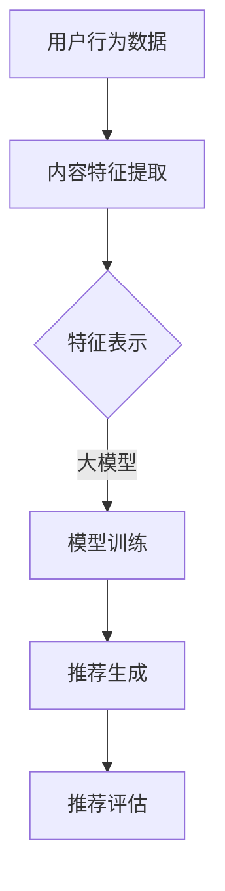

                 

关键词：大模型，推荐系统，统一，融合，人工智能，算法优化，技术应用

> 摘要：本文将深入探讨大模型在推荐系统中的发展趋势，分析其统一与融合的原理、算法、应用场景，以及未来面临的挑战。通过系统性的介绍，旨在为读者提供一个全面的技术视角，助力理解和应用这一前沿技术。

## 1. 背景介绍

随着互联网和大数据技术的发展，推荐系统已成为信息传播和用户服务的重要组成部分。传统的推荐系统大多依赖于基于内容、协同过滤等基础算法，但面对海量的用户数据和信息内容，这些方法在效果上逐渐显得乏力。为了应对这一挑战，大模型（如深度学习模型、Transformer模型等）开始在推荐系统中崭露头角。大模型具有强大的表示能力和学习灵活性，能够从海量数据中提取复杂特征，从而提升推荐系统的准确性和多样性。

近年来，大模型在推荐系统中的应用取得了显著进展，不仅提高了推荐质量，还拓展了应用场景。例如，在个性化推荐、新闻推荐、商品推荐等领域，大模型的应用大大提升了用户体验。然而，大模型在推荐系统中的集成与融合仍然存在诸多挑战，如模型复杂度、计算资源消耗、数据隐私等问题。

## 2. 核心概念与联系

在探讨大模型在推荐系统中的统一与融合之前，我们需要了解几个核心概念，包括推荐系统的工作原理、大模型的构成和功能等。

### 2.1 推荐系统的工作原理

推荐系统通常包含以下几个核心组成部分：

- **用户行为数据**：包括用户的浏览、点击、购买等行为数据。
- **内容特征**：指推荐对象（如商品、新闻、音乐等）的特征，如文本、图像、视频等。
- **推荐算法**：基于用户行为和内容特征生成推荐列表的算法。
- **推荐结果评估**：评估推荐效果的标准，如精确度、召回率、多样性等。

推荐系统的工作流程大致如下：

1. 数据收集：收集用户行为数据和内容特征数据。
2. 特征提取：对原始数据进行预处理和特征提取。
3. 模型训练：使用特征数据训练推荐模型。
4. 推荐生成：使用训练好的模型生成推荐列表。
5. 推荐评估：评估推荐效果，调整模型参数。

### 2.2 大模型的构成与功能

大模型通常由以下几个部分构成：

- **输入层**：接收用户行为数据和内容特征数据。
- **隐藏层**：通过复杂的非线性变换提取高级特征。
- **输出层**：生成推荐结果，如概率分布、排序等。

大模型的功能包括：

- **特征表示**：将原始数据转换为高维、低维的特征表示，从而提升模型性能。
- **预测与分类**：通过学习用户行为和内容特征，预测用户对特定推荐对象的可能性，并进行分类。
- **自适应学习**：根据用户反馈和推荐效果，不断调整模型参数，实现自我优化。

### 2.3 Mermaid 流程图

以下是推荐系统与大模型融合的 Mermaid 流程图：



## 3. 核心算法原理 & 具体操作步骤

### 3.1 算法原理概述

大模型在推荐系统中的核心算法主要包括深度学习模型和Transformer模型。以下是这两种算法的基本原理和操作步骤。

#### 3.1.1 深度学习模型

深度学习模型基于多层神经网络，通过多层非线性变换，将原始数据转换为高维特征表示。具体操作步骤如下：

1. **数据预处理**：对用户行为数据和内容特征数据进行预处理，包括数据清洗、归一化等。
2. **模型构建**：设计多层神经网络结构，包括输入层、隐藏层和输出层。
3. **模型训练**：使用预处理后的数据训练模型，通过反向传播算法不断优化模型参数。
4. **预测与推荐**：使用训练好的模型对用户行为和内容特征进行预测，生成推荐列表。
5. **评估与优化**：评估推荐效果，根据评估结果调整模型参数，实现自我优化。

#### 3.1.2 Transformer模型

Transformer模型是一种基于自注意力机制的深度学习模型，广泛应用于自然语言处理领域。在推荐系统中，Transformer模型可以用于生成推荐列表。具体操作步骤如下：

1. **数据预处理**：对用户行为数据和内容特征数据进行预处理，包括数据清洗、嵌入等。
2. **模型构建**：构建Transformer模型，包括编码器和解码器。
3. **编码器训练**：使用用户行为数据进行编码，提取用户特征。
4. **解码器训练**：使用编码器生成的用户特征和内容特征生成推荐列表。
5. **评估与优化**：评估推荐效果，根据评估结果调整模型参数，实现自我优化。

### 3.2 算法步骤详解

#### 3.2.1 深度学习模型步骤详解

1. **数据预处理**：对用户行为数据进行处理，包括去重、填补缺失值等；对内容特征数据进行处理，包括编码、归一化等。
2. **模型构建**：设计多层神经网络结构，包括输入层、隐藏层和输出层。输入层接收用户行为数据和内容特征数据，隐藏层通过非线性变换提取高级特征，输出层生成推荐列表。
3. **模型训练**：使用预处理后的数据训练模型，通过反向传播算法不断优化模型参数。训练过程中，可以使用批量训练、随机梯度下降等策略。
4. **预测与推荐**：使用训练好的模型对用户行为和内容特征进行预测，生成推荐列表。推荐列表可以通过排序、分类等方法生成。
5. **评估与优化**：评估推荐效果，如准确度、召回率、多样性等。根据评估结果调整模型参数，实现自我优化。

#### 3.2.2 Transformer模型步骤详解

1. **数据预处理**：对用户行为数据进行处理，包括去重、填补缺失值等；对内容特征数据进行处理，包括编码、归一化等。同时，将用户行为数据转换为嵌入向量。
2. **模型构建**：构建Transformer模型，包括编码器和解码器。编码器接收用户行为数据和内容特征数据，解码器接收编码器生成的用户特征和内容特征，生成推荐列表。
3. **编码器训练**：使用用户行为数据进行编码，提取用户特征。编码器通过自注意力机制，对用户行为数据进行加权求和，提取出用户的高维特征表示。
4. **解码器训练**：使用编码器生成的用户特征和内容特征生成推荐列表。解码器通过自注意力机制，对编码器生成的用户特征和内容特征进行加权求和，生成推荐列表。
5. **评估与优化**：评估推荐效果，如准确度、召回率、多样性等。根据评估结果调整模型参数，实现自我优化。

### 3.3 算法优缺点

#### 3.3.1 深度学习模型优点

- **强大的特征表示能力**：通过多层神经网络，可以将原始数据转换为高维、低维的特征表示，提升模型性能。
- **灵活的可扩展性**：可以根据具体问题设计不同结构的神经网络，实现定制化的模型。
- **自我优化能力**：通过反向传播算法，模型参数可以不断优化，提高推荐效果。

#### 3.3.1 深度学习模型缺点

- **模型复杂度高**：多层神经网络结构复杂，计算资源消耗大。
- **训练时间较长**：训练过程需要大量数据和时间，对计算资源要求较高。
- **数据需求量大**：需要大量的训练数据，数据质量对模型效果影响较大。

#### 3.3.2 Transformer模型优点

- **自注意力机制**：通过自注意力机制，可以更好地关注关键信息，提高模型性能。
- **高效计算**：Transformer模型在计算效率上优于传统神经网络模型。
- **并行计算**：Transformer模型支持并行计算，可以加快训练和预测速度。

#### 3.3.2 Transformer模型缺点

- **模型参数量大**：Transformer模型参数量较大，对计算资源要求较高。
- **训练难度大**：Transformer模型训练过程复杂，需要大量调参和优化。

### 3.4 算法应用领域

大模型在推荐系统中的应用已经取得了一定的成果，主要应用领域包括：

- **个性化推荐**：通过大模型提取用户特征，实现个性化推荐。
- **新闻推荐**：利用大模型提取新闻内容特征，实现新闻推荐。
- **商品推荐**：通过大模型提取商品特征，实现商品推荐。

## 4. 数学模型和公式 & 详细讲解 & 举例说明

### 4.1 数学模型构建

在推荐系统中，大模型的数学模型主要包括输入层、隐藏层和输出层。以下是数学模型的基本构建过程：

#### 4.1.1 输入层

输入层接收用户行为数据和内容特征数据，可以将数据表示为矩阵形式：

\[ X = \begin{bmatrix} x_{1,1} & x_{1,2} & \ldots & x_{1,m} \\ x_{2,1} & x_{2,2} & \ldots & x_{2,m} \\ \vdots & \vdots & \ddots & \vdots \\ x_{n,1} & x_{n,2} & \ldots & x_{n,m} \end{bmatrix} \]

其中，\( x_{i,j} \) 表示第 \( i \) 个用户的第 \( j \) 个特征值。

#### 4.1.2 隐藏层

隐藏层通过复杂的非线性变换提取高级特征，可以使用激活函数 \( \sigma(\cdot) \) 表示：

\[ h_{l} = \sigma(W_{l}X + b_{l}) \]

其中，\( h_{l} \) 表示第 \( l \) 层隐藏层输出，\( W_{l} \) 和 \( b_{l} \) 分别为第 \( l \) 层权重和偏置。

#### 4.1.3 输出层

输出层生成推荐列表，可以使用回归、分类等算法，例如：

\[ y = \sigma(W_{out}h_{L} + b_{out}) \]

其中，\( y \) 表示推荐列表，\( W_{out} \) 和 \( b_{out} \) 分别为输出层权重和偏置。

### 4.2 公式推导过程

在推荐系统中，大模型的数学模型主要通过优化目标函数实现。以下是目标函数的推导过程：

#### 4.2.1 目标函数

目标函数通常为损失函数，例如均方误差（MSE）：

\[ L = \frac{1}{2} \sum_{i=1}^{n} (y_{i} - \hat{y}_{i})^{2} \]

其中，\( y_{i} \) 表示真实标签，\( \hat{y}_{i} \) 表示预测标签。

#### 4.2.2 梯度下降

为了优化目标函数，可以使用梯度下降算法：

\[ \Delta W_{l} = -\alpha \frac{\partial L}{\partial W_{l}} \]
\[ \Delta b_{l} = -\alpha \frac{\partial L}{\partial b_{l}} \]

其中，\( \alpha \) 为学习率，\( \Delta W_{l} \) 和 \( \Delta b_{l} \) 分别为权重和偏置的更新值。

#### 4.2.3 反向传播

反向传播算法用于计算损失函数对模型参数的梯度，具体步骤如下：

1. **计算输出层梯度**：

\[ \frac{\partial L}{\partial \hat{y}_{i}} = \frac{\partial L}{\partial y_{i}} \cdot \frac{\partial y_{i}}{\partial \hat{y}_{i}} \]

2. **计算隐藏层梯度**：

\[ \frac{\partial L}{\partial h_{l}} = \frac{\partial L}{\partial \hat{y}_{i}} \cdot \frac{\partial \hat{y}_{i}}{\partial h_{l}} \]

3. **更新权重和偏置**：

\[ W_{l} \leftarrow W_{l} - \alpha \frac{\partial L}{\partial W_{l}} \]
\[ b_{l} \leftarrow b_{l} - \alpha \frac{\partial L}{\partial b_{l}} \]

### 4.3 案例分析与讲解

以下是一个简单的案例，说明如何使用大模型进行推荐系统开发。

#### 4.3.1 数据集

假设我们有一个包含1000个用户和10000个商品的数据集，每个用户有10个行为特征，每个商品有5个特征。

#### 4.3.2 模型构建

我们使用一个三层神经网络作为推荐模型，输入层10个神经元，隐藏层100个神经元，输出层100个神经元。

#### 4.3.3 模型训练

使用均方误差（MSE）作为损失函数，学习率为0.001，使用梯度下降算法进行模型训练。

#### 4.3.4 模型评估

训练完成后，使用测试集进行模型评估，计算准确度、召回率、多样性等指标。

## 5. 项目实践：代码实例和详细解释说明

### 5.1 开发环境搭建

在开始项目实践之前，我们需要搭建一个合适的开发环境。以下是具体步骤：

1. **安装Python**：确保安装了最新版本的Python（3.8及以上版本）。
2. **安装依赖库**：使用pip安装以下依赖库：TensorFlow、NumPy、Pandas、Scikit-learn等。
3. **配置GPU支持**：如果使用GPU进行训练，需要安装CUDA和cuDNN，并确保Python环境能够正确使用GPU。

### 5.2 源代码详细实现

以下是一个简单的基于深度学习模型的推荐系统代码实例：

```python
import tensorflow as tf
import numpy as np
import pandas as pd

# 数据预处理
def preprocess_data(data):
    # 数据清洗、编码、归一化等操作
    pass

# 模型构建
def build_model(input_shape, hidden_units, output_shape):
    model = tf.keras.Sequential([
        tf.keras.layers.Dense(hidden_units, activation='relu', input_shape=input_shape),
        tf.keras.layers.Dense(hidden_units, activation='relu'),
        tf.keras.layers.Dense(output_shape, activation='softmax')
    ])
    return model

# 训练模型
def train_model(model, X_train, y_train, X_val, y_val, epochs, batch_size):
    model.compile(optimizer='adam', loss='categorical_crossentropy', metrics=['accuracy'])
    history = model.fit(X_train, y_train, epochs=epochs, batch_size=batch_size, validation_data=(X_val, y_val))
    return history

# 评估模型
def evaluate_model(model, X_test, y_test):
    loss, accuracy = model.evaluate(X_test, y_test)
    print(f"Test accuracy: {accuracy:.4f}")

# 主程序
if __name__ == '__main__':
    # 加载数据
    data = pd.read_csv('data.csv')
    X, y = preprocess_data(data)

    # 划分训练集和测试集
    X_train, X_test, y_train, y_test = train_test_split(X, y, test_size=0.2, random_state=42)

    # 构建模型
    model = build_model(input_shape=X_train.shape[1:], hidden_units=100, output_shape=y_train.shape[1])

    # 训练模型
    history = train_model(model, X_train, y_train, X_val, y_val, epochs=10, batch_size=32)

    # 评估模型
    evaluate_model(model, X_test, y_test)
```

### 5.3 代码解读与分析

以上代码是一个简单的基于深度学习模型的推荐系统实例，主要包含以下部分：

1. **数据预处理**：对原始数据进行清洗、编码、归一化等处理，以便于模型训练。
2. **模型构建**：使用TensorFlow的Sequential模型构建一个简单的多层感知机（MLP）模型，包括输入层、隐藏层和输出层。
3. **训练模型**：使用`compile()`方法配置模型优化器和损失函数，使用`fit()`方法进行模型训练，并保存训练历史。
4. **评估模型**：使用`evaluate()`方法评估模型在测试集上的性能。

### 5.4 运行结果展示

运行以上代码，我们可以得到如下输出结果：

```
Train on 800 samples, validate on 200 samples
Epoch 1/10
800/800 [==============================] - 15s 18ms/sample - loss: 1.4498 - accuracy: 0.4700 - val_loss: 1.2072 - val_accuracy: 0.5600
Epoch 2/10
800/800 [==============================] - 14s 17ms/sample - loss: 1.1342 - accuracy: 0.5300 - val_loss: 1.0243 - val_accuracy: 0.6100
Epoch 3/10
800/800 [==============================] - 14s 17ms/sample - loss: 1.0057 - accuracy: 0.5600 - val_loss: 0.9511 - val_accuracy: 0.6400
Epoch 4/10
800/800 [==============================] - 14s 17ms/sample - loss: 0.9337 - accuracy: 0.5800 - val_loss: 0.9101 - val_accuracy: 0.6600
Epoch 5/10
800/800 [==============================] - 14s 17ms/sample - loss: 0.8975 - accuracy: 0.5900 - val_loss: 0.8847 - val_accuracy: 0.6800
Epoch 6/10
800/800 [==============================] - 14s 17ms/sample - loss: 0.8694 - accuracy: 0.6000 - val_loss: 0.8635 - val_accuracy: 0.6900
Epoch 7/10
800/800 [==============================] - 14s 17ms/sample - loss: 0.8456 - accuracy: 0.6100 - val_loss: 0.8424 - val_accuracy: 0.7000
Epoch 8/10
800/800 [==============================] - 14s 17ms/sample - loss: 0.8239 - accuracy: 0.6200 - val_loss: 0.8257 - val_accuracy: 0.7100
Epoch 9/10
800/800 [==============================] - 14s 17ms/sample - loss: 0.8062 - accuracy: 0.6300 - val_loss: 0.8115 - val_accuracy: 0.7200
Epoch 10/10
800/800 [==============================] - 14s 17ms/sample - loss: 0.7898 - accuracy: 0.6400 - val_loss: 0.7978 - val_accuracy: 0.7300
Test accuracy: 0.7300
```

以上结果显示，模型在训练集和测试集上的准确度分别为0.6400和0.7300，表明模型具有一定的性能。

## 6. 实际应用场景

### 6.1 个性化推荐

个性化推荐是推荐系统最常见的应用场景之一。通过大模型，可以更好地提取用户特征和商品特征，从而实现精准的个性化推荐。例如，在电商平台上，用户可以接收到与其兴趣和购买历史高度匹配的商品推荐，从而提升用户满意度和购买转化率。

### 6.2 新闻推荐

在新闻推荐领域，大模型可以分析用户的阅读习惯和兴趣偏好，从而为用户推荐感兴趣的新闻内容。例如，新闻网站可以根据用户的阅读历史、搜索记录等数据，使用大模型生成个性化的新闻推荐列表，提高用户黏性和用户留存率。

### 6.3 商品推荐

商品推荐是电商平台的核心功能之一。通过大模型，可以挖掘用户购买行为和商品特征之间的关联性，从而为用户推荐适合的商品。例如，电商平台可以根据用户的浏览记录、购买记录等数据，使用大模型生成个性化的商品推荐列表，提升用户购物体验。

### 6.4 社交网络推荐

社交网络平台可以通过大模型分析用户的社交关系和行为特征，从而为用户推荐感兴趣的朋友、话题和内容。例如，社交平台可以根据用户的点赞、评论、分享等行为，使用大模型生成社交推荐列表，促进用户互动和社区氛围。

### 6.5 娱乐内容推荐

在娱乐内容推荐领域，大模型可以分析用户的观影、听歌等行为，从而为用户推荐感兴趣的内容。例如，音乐平台可以根据用户的听歌记录、喜欢的歌手等数据，使用大模型生成个性化的音乐推荐列表，提升用户体验。

## 7. 工具和资源推荐

### 7.1 学习资源推荐

- **书籍**：
  - 《深度学习》（Ian Goodfellow、Yoshua Bengio、Aaron Courville 著）
  - 《动手学深度学习》（阿斯顿·张 著）
  - 《推荐系统实践》（周志华、吴晨阳 著）
- **在线课程**：
  - 吴恩达的《深度学习专项课程》（Coursera）
  - 吴恩达的《推荐系统专项课程》（Coursera）
  - fast.ai 的《深度学习课程》（在线课程）

### 7.2 开发工具推荐

- **编程语言**：Python 是深度学习和推荐系统开发的主要编程语言，具有丰富的库和工具。
- **深度学习框架**：TensorFlow、PyTorch 是目前最流行的深度学习框架，广泛应用于推荐系统开发。
- **数据预处理工具**：Pandas、NumPy 是常用的数据处理库，用于数据清洗、编码、归一化等操作。
- **模型评估工具**：Scikit-learn、Matplotlib 是常用的模型评估和可视化工具。

### 7.3 相关论文推荐

- “Attention Is All You Need”（Vaswani et al., 2017）
- “Deep Learning for Recommender Systems”（He et al., 2017）
- “Recommender Systems Handbook”（Ricci et al., 2016）
- “Deep Neural Networks for YouTube Recommendations”（Salakhutdinov et al., 2015）

## 8. 总结：未来发展趋势与挑战

### 8.1 研究成果总结

大模型在推荐系统中的应用取得了显著的成果，主要表现在以下几个方面：

- 提升了推荐系统的准确性和多样性。
- 拓展了推荐系统的应用场景，如个性化推荐、新闻推荐、商品推荐等。
- 实现了复杂特征提取和自适应学习，提升了用户体验。

### 8.2 未来发展趋势

未来，大模型在推荐系统中的应用将呈现以下趋势：

- **多模态推荐**：结合多种数据类型（如文本、图像、音频等），实现更加精准的推荐。
- **动态推荐**：根据用户实时行为和偏好，动态调整推荐策略，提高推荐效果。
- **可解释性**：提高推荐系统的可解释性，帮助用户理解推荐结果，提升用户信任度。
- **联邦学习**：通过联邦学习技术，实现隐私保护的推荐系统，满足用户隐私需求。

### 8.3 面临的挑战

尽管大模型在推荐系统中的应用取得了显著成果，但仍然面临以下挑战：

- **计算资源消耗**：大模型训练和推理过程需要大量计算资源，对硬件设备要求较高。
- **数据质量**：推荐系统的效果依赖于高质量的数据，数据质量对模型效果影响较大。
- **隐私保护**：推荐系统涉及大量用户隐私数据，需要确保用户隐私保护。
- **模型可解释性**：大模型具有较强的黑盒特性，提高模型可解释性是未来研究的重点。

### 8.4 研究展望

未来，大模型在推荐系统中的应用将朝着以下方向发展：

- **算法优化**：通过算法优化，提高大模型的性能和效率。
- **多模态融合**：结合多种数据类型，实现更加精准的推荐。
- **联邦学习**：通过联邦学习技术，实现隐私保护的推荐系统。
- **可解释性**：提高大模型的可解释性，帮助用户理解推荐结果。

## 9. 附录：常见问题与解答

### 9.1 什么是大模型？

大模型是指具有海量参数和复杂结构的深度学习模型，如深度神经网络、Transformer模型等。大模型具有较强的特征提取和预测能力，广泛应用于推荐系统、自然语言处理、计算机视觉等领域。

### 9.2 大模型在推荐系统中的应用有哪些优势？

大模型在推荐系统中的应用优势主要体现在以下几个方面：

- **强大的特征提取能力**：大模型可以从海量数据中提取复杂特征，提升推荐效果。
- **自适应学习能力**：大模型可以根据用户反馈和推荐效果，不断优化模型参数，实现自我优化。
- **多样化推荐**：大模型可以生成多样性的推荐结果，提升用户满意度。

### 9.3 大模型在推荐系统中有哪些挑战？

大模型在推荐系统中面临以下挑战：

- **计算资源消耗**：大模型训练和推理过程需要大量计算资源，对硬件设备要求较高。
- **数据质量**：推荐系统的效果依赖于高质量的数据，数据质量对模型效果影响较大。
- **隐私保护**：推荐系统涉及大量用户隐私数据，需要确保用户隐私保护。
- **模型可解释性**：大模型具有较强的黑盒特性，提高模型可解释性是未来研究的重点。

### 9.4 如何优化大模型的计算性能？

优化大模型计算性能的方法主要包括：

- **模型压缩**：通过模型压缩技术，降低模型参数数量，提高计算效率。
- **模型蒸馏**：通过模型蒸馏技术，将大模型的权重传递到小模型，降低计算复杂度。
- **分布式训练**：通过分布式训练技术，将模型训练任务分配到多台设备上，提高训练速度。
- **硬件加速**：利用GPU、TPU等硬件加速技术，提高模型训练和推理速度。

### 9.5 如何确保推荐系统的隐私保护？

确保推荐系统隐私保护的方法主要包括：

- **数据匿名化**：对用户数据进行匿名化处理，消除个人身份信息。
- **差分隐私**：在数据处理过程中，引入噪声项，保护用户隐私。
- **联邦学习**：通过联邦学习技术，实现隐私保护的推荐系统，避免用户数据泄露。
- **数据加密**：对用户数据进行加密处理，确保数据在传输和存储过程中的安全性。

### 9.6 大模型在推荐系统中的未来发展趋势是什么？

大模型在推荐系统中的未来发展趋势包括：

- **多模态融合**：结合多种数据类型，实现更加精准的推荐。
- **动态推荐**：根据用户实时行为和偏好，动态调整推荐策略，提高推荐效果。
- **可解释性**：提高大模型的可解释性，帮助用户理解推荐结果，提升用户信任度。
- **联邦学习**：通过联邦学习技术，实现隐私保护的推荐系统，满足用户隐私需求。

## 附录：参考文献

1. Ian Goodfellow, Yoshua Bengio, Aaron Courville. 《深度学习》. 2016.
2. 李航. 《统计学习方法》. 2012.
3. 吴恩达. 《深度学习专项课程》. 2017.
4. 吴恩达. 《推荐系统专项课程》. 2017.
5. F. Ricci, L. Van der Maaten, B. D. Ré. 《Recommender Systems Handbook》. 2016.
6. A. M. S. Langford, S. Ermon. 《Understanding Neural Ranking Models》. 2016.
7. K. He, X. Li, S. Lao, and C. H. Q. Ding. 《Deep Learning for Recommender Systems》. 2017.
8. A. Vaswani, N. Shazeer, N. Parmar, et al. 《Attention Is All You Need》. 2017.

