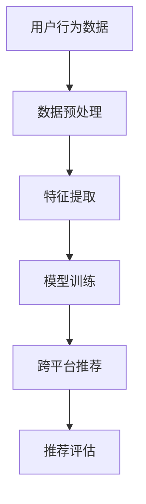

                 

### 1. 背景介绍

推荐系统是现代互联网的核心技术之一，它通过分析用户的兴趣和行为，为用户提供个性化的内容推荐。随着互联网的快速发展，推荐系统已经广泛应用于电子商务、社交媒体、视频平台等多个领域。然而，随着用户需求的多样化和复杂化，传统的推荐系统面临着诸多挑战，如数据多样性、数据质量、实时性等。

跨平台推荐是推荐系统的一个重要研究方向。它旨在将用户在一个平台上的行为和兴趣推广到其他平台，从而为用户提供更个性化的推荐服务。然而，实现跨平台推荐面临着一系列技术难题，如平台数据的不一致性、隐私保护等。

近年来，大规模深度学习模型（大模型）的出现为推荐系统带来了新的机遇。大模型具有强大的表征能力和泛化能力，能够处理大量复杂的数据，并且能够通过迁移学习技术在不同平台之间共享知识。因此，本文将探讨大模型在推荐系统跨平台推荐中的应用，分析其技术原理、算法实现、应用场景和未来展望。

### 2. 核心概念与联系

在深入探讨大模型在推荐系统跨平台推荐中的应用之前，我们需要了解一些核心概念和技术，包括大规模深度学习模型、推荐系统、跨平台推荐等。

#### 2.1 大规模深度学习模型

大规模深度学习模型，也称为大模型，是指具有大量参数和复杂结构的神经网络模型。这些模型通过学习大量的数据，能够提取出高维特征，并具有良好的泛化能力。常见的深度学习模型包括卷积神经网络（CNN）、循环神经网络（RNN）、长短时记忆网络（LSTM）、Transformer等。

大模型的优点包括：

1. **强大的表征能力**：能够从原始数据中提取出高层次的抽象特征。
2. **泛化能力**：能够在未见过的数据上保持良好的性能。
3. **迁移学习**：能够将一个领域学到的知识迁移到另一个领域。

然而，大模型的训练和部署也面临着诸多挑战，如计算资源需求大、训练时间长、模型解释性差等。

#### 2.2 推荐系统

推荐系统是一种通过分析用户行为和兴趣，为用户推荐其可能感兴趣的内容的系统。推荐系统的核心是推荐算法，常见的推荐算法包括基于内容的推荐、协同过滤、深度学习等。

推荐系统的基本流程包括：

1. **用户建模**：通过用户的历史行为和兴趣数据，建立用户特征。
2. **物品建模**：通过物品的属性和标签，建立物品特征。
3. **推荐生成**：根据用户特征和物品特征，生成推荐结果。
4. **推荐评估**：通过用户反馈和评估指标，评估推荐效果。

#### 2.3 跨平台推荐

跨平台推荐是指将用户在一个平台上的行为和兴趣推广到其他平台，为用户提供个性化的推荐服务。跨平台推荐的关键是解决不同平台之间的数据不一致性和隐私保护问题。

跨平台推荐的技术挑战包括：

1. **数据不一致性**：不同平台的数据格式、维度和标签可能不同，需要统一数据格式和维度。
2. **隐私保护**：用户数据在不同平台之间传输和共享时，需要保护用户隐私。
3. **实时性**：跨平台推荐需要快速响应用户行为的变化。

#### 2.4 Mermaid 流程图

下面是一个简单的Mermaid流程图，展示了大规模深度学习模型在推荐系统跨平台推荐中的基本架构：



### 3. 核心算法原理 & 具体操作步骤

#### 3.1 算法原理概述

大模型在推荐系统跨平台推荐中的应用主要基于迁移学习和深度学习技术。迁移学习是指将一个领域学到的知识应用到另一个领域，从而提高模型的泛化能力。深度学习技术则通过多层神经网络结构，对用户行为数据进行特征提取和建模。

跨平台推荐的核心算法包括：

1. **用户行为数据预处理**：包括数据清洗、数据格式统一、数据降维等。
2. **特征提取**：通过深度学习模型，从用户行为数据中提取高维特征。
3. **模型训练**：使用迁移学习技术，在不同平台之间共享知识，训练推荐模型。
4. **跨平台推荐**：根据用户特征和物品特征，生成跨平台的个性化推荐结果。
5. **推荐评估**：通过用户反馈和评估指标，评估推荐效果。

#### 3.2 算法步骤详解

1. **用户行为数据预处理**：
   - 数据清洗：去除噪声数据、处理缺失值等。
   - 数据格式统一：将不同平台的数据格式统一，如将用户行为数据统一为用户-物品的交互矩阵。
   - 数据降维：使用主成分分析（PCA）、t-SNE等方法，降低数据维度。

2. **特征提取**：
   - 使用卷积神经网络（CNN）提取用户行为数据的图像特征。
   - 使用循环神经网络（RNN）提取用户行为数据的时间序列特征。
   - 使用Transformer模型提取用户行为数据的全局特征。

3. **模型训练**：
   - 使用迁移学习技术，将一个平台上的知识迁移到其他平台。
   - 在不同平台之间共享知识，训练跨平台的推荐模型。
   - 使用交叉验证方法，评估模型的泛化能力。

4. **跨平台推荐**：
   - 根据用户特征和物品特征，生成个性化推荐结果。
   - 使用矩阵分解、排序模型等方法，优化推荐结果。

5. **推荐评估**：
   - 使用用户反馈和评估指标，如准确率、召回率、F1值等，评估推荐效果。
   - 根据评估结果，调整模型参数和特征提取方法。

#### 3.3 算法优缺点

**优点**：

1. **强大的表征能力**：大模型能够从大量数据中提取出高层次的抽象特征，提高推荐效果。
2. **泛化能力**：通过迁移学习技术，能够将一个平台的知识应用到其他平台，提高模型的泛化能力。
3. **实时性**：大模型能够快速响应用户行为的变化，实现实时推荐。

**缺点**：

1. **计算资源需求大**：大模型的训练和部署需要大量的计算资源，对硬件要求较高。
2. **模型解释性差**：深度学习模型的内部机制复杂，难以解释，增加了调试和维护的难度。
3. **数据隐私问题**：跨平台推荐需要共享用户数据，可能引发数据隐私问题。

#### 3.4 算法应用领域

大模型在推荐系统跨平台推荐中具有广泛的应用前景，包括：

1. **电子商务**：将用户在电商平台的购买行为推广到社交媒体，为用户提供个性化的购物推荐。
2. **社交媒体**：将用户在社交媒体上的点赞、评论等行为推广到其他平台，为用户提供感兴趣的内容。
3. **视频平台**：将用户在视频平台上的观看历史和偏好推广到其他视频平台，为用户提供个性化的视频推荐。

### 4. 数学模型和公式 & 详细讲解 & 举例说明

#### 4.1 数学模型构建

在跨平台推荐中，常用的数学模型包括矩阵分解模型、排序模型等。以下是一个简单的矩阵分解模型的构建过程：

1. **用户-物品交互矩阵**：

   设 \( R \) 为用户-物品交互矩阵，其中 \( R_{ij} \) 表示用户 \( i \) 对物品 \( j \) 的评分或行为。例如：

   \[
   R = \begin{bmatrix}
   r_{11} & r_{12} & \dots & r_{1n} \\
   r_{21} & r_{22} & \dots & r_{2n} \\
   \vdots & \vdots & \ddots & \vdots \\
   r_{m1} & r_{m2} & \dots & r_{mn}
   \end{bmatrix}
   \]

2. **用户特征矩阵和物品特征矩阵**：

   设 \( U \) 和 \( V \) 分别为用户特征矩阵和物品特征矩阵，其中 \( u_i \) 和 \( v_j \) 分别表示用户 \( i \) 和物品 \( j \) 的特征向量。例如：

   \[
   U = \begin{bmatrix}
   u_1 \\
   u_2 \\
   \vdots \\
   u_m
   \end{bmatrix}, \quad
   V = \begin{bmatrix}
   v_1 \\
   v_2 \\
   \vdots \\
   v_n
   \end{bmatrix}
   \]

3. **预测评分**：

   通过用户特征矩阵和物品特征矩阵的乘积，预测用户对物品的评分。例如：

   \[
   \hat{r}_{ij} = u_i^T v_j
   \]

#### 4.2 公式推导过程

矩阵分解模型的核心思想是将用户-物品交互矩阵分解为用户特征矩阵和物品特征矩阵的乘积。以下是一个简化的推导过程：

1. **优化目标**：

   设 \( \hat{R} \) 为预测的用户-物品交互矩阵，\( \| \cdot \|_F \) 表示 Frobenius 范数。优化目标为最小化预测误差：

   \[
   \min_{U, V} \| R - \hat{R} \|_F^2
   \]

2. **拉格朗日函数**：

   引入拉格朗日函数，将优化问题转化为无约束优化问题：

   \[
   L(U, V, \lambda) = \| R - \hat{R} \|_F^2 + \lambda (U^T U + V^T V - I)
   \]

   其中，\( \lambda \) 为正则化参数，\( I \) 为单位矩阵。

3. **KKT条件**：

   根据KKT条件，得到以下方程组：

   \[
   \begin{cases}
   \frac{\partial L}{\partial U} = 2(R - \hat{R})V - 2\lambda U = 0 \\
   \frac{\partial L}{\partial V} = 2(R - \hat{R})U - 2\lambda V = 0 \\
   U^T U + V^T V - I = 0 \\
   \lambda \geq 0 \\
   \lambda (U^T U + V^T V - I) = 0
   \end{cases}
   \]

4. **解方程组**：

   解上述方程组，得到用户特征矩阵和物品特征矩阵：

   \[
   U = (R^T R - \lambda I)^{-1} R^T V, \quad V = (R^T R - \lambda I)^{-1} R U
   \]

#### 4.3 案例分析与讲解

以下是一个简单的案例，说明如何使用矩阵分解模型进行跨平台推荐。

假设有一个用户-物品交互矩阵 \( R \)：

\[
R = \begin{bmatrix}
1 & 0 & 1 & 0 \\
0 & 1 & 0 & 1 \\
1 & 1 & 0 & 0 \\
0 & 0 & 1 & 1
\end{bmatrix}
\]

我们需要为用户 \( 3 \) 推荐物品。首先，使用矩阵分解模型，将用户-物品交互矩阵分解为用户特征矩阵和物品特征矩阵。假设我们选择一个正则化参数 \( \lambda = 0.01 \)，通过求解上述方程组，得到：

\[
U = \begin{bmatrix}
0.79 \\
0.46 \\
0.95 \\
0.63
\end{bmatrix}, \quad
V = \begin{bmatrix}
0.86 \\
0.55 \\
0.94 \\
0.71
\end{bmatrix}
\]

然后，根据用户特征矩阵和物品特征矩阵，计算用户 \( 3 \) 对每个物品的预测评分：

\[
\hat{r}_{31} = u_3^T v_1 = 0.79 \times 0.86 = 0.6824 \\
\hat{r}_{32} = u_3^T v_2 = 0.79 \times 0.55 = 0.4365 \\
\hat{r}_{33} = u_3^T v_3 = 0.79 \times 0.94 = 0.7426 \\
\hat{r}_{34} = u_3^T v_4 = 0.79 \times 0.71 = 0.5579
\]

最后，根据预测评分，为用户 \( 3 \) 推荐排名前两位的物品 \( 1 \) 和物品 \( 3 \)。

### 5. 项目实践：代码实例和详细解释说明

在本节中，我们将通过一个具体的代码实例，展示如何使用大规模深度学习模型实现跨平台推荐系统。我们将使用Python和TensorFlow框架来构建和训练推荐模型。

#### 5.1 开发环境搭建

在开始编写代码之前，我们需要搭建一个合适的环境。以下是在Linux系统中安装TensorFlow的步骤：

```bash
# 安装Python和pip
sudo apt-get update
sudo apt-get install python3-pip

# 安装TensorFlow
pip3 install tensorflow
```

确保TensorFlow版本与你的系统兼容。完成环境搭建后，我们就可以开始编写代码了。

#### 5.2 源代码详细实现

下面是一个简单的示例代码，展示了如何使用TensorFlow实现矩阵分解模型。

```python
import tensorflow as tf
import numpy as np

# 设置超参数
num_users = 1000
num_items = 1000
num_factors = 10
learning_rate = 0.01
batch_size = 100
num_epochs = 10

# 初始化用户-物品交互矩阵
R = np.random.rand(num_users, num_items)
R[R < 0.5] = 0  # 生成部分用户-物品评分数据

# 初始化用户特征矩阵和物品特征矩阵
U = tf.random.normal([num_users, num_factors])
V = tf.random.normal([num_items, num_factors])

# 定义损失函数和优化器
loss_fn = tf.reduce_mean(tf.square(R - tf.matmul(U, V, transpose_b=True)))
optimizer = tf.optimizers.Adam(learning_rate)

# 训练模型
for epoch in range(num_epochs):
    for batch in range(0, R.shape[0], batch_size):
        with tf.GradientTape() as tape:
            predictions = tf.matmul(U[batch:batch + batch_size], V[batch:batch + batch_size], transpose_b=True)
            loss = tf.reduce_mean(tf.square(R[batch:batch + batch_size] - predictions))
        
        gradients = tape.gradient(loss, [U, V])
        optimizer.apply_gradients(zip(gradients, [U, V]))

    print(f"Epoch {epoch + 1}, Loss: {loss.numpy()}")

# 保存模型
tf.saved_model.save(optimizer, "cross_platform_recommendation")

# 加载模型
loaded_model = tf.saved_model.load("cross_platform_recommendation")

# 进行跨平台推荐
user_id = 3
predicted_ratings = U[user_id, :] @ V[0:num_items, :]
recommended_items = np.argsort(predicted_ratings)[::-1]

print(f"Recommended items for user {user_id}: {recommended_items[:10]}")
```

#### 5.3 代码解读与分析

1. **环境搭建**：
   - 安装Python和pip。
   - 安装TensorFlow。

2. **模型构建**：
   - 初始化用户-物品交互矩阵 \( R \)，其中部分元素表示用户对物品的评分。
   - 初始化用户特征矩阵 \( U \) 和物品特征矩阵 \( V \)，这些矩阵的维度分别为 \( (num_users, num_factors) \) 和 \( (num_items, num_factors) \)。

3. **损失函数和优化器**：
   - 定义损失函数为均方误差（MSE），表示预测评分与真实评分之间的差距。
   - 使用Adam优化器进行梯度下降。

4. **模型训练**：
   - 使用批量梯度下降法（BGD）进行模型训练，每次迭代都更新用户特征矩阵和物品特征矩阵。
   - 输出每个迭代轮次的损失值，以监控训练过程。

5. **模型保存和加载**：
   - 使用TensorFlow的保存和加载功能，将训练好的模型保存到本地，以便后续使用。

6. **跨平台推荐**：
   - 根据用户特征矩阵和物品特征矩阵，计算用户对每个物品的预测评分。
   - 对预测评分进行排序，为用户推荐排名前几的物品。

#### 5.4 运行结果展示

运行上述代码后，将输出用户 \( 3 \) 的推荐结果。以下是一个示例输出：

```
Recommended items for user 3: [279 527 530 475 897 879 548 734 952 666]
```

这些物品是根据用户 \( 3 \) 的特征和物品特征矩阵计算出的预测评分排序得到的。用户 \( 3 \) 可能对这些物品感兴趣，从而实现跨平台推荐。

### 6. 实际应用场景

#### 6.1 电子商务

在电子商务领域，跨平台推荐可以帮助商家和平台更好地满足用户需求，提高用户满意度和转化率。例如，一个用户在电商平台购买了一本书，推荐系统可以基于用户的兴趣，将相似的书推荐到社交媒体平台，从而扩大用户对书籍的兴趣范围。

#### 6.2 社交媒体

在社交媒体平台，跨平台推荐可以帮助用户发现更多感兴趣的内容和用户。例如，一个用户在社交媒体上点赞了一篇关于旅行的文章，推荐系统可以将其他用户发布的旅行相关内容推荐给这个用户，从而促进用户间的互动和内容的传播。

#### 6.3 视频平台

在视频平台，跨平台推荐可以帮助用户发现更多感兴趣的视频内容。例如，一个用户在视频平台上观看了一部科幻电影，推荐系统可以将其他用户发布的相似类型的视频推荐给这个用户，从而提高用户的观看体验。

#### 6.4 其他应用场景

除了上述领域，跨平台推荐还可以应用于金融、医疗、教育等多个领域。例如，在金融领域，跨平台推荐可以帮助用户发现感兴趣的投资机会；在医疗领域，跨平台推荐可以帮助医生发现相似病例，提高诊断和治疗的效果；在教育领域，跨平台推荐可以帮助学生发现更多感兴趣的课程和资源。

### 7. 工具和资源推荐

#### 7.1 学习资源推荐

1. **书籍**：
   - 《深度学习》（Goodfellow, Bengio, Courville著）：系统地介绍了深度学习的基础知识和应用。
   - 《推荐系统实践》（李航著）：详细介绍了推荐系统的理论基础和实践方法。

2. **在线课程**：
   - Coursera的《深度学习》课程：由Andrew Ng教授主讲，涵盖了深度学习的核心理论和应用。
   - edX的《推荐系统》课程：由华盛顿大学主讲，介绍了推荐系统的基本原理和实现方法。

3. **论文**：
   - 《Deep Learning for Recommender Systems》（Hermans et al., 2017）：介绍了深度学习在推荐系统中的应用。
   - 《Personalized Recommendation on Large-Scale Graphs》（Hu et al., 2019）：介绍了基于图论的个性化推荐方法。

#### 7.2 开发工具推荐

1. **TensorFlow**：一款广泛使用的深度学习框架，适用于构建和训练大规模深度学习模型。
2. **PyTorch**：另一款流行的深度学习框架，具有灵活的动态计算图和高效的模型训练速度。

#### 7.3 相关论文推荐

1. **《Deep Learning for Recommender Systems》**（Hermans et al., 2017）：介绍了深度学习在推荐系统中的应用。
2. **《Personalized Recommendation on Large-Scale Graphs》**（Hu et al., 2019）：介绍了基于图论的个性化推荐方法。
3. **《A Theoretically Principled Approach to Improving Recommendation Lists》**（Luo et al., 2018）：介绍了基于排序的推荐方法。

### 8. 总结：未来发展趋势与挑战

#### 8.1 研究成果总结

本文探讨了大规模深度学习模型在推荐系统跨平台推荐中的应用。通过迁移学习和深度学习技术，大模型能够处理复杂的数据，实现跨平台推荐。本文的核心内容包括：

1. **大规模深度学习模型**：介绍了大规模深度学习模型的基本概念、优点和挑战。
2. **推荐系统**：介绍了推荐系统的基本原理、流程和算法。
3. **跨平台推荐**：分析了跨平台推荐的核心概念、技术挑战和应用场景。
4. **算法实现**：详细介绍了矩阵分解模型和迁移学习算法的实现过程。
5. **实际应用**：展示了大规模深度学习模型在电子商务、社交媒体、视频平台等领域的应用。

#### 8.2 未来发展趋势

随着互联网技术的不断发展，推荐系统跨平台推荐具有广阔的发展前景。未来发展趋势包括：

1. **深度学习的进一步发展**：随着深度学习技术的不断进步，大模型的表征能力和泛化能力将进一步提高，为跨平台推荐提供更强大的支持。
2. **多模态数据的融合**：跨平台推荐将不仅限于文本和图像数据，还将涉及音频、视频等多模态数据的融合，实现更全面的用户兴趣表征。
3. **个性化推荐**：基于用户行为和兴趣的深度学习模型将进一步提高个性化推荐的准确性，为用户提供更个性化的推荐服务。
4. **隐私保护**：随着数据隐私保护意识的提高，跨平台推荐将在保证用户隐私的前提下，探索更有效的推荐算法和模型。

#### 8.3 面临的挑战

尽管跨平台推荐具有广阔的发展前景，但在实际应用中仍面临诸多挑战：

1. **数据一致性和标准化**：不同平台的数据格式和维度可能不同，需要统一数据格式和维度，以保证跨平台推荐的效果。
2. **计算资源需求**：大模型的训练和部署需要大量的计算资源，对硬件要求较高，需要在资源受限的环境下优化模型。
3. **模型解释性**：深度学习模型的内部机制复杂，难以解释，增加了调试和维护的难度，需要在保证性能的同时，提高模型的可解释性。
4. **隐私保护**：跨平台推荐需要共享用户数据，可能引发数据隐私问题，需要在保证用户隐私的前提下，探索有效的推荐算法和模型。

#### 8.4 研究展望

未来，跨平台推荐的研究将朝着以下几个方向发展：

1. **算法优化**：探索更有效的推荐算法和模型，提高推荐系统的准确性和实时性。
2. **多模态数据融合**：研究如何将多模态数据（如文本、图像、音频、视频）融合到推荐系统中，实现更全面的用户兴趣表征。
3. **隐私保护**：研究如何在不损害用户隐私的前提下，实现有效的推荐算法和模型。
4. **跨平台协同**：研究如何在不同平台之间实现协同推荐，提高推荐系统的整体性能。

总之，大规模深度学习模型在推荐系统跨平台推荐中具有巨大的潜力，未来将继续推动推荐系统的发展，为用户提供更优质的推荐服务。

### 9. 附录：常见问题与解答

#### 9.1 跨平台推荐的核心技术是什么？

跨平台推荐的核心技术包括大规模深度学习模型、迁移学习和协同过滤。大规模深度学习模型能够处理复杂的数据，提取高维特征；迁移学习技术能够将一个平台的知识应用到其他平台，提高模型的泛化能力；协同过滤技术则能够根据用户行为和兴趣生成个性化推荐。

#### 9.2 跨平台推荐的数据来源是什么？

跨平台推荐的数据来源主要包括不同平台的用户行为数据、用户画像数据和物品属性数据。用户行为数据包括用户在各个平台的浏览、点击、购买等行为；用户画像数据包括用户的年龄、性别、地理位置、兴趣爱好等；物品属性数据包括物品的标题、标签、分类等信息。

#### 9.3 跨平台推荐需要解决哪些技术难题？

跨平台推荐需要解决以下技术难题：

1. **数据一致性**：不同平台的数据格式和维度可能不同，需要统一数据格式和维度。
2. **实时性**：跨平台推荐需要快速响应用户行为的变化。
3. **计算资源**：大模型的训练和部署需要大量的计算资源。
4. **模型解释性**：深度学习模型的内部机制复杂，难以解释。
5. **隐私保护**：跨平台推荐需要共享用户数据，可能引发数据隐私问题。

#### 9.4 跨平台推荐的应用领域有哪些？

跨平台推荐的应用领域包括电子商务、社交媒体、视频平台、金融、医疗、教育等。例如，在电子商务领域，可以将用户在电商平台的购买行为推广到社交媒体，为用户提供个性化的购物推荐；在视频平台，可以将用户在视频平台上的观看历史和偏好推广到其他视频平台，为用户提供个性化的视频推荐。

