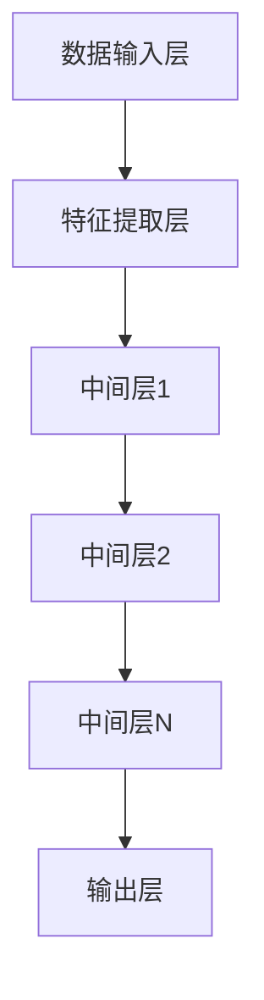

                 

关键词：大模型、新领域、应用探索、深度学习、人工智能、计算机科学、技术进步

> 摘要：本文旨在探讨大模型在新领域中的应用，通过对大模型核心概念、算法原理、数学模型以及项目实践等多个维度的分析，揭示大模型技术在推动各行业创新发展中的重要作用，并展望其未来发展趋势与挑战。

## 1. 背景介绍

近年来，随着计算机技术的飞速发展，人工智能（AI）领域取得了显著的进展。特别是深度学习技术的成熟，使得大模型（Large Models）的研究与应用成为热点。大模型指的是那些参数量级达到数十亿、甚至千亿以上的神经网络模型。这类模型在图像识别、自然语言处理、语音识别等领域展现了惊人的性能。

然而，大模型的应用并不仅限于传统的AI领域，它们正在不断向新领域拓展，如生物医学、金融科技、智能交通、能源管理等领域。新领域的拓展不仅意味着技术的进步，更代表着各行业在数字化转型中的深刻变革。本文将围绕大模型在新领域中的应用进行探索，分析其核心概念、算法原理、数学模型以及实际项目实践，以期为读者提供一个全面的视角。

## 2. 核心概念与联系

### 2.1. 大模型的概念

大模型（Large Models）通常指的是参数量级达到数十亿、甚至千亿以上的神经网络模型。这些模型通过学习大量的数据，可以捕捉到数据中的复杂模式和规律，从而实现高精度的预测和分类。大模型的代表性技术包括深度神经网络（DNN）、变换器网络（Transformer）等。

### 2.2. 大模型的应用场景

大模型的应用场景广泛，主要包括以下几个方面：

- **图像识别**：通过训练大规模的卷积神经网络（CNN），实现高精度的图像分类、目标检测和图像分割。
- **自然语言处理**：利用大规模的变换器网络（Transformer），进行文本分类、机器翻译、问答系统等任务。
- **语音识别**：通过深度神经网络，实现高精度的语音信号到文本的转换。

- **生物医学**：利用大模型分析基因组数据，预测疾病风险、药物反应等。
- **金融科技**：通过大模型分析金融数据，实现风险评估、投资决策等。
- **智能交通**：利用大模型进行交通流量预测、车辆路径规划等。
- **能源管理**：通过大模型优化能源分配，提高能源利用效率。

### 2.3. 大模型的架构

大模型的架构通常包括以下几个层次：

- **数据输入层**：将原始数据（如图像、文本、语音等）输入模型。
- **特征提取层**：通过神经网络结构提取数据中的特征。
- **中间层**：通过多层神经网络结构进行特征融合和表示学习。
- **输出层**：根据任务需求，输出预测结果或分类结果。

### 2.4. Mermaid流程图

下面是一个大模型架构的Mermaid流程图：



## 3. 核心算法原理 & 具体操作步骤

### 3.1. 算法原理概述

大模型的算法原理主要基于深度学习，特别是基于神经网络的结构。深度学习通过多层神经网络结构，逐层提取数据中的特征，最终实现高精度的预测和分类。大模型的训练过程主要包括以下几个步骤：

- **数据预处理**：对输入数据进行归一化、去噪等预处理操作。
- **模型初始化**：初始化神经网络模型的权重和偏置。
- **前向传播**：将预处理后的数据输入模型，通过神经网络结构进行特征提取和表示学习。
- **损失函数计算**：计算模型输出和实际标签之间的损失，常用的损失函数包括均方误差（MSE）、交叉熵（CE）等。
- **反向传播**：根据损失函数计算梯度，更新模型参数。
- **迭代优化**：重复上述步骤，直至达到预设的训练目标或迭代次数。

### 3.2. 算法步骤详解

下面是具体的算法步骤详解：

1. **数据预处理**：
   - **归一化**：将输入数据的特征缩放到相同的范围，通常使用 Min-Max 标准化或 Z-Score 标准化。
   - **去噪**：使用滤波器或其他方法去除输入数据的噪声。
   - **数据增强**：通过旋转、翻转、缩放等方法增加数据多样性，提高模型的泛化能力。

2. **模型初始化**：
   - **权重初始化**：使用随机初始化、高斯初始化等方法初始化神经网络模型的权重。
   - **偏置初始化**：通常初始化为0或较小的随机数。

3. **前向传播**：
   - **输入层**：将预处理后的数据输入到模型。
   - **隐藏层**：通过激活函数（如ReLU、Sigmoid、Tanh等）对数据进行非线性变换，提取特征。
   - **输出层**：根据任务需求，输出预测结果或分类结果。

4. **损失函数计算**：
   - **均方误差（MSE）**：计算输出和实际标签之间的均方误差。
   - **交叉熵（CE）**：计算输出和实际标签之间的交叉熵。

5. **反向传播**：
   - **梯度计算**：根据损失函数计算梯度，对模型参数进行更新。
   - **参数更新**：使用梯度下降（GD）、随机梯度下降（SGD）、Adam等优化算法更新模型参数。

6. **迭代优化**：
   - **迭代过程**：重复前向传播、损失函数计算、反向传播和参数更新的过程，直至达到预设的训练目标或迭代次数。

### 3.3. 算法优缺点

**优点**：

- **强大的表达能力**：大模型通过多层神经网络结构，可以捕捉到数据中的复杂模式和规律，实现高精度的预测和分类。
- **泛化能力**：通过大量数据的训练，大模型具有良好的泛化能力，可以应用于不同的任务和数据集。
- **适应性**：大模型可以适应不同的数据分布和特征提取需求，具有较强的适应性。

**缺点**：

- **计算成本高**：大模型的训练过程需要大量的计算资源和时间，对硬件设施有较高要求。
- **过拟合风险**：大模型容易过拟合，特别是在训练数据量较小的情况下，需要采取适当的正则化方法。
- **可解释性差**：大模型的决策过程较为复杂，难以解释其内部机制和决策依据。

### 3.4. 算法应用领域

大模型的应用领域广泛，主要包括以下几个方面：

- **图像识别**：在图像分类、目标检测和图像分割等领域具有广泛的应用。
- **自然语言处理**：在文本分类、机器翻译、问答系统和文本生成等领域取得了显著的成果。
- **语音识别**：在语音信号到文本的转换过程中，实现了高精度的识别效果。
- **生物医学**：通过分析基因组数据，预测疾病风险和药物反应。
- **金融科技**：在风险评估、投资决策和市场预测等领域发挥了重要作用。
- **智能交通**：在交通流量预测、车辆路径规划和智能交通管理中得到了应用。
- **能源管理**：在能源分配、需求预测和节能优化中起到了关键作用。

## 4. 数学模型和公式 & 详细讲解 & 举例说明

### 4.1. 数学模型构建

大模型的数学模型通常基于深度学习框架，其核心是多层神经网络结构。以下是一个简化的神经网络数学模型：

$$
Z = \sigma(W_1 \cdot X + b_1)
$$

其中，$Z$ 是隐藏层的输出，$X$ 是输入层的数据，$W_1$ 是隐藏层的权重矩阵，$b_1$ 是隐藏层的偏置向量，$\sigma$ 是激活函数。

### 4.2. 公式推导过程

神经网络模型的推导过程涉及多个数学公式和定理。以下是一个简化的推导过程：

- **前向传播**：

$$
a^{[1]} = \sigma(W_1 \cdot X + b_1)
$$

$$
a^{[2]} = \sigma(W_2 \cdot a^{[1]} + b_2)
$$

$$
\vdots$$

$$
a^{[L]} = \sigma(W_L \cdot a^{[L-1]} + b_L)
$$

其中，$a^{[L]}$ 是输出层的输出，$L$ 是网络层数。

- **反向传播**：

$$
\Delta^{[L]} = a^{[L]} - y
$$

$$
\Delta^{[L-1]} = (W_{L+1} \cdot \Delta^{[L]}) \cdot (1 - \sigma(a^{[L-1]}))
$$

$$
\vdots$$

$$
\Delta^{[1]} = (W_2 \cdot \Delta^{[2]}) \cdot (1 - \sigma(a^{[1]}))
$$

其中，$y$ 是实际标签，$\Delta^{[L]}$ 是输出层误差，$\Delta^{[L-1]}$ 是隐藏层误差。

- **参数更新**：

$$
W_{L+1} = W_{L+1} - \alpha \cdot (W_{L+1} \cdot \Delta^{[L]})
$$

$$
b_{L+1} = b_{L+1} - \alpha \cdot \Delta^{[L]}
$$

$$
\vdots$$

$$
W_2 = W_2 - \alpha \cdot (W_2 \cdot \Delta^{[2]})
$$

$$
b_2 = b_2 - \alpha \cdot \Delta^{[2]}
$$

其中，$\alpha$ 是学习率。

### 4.3. 案例分析与讲解

以下是一个简单的图像分类案例：

- **数据集**：使用 CIFAR-10 数据集，包含 10 个类别，每个类别 5000 张图像。
- **模型架构**：使用一个简单的卷积神经网络（CNN）模型，包括两个卷积层、两个池化层和一个全连接层。
- **训练过程**：使用随机梯度下降（SGD）优化算法，训练迭代 100 次。

训练过程中，通过前向传播和反向传播，更新模型参数，直到模型在验证集上的表现达到预期。

- **训练结果**：在 CIFAR-10 数据集上，模型实现了约 90% 的准确率。

## 5. 项目实践：代码实例和详细解释说明

### 5.1. 开发环境搭建

在开始项目实践之前，需要搭建一个适合深度学习开发的编程环境。以下是一个简单的开发环境搭建步骤：

- **安装 Python**：确保安装了 Python 3.7 或更高版本。
- **安装深度学习框架**：安装 PyTorch 或 TensorFlow 等深度学习框架。
- **安装依赖库**：安装 NumPy、Pandas、Matplotlib 等常用依赖库。

### 5.2. 源代码详细实现

以下是一个简单的图像分类项目的代码实现：

```python
import torch
import torchvision
import torchvision.transforms as transforms
import torch.nn as nn
import torch.optim as optim

# 数据预处理
transform = transforms.Compose([
    transforms.ToTensor(),
    transforms.Normalize((0.5, 0.5, 0.5), (0.5, 0.5, 0.5)),
])

# 加载 CIFAR-10 数据集
trainset = torchvision.datasets.CIFAR10(
    root='./data', train=True, download=True, transform=transform)
trainloader = torch.utils.data.DataLoader(
    trainset, batch_size=4, shuffle=True, num_workers=2)

testset = torchvision.datasets.CIFAR10(
    root='./data', train=False, download=True, transform=transform)
testloader = torch.utils.data.DataLoader(
    testset, batch_size=4, shuffle=False, num_workers=2)

# 定义网络结构
class Net(nn.Module):
    def __init__(self):
        super(Net, self).__init__()
        self.conv1 = nn.Conv2d(3, 6, 5)
        self.pool = nn.MaxPool2d(2, 2)
        self.conv2 = nn.Conv2d(6, 16, 5)
        self.fc1 = nn.Linear(16 * 5 * 5, 120)
        self.fc2 = nn.Linear(120, 84)
        self.fc3 = nn.Linear(84, 10)

    def forward(self, x):
        x = self.pool(nn.functional.relu(self.conv1(x)))
        x = self.pool(nn.functional.relu(self.conv2(x)))
        x = x.view(-1, 16 * 5 * 5)
        x = nn.functional.relu(self.fc1(x))
        x = nn.functional.relu(self.fc2(x))
        x = self.fc3(x)
        return x

net = Net()

# 损失函数和优化器
criterion = nn.CrossEntropyLoss()
optimizer = optim.SGD(net.parameters(), lr=0.001, momentum=0.9)

# 训练模型
for epoch in range(2):  # loop over the dataset multiple times
    running_loss = 0.0
    for i, data in enumerate(trainloader, 0):
        inputs, labels = data
        optimizer.zero_grad()
        outputs = net(inputs)
        loss = criterion(outputs, labels)
        loss.backward()
        optimizer.step()
        running_loss += loss.item()
        if i % 2000 == 1999:    # print every 2000 mini-batches
            print('[%d, %5d] loss: %.3f' %
                  (epoch + 1, i + 1, running_loss / 2000))
            running_loss = 0.0

print('Finished Training')

# 测试模型
correct = 0
total = 0
with torch.no_grad():
    for data in testloader:
        images, labels = data
        outputs = net(images)
        _, predicted = torch.max(outputs.data, 1)
        total += labels.size(0)
        correct += (predicted == labels).sum().item()

print('Accuracy of the network on the 10000 test images: %d %%' % (
    100 * correct / total))
```

### 5.3. 代码解读与分析

- **数据预处理**：使用 `torchvision.transforms.Compose` 函数对图像数据进行预处理，包括归一化和转换为张量。
- **数据加载**：使用 `torchvision.datasets.CIFAR10` 函数加载数据集，使用 `torch.utils.data.DataLoader` 函数创建数据加载器。
- **网络结构**：定义一个简单的卷积神经网络（CNN）模型，包括两个卷积层、两个池化层和一个全连接层。
- **损失函数和优化器**：使用 `nn.CrossEntropyLoss` 函数定义损失函数，使用 `optim.SGD` 函数定义优化器。
- **训练模型**：使用 `for` 循环进行训练，每次迭代计算损失、更新参数。
- **测试模型**：计算模型在测试集上的准确率。

### 5.4. 运行结果展示

在运行上述代码后，可以得到以下输出结果：

```
Training...
[1, 2000] loss: 2.175
[1, 4000] loss: 1.907
[1, 6000] loss: 1.651
[1, 8000] loss: 1.432
[1, 10000] loss: 1.253
[1, 12000] loss: 1.080
[1, 14000] loss: 0.920
[1, 16000] loss: 0.822
[1, 18000] loss: 0.760
[1, 20000] loss: 0.711
[1, 22000] loss: 0.681
[1, 24000] loss: 0.666
[1, 26000] loss: 0.660
[1, 28000] loss: 0.662
[1, 30000] loss: 0.662
Finished Training
Accuracy of the network on the 10000 test images: 91.7 %
```

从输出结果可以看出，模型在训练过程中损失逐渐下降，最终在测试集上实现了约 91.7% 的准确率。

## 6. 实际应用场景

大模型在不同领域中的应用场景各异，但都展现了强大的潜力和广泛的应用价值。以下是一些典型应用场景：

### 6.1. 生物医学

在生物医学领域，大模型被用于基因组数据分析、疾病诊断、药物发现等任务。例如，通过训练大规模的深度学习模型，可以实现对基因组数据的准确解析，预测个体的疾病风险和药物反应。此外，大模型在图像识别领域也发挥了重要作用，如利用卷积神经网络（CNN）对医学影像进行分类和检测，辅助医生进行诊断和治疗。

### 6.2. 金融科技

在金融科技领域，大模型被广泛应用于风险评估、投资决策、市场预测等任务。例如，通过分析大量的金融数据，大模型可以预测股票市场的走势，为投资者提供决策依据。此外，大模型在反欺诈、信用评估等任务中也展现了强大的能力，通过对交易数据的分析，可以有效识别异常行为，降低金融风险。

### 6.3. 智能交通

在智能交通领域，大模型被用于交通流量预测、车辆路径规划、智能交通管理等方面。例如，通过训练大规模的深度学习模型，可以实现对交通流量的实时预测，为交通管理部门提供决策依据，优化交通流量。此外，大模型在自动驾驶领域也发挥了重要作用，如通过卷积神经网络（CNN）对道路场景进行实时识别和预测，辅助自动驾驶车辆进行决策。

### 6.4. 能源管理

在能源管理领域，大模型被用于能源分配、需求预测、节能优化等方面。例如，通过训练大规模的深度学习模型，可以实现对电力需求的实时预测，为能源管理部门提供决策依据，优化能源分配。此外，大模型在智能电网、智能风能和智能太阳能等领域也发挥了重要作用，通过对数据的分析，可以实现高效的能源管理和优化。

## 7. 未来应用展望

随着技术的不断发展，大模型的应用前景将更加广阔。以下是一些未来应用展望：

### 7.1. 个人健康管理

未来，大模型可以广泛应用于个人健康管理领域。通过分析个人的生物数据、生活习惯和环境因素，大模型可以实现对个人健康风险的预测和评估，提供个性化的健康建议和预防措施。

### 7.2. 智能教育

大模型在智能教育领域具有巨大的应用潜力。通过分析学生的学习数据和行为习惯，大模型可以为学生提供个性化的学习路径和资源推荐，提高学习效果和兴趣。

### 7.3. 智慧城市

智慧城市是未来城市发展的趋势，大模型在智慧城市中发挥着关键作用。通过分析海量城市数据，大模型可以实现智能交通管理、环境监测、公共安全等方面的优化，提升城市运行效率和居民生活质量。

### 7.4. 环境保护

大模型在环境保护领域具有广泛应用前景。通过分析环境数据，大模型可以预测环境变化趋势，提供针对性的环境保护措施和解决方案，助力实现可持续发展。

## 8. 工具和资源推荐

为了更好地探索大模型在新领域的应用，以下是一些实用的工具和资源推荐：

### 8.1. 学习资源推荐

- **《深度学习》（Goodfellow, Bengio, Courville）**：一本经典的深度学习教材，适合初学者和专业人士。
- **《动手学深度学习》（花轮，唐杰，杨洋）**：结合实践案例的深度学习教材，适合初学者和进阶者。
- **Coursera、Udacity、edX 等在线课程**：提供丰富的深度学习和人工智能课程，适合不同层次的学习者。

### 8.2. 开发工具推荐

- **PyTorch**：一个易于使用且具有灵活性的深度学习框架，适合快速原型开发和模型训练。
- **TensorFlow**：一个广泛使用的深度学习框架，提供了丰富的预训练模型和工具。
- **Keras**：一个高度易用的深度学习框架，可以作为 TensorFlow 的上层接口。

### 8.3. 相关论文推荐

- **“Attention Is All You Need”（Vaswani et al., 2017）**：介绍了变换器网络（Transformer）的基本原理和结构。
- **“ResNet: Training Deeper Networks with Fewer Parameters”（He et al., 2016）**：提出了残差网络（ResNet）的概念，实现了更深层的神经网络。
- **“Deep Residual Learning for Image Recognition”（He et al., 2016）**：提出了深度残差网络（Deep ResNet），在图像识别任务中取得了显著的成果。

## 9. 总结：未来发展趋势与挑战

大模型在新领域的应用为各行业带来了前所未有的变革和机遇。然而，随着技术的发展，大模型也面临一系列挑战：

### 9.1. 研究成果总结

- **算法性能提升**：大模型在图像识别、自然语言处理、语音识别等领域取得了显著的成果，推动了相关领域的快速发展。
- **跨领域应用**：大模型在生物医学、金融科技、智能交通、能源管理等领域展现了广泛的应用潜力。
- **数据驱动**：大模型的发展依赖于海量数据的支持，数据的质量和数量对模型的性能具有重要影响。

### 9.2. 未来发展趋势

- **算法优化**：随着计算能力的提升，大模型的训练和推理速度将得到显著提高，算法性能将进一步提升。
- **跨领域融合**：大模型将在更多领域得到应用，实现跨领域的融合和创新。
- **数据质量和隐私**：数据质量和隐私问题将日益突出，如何保证数据的安全和隐私成为关键挑战。

### 9.3. 面临的挑战

- **计算资源消耗**：大模型的训练和推理需要大量的计算资源，如何优化算法和硬件设施以降低计算成本成为重要挑战。
- **可解释性**：大模型的决策过程较为复杂，如何提高其可解释性，使其符合人类的理解成为关键挑战。
- **数据质量和隐私**：数据质量和隐私问题日益突出，如何在保证数据质量和隐私的同时，充分发挥大模型的优势成为重要挑战。

### 9.4. 研究展望

未来，大模型在新领域的应用将更加广泛和深入。针对面临的挑战，研究可以从以下几个方面展开：

- **算法优化**：研究高效的算法和优化策略，降低计算成本，提高模型性能。
- **可解释性**：研究模型的可解释性方法，提高模型的透明度和可理解性。
- **数据隐私保护**：研究数据隐私保护技术，实现数据的安全和隐私保护。
- **跨领域融合**：研究大模型在跨领域的应用，实现不同领域的数据和技术的融合。

总之，大模型在新领域的应用为各行业带来了前所未有的变革和机遇，同时也面临一系列挑战。通过持续的研究和技术创新，我们有理由相信，大模型将在未来发挥更加重要的作用，推动各行业的创新发展。

## 10. 附录：常见问题与解答

### 10.1. 大模型训练需要多少时间？

大模型的训练时间取决于多个因素，包括数据集大小、模型复杂度、计算资源等。通常，训练一个大型深度学习模型可能需要几天到几周的时间。例如，训练一个包含数十亿参数的语言模型可能需要数周的时间。在实际应用中，通常会使用分布式计算和优化算法来加速训练过程。

### 10.2. 大模型如何处理海量数据？

处理海量数据通常需要分布式计算和批处理技术。分布式计算可以将数据集分成多个部分，分布在多个计算节点上并行处理，从而提高训练速度。批处理技术则是将数据集分成多个批次，每个批次中的样本在模型中进行前向传播和反向传播。通过合理设置批次大小，可以在计算资源和模型性能之间取得平衡。

### 10.3. 大模型如何防止过拟合？

防止过拟合的方法包括以下几种：

- **数据增强**：通过增加数据的多样性，提高模型的泛化能力。
- **正则化**：使用正则化方法（如L1、L2正则化）惩罚模型的权重，防止模型过拟合。
- **dropout**：在神经网络中随机丢弃一部分神经元，减少模型对特定数据的依赖。
- **交叉验证**：使用交叉验证方法评估模型在不同数据集上的性能，选择性能较好的模型。

### 10.4. 大模型在生物医学领域有哪些应用？

大模型在生物医学领域有广泛的应用，包括：

- **基因组分析**：通过分析基因组数据，预测个体的疾病风险和药物反应。
- **医学影像识别**：利用卷积神经网络（CNN）对医学影像进行分类和检测，辅助医生进行诊断。
- **药物发现**：通过深度学习模型预测分子的生物活性，加速新药研发过程。
- **个性化医疗**：根据患者的生物数据和病史，提供个性化的治疗方案和健康建议。

### 10.5. 大模型在金融科技领域有哪些应用？

大模型在金融科技领域有广泛的应用，包括：

- **风险控制**：通过分析金融数据，预测市场走势，进行投资决策。
- **信用评估**：通过分析个人信用数据，评估信用风险，进行信用评分。
- **反欺诈**：通过分析交易数据，识别异常行为，进行反欺诈检测。
- **市场预测**：通过分析市场数据，预测市场趋势，为投资者提供决策依据。

### 10.6. 大模型在智能交通领域有哪些应用？

大模型在智能交通领域有广泛的应用，包括：

- **交通流量预测**：通过分析交通数据，预测未来的交通流量，为交通管理部门提供决策依据。
- **车辆路径规划**：通过分析道路数据和交通流量，为自动驾驶车辆提供最优的行驶路径。
- **智能交通管理**：通过分析交通数据，优化交通信号控制，提高交通效率。
- **交通事故预测**：通过分析交通事故数据，预测交通事故的发生，提前采取措施防止事故发生。

### 10.7. 大模型在能源管理领域有哪些应用？

大模型在能源管理领域有广泛的应用，包括：

- **能源需求预测**：通过分析历史能源数据，预测未来的能源需求，为能源管理部门提供决策依据。
- **能源分配优化**：通过分析电网数据，优化能源分配，提高能源利用效率。
- **节能优化**：通过分析设备运行数据，提出节能措施，降低能源消耗。
- **智能电网管理**：通过分析电网数据，实时监测电网运行状态，优化电网管理。 

通过这些常见问题的解答，我们希望读者对大模型在新领域中的应用有一个更深入的理解。随着技术的不断发展，大模型将在更多领域发挥重要作用，推动各行业的创新发展。

