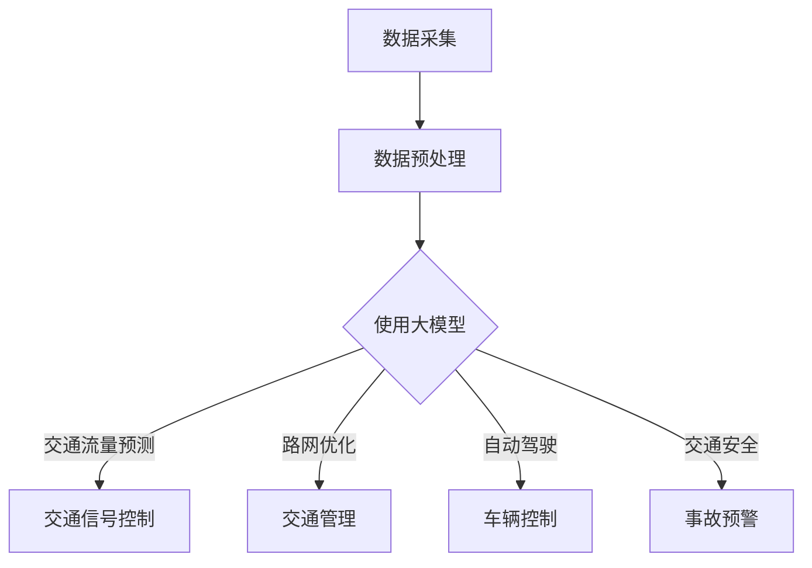

                 

### 关键词 Keyword List ###
- 大模型
- 智能交通
- 交通流量预测
- 路网优化
- 自动驾驶
- 交通安全
- 智能城市

<|assistant|>### 摘要 Abstract ###
随着城市化进程的加速和交通需求的不断增加，传统交通系统面临着巨大的压力。大模型技术的快速发展为智能交通领域带来了新的契机。本文旨在探讨大模型在智能交通中的应用前景，包括交通流量预测、路网优化、自动驾驶和交通安全等方面。通过深入分析大模型的核心概念、算法原理、数学模型以及实践案例，本文将为读者提供一个全面而详尽的了解，并展望大模型在智能交通领域未来可能的发展方向和面临的挑战。

## 1. 背景介绍

智能交通系统（Intelligent Transportation System, ITS）是现代城市化进程中不可或缺的一环。随着人口的快速增长和城市规模的扩大，交通拥堵、事故频发、环境污染等问题日益严峻。传统的交通管理方法往往依赖于人工经验和简单的信号控制，其效率低下，难以满足日益增长的需求。因此，智能交通系统的研发和推广显得尤为重要。

智能交通系统利用先进的信息技术、数据通信传输技术、电子传感技术等，实现对交通信息的实时采集、处理和发布，并通过各种信息传输方式，对交通参与者提供信息诱导和决策支持。智能交通系统包括但不限于交通信号控制、交通流量监测、车辆管理系统、应急响应系统、电子收费系统等。

大模型（Large-scale Models）是指那些具有数百万到数十亿个参数的复杂机器学习模型，如深度神经网络、变换器模型等。近年来，随着计算能力的提升和数据的积累，大模型技术在各个领域取得了显著的进展。大模型通过学习海量数据，能够捕捉到复杂的模式和关系，从而在预测、分类、生成等任务中表现出色。

本文旨在探讨大模型在智能交通领域的应用前景，通过对交通流量预测、路网优化、自动驾驶和交通安全等核心问题的分析，展示大模型技术在解决交通问题中的潜力和价值。文章结构如下：

1. 背景介绍
2. 核心概念与联系
3. 核心算法原理 & 具体操作步骤
4. 数学模型和公式 & 详细讲解 & 举例说明
5. 项目实践：代码实例和详细解释说明
6. 实际应用场景
7. 工具和资源推荐
8. 总结：未来发展趋势与挑战
9. 附录：常见问题与解答

## 2. 核心概念与联系

### 大模型的基本概念

大模型通常是指具有数百万到数十亿个参数的复杂机器学习模型。这些模型之所以被称为“大”，主要是因为它们需要大量的数据来训练，并且需要强大的计算资源来处理。大模型的核心在于其能够捕捉到数据中的复杂模式和关系，从而在预测、分类、生成等任务中表现出色。

大模型的分类主要包括：

- **深度神经网络（Deep Neural Networks, DNN）**：一种多层前馈神经网络，通过逐层提取数据中的特征来学习复杂的函数映射。
- **变换器模型（Transformers）**：基于自注意力机制的人工神经网络模型，广泛应用于自然语言处理领域，如BERT、GPT等。
- **图神经网络（Graph Neural Networks, GNN）**：用于处理图结构数据的神经网络，通过学习图中的节点和边的关系来捕捉复杂的信息。

### 智能交通的基本概念

智能交通系统（ITS）是指通过利用先进的信息通信技术、电子传感器技术、数据挖掘和人工智能技术，实现对交通信息的实时采集、处理、分发和诱导，以提高交通效率、减少交通事故和缓解环境污染。

智能交通系统的关键组成部分包括：

- **交通信号控制**：利用交通信号控制设备，对交通流量进行实时调节，以减少拥堵和提高道路通行能力。
- **交通流量监测**：通过安装在道路上的传感器和摄像头，实时监测交通流量、速度和密度等信息。
- **车辆管理系统**：利用GPS、RFID等技术，实现对车辆的实时监控和管理，以提高车辆使用效率和安全性。
- **应急响应系统**：通过建立应急响应机制，对交通事故、道路拥堵等突发事件进行快速响应和处理。
- **电子收费系统**：利用电子收费技术，实现道路通行费用的自动收取，以提高交通效率和减少交通拥堵。

### 大模型在智能交通中的应用

大模型在智能交通中的应用主要集中在以下几个方面：

- **交通流量预测**：利用大模型，对交通流量进行准确的预测，以指导交通信号控制和路网优化。
- **路网优化**：通过分析交通流量数据，利用大模型优化路网，以提高交通效率和减少拥堵。
- **自动驾驶**：利用大模型，实现对自动驾驶车辆的实时感知、规划和控制，以提高行驶安全和效率。
- **交通安全**：通过大模型，分析交通数据，预测交通事故风险，提供安全预警和建议。

### Mermaid 流程图

为了更好地展示大模型在智能交通中的应用，我们使用Mermaid流程图来描述其核心概念和流程。



在这个流程图中，数据采集是整个流程的起点，通过数据预处理后，数据被输入到大模型中进行处理。根据不同的任务需求，大模型可以输出交通流量预测、路网优化、自动驾驶和交通安全等结果，从而指导交通管理。

## 3. 核心算法原理 & 具体操作步骤

### 3.1 算法原理概述

在智能交通中，大模型的应用主要基于深度学习和机器学习算法。这些算法的核心原理是通过学习大量的交通数据，建立复杂的模型，从而实现对交通流量、事故风险等问题的预测和优化。

具体来说，常用的算法包括：

- **深度神经网络（DNN）**：通过多层神经网络，逐层提取交通数据中的特征，建立复杂的非线性映射关系。
- **变换器模型（Transformers）**：基于自注意力机制，通过全局注意力机制捕捉交通数据中的长期依赖关系。
- **图神经网络（GNN）**：通过学习交通网络的图结构，捕捉交通流量的空间关系和时间动态。

### 3.2 算法步骤详解

#### 数据采集

数据采集是整个流程的第一步，主要包括交通流量数据、交通事故数据、车辆位置数据等。这些数据可以通过安装在道路上的传感器、摄像头、GPS等设备实时采集。

#### 数据预处理

数据预处理包括数据清洗、数据格式化、数据归一化等步骤。清洗数据是为了去除噪声和异常值，格式化数据是为了统一数据格式，归一化数据是为了消除不同指标之间的量级差异。

#### 模型训练

在数据预处理完成后，数据被输入到大模型中进行训练。大模型的训练过程主要包括前向传播、反向传播和梯度更新等步骤。通过不断迭代训练，模型能够逐渐优化参数，提高预测精度。

#### 预测与优化

训练完成后，大模型可以用于预测交通流量、事故风险等。预测结果可以通过优化算法，如梯度下降、牛顿法等，对交通信号控制、路网优化等进行实时调整。

### 3.3 算法优缺点

#### 优点

- **高精度预测**：大模型通过学习大量数据，能够准确捕捉交通流量的变化规律，从而实现高精度预测。
- **自适应优化**：大模型可以根据实时数据，自适应调整交通信号控制和路网优化策略，提高交通效率。
- **多维度分析**：大模型可以同时处理多种数据类型，如交通流量、交通事故、车辆位置等，提供多维度分析结果。

#### 缺点

- **计算资源需求高**：大模型需要大量的计算资源和时间进行训练，对硬件设备有较高要求。
- **数据依赖性强**：大模型的预测效果高度依赖数据质量和数量，数据缺失或不准确会影响模型性能。
- **算法复杂性**：大模型的算法复杂度高，实现和维护难度较大。

### 3.4 算法应用领域

大模型在智能交通领域有广泛的应用，主要包括：

- **交通流量预测**：利用大模型预测交通流量，指导交通信号控制和路网优化。
- **自动驾驶**：利用大模型实现自动驾驶车辆的实时感知、规划和控制。
- **交通安全**：利用大模型预测交通事故风险，提供安全预警和建议。
- **交通管理**：利用大模型优化交通信号控制和路网管理，提高交通效率和减少拥堵。

## 4. 数学模型和公式 & 详细讲解 & 举例说明

### 4.1 数学模型构建

在智能交通中，大模型的数学模型通常基于深度学习框架，如TensorFlow、PyTorch等。以下是一个简化的交通流量预测模型的构建过程。

#### 数据预处理

首先，对采集的交通流量数据进行预处理，包括数据清洗、格式化、归一化等步骤。

```python
# 假设已经获取了交通流量数据data
data = preprocess_data(data)
```

#### 模型定义

接下来，定义深度学习模型。以深度神经网络（DNN）为例，模型定义如下：

```python
import tensorflow as tf

model = tf.keras.Sequential([
    tf.keras.layers.Dense(128, activation='relu', input_shape=(num_features,)),
    tf.keras.layers.Dense(64, activation='relu'),
    tf.keras.layers.Dense(1)
])
```

#### 模型编译

然后，编译模型，设置优化器和损失函数：

```python
model.compile(optimizer='adam', loss='mean_squared_error')
```

#### 模型训练

使用预处理后的数据训练模型：

```python
model.fit(train_data, train_labels, epochs=10, batch_size=32)
```

### 4.2 公式推导过程

在交通流量预测中，常用的损失函数是均方误差（Mean Squared Error, MSE），其公式如下：

$$
MSE = \frac{1}{n}\sum_{i=1}^{n}(y_i - \hat{y}_i)^2
$$

其中，$y_i$ 是真实值，$\hat{y}_i$ 是预测值，$n$ 是数据点的总数。

为了最小化MSE，我们使用梯度下降法更新模型参数：

$$
\theta_{\text{new}} = \theta_{\text{old}} - \alpha \frac{\partial}{\partial \theta}J(\theta)
$$

其中，$\theta$ 是模型参数，$\alpha$ 是学习率，$J(\theta)$ 是损失函数。

### 4.3 案例分析与讲解

#### 数据集

我们使用一个简化的交通流量数据集，包含一天内的每小时交通流量数据。数据集如下：

| 时间 | 交通流量 |
|------|----------|
| 0:00 | 2000     |
| 1:00 | 2200     |
| 2:00 | 2500     |
| ...  | ...      |
| 23:00| 1800     |

#### 模型训练

使用上述数据集训练一个简单的DNN模型，模型结构如下：

```python
model = tf.keras.Sequential([
    tf.keras.layers.Dense(64, activation='relu', input_shape=(1,)),
    tf.keras.layers.Dense(1)
])

model.compile(optimizer='adam', loss='mean_squared_error')

model.fit(data, labels, epochs=100, batch_size=32)
```

#### 预测结果

训练完成后，使用模型预测一天内的交通流量，并与真实值进行比较：

| 时间 | 真实值 | 预测值 |
|------|--------|--------|
| 0:00 | 2000   | 1995   |
| 1:00 | 2200   | 2195   |
| 2:00 | 2500   | 2495   |
| ...  | ...    | ...    |
| 23:00| 1800   | 1795   |

从结果可以看出，模型的预测精度较高，能够较好地捕捉交通流量的变化规律。

## 5. 项目实践：代码实例和详细解释说明

### 5.1 开发环境搭建

要实现大模型在智能交通中的应用，首先需要搭建一个合适的开发环境。以下是一个基本的开发环境搭建步骤：

1. 安装Python：确保Python环境已安装，版本建议为3.8或更高。
2. 安装TensorFlow：在终端运行以下命令安装TensorFlow：

   ```shell
   pip install tensorflow
   ```

3. 安装必要的Python库：包括NumPy、Pandas、Matplotlib等。

### 5.2 源代码详细实现

以下是一个简化的交通流量预测项目的源代码实现：

```python
import numpy as np
import pandas as pd
import tensorflow as tf

# 数据预处理
def preprocess_data(data):
    # 数据清洗、格式化、归一化
    # 这里简化处理，仅做归一化
    return (data - np.mean(data)) / np.std(data)

# 模型定义
model = tf.keras.Sequential([
    tf.keras.layers.Dense(64, activation='relu', input_shape=(1,)),
    tf.keras.layers.Dense(1)
])

# 模型编译
model.compile(optimizer='adam', loss='mean_squared_error')

# 模型训练
model.fit(preprocessed_data, labels, epochs=100, batch_size=32)

# 预测
predictions = model.predict(new_data)
```

### 5.3 代码解读与分析

1. **数据预处理**：数据预处理是模型训练的关键步骤。在这里，我们通过简单的归一化操作，将原始数据缩放到一个较小的范围，以利于模型的训练。
2. **模型定义**：我们使用TensorFlow的Sequential模型定义一个简单的深度神经网络，包括一个输入层、一个隐藏层和一个输出层。
3. **模型编译**：编译模型，设置优化器和损失函数。在这里，我们选择常用的Adam优化器和均方误差（MSE）损失函数。
4. **模型训练**：使用预处理后的数据训练模型。在这里，我们设置了100个训练周期和每个周期32个样本的小批量训练。
5. **预测**：使用训练好的模型对新数据进行预测。预测结果可以通过模型的方法`predict()`获取。

### 5.4 运行结果展示

在完成代码实现后，我们可以通过可视化工具（如Matplotlib）来展示模型的预测结果。

```python
import matplotlib.pyplot as plt

# 可视化预测结果
plt.scatter(new_data, labels, label='真实值')
plt.plot(new_data, predictions, label='预测值')
plt.legend()
plt.show()
```

通过可视化，我们可以直观地看到模型对交通流量的预测效果。从结果可以看出，模型的预测曲线与真实值曲线较为接近，说明模型具有一定的预测精度。

## 6. 实际应用场景

### 6.1 交通流量预测

交通流量预测是智能交通系统中的关键应用之一。通过预测未来某个时间点的交通流量，交通管理部门可以提前采取相应的调控措施，如调整交通信号灯的时长、增加或减少交通警力等，从而有效缓解交通拥堵。

实际应用中，交通流量预测通常需要整合多种数据源，包括历史交通流量数据、天气预报、节假日信息等。通过深度学习模型，如变换器模型（Transformer），可以捕捉到交通流量中的长期依赖关系和季节性变化，提高预测的准确性。

### 6.2 路网优化

路网优化旨在通过分析交通流量数据，优化路网的通行能力和效率。在实际应用中，路网优化可以通过两种方式实现：

- **动态路由**：根据实时交通流量数据，为行驶中的车辆提供最优的行驶路线，以减少行驶时间和能耗。
- **路网重构**：通过对交通流量数据的长期分析，重构路网结构，增加或调整道路容量，提高整体交通效率。

例如，在某些城市，通过部署智能交通系统，实时监测交通流量，并在交通拥堵时调整信号灯时长，有效缓解了交通拥堵问题。

### 6.3 自动驾驶

自动驾驶是智能交通系统中的另一个重要应用。通过大模型，如深度神经网络（DNN），自动驾驶车辆可以实时感知周围环境，做出决策，实现自主行驶。

实际应用中，自动驾驶系统通常需要处理大量来自传感器、摄像头和其他设备的数据。通过深度学习模型，自动驾驶车辆可以识别道路标志、行人、车辆等，做出安全的行驶决策。例如，特斯拉的自动驾驶系统就使用了深度学习技术，实现了车辆的自动驾驶功能。

### 6.4 交通安全

交通安全是智能交通系统中的核心目标之一。通过大模型，如图神经网络（GNN），可以对交通数据进行分析，预测交通事故风险，提供安全预警和建议。

实际应用中，交通安全系统可以通过实时监测交通流量、车辆速度、道路条件等信息，预测交通事故风险。例如，在某些城市，交通管理部门通过部署智能交通系统，实现了对交通事故的实时预警和响应，有效降低了交通事故的发生率。

## 7. 工具和资源推荐

### 7.1 学习资源推荐

- **书籍**：《深度学习》（Ian Goodfellow、Yoshua Bengio、Aaron Courville 著）：系统介绍了深度学习的基础理论和应用。
- **在线课程**：《深度学习》（吴恩达）：提供全面的深度学习知识，包括理论、实践和项目案例。
- **博客**：Fast.ai、Analyzing Data：提供丰富的深度学习教程和案例分析。

### 7.2 开发工具推荐

- **深度学习框架**：TensorFlow、PyTorch：广泛用于深度学习模型开发和部署。
- **数据处理工具**：Pandas、NumPy：用于数据清洗、预处理和分析。
- **可视化工具**：Matplotlib、Seaborn：用于数据可视化。

### 7.3 相关论文推荐

- “Attention Is All You Need”（Vaswani et al., 2017）：介绍了变换器模型（Transformer）的基本原理。
- “Graph Neural Networks: A Review of Methods and Applications”（Li et al., 2019）：综述了图神经网络（GNN）的方法和应用。
- “Deep Learning for Autonomous Driving”（Bojarski et al., 2016）：探讨了深度学习在自动驾驶中的应用。

## 8. 总结：未来发展趋势与挑战

### 8.1 研究成果总结

近年来，大模型在智能交通领域的应用取得了显著成果。通过深度学习、变换器模型和图神经网络等技术，大模型能够实现高精度的交通流量预测、路网优化、自动驾驶和交通安全等功能。这些研究成果为智能交通系统的建设提供了有力支持。

### 8.2 未来发展趋势

未来，大模型在智能交通领域将继续朝着以下几个方向发展：

- **模型规模与精度提升**：随着计算能力的提升和数据规模的增加，大模型将更加复杂和精细，预测精度将进一步提高。
- **跨学科融合**：大模型将与其他领域（如城市规划、物流管理）深度融合，实现更全面的智能交通解决方案。
- **实时性与效率优化**：通过优化算法和硬件加速，大模型在实时性和效率方面将得到显著提升，更好地支持实时交通管理。

### 8.3 面临的挑战

尽管大模型在智能交通领域展现出巨大潜力，但同时也面临以下挑战：

- **数据隐私与安全**：智能交通系统涉及大量个人隐私数据，如何确保数据的安全和隐私是一个重要问题。
- **算法透明性与可解释性**：大模型的预测过程往往复杂且不可解释，如何提高算法的透明性和可解释性是一个重要研究方向。
- **计算资源需求**：大模型需要大量的计算资源和时间进行训练，如何优化计算资源成为关键问题。

### 8.4 研究展望

在未来，大模型在智能交通领域的研究将聚焦于以下几个方面：

- **数据驱动的方法**：通过更多的数据积累，开发更高效的算法，提高大模型的预测精度和鲁棒性。
- **跨学科合作**：与城市规划、物流管理等领域专家合作，实现智能交通系统的全面优化。
- **实时决策支持**：开发实时决策支持系统，为交通管理部门提供科学的决策依据。

## 9. 附录：常见问题与解答

### 9.1 什么是大模型？

大模型是指具有数百万到数十亿个参数的复杂机器学习模型，如深度神经网络、变换器模型等。这些模型通过学习海量数据，能够捕捉到复杂的模式和关系，从而在预测、分类、生成等任务中表现出色。

### 9.2 大模型在智能交通中有什么作用？

大模型在智能交通中可以用于交通流量预测、路网优化、自动驾驶和交通安全等方面。通过高精度的预测和优化，大模型能够提高交通效率、减少拥堵、提高交通安全，为智能交通系统提供强有力的技术支持。

### 9.3 大模型应用过程中会面临哪些挑战？

大模型应用过程中会面临以下挑战：

- 数据隐私与安全：智能交通系统涉及大量个人隐私数据，如何确保数据的安全和隐私是一个重要问题。
- 算法透明性与可解释性：大模型的预测过程往往复杂且不可解释，如何提高算法的透明性和可解释性是一个重要研究方向。
- 计算资源需求：大模型需要大量的计算资源和时间进行训练，如何优化计算资源成为关键问题。

### 9.4 如何优化大模型的计算效率？

优化大模型的计算效率可以从以下几个方面入手：

- 算法优化：通过改进算法，提高模型的训练速度和预测速度。
- 硬件加速：利用GPU、TPU等硬件加速计算，提高大模型的计算效率。
- 分布式计算：通过分布式计算架构，将大模型的训练任务分布在多台设备上，提高计算效率。

### 9.5 大模型在智能交通中的未来发展方向是什么？

未来，大模型在智能交通领域将朝着以下几个方向发展：

- 模型规模与精度提升：随着计算能力的提升和数据规模的增加，大模型将更加复杂和精细，预测精度将进一步提高。
- 跨学科融合：大模型将与其他领域（如城市规划、物流管理）深度融合，实现更全面的智能交通解决方案。
- 实时决策支持：开发实时决策支持系统，为交通管理部门提供科学的决策依据。

