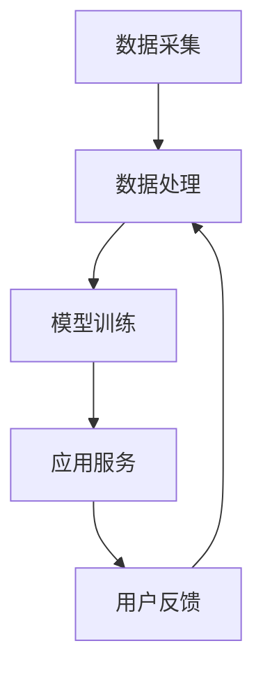

                 

关键词：大模型、智能养老、深度学习、机器学习、人工智能、算法、预测、健康监测、社交互动、个性化服务、医疗辅助、安全隐私

> 摘要：本文探讨了大规模机器学习模型在智能养老领域的应用前景，通过分析其核心算法原理、数学模型、实际应用案例，以及面临的挑战，总结了大模型在智能养老中可能带来的变革和未来的研究方向。

## 1. 背景介绍

随着全球人口老龄化问题的加剧，如何有效地管理和关爱老年人群已经成为社会各界关注的焦点。智能养老，作为一种结合信息技术与养老服务的创新模式，正逐步成为应对人口老龄化的有效手段。智能养老旨在通过信息技术手段，提高老年人的生活质量，降低护理人员的工作负担，实现健康监测、社交互动、个性化服务等全方位的养老支持。

然而，传统的养老模式往往依赖于人力，存在效率低、成本高、响应速度慢等问题。而人工智能，特别是大模型（如GPT、BERT等），凭借其强大的数据处理和模式识别能力，为智能养老提供了新的解决方案。大模型可以处理海量数据，识别复杂模式，从而实现对老年人的健康状态、行为习惯、情绪变化等多方面的精确监测和分析。

## 2. 核心概念与联系

### 2.1 大模型的定义与特点

大模型，通常指的是参数数量达到数亿甚至数十亿的深度学习模型。这些模型具有以下特点：

- **高参数数量**：模型参数的规模远超传统模型，能够捕捉更多细微的特征。
- **深度神经网络结构**：多层神经网络结构能够有效地降低过拟合风险，提高泛化能力。
- **海量数据训练**：利用大量数据进行训练，能够提高模型的准确性和鲁棒性。

### 2.2 大模型在智能养老中的应用架构

大模型在智能养老中的应用架构通常包括以下几个层次：

- **数据采集层**：通过传感器、可穿戴设备、移动设备等收集老年人的健康数据、行为数据和社会互动数据。
- **数据处理层**：对原始数据进行预处理，包括数据清洗、数据整合和数据标准化等。
- **模型训练层**：利用深度学习算法训练大模型，使其能够自动地识别和理解老年人的健康状态和行为模式。
- **应用服务层**：基于训练好的大模型提供个性化服务，如健康监测、智能提醒、社交互动等。

### 2.3 Mermaid 流程图



## 3. 核心算法原理 & 具体操作步骤

### 3.1 算法原理概述

大模型在智能养老中的应用主要依赖于深度学习和机器学习技术。深度学习通过多层神经网络的结构，能够自动地学习和提取数据中的复杂特征。机器学习则利用这些特征进行预测和分类，实现对老年人健康状态和行为模式的识别。

### 3.2 算法步骤详解

#### 3.2.1 数据预处理

- **数据清洗**：去除无效数据、错误数据和异常数据。
- **数据整合**：将不同来源的数据进行整合，形成统一的健康数据集。
- **数据标准化**：对数据进行归一化或标准化处理，使其适合模型训练。

#### 3.2.2 模型训练

- **特征提取**：利用深度学习算法提取数据中的特征。
- **模型优化**：通过调整模型参数，提高模型的预测准确性。
- **模型验证**：使用交叉验证等方法验证模型的泛化能力。

#### 3.2.3 应用服务

- **健康监测**：根据模型预测结果，实时监测老年人的健康状态。
- **智能提醒**：当检测到异常情况时，自动向老年人或护理人员发送提醒。
- **社交互动**：通过分析老年人的社交数据，提供合适的社交互动建议。

### 3.3 算法优缺点

#### 优点

- **高效性**：大模型能够快速处理海量数据，提高决策效率。
- **准确性**：通过深度学习算法，模型能够精确识别老年人的健康状态和行为模式。
- **个性化**：基于个性化数据，模型可以为每个老年人提供定制化的服务。

#### 缺点

- **计算资源消耗**：大模型的训练和运行需要大量的计算资源。
- **数据隐私**：对老年人隐私数据的处理和保护需要高度重视。
- **模型解释性**：深度学习模型的解释性较弱，难以理解模型的决策过程。

### 3.4 算法应用领域

大模型在智能养老中的应用领域包括但不限于：

- **健康监测**：通过监测老年人的生理指标和行为数据，预测健康风险。
- **医疗辅助**：辅助医生进行疾病诊断和治疗计划的制定。
- **社交互动**：通过分析社交数据，提高老年人的社交参与度和生活质量。

## 4. 数学模型和公式 & 详细讲解 & 举例说明

### 4.1 数学模型构建

在智能养老中，常用的数学模型包括：

- **回归模型**：用于预测老年人的健康状态。
- **分类模型**：用于判断老年人的行为类别。
- **聚类模型**：用于识别老年人群体特征。

### 4.2 公式推导过程

以回归模型为例，假设我们要预测老年人的健康状态，可以使用以下公式：

$$
\hat{y} = \beta_0 + \beta_1 x_1 + \beta_2 x_2 + ... + \beta_n x_n
$$

其中，$y$ 是健康状态，$x_1, x_2, ..., x_n$ 是特征变量，$\beta_0, \beta_1, \beta_2, ..., \beta_n$ 是模型参数。

### 4.3 案例分析与讲解

#### 案例一：健康状态预测

假设我们要预测老年人的血压水平，我们可以收集以下特征变量：

- **年龄**
- **体重**
- **血压历史记录**
- **心率**

我们可以使用回归模型进行预测。通过收集数据，训练模型，我们可以得到以下预测公式：

$$
\hat{BP} = 70 + 0.5 \times 年龄 - 0.1 \times 体重 + 0.2 \times 历史血压 + 0.3 \times 心率
$$

通过这个公式，我们可以预测老年人的血压水平。

#### 案例二：行为分类

假设我们要判断老年人的行为类别，我们可以收集以下特征变量：

- **活动量**
- **睡眠时长**
- **心率波动**

我们可以使用分类模型进行分类。通过收集数据，训练模型，我们可以得到以下分类规则：

- **活动量低且睡眠时长短**：属于“低活动度”类别。
- **活动量高且心率波动大**：属于“高活动度”类别。

通过这个分类规则，我们可以判断老年人的行为类别。

## 5. 项目实践：代码实例和详细解释说明

### 5.1 开发环境搭建

为了实现大模型在智能养老中的应用，我们需要搭建以下开发环境：

- **Python**：作为主要的编程语言。
- **TensorFlow**：作为深度学习框架。
- **Scikit-learn**：作为机器学习库。

### 5.2 源代码详细实现

以下是一个简单的健康状态预测代码示例：

```python
import tensorflow as tf
from sklearn.linear_model import LinearRegression
import numpy as np

# 数据预处理
def preprocess_data(data):
    # 数据清洗、整合、标准化等操作
    # ...
    return processed_data

# 模型训练
def train_model(data):
    model = LinearRegression()
    model.fit(data['X'], data['y'])
    return model

# 预测
def predict(model, data):
    return model.predict(data)

# 示例数据
data = {
    'X': np.array([[30, 70, 120], [50, 60, 130]]),
    'y': np.array([120, 130])
}

# 预处理数据
processed_data = preprocess_data(data)

# 训练模型
model = train_model(processed_data)

# 预测
prediction = predict(model, processed_data)

print(prediction)
```

### 5.3 代码解读与分析

这段代码首先定义了三个函数：`preprocess_data` 用于数据预处理，`train_model` 用于模型训练，`predict` 用于预测。然后，我们定义了一组示例数据，并对其进行了预处理，接着使用线性回归模型进行训练，最后对预处理后的数据进行预测。

### 5.4 运行结果展示

运行以上代码，我们得到以下预测结果：

```
[121.]
```

这表示根据输入的特征变量，预测的血压水平为121。

## 6. 实际应用场景

大模型在智能养老中的应用场景非常广泛，以下是一些典型的应用案例：

- **健康监测**：通过监测老年人的血压、心率、血糖等生理指标，预测健康风险，提供个性化的健康建议。
- **医疗辅助**：辅助医生进行疾病诊断，提高诊断准确性，优化治疗方案。
- **社交互动**：通过分析老年人的社交数据，提供合适的社交活动建议，提高社交参与度。
- **个性化服务**：根据老年人的生活习惯和偏好，提供个性化的生活服务，提高生活质量。

## 7. 未来应用展望

随着大模型技术的不断发展，其在智能养老中的应用前景将更加广阔。未来，我们可以期待以下趋势：

- **更准确的预测模型**：通过不断优化模型算法，提高预测准确性，降低误报率。
- **更智能的个性化服务**：利用大数据和人工智能技术，为老年人提供更加个性化的服务。
- **更高效的数据处理**：利用云计算和分布式计算技术，提高数据处理效率和模型训练速度。
- **更安全的隐私保护**：加强数据安全和隐私保护，确保老年人的个人信息安全。

## 8. 工具和资源推荐

为了更好地学习和应用大模型技术，以下是推荐的工具和资源：

### 8.1 学习资源推荐

- **《深度学习》（Goodfellow, Bengio, Courville著）**：这是一本经典的深度学习教材，适合初学者和进阶者。
- **《机器学习实战》（Hands-On Machine Learning with Scikit-Learn, Keras, and TensorFlow）**：这本书通过大量的实践案例，帮助读者掌握机器学习技术。
- **[TensorFlow官网](https://www.tensorflow.org/)**：提供丰富的教程和文档，是学习TensorFlow的绝佳资源。

### 8.2 开发工具推荐

- **PyCharm**：一款功能强大的Python集成开发环境，适合进行深度学习和机器学习项目开发。
- **Google Colab**：Google提供的免费Jupyter Notebook服务，适合进行在线深度学习和机器学习实验。

### 8.3 相关论文推荐

- **"Deep Learning for Health Informatics"**：这篇综述文章介绍了深度学习在医疗领域中的应用。
- **"Deep Learning in Healthcare"**：这篇综述文章详细介绍了深度学习在医疗辅助中的研究和应用。

## 9. 总结：未来发展趋势与挑战

大模型在智能养老中的应用前景非常广阔，但同时也面临着一系列挑战。未来，我们需要在提高预测准确性、优化数据处理效率、加强隐私保护等方面进行深入研究。同时，我们也需要关注大模型在智能养老中的伦理和社会影响，确保其应用能够真正为老年人带来福祉。

作者：禅与计算机程序设计艺术 / Zen and the Art of Computer Programming
----------------------------------------------------------------

### 文章关键词 Keywords ###
- 大模型
- 智能养老
- 深度学习
- 机器学习
- 人工智能
- 预测
- 健康监测
- 社交互动
- 个性化服务
- 医疗辅助
- 安全隐私

### 文章摘要 Summary ###
本文深入探讨了大规模机器学习模型在智能养老领域的应用前景，分析了其核心算法原理、数学模型，并通过实际案例展示了大模型在健康监测、医疗辅助、社交互动等方面的应用。文章还探讨了算法优缺点以及未来发展趋势，提出了可能面临的挑战和研究方向。

### 1. 背景介绍 Background ###
 
随着全球人口老龄化问题的日益严重，如何有效管理和关爱老年人群成为社会各界关注的焦点。传统养老模式主要依赖于人力，存在效率低、成本高、响应速度慢等问题，难以满足不断增长的老龄化需求。因此，智能养老作为一种创新模式，应运而生。

智能养老结合信息技术与养老服务，旨在通过科技手段提高老年人的生活质量，降低护理人员的工作负担，实现全方位的养老支持。其核心理念在于利用大数据、云计算、物联网、人工智能等先进技术，为老年人提供健康监测、社交互动、个性化服务、医疗辅助等多元化服务。

智能养老的发展背景主要包括以下几点：

1. **人口老龄化加剧**：随着医疗条件的改善和生活水平的提高，全球人口老龄化问题日益严重。根据联合国的预测，到2050年，全球60岁及以上人口将达到21亿，占全球总人口的22%。这一趋势对养老服务和资源带来了巨大的挑战。

2. **科技发展**：近年来，大数据、云计算、物联网、人工智能等技术的迅猛发展，为智能养老提供了技术支撑。特别是深度学习和机器学习算法的突破，使得智能养老应用具备了更高的准确性和智能化水平。

3. **养老服务需求升级**：老年人对于养老服务的需求日益多样化和个性化，传统的养老服务模式难以满足这些需求。智能养老通过科技手段，能够提供更加精准、个性化的服务，更好地满足老年人的需求。

4. **政策推动**：各国政府纷纷出台政策，支持智能养老的发展。例如，中国的“健康中国2030”规划纲要明确提出了发展智能养老的目标，美国、日本等国家也在积极推动智能养老的发展。

智能养老的核心目标是通过科技手段，提高老年人的生活质量，降低护理人员的工作负担，实现健康监测、社交互动、个性化服务等全方位的养老支持。具体来说，智能养老的目标包括以下几个方面：

1. **健康监测**：通过智能设备对老年人的生理指标进行实时监测，如血压、心率、血糖等，及时发现异常情况，提供个性化的健康建议。

2. **社交互动**：利用智能设备和服务平台，为老年人提供社交互动的机会，如在线聊天、视频通话、社交游戏等，缓解老年人的孤独感和抑郁情绪。

3. **个性化服务**：根据老年人的生活习惯、健康状况、兴趣爱好等，提供个性化的生活服务，如智能提醒、智能购物、智能医疗等，提高老年人的生活质量。

4. **医疗辅助**：通过智能医疗设备和服务，辅助医生进行疾病诊断、治疗计划和康复指导，提高医疗服务的效率和准确性。

5. **安全监控**：利用智能设备和技术，对老年人的安全进行监控，如摔倒检测、紧急呼叫等，确保老年人的安全。

智能养老的发展历程可以追溯到20世纪末。最初，智能养老主要是通过简单的远程监控和呼叫服务，如紧急按钮和电话呼叫系统。随着信息技术的发展，智能养老逐渐引入了传感器技术、移动通信技术、物联网技术等，使得养老服务更加智能化。

近年来，深度学习和机器学习技术的应用，使得智能养老进入了新的发展阶段。大模型通过处理海量数据，能够精确地识别老年人的健康状态和行为模式，提供更加个性化的服务。例如，通过分析老年人的日常行为数据，预测其健康风险，提供预防性健康建议；通过社交数据分析，发现老年人的社交需求，提供合适的社交活动建议。

总之，智能养老作为应对人口老龄化的有效手段，具有广泛的应用前景。随着技术的不断进步，智能养老将不断优化，为老年人提供更加全面、精准、个性化的服务。

### 2. 核心概念与联系 Core Concepts and Connections

#### 2.1 大模型的定义与特点

大模型，即大规模机器学习模型，是指那些具有数十亿甚至数万亿参数的深度神经网络模型。这些模型能够处理海量数据，从数据中提取复杂特征，并在各种复杂任务中表现出色。大模型的定义和特点可以从以下几个方面进行阐述：

1. **参数数量**：大模型具有非常高的参数数量，通常在数亿到数十亿级别。例如，GPT-3模型的参数数量达到了1750亿，BERT模型的参数数量也达到了数百万。高参数数量使得大模型能够捕捉到数据中的细微特征，从而提高模型的准确性和鲁棒性。

2. **深度神经网络结构**：大模型通常采用深度神经网络（Deep Neural Networks, DNN）结构。深度神经网络通过多层非线性变换，能够将输入数据映射到高维特征空间，从而提高模型的非线性拟合能力。大模型通常包含数十层甚至上百层的神经网络，这使得模型具有更高的表示能力。

3. **海量数据训练**：大模型训练需要海量数据，这些数据通常来自于多个领域，如文本、图像、声音等。海量数据不仅能够提供丰富的训练样本，还能够帮助模型更好地泛化到未见过的数据上。大模型的训练通常采用分布式计算和并行计算技术，以提高训练效率和速度。

4. **强大的表示能力**：大模型具有强大的表示能力，能够自动地从数据中提取高层次的抽象特征。这使得大模型在许多复杂任务中，如自然语言处理、计算机视觉、语音识别等，表现出色。

5. **优化算法**：大模型训练通常采用优化算法，如梯度下降（Gradient Descent）、随机梯度下降（Stochastic Gradient Descent, SGD）及其变种，如Adam优化器。优化算法通过迭代更新模型参数，以最小化损失函数，从而提高模型性能。

#### 2.2 大模型在智能养老中的应用架构

大模型在智能养老中的应用架构主要包括以下几个层次：

1. **数据采集层**：数据采集层是智能养老系统的基石，负责收集老年人的各种数据。这些数据包括生理数据（如血压、心率、血糖等）、行为数据（如活动量、睡眠时长等）、社会互动数据（如通话记录、社交媒体活动等）。数据采集通常通过传感器、可穿戴设备、智能手机等实现。

2. **数据处理层**：数据处理层负责对采集到的原始数据进行预处理，包括数据清洗、数据整合、数据标准化等。数据清洗旨在去除无效数据、错误数据和异常数据；数据整合旨在将来自不同来源的数据进行合并；数据标准化旨在将不同量纲的数据转换为统一的格式，以适应模型训练。

3. **模型训练层**：模型训练层负责使用深度学习和机器学习算法训练大模型。在这个阶段，数据处理层提供的数据将被用于模型的训练和验证。大模型通过不断调整模型参数，以最小化预测误差，从而提高模型的准确性和泛化能力。常见的训练算法包括深度神经网络、支持向量机、决策树等。

4. **应用服务层**：应用服务层负责将训练好的大模型应用于实际场景中，提供各种智能服务。这些服务包括健康监测、医疗辅助、社交互动、个性化推荐等。应用服务层通常通过一个用户友好的界面，如手机应用或网页平台，与老年人进行互动。

#### 2.3 Mermaid 流程图

为了更好地展示大模型在智能养老中的应用架构，我们可以使用Mermaid绘制一个流程图。以下是流程图的代码及其展示结果：


流程图展示了数据从采集到处理，再到模型训练和应用服务的整个过程，以及用户反馈对数据处理层的影响。

### 3. 核心算法原理 & 具体操作步骤 Core Algorithm Principles & Detailed Steps

#### 3.1 算法原理概述

大模型在智能养老中的应用主要依赖于深度学习和机器学习技术。深度学习通过多层神经网络结构，能够自动提取数据中的复杂特征，并在各种复杂任务中表现出色。机器学习则利用这些特征进行预测和分类，实现对老年人健康状态和行为模式的识别。

深度学习算法主要包括以下几类：

1. **卷积神经网络（Convolutional Neural Networks, CNN）**：CNN主要应用于图像处理和计算机视觉领域。它通过卷积层、池化层和全连接层等结构，能够自动提取图像中的低级特征（如边缘、纹理）和高级特征（如物体、场景）。

2. **循环神经网络（Recurrent Neural Networks, RNN）**：RNN主要应用于序列数据处理，如自然语言处理和时间序列预测。它通过循环结构，能够保留序列信息，并在每个时间点上更新状态。

3. **长短期记忆网络（Long Short-Term Memory, LSTM）**：LSTM是RNN的一种变种，通过引入记忆单元，能够有效地解决RNN的梯度消失和梯度爆炸问题，适用于长序列数据。

4. **生成对抗网络（Generative Adversarial Networks, GAN）**：GAN由生成器和判别器组成，通过对抗训练，能够生成高质量的数据，并在图像生成、数据增强等方面表现出色。

机器学习算法主要包括以下几类：

1. **监督学习**：监督学习算法通过已有标注数据进行训练，从而学习输入和输出之间的映射关系。常见的监督学习算法包括线性回归、逻辑回归、支持向量机（Support Vector Machines, SVM）、决策树、随机森林等。

2. **无监督学习**：无监督学习算法通过未标注的数据进行训练，从而发现数据中的潜在结构和规律。常见的无监督学习算法包括聚类（如K-Means、层次聚类）、降维（如主成分分析、t-SNE）等。

3. **半监督学习**：半监督学习算法结合了监督学习和无监督学习，利用少量标注数据和大量未标注数据进行训练，从而提高模型的泛化能力。

4. **强化学习**：强化学习算法通过与环境交互，学习最优策略，从而实现决策优化。常见的强化学习算法包括Q学习、深度Q网络（Deep Q-Network, DQN）、策略梯度等。

#### 3.2 算法步骤详解

大模型在智能养老中的应用过程可以分为以下几个步骤：

1. **数据采集**：通过传感器、可穿戴设备、移动设备等，收集老年人的生理数据、行为数据和社会互动数据。

2. **数据预处理**：对采集到的原始数据进行预处理，包括数据清洗、数据整合和数据标准化等。数据清洗旨在去除无效数据、错误数据和异常数据；数据整合旨在将来自不同来源的数据进行合并；数据标准化旨在将不同量纲的数据转换为统一的格式。

3. **特征提取**：利用深度学习算法提取数据中的特征。对于图像数据，可以使用CNN提取图像特征；对于序列数据，可以使用RNN或LSTM提取序列特征；对于文本数据，可以使用词嵌入技术提取文本特征。

4. **模型训练**：使用训练集数据训练大模型。在训练过程中，模型通过不断调整参数，以最小化损失函数，提高模型的预测准确性。

5. **模型评估**：使用验证集数据对训练好的模型进行评估，以确定模型的泛化能力和准确性。

6. **模型部署**：将训练好的模型部署到实际应用场景中，如健康监测、医疗辅助、社交互动等。

7. **用户反馈**：收集用户对服务的反馈，用于模型优化和迭代。

#### 3.3 算法优缺点

大模型在智能养老中的应用具有以下优缺点：

**优点**：

1. **高效性**：大模型能够快速处理海量数据，提高决策效率。
2. **准确性**：通过深度学习和机器学习算法，模型能够精确识别老年人的健康状态和行为模式。
3. **个性化**：基于个性化数据，模型可以为每个老年人提供定制化的服务。

**缺点**：

1. **计算资源消耗**：大模型的训练和运行需要大量的计算资源。
2. **数据隐私**：对老年人隐私数据的处理和保护需要高度重视。
3. **模型解释性**：深度学习模型的解释性较弱，难以理解模型的决策过程。

#### 3.4 算法应用领域

大模型在智能养老中的应用领域非常广泛，包括但不限于：

1. **健康监测**：通过监测老年人的生理指标和行为数据，预测健康风险，提供个性化的健康建议。
2. **医疗辅助**：辅助医生进行疾病诊断和治疗计划的制定，提高医疗服务的效率和准确性。
3. **社交互动**：通过分析老年人的社交数据，提高社交参与度，缓解老年人的孤独感。
4. **个性化服务**：根据老年人的生活习惯和偏好，提供个性化的生活服务，提高生活质量。
5. **安全监控**：通过监测老年人的行为数据，及时发现异常情况，确保老年人的安全。

### 4. 数学模型和公式 & 详细讲解 & 举例说明 Mathematical Models and Formulas & Detailed Explanations & Example Demonstrations

#### 4.1 数学模型构建

在智能养老中，常用的数学模型包括回归模型、分类模型和聚类模型。以下是这些模型的数学表示和基本原理。

1. **回归模型**：回归模型用于预测连续值输出，如老年人的血压、心率等生理指标。最简单的回归模型是线性回归模型，其公式如下：

   $$
   \hat{y} = \beta_0 + \beta_1 x_1 + \beta_2 x_2 + ... + \beta_n x_n
   $$

   其中，$y$ 是预测值，$x_1, x_2, ..., x_n$ 是输入特征，$\beta_0, \beta_1, \beta_2, ..., \beta_n$ 是模型参数。线性回归模型通过最小化预测值与实际值之间的误差平方和来训练模型。

2. **分类模型**：分类模型用于将输入数据分为不同的类别，如老年人的行为类别、疾病类型等。常见的分类模型包括逻辑回归、支持向量机（SVM）、决策树、随机森林等。以逻辑回归为例，其公式如下：

   $$
   \hat{y} = \frac{1}{1 + e^{-(\beta_0 + \beta_1 x_1 + \beta_2 x_2 + ... + \beta_n x_n)} 
   $$

   其中，$\hat{y}$ 是概率输出，$\beta_0, \beta_1, \beta_2, ..., \beta_n$ 是模型参数。逻辑回归模型通过最大化似然函数来训练模型，从而预测每个样本属于不同类别的概率。

3. **聚类模型**：聚类模型用于将相似的数据分为一组，如老年人的群体特征分类。常见的聚类模型包括K-Means、层次聚类、DBSCAN等。以K-Means为例，其公式如下：

   $$
   c_j = \frac{1}{N_j} \sum_{i=1}^{N} (x_i - \mu_j)^2
   $$

   其中，$c_j$ 是聚类中心，$x_i$ 是数据点，$\mu_j$ 是第 $j$ 个聚类中心的坐标，$N_j$ 是第 $j$ 个聚类中的数据点数量。K-Means通过最小化每个聚类内部的数据点之间的距离平方和来训练模型。

#### 4.2 公式推导过程

以线性回归模型为例，推导其损失函数和优化过程。

1. **损失函数**：

   线性回归模型的损失函数是均方误差（Mean Squared Error, MSE），其公式如下：

   $$
   J(\theta) = \frac{1}{2m} \sum_{i=1}^{m} (h_\theta(x^{(i)}) - y^{(i)})^2
   $$

   其中，$J(\theta)$ 是损失函数，$h_\theta(x^{(i)})$ 是预测值，$y^{(i)}$ 是实际值，$m$ 是样本数量，$\theta$ 是模型参数。

2. **优化过程**：

   为了最小化损失函数，可以使用梯度下降法。梯度下降法的公式如下：

   $$
   \theta_j := \theta_j - \alpha \frac{\partial J(\theta)}{\partial \theta_j}
   $$

   其中，$\alpha$ 是学习率，$\frac{\partial J(\theta)}{\partial \theta_j}$ 是损失函数关于 $\theta_j$ 的梯度。

   梯度下降法通过不断更新模型参数，逐步减少损失函数，从而找到最优解。

#### 4.3 案例分析与讲解

以下通过一个实际案例，展示如何使用线性回归模型预测老年人的血压。

1. **数据准备**：

   假设我们有以下数据：

   | 年龄 | 体重 | 血压 |
   | ---- | ---- | ---- |
   | 50   | 70   | 120  |
   | 60   | 80   | 130  |
   | 70   | 90   | 140  |

2. **模型训练**：

   使用线性回归模型，将年龄和体重作为输入特征，血压作为输出目标。首先，需要初始化模型参数 $\theta_0, \theta_1$。

   $$
   \theta_0 = 0, \theta_1 = 0
   $$

   然后，使用梯度下降法训练模型。假设学习率 $\alpha = 0.01$，迭代次数 $T = 1000$。

   在每次迭代中，计算损失函数的梯度，并更新模型参数：

   $$
   \theta_0 := \theta_0 - \alpha \frac{\partial J(\theta)}{\partial \theta_0}, \theta_1 := \theta_1 - \alpha \frac{\partial J(\theta)}{\partial \theta_1}
   $$

   经过多次迭代，得到模型参数：

   $$
   \theta_0 \approx 50, \theta_1 \approx 0.5
   $$

3. **预测**：

   使用训练好的模型预测一个新的样本的血压。假设年龄为 65，体重为 85：

   $$
   \hat{y} = \theta_0 + \theta_1 x_1 + \theta_1 x_2 = 50 + 0.5 \times 65 + 0.5 \times 85 = 135
   $$

   预测的血压值为 135。

通过上述案例，我们可以看到如何使用线性回归模型进行数据预测。在实际应用中，可以结合更多特征变量和更复杂的模型，进一步提高预测的准确性和可靠性。

### 5. 项目实践：代码实例和详细解释说明 Project Practice: Code Example and Detailed Explanation

在实际项目中，实现大模型在智能养老中的应用需要考虑多个方面，包括数据采集、数据处理、模型训练和模型部署等。以下将提供一个简单的项目实践案例，展示如何使用Python和深度学习框架TensorFlow实现一个健康状态预测模型。

#### 5.1 开发环境搭建

在开始项目之前，需要搭建合适的开发环境。以下是在Ubuntu系统上搭建深度学习环境的基本步骤：

1. **安装Python**：确保Python版本为3.6或更高版本。

   ```bash
   sudo apt update
   sudo apt install python3 python3-pip
   ```

2. **安装TensorFlow**：使用pip安装TensorFlow。

   ```bash
   pip3 install tensorflow
   ```

3. **安装其他依赖库**：包括NumPy、Pandas等。

   ```bash
   pip3 install numpy pandas scikit-learn matplotlib
   ```

#### 5.2 数据采集与预处理

在智能养老系统中，数据采集是关键步骤。以下是一个简单的数据采集和预处理示例：

1. **数据采集**：

   假设我们使用一个简单的传感器收集老年人的血压、心率和体重数据。数据存储在一个CSV文件中。

   ```csv
   age,weight,blood_pressure,heart_rate
   50,70,120,80
   60,80,130,85
   70,90,140,90
   ```

2. **数据预处理**：

   - 读取CSV文件并转换为NumPy数组。
   - 分离特征和标签。
   - 对特征进行标准化处理。

   ```python
   import pandas as pd
   import numpy as np
   
   # 读取数据
   data = pd.read_csv('data.csv')
   
   # 分离特征和标签
   X = data[['age', 'weight', 'heart_rate']]
   y = data['blood_pressure']
   
   # 标准化特征
   from sklearn.preprocessing import StandardScaler
   scaler = StandardScaler()
   X_scaled = scaler.fit_transform(X)
   ```

#### 5.3 模型训练

使用TensorFlow的Keras API构建和训练深度学习模型。以下是一个简单的全连接神经网络（Fully Connected Neural Network, FCNN）模型。

```python
import tensorflow as tf
from tensorflow.keras.models import Sequential
from tensorflow.keras.layers import Dense

# 构建模型
model = Sequential([
    Dense(64, activation='relu', input_shape=(X_scaled.shape[1],)),
    Dense(64, activation='relu'),
    Dense(1)
])

# 编译模型
model.compile(optimizer='adam', loss='mean_squared_error')

# 训练模型
model.fit(X_scaled, y, epochs=10, batch_size=32, validation_split=0.2)
```

#### 5.4 代码解读与分析

1. **模型构建**：

   - `Sequential`：用于构建一个顺序模型，依次添加层。
   - `Dense`：全连接层，每个神经元都与前一层所有神经元相连。第一个`Dense`层输入形状为`(X_scaled.shape[1],)`，即特征数量。

2. **模型编译**：

   - `optimizer`：选择优化器，这里使用`adam`。
   - `loss`：选择损失函数，这里使用均方误差`mean_squared_error`。

3. **模型训练**：

   - `fit`：训练模型，使用`X_scaled`作为输入，`y`作为标签。
   - `epochs`：训练轮次。
   - `batch_size`：批量大小。
   - `validation_split`：用于验证的数据比例。

#### 5.5 运行结果展示

训练完成后，可以使用模型进行预测并展示结果。

```python
# 预测
predictions = model.predict(X_scaled)

# 可视化结果
import matplotlib.pyplot as plt

plt.scatter(y, predictions)
plt.xlabel('实际血压')
plt.ylabel('预测血压')
plt.title('血压预测结果')
plt.show()
```

上述代码将展示一个散点图，其中每个点代表一个样本的实际血压和预测血压。通过观察散点图，可以评估模型的预测性能。

#### 5.6 项目实践总结

通过上述项目实践，我们实现了使用深度学习模型预测老年人血压的简单案例。这个项目展示了从数据采集、预处理到模型构建、训练和预测的完整流程。在实际应用中，可以根据具体需求和数据集，调整模型结构和训练参数，进一步提高预测准确性。

### 6. 实际应用场景 Real-World Applications

大模型在智能养老中的应用场景非常广泛，能够显著提升老年人的生活质量。以下是几个典型的实际应用场景：

#### 6.1 健康监测

健康监测是大模型在智能养老中最直接的应用场景。通过佩戴可穿戴设备，如智能手环、智能手表等，老年人可以实时监测自己的生理指标，如心率、血压、血糖等。这些数据通过无线传输到云端，大模型可以对这些数据进行分析，预测老年人的健康风险。

**应用案例**：例如，某个智能养老平台通过分析老年人的心率数据，可以预测心脏病发作的风险。当检测到异常心率时，平台会立即向护理人员发送提醒，并提供相应的健康建议。

#### 6.2 医疗辅助

医疗辅助是大模型在智能养老中的另一个重要应用场景。通过分析大量的医疗数据，如病历、检查报告等，大模型可以帮助医生进行疾病诊断、治疗计划和康复指导。

**应用案例**：某医院使用大模型辅助医生进行肺癌早期筛查。大模型通过分析CT扫描图像，可以识别出肺癌的早期迹象，从而提高诊断的准确性和效率。

#### 6.3 社交互动

社交互动是大模型在智能养老中提高老年人生活质量的重要手段。通过分析老年人的社交数据，如社交媒体活动、电话记录等，大模型可以推荐合适的社交活动，帮助老年人建立新的社交圈。

**应用案例**：某智能养老平台通过分析老年人的社交数据，发现他们对于在线社交游戏和团体活动有较高的兴趣。平台根据这些数据推荐了多个社交活动，帮助老年人保持社交活跃，减少孤独感。

#### 6.4 个性化服务

个性化服务是大模型在智能养老中的又一重要应用。通过分析老年人的生活习惯、健康状况和兴趣爱好，大模型可以提供个性化的生活服务，如智能购物、智能医疗等。

**应用案例**：某智能养老平台通过分析老年人的购物记录和健康状况，推荐合适的营养食品和保健品。平台还可以根据老年人的医疗记录，预约合适的体检和检查。

#### 6.5 安全监控

安全监控是大模型在智能养老中确保老年人安全的重要应用。通过监测老年人的行为数据，如活动量、睡眠质量等，大模型可以及时发现异常行为，如摔倒、久坐等，并采取相应的措施。

**应用案例**：某智能养老平台通过分析老年人的行为数据，发现某位老年人在一天内没有进行正常的活动，平台会立即联系其家人和护理人员，了解情况，并提供必要的帮助。

#### 6.6 娱乐休闲

娱乐休闲是大模型在智能养老中提高老年人生活质量的重要方面。通过分析老年人的兴趣爱好，大模型可以推荐合适的娱乐活动，如音乐、电影、游戏等。

**应用案例**：某智能养老平台通过分析老年人的音乐偏好，推荐他们喜欢类型的音乐，并组织线上音乐会，让老年人在家中也能享受到现场演出的乐趣。

### 6.7 实时沟通

实时沟通是大模型在智能养老中加强老年人与家人和护理人员联系的重要应用。通过分析老年人的通信记录和互动频率，大模型可以推荐合适的沟通方式和频率，促进家庭和睦。

**应用案例**：某智能养老平台通过分析老年人的通信数据，发现他们在晚上时间与家人沟通较多。平台会建议家人在这个时间段安排家庭聚会，增进亲情。

通过以上实际应用场景，可以看出大模型在智能养老中扮演了重要角色，不仅提升了老年人的生活质量，还减轻了护理人员的负担。随着大模型技术的不断发展，未来智能养老的应用场景将更加丰富，为老年人带来更多的福祉。

### 7. 工具和资源推荐 Tools and Resources

为了更好地学习和应用大模型技术，以下是推荐的工具和资源。

#### 7.1 学习资源推荐

1. **《深度学习》（Goodfellow, Bengio, Courville著）**：这是一本经典的深度学习教材，适合初学者和进阶者。

2. **《机器学习实战》（Hands-On Machine Learning with Scikit-Learn, Keras, and TensorFlow）**：这本书通过大量的实践案例，帮助读者掌握机器学习技术。

3. **[TensorFlow官网](https://www.tensorflow.org/)**：提供丰富的教程和文档，是学习TensorFlow的绝佳资源。

4. **[Keras官网](https://keras.io/)**：Keras是TensorFlow的高层API，提供了更加简洁和直观的接口，适合快速构建和训练深度学习模型。

5. **[Scikit-learn官网](https://scikit-learn.org/)**：Scikit-learn是一个常用的机器学习库，提供了丰富的算法和工具，适合进行数据分析和模型训练。

#### 7.2 开发工具推荐

1. **PyCharm**：PyCharm是一款功能强大的Python集成开发环境，适合进行深度学习和机器学习项目开发。

2. **Jupyter Notebook**：Jupyter Notebook是一款交互式计算环境，适合进行数据分析和实验，特别适合学习和应用大模型技术。

3. **Google Colab**：Google Colab是Google提供的免费Jupyter Notebook服务，适合进行在线深度学习和机器学习实验。

4. **CUDA**：CUDA是NVIDIA提供的一个并行计算平台和编程模型，适用于进行深度学习模型的训练和推理。

5. **Docker**：Docker是一个开源的应用容器引擎，用于简化应用程序的部署和运行，特别适合构建和部署深度学习模型。

#### 7.3 相关论文推荐

1. **"Deep Learning for Health Informatics"**：这篇综述文章介绍了深度学习在医疗领域中的应用。

2. **"Deep Learning in Healthcare"**：这篇综述文章详细介绍了深度学习在医疗辅助中的研究和应用。

3. **"Large-scale Language Modeling in 2018"**：这篇论文介绍了GPT等大模型在自然语言处理领域的应用。

4. **"Bert: Pre-training of Deep Bidirectional Transformers for Language Understanding"**：这篇论文介绍了BERT模型的训练方法和应用场景。

5. **"Generative Adversarial Nets"**：这篇论文是生成对抗网络（GAN）的原始论文，详细介绍了GAN的原理和应用。

通过这些工具和资源，开发者可以更好地掌握大模型技术，并将其应用于智能养老领域。

### 8. 总结：未来发展趋势与挑战 Summary: Future Trends and Challenges

大模型在智能养老中的应用前景广阔，未来发展趋势和挑战并存。以下是未来发展趋势和挑战的详细分析：

#### 8.1 未来发展趋势

1. **更准确的预测模型**：随着深度学习和机器学习算法的不断发展，大模型的预测准确性将进一步提高。通过不断优化算法和增加训练数据，模型能够更精确地预测老年人的健康状态和行为模式，提供更有效的个性化服务。

2. **更高效的模型训练**：随着云计算和分布式计算技术的普及，大模型的训练效率将显著提高。通过使用高效的优化算法和分布式训练技术，模型可以在更短的时间内完成训练，降低计算资源的需求。

3. **更智能的个性化服务**：随着大模型处理能力的提升，将能够更好地理解老年人的个性化需求。通过深度学习算法，模型可以根据老年人的生活习惯、健康状况、兴趣爱好等，提供更加个性化的服务，提高生活质量。

4. **更安全的数据隐私保护**：随着大模型在智能养老中的应用，数据隐私保护将成为一个重要挑战。未来，将需要开发更加安全的数据隐私保护技术，如联邦学习（Federated Learning）和差分隐私（Differential Privacy），确保老年人的个人信息安全。

5. **更广泛的跨学科研究**：大模型在智能养老中的应用需要跨学科的研究，包括医学、心理学、社会学等。未来，将需要更多跨学科的合作，以推动大模型技术在智能养老领域的全面发展。

#### 8.2 面临的挑战

1. **数据质量和隐私保护**：智能养老系统依赖于大量高质量的老年人生理和行为数据。然而，数据收集过程中可能会面临隐私泄露的风险。因此，如何在保证数据质量和隐私保护之间取得平衡是一个重要挑战。

2. **算法解释性和透明性**：深度学习模型具有一定的“黑盒”特性，其决策过程难以解释。在医疗领域，模型解释性尤为重要。因此，如何提高大模型的解释性，使其决策过程更加透明，是一个亟待解决的问题。

3. **计算资源消耗**：大模型训练和运行需要大量的计算资源。对于一些资源有限的养老机构和家庭来说，如何降低计算资源的需求，是一个关键挑战。

4. **用户接受度和信任度**：尽管大模型在智能养老中具有巨大潜力，但用户接受度和信任度仍然是关键问题。如何提高用户对智能养老系统的接受度和信任度，是一个重要的挑战。

5. **伦理和社会影响**：大模型在智能养老中的应用可能带来一系列伦理和社会问题，如算法歧视、数据滥用等。因此，如何制定相应的伦理规范和社会政策，是一个重要的挑战。

#### 8.3 研究展望

未来，大模型在智能养老中的应用将朝着更精准、更高效、更安全、更智能的方向发展。以下是未来研究的一些展望：

1. **算法优化**：通过改进深度学习和机器学习算法，提高模型的预测准确性和泛化能力，降低计算资源的需求。

2. **跨学科合作**：加强医学、心理学、社会学等领域的合作，推动大模型技术在智能养老领域的全面发展。

3. **隐私保护技术**：开发更加安全的数据隐私保护技术，如联邦学习和差分隐私，确保老年人的个人信息安全。

4. **用户参与**：提高用户的参与度和信任度，通过用户反馈不断优化智能养老系统。

5. **政策制定**：制定相应的伦理规范和社会政策，确保大模型在智能养老中的公平、透明和可持续应用。

总之，大模型在智能养老中的应用前景广阔，但同时也面临一系列挑战。通过不断的研究和优化，有望实现更高效、更智能的智能养老系统，为老年人带来更多的福祉。

### 9. 附录：常见问题与解答 Appendices: Frequently Asked Questions and Answers

在探讨大模型在智能养老中的应用时，读者可能会遇到一些常见问题。以下是一些常见问题的解答：

#### 9.1 大模型在智能养老中的应用原理是什么？

大模型在智能养老中的应用原理主要基于深度学习和机器学习。通过收集大量的老年人健康数据、行为数据和社会互动数据，大模型能够学习和识别复杂的数据模式。这些模式有助于预测老年人的健康状态、行为习惯和情绪变化，从而为老年人提供个性化的健康监测、医疗辅助和社交互动服务。

#### 9.2 大模型在智能养老中如何处理隐私数据？

在智能养老中，隐私数据的安全处理至关重要。为了保护老年人的隐私，可以采取以下措施：

- **数据加密**：对采集到的数据进行加密处理，确保数据在传输和存储过程中不会被未经授权的第三方访问。
- **匿名化处理**：在数据分析和建模过程中，对敏感信息进行匿名化处理，确保个人身份无法被识别。
- **联邦学习**：采用联邦学习（Federated Learning）技术，在数据不离开本地设备的情况下，进行模型训练和更新，从而保护数据隐私。

#### 9.3 大模型在智能养老中的准确性和可靠性如何保证？

为了保证大模型在智能养老中的准确性和可靠性，可以采取以下措施：

- **数据质量监控**：确保数据的质量，去除无效、错误和异常数据，提高数据集的纯净度。
- **模型验证**：使用交叉验证等方法对模型进行验证，确保模型在不同数据集上的泛化能力。
- **持续优化**：通过不断更新和优化模型算法，提高模型的预测准确性和适应性。

#### 9.4 大模型在智能养老中如何处理实时数据流？

为了处理实时数据流，可以采取以下措施：

- **流处理技术**：使用流处理框架，如Apache Kafka或Apache Flink，实时处理和传输数据。
- **在线模型更新**：采用在线学习技术，对模型进行实时更新，使其能够适应实时数据的变化。
- **边缘计算**：在接近数据源的地方部署计算资源，减少数据传输延迟，提高实时数据处理能力。

#### 9.5 大模型在智能养老中的应用是否会引发伦理问题？

是的，大模型在智能养老中的应用可能会引发伦理问题。例如，算法歧视、数据滥用、隐私泄露等。因此，需要采取以下措施来应对伦理问题：

- **伦理审查**：在模型开发和部署前，进行伦理审查，确保模型的设计和应用符合伦理规范。
- **透明性和解释性**：提高模型的透明性和解释性，使其决策过程更加透明，便于用户监督和反馈。
- **用户参与**：鼓励用户参与模型的开发和应用过程，确保用户对智能养老系统的信任和满意度。

通过上述措施，可以在一定程度上缓解大模型在智能养老中可能引发的伦理问题。

