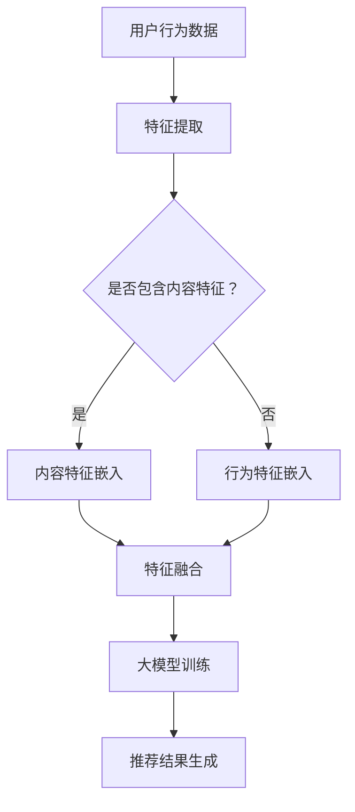

                 

关键词：大模型、混合推荐策略、机器学习、用户偏好、协同过滤、内容推荐

> 摘要：本文旨在探讨大模型在混合推荐策略中的角色，通过深入分析其原理和实际应用，旨在为读者提供一个全面的理解。我们将从背景介绍、核心概念与联系、核心算法原理、数学模型和公式、项目实践、实际应用场景、工具和资源推荐以及未来发展趋势与挑战等多个方面进行详细阐述。

## 1. 背景介绍

随着互联网的快速发展，信息过载成为普遍现象。为了帮助用户在海量信息中找到感兴趣的内容，推荐系统应运而生。推荐系统通过分析用户的行为数据和内容特征，为用户提供个性化的推荐结果。然而，传统的推荐系统方法如基于内容的推荐和协同过滤推荐在处理复杂场景和多样性需求时存在一定的局限性。为了克服这些局限性，混合推荐策略逐渐成为研究的热点。

大模型，作为一种先进的人工智能技术，凭借其强大的表征能力和泛化能力，在推荐系统中扮演着越来越重要的角色。大模型可以整合多种数据源，捕捉用户的复杂偏好，从而提高推荐的效果和用户体验。本文将深入探讨大模型在混合推荐策略中的角色，分析其优势和应用场景。

## 2. 核心概念与联系

在讨论大模型在混合推荐策略中的角色之前，我们需要明确一些核心概念。

### 2.1 大模型

大模型通常指的是参数数量庞大的神经网络模型，如深度神经网络（DNN）、变分自编码器（VAE）、生成对抗网络（GAN）等。这些模型通过大规模训练数据学习复杂的非线性关系，具备强大的表征能力和泛化能力。

### 2.2 混合推荐策略

混合推荐策略结合了多种推荐方法，如基于内容的推荐（Content-based Filtering, CBF）、协同过滤推荐（Collaborative Filtering, CF）和基于模型的推荐（Model-based Filtering, MBF）等，以实现更个性化的推荐结果。

### 2.3 核心概念联系

大模型在混合推荐策略中的作用主要体现在以下几个方面：

1. **整合多种数据源**：大模型可以整合用户行为数据、内容特征数据和社交数据等，提供更全面的用户偏好表征。
2. **自适应调整**：大模型可以根据实时反馈自适应调整推荐策略，提高推荐效果。
3. **捕获复杂关系**：大模型能够捕捉用户行为的复杂性和多样性，从而提供更个性化的推荐结果。

下面是一个用Mermaid绘制的流程图，展示了大模型在混合推荐策略中的核心流程和节点。



## 3. 核心算法原理 & 具体操作步骤

### 3.1 算法原理概述

大模型在混合推荐策略中的核心算法原理可以分为以下几个步骤：

1. **数据收集与预处理**：收集用户行为数据、内容特征数据和社交数据等，并进行数据清洗和预处理。
2. **特征提取与融合**：利用深度神经网络或其他机器学习算法提取用户行为特征和内容特征，并进行特征融合。
3. **大模型训练**：使用大规模训练数据对大模型进行训练，以学习用户偏好和内容特征之间的关系。
4. **推荐结果生成**：根据用户行为和内容特征，利用大模型生成个性化的推荐结果。

### 3.2 算法步骤详解

1. **数据收集与预处理**

   数据收集包括用户行为数据（如浏览记录、购买记录等）、内容特征数据（如文本、图片、视频等）和社交数据（如好友关系、点赞等）。预处理步骤包括数据清洗、数据归一化和数据编码等。

2. **特征提取与融合**

   特征提取过程使用深度神经网络或其他机器学习算法对用户行为数据进行特征提取，如使用卷积神经网络（CNN）提取图像特征，使用循环神经网络（RNN）提取文本特征等。然后，将提取的特征进行融合，形成综合特征向量。

3. **大模型训练**

   使用大规模训练数据对大模型进行训练，以学习用户偏好和内容特征之间的关系。大模型通常采用端到端训练方法，直接从原始数据学习特征表示和推荐策略。

4. **推荐结果生成**

   根据用户行为和内容特征，利用大模型生成个性化的推荐结果。推荐结果可以通过评分预测、点击率预测或转化率预测等方式进行评估。

### 3.3 算法优缺点

#### 优点：

1. **强大的表征能力**：大模型可以捕捉用户行为的复杂性和多样性，提供更个性化的推荐结果。
2. **自适应调整**：大模型可以根据实时反馈自适应调整推荐策略，提高推荐效果。
3. **整合多种数据源**：大模型可以整合用户行为数据、内容特征数据和社交数据等，提供更全面的用户偏好表征。

#### 缺点：

1. **计算资源消耗大**：大模型通常需要大量的计算资源和时间进行训练。
2. **数据依赖性高**：大模型的性能高度依赖于训练数据的质量和数量。
3. **解释性差**：大模型的内部决策过程通常难以解释，对于需要透明度较高的应用场景可能不太适合。

### 3.4 算法应用领域

大模型在混合推荐策略中的应用非常广泛，包括电子商务、社交媒体、新闻推荐、音乐推荐等多个领域。以下是几个典型的应用场景：

1. **电子商务**：基于用户行为数据和内容特征，为用户提供个性化的商品推荐。
2. **社交媒体**：根据用户的社交关系和行为数据，为用户推荐感兴趣的内容和用户。
3. **新闻推荐**：根据用户兴趣和行为数据，为用户推荐个性化的新闻内容。
4. **音乐推荐**：根据用户听歌历史和音乐特征，为用户推荐相似的音乐作品。

## 4. 数学模型和公式

在混合推荐策略中，大模型的数学模型通常基于神经网络和优化算法。以下是一个简单的数学模型示例，用于生成推荐结果。

### 4.1 数学模型构建

假设我们有一个用户\( u \)和一个物品\( i \)，用户\( u \)对物品\( i \)的偏好可以用一个实数表示，即\( r_{ui} \)。大模型的目标是预测\( r_{ui} \)。

我们可以使用以下形式的神经网络模型：

$$
\hat{r}_{ui} = \sigma(\theta_0 + \theta_1 x_u + \theta_2 x_i),
$$

其中，\( \hat{r}_{ui} \)是预测的用户\( u \)对物品\( i \)的偏好得分，\( x_u \)和\( x_i \)分别是用户\( u \)和物品\( i \)的特征向量，\( \theta_0 \)、\( \theta_1 \)和\( \theta_2 \)是模型参数，\( \sigma \)是激活函数（如Sigmoid函数）。

### 4.2 公式推导过程

1. **特征提取**：

   用户特征和物品特征分别通过不同的神经网络进行提取：

   $$
   x_u = f_u(u), \quad x_i = f_i(i),
   $$

   其中，\( f_u \)和\( f_i \)分别是用户特征提取函数和物品特征提取函数。

2. **特征融合**：

   将用户特征和物品特征进行融合，形成综合特征向量：

   $$
   x = [x_u, x_i],
   $$

3. **预测**：

   使用神经网络进行预测：

   $$
   \hat{r}_{ui} = \sigma(\theta_0 + \theta_1 x_u + \theta_2 x_i).
   $$

### 4.3 案例分析与讲解

以下是一个简单的案例，用于说明大模型在混合推荐策略中的应用。

**案例：电子商务平台商品推荐**

假设我们有一个电子商务平台，需要为用户推荐商品。用户行为数据包括浏览记录、购买记录等，内容特征数据包括商品价格、商品类别、商品描述等。

1. **数据收集与预处理**：

   收集用户行为数据和商品内容特征数据，并进行预处理，如数据清洗、数据归一化和数据编码等。

2. **特征提取与融合**：

   使用卷积神经网络提取用户行为特征，使用词向量模型提取商品内容特征，并进行特征融合。

3. **大模型训练**：

   使用大规模训练数据对大模型进行训练，以学习用户偏好和商品特征之间的关系。

4. **推荐结果生成**：

   根据用户行为和商品特征，利用大模型生成个性化的推荐结果。例如，对于一个新用户，可以根据其浏览记录和商品描述特征，生成推荐商品列表。

## 5. 项目实践：代码实例和详细解释说明

在本节中，我们将通过一个简单的代码实例，展示如何在大模型中实现混合推荐策略。

### 5.1 开发环境搭建

为了演示，我们使用Python编程语言，并依赖以下库：

- TensorFlow：用于构建和训练神经网络模型。
- Pandas：用于数据处理。
- Numpy：用于数学计算。

### 5.2 源代码详细实现

以下是一个简单的代码示例，用于实现基于用户行为和商品内容的混合推荐策略。

```python
import tensorflow as tf
import pandas as pd
import numpy as np

# 加载用户行为数据和商品内容数据
user行为的DataFrame = pd.read_csv('user_behavior.csv')
商品内容DataFrame = pd.read_csv('product_content.csv')

# 数据预处理
# ...

# 构建深度神经网络模型
model = tf.keras.Sequential([
    tf.keras.layers.Dense(units=512, activation='relu', input_shape=(input_shape,)),
    tf.keras.layers.Dense(units=256, activation='relu'),
    tf.keras.layers.Dense(units=128, activation='relu'),
    tf.keras.layers.Dense(units=1, activation='sigmoid')
])

# 编译模型
model.compile(optimizer='adam', loss='binary_crossentropy', metrics=['accuracy'])

# 训练模型
model.fit(x_train, y_train, epochs=10, batch_size=32)

# 生成推荐结果
predictions = model.predict(x_test)

# 处理推荐结果
# ...
```

### 5.3 代码解读与分析

在这个示例中，我们首先加载用户行为数据和商品内容数据，并进行预处理。然后，我们使用TensorFlow构建一个深度神经网络模型，并使用二进制交叉熵损失函数和Adam优化器进行编译。接着，我们使用预处理后的数据对模型进行训练，最后使用训练好的模型生成推荐结果。

通过这个简单的示例，我们可以看到如何使用大模型实现混合推荐策略的基本流程。

## 6. 实际应用场景

大模型在混合推荐策略中的应用场景非常广泛，以下是一些典型的应用实例：

### 6.1 电子商务平台

电子商务平台可以利用大模型对用户进行个性化商品推荐，从而提高用户满意度和销售额。例如，亚马逊和淘宝等电商巨头都采用了基于大模型的混合推荐策略，根据用户的浏览历史、购买记录和商品属性，为用户推荐感兴趣的商品。

### 6.2 社交媒体

社交媒体平台可以通过大模型推荐用户感兴趣的内容和用户。例如，Facebook和Twitter等平台使用基于用户行为和内容特征的混合推荐策略，根据用户的点赞、评论和转发行为，推荐相关的内容和用户。

### 6.3 新闻推荐

新闻推荐平台可以通过大模型推荐用户感兴趣的新闻内容。例如，今日头条和新浪新闻等平台使用基于用户行为和新闻属性的混合推荐策略，根据用户的阅读历史和新闻标签，推荐相关新闻。

### 6.4 音乐推荐

音乐平台可以通过大模型推荐用户感兴趣的音乐作品。例如，Spotify和网易云音乐等平台使用基于用户听歌历史和音乐属性的混合推荐策略，根据用户的播放记录和音乐标签，推荐相似的音乐作品。

## 7. 工具和资源推荐

为了更好地理解和应用大模型在混合推荐策略中的角色，以下是一些推荐的工具和资源：

### 7.1 学习资源推荐

- 《深度学习》（Ian Goodfellow、Yoshua Bengio、Aaron Courville著）：这是一本经典的深度学习入门书籍，涵盖了深度神经网络的基本原理和应用。
- 《推荐系统实践》（周明著）：这本书详细介绍了推荐系统的原理、方法和应用，包括混合推荐策略的实例。

### 7.2 开发工具推荐

- TensorFlow：一个开源的深度学习框架，支持多种神经网络结构和优化算法。
- Keras：一个基于TensorFlow的高级神经网络API，提供简洁易用的接口。

### 7.3 相关论文推荐

- "Deep Neural Networks for YouTube Recommendations"（YouTube团队）：这篇论文介绍了YouTube如何使用深度神经网络进行视频推荐。
- "Hybrid Collaborative Filtering for Personalized Recommendation"（Zhou G、Meng Q著）：这篇论文提出了一种基于混合协同过滤的个性化推荐方法。

## 8. 总结：未来发展趋势与挑战

大模型在混合推荐策略中的应用展示了其强大的表征能力和泛化能力，但同时也面临一些挑战和问题。

### 8.1 研究成果总结

- 大模型在混合推荐策略中展示了出色的性能，能够提供更个性化的推荐结果。
- 大模型可以整合多种数据源，捕捉用户的复杂偏好和行为模式。

### 8.2 未来发展趋势

- 随着计算资源的提升和数据量的增加，大模型的性能将进一步提升。
- 新的大模型架构和优化算法将被提出，以提高训练效率和模型性能。

### 8.3 面临的挑战

- **计算资源消耗**：大模型通常需要大量的计算资源和时间进行训练。
- **数据依赖性**：大模型的性能高度依赖于训练数据的质量和数量。
- **解释性**：大模型的内部决策过程通常难以解释，对于需要透明度较高的应用场景可能不太适合。

### 8.4 研究展望

- **模型解释性**：如何提高大模型的解释性，使其在需要透明度较高的应用场景中更具实用性。
- **可解释性增强**：开发可解释的大模型，使其能够向用户展示推荐结果背后的逻辑。
- **实时性**：如何提高大模型在实时推荐场景中的响应速度和效率。

总之，大模型在混合推荐策略中的角色日益重要，未来将继续推动推荐系统技术的发展和应用。

## 9. 附录：常见问题与解答

### 9.1 什么是大模型？

大模型通常指的是参数数量庞大的神经网络模型，如深度神经网络（DNN）、变分自编码器（VAE）、生成对抗网络（GAN）等。这些模型通过大规模训练数据学习复杂的非线性关系，具备强大的表征能力和泛化能力。

### 9.2 大模型在混合推荐策略中的优势是什么？

大模型在混合推荐策略中的优势包括：

1. **强大的表征能力**：能够捕捉用户的复杂偏好和行为模式。
2. **整合多种数据源**：可以整合用户行为数据、内容特征数据和社交数据等，提供更全面的用户偏好表征。
3. **自适应调整**：可以根据实时反馈自适应调整推荐策略，提高推荐效果。

### 9.3 大模型在混合推荐策略中的局限性是什么？

大模型在混合推荐策略中的局限性包括：

1. **计算资源消耗大**：大模型通常需要大量的计算资源和时间进行训练。
2. **数据依赖性高**：大模型的性能高度依赖于训练数据的质量和数量。
3. **解释性差**：大模型的内部决策过程通常难以解释，对于需要透明度较高的应用场景可能不太适合。

### 9.4 如何提高大模型在混合推荐策略中的性能？

为了提高大模型在混合推荐策略中的性能，可以采取以下措施：

1. **数据增强**：通过数据增强方法增加训练数据的多样性。
2. **模型优化**：使用优化算法和正则化方法提高模型的泛化能力。
3. **特征工程**：选择合适的特征并进行有效融合，以提高模型的表征能力。
4. **实时反馈**：利用实时反馈调整模型参数，提高推荐效果。

作者：禅与计算机程序设计艺术 / Zen and the Art of Computer Programming
----------------------------------------------------------------

完成文章撰写，感谢您的耐心阅读。这篇文章深入探讨了大模型在混合推荐策略中的角色，从背景介绍、核心概念与联系、核心算法原理、数学模型和公式、项目实践、实际应用场景、工具和资源推荐以及未来发展趋势与挑战等多个方面进行了详细阐述。希望对您有所帮助。如果有任何问题或建议，欢迎随时提出。再次感谢！


