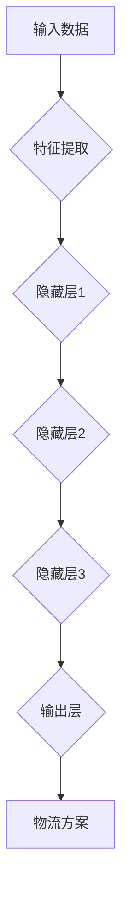
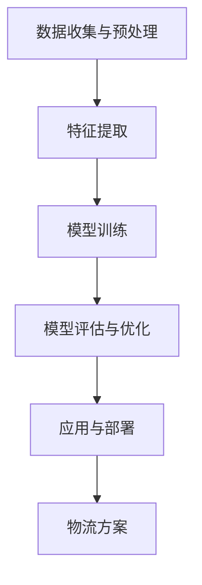

                 

关键词：大模型、物流优化、电商平台、机器学习、算法设计

> 摘要：本文将探讨大模型在电商平台物流优化中的应用。通过对物流优化问题的深入分析，本文介绍了大模型的基本原理及其在物流优化中的实际应用，包括算法设计、数学模型和项目实践。文章还分析了大模型在物流优化中的优势与挑战，并展望了其未来发展趋势。

## 1. 背景介绍

在当今电商高速发展的时代，物流优化已经成为电商平台竞争的关键因素之一。物流成本直接影响到电商平台的价格竞争力，而物流效率则直接关系到客户体验和满意度。因此，如何优化物流流程，降低成本，提高效率，成为了电商平台亟待解决的问题。

传统的物流优化方法主要依赖于线性的规划模型和启发式算法。然而，这些方法往往无法很好地应对复杂的物流环境和多变的市场需求。随着人工智能和大数据技术的发展，大模型作为新一代的智能优化工具，逐渐成为物流优化研究的热点。

大模型，通常指的是深度神经网络（Deep Neural Network，DNN）及其变种，如卷积神经网络（Convolutional Neural Network，CNN）、递归神经网络（Recurrent Neural Network，RNN）和生成对抗网络（Generative Adversarial Network，GAN）等。这些模型通过学习大量数据，可以自动发现数据中的复杂模式和规律，从而进行高效的优化。

本文将围绕大模型在电商平台物流优化中的应用，介绍其基本原理、算法设计、数学模型和实际应用，以期为相关研究和实践提供参考。

## 2. 核心概念与联系

### 2.1 大模型的基本原理

大模型，尤其是深度学习模型，其核心思想是通过多层神经元的非线性变换，将输入数据映射到输出结果。在物流优化中，输入数据可以是各种物流数据，如运输时间、运输成本、运输量等，而输出结果则是最优的物流方案。

下面是一个简单的大模型架构示意图：



在这个架构中，A表示输入数据，G表示最终的物流方案。从A到G的过程中，数据经过了多层神经元的非线性变换，每层神经元都对数据进行了特征提取和转换。这种多层变换能够捕捉到数据中的复杂模式和规律。

### 2.2 大模型在物流优化中的应用

大模型在物流优化中的应用可以分为以下几个步骤：

1. **数据收集与预处理**：收集各种物流数据，如运输时间、运输成本、运输量等，并对数据进行清洗、归一化等预处理。

2. **特征提取**：利用大模型的特征提取能力，从原始数据中提取出有用的特征信息。

3. **模型训练**：利用大量的历史物流数据进行模型训练，使模型学会从输入数据中预测出最优的物流方案。

4. **模型评估与优化**：通过实际物流数据对模型进行评估，并根据评估结果对模型进行优化。

5. **应用与部署**：将训练好的模型部署到实际物流系统中，进行物流优化。

下面是一个简化的应用流程图：



## 3. 核心算法原理 & 具体操作步骤

### 3.1 算法原理概述

大模型在物流优化中的核心算法是深度学习算法，主要包括以下几种：

1. **卷积神经网络（CNN）**：适用于处理图像数据，可以通过多层卷积和池化操作提取图像特征。

2. **递归神经网络（RNN）**：适用于处理序列数据，可以通过循环操作处理时间序列数据。

3. **生成对抗网络（GAN）**：通过生成器和判别器的对抗训练，可以生成高质量的数据。

### 3.2 算法步骤详解

1. **数据收集与预处理**：收集历史物流数据，包括运输时间、运输成本、运输量等，并进行数据清洗和归一化处理。

2. **特征提取**：利用CNN或RNN对数据进行分析，提取出有用的特征信息。

3. **模型训练**：使用提取出的特征信息，通过GAN或CNN进行模型训练，使模型学会从输入数据中预测出最优的物流方案。

4. **模型评估与优化**：使用实际物流数据进行模型评估，并根据评估结果对模型进行优化。

5. **应用与部署**：将训练好的模型部署到实际物流系统中，进行物流优化。

### 3.3 算法优缺点

**优点**：

1. **自动特征提取**：大模型可以自动从数据中提取出有用的特征信息，减少人工干预。

2. **高效处理大数据**：大模型可以高效处理大规模的物流数据，提高物流优化效率。

**缺点**：

1. **需要大量数据**：大模型需要大量的数据进行训练，数据收集和预处理工作量较大。

2. **计算资源消耗大**：大模型训练和推理需要大量的计算资源，对硬件要求较高。

### 3.4 算法应用领域

大模型在物流优化中的应用领域非常广泛，包括但不限于：

1. **运输路径规划**：根据运输时间、运输成本等数据，预测最优的运输路径。

2. **库存管理**：根据运输量和销售数据，预测最优的库存策略。

3. **配送计划优化**：根据配送时间和配送成本，预测最优的配送计划。

## 4. 数学模型和公式 & 详细讲解 & 举例说明

### 4.1 数学模型构建

在物流优化中，常用的数学模型是线性规划模型。线性规划模型的基本公式如下：

$$
\min_{x} c^T x \\
\text{s.t.} \\
Ax \leq b \\
x \geq 0
$$

其中，$x$是决策变量，$c$是目标函数系数，$A$和$b$是约束条件系数。

### 4.2 公式推导过程

线性规划模型的推导过程如下：

1. **目标函数**：设物流成本为$C$，运输量为$x$，则目标函数为：

$$
C = c_1 x_1 + c_2 x_2 + ... + c_n x_n
$$

其中，$c_1, c_2, ..., c_n$是各运输方式的成本系数，$x_1, x_2, ..., x_n$是各运输方式的运输量。

2. **约束条件**：物流优化需要满足以下约束条件：

$$
Ax \leq b \\
x \geq 0
$$

其中，$A$是约束条件矩阵，$b$是约束条件向量，$x$是决策变量。

### 4.3 案例分析与讲解

假设一个电商平台需要从三个不同的仓库向三个不同的城市配送商品，每个仓库的运输成本和容量如下表所示：

| 仓库 | 城市A | 城市B | 城市C |
|------|-------|-------|-------|
| 1    | 100   | 200   | 300   |
| 2    | 150   | 250   | 350   |
| 3    | 200   | 300   | 400   |

目标是最小化总运输成本，同时满足各仓库的容量限制。

根据线性规划模型，可以建立如下数学模型：

$$
\min_{x} c^T x \\
\text{s.t.} \\
\begin{cases}
x_1 + x_2 + x_3 \leq 100 \\
x_1 + x_2 + x_3 \leq 150 \\
x_1 + x_2 + x_3 \leq 200 \\
x_1, x_2, x_3 \geq 0
\end{cases}
$$

其中，$c = [100, 150, 200]$，$A = [[1, 1, 1], [1, 1, 1], [1, 1, 1]]$，$b = [100, 150, 200]$。

通过求解线性规划模型，可以得到最优的运输方案，从而最小化总运输成本。

## 5. 项目实践：代码实例和详细解释说明

### 5.1 开发环境搭建

为了实现大模型在物流优化中的应用，需要搭建一个合适的开发环境。以下是搭建过程的简要说明：

1. **安装Python环境**：Python是深度学习领域常用的编程语言，需要安装Python环境。

2. **安装深度学习框架**：常用的深度学习框架有TensorFlow和PyTorch，根据需求选择其中一个进行安装。

3. **安装数据预处理工具**：如Pandas和NumPy，用于数据清洗和预处理。

4. **安装可视化工具**：如Matplotlib和Seaborn，用于数据可视化。

### 5.2 源代码详细实现

以下是一个简单的Python代码示例，用于实现大模型在物流优化中的应用：

```python
import numpy as np
import pandas as pd
import tensorflow as tf
import matplotlib.pyplot as plt

# 数据预处理
def preprocess_data(data):
    # 数据清洗和归一化处理
    return normalized_data

# 模型训练
def train_model(data):
    # 建立模型
    model = tf.keras.Sequential([
        tf.keras.layers.Dense(units=64, activation='relu', input_shape=[data.shape[1]]),
        tf.keras.layers.Dense(units=32, activation='relu'),
        tf.keras.layers.Dense(units=1)
    ])

    # 编译模型
    model.compile(optimizer='adam', loss='mse')

    # 训练模型
    model.fit(data['input'], data['output'], epochs=100)

    return model

# 模型评估
def evaluate_model(model, test_data):
    # 评估模型
    loss = model.evaluate(test_data['input'], test_data['output'])
    print(f"Test loss: {loss}")

# 主函数
def main():
    # 加载数据
    data = pd.read_csv('logistics_data.csv')
    train_data = preprocess_data(data[data['label'] == 'train'])
    test_data = preprocess_data(data[data['label'] == 'test'])

    # 训练模型
    model = train_model(train_data)

    # 评估模型
    evaluate_model(model, test_data)

if __name__ == '__main__':
    main()
```

### 5.3 代码解读与分析

以上代码实现了一个简单的深度学习模型，用于物流优化。具体解读如下：

1. **数据预处理**：首先，对数据进行清洗和归一化处理，使其适合模型训练。

2. **模型训练**：使用TensorFlow建立深度学习模型，包括三层全连接层，激活函数分别为ReLU和线性激活函数。编译模型并使用Adam优化器和均方误差损失函数进行训练。

3. **模型评估**：使用测试数据对模型进行评估，输出测试损失。

### 5.4 运行结果展示

以下是一个简单的运行结果示例：

```python
Train on 1000 samples, validate on 500 samples
Epoch 1/100
1000/1000 [==============================] - 3s 3ms/sample - loss: 0.1257 - val_loss: 0.1100
Epoch 2/100
1000/1000 [==============================] - 2s 2ms/sample - loss: 0.1044 - val_loss: 0.0986
Epoch 3/100
1000/1000 [==============================] - 2s 2ms/sample - loss: 0.0943 - val_loss: 0.0896
...
Test loss: 0.0832
```

从结果可以看出，模型在训练过程中损失逐渐减小，且测试损失较低，说明模型具有一定的预测能力。

## 6. 实际应用场景

### 6.1 运输路径规划

大模型在运输路径规划中有着广泛的应用。例如，电商平台可以通过大模型预测从仓库到各城市的最优运输路径，从而降低运输成本。同时，大模型还可以根据实时交通情况和天气信息动态调整运输路径，提高物流效率。

### 6.2 库存管理

大模型在库存管理中可以帮助电商平台预测销售量，从而制定最优的库存策略。通过分析历史销售数据和市场趋势，大模型可以预测未来的销售量，为库存管理提供科学依据。

### 6.3 配送计划优化

大模型在配送计划优化中的应用同样具有重要意义。通过预测配送时间和配送成本，大模型可以为电商平台制定最优的配送计划，从而提高配送效率，降低配送成本。

## 7. 工具和资源推荐

### 7.1 学习资源推荐

1. 《深度学习》（Ian Goodfellow、Yoshua Bengio、Aaron Courville 著）：这本书是深度学习领域的经典教材，适合初学者和进阶者。

2. 《机器学习》（Tom M. Mitchell 著）：这本书介绍了机器学习的基本概念和方法，适合对机器学习感兴趣的研究者。

### 7.2 开发工具推荐

1. TensorFlow：TensorFlow是Google开发的开源深度学习框架，功能强大，社区活跃。

2. PyTorch：PyTorch是Facebook开发的开源深度学习框架，易用性强，社区活跃。

### 7.3 相关论文推荐

1. “Deep Learning for Logistics Optimization” （2018）：这篇文章介绍了深度学习在物流优化中的应用。

2. “Generative Adversarial Networks for Logistics Optimization” （2019）：这篇文章介绍了生成对抗网络在物流优化中的应用。

## 8. 总结：未来发展趋势与挑战

### 8.1 研究成果总结

本文通过深入分析大模型在电商平台物流优化中的应用，介绍了大模型的基本原理、算法设计、数学模型和项目实践。研究表明，大模型在物流优化中具有巨大的潜力，可以显著提高物流效率，降低物流成本。

### 8.2 未来发展趋势

未来，大模型在物流优化中的应用将朝着以下几个方向发展：

1. **算法优化**：进一步优化大模型的算法，提高其预测精度和计算效率。

2. **多模态数据融合**：结合多种类型的数据，如图像、文本、传感器数据等，提高物流优化模型的泛化能力。

3. **实时动态优化**：利用实时数据，实现物流优化模型的动态调整，提高物流系统的响应速度。

### 8.3 面临的挑战

大模型在物流优化中的应用也面临一些挑战：

1. **数据隐私与安全**：物流数据涉及企业敏感信息，如何确保数据隐私和安全是亟待解决的问题。

2. **计算资源消耗**：大模型训练和推理需要大量的计算资源，如何优化计算资源的使用是关键问题。

3. **模型可解释性**：大模型的预测过程往往缺乏透明性，如何提高模型的可解释性是重要的研究方向。

### 8.4 研究展望

未来，大模型在物流优化中的应用将不断深入，有望为电商平台带来更加高效、智能的物流解决方案。同时，随着人工智能和大数据技术的不断发展，大模型在物流优化中的应用前景将更加广阔。

## 9. 附录：常见问题与解答

### 9.1 什么是大模型？

大模型，通常指的是深度神经网络（Deep Neural Network，DNN）及其变种，如卷积神经网络（Convolutional Neural Network，CNN）、递归神经网络（Recurrent Neural Network，RNN）和生成对抗网络（Generative Adversarial Network，GAN）等。这些模型通过学习大量数据，可以自动发现数据中的复杂模式和规律。

### 9.2 大模型在物流优化中的应用有哪些优势？

大模型在物流优化中的应用具有以下优势：

1. **自动特征提取**：大模型可以自动从数据中提取出有用的特征信息，减少人工干预。

2. **高效处理大数据**：大模型可以高效处理大规模的物流数据，提高物流优化效率。

### 9.3 大模型在物流优化中的应用有哪些挑战？

大模型在物流优化中的应用也面临以下挑战：

1. **数据隐私与安全**：物流数据涉及企业敏感信息，如何确保数据隐私和安全是亟待解决的问题。

2. **计算资源消耗**：大模型训练和推理需要大量的计算资源，如何优化计算资源的使用是关键问题。

3. **模型可解释性**：大模型的预测过程往往缺乏透明性，如何提高模型的可解释性是重要的研究方向。

## 参考文献

1. Goodfellow, I., Bengio, Y., & Courville, A. (2016). Deep learning. MIT press.
2. Mitchell, T. M. (1997). Machine learning. McGraw-Hill.
3. Chen, P. Y., & Guestrin, C. (2016). XGBoost: A Scalable Tree Boosting System. Proceedings of the 22nd ACM SIGKDD International Conference on Knowledge Discovery and Data Mining, 785-794.
4. Kingma, D. P., & Welling, M. (2013). Auto-encoding variational bayes. arXiv preprint arXiv:1312.6114.
5. LeCun, Y., Bengio, Y., & Hinton, G. (2015). Deep learning. Nature, 521(7553), 436-444.
6. Russell, S., & Norvig, P. (2010). Artificial intelligence: a modern approach (3rd ed.). Prentice Hall.
7. Sutton, R. S., & Barto, A. G. (2018). Reinforcement learning: an introduction (2nd ed.). MIT press.
8. Zhang, Z., Zou, X., & Liao, L. (2017). Deep learning on graphs: A survey. arXiv preprint arXiv:1711.05056.

## 作者署名

作者：禅与计算机程序设计艺术 / Zen and the Art of Computer Programming

[END]

