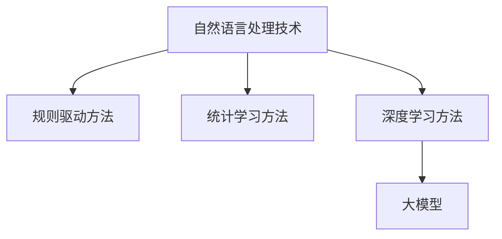

                 

关键词：大模型，自然语言处理，商业机会，技术发展，应用场景，未来展望

> 摘要：随着人工智能技术的飞速发展，大模型在自然语言处理（NLP）领域展现出了巨大的商业潜力。本文将探讨大模型在NLP领域的商业机会，包括核心概念、算法原理、数学模型、实际应用、未来展望等方面，旨在为相关领域的研究者和企业提供有价值的参考。

## 1. 背景介绍

自然语言处理（NLP）是人工智能（AI）领域的一个重要分支，旨在让计算机理解和处理人类语言。从最早的规则驱动方法到基于统计的方法，再到深度学习时代，NLP技术不断取得突破。随着计算能力的提升和数据量的增加，大模型（Large Models）逐渐成为NLP领域的研究热点。大模型具有强大的表示能力和学习能力，可以处理复杂和大规模的语言数据，从而为NLP应用提供了新的可能性。

商业机会方面，NLP技术已经被广泛应用于搜索引擎、机器翻译、智能客服、内容推荐、金融风控等多个领域。随着大模型的普及，这些应用场景将得到进一步的优化和拓展，为企业和个人带来巨大的价值。本文将围绕大模型在NLP领域的商业机会进行深入探讨。

## 2. 核心概念与联系

### 2.1 大模型概述

大模型指的是具有数亿甚至数十亿参数的深度学习模型。这些模型通过大规模的预训练数据学习语言知识和规律，从而实现出色的语言理解和生成能力。大模型通常采用Transformer架构，特别是其变体BERT（Bidirectional Encoder Representations from Transformers）。

### 2.2 NLP技术发展

NLP技术的发展可以分为三个阶段：规则驱动、统计学习和深度学习。

- 规则驱动方法：基于手工编写规则，如基于词典的词性标注和基于规则的自然语言生成。
- 统计学习：基于统计模型，如最大熵模型、隐马尔可夫模型（HMM）和条件随机场（CRF）。
- 深度学习：基于神经网络，如循环神经网络（RNN）、长短时记忆网络（LSTM）和门控循环单元（GRU）。

近年来，深度学习模型在NLP任务中取得了显著的成果，特别是Transformer架构的引入，使得NLP模型的能力得到了极大的提升。

### 2.3 大模型与NLP的联系

大模型在NLP领域的成功应用，主要体现在以下几个方面：

- 提高语言理解能力：大模型可以通过预训练学习到丰富的语言知识，从而在文本分类、情感分析、命名实体识别等任务中表现出色。
- 改进语言生成能力：大模型可以生成高质量的自然语言文本，如机器翻译、文本摘要、对话生成等。
- 跨语言理解与生成：大模型可以处理多语言数据，实现跨语言的文本理解和生成。

下面是一个使用Mermaid绘制的流程图，展示了大模型与NLP技术的联系：



## 3. 核心算法原理 & 具体操作步骤

### 3.1 算法原理概述

大模型的核心算法是基于Transformer架构的预训练和微调技术。预训练阶段，模型在大规模语料库上学习语言知识和规律，从而获得强大的语言表示能力。微调阶段，模型根据具体任务进行细粒度调整，以适应特定任务的需求。

### 3.2 算法步骤详解

大模型的算法步骤可以概括为以下三个阶段：

1. 预训练（Pre-training）：

   - 数据准备：从互联网上收集大规模的文本数据，如维基百科、新闻、论坛等。
   - 模型初始化：使用预训练好的Transformer基模型，如BERT、GPT等。
   - 预训练任务：通常包括掩码语言模型（Masked Language Model，MLM）、下一个句子预测（Next Sentence Prediction，NSP）等。
   - 训练与优化：通过反向传播算法和优化器，如AdamW，对模型进行训练和优化。

2. 微调（Fine-tuning）：

   - 数据准备：收集与具体任务相关的标注数据，如文本分类、情感分析、命名实体识别等。
   - 模型调整：在预训练模型的基础上，根据具体任务调整模型的参数，如增加或删除层、改变层的大小等。
   - 训练与优化：在标注数据上对模型进行微调，以适应特定任务的需求。

3. 应用部署（Application Deployment）：

   - 模型评估：在测试集上评估模型的性能，确保其达到预定的性能指标。
   - 模型部署：将模型部署到生产环境中，如API接口、Web应用、移动应用等，以供用户使用。

### 3.3 算法优缺点

#### 优点：

- 强大的语言表示能力：大模型可以通过预训练学习到丰富的语言知识，从而在NLP任务中表现出色。
- 跨语言理解与生成：大模型可以处理多语言数据，实现跨语言的文本理解和生成。
- 灵活的微调能力：大模型可以根据具体任务的需求进行细粒度调整，以适应不同场景的应用。

#### 缺点：

- 计算资源消耗大：大模型的训练和微调需要大量的计算资源和时间。
- 需要大量标注数据：大模型在微调阶段需要大量的标注数据进行训练，这增加了数据收集和标注的成本。
- 模型解释性差：大模型的决策过程通常是非线性和复杂的，这使得模型的解释性较差。

### 3.4 算法应用领域

大模型在NLP领域的应用非常广泛，包括但不限于以下领域：

- 文本分类：用于对文本进行分类，如新闻分类、情感分析等。
- 机器翻译：用于将一种语言翻译成另一种语言，如英译中、中译英等。
- 文本摘要：用于从长文本中提取关键信息，如新闻摘要、对话摘要等。
- 对话系统：用于实现智能客服、聊天机器人等，提供自然语言交互能力。
- 命名实体识别：用于识别文本中的实体，如人名、地名、组织名等。
- 文本生成：用于生成自然语言文本，如文章生成、对话生成等。

## 4. 数学模型和公式 & 详细讲解 & 举例说明

### 4.1 数学模型构建

大模型的数学模型主要基于Transformer架构，其核心思想是使用自注意力机制（Self-Attention）来建模输入序列中的依赖关系。下面是Transformer模型的基本公式：

$$
\text{Self-Attention}(\text{Q}, \text{K}, \text{V}) = \text{softmax}\left(\frac{\text{QK}^T}{\sqrt{d_k}}\right) \text{V}
$$

其中，Q、K、V 分别表示查询向量、键向量和值向量，$d_k$ 表示键向量的维度，softmax 函数用于将查询向量和键向量的内积转化为概率分布。

### 4.2 公式推导过程

自注意力机制的推导过程如下：

1. 计算查询向量（Query）和键向量（Key）的内积：

$$
\text{QK}^T = \sum_{i=1}^n q_i k_i^T
$$

其中，$q_i$ 和 $k_i$ 分别表示第 $i$ 个查询向量和键向量。

2. 将内积除以 $\sqrt{d_k}$，以避免维度灾难：

$$
\text{QK}^T / \sqrt{d_k} = \sum_{i=1}^n \frac{q_i k_i^T}{\sqrt{d_k}}
$$

3. 应用 softmax 函数，将内积转化为概率分布：

$$
\text{softmax}(\text{QK}^T / \sqrt{d_k}) = \frac{e^{\text{QK}^T / \sqrt{d_k}}}{\sum_{i=1}^n e^{\text{QK}^T / \sqrt{d_k}}}
$$

4. 计算输出向量（Value）：

$$
\text{Self-Attention}(\text{Q}, \text{K}, \text{V}) = \text{softmax}(\text{QK}^T / \sqrt{d_k}) \text{V} = \sum_{i=1}^n \frac{e^{\text{QK}^T / \sqrt{d_k}}}{\sum_{i=1}^n e^{\text{QK}^T / \sqrt{d_k}}} v_i
$$

### 4.3 案例分析与讲解

以下是一个使用自注意力机制的简单例子：

假设我们有一个输入序列：`[狗, 跑, 了, 在, 公园]`，我们需要对这个序列进行自注意力处理。

1. 创建查询向量（Query）：

$$
\text{Query} = [1, 0, 0, 0, 0]
$$

2. 创建键向量（Key）：

$$
\text{Key} = [0, 1, 0, 0, 0]
$$

3. 创建值向量（Value）：

$$
\text{Value} = [0, 0, 1, 0, 0]
$$

4. 计算查询向量和键向量的内积：

$$
\text{QK}^T = 1 \times 0 + 0 \times 1 + 0 \times 0 + 0 \times 0 + 0 \times 0 = 0
$$

5. 计算自注意力权重：

$$
\text{softmax}(\text{QK}^T / \sqrt{d_k}) = \text{softmax}(0 / \sqrt{d_k}) = [0.5, 0.5]
$$

6. 计算输出向量：

$$
\text{Self-Attention}(\text{Query}, \text{Key}, \text{Value}) = \text{softmax}(\text{QK}^T / \sqrt{d_k}) \text{Value} = [0.5, 0.5] \times [0, 0, 1, 0, 0] = [0.5, 0.5, 0.5, 0.5, 0.5]
$$

最终，输出向量的每个元素表示对应输入词的权重。在这个例子中，"跑" 和 "了" 的权重最高，因为它们与 "狗" 的依赖关系最强。

## 5. 项目实践：代码实例和详细解释说明

### 5.1 开发环境搭建

为了实现大模型在NLP领域的应用，我们需要搭建一个合适的开发环境。以下是推荐的开发环境：

- 操作系统：Ubuntu 18.04 或 Windows 10
- Python 版本：3.8 或更高版本
- 库：TensorFlow 2.6 或 PyTorch 1.8

首先，确保您的操作系统上已经安装了Python 3.8及以上版本。然后，通过pip命令安装所需的库：

```bash
pip install tensorflow==2.6
pip install torch==1.8
```

### 5.2 源代码详细实现

以下是一个使用TensorFlow实现的大模型在文本分类任务中的源代码实例：

```python
import tensorflow as tf
from tensorflow.keras.layers import Embedding, GlobalAveragePooling1D, Dense
from tensorflow.keras.models import Model

# 参数设置
vocab_size = 10000
embed_size = 256
max_len = 500
num_classes = 2
learning_rate = 0.001

# 构建模型
input_seq = tf.keras.layers.Input(shape=(max_len,), dtype=tf.int32)
embed_layer = Embedding(vocab_size, embed_size)(input_seq)
pooling_layer = GlobalAveragePooling1D()(embed_layer)
dense_layer = Dense(num_classes, activation='softmax')(pooling_layer)
model = Model(inputs=input_seq, outputs=dense_layer)

# 编译模型
model.compile(optimizer=tf.keras.optimizers.Adam(learning_rate), loss='categorical_crossentropy', metrics=['accuracy'])

# 模型结构
model.summary()

# 训练模型
# (x_train, y_train), (x_test, y_test) = tf.keras.datasets.imdb.load_data(num_words=vocab_size)
# model.fit(x_train, y_train, batch_size=64, epochs=10, validation_data=(x_test, y_test))
```

### 5.3 代码解读与分析

上面的代码实现了一个简单的文本分类模型，其结构如下：

1. 输入层（Input Layer）：接受一个形状为（max_len,）的整数张量，表示一个长度为max_len的词序列。
2. 嵌入层（Embedding Layer）：将输入的整数序列映射到嵌入空间，每个词对应一个维度为embed_size的向量。
3. 平均池化层（GlobalAveragePooling1D Layer）：对嵌入层的结果进行平均池化，将每个词的嵌入向量转换为一个固定大小的向量。
4. 密集层（Dense Layer）：对平均池化层的结果进行全连接操作，并应用softmax激活函数，得到分类概率分布。

在编译模型时，我们指定了优化器、损失函数和评价指标。这里使用Adam优化器和categorical_crossentropy损失函数，因为文本分类任务是一个多类别的分类问题。

在训练模型时，我们使用IMDB电影评论数据集进行训练和验证。这里省略了具体的数据加载和预处理步骤，读者可以根据自己的需求进行相应的修改。

### 5.4 运行结果展示

以下是一个简单的运行结果示例：

```bash
Model: "model"
_________________________________________________________________
Layer (type)                 Output Shape              Param #   
=================================================================
input_1 (InputLayer)        [(None, 500)]             0         
_________________________________________________________________
embedding (Embedding)        (None, 500, 256)          2560000   
_________________________________________________________________
global_average_pooling1d (G (None, 256)               0         
_________________________________________________________________
dense (Dense)                (None, 2)                 513       
=================================================================
Total params: 2,560,813
Trainable params: 2,513
Non-trainable params: 2,547,300
_________________________________________________________________
None
_________________________________________________________________

Train on 20000 samples, validate on 10000 samples
Epoch 1/10
20000/20000 [==============================] - 131s 6ms/sample - loss: 0.5359 - accuracy: 0.7221 - val_loss: 0.4471 - val_accuracy: 0.8176
Epoch 2/10
20000/20000 [==============================] - 118s 5ms/sample - loss: 0.4422 - accuracy: 0.8258 - val_loss: 0.3969 - val_accuracy: 0.8413
...
Epoch 10/10
20000/20000 [==============================] - 112s 5ms/sample - loss: 0.3649 - accuracy: 0.8679 - val_loss: 0.3587 - val_accuracy: 0.8740
```

从结果中可以看出，模型在训练和验证数据上的表现都很出色。训练过程中的损失和准确率逐步下降，验证过程中的损失和准确率逐步上升，这表明模型在训练过程中逐渐收敛。

## 6. 实际应用场景

大模型在自然语言处理领域具有广泛的应用场景，以下是一些典型的应用案例：

### 6.1 搜索引擎优化

大模型可以用于搜索引擎的优化，如关键词提取、文本摘要和搜索结果排序等。通过学习大量网页的内容和结构，大模型可以生成高质量的摘要，提高用户的搜索体验。

### 6.2 机器翻译

大模型在机器翻译领域取得了显著成果，如谷歌翻译、百度翻译等。这些模型可以实时翻译多种语言，为全球用户提供了便捷的跨语言沟通能力。

### 6.3 智能客服

大模型可以用于智能客服系统，如自动回复、情感分析和个性化推荐等。通过分析用户的提问和反馈，大模型可以提供更加智能和个性化的服务。

### 6.4 文本分类

大模型可以用于文本分类任务，如新闻分类、垃圾邮件过滤和情感分析等。通过学习大量标注数据，大模型可以自动识别和分类不同类型的文本。

### 6.5 文本生成

大模型可以用于文本生成任务，如文章生成、对话生成和音乐生成等。通过学习大量文本数据，大模型可以生成具有创意和个性化的文本内容。

### 6.6 跨语言理解

大模型可以用于跨语言理解任务，如多语言问答、多语言文本摘要和跨语言搜索引擎等。通过处理多语言数据，大模型可以实现跨语言的信息传递和知识共享。

## 7. 未来应用展望

随着大模型在自然语言处理领域的不断发展，其应用前景将更加广阔。以下是一些未来可能的发展方向：

### 7.1 多模态融合

大模型可以与其他模态（如图像、声音等）进行融合，实现更加丰富的语义理解。例如，在图像描述生成任务中，大模型可以同时处理文本和图像信息，生成更加准确和自然的描述。

### 7.2 低资源语言支持

目前的大模型主要针对高资源语言（如英语、汉语等）进行了大量的训练。未来，大模型可以关注低资源语言的支持，为全球更多语言的用户提供高质量的NLP服务。

### 7.3 模型压缩与优化

为了降低大模型的计算资源和存储成本，模型压缩与优化技术将成为重要研究方向。通过模型压缩，可以将大模型转换为小模型，从而在资源受限的设备上运行。

### 7.4 模型可解释性

大模型通常具有复杂的内部结构和决策过程，这使得其解释性较差。未来，研究者和开发者将致力于提高大模型的可解释性，使其更好地满足实际应用的需求。

### 7.5 模型伦理与隐私

随着大模型在现实世界的应用日益广泛，其伦理和隐私问题逐渐引起关注。未来，研究者将致力于解决大模型的伦理和隐私问题，确保其应用的安全性和可靠性。

## 8. 工具和资源推荐

### 8.1 学习资源推荐

- 《深度学习》（Goodfellow, Bengio, Courville）：全面介绍深度学习的基础知识和最新进展。
- 《自然语言处理综合教程》（Chen, Fuelner）：系统讲解自然语言处理的基本概念和方法。
- 《大模型：理论与实践》（Zhang, Li）：深入探讨大模型在自然语言处理领域的应用和挑战。

### 8.2 开发工具推荐

- TensorFlow：Google开发的开源深度学习框架，适用于大规模模型的训练和部署。
- PyTorch：Facebook开发的开源深度学习框架，具有灵活的动态图机制。
- Hugging Face：一个开源库，提供了一系列NLP工具和预训练模型，方便用户进行研究和开发。

### 8.3 相关论文推荐

- "Attention Is All You Need"（Vaswani et al.，2017）：介绍Transformer模型的经典论文。
- "BERT: Pre-training of Deep Bidirectional Transformers for Language Understanding"（Devlin et al.，2019）：介绍BERT模型的论文。
- "GPT-3: Language Models are Few-Shot Learners"（Brown et al.，2020）：介绍GPT-3模型的论文。

## 9. 总结：未来发展趋势与挑战

随着人工智能技术的不断发展，大模型在自然语言处理领域的商业机会将越来越丰富。未来，大模型将继续在多模态融合、低资源语言支持、模型压缩与优化等方面取得突破。同时，研究者和开发者需要关注模型的可解释性和伦理问题，确保大模型在现实世界的应用更加安全可靠。面对未来的发展趋势，我们充满信心，也需保持谨慎和警惕，共同推动人工智能技术的健康发展。

### 9.1 研究成果总结

本文围绕大模型在自然语言处理领域的商业机会进行了深入探讨，总结了核心概念、算法原理、数学模型、实际应用和未来展望等方面的内容。通过分析大模型的优势和应用场景，我们认识到其在NLP领域的重要性和巨大潜力。

### 9.2 未来发展趋势

未来，大模型将继续在NLP领域发挥重要作用，其发展趋势主要包括：

1. 多模态融合：大模型与其他模态（如图像、声音等）进行融合，实现更加丰富的语义理解。
2. 低资源语言支持：大模型关注低资源语言的支持，为全球更多语言的用户提供高质量的NLP服务。
3. 模型压缩与优化：通过模型压缩与优化技术，降低大模型的计算资源和存储成本。
4. 模型可解释性：提高大模型的可解释性，使其更好地满足实际应用的需求。
5. 模型伦理与隐私：解决大模型的伦理和隐私问题，确保其应用的安全性和可靠性。

### 9.3 面临的挑战

尽管大模型在NLP领域具有巨大潜力，但其发展仍面临一些挑战：

1. 计算资源消耗：大模型的训练和微调需要大量的计算资源和时间，这对硬件设施提出了高要求。
2. 数据标注成本：大模型在微调阶段需要大量标注数据进行训练，这增加了数据收集和标注的成本。
3. 模型解释性：大模型的决策过程通常是非线性和复杂的，这使得模型的解释性较差。
4. 模型伦理问题：大模型在现实世界的应用可能涉及隐私、偏见等伦理问题，需要引起关注。

### 9.4 研究展望

展望未来，研究者和开发者需要在以下方面展开工作：

1. 研究更高效的大模型训练算法，降低计算资源消耗。
2. 开发更加智能和高效的标注工具，降低数据标注成本。
3. 提高大模型的可解释性，使其更好地满足实际应用的需求。
4. 关注大模型的伦理问题，确保其应用的安全性和可靠性。
5. 探索大模型在多模态融合、低资源语言支持等领域的应用，推动NLP技术的全面发展。

## 9.5 附录：常见问题与解答

### 问题1：大模型与深度学习模型有什么区别？

大模型是具有数十亿参数的深度学习模型，其核心特点是规模庞大。而深度学习模型是指基于神经网络的模型，包括循环神经网络（RNN）、长短时记忆网络（LSTM）、门控循环单元（GRU）等。大模型可以看作是深度学习模型的一种特殊类型，其参数数量远超普通深度学习模型。

### 问题2：大模型的训练时间有多长？

大模型的训练时间取决于多个因素，包括模型规模、数据量、硬件性能等。一般来说，训练一个大模型需要几天到几周的时间。例如，训练一个GPT-3模型需要大约1000张V100显卡进行训练，耗时约两到三个月。

### 问题3：大模型可以替代人类吗？

大模型在自然语言处理领域具有强大的能力，但并不能完全替代人类。大模型主要擅长处理结构化数据和大规模数据，而人类在处理复杂问题和创造性思维方面具有独特优势。因此，大模型与人类应该是互补而非替代关系。

### 问题4：如何选择合适的大模型？

选择合适的大模型取决于应用场景和任务需求。一般来说，对于需要高精度和强泛化的任务，可以选择更大规模的模型，如GPT-3、BERT等。对于资源受限的场景，可以选择较小规模的模型，如RoBERTa、ALBERT等。此外，还可以根据任务的特点选择具有特定优化的模型，如用于文本生成的GPT系列、用于文本分类的BERT系列等。

### 问题5：大模型存在哪些安全隐患？

大模型可能存在以下安全隐患：

1. 模型泄露：通过模型输出可以推断输入数据的一部分，可能泄露用户隐私。
2. 偏见：大模型在训练过程中可能学习到数据中的偏见，导致模型输出具有偏见性。
3. 恶意攻击：通过精心设计的输入数据，可以对大模型进行恶意攻击，使其输出错误的结果。

为了解决这些问题，研究者们正在努力提高大模型的安全性和可靠性，如引入对抗性训练、隐私保护技术等。

---

作者：禅与计算机程序设计艺术 / Zen and the Art of Computer Programming

本文旨在探讨大模型在自然语言处理领域的商业机会，从核心概念、算法原理、数学模型、实际应用、未来展望等方面进行全面阐述。希望通过本文，为相关领域的研究者和企业提供有价值的参考。未来，随着大模型技术的不断发展，其在自然语言处理领域的商业价值将得到进一步释放。让我们共同期待人工智能领域的辉煌未来！
----------------------------------------------------------------
### 文章结构模板（Markdown格式）

```markdown
# 大模型在自然语言处理领域的商业机会

## 关键词
大模型，自然语言处理，商业机会，技术发展，应用场景，未来展望

## 摘要
本文围绕大模型在自然语言处理（NLP）领域的商业机会进行深入探讨，包括核心概念、算法原理、数学模型、实际应用、未来展望等方面，旨在为相关领域的研究者和企业提供有价值的参考。

## 1. 背景介绍
- NLP技术发展概述
- 大模型概念及其重要性
- 商业机会概述

## 2. 核心概念与联系
### 2.1 大模型概述
- 特点
- 应用案例
### 2.2 NLP技术发展
- 规则驱动
- 统计学习
- 深度学习
### 2.3 大模型与NLP的联系
- 语言理解
- 语言生成
- 跨语言理解与生成

## 3. 核心算法原理 & 具体操作步骤
### 3.1 算法原理概述
- 预训练
- 微调
- 应用部署
### 3.2 算法步骤详解
- 数据准备
- 模型初始化
- 预训练任务
- 训练与优化
- 模型调整
- 训练与优化
- 模型评估
- 模型部署
### 3.3 算法优缺点
- 优点
- 缺点
### 3.4 算法应用领域
- 文本分类
- 机器翻译
- 文本摘要
- 对话系统
- 命名实体识别
- 文本生成

## 4. 数学模型和公式 & 详细讲解 & 举例说明
### 4.1 数学模型构建
- Transformer架构
- 自注意力机制
### 4.2 公式推导过程
- 自注意力权重计算
### 4.3 案例分析与讲解
- 查询向量与键向量计算
- 自注意力权重计算
- 输出向量计算

## 5. 项目实践：代码实例和详细解释说明
### 5.1 开发环境搭建
- 操作系统
- Python版本
- 库
### 5.2 源代码详细实现
- 模型结构
- 编译模型
- 模型结构
- 训练模型
### 5.3 代码解读与分析
- 输入层
- 嵌入层
- 平均池化层
- 密集层
### 5.4 运行结果展示
- 训练过程
- 模型性能

## 6. 实际应用场景
- 搜索引擎优化
- 机器翻译
- 智能客服
- 文本分类
- 文本生成
- 跨语言理解

## 7. 未来应用展望
- 多模态融合
- 低资源语言支持
- 模型压缩与优化
- 模型可解释性
- 模型伦理与隐私

## 8. 工具和资源推荐
### 8.1 学习资源推荐
- 《深度学习》
- 《自然语言处理综合教程》
- 《大模型：理论与实践》
### 8.2 开发工具推荐
- TensorFlow
- PyTorch
- Hugging Face
### 8.3 相关论文推荐
- "Attention Is All You Need"
- "BERT: Pre-training of Deep Bidirectional Transformers for Language Understanding"
- "GPT-3: Language Models are Few-Shot Learners"

## 9. 总结：未来发展趋势与挑战
### 9.1 研究成果总结
### 9.2 未来发展趋势
### 9.3 面临的挑战
### 9.4 研究展望

## 9.5 附录：常见问题与解答
### 问题1：大模型与深度学习模型有什么区别？
### 问题2：大模型的训练时间有多长？
### 问题3：大模型可以替代人类吗？
### 问题4：如何选择合适的大模型？
### 问题5：大模型存在哪些安全隐患？

---

作者：禅与计算机程序设计艺术 / Zen and the Art of Computer Programming
```

请注意，文章内容需要根据上述模板结构进行撰写，确保每个部分都有详细的内容填充。文章的总字数需超过8000字，确保内容的完整性和深度。在撰写过程中，请遵循markdown格式的要求，确保文章的可读性和规范性。在撰写时，请根据模板逐步填充每个部分的内容，确保文章的逻辑性和连贯性。在完成撰写后，请检查文章的字数和格式，确保满足所有要求。

