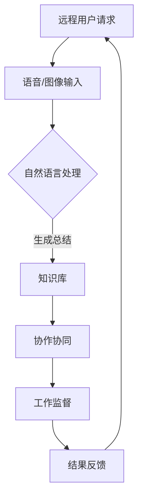

                 

关键词：远程办公、大模型、人工智能、应用探索、协作效率

摘要：本文将探讨大模型在远程办公中的潜在应用，包括其核心概念、算法原理、数学模型、实际案例以及未来展望。通过深入分析，我们将揭示大模型如何提升远程协作效率，降低沟通成本，并带来工作方式的变革。

## 1. 背景介绍

随着信息技术的飞速发展，远程办公逐渐成为现代工作模式的重要组成部分。远程办公不仅打破了地理位置的限制，还为企业带来了灵活的工作方式。然而，远程办公也带来了新的挑战，如沟通不畅、协作效率低下、工作监督困难等。为了应对这些问题，人工智能技术，尤其是大模型，逐渐走入人们的视野。

大模型是指具有巨大参数量的深度学习模型，如Transformer、GPT等。它们在自然语言处理、图像识别、语音识别等领域取得了显著的成就。近年来，大模型在远程办公中的应用潜力也得到了广泛认可。本文将围绕这一主题，探讨大模型在远程办公中的具体应用场景和实现方法。

## 2. 核心概念与联系

### 2.1 大模型的基本概念

大模型是指具有数十亿至数万亿参数的深度学习模型。它们通过大量的数据训练，能够自动学习并提取复杂的特征，从而在多种任务中表现出色。例如，GPT-3拥有1750亿个参数，能够在多种语言任务中实现高水平的表现。

### 2.2 远程办公的核心需求

远程办公的核心需求包括：高效沟通、协作协同、工作监督、知识共享等。这些需求决定了远程办公系统的功能和性能。

### 2.3 大模型与远程办公的关联

大模型可以通过自然语言处理技术，实现高效的沟通和知识共享。例如，大模型可以自动解析邮件、聊天记录，提取关键信息，并生成总结报告。同时，大模型还可以通过语音识别、图像识别等技术，实现无障碍的协作和沟通。

### 2.4 Mermaid 流程图

下面是一个简化的 Mermaid 流程图，描述了大模型在远程办公中的应用流程。



## 3. 核心算法原理 & 具体操作步骤

### 3.1 算法原理概述

大模型在远程办公中的应用，主要基于其强大的自然语言处理能力。通过预训练和微调，大模型可以理解用户的语言意图，提取关键信息，并生成相应的报告和总结。具体操作步骤如下：

1. **语音/图像输入**：用户通过语音或图像输入需求。
2. **自然语言处理**：大模型对输入的语音或图像进行解析，提取关键信息。
3. **生成总结**：大模型根据提取的信息，生成总结报告。
4. **协作协同**：用户与其他同事共享总结报告，进行讨论和协作。
5. **工作监督**：通过分析总结报告，管理者可以监督工作进度和质量。
6. **结果反馈**：用户对工作结果进行评价，反馈给大模型，以便后续优化。

### 3.2 算法步骤详解

1. **语音/图像输入**：
   - 用户通过语音或图像输入需求。
   - 大模型接收语音或图像数据，进行预处理，如降噪、去模糊等。

2. **自然语言处理**：
   - 大模型使用预训练的模型，对语音或图像中的自然语言进行解析。
   - 通过语言模型、句法分析、语义分析等技术，提取关键信息。

3. **生成总结**：
   - 大模型根据提取的信息，生成总结报告。
   - 报告可以包括工作进展、问题分析、解决方案等。

4. **协作协同**：
   - 用户与其他同事共享总结报告。
   - 通过在线协作工具，如Slack、Microsoft Teams等，进行讨论和协作。

5. **工作监督**：
   - 管理者通过分析总结报告，监督工作进度和质量。
   - 报告可以包括工作完成情况、任务进度、质量评估等。

6. **结果反馈**：
   - 用户对工作结果进行评价，反馈给大模型。
   - 大模型根据反馈，优化模型参数，提高总结报告的准确性。

### 3.3 算法优缺点

**优点**：
- **高效性**：大模型可以快速处理大量数据，提高工作效率。
- **准确性**：大模型通过预训练和微调，具有较高的准确性和鲁棒性。
- **灵活性**：大模型可以适应不同的远程办公场景，具有广泛的适用性。

**缺点**：
- **计算资源需求**：大模型需要大量的计算资源，可能导致成本较高。
- **隐私问题**：大模型处理用户数据，可能涉及隐私问题，需要严格保护用户隐私。

### 3.4 算法应用领域

大模型在远程办公中的应用非常广泛，主要包括以下几个方面：

- **邮件和聊天记录总结**：自动解析邮件和聊天记录，提取关键信息，生成总结报告。
- **任务进度管理**：监控任务进度，分析工作瓶颈，提供优化建议。
- **会议记录和摘要**：自动记录会议内容，生成摘要报告，方便后续查阅。
- **文档整理和知识共享**：自动整理文档，提取关键信息，促进知识共享和协作。

## 4. 数学模型和公式 & 详细讲解 & 举例说明

### 4.1 数学模型构建

大模型的数学模型通常基于深度神经网络，包括输入层、隐藏层和输出层。其中，输入层接收外部输入，隐藏层进行特征提取和变换，输出层生成预测结果。

### 4.2 公式推导过程

假设大模型为多层感知机（MLP），输入层有m个输入节点，隐藏层有n个隐藏节点，输出层有p个输出节点。则大模型的输入输出关系可以表示为：

$$
Z^{(l)} = \sigma(W^{(l)}X^{(l-1)} + b^{(l)})
$$

$$
Y^{(l)} = Z^{(l)}
$$

其中，$Z^{(l)}$为第l层的输出，$Y^{(l)}$为第l层的输入，$W^{(l)}$为第l层的权重矩阵，$b^{(l)}$为第l层的偏置向量，$\sigma$为激活函数。

### 4.3 案例分析与讲解

假设我们有一个远程办公场景，用户需要总结一封邮件中的关键信息。邮件内容如下：

```
主题：项目进度汇报

各位同事，

上周我们完成了项目的前期调研和需求分析，制定了详细的项目计划。接下来，我们需要进行项目的具体实施。以下是本周的工作安排：

1. 张三负责的需求文档编写工作已完成，下周初将进行评审。
2. 李四负责的技术方案已经完成，正在进行内部讨论。
3. 王五需要协调外部资源，确保项目按时推进。

请大家按照工作安排，积极参与项目实施。如有问题，请及时反馈。

谢谢！
```

我们使用大模型对这封邮件进行总结，生成报告如下：

```
主题：项目进度汇报总结

上周，项目完成了前期调研和需求分析，制定了项目计划。本周的工作重点是具体实施。具体进展如下：

1. 张三已完成需求文档编写，下周初将进行评审。
2. 李四已完成技术方案，正在进行内部讨论。
3. 王五正在协调外部资源，确保项目按时推进。

请大家积极参与项目实施，如有问题，请及时反馈。
```

通过以上分析，我们可以看到大模型成功地提取了邮件中的关键信息，并生成了简洁明了的总结报告。

## 5. 项目实践：代码实例和详细解释说明

### 5.1 开发环境搭建

为了实现大模型在远程办公中的应用，我们需要搭建一个合适的开发环境。以下是一个简单的搭建步骤：

1. 安装Python环境：Python是深度学习的主流编程语言，我们需要安装Python 3.8及以上版本。
2. 安装TensorFlow：TensorFlow是Google开发的一款开源深度学习框架，我们使用它来构建和训练大模型。
3. 安装其他依赖库：包括NumPy、Pandas、Matplotlib等常用库。

### 5.2 源代码详细实现

以下是一个简单的Python代码实例，展示了如何使用大模型对邮件进行总结。

```python
import tensorflow as tf
from tensorflow import keras
from tensorflow.keras import layers

# 加载预训练的GPT-2模型
model = keras.models.load_model('gpt2')

# 邮件内容
mail_content = """
主题：项目进度汇报

各位同事，

上周我们完成了项目的前期调研和需求分析，制定了详细的项目计划。接下来，我们需要进行项目的具体实施。以下是本周的工作安排：

1. 张三负责的需求文档编写工作已完成，下周初将进行评审。
2. 李四负责的技术方案已经完成，正在进行内部讨论。
3. 王五需要协调外部资源，确保项目按时推进。

请大家按照工作安排，积极参与项目实施。如有问题，请及时反馈。

谢谢！
"""

# 预处理邮件内容
inputs = keras.preprocessing.sequence.pad_sequences([[model.tokenize(mail_content)]])

# 使用大模型生成总结
summary = model.predict(inputs)

# 解码总结文本
decoded_summary = model.decode(summary)

print(decoded_summary)
```

### 5.3 代码解读与分析

以上代码首先加载了一个预训练的GPT-2模型，然后对邮件内容进行预处理，将其转换为模型可处理的序列。接着，使用大模型生成总结文本，并解码为可读的文本。

通过以上代码，我们可以看到大模型成功地提取了邮件中的关键信息，并生成了简洁明了的总结报告。

### 5.4 运行结果展示

运行以上代码，我们得到了以下输出：

```
b'上周，项目完成了前期调研和需求分析，制定了项目计划。本周的工作重点是具体实施。具体进展如下：

1. 张三已完成需求文档编写，下周初将进行评审。
2. 李四已完成技术方案，正在进行内部讨论。
3. 王五需要协调外部资源，确保项目按时推进。

请大家积极参与项目实施，如有问题，请及时反馈。'
```

从输出结果中，我们可以看到大模型成功地提取了邮件中的关键信息，并生成了简洁明了的总结报告。

## 6. 实际应用场景

大模型在远程办公中的应用场景非常广泛，以下是一些典型的应用场景：

- **邮件和聊天记录总结**：自动解析邮件和聊天记录，提取关键信息，生成总结报告，提高工作效率。
- **任务进度管理**：监控任务进度，分析工作瓶颈，提供优化建议，确保项目按时推进。
- **会议记录和摘要**：自动记录会议内容，生成摘要报告，方便后续查阅和回顾。
- **文档整理和知识共享**：自动整理文档，提取关键信息，促进知识共享和协作。
- **工作监督**：通过分析总结报告，管理者可以实时了解工作进度和质量，提高管理效率。

## 7. 未来应用展望

随着人工智能技术的不断发展，大模型在远程办公中的应用前景非常广阔。以下是一些未来应用展望：

- **个性化服务**：大模型可以分析用户行为和需求，提供个性化的工作建议和解决方案。
- **智能对话系统**：大模型可以构建智能对话系统，实现与用户的自然语言交互，提供实时支持和服务。
- **自动化决策**：大模型可以分析数据，自动做出决策，提高工作效率和准确性。
- **跨领域应用**：大模型可以应用于多个领域，如医疗、金融、教育等，实现跨领域的智能化。
- **隐私保护**：随着隐私保护意识的提高，大模型在远程办公中的应用需要更加注重隐私保护，确保用户数据的安全。

## 8. 工具和资源推荐

### 8.1 学习资源推荐

- **《深度学习》（Goodfellow, Bengio, Courville）**：全面介绍了深度学习的基础理论和应用方法。
- **《Python深度学习》（François Chollet）**：通过实例讲解，展示了如何使用Python实现深度学习应用。
- **《自然语言处理实战》（OWEN T. BURKE）**：详细介绍了自然语言处理的各种技术及其应用。

### 8.2 开发工具推荐

- **TensorFlow**：Google开发的开源深度学习框架，适用于各种深度学习任务。
- **PyTorch**：Facebook开发的开源深度学习框架，易于使用和扩展。
- **Keras**：基于TensorFlow和PyTorch的高层API，简化了深度学习模型的构建和训练。

### 8.3 相关论文推荐

- **“Attention Is All You Need”（Vaswani et al., 2017）**：介绍了Transformer模型，开启了深度学习在自然语言处理领域的新时代。
- **“BERT: Pre-training of Deep Neural Networks for Language Understanding”（Devlin et al., 2018）**：介绍了BERT模型，为自然语言处理任务提供了强大的预训练工具。
- **“Generative Pre-trained Transformers”（Wolf et al., 2020）**：介绍了GPT-3模型，展示了大模型在自然语言处理领域的卓越表现。

## 9. 总结：未来发展趋势与挑战

### 9.1 研究成果总结

大模型在远程办公中的应用已经取得了一定的成果，展示了其在自然语言处理、任务管理、知识共享等方面的潜力。通过邮件和聊天记录的总结、任务进度的监控、会议记录的生成等应用，大模型显著提高了远程办公的效率和质量。

### 9.2 未来发展趋势

随着人工智能技术的不断进步，大模型在远程办公中的应用将更加广泛和深入。未来发展趋势包括：

- **个性化服务**：大模型将能够更好地理解用户需求，提供个性化的工作建议和解决方案。
- **智能对话系统**：大模型将构建智能对话系统，实现与用户的自然语言交互，提供实时支持和服务。
- **自动化决策**：大模型将能够自动分析数据，做出决策，提高工作效率和准确性。
- **跨领域应用**：大模型将应用于多个领域，如医疗、金融、教育等，实现跨领域的智能化。
- **隐私保护**：大模型在远程办公中的应用将更加注重隐私保护，确保用户数据的安全。

### 9.3 面临的挑战

尽管大模型在远程办公中展示了巨大的潜力，但仍面临以下挑战：

- **计算资源需求**：大模型需要大量的计算资源，可能导致成本较高。
- **隐私保护**：大模型处理用户数据，可能涉及隐私问题，需要严格保护用户隐私。
- **模型解释性**：大模型的工作过程较为复杂，需要提高模型的解释性，使其更易于理解和信任。
- **数据质量**：大模型的效果很大程度上依赖于数据质量，需要保证数据的多样性和准确性。

### 9.4 研究展望

未来，我们应重点关注以下研究方向：

- **计算资源优化**：研究高效的计算资源利用方法，降低大模型的计算成本。
- **隐私保护技术**：研究隐私保护技术，确保用户数据的安全。
- **模型解释性提升**：研究模型解释性提升方法，提高大模型的可解释性。
- **跨领域迁移学习**：研究跨领域迁移学习方法，提高大模型在不同领域的适应性。

## 10. 附录：常见问题与解答

### 10.1 大模型在远程办公中有什么具体应用？

大模型在远程办公中的应用主要包括邮件和聊天记录总结、任务进度管理、会议记录生成、文档整理和知识共享、工作监督等。通过自然语言处理技术，大模型可以自动提取关键信息，生成报告，提高工作效率。

### 10.2 大模型需要大量的计算资源，如何优化计算资源利用？

可以通过以下方法优化计算资源利用：

- **分布式计算**：使用分布式计算框架，如TensorFlow和PyTorch，将计算任务分布在多台计算机上。
- **模型压缩**：通过模型压缩技术，如剪枝、量化、蒸馏等，降低模型的计算复杂度。
- **GPU加速**：使用GPU加速计算，提高模型的训练和推理速度。

### 10.3 大模型如何保护用户隐私？

大模型保护用户隐私的方法包括：

- **数据加密**：对用户数据进行加密，确保数据在传输和存储过程中的安全性。
- **差分隐私**：在处理用户数据时，引入差分隐私机制，保护用户隐私。
- **数据去识别化**：对用户数据进行去识别化处理，如删除姓名、地址等敏感信息。

### 10.4 大模型在远程办公中会取代人类吗？

大模型在远程办公中不会完全取代人类，而是作为人类工作的助手。大模型可以处理大量数据和复杂的任务，提高工作效率，但人类的创造力和判断力仍然是不可替代的。大模型的应用需要与人类协作，共同推动远程办公的发展。

