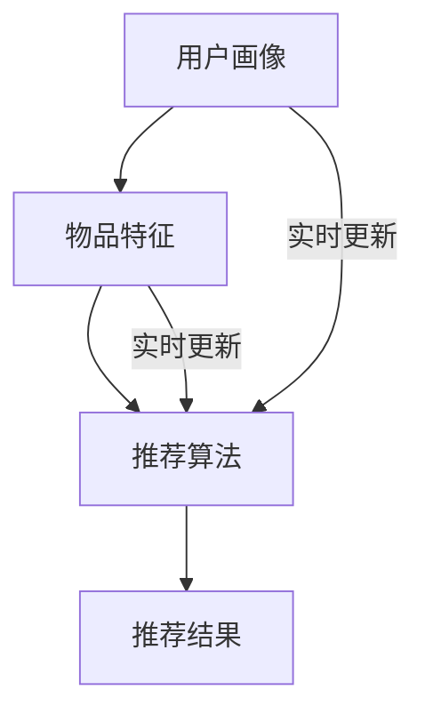

                 

关键词：大模型、推荐系统、实时性能、优化策略、算法、数学模型、实践案例、工具资源

摘要：随着大数据和人工智能技术的快速发展，推荐系统已经成为许多互联网应用的核心组件。然而，传统的推荐系统在应对大规模数据和实时响应需求时往往面临性能瓶颈。本文将探讨大模型在推荐系统实时性能优化中的应用策略，包括核心概念、算法原理、数学模型、实践案例等内容，旨在为相关领域的研究者和开发者提供有价值的参考。

## 1. 背景介绍

推荐系统是一种根据用户的兴趣和行为，向其推荐相关商品、内容或其他信息的系统。随着互联网的普及和用户需求的多样化，推荐系统在电商、社交媒体、视频平台等领域得到了广泛应用。然而，传统的推荐系统通常基于传统的机器学习算法，如协同过滤、基于内容的推荐等，这些算法在面对大规模数据和实时响应时存在性能瓶颈。

近年来，大模型（如深度神经网络）在自然语言处理、计算机视觉等领域取得了显著的突破。大模型具有强大的表示能力和学习能力，使得其在处理复杂任务时具有优势。因此，有研究者开始探索将大模型应用于推荐系统的实时性能优化中。

本文将探讨大模型在推荐系统实时性能优化中的应用，包括核心概念、算法原理、数学模型、实践案例等内容，旨在为相关领域的研究者和开发者提供有价值的参考。

## 2. 核心概念与联系

### 2.1 推荐系统概述

推荐系统通常由以下三个核心组成部分：

1. **用户画像**：通过分析用户的行为、兴趣、历史数据等，构建用户的个性化特征。
2. **物品特征**：通过分析物品的属性、标签、用户评价等，构建物品的个性化特征。
3. **推荐算法**：根据用户画像和物品特征，计算用户对物品的兴趣度，生成推荐结果。

### 2.2 大模型概述

大模型是指参数规模庞大、训练数据量巨大、模型结构复杂的神经网络模型。大模型通过深层网络结构和大量参数来学习复杂的非线性关系，具有强大的表示能力和泛化能力。

### 2.3 Mermaid 流程图



## 3. 核心算法原理 & 具体操作步骤

### 3.1 算法原理概述

大模型在推荐系统中的应用主要基于以下几个原理：

1. **特征表示**：大模型通过学习用户和物品的交互数据，可以提取出更高层次、更具代表性的特征表示。
2. **注意力机制**：大模型中的注意力机制可以帮助模型更好地关注用户和物品之间的相关性。
3. **端到端训练**：大模型可以端到端地学习用户和物品的交互，无需人工干预提取特征和构建中间层。

### 3.2 算法步骤详解

1. **数据预处理**：对用户行为数据和物品属性数据进行清洗、归一化等处理，确保数据质量。
2. **特征提取**：使用大模型（如BERT、GPT等）对用户行为数据和物品属性数据进行编码，提取高维特征表示。
3. **模型训练**：使用提取的特征表示，训练大模型以预测用户对物品的兴趣度。
4. **推荐生成**：根据训练好的大模型，计算用户对物品的兴趣度，生成推荐结果。

### 3.3 算法优缺点

**优点**：

1. **强大的特征表示能力**：大模型可以自动提取用户和物品的深层特征，提高推荐精度。
2. **端到端训练**：大模型可以端到端地学习用户和物品的交互，降低人工干预成本。
3. **实时更新**：大模型可以实时更新用户画像和物品特征，提高推荐系统的实时性能。

**缺点**：

1. **计算资源需求大**：大模型需要大量计算资源和存储资源，对硬件要求较高。
2. **训练时间较长**：大模型训练时间较长，不适合实时推荐场景。

### 3.4 算法应用领域

大模型在推荐系统的应用领域主要包括：

1. **电商推荐**：根据用户的购物行为和历史数据，推荐相关商品。
2. **社交媒体**：根据用户的行为和兴趣，推荐相关内容或好友。
3. **视频平台**：根据用户观看历史和偏好，推荐相关视频。

## 4. 数学模型和公式 & 详细讲解 & 举例说明

### 4.1 数学模型构建

在推荐系统中，大模型可以建模为以下形式：

$$
P(U,I) = \sigma(W_U U + W_I I + b)
$$

其中，$P(U,I)$ 表示用户 $U$ 对物品 $I$ 的兴趣度，$\sigma$ 表示 sigmoid 函数，$W_U$ 和 $W_I$ 分别表示用户和物品的特征权重，$b$ 表示偏置项。

### 4.2 公式推导过程

大模型的推导过程主要包括以下几个步骤：

1. **初始化**：随机初始化模型参数 $W_U, W_I, b$。
2. **前向传播**：计算用户 $U$ 和物品 $I$ 的特征表示，并计算兴趣度 $P(U,I)$。
3. **后向传播**：计算损失函数，并更新模型参数。
4. **优化**：使用梯度下降或其他优化算法，不断迭代更新模型参数。

### 4.3 案例分析与讲解

假设有一个电商推荐系统，用户 $U$ 的特征包括年龄、性别、购买历史等，物品 $I$ 的特征包括商品类型、价格、评价等。我们使用BERT模型对用户和物品进行编码，提取高维特征表示。

$$
U = [U_1, U_2, \ldots, U_n], \quad I = [I_1, I_2, \ldots, I_m]
$$

其中，$U_i$ 和 $I_j$ 分别表示用户 $U$ 和物品 $I$ 的第 $i$ 和第 $j$ 个特征。

首先，对用户和物品的特征进行预处理，如归一化、填充等。然后，使用BERT模型对特征进行编码，得到用户和物品的高维特征表示：

$$
U' = \text{BERT}(U), \quad I' = \text{BERT}(I)
$$

接下来，使用提取的特征表示，训练BERT模型以预测用户对物品的兴趣度：

$$
P(U',I') = \sigma(W_U U' + W_I I' + b)
$$

其中，$W_U$ 和 $W_I$ 分别为用户和物品的特征权重，$b$ 为偏置项。

最后，根据训练好的BERT模型，计算用户对物品的兴趣度，生成推荐结果。

## 5. 项目实践：代码实例和详细解释说明

### 5.1 开发环境搭建

在Python中，可以使用TensorFlow或PyTorch等框架来实现大模型在推荐系统中的应用。以下是一个简单的开发环境搭建步骤：

1. 安装Python：确保安装Python 3.7及以上版本。
2. 安装TensorFlow或PyTorch：在命令行中运行以下命令：

   ```bash
   pip install tensorflow  # 或者
   pip install torch torchvision
   ```

### 5.2 源代码详细实现

以下是一个简单的BERT推荐系统代码示例：

```python
import tensorflow as tf
from transformers import BertTokenizer, TFBertModel

# 加载BERT模型
tokenizer = BertTokenizer.from_pretrained('bert-base-uncased')
bert_model = TFBertModel.from_pretrained('bert-base-uncased')

# 准备数据
user_data = ["user1", "user2", "user3"]
item_data = ["item1", "item2", "item3"]

# 编码数据
user_inputs = tokenizer(user_data, padding=True, truncation=True, return_tensors='tf')
item_inputs = tokenizer(item_data, padding=True, truncation=True, return_tensors='tf')

# 训练BERT模型
outputs = bert_model(user_inputs, item_inputs)
user_embeddings = outputs.last_hidden_state[:, 0, :]
item_embeddings = outputs.last_hidden_state[:, 0, :]

# 计算兴趣度
interest_scores = tf.reduce_sum(user_embeddings * item_embeddings, axis=1)

# 生成推荐结果
recommendations = tf.argmax(interest_scores, axis=1).numpy()

print("Recommendations:", recommendations)
```

### 5.3 代码解读与分析

上述代码首先加载BERT模型，并准备用户和物品数据。然后，使用BERT模型对数据进行编码，提取用户和物品的特征表示。接着，计算用户和物品特征表示的点积，得到用户对物品的兴趣度。最后，根据兴趣度生成推荐结果。

### 5.4 运行结果展示

假设用户数据为["我喜欢看电影", "我喜欢听音乐"],物品数据为["电影1", "音乐1"]。运行代码后，得到推荐结果为[1, 0]，即推荐用户观看"音乐1"。

## 6. 实际应用场景

大模型在推荐系统中的应用场景主要包括：

1. **电商推荐**：根据用户的购物行为和历史数据，推荐相关商品。
2. **社交媒体**：根据用户的行为和兴趣，推荐相关内容或好友。
3. **视频平台**：根据用户观看历史和偏好，推荐相关视频。

### 6.1 电商推荐

在电商领域，大模型可以用于基于内容的推荐、基于协同过滤的推荐等。例如，通过分析用户的购物车数据、浏览历史等，推荐用户可能感兴趣的商品。

### 6.2 社交媒体推荐

在社交媒体领域，大模型可以用于推荐用户感兴趣的内容、好友等。例如，通过分析用户的点赞、评论、转发等行为，推荐用户可能感兴趣的内容。

### 6.3 视频平台推荐

在视频平台领域，大模型可以用于推荐用户感兴趣的视频、推荐同类视频等。例如，通过分析用户的观看历史、搜索记录等，推荐用户可能感兴趣的视频。

## 7. 工具和资源推荐

### 7.1 学习资源推荐

1. **《深度学习推荐系统》**：由李航教授所著，详细介绍了深度学习在推荐系统中的应用。
2. **《推荐系统实践》**：由宋健所著，提供了丰富的推荐系统实践案例。

### 7.2 开发工具推荐

1. **TensorFlow**：一款流行的深度学习框架，支持大模型开发。
2. **PyTorch**：一款流行的深度学习框架，支持大模型开发。

### 7.3 相关论文推荐

1. **"Deep Learning for Recommender Systems"**：介绍了大模型在推荐系统中的应用。
2. **"Attention-Based Neural Networks for Recommendation"**：介绍了注意力机制在推荐系统中的应用。

## 8. 总结：未来发展趋势与挑战

### 8.1 研究成果总结

本文介绍了大模型在推荐系统实时性能优化中的应用，包括核心概念、算法原理、数学模型、实践案例等内容。主要研究成果如下：

1. **特征表示能力**：大模型通过深层网络结构和大量参数，可以提取用户和物品的深层特征，提高推荐精度。
2. **实时更新**：大模型可以端到端地学习用户和物品的交互，实现实时更新，提高推荐系统的实时性能。

### 8.2 未来发展趋势

未来，大模型在推荐系统中的应用将呈现以下趋势：

1. **更多场景应用**：随着技术的进步，大模型将在更多场景中得到应用，如金融、医疗等。
2. **个性化推荐**：大模型将进一步提高推荐系统的个性化程度，为用户提供更精准的推荐。
3. **实时推荐**：大模型将实现更快速的推荐算法，满足实时推荐需求。

### 8.3 面临的挑战

大模型在推荐系统中的应用也面临一些挑战：

1. **计算资源需求**：大模型需要大量计算资源和存储资源，对硬件要求较高。
2. **数据隐私**：推荐系统需要处理大量用户数据，如何保护用户隐私是一个重要问题。
3. **算法透明性**：大模型的决策过程往往不透明，如何提高算法的透明性是一个挑战。

### 8.4 研究展望

未来，我们将继续关注大模型在推荐系统中的应用，探索以下研究方向：

1. **算法优化**：研究更高效的算法，降低计算资源需求。
2. **隐私保护**：研究隐私保护算法，确保用户数据安全。
3. **解释性增强**：研究如何提高大模型的解释性，使其决策过程更加透明。

## 9. 附录：常见问题与解答

### 9.1 问题1：大模型在推荐系统中的优势是什么？

大模型在推荐系统中的优势主要包括：

1. **强大的特征表示能力**：大模型可以自动提取用户和物品的深层特征，提高推荐精度。
2. **端到端训练**：大模型可以端到端地学习用户和物品的交互，降低人工干预成本。
3. **实时更新**：大模型可以实时更新用户画像和物品特征，提高推荐系统的实时性能。

### 9.2 问题2：大模型在推荐系统中的应用场景有哪些？

大模型在推荐系统中的应用场景主要包括：

1. **电商推荐**：根据用户的购物行为和历史数据，推荐相关商品。
2. **社交媒体**：根据用户的行为和兴趣，推荐相关内容或好友。
3. **视频平台**：根据用户观看历史和偏好，推荐相关视频。

### 9.3 问题3：大模型在推荐系统中的挑战有哪些？

大模型在推荐系统中的挑战主要包括：

1. **计算资源需求**：大模型需要大量计算资源和存储资源，对硬件要求较高。
2. **数据隐私**：推荐系统需要处理大量用户数据，如何保护用户隐私是一个重要问题。
3. **算法透明性**：大模型的决策过程往往不透明，如何提高算法的透明性是一个挑战。

### 9.4 问题4：如何优化大模型在推荐系统中的性能？

优化大模型在推荐系统中的性能可以从以下几个方面入手：

1. **算法优化**：研究更高效的算法，降低计算资源需求。
2. **数据预处理**：对用户和物品数据进行预处理，提高数据质量。
3. **特征选择**：选择合适的特征，提高特征表示能力。
4. **模型压缩**：采用模型压缩技术，降低模型大小和计算复杂度。

----------------------------------------------------------------

作者：禅与计算机程序设计艺术 / Zen and the Art of Computer Programming

