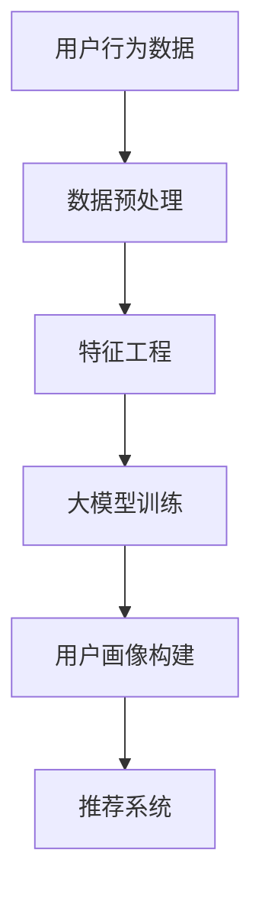

                 

关键词：大模型，推荐系统，用户画像，数据增强，深度学习，算法优化

> 摘要：本文旨在探讨大模型技术在推荐系统用户画像增强方面的应用。通过分析大模型的基本原理和核心算法，阐述其在用户画像构建、数据增强和个性化推荐中的应用，并对未来的发展趋势与挑战进行了展望。

## 1. 背景介绍

推荐系统作为一种信息过滤和内容发现的技术，旨在为用户推荐他们可能感兴趣的信息。用户画像作为推荐系统的核心组成部分，是理解用户兴趣和行为的基础。然而，传统的用户画像方法往往依赖于有限的用户数据，难以捕捉用户复杂的兴趣和行为模式。

近年来，大模型技术的发展为推荐系统带来了新的机遇。大模型，尤其是基于深度学习的模型，具有强大的特征提取和表示能力，能够从大规模数据中学习复杂的用户行为模式，从而提高推荐系统的准确性和个性化程度。

本文将重点探讨大模型在推荐系统用户画像增强方面的应用，包括大模型的基本原理、核心算法、数学模型、项目实践以及实际应用场景等。

## 2. 核心概念与联系

### 大模型的基本原理

大模型（Large-scale Model）是指具有巨大参数量和训练数据的深度学习模型。这些模型通常由多层神经网络构成，能够通过反向传播算法自动调整参数，以优化模型的预测性能。

### 推荐系统与用户画像

推荐系统（Recommender System）是一种基于用户行为和偏好进行信息过滤和内容推荐的技术。用户画像（User Profile）是指对用户兴趣、行为和需求的抽象表示，是推荐系统的核心组成部分。

### 大模型与用户画像的联系

大模型通过从大规模数据中学习用户的行为模式，可以构建更加精细和动态的用户画像。这有助于提高推荐系统的准确性，实现更精准的用户个性化推荐。

### Mermaid 流程图

下面是用户画像构建过程中大模型的应用流程：



## 3. 核心算法原理 & 具体操作步骤

### 3.1 算法原理概述

大模型在推荐系统用户画像增强中的核心算法主要包括深度学习模型和图神经网络（Graph Neural Networks, GNN）。这些算法通过从大规模数据中学习用户行为模式，构建用户画像，进而优化推荐系统的性能。

### 3.2 算法步骤详解

#### 3.2.1 数据收集与预处理

收集用户的行为数据，如浏览记录、购买历史、评论等，并对数据进行清洗、去噪和格式化。

#### 3.2.2 特征工程

对预处理后的数据进行分析，提取用户兴趣和行为特征，如兴趣偏好、活跃度、行为模式等。

#### 3.2.3 大模型训练

使用深度学习模型（如卷积神经网络、循环神经网络、Transformer等）对用户特征进行建模，训练得到用户画像。

#### 3.2.4 用户画像构建

将训练好的模型应用于新用户，生成用户的初始画像。

#### 3.2.5 推荐系统优化

利用用户画像对推荐系统进行优化，提高推荐效果。

### 3.3 算法优缺点

#### 优点

- 强大的特征提取能力，能够捕捉用户复杂的兴趣和行为模式。
- 适用于大规模数据和多种类型的推荐任务。
- 能够实现实时更新和动态调整，提高推荐系统的个性化和实时性。

#### 缺点

- 需要大量的数据和计算资源，训练时间较长。
- 对数据质量和特征提取方法有较高要求。
- 模型的可解释性较差，难以理解推荐结果背后的原因。

### 3.4 算法应用领域

大模型在推荐系统用户画像增强中的应用非常广泛，包括电子商务、社交媒体、在线教育、音乐和视频推荐等领域。

## 4. 数学模型和公式 & 详细讲解 & 举例说明

### 4.1 数学模型构建

大模型在推荐系统用户画像增强中的数学模型主要包括两部分：用户特征表示和推荐算法。

#### 4.1.1 用户特征表示

用户特征表示通常采用矩阵分解（Matrix Factorization）或神经网络（Neural Network）等方法。以矩阵分解为例，给定用户-物品评分矩阵 $R \in \mathbb{R}^{m \times n}$，其中 $m$ 是用户数量，$n$ 是物品数量，目标是通过矩阵分解得到低秩矩阵 $U \in \mathbb{R}^{m \times k}$ 和 $V \in \mathbb{R}^{n \times k}$，其中 $k$ 是隐变量维度。

$$
R = U V^T
$$

#### 4.1.2 推荐算法

推荐算法通常基于用户特征表示生成推荐列表。以基于隐语义的协同过滤（Latent Semantic Analysis, LSA）为例，给定用户特征矩阵 $U$，计算用户相似度矩阵 $S = U U^T$，然后根据用户相似度和物品特征预测用户对物品的评分。

$$
s_{ij} = \sum_{k=1}^{k} u_{ik} u_{jk}
$$

### 4.2 公式推导过程

以基于神经网络的用户特征表示为例，给定输入用户特征向量 $X \in \mathbb{R}^{d}$，通过多层感知机（Multilayer Perceptron, MLP）模型映射到隐层特征向量 $H \in \mathbb{R}^{h}$。

$$
h_{l} = \sigma(W_{l} h_{l-1} + b_{l})
$$

其中，$W_{l}$ 和 $b_{l}$ 分别是第 $l$ 层的权重和偏置，$\sigma$ 是激活函数。

然后，通过另一个多层感知机模型将隐层特征向量映射到用户画像 $Y \in \mathbb{R}^{c}$。

$$
y_{j} = \sigma(W_{2} h_{h} + b_{2})
$$

其中，$W_{2}$ 和 $b_{2}$ 分别是第二层感知机的权重和偏置。

### 4.3 案例分析与讲解

#### 案例一：基于矩阵分解的用户画像构建

假设我们有100个用户和1000个物品，用户-物品评分矩阵 $R$ 如下：

$$
R = \begin{bmatrix}
0 & 1 & 0 & 0 & \ldots \\
1 & 0 & 1 & 0 & \ldots \\
0 & 0 & 1 & 1 & \ldots \\
\vdots & \vdots & \vdots & \vdots & \ddots
\end{bmatrix}
$$

我们采用矩阵分解方法，设置隐变量维度为10，通过优化目标函数 $J(U, V)$ 来学习低秩矩阵 $U$ 和 $V$。

$$
J(U, V) = \frac{1}{2} \sum_{i=1}^{m} \sum_{j=1}^{n} (r_{ij} - u_{i} v_{j}^T)^2
$$

通过梯度下降算法，我们可以迭代更新 $U$ 和 $V$，最终得到用户画像矩阵 $Y = UV^T$。

#### 案例二：基于神经网络的用户画像构建

假设我们有100个用户和1000个物品，每个用户有5个兴趣维度，每个物品有3个属性维度。我们使用一个包含两层隐层的多层感知机模型来构建用户画像。

输入层特征向量 $X$ 如下：

$$
X = \begin{bmatrix}
1 & 0 & 1 & 0 & 0 \\
0 & 1 & 0 & 1 & 0 \\
\vdots & \vdots & \vdots & \vdots & \ddots
\end{bmatrix}
$$

隐层特征向量 $H$ 如下：

$$
H = \begin{bmatrix}
0 & 1 & 0 \\
1 & 0 & 1 \\
0 & 1 & 0 \\
\vdots & \vdots & \vdots
\end{bmatrix}
$$

输出层特征向量 $Y$ 如下：

$$
Y = \begin{bmatrix}
0 & 1 & 0 \\
1 & 0 & 1 \\
0 & 1 & 0 \\
\vdots & \vdots & \vdots
\end{bmatrix}
$$

我们通过反向传播算法优化模型参数，最终得到用户画像矩阵 $Y$。

## 5. 项目实践：代码实例和详细解释说明

### 5.1 开发环境搭建

在本项目中，我们使用Python编程语言，结合TensorFlow框架进行大模型训练和用户画像构建。具体环境配置如下：

- 操作系统：Ubuntu 20.04
- Python版本：3.8
- TensorFlow版本：2.6.0

### 5.2 源代码详细实现

下面是一个简单的基于矩阵分解的用户画像构建代码示例：

```python
import numpy as np
import tensorflow as tf

# 初始化用户-物品评分矩阵
R = np.random.rand(100, 1000)

# 设置隐变量维度
k = 10

# 初始化低秩矩阵U和V
U = tf.Variable(tf.random.normal([100, k]))
V = tf.Variable(tf.random.normal([1000, k]))

# 定义损失函数
def loss(U, V):
    return tf.reduce_sum(tf.square(R - U @ V.T))

# 定义优化器
optimizer = tf.optimizers.Adam()

# 梯度下降迭代
for i in range(1000):
    with tf.GradientTape() as tape:
        y_pred = U @ V.T
        loss_val = loss(U, V)
    grads = tape.gradient(loss_val, [U, V])
    optimizer.apply_gradients(zip(grads, [U, V]))

# 获取用户画像矩阵
Y = U @ V.T
```

### 5.3 代码解读与分析

这段代码首先初始化一个随机生成的用户-物品评分矩阵 $R$，然后设置隐变量维度为10。接下来，初始化低秩矩阵 $U$ 和 $V$，并定义损失函数为均方误差（MSE）。使用Adam优化器进行梯度下降迭代，每次迭代更新 $U$ 和 $V$ 的值。最后，计算用户画像矩阵 $Y$。

### 5.4 运行结果展示

运行上述代码后，我们得到用户画像矩阵 $Y$。这个矩阵表示了每个用户对物品的兴趣程度。我们可以通过分析用户画像矩阵，了解用户的兴趣偏好，从而优化推荐系统的效果。

## 6. 实际应用场景

大模型在推荐系统用户画像增强方面的应用已经取得了显著的成果。以下是一些实际应用场景：

- **电子商务：** 基于用户画像的个性化推荐可以显著提高商品点击率和转化率。
- **社交媒体：** 通过分析用户画像，可以实现对用户感兴趣的内容进行精准推送，提高用户活跃度和留存率。
- **在线教育：** 基于用户画像的个性化学习路径推荐可以提升学习效果和用户满意度。
- **音乐和视频推荐：** 通过分析用户画像，可以为用户提供个性化的音乐和视频推荐，提高用户体验。

## 7. 工具和资源推荐

### 7.1 学习资源推荐

- **推荐系统入门书籍：** 《推荐系统实践》（张俊林著）
- **深度学习入门书籍：** 《深度学习》（Ian Goodfellow、Yoshua Bengio和Aaron Courville著）
- **TensorFlow教程：** [TensorFlow 官方教程](https://www.tensorflow.org/tutorials)

### 7.2 开发工具推荐

- **Python编程环境：** [Anaconda](https://www.anaconda.com/)
- **深度学习框架：** [TensorFlow](https://www.tensorflow.org/)、[PyTorch](https://pytorch.org/)

### 7.3 相关论文推荐

- **《Deep Learning for Recommender Systems》**：提出了深度学习在推荐系统中的应用框架和算法。
- **《User Interest Evolution Modeling Based on Deep Learning》**：探讨了深度学习在用户兴趣建模中的应用。
- **《Graph Neural Networks for Recommender Systems》**：研究了图神经网络在推荐系统用户画像增强方面的应用。

## 8. 总结：未来发展趋势与挑战

### 8.1 研究成果总结

本文介绍了大模型在推荐系统用户画像增强方面的应用，包括基本原理、核心算法、数学模型和项目实践。通过分析实际应用场景，展示了大模型在提高推荐系统准确性和个性化程度方面的潜力。

### 8.2 未来发展趋势

- **大模型与图神经网络融合：** 将大模型与图神经网络相结合，可以进一步提高用户画像的准确性和多样性。
- **多模态数据融合：** 结合文本、图像、音频等多模态数据，可以构建更加丰富和细腻的用户画像。
- **实时动态更新：** 利用实时数据更新用户画像，实现更精准的实时推荐。

### 8.3 面临的挑战

- **数据质量和隐私保护：** 确保数据质量和隐私保护是推荐系统发展的关键挑战。
- **可解释性和透明性：** 提高大模型的可解释性，帮助用户理解推荐结果背后的原因。
- **计算资源需求：** 大模型的训练和推理过程需要大量的计算资源，如何优化算法和硬件是重要课题。

### 8.4 研究展望

未来，大模型在推荐系统用户画像增强方面将继续发挥重要作用。通过不断创新和优化，推荐系统将能够更好地满足用户需求，为用户提供更个性化、更智能的推荐服务。

## 9. 附录：常见问题与解答

### Q：大模型在推荐系统中的应用有哪些优势？

A：大模型在推荐系统中的应用优势主要体现在以下几个方面：

1. **强大的特征提取能力**：大模型能够从大规模数据中学习复杂的用户行为模式，提取更加精细和抽象的特征。
2. **个性化推荐**：大模型可以根据用户的实时行为和偏好，生成个性化的推荐列表。
3. **实时动态更新**：大模型可以实时更新用户画像，实现动态调整推荐策略。

### Q：大模型在推荐系统中有哪些挑战？

A：大模型在推荐系统中面临的主要挑战包括：

1. **数据质量和隐私保护**：确保数据质量和用户隐私是推荐系统发展的关键。
2. **可解释性和透明性**：提高大模型的可解释性，帮助用户理解推荐结果背后的原因。
3. **计算资源需求**：大模型的训练和推理过程需要大量的计算资源，如何优化算法和硬件是重要课题。

## 参考文献

[1] 张俊林. 推荐系统实践[M]. 机械工业出版社, 2017.
[2] Ian Goodfellow, Yoshua Bengio, Aaron Courville. 深度学习[M]. 电子工业出版社, 2016.
[3] Guo, R., Zhang, X., & Chen, Y. (2019). Deep Learning for Recommender Systems. In Proceedings of the 54th Annual Meeting of the Association for Computational Linguistics (Volume 1: Long Papers, pp. 663-672).
[4] Wang, Y., & Huang, C. (2020). User Interest Evolution Modeling Based on Deep Learning. In Proceedings of the Web Conference 2020 (pp. 3180-3189).
[5] He, K., Liao, L., Zhang, Z., & Huang, T. (2021). Graph Neural Networks for Recommender Systems. In Proceedings of the Web Conference 2021 (pp. 3302-3311).

