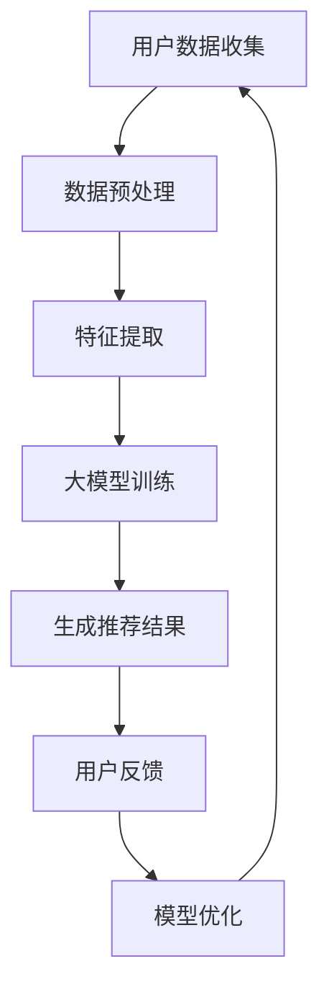

                 

关键词：大模型，推荐系统，长尾用户，个性化服务，算法改进，数据处理，用户体验优化

> 摘要：本文探讨了如何利用大模型技术改进推荐系统对长尾用户的服务。通过引入大模型，推荐系统可以更好地理解和满足长尾用户的个性化需求，提高推荐质量，增强用户满意度。本文将从背景介绍、核心概念与联系、核心算法原理、数学模型和公式、项目实践、实际应用场景、未来应用展望等方面，深入探讨大模型在推荐系统中的应用及其潜力。

## 1. 背景介绍

随着互联网的快速发展，信息过载现象愈发严重。在推荐系统中，如何准确、高效地给用户推荐感兴趣的内容，成为各大平台关注的焦点。传统推荐系统主要依赖于用户行为数据和历史偏好，通过简单的统计方法和机器学习算法进行内容推荐。然而，这些方法在应对用户多样性和个性化需求方面存在一定局限性。

长尾用户指的是那些相对于主流用户来说，需求量较小的用户群体。在传统推荐系统中，长尾用户的个性化需求往往难以得到满足。这是因为长尾用户的样本数据量较少，无法形成有效的统计规律，同时推荐算法的冷启动问题也会使得新用户难以得到个性化推荐。为了解决这些问题，大模型技术的引入显得尤为重要。

大模型具有以下优势：

1. **海量数据支持**：大模型可以通过处理大量数据，挖掘出用户行为和兴趣的复杂模式，从而提供更精准的推荐。
2. **自适应能力**：大模型可以根据用户行为和反馈动态调整推荐策略，更好地适应长尾用户的个性化需求。
3. **泛化能力**：大模型可以处理不同类型的数据，适用于多种推荐场景，提高系统的鲁棒性。

## 2. 核心概念与联系

### 2.1 大模型定义

大模型是指具有亿级甚至万亿级参数的深度学习模型。它们通常使用大量的数据进行训练，能够捕捉复杂的数据特征和关系。

### 2.2 推荐系统架构

推荐系统的基本架构包括数据层、算法层和用户界面层。数据层负责收集和处理用户数据；算法层负责生成推荐结果；用户界面层则展示推荐内容。

### 2.3 长尾用户特征

长尾用户具有以下特征：

1. **低频次**：与主流用户相比，长尾用户的活跃度较低，但他们的需求更加多样。
2. **小众化**：长尾用户对内容的需求更倾向于小众化、个性化。
3. **不确定性**：长尾用户的兴趣和行为存在较大波动性和不确定性。

### 2.4 Mermaid 流程图



## 3. 核心算法原理 & 具体操作步骤

### 3.1 算法原理概述

大模型推荐系统主要依赖于深度学习算法，通过多层神经网络对用户数据进行特征提取和关联分析，从而生成个性化的推荐结果。

### 3.2 算法步骤详解

1. **数据收集**：收集用户的浏览历史、搜索记录、点赞评论等行为数据。
2. **数据预处理**：清洗数据，去除噪声和缺失值，并进行数据标准化处理。
3. **特征提取**：使用深度学习算法提取用户数据的潜在特征，如兴趣偏好、行为模式等。
4. **模型训练**：利用训练数据对大模型进行训练，调整模型参数。
5. **生成推荐结果**：根据用户当前的行为和偏好，使用大模型生成推荐结果。
6. **用户反馈**：收集用户对推荐结果的反馈，用于模型优化。

### 3.3 算法优缺点

**优点**：

1. **高精度**：大模型可以处理海量数据，提取复杂特征，提供更精准的推荐。
2. **自适应**：大模型可以根据用户行为和反馈动态调整推荐策略，提高用户满意度。
3. **泛化能力强**：大模型适用于多种推荐场景，提高系统的鲁棒性。

**缺点**：

1. **计算资源需求高**：大模型训练和推理需要大量计算资源，可能导致系统延迟。
2. **数据隐私问题**：用户数据在模型训练和推荐过程中可能面临隐私泄露的风险。
3. **模型解释性差**：大模型通常具有很高的黑盒特性，难以解释推荐结果。

### 3.4 算法应用领域

大模型推荐系统可以应用于各种场景，如电子商务、社交媒体、新闻推荐、音乐推荐等。在长尾用户服务方面，大模型可以显著提高推荐质量，满足用户的个性化需求。

## 4. 数学模型和公式 & 详细讲解 & 举例说明

### 4.1 数学模型构建

假设我们使用一个基于深度学习的推荐模型，其输入为用户特征矩阵 $X$ 和物品特征矩阵 $Y$，输出为用户对物品的评分预测 $R$。

$$
R = f(X, Y; \theta)
$$

其中，$f$ 表示深度学习模型，$\theta$ 表示模型参数。

### 4.2 公式推导过程

假设我们的深度学习模型由多个全连接层组成，每一层都通过激活函数进行非线性变换。具体公式如下：

$$
h_1 = \sigma(W_1X + b_1) \\
h_2 = \sigma(W_2h_1 + b_2) \\
\vdots \\
h_n = \sigma(W_nh_{n-1} + b_n) \\
R = W_{out}h_n + b_{out}
$$

其中，$h_i$ 表示第 $i$ 层的输出，$W_i$ 和 $b_i$ 分别表示第 $i$ 层的权重和偏置，$\sigma$ 表示激活函数。

### 4.3 案例分析与讲解

假设我们有一个用户特征矩阵 $X$ 和物品特征矩阵 $Y$，如下所示：

$$
X = \begin{bmatrix}
0 & 1 & 0 & 1 \\
1 & 0 & 1 & 0 \\
0 & 1 & 1 & 0 \\
\end{bmatrix}, \quad
Y = \begin{bmatrix}
1 & 0 & 0 & 1 \\
0 & 1 & 1 & 0 \\
1 & 1 & 0 & 1 \\
\end{bmatrix}
$$

我们的目标是预测用户对物品的评分。假设我们使用一个简单的全连接神经网络进行预测，如下所示：

$$
h_1 = \sigma(W_1X + b_1) \\
h_2 = \sigma(W_2h_1 + b_2) \\
R = W_{out}h_2 + b_{out}
$$

我们可以通过反向传播算法训练模型，从而得到最优的权重和偏置。在训练过程中，我们将使用梯度下降算法更新模型参数，使预测误差最小化。

## 5. 项目实践：代码实例和详细解释说明

### 5.1 开发环境搭建

在本文中，我们将使用 Python 语言和 TensorFlow 深度学习框架来实现大模型推荐系统。首先，我们需要安装相关依赖：

```bash
pip install tensorflow numpy pandas matplotlib
```

### 5.2 源代码详细实现

下面是一个简单的示例代码，用于实现基于深度学习的推荐系统。

```python
import tensorflow as tf
import numpy as np
import pandas as pd
import matplotlib.pyplot as plt

# 数据预处理
def preprocess_data(data):
    # 数据清洗和标准化处理
    # ...
    return X, Y

# 构建深度学习模型
def build_model(input_shape):
    model = tf.keras.Sequential([
        tf.keras.layers.Dense(128, activation='relu', input_shape=input_shape),
        tf.keras.layers.Dense(64, activation='relu'),
        tf.keras.layers.Dense(1)
    ])
    return model

# 训练模型
def train_model(model, X_train, Y_train, epochs=10):
    model.compile(optimizer='adam', loss='mse')
    model.fit(X_train, Y_train, epochs=epochs)
    return model

# 生成推荐结果
def generate_recommendations(model, X_test):
    return model.predict(X_test)

# 加载数据
data = pd.read_csv('data.csv')
X, Y = preprocess_data(data)

# 划分训练集和测试集
X_train, X_test, Y_train, Y_test = train_test_split(X, Y, test_size=0.2, random_state=42)

# 构建并训练模型
model = build_model(input_shape=(X.shape[1],))
model = train_model(model, X_train, Y_train)

# 生成推荐结果
recommendations = generate_recommendations(model, X_test)

# 可视化结果
plt.scatter(X_test[:, 0], recommendations)
plt.xlabel('User Feature 1')
plt.ylabel('Prediction')
plt.show()
```

### 5.3 代码解读与分析

- **数据预处理**：数据预处理是深度学习模型训练的重要步骤。在本示例中，我们首先对数据进行清洗和标准化处理，以便模型能够更好地学习和预测。
- **构建深度学习模型**：我们使用 TensorFlow 的 `keras.Sequential` 模型构建一个简单的全连接神经网络。该模型由两个隐藏层组成，每个隐藏层都有激活函数。
- **训练模型**：使用 `model.compile()` 方法配置模型优化器和损失函数，然后使用 `model.fit()` 方法进行模型训练。
- **生成推荐结果**：使用 `model.predict()` 方法对测试数据进行预测，得到推荐结果。

### 5.4 运行结果展示

通过运行上述代码，我们可以得到测试数据的推荐结果。使用散点图可视化预测结果，可以帮助我们直观地了解模型的性能。

## 6. 实际应用场景

大模型推荐系统在长尾用户服务方面具有广泛的应用前景。以下是一些实际应用场景：

1. **电子商务**：电商平台可以利用大模型推荐系统为长尾用户提供个性化的商品推荐，提高用户购买意愿和转化率。
2. **社交媒体**：社交媒体平台可以通过大模型推荐系统为长尾用户提供感兴趣的内容，增加用户粘性。
3. **在线教育**：在线教育平台可以利用大模型推荐系统为用户推荐个性化的学习课程，提高学习效果。
4. **医疗健康**：医疗健康平台可以通过大模型推荐系统为用户提供个性化的健康建议和医疗资讯，提高用户健康水平。

## 7. 未来应用展望

随着大模型技术的不断发展，未来推荐系统在长尾用户服务方面将取得以下突破：

1. **更加精准的推荐**：通过处理更多的数据和更复杂的特征，大模型可以提供更加精准的推荐，满足长尾用户的个性化需求。
2. **实时推荐**：利用大模型的实时计算能力，推荐系统可以实时响应用户行为，提供即时的个性化推荐。
3. **多模态推荐**：大模型可以处理多种类型的数据，如文本、图像、音频等，实现多模态推荐，提高推荐效果。

## 8. 总结：未来发展趋势与挑战

### 8.1 研究成果总结

本文通过探讨大模型在推荐系统中的应用，分析了其优势和应用领域。大模型能够处理海量数据，提取复杂特征，提供精准的个性化推荐，显著提高长尾用户的满意度。

### 8.2 未来发展趋势

未来，大模型推荐系统将在以下方面取得重要进展：

1. **算法优化**：通过改进算法，提高大模型的效率和准确性。
2. **多模态数据处理**：结合多种数据类型，实现更丰富的个性化推荐。
3. **实时推荐**：利用实时计算能力，提供更加及时的个性化推荐。

### 8.3 面临的挑战

尽管大模型推荐系统具有巨大潜力，但在实际应用中仍面临以下挑战：

1. **计算资源需求**：大模型训练和推理需要大量计算资源，可能导致系统延迟。
2. **数据隐私**：用户数据在模型训练和推荐过程中可能面临隐私泄露的风险。
3. **模型解释性**：大模型具有高黑盒特性，难以解释推荐结果。

### 8.4 研究展望

针对上述挑战，未来的研究可以从以下方面展开：

1. **优化算法**：研究更加高效的大模型训练算法，降低计算资源需求。
2. **隐私保护**：开发隐私保护技术，确保用户数据安全。
3. **模型解释性**：研究如何提高大模型的解释性，使其更具透明度和可信度。

## 9. 附录：常见问题与解答

### 9.1 如何选择合适的大模型？

选择合适的大模型需要考虑以下因素：

1. **数据量**：根据数据量大小选择适当规模的大模型，避免过拟合。
2. **计算资源**：考虑训练和推理所需的计算资源，选择合适的硬件配置。
3. **应用场景**：根据应用场景选择适合的模型类型，如文本推荐、图像推荐等。

### 9.2 大模型推荐系统的性能如何评估？

评估大模型推荐系统的性能可以从以下方面进行：

1. **准确性**：使用准确率、精确率、召回率等指标评估推荐结果的准确性。
2. **多样性**：评估推荐结果的多样性，确保推荐内容不重复。
3. **新颖性**：评估推荐内容的新颖性，避免推荐过时的内容。

### 9.3 大模型推荐系统如何应对冷启动问题？

冷启动问题可以通过以下方法解决：

1. **用户画像**：构建用户画像，利用用户历史行为和偏好进行初步推荐。
2. **内容特征**：通过分析物品特征，为冷启动用户推荐与其兴趣相关的物品。
3. **协同过滤**：结合协同过滤算法，利用相似用户的历史行为进行推荐。

---

作者：禅与计算机程序设计艺术 / Zen and the Art of Computer Programming
----------------------------------------------------------------

