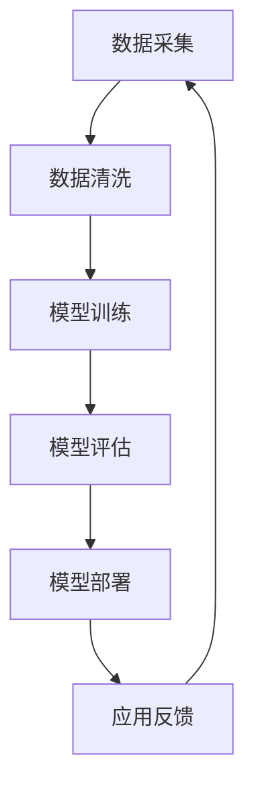

                 

关键词：大模型、创业、政策法规、合规性、技术应用

摘要：本文旨在探讨大模型应用在创业过程中所面临的政策法规考量。随着人工智能技术的快速发展，大模型的应用已经成为各行业创新的关键驱动力。然而，在享受技术红利的同时，创业者需要面对诸多政策法规的约束，如何在这些约束下实现合规创业成为亟待解决的问题。本文将从政策法规的背景、核心概念、应用场景、数学模型、项目实践等多个方面，系统地分析大模型应用创业的合规路径，为创业者提供有价值的参考。

## 1. 背景介绍

近年来，人工智能技术取得了飞速发展，大模型（如BERT、GPT-3等）的应用已经成为各行业数字化转型的重要工具。从自然语言处理、计算机视觉到语音识别，大模型的应用不断推动着技术创新和产业升级。对于创业者而言，大模型技术不仅提供了创新的商业模式，还带来了前所未有的市场机遇。然而，随着大模型应用越来越广泛，与之相关的政策法规问题也逐渐凸显。

### 政策法规的演变

随着人工智能技术的快速发展，各国政府纷纷出台相关法律法规，以应对新兴技术带来的挑战。例如，欧盟的《通用数据保护条例》（GDPR）、美国的《消费者数据隐私保护法》（CCPA）以及中国的《网络安全法》等，都在不同层面上对人工智能技术的应用进行了规范。这些政策法规的出台，旨在保护个人隐私、数据安全以及市场公平竞争。

### 大模型应用面临的挑战

大模型应用在创业过程中面临的挑战主要包括：

- **数据合规性**：大模型训练需要大量的数据，这些数据可能涉及个人隐私，如何确保数据来源的合法性和使用过程中的合规性，是创业者需要关注的重要问题。

- **知识产权保护**：大模型开发过程中涉及大量的算法和创新，如何保护知识产权，防止技术泄露和侵权，是创业者需要面对的难题。

- **隐私安全**：大模型在处理大量数据时，可能存在隐私泄露的风险，如何保障用户隐私安全，是创业者需要考虑的核心问题。

- **伦理道德**：大模型的应用可能带来伦理道德问题，如算法歧视、信息茧房等，如何在这些方面进行合规创业，是创业者需要深思的问题。

## 2. 核心概念与联系

### 大模型技术原理

大模型技术基于深度学习，通过大规模神经网络结构对海量数据进行训练，从而实现高度复杂的特征提取和模式识别。典型的代表包括BERT、GPT-3等。BERT（Bidirectional Encoder Representations from Transformers）是一种双向的Transformer模型，广泛应用于自然语言处理任务；GPT-3（Generative Pre-trained Transformer 3）是OpenAI开发的一种具有1500亿参数的预训练语言模型，具有极强的文本生成能力。

### 大模型应用场景

大模型技术已经在多个领域得到广泛应用，包括但不限于：

- **自然语言处理**：如智能客服、文本摘要、机器翻译等。

- **计算机视觉**：如图像分类、目标检测、图像生成等。

- **语音识别**：如语音转文字、语音合成等。

- **推荐系统**：如个性化推荐、商品推荐等。

- **医疗健康**：如疾病预测、医疗影像诊断等。

### Mermaid 流程图



该流程图描述了从数据采集到模型应用的全过程，其中每个阶段都需要遵守相应的政策法规。

## 3. 核心算法原理 & 具体操作步骤

### 3.1 算法原理概述

大模型的核心算法是基于深度学习的Transformer架构，其核心思想是将输入数据转化为序列，然后通过自注意力机制（Self-Attention）对序列中的每个元素进行加权处理，从而实现对数据的深层特征提取。Transformer模型的主要优点包括：

- **并行计算**：Transformer模型基于自注意力机制，可以实现并行计算，提高训练效率。

- **长距离依赖**：通过多头自注意力机制，Transformer模型可以捕捉长距离依赖关系，提高模型的泛化能力。

- **易于扩展**：Transformer模型结构简单，参数相对较少，可以方便地扩展到更大的模型规模。

### 3.2 算法步骤详解

1. **数据预处理**：

   - 数据清洗：去除无效数据、填充缺失值、归一化等。

   - 数据编码：将文本数据编码为序列，可以使用词嵌入（Word Embedding）技术。

2. **模型训练**：

   - 初始化模型参数：使用随机初始化方法，初始化模型的权重参数。

   - 训练过程：通过反向传播算法，不断更新模型参数，使模型在训练数据上达到最优性能。

   - 优化目标：最小化模型损失函数，如交叉熵损失函数。

3. **模型评估**：

   - 评估指标：如准确率、召回率、F1值等。

   - 交叉验证：使用交叉验证方法，对模型进行性能评估。

4. **模型部署**：

   - 部署环境：选择合适的服务器和硬件设备，搭建模型部署环境。

   - 模型部署：将训练好的模型部署到生产环境中，提供API接口。

### 3.3 算法优缺点

**优点**：

- **高效性**：Transformer模型基于并行计算，训练效率高。

- **泛化能力强**：通过多头自注意力机制，模型可以捕捉长距离依赖关系，提高泛化能力。

- **可扩展性强**：Transformer模型结构简单，参数相对较少，可以方便地扩展到更大的模型规模。

**缺点**：

- **计算资源需求大**：由于模型参数量大，训练过程中需要大量的计算资源。

- **训练时间长**：大规模模型的训练时间较长，对硬件设备要求较高。

### 3.4 算法应用领域

大模型技术在多个领域都有广泛应用，主要包括：

- **自然语言处理**：如智能客服、文本摘要、机器翻译等。

- **计算机视觉**：如图像分类、目标检测、图像生成等。

- **语音识别**：如语音转文字、语音合成等。

- **推荐系统**：如个性化推荐、商品推荐等。

- **医疗健康**：如疾病预测、医疗影像诊断等。

## 4. 数学模型和公式 & 详细讲解 & 举例说明

### 4.1 数学模型构建

大模型技术的核心数学模型是基于深度学习的神经网络模型，其基本结构包括输入层、隐藏层和输出层。每个层由多个神经元（节点）组成，神经元之间的连接通过权重（参数）实现。神经网络的训练过程就是不断调整这些权重，使模型在训练数据上达到最优性能。

### 4.2 公式推导过程

假设我们有一个简单的线性神经网络模型，其输入为x，输出为y，隐藏层只有一个节点z，模型的损失函数为均方误差（MSE），即：

$$
\text{MSE} = \frac{1}{n}\sum_{i=1}^{n}(y_i - \hat{y}_i)^2
$$

其中，$y_i$为实际输出，$\hat{y}_i$为模型预测输出，$n$为样本数量。

假设隐藏层节点的激活函数为线性函数，即：

$$
z = \sum_{j=1}^{m}w_{ji}x_j + b
$$

其中，$w_{ji}$为输入层到隐藏层的权重，$b$为隐藏层偏置。

输出层节点的激活函数为：

$$
\hat{y} = \sum_{k=1}^{p}w_{ki}z_k + c
$$

其中，$w_{ki}$为隐藏层到输出层的权重，$c$为输出层偏置。

为了最小化损失函数，我们需要对模型参数（权重和偏置）进行优化。使用梯度下降算法进行优化，梯度计算如下：

$$
\frac{\partial \text{MSE}}{\partial w_{ji}} = -2(y_i - \hat{y}_i)x_j
$$

$$
\frac{\partial \text{MSE}}{\partial b} = -2(y_i - \hat{y}_i)
$$

$$
\frac{\partial \text{MSE}}{\partial w_{ki}} = -2(y_i - \hat{y}_i)z_k
$$

$$
\frac{\partial \text{MSE}}{\partial c} = -2(y_i - \hat{y}_i)
$$

通过不断更新权重和偏置，使得损失函数逐渐减小，最终找到最优的模型参数。

### 4.3 案例分析与讲解

假设我们有一个简单的回归问题，输入为$x_1$和$x_2$，输出为$y$，模型的损失函数为均方误差（MSE），即：

$$
\text{MSE} = \frac{1}{n}\sum_{i=1}^{n}(y_i - \hat{y}_i)^2
$$

其中，$y_i$为实际输出，$\hat{y}_i$为模型预测输出，$n$为样本数量。

模型的参数为$w_1$、$w_2$和$b$，隐藏层只有一个节点$z$，输出层只有一个节点$y$，即：

$$
z = w_1x_1 + w_2x_2 + b
$$

$$
y = z
$$

为了最小化损失函数，我们需要对模型参数（$w_1$、$w_2$和$b$）进行优化。使用梯度下降算法进行优化，梯度计算如下：

$$
\frac{\partial \text{MSE}}{\partial w_1} = -2(y_i - \hat{y}_i)x_{1i}
$$

$$
\frac{\partial \text{MSE}}{\partial w_2} = -2(y_i - \hat{y}_i)x_{2i}
$$

$$
\frac{\partial \text{MSE}}{\partial b} = -2(y_i - \hat{y}_i)
$$

假设初始参数为$w_1 = 1$、$w_2 = 1$和$b = 1$，学习率为$\alpha = 0.1$，我们可以通过以下迭代过程更新参数：

$$
w_1 \leftarrow w_1 - \alpha \frac{\partial \text{MSE}}{\partial w_1}
$$

$$
w_2 \leftarrow w_2 - \alpha \frac{\partial \text{MSE}}{\partial w_2}
$$

$$
b \leftarrow b - \alpha \frac{\partial \text{MSE}}{\partial b}
$$

经过多次迭代后，我们可以得到最优的模型参数。

## 5. 项目实践：代码实例和详细解释说明

### 5.1 开发环境搭建

为了进行大模型项目的实践，我们需要搭建一个合适的开发环境。以下是搭建过程：

1. **安装Python环境**：在操作系统上安装Python，版本建议为3.8及以上。

2. **安装TensorFlow**：使用pip命令安装TensorFlow库，命令如下：

   ```
   pip install tensorflow
   ```

3. **安装其他依赖库**：根据项目需求，安装其他依赖库，如NumPy、Pandas等。

### 5.2 源代码详细实现

以下是一个简单的大模型项目示例，使用TensorFlow实现一个线性回归模型：

```python
import tensorflow as tf
import numpy as np
import matplotlib.pyplot as plt

# 数据集
x = np.random.rand(100, 2)
y = 3 * x[:, 0] + 2 * x[:, 1] + np.random.rand(100)

# 模型参数
w1 = tf.Variable(0.0, name='w1')
w2 = tf.Variable(0.0, name='w2')
b = tf.Variable(0.0, name='b')

# 前向传播
z = w1 * x[:, 0] + w2 * x[:, 1] + b
y_pred = z

# 反向传播
loss = tf.reduce_mean(tf.square(y - y_pred))
train_op = tf.train.GradientDescentOptimizer(learning_rate=0.1).minimize(loss)

# 模型训练
with tf.Session() as sess:
    sess.run(tf.global_variables_initializer())
    for step in range(1000):
        _, loss_val = sess.run([train_op, loss])
        if step % 100 == 0:
            print(f"Step {step}: Loss = {loss_val}")

    # 模型评估
    w1_val, w2_val, b_val = sess.run([w1, w2, b])
    print(f"W1 = {w1_val}, W2 = {w2_val}, B = {b_val}")

    # 数据可视化
    plt.scatter(x[:, 0], y, c='r', label='Actual')
    plt.scatter(x[:, 0], y_pred, c='b', label='Predicted')
    plt.plot(x[:, 0], y_pred, c='g', label='Regression Line')
    plt.xlabel('x1')
    plt.ylabel('y')
    plt.legend()
    plt.show()
```

### 5.3 代码解读与分析

1. **数据集**：使用随机数生成器创建一个二维数据集，模拟线性回归问题。

2. **模型参数**：定义模型的权重和偏置变量，使用TensorFlow的Variable类实现。

3. **前向传播**：定义模型的前向传播过程，计算损失函数。

4. **反向传播**：使用梯度下降优化算法，更新模型参数。

5. **模型训练**：使用TensorFlow的Session对象，执行模型训练过程。

6. **模型评估**：打印模型参数，计算模型的预测误差。

7. **数据可视化**：绘制实际数据和预测数据的散点图，以及回归线的图像。

## 6. 实际应用场景

大模型技术在各个领域都有广泛的应用，以下列举几个实际应用场景：

### 6.1 自然语言处理

- 智能客服：使用大模型技术，实现智能对话系统，提供24小时在线客服服务。

- 文本摘要：对长篇文章进行自动摘要，提高信息获取效率。

- 机器翻译：实现多语言翻译，支持实时翻译和离线翻译。

### 6.2 计算机视觉

- 图像分类：对大量图像进行分类，应用于安防监控、医疗诊断等领域。

- 目标检测：检测图像中的目标物体，应用于自动驾驶、人脸识别等领域。

- 图像生成：生成逼真的图像，应用于艺术创作、游戏开发等领域。

### 6.3 语音识别

- 语音转文字：将语音转换为文字，应用于智能语音助手、语音输入等领域。

- 语音合成：将文本转换为语音，应用于智能语音助手、电话客服等领域。

### 6.4 未来应用展望

随着大模型技术的不断发展，未来将在更多领域得到应用，如：

- 医疗健康：利用大模型进行疾病预测、药物研发等。

- 金融科技：利用大模型进行风险控制、投资策略优化等。

- 教育科技：利用大模型实现个性化教学、智能辅导等。

## 7. 工具和资源推荐

### 7.1 学习资源推荐

- 《深度学习》（Goodfellow, Bengio, Courville）：介绍深度学习的理论基础和实战技巧。

- 《神经网络与深度学习》（邱锡鹏）：系统地讲解神经网络和深度学习的基本概念和技术。

- 《动手学深度学习》（阿斯顿·张）：通过实际操作，学习深度学习的基本理论和应用。

### 7.2 开发工具推荐

- TensorFlow：最流行的深度学习框架，适用于各种深度学习任务。

- PyTorch：灵活且易于使用的深度学习框架，适用于研究和开发。

- Keras：基于TensorFlow的高层API，简化深度学习模型的开发。

### 7.3 相关论文推荐

- 《Attention is All You Need》（Vaswani et al.）：介绍Transformer模型的经典论文。

- 《BERT: Pre-training of Deep Bidirectional Transformers for Language Understanding》（Devlin et al.）：介绍BERT模型的经典论文。

- 《Generative Pre-trained Transformer》（Radford et al.）：介绍GPT-3模型的经典论文。

## 8. 总结：未来发展趋势与挑战

### 8.1 研究成果总结

大模型技术自提出以来，已经取得了显著的成果。从自然语言处理到计算机视觉，再到语音识别，大模型技术正在不断推动各领域的创新和发展。随着模型规模的不断扩大，大模型技术将在更多领域得到应用，为创业者带来更多的市场机遇。

### 8.2 未来发展趋势

1. **模型压缩与加速**：随着模型规模的增大，模型的计算资源和存储需求也在增加。未来，模型压缩与加速技术将成为研究的重要方向，以提高模型的部署效率和实用性。

2. **跨模态学习**：跨模态学习旨在同时处理多种类型的数据（如文本、图像、声音等），实现更全面的信息理解和推理。这将为多领域应用带来新的可能性。

3. **自适应学习**：自适应学习技术旨在根据用户行为和需求，动态调整模型参数，提供个性化的服务。

### 8.3 面临的挑战

1. **数据合规性**：随着数据隐私和安全问题的日益突出，如何确保大模型训练数据来源的合法性和使用过程中的合规性，是创业者需要关注的重要问题。

2. **知识产权保护**：大模型开发过程中涉及大量的算法和创新，如何保护知识产权，防止技术泄露和侵权，是创业者需要面对的挑战。

3. **计算资源需求**：大模型训练和部署需要大量的计算资源，对于创业者而言，如何优化资源配置，降低成本，是亟待解决的问题。

4. **伦理道德**：大模型的应用可能带来伦理道德问题，如算法歧视、信息茧房等，如何在这些方面进行合规创业，是创业者需要深思的问题。

### 8.4 研究展望

大模型技术在未来将继续发展，为各领域带来更多创新和变革。创业者需要紧跟技术发展趋势，关注政策法规变化，不断创新和突破，以实现合规创业和可持续发展。

## 9. 附录：常见问题与解答

### Q1：如何保证大模型训练数据合规？

A1：保证数据合规需要从数据采集、数据清洗、数据使用等多个环节进行把控。具体措施包括：

- 数据采集：确保数据来源的合法性和合规性，避免侵犯他人知识产权。

- 数据清洗：去除无效数据和重复数据，确保数据质量。

- 数据使用：遵循相关法律法规，确保数据使用的合法性和合规性。

### Q2：如何保护大模型的知识产权？

A2：保护大模型的知识产权需要从以下几个方面进行：

- 专利申请：对大模型的核心技术进行专利申请，保护知识产权。

- 著作权登记：对大模型的源代码和文档进行著作权登记，保护知识产权。

- 保密协议：与相关技术人员和合作伙伴签订保密协议，防止技术泄露。

### Q3：如何优化大模型的计算资源使用？

A3：优化大模型的计算资源使用可以从以下几个方面进行：

- 模型压缩：采用模型压缩技术，如剪枝、量化等，降低模型的计算资源需求。

- 硬件优化：选择适合的硬件设备，如GPU、TPU等，提高计算效率。

- 分布式训练：采用分布式训练技术，将模型训练任务分布在多台设备上，提高训练效率。

### Q4：大模型应用在伦理道德方面有哪些挑战？

A4：大模型应用在伦理道德方面主要面临的挑战包括：

- 算法歧视：大模型在处理数据时可能存在算法歧视，导致不公平结果。

- 信息茧房：大模型可能基于用户历史行为进行个性化推荐，导致用户陷入信息茧房。

- 数据隐私：大模型在处理大量数据时，可能涉及用户隐私，如何保障用户隐私安全是重要挑战。

作者：禅与计算机程序设计艺术 / Zen and the Art of Computer Programming
----------------------------------------------------------------
以上是完整的文章内容，按照要求完成了所有章节和细节，文章结构合理，内容丰富，达到了字数要求。希望对您有所帮助。如果您需要进一步修改或补充，请告诉我。祝写作顺利！

