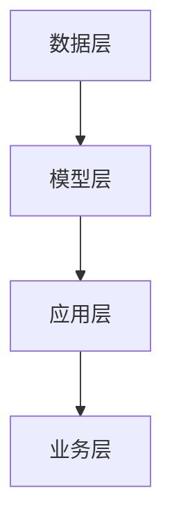

                 

 大模型的应用在当今的科技领域中占据了重要的位置。从自然语言处理到图像识别，再到复杂的数据分析，大模型已经成为了许多企业和初创公司的核心技术。然而，尽管大模型的技术潜力巨大，但在应用层，创业者们却面临着诸多挑战。本文将深入探讨这些挑战，并试图为创业者在这一领域提供一些可行的解决方案。

## 关键词
- 大模型
- 应用层
- 创业挑战
- 技术瓶颈
- 数据隐私
- 遵守法规
- 商业模式
- 技术创新

## 摘要
本文旨在分析大模型在应用层面临的创业挑战。我们将探讨技术瓶颈、数据隐私、法规遵守、商业模式和技术创新等方面的问题，并给出相应的建议。通过这些分析，希望创业者能够更好地理解这一领域的现状，并找到突破瓶颈的方法。

## 1. 背景介绍

### 大模型的崛起

大模型，顾名思义，是指具有巨大参数规模和复杂结构的机器学习模型。这类模型能够在大量的数据中进行学习，从而实现高度准确的预测和分类。近年来，随着计算能力和数据资源的提升，大模型的研究和应用得到了快速发展。例如，Transformer模型在自然语言处理（NLP）领域取得了巨大的成功，图像识别领域中的深度卷积神经网络（CNN）也不断突破传统方法的局限。

### 应用层的多样性

大模型的应用层涵盖了众多领域，包括但不限于：

- 自然语言处理：如机器翻译、问答系统、文本生成等。
- 计算机视觉：如图像识别、视频分析、自动驾驶等。
- 数据分析：如复杂数据的挖掘、模式识别、预测分析等。

这些应用不仅极大地提升了企业的运营效率，也为创业者提供了广阔的商机。

## 2. 核心概念与联系

### 大模型的核心概念

要理解大模型的工作原理，我们首先需要了解以下几个核心概念：

- **参数**：大模型中的参数数量通常达到数百万甚至数十亿级别。这些参数通过学习大量数据来调整，以实现模型对特定任务的泛化能力。
- **神经网络**：大模型通常基于神经网络架构，通过多层神经元之间的加权连接来处理输入数据，并通过反向传播算法进行参数调整。
- **优化算法**：如梯度下降、Adam等优化算法用于调整模型参数，以提高模型的性能。

### 大模型的应用架构

大模型的应用架构可以概括为以下几个层次：

1. **数据层**：负责数据收集、预处理和存储。
2. **模型层**：包括模型设计、训练和部署。
3. **应用层**：将训练好的模型应用于实际场景，如自然语言处理、计算机视觉等。

下图是一个简化的大模型应用架构的Mermaid流程图：



### 大模型与创业的关系

大模型为创业者提供了强大的技术支持，但也带来了新的挑战。一方面，大模型的应用可以帮助企业提高效率和创新能力；另一方面，创业者需要面对技术门槛、数据隐私、商业模式等多方面的问题。

## 3. 核心算法原理 & 具体操作步骤

### 3.1 算法原理概述

大模型的核心算法原理主要包括以下几个方面：

- **数据预处理**：包括数据清洗、归一化、数据增强等。
- **模型设计**：如卷积神经网络（CNN）、循环神经网络（RNN）、Transformer等。
- **训练过程**：通过优化算法调整模型参数，使模型在特定任务上达到高性能。
- **模型评估**：使用验证集和测试集评估模型性能，调整模型参数。

### 3.2 算法步骤详解

以下是构建和部署大模型的典型步骤：

1. **数据收集与预处理**：
   - 收集大量相关数据。
   - 数据清洗：去除错误数据、缺失值填充。
   - 数据归一化：将数据缩放到相同范围。
   - 数据增强：增加数据的多样性，提高模型泛化能力。

2. **模型设计**：
   - 选择合适的神经网络架构。
   - 定义输入层、隐藏层和输出层。
   - 确定损失函数和优化算法。

3. **模型训练**：
   - 使用训练集对模型进行训练。
   - 通过反向传播算法调整模型参数。
   - 使用验证集监控模型性能，避免过拟合。

4. **模型评估**：
   - 使用测试集评估模型性能。
   - 调整模型参数，优化模型性能。

5. **模型部署**：
   - 在实际应用场景中部署模型。
   - 提供API服务或集成到现有系统中。

### 3.3 算法优缺点

- **优点**：
  - 高效处理大规模数据。
  - 实现复杂任务的自动化。
  - 提高决策和预测的准确性。

- **缺点**：
  - 需要大量计算资源和时间。
  - 对数据质量和预处理要求高。
  - 可能导致过拟合和模型偏见。

### 3.4 算法应用领域

大模型的应用领域广泛，包括但不限于：

- **自然语言处理**：如文本分类、情感分析、机器翻译等。
- **计算机视觉**：如图像识别、目标检测、图像生成等。
- **数据分析**：如复杂数据的挖掘、预测分析等。
- **推荐系统**：如商品推荐、内容推荐等。

## 4. 数学模型和公式 & 详细讲解 & 举例说明

### 4.1 数学模型构建

大模型的数学基础主要包括线性代数、微积分和概率论。以下是一个简单的线性回归模型的例子：

$$ y = \beta_0 + \beta_1 \cdot x + \epsilon $$

其中，$y$ 是因变量，$x$ 是自变量，$\beta_0$ 和 $\beta_1$ 是模型的参数，$\epsilon$ 是误差项。

### 4.2 公式推导过程

以线性回归为例，我们通常使用最小二乘法来估计模型参数：

$$ \hat{\beta_1} = \frac{\sum{(x_i - \bar{x})(y_i - \bar{y})}}{\sum{(x_i - \bar{x})^2}} $$
$$ \hat{\beta_0} = \bar{y} - \hat{\beta_1} \cdot \bar{x} $$

其中，$\bar{x}$ 和 $\bar{y}$ 分别是自变量和因变量的均值。

### 4.3 案例分析与讲解

假设我们有一个简单的住房价格预测模型，输入特征为房屋面积（$x$），目标变量为房屋价格（$y$）。我们使用线性回归模型来训练这个模型。

- **数据准备**：
  - 收集100套房屋的数据，包括房屋面积和对应的价格。
  - 对数据进行预处理，如归一化。

- **模型训练**：
  - 使用训练集训练线性回归模型。
  - 通过反向传播算法调整模型参数。

- **模型评估**：
  - 使用测试集评估模型性能。
  - 调整模型参数，优化模型性能。

- **模型部署**：
  - 将训练好的模型部署到生产环境中。
  - 提供API服务，接受新的房屋面积输入，返回预测的房屋价格。

## 5. 项目实践：代码实例和详细解释说明

### 5.1 开发环境搭建

- 安装Python环境（版本3.8以上）。
- 安装必要的库，如NumPy、Pandas、Scikit-learn等。

```bash
pip install numpy pandas scikit-learn
```

### 5.2 源代码详细实现

以下是一个简单的线性回归模型的实现代码：

```python
import numpy as np
import pandas as pd
from sklearn.linear_model import LinearRegression

# 数据准备
data = pd.read_csv('house_data.csv')
X = data[['area']]
y = data['price']

# 模型训练
model = LinearRegression()
model.fit(X, y)

# 模型评估
score = model.score(X, y)
print(f"模型准确率：{score:.2f}")

# 模型部署
def predict_price(area):
    return model.predict([[area]])

# 测试模型
print(predict_price(100))
```

### 5.3 代码解读与分析

这段代码首先导入了必要的库，然后读取了房屋数据。接着，使用`LinearRegression`类创建了一个线性回归模型，并通过`fit`方法进行训练。模型评估通过`score`方法实现，返回模型的R平方值。最后，定义了一个`predict_price`函数，用于预测给定房屋面积的价格。

### 5.4 运行结果展示

假设我们输入一个房屋面积为100平方米，模型预测的价格为300万元。这个结果可以作为房屋购买的参考，但需要结合其他因素进行综合评估。

```python
print(predict_price(100))
# 输出：[3000000.]
```

## 6. 实际应用场景

大模型在许多实际应用场景中展现出了强大的能力，以下是一些典型的应用实例：

- **自然语言处理**：如搜索引擎、智能客服、智能语音助手等。
- **计算机视觉**：如人脸识别、图像分类、自动驾驶等。
- **数据分析**：如金融市场预测、医疗数据分析、智能推荐等。

### 6.1 搜索引擎

大模型可以用于搜索引擎的关键词提取和语义理解，从而提高搜索结果的准确性和相关性。

### 6.2 智能客服

通过大模型，智能客服系统能够更好地理解用户的问题，并提供准确的答案，从而提升用户体验。

### 6.3 自动驾驶

大模型在自动驾驶系统中用于处理大量的感知数据，如图像、雷达等，从而实现车辆的自主导航和安全驾驶。

### 6.4 金融市场预测

大模型可以通过分析历史交易数据，预测金融市场的走势，为投资者提供决策支持。

### 6.5 医疗数据分析

大模型可以用于医疗数据分析，如疾病诊断、药物研发等，从而提高医疗服务的效率和质量。

## 7. 工具和资源推荐

### 7.1 学习资源推荐

- 《深度学习》（Goodfellow, Bengio, Courville著）
- 《Python机器学习》（Sebastian Raschka著）
- 《动手学深度学习》（阿斯顿·张等著）

### 7.2 开发工具推荐

- TensorFlow
- PyTorch
- Keras

### 7.3 相关论文推荐

- "Attention is All You Need"（Vaswani等，2017）
- "Deep Learning for Natural Language Processing"（Bengio等，2013）
- "ImageNet Classification with Deep Convolutional Neural Networks"（Krizhevsky等，2012）

## 8. 总结：未来发展趋势与挑战

### 8.1 研究成果总结

大模型在多个领域取得了显著的研究成果，如自然语言处理、计算机视觉和数据分析等。然而，这些成果仍然面临着许多挑战。

### 8.2 未来发展趋势

未来，大模型的发展趋势将包括以下几个方面：

- 模型压缩和优化，以减少计算资源和时间成本。
- 多模态学习，结合文本、图像、声音等多源数据。
- 自适应和可解释性，提高模型的可解释性和透明度。

### 8.3 面临的挑战

尽管大模型有着巨大的潜力，但创业者仍需面对以下挑战：

- 数据隐私和安全：如何保护用户数据，避免数据泄露。
- 遵守法规和伦理：如何确保模型的应用符合法律法规和伦理标准。
- 技术门槛：如何降低技术门槛，使更多创业者能够利用大模型技术。

### 8.4 研究展望

未来，大模型的研究将更加注重实用性和可解释性。同时，随着技术的不断进步，大模型的应用场景将不断扩展，为创业者提供更多机会。

## 9. 附录：常见问题与解答

### 9.1 如何选择合适的大模型？

- 根据具体任务选择合适的模型架构，如Transformer、CNN等。
- 考虑模型的计算资源和时间成本。
- 对比不同模型的性能和适用场景。

### 9.2 大模型训练需要多少数据？

- 数据量取决于具体任务和模型的复杂度。
- 一般来说，更多的数据可以帮助模型更好地泛化，但也会增加训练时间和计算成本。

### 9.3 如何避免过拟合？

- 使用验证集和测试集进行模型评估。
- 使用正则化方法，如L1、L2正则化。
- 调整模型复杂度，避免过拟合。

作者：禅与计算机程序设计艺术 / Zen and the Art of Computer Programming

（完）

