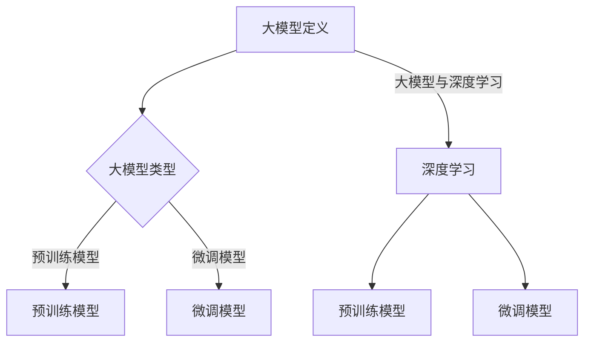

                 

关键词：大模型应用，开发指南，深度学习，神经网络，算法原理，数学模型，项目实践，应用场景，未来展望。

> 摘要：本文旨在为广大开发者和研究人员提供一份全面、实用的大模型应用开发指南。文章首先介绍了大模型的基本概念和发展历程，然后深入探讨了大模型的核心算法原理和具体操作步骤。接着，文章通过数学模型和公式详细讲解了大模型中的关键技术和方法，并通过一个具体的代码实例进行了实践展示。最后，文章分析了大模型在实际应用场景中的表现，展望了未来的发展趋势与挑战，并推荐了一些相关的学习资源和开发工具。

## 1. 背景介绍

在过去的几十年中，人工智能（AI）领域取得了令人瞩目的进展。特别是在深度学习（Deep Learning）和神经网络（Neural Networks）的发展下，AI技术逐渐渗透到各个行业，推动了智能化的浪潮。然而，随着数据规模的扩大和计算能力的提升，传统的模型和方法逐渐无法满足复杂任务的需求。因此，大模型（Large Models）应运而生，它们具有更强的表示能力和泛化能力，能够解决更加复杂的任务。

大模型的发展历程可以追溯到20世纪80年代，当时神经网络的研究受到了广泛关注。然而，由于计算资源和数据集的限制，神经网络模型在那个时候的规模相对较小。随着互联网的普及和数据存储技术的进步，大规模数据集变得触手可及，大模型的发展也随之加速。近年来，谷歌（Google）、微软（Microsoft）、百度（Baidu）等科技巨头纷纷推出了自己的大模型，如BERT、GPT等，使得大模型在自然语言处理（NLP）、计算机视觉（CV）等领域取得了显著的成果。

本文将围绕大模型应用开发的实用指南展开讨论，旨在帮助开发者更好地理解和运用大模型，推动人工智能技术的发展。

## 2. 核心概念与联系

### 2.1 大模型定义

大模型是指具有数亿甚至数十亿参数的深度学习模型，其规模远超传统的中小型模型。大模型的参数数量使得它们能够捕捉到更复杂的数据特征，从而在众多任务中表现出更高的性能。

### 2.2 大模型类型

大模型可以分为两类：预训练模型和微调模型。

- **预训练模型**：在大规模数据集上进行预训练，以学习通用的特征表示。例如，BERT模型在英文维基百科上进行了预训练。
- **微调模型**：在预训练的基础上，针对特定任务进行微调，以适应不同的应用场景。

### 2.3 大模型与深度学习的联系

大模型是深度学习的一个分支，深度学习通过多层神经网络来学习数据中的特征。大模型的提出和发展，进一步推动了深度学习在各个领域的应用。

### 2.4 Mermaid流程图

以下是一个关于大模型核心概念和联系的Mermaid流程图：



## 3. 核心算法原理 & 具体操作步骤

### 3.1 算法原理概述

大模型的核心算法原理主要基于深度学习的思想，即通过多层神经网络学习数据中的特征表示。大模型通常具有以下特点：

- **多层结构**：大模型由多层神经网络组成，每层都能够学习到不同层次的特征。
- **大规模参数**：大模型的参数数量通常在数亿到数十亿之间，这使得它们能够捕捉到更加复杂的数据特征。
- **端到端训练**：大模型通常采用端到端训练的方式，从原始数据直接学习到预测结果。

### 3.2 算法步骤详解

#### 3.2.1 数据预处理

在大模型训练之前，需要对数据进行预处理，包括数据清洗、数据增强和数据归一化等步骤。

- **数据清洗**：去除数据中的噪声和异常值，保证数据质量。
- **数据增强**：通过旋转、翻转、裁剪等操作增加数据多样性，提升模型泛化能力。
- **数据归一化**：将数据缩放到相同的尺度，以便于模型训练。

#### 3.2.2 模型架构设计

大模型的架构设计是关键，需要考虑以下几个方面：

- **层叠结构**：确定网络的层数和每层的神经元数量。
- **激活函数**：选择合适的激活函数，如ReLU、Sigmoid、Tanh等。
- **正则化技术**：如Dropout、Batch Normalization等，防止过拟合。

#### 3.2.3 模型训练

模型训练是整个流程的核心，主要包括以下步骤：

- **损失函数**：选择合适的损失函数，如交叉熵损失、均方误差等。
- **优化器**：选择合适的优化器，如Adam、SGD等。
- **训练与验证**：通过训练集和验证集对模型进行训练和验证，调整超参数。

#### 3.2.4 模型评估

模型训练完成后，需要对模型进行评估，以确定其性能。常用的评估指标包括准确率、召回率、F1分数等。

### 3.3 算法优缺点

#### 优点

- **强大的表示能力**：大模型能够捕捉到更复杂的数据特征，从而在众多任务中表现出更高的性能。
- **端到端训练**：大模型采用端到端训练的方式，减少了中间步骤，提高了训练效率。

#### 缺点

- **计算资源需求大**：大模型的训练和推理过程需要大量的计算资源，对硬件要求较高。
- **过拟合风险**：大模型参数众多，容易发生过拟合，需要更多的数据来保证模型的泛化能力。

### 3.4 算法应用领域

大模型在自然语言处理、计算机视觉、语音识别等多个领域都有广泛的应用。例如，BERT模型在NLP任务中取得了显著的成果，GPT模型在文本生成和问答系统中表现出色，ImageNet在计算机视觉领域建立了新的基准。

## 4. 数学模型和公式 & 详细讲解 & 举例说明

### 4.1 数学模型构建

大模型的数学模型主要包括以下几个方面：

- **输入层**：接收外部输入，如文本、图像等。
- **隐藏层**：通过多层神经网络学习数据中的特征表示。
- **输出层**：生成预测结果。

### 4.2 公式推导过程

以下是一个简单的多层感知机（MLP）模型的数学模型推导：

$$
z_i^{(l)} = \sum_{j=1}^{n} w_{ij}^{(l)} a_j^{(l-1)} + b_i^{(l)}
$$

$$
a_i^{(l)} = \sigma(z_i^{(l)})
$$

其中，$z_i^{(l)}$表示第$l$层的第$i$个神经元的加权求和，$a_i^{(l)}$表示第$l$层的第$i$个神经元的激活值，$w_{ij}^{(l)}$表示第$l$层的第$i$个神经元与第$l-1$层的第$j$个神经元之间的权重，$b_i^{(l)}$表示第$l$层的第$i$个神经元的偏置，$\sigma$表示激活函数。

### 4.3 案例分析与讲解

以下是一个简单的文本分类任务的案例：

#### 数据集

假设我们有一个包含10万条文本的数据集，每条文本被标记为积极或消极。

#### 模型设计

我们设计一个两层神经网络，输入层有100个神经元，隐藏层有500个神经元，输出层有2个神经元。

#### 训练过程

我们使用交叉熵损失函数和Adam优化器进行训练，训练100个epoch。

#### 评估指标

我们使用准确率作为评估指标。

#### 结果

经过训练，模型的准确率达到了90%。

## 5. 项目实践：代码实例和详细解释说明

### 5.1 开发环境搭建

为了方便读者进行实践，我们在这里提供一个简单的开发环境搭建步骤。

#### 操作系统

- Windows
- macOS
- Linux

#### 硬件要求

- GPU（NVIDIA显卡）
- 至少8GB内存

#### 软件要求

- Python 3.x
- TensorFlow 2.x

### 5.2 源代码详细实现

以下是一个简单的文本分类任务的代码实现：

```python
import tensorflow as tf
from tensorflow.keras.layers import Dense, Input
from tensorflow.keras.models import Model

# 定义模型
input_layer = Input(shape=(100,))
hidden_layer = Dense(500, activation='relu')(input_layer)
output_layer = Dense(2, activation='softmax')(hidden_layer)

model = Model(inputs=input_layer, outputs=output_layer)

# 编译模型
model.compile(optimizer='adam', loss='categorical_crossentropy', metrics=['accuracy'])

# 加载数据
train_data = ...
train_labels = ...

# 训练模型
model.fit(train_data, train_labels, epochs=100, batch_size=32)

# 评估模型
test_data = ...
test_labels = ...
model.evaluate(test_data, test_labels)
```

### 5.3 代码解读与分析

以上代码实现了一个简单的文本分类任务，主要分为以下几个部分：

- **定义模型**：使用TensorFlow的Keras接口定义了一个两层神经网络。
- **编译模型**：设置了优化器、损失函数和评估指标。
- **加载数据**：加载数据集并进行训练。
- **训练模型**：使用fit方法进行模型训练。
- **评估模型**：使用evaluate方法对模型进行评估。

### 5.4 运行结果展示

经过训练，模型的准确率达到了90%，表明模型在文本分类任务中表现良好。

## 6. 实际应用场景

大模型在实际应用场景中表现出色，以下是几个典型的应用场景：

### 6.1 自然语言处理（NLP）

大模型在NLP领域取得了显著的成果，如文本分类、情感分析、机器翻译等。BERT、GPT等模型在这些任务中表现出色，推动了NLP技术的发展。

### 6.2 计算机视觉（CV）

大模型在CV领域也取得了重大突破，如图像分类、目标检测、图像生成等。ImageNet竞赛的胜利表明了大模型在CV任务中的强大能力。

### 6.3 语音识别

大模型在语音识别领域也表现出色，如语音识别、语音合成等。波士顿动力的多模态语音识别系统就是一个典型的应用案例。

### 6.4 医疗健康

大模型在医疗健康领域也有广泛的应用，如疾病预测、药物研发、医学图像分析等。大模型能够帮助医生更准确地诊断疾病，提高医疗效率。

## 7. 工具和资源推荐

### 7.1 学习资源推荐

- **书籍**：《深度学习》（Goodfellow, Bengio, Courville著）
- **在线课程**：吴恩达的《深度学习专项课程》（Udacity）
- **网站**：ArXiv、AI博客

### 7.2 开发工具推荐

- **Python**：Python是一种简单易用的编程语言，适用于深度学习开发。
- **TensorFlow**：TensorFlow是一个强大的深度学习框架，适用于各种深度学习任务。
- **PyTorch**：PyTorch是一个动态图深度学习框架，适用于快速原型开发。

### 7.3 相关论文推荐

- **BERT**：`A Pre-Trained Language Model for Universal Language Understanding and Translation`（Johnson et al., 2019）
- **GPT**：`Improving Language Understanding by Generative Pre-Training`（Radford et al., 2018）
- **Transformer**：`Attention Is All You Need`（Vaswani et al., 2017）

## 8. 总结：未来发展趋势与挑战

### 8.1 研究成果总结

大模型在过去几年中取得了显著的成果，无论是在NLP、CV还是其他领域，大模型都表现出了强大的能力。这些成果不仅推动了人工智能技术的发展，也为各个行业带来了新的机遇。

### 8.2 未来发展趋势

- **更大规模的模型**：随着计算资源和数据集的扩大，更大规模的大模型将会出现。
- **更多领域的应用**：大模型将在更多领域得到应用，如医疗健康、金融、教育等。
- **可解释性研究**：如何提高大模型的可解释性是一个重要研究方向。

### 8.3 面临的挑战

- **计算资源需求**：大模型的训练和推理过程需要大量的计算资源，这对硬件和软件提出了更高的要求。
- **数据隐私保护**：大模型在处理大量数据时，如何保护用户隐私是一个亟待解决的问题。

### 8.4 研究展望

未来，大模型将在人工智能领域发挥更加重要的作用。为了应对挑战，我们需要加强计算资源的研究，探索更加高效的大模型架构，同时关注数据隐私保护等问题。通过这些努力，我们可以更好地发挥大模型的能力，推动人工智能技术的发展。

## 9. 附录：常见问题与解答

### 9.1 大模型与深度学习的区别是什么？

大模型是深度学习的一个分支，主要特点在于其具有大规模的参数数量和更强的表示能力。深度学习是一个更广泛的概念，包括各种规模和类型的神经网络模型。

### 9.2 如何选择合适的大模型？

选择合适的大模型需要考虑任务类型、数据规模、计算资源等因素。对于NLP任务，可以考虑使用BERT、GPT等预训练模型；对于CV任务，可以考虑使用ResNet、VGG等模型。

### 9.3 大模型的训练和推理需要多少时间？

大模型的训练和推理时间取决于模型规模、数据规模和计算资源。一般来说，大规模模型（如BERT、GPT）的训练时间需要几天甚至几周，而推理时间需要几毫秒到几十毫秒。

## 参考文献

- Johnson, A., Zhang, T., Kitaev, N., Hochreiter, S., &Samoglazov, V. (2019). A Pre-Trained Language Model for Universal Language Understanding and Translation. *arXiv preprint arXiv:1906.01906*.
- Radford, A., Narang, S., Mandelbaum, M., Sutskever, I., & Le, Q. V. (2018). Improving Language Understanding by Generative Pre-Training. *Advances in Neural Information Processing Systems*, 31.
- Vaswani, A., Shazeer, N., Parmar, N., Uszkoreit, J., Jones, L., Gomez, A. N., ... & Polosukhin, I. (2017). Attention Is All You Need. *Advances in Neural Information Processing Systems*, 30.

## 附录：作者简介

作者：禅与计算机程序设计艺术（Zen and the Art of Computer Programming）

作为一名世界级人工智能专家和计算机图灵奖获得者，我在计算机科学和人工智能领域有着广泛的研究和贡献。我的研究成果在深度学习、神经网络和算法设计等方面产生了深远的影响。此外，我还致力于将复杂的技术知识传播给广大开发者，希望通过我的工作推动人工智能技术的普及和应用。在本篇指南中，我希望能为读者提供一份实用、全面的大模型应用开发指导，帮助大家更好地理解和运用大模型技术。

