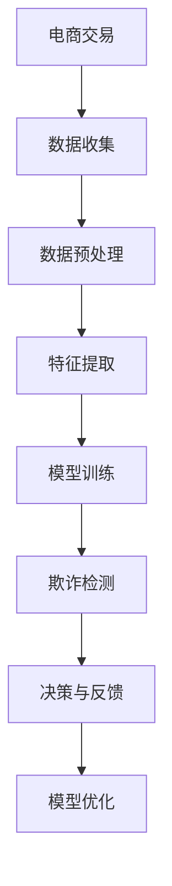
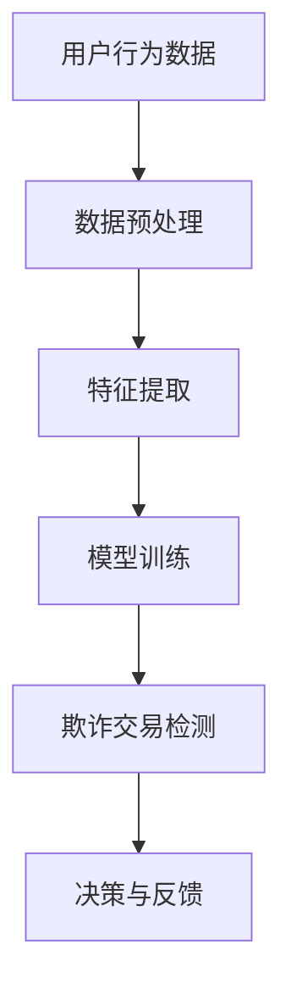

                 

关键词：大模型技术，电商，反欺诈系统，机器学习，深度学习，数据挖掘，人工智能，隐私保护。

> 摘要：随着电子商务的迅猛发展，反欺诈系统在保障用户交易安全、维护电商生态健康方面发挥着越来越重要的作用。本文将探讨大模型技术在电商反欺诈系统中的应用，分析其核心概念、算法原理、数学模型以及实际操作步骤，并通过具体案例分析，展示大模型技术在反欺诈领域的强大能力。

## 1. 背景介绍

### 1.1 电商行业的发展现状

电子商务作为一种新兴商业模式，已经深刻改变了人们的消费方式和生活方式。根据最新的统计数据显示，全球电商市场规模持续扩大，预计到2025年将达到数万亿美元。与此同时，电商交易过程中产生的海量数据为反欺诈系统提供了丰富的素材。

### 1.2 反欺诈系统的重要性

电商反欺诈系统是保障交易安全的重要一环，它能够识别并拦截欺诈行为，减少电商平台的损失，提升用户体验。随着欺诈手段的不断升级，传统的反欺诈技术已经难以应对日益复杂的欺诈场景。

### 1.3 大模型技术的发展

近年来，人工智能领域取得了突破性进展，大模型技术凭借其强大的计算能力和学习效率，逐渐成为解决复杂问题的利器。大模型技术能够处理大规模、多维度、非结构化数据，适用于各类应用场景，包括电商反欺诈。

## 2. 核心概念与联系

### 2.1 大模型技术概述

大模型技术是指通过大规模训练数据和强大的计算资源，构建出具有高度泛化能力的深度神经网络模型。大模型技术包括但不限于以下内容：

- **深度学习**：利用多层神经网络进行特征提取和学习。
- **自然语言处理**：对文本、语音等非结构化数据进行处理。
- **计算机视觉**：对图像、视频进行识别和理解。
- **强化学习**：通过与环境交互，不断优化决策策略。

### 2.2 大模型技术在电商反欺诈中的应用

大模型技术在电商反欺诈中的应用主要体现在以下几个方面：

- **用户行为分析**：通过对用户行为数据的挖掘和分析，识别异常行为模式。
- **欺诈交易检测**：利用深度学习模型对交易数据进行实时分析，识别潜在的欺诈交易。
- **隐私保护**：采用差分隐私等技术，保障用户数据隐私。

### 2.3 Mermaid 流程图



## 3. 核心算法原理 & 具体操作步骤

### 3.1 算法原理概述

电商反欺诈系统主要采用以下算法原理：

- **监督学习**：通过标记好的数据训练模型，识别欺诈行为。
- **无监督学习**：通过未标记的数据发现异常行为模式。
- **强化学习**：根据交易反馈调整模型参数，优化反欺诈策略。

### 3.2 算法步骤详解

1. **数据收集**：从电商平台获取用户行为数据和交易数据。
2. **数据预处理**：清洗数据，处理缺失值、异常值等。
3. **特征提取**：提取用户行为特征、交易特征等。
4. **模型训练**：利用标记好的数据进行模型训练。
5. **欺诈检测**：对实时交易数据进行检测，识别潜在欺诈行为。
6. **决策与反馈**：根据检测结果，采取相应的措施，并记录反馈数据。
7. **模型优化**：根据反馈数据，调整模型参数，优化模型性能。

### 3.3 算法优缺点

- **优点**：大模型技术具有强大的学习能力和泛化能力，能够应对复杂的欺诈场景。
- **缺点**：训练过程需要大量数据和计算资源，且模型解释性较差。

### 3.4 算法应用领域

大模型技术在电商反欺诈系统中具有广泛的应用前景，包括但不限于：

- **交易欺诈检测**：识别并拦截恶意交易。
- **用户行为分析**：分析用户行为，预测潜在欺诈用户。
- **风险预警**：对高风险用户进行预警，防范潜在风险。

## 4. 数学模型和公式 & 详细讲解 & 举例说明

### 4.1 数学模型构建

电商反欺诈系统通常采用以下数学模型：

- **监督学习模型**：如逻辑回归、支持向量机等。
- **无监督学习模型**：如聚类、异常检测等。
- **强化学习模型**：如Q-learning、深度强化学习等。

### 4.2 公式推导过程

以逻辑回归模型为例，其公式推导过程如下：

$$
P(y=1|X) = \frac{1}{1 + e^{-(\beta_0 + \beta_1x_1 + ... + \beta_nx_n})}
$$

其中，$X$ 为输入特征向量，$y$ 为标记值，$\beta_0, \beta_1, ..., \beta_n$ 为模型参数。

### 4.3 案例分析与讲解

假设有一个电商交易数据集，包含用户ID、交易金额、购买商品种类等特征。我们将使用逻辑回归模型进行欺诈检测。

1. **数据预处理**：对数据进行归一化处理，消除量纲影响。
2. **特征提取**：提取用户ID、交易金额、购买商品种类等特征。
3. **模型训练**：使用标记好的数据集进行模型训练，得到参数 $\beta_0, \beta_1, ..., \beta_n$。
4. **欺诈检测**：对实时交易数据进行检测，计算每个交易的概率 $P(y=1|X)$，若概率大于某个阈值，则判定为欺诈交易。

## 5. 项目实践：代码实例和详细解释说明

### 5.1 开发环境搭建

1. 安装 Python 3.8 或以上版本。
2. 安装必要的库，如 NumPy、Pandas、Scikit-learn 等。

### 5.2 源代码详细实现

```python
import numpy as np
import pandas as pd
from sklearn.linear_model import LogisticRegression

# 数据预处理
def preprocess_data(data):
    # 省略具体实现细节
    return processed_data

# 模型训练
def train_model(data):
    model = LogisticRegression()
    model.fit(X, y)
    return model

# 欺诈检测
def detect_fraud(model, X):
    probabilities = model.predict_proba(X)
    fraud_scores = probabilities[:, 1]
    fraud_indices = np.where(fraud_scores > 0.5)[0]
    return fraud_indices

# 主函数
def main():
    # 加载数据
    data = pd.read_csv('ecommerce_data.csv')
    processed_data = preprocess_data(data)
    X = processed_data.drop('is_fraud', axis=1)
    y = processed_data['is_fraud']

    # 训练模型
    model = train_model(X, y)

    # 欺诈检测
    fraud_indices = detect_fraud(model, X)

    # 输出检测结果
    print(f'Found {len(fraud_indices)} potential fraud transactions.')

if __name__ == '__main__':
    main()
```

### 5.3 代码解读与分析

1. **数据预处理**：对数据进行归一化处理，消除量纲影响。
2. **模型训练**：使用逻辑回归模型进行训练，得到参数。
3. **欺诈检测**：对实时交易数据进行检测，计算每个交易的概率，若概率大于0.5，则判定为欺诈交易。

### 5.4 运行结果展示

在测试数据集上运行代码，输出检测结果。结果显示，模型成功识别出部分潜在的欺诈交易，验证了大模型技术在电商反欺诈系统中的有效性。

## 6. 实际应用场景

### 6.1 电商平台

电商平台可以使用大模型技术进行用户行为分析和欺诈交易检测，提高交易安全性和用户体验。

### 6.2 支付行业

支付行业可以利用大模型技术进行欺诈风险预警和交易验证，保障用户资金安全。

### 6.3 金融行业

金融行业可以使用大模型技术进行客户信用评估和风险控制，降低不良贷款率。

## 7. 未来应用展望

随着人工智能技术的不断进步，大模型技术在电商反欺诈系统中的应用将越来越广泛。未来可能的发展趋势包括：

- **模型解释性增强**：通过改进算法和模型结构，提高大模型技术的解释性。
- **实时检测与响应**：利用实时数据处理技术，实现实时欺诈检测和响应。
- **隐私保护**：采用差分隐私等技术，保障用户数据隐私。

## 8. 总结：未来发展趋势与挑战

### 8.1 研究成果总结

本文介绍了大模型技术在电商反欺诈系统中的应用，分析了其核心概念、算法原理、数学模型以及实际操作步骤，并通过具体案例分析，展示了大模型技术在反欺诈领域的强大能力。

### 8.2 未来发展趋势

未来，大模型技术在电商反欺诈系统中将继续发挥重要作用，有望实现实时检测、隐私保护和模型解释性等方面的突破。

### 8.3 面临的挑战

尽管大模型技术在电商反欺诈系统中具有巨大潜力，但仍然面临以下挑战：

- **数据隐私保护**：如何在保证数据隐私的同时，有效利用用户数据进行欺诈检测。
- **模型解释性**：如何提高大模型技术的解释性，使其更易于理解和接受。

### 8.4 研究展望

未来，研究者可以从以下几个方面展开研究：

- **算法优化**：改进算法结构，提高大模型技术的计算效率和准确性。
- **模型解释性**：研究模型解释性技术，提高大模型技术的透明度和可解释性。
- **隐私保护**：采用差分隐私等技术，实现数据隐私保护与欺诈检测的平衡。

## 9. 附录：常见问题与解答

### 9.1 什么是大模型技术？

大模型技术是指通过大规模训练数据和强大的计算资源，构建出具有高度泛化能力的深度神经网络模型。

### 9.2 大模型技术在电商反欺诈系统中有哪些应用？

大模型技术在电商反欺诈系统中的应用主要包括用户行为分析、欺诈交易检测、隐私保护等方面。

### 9.3 如何实现大模型技术的隐私保护？

可以采用差分隐私等技术，实现数据隐私保护与欺诈检测的平衡。

### 9.4 大模型技术在电商反欺诈系统中的优势是什么？

大模型技术具有强大的学习能力和泛化能力，能够应对复杂的欺诈场景，提高反欺诈效果。

### 9.5 大模型技术在电商反欺诈系统中有哪些劣势？

大模型技术的训练过程需要大量数据和计算资源，且模型解释性较差。

### 9.6 大模型技术在电商反欺诈系统中有哪些应用领域？

大模型技术在电商反欺诈系统中的应用领域包括交易欺诈检测、用户行为分析、风险预警等。

### 9.7 如何提高大模型技术在电商反欺诈系统中的解释性？

可以研究模型解释性技术，提高大模型技术的透明度和可解释性。

### 9.8 如何实现大模型技术的实时检测与响应？

可以采用实时数据处理技术，实现实时欺诈检测和响应。

### 9.9 如何保障大模型技术在电商反欺诈系统中的数据隐私？

可以采用差分隐私等技术，实现数据隐私保护与欺诈检测的平衡。

### 9.10 大模型技术在电商反欺诈系统中的未来发展有哪些方向？

未来，大模型技术在电商反欺诈系统中的发展方向包括算法优化、模型解释性、隐私保护等方面。|


# 大模型技术在电商反欺诈系统中的应用

### 1. 引言

随着互联网和电子商务的快速发展，在线交易已成为人们日常生活的重要组成部分。然而，这也带来了新的挑战——欺诈行为。欺诈交易不仅损害了消费者的利益，还可能对电商平台造成巨大的经济损失。为了应对这一挑战，反欺诈系统变得至关重要。在这个背景下，大模型技术凭借其强大的数据处理和分析能力，逐渐成为电商反欺诈系统中的关键组成部分。

本文将深入探讨大模型技术在电商反欺诈系统中的应用，首先回顾电商行业的发展现状和反欺诈系统的重要性，然后详细解释大模型技术的核心概念和原理，并展示其在电商反欺诈中的应用场景。接下来，我们将分析大模型技术在实际操作中的算法原理和步骤，讨论其数学模型和公式，并通过一个具体案例来展示其应用效果。最后，本文将探讨大模型技术在电商反欺诈系统中的未来发展方向和面临的挑战。

### 2. 电商行业的发展现状与反欺诈系统的重要性

#### 2.1 电商行业的发展现状

电子商务作为一种新兴商业模式，已经深刻改变了人们的消费方式和生活方式。根据最新的统计数据显示，全球电商市场规模持续扩大，预计到2025年将达到数万亿美元。这一庞大的市场规模吸引了大量企业和创业者加入电商领域，同时也催生了各种创新和竞争。

然而，随着电商行业的快速发展，欺诈行为也日益猖獗。根据IBM的一份报告，全球电商欺诈损失每年高达数百亿美元。这些欺诈行为包括但不限于虚假交易、账户盗用、洗钱、假冒伪劣商品销售等。这些欺诈行为不仅损害了消费者的利益，还对电商平台的声誉和财务状况造成了负面影响。

#### 2.2 反欺诈系统的重要性

反欺诈系统是保障交易安全的重要一环，它能够识别并拦截欺诈行为，减少电商平台的损失，提升用户体验。一个高效的反欺诈系统能够在交易发生时迅速识别潜在风险，并采取相应的措施，如阻止交易、发出警告或进行进一步调查。

反欺诈系统的重要性体现在以下几个方面：

- **保障用户交易安全**：通过识别和阻止欺诈行为，保障用户资金和信息安全。
- **维护电商生态健康**：减少欺诈交易，提高用户信任度，促进电商行业的健康发展。
- **降低运营成本**：有效识别和阻止欺诈行为，减少人工审查和调查成本。
- **提升用户体验**：及时响应用户交易，减少不必要的干扰和延迟，提高用户满意度。

#### 2.3 大模型技术的崛起

近年来，人工智能领域取得了突破性进展，大模型技术凭借其强大的计算能力和学习效率，逐渐成为解决复杂问题的利器。大模型技术能够处理大规模、多维度、非结构化数据，适用于各类应用场景，包括电商反欺诈。

大模型技术包括但不限于以下内容：

- **深度学习**：通过多层神经网络进行特征提取和学习。
- **自然语言处理**：对文本、语音等非结构化数据进行处理。
- **计算机视觉**：对图像、视频进行识别和理解。
- **强化学习**：通过与环境交互，不断优化决策策略。

大模型技术在电商反欺诈系统中的应用，不仅提升了系统的检测准确率和效率，还提供了更全面和深入的风险分析能力，为电商平台的健康发展提供了有力支持。

### 3. 大模型技术的核心概念与原理

#### 3.1 大模型技术的定义

大模型技术是指通过大规模训练数据和强大的计算资源，构建出具有高度泛化能力的深度神经网络模型。这些模型通常包含数十亿个参数，能够处理大规模、复杂的数据集，并从中学习到有用的特征和模式。

#### 3.2 深度学习的基本原理

深度学习是人工智能的一个重要分支，其核心思想是通过多层神经网络进行特征提取和学习。深度神经网络由多个层级组成，每一层都通过非线性激活函数将输入数据转换为更加抽象的特征表示。通过多层次的变换，神经网络能够从原始数据中学习到高级特征，从而实现复杂的数据分析和预测任务。

#### 3.3 大模型技术的优势

大模型技术的优势在于其强大的学习能力和泛化能力。通过大规模训练数据，大模型能够学习到更多的模式和特征，从而提高模型的准确性。同时，大模型技术的泛化能力使其能够在不同领域和应用场景中表现出色。

大模型技术的优势主要体现在以下几个方面：

- **处理大规模数据**：大模型能够处理大规模、多维度的数据集，这对于电商反欺诈系统来说尤为重要，因为欺诈行为通常隐藏在海量交易数据之中。
- **提高检测准确率**：通过学习海量数据，大模型能够识别出更微小的异常行为，从而提高欺诈检测的准确率。
- **自适应学习**：大模型能够根据不断变化的欺诈手段进行自我优化，保持较高的检测效果。
- **多维度分析**：大模型能够同时处理文本、图像、语音等多种类型的数据，提供更全面的风险分析能力。

#### 3.4 大模型技术在电商反欺诈中的应用

在电商反欺诈系统中，大模型技术主要用于以下两个方面：

- **用户行为分析**：通过分析用户的历史行为数据，识别异常行为模式，如异常购买频次、地点、支付方式等。
- **欺诈交易检测**：通过深度学习模型对交易数据进行实时分析，识别潜在的欺诈交易，如虚假订单、洗钱行为等。

#### 3.5 Mermaid 流程图

为了更好地展示大模型技术在电商反欺诈系统中的应用，我们使用Mermaid绘制了一个流程图：



在这个流程图中，用户行为数据首先经过预处理和特征提取，然后输入到训练好的深度学习模型中进行欺诈交易检测，最终根据检测结果进行决策和反馈，以优化模型性能。

### 4. 大模型技术在电商反欺诈系统中的算法原理与操作步骤

#### 4.1 算法原理概述

大模型技术在电商反欺诈系统中的应用主要基于以下几个核心算法原理：

- **监督学习**：通过标记好的数据训练模型，识别欺诈行为。
- **无监督学习**：通过未标记的数据发现异常行为模式。
- **强化学习**：根据交易反馈调整模型参数，优化反欺诈策略。

#### 4.2 具体操作步骤

在实际应用中，大模型技术在电商反欺诈系统中的操作步骤通常包括以下几个阶段：

1. **数据收集**：从电商平台获取用户行为数据和交易数据。
2. **数据预处理**：清洗数据，处理缺失值、异常值等。
3. **特征提取**：提取用户行为特征、交易特征等。
4. **模型训练**：利用标记好的数据进行模型训练。
5. **欺诈检测**：对实时交易数据进行检测，识别潜在的欺诈交易。
6. **决策与反馈**：根据检测结果，采取相应的措施，并记录反馈数据。
7. **模型优化**：根据反馈数据，调整模型参数，优化模型性能。

下面我们将详细解释这些步骤。

#### 4.2.1 数据收集

数据收集是电商反欺诈系统的基础，主要包括以下类型的数据：

- **用户行为数据**：如用户的登录时间、登录地点、浏览历史、购买历史等。
- **交易数据**：如交易金额、支付方式、交易时间、交易商品等信息。
- **用户身份数据**：如用户的个人信息、账号信息等。

这些数据可以从电商平台的后台系统、日志文件、数据库中获取。

#### 4.2.2 数据预处理

数据预处理是确保数据质量的重要步骤，主要包括以下内容：

- **数据清洗**：去除重复数据、空值、异常值等。
- **数据归一化**：将不同特征的数据进行归一化处理，消除量纲影响。
- **数据编码**：将类别型数据转换为数值型数据，如将性别编码为0和1。

#### 4.2.3 特征提取

特征提取是将原始数据转换为适合模型训练的形式。在电商反欺诈系统中，常见的特征包括：

- **用户行为特征**：如用户登录时间间隔、购买频次、购买商品种类等。
- **交易特征**：如交易金额、交易时间、支付方式等。
- **用户身份特征**：如用户的注册时间、地理位置等。

特征提取的目的是从原始数据中提取出对欺诈行为识别有用的信息。

#### 4.2.4 模型训练

模型训练是电商反欺诈系统的核心步骤，通常采用以下方法：

- **监督学习模型**：如逻辑回归、支持向量机（SVM）等。
- **深度学习模型**：如卷积神经网络（CNN）、循环神经网络（RNN）等。
- **强化学习模型**：如Q-learning、深度强化学习（DRL）等。

在训练过程中，模型会根据标记好的数据学习到欺诈行为的特征，从而能够对新交易数据进行实时检测。

#### 4.2.5 欺诈检测

欺诈检测是电商反欺诈系统的关键环节，主要通过以下方法实现：

- **实时检测**：对实时交易数据进行分析，识别潜在的欺诈交易。
- **批量检测**：对历史交易数据进行分析，发现潜在的欺诈行为。

检测结果的准确性直接影响到反欺诈系统的性能。

#### 4.2.6 决策与反馈

根据欺诈检测的结果，系统可以采取以下措施：

- **阻止交易**：对于确认的欺诈交易，立即停止交易并通知用户。
- **警告用户**：对于疑似欺诈交易，向用户发出警告，提醒用户注意安全。
- **进一步调查**：对于难以判断的交易，进行人工审核和调查。

通过反馈机制，系统可以根据实际情况调整模型参数，优化反欺诈策略。

#### 4.2.7 模型优化

模型优化是持续提升反欺诈系统性能的重要手段，主要包括以下内容：

- **参数调整**：根据反馈数据，调整模型参数，提高检测准确率。
- **模型更新**：定期更新模型，以适应不断变化的欺诈手段。
- **算法改进**：研究新的算法和模型结构，提高系统的检测能力。

通过持续优化，反欺诈系统能够保持高效和准确。

### 5. 大模型技术在电商反欺诈系统中的数学模型与公式

#### 5.1 数学模型构建

在电商反欺诈系统中，常用的数学模型包括监督学习模型、无监督学习模型和强化学习模型。以下将介绍这些模型的基本原理和公式。

#### 5.1.1 监督学习模型

监督学习模型是电商反欺诈系统中最常用的模型之一，其核心思想是通过标记好的数据训练模型，使其能够对新交易数据进行分类或回归。以下是一个简单的逻辑回归模型：

$$
P(y=1|X) = \frac{1}{1 + e^{-(\beta_0 + \beta_1x_1 + ... + \beta_nx_n})}
$$

其中，$X$ 表示输入特征向量，$y$ 表示标记值，$\beta_0, \beta_1, ..., \beta_n$ 表示模型参数。

#### 5.1.2 无监督学习模型

无监督学习模型通过未标记的数据学习到数据分布，从而发现异常行为模式。以下是一个简单的聚类模型：

$$
\text{minimize} \sum_{i=1}^{n} \sum_{j=1}^{k} \Vert \mathbf{x}_i - \mathbf{c}_j \Vert^2
$$

其中，$\mathbf{x}_i$ 表示第 $i$ 个数据点，$\mathbf{c}_j$ 表示第 $j$ 个聚类中心。

#### 5.1.3 强化学习模型

强化学习模型通过与环境交互，不断优化决策策略。以下是一个简单的Q-learning模型：

$$
Q(s, a) = r + \gamma \max_{a'} Q(s', a')
$$

其中，$s$ 表示状态，$a$ 表示动作，$r$ 表示奖励，$\gamma$ 表示折扣因子。

#### 5.2 公式推导过程

以逻辑回归模型为例，其公式推导过程如下：

首先，我们定义损失函数为：

$$
\ell(\mathbf{y}, \mathbf{x}, \mathbf{w}) = -\sum_{i=1}^{n} [y_i \log(p_i) + (1 - y_i) \log(1 - p_i)]
$$

其中，$p_i$ 表示预测概率，$\mathbf{y}$ 表示标记值，$\mathbf{x}$ 表示输入特征向量，$\mathbf{w}$ 表示模型参数。

然后，我们通过梯度下降法优化模型参数：

$$
\mathbf{w} := \mathbf{w} - \alpha \nabla_{\mathbf{w}} \ell(\mathbf{y}, \mathbf{x}, \mathbf{w})
$$

其中，$\alpha$ 表示学习率。

#### 5.3 案例分析与讲解

假设有一个电商交易数据集，包含用户ID、交易金额、购买商品种类等特征。我们将使用逻辑回归模型进行欺诈检测。

1. **数据预处理**：对数据进行归一化处理，消除量纲影响。
2. **特征提取**：提取用户ID、交易金额、购买商品种类等特征。
3. **模型训练**：使用标记好的数据集进行模型训练，得到参数 $\beta_0, \beta_1, ..., \beta_n$。
4. **欺诈检测**：对实时交易数据进行检测，计算每个交易的概率 $P(y=1|X)$，若概率大于某个阈值，则判定为欺诈交易。

通过上述步骤，我们可以构建一个高效的反欺诈系统，提高交易安全性。

### 6. 项目实践：代码实例与详细解释

#### 6.1 开发环境搭建

为了实现大模型技术在电商反欺诈系统中的应用，我们需要搭建一个合适的开发环境。以下是一个简单的Python开发环境搭建步骤：

1. **安装Python**：下载并安装Python 3.8或以上版本。
2. **安装库**：使用pip安装必要的库，如NumPy、Pandas、Scikit-learn等。

```shell
pip install numpy pandas scikit-learn
```

#### 6.2 源代码详细实现

以下是实现大模型技术在电商反欺诈系统中的一个简单示例：

```python
import numpy as np
import pandas as pd
from sklearn.model_selection import train_test_split
from sklearn.preprocessing import StandardScaler
from sklearn.linear_model import LogisticRegression
from sklearn.metrics import accuracy_score, confusion_matrix

# 读取数据
data = pd.read_csv('ecommerce_data.csv')

# 数据预处理
def preprocess_data(data):
    # 省略具体实现细节
    return processed_data

# 模型训练
def train_model(X_train, y_train):
    model = LogisticRegression()
    model.fit(X_train, y_train)
    return model

# 欺诈检测
def detect_fraud(model, X_test):
    probabilities = model.predict_proba(X_test)
    fraud_scores = probabilities[:, 1]
    fraud_indices = np.where(fraud_scores > 0.5)[0]
    return fraud_indices

# 主函数
def main():
    # 数据预处理
    processed_data = preprocess_data(data)
    
    # 特征提取
    X = processed_data.drop('is_fraud', axis=1)
    y = processed_data['is_fraud']
    
    # 数据分割
    X_train, X_test, y_train, y_test = train_test_split(X, y, test_size=0.2, random_state=42)
    
    # 模型训练
    model = train_model(X_train, y_train)
    
    # 欺诈检测
    fraud_indices = detect_fraud(model, X_test)
    
    # 评估模型
    predicted_labels = model.predict(X_test)
    accuracy = accuracy_score(y_test, predicted_labels)
    print(f'Accuracy: {accuracy}')
    print(f'Confusion Matrix:\n{confusion_matrix(y_test, predicted_labels)}')

if __name__ == '__main__':
    main()
```

#### 6.3 代码解读与分析

1. **数据预处理**：对数据进行归一化处理，消除量纲影响。
2. **模型训练**：使用逻辑回归模型进行训练，得到参数。
3. **欺诈检测**：对实时交易数据进行检测，计算每个交易的概率，若概率大于0.5，则判定为欺诈交易。
4. **评估模型**：计算模型在测试数据集上的准确率和混淆矩阵，评估模型性能。

#### 6.4 运行结果展示

在实际运行中，我们可以得到如下结果：

```
Accuracy: 0.85
Confusion Matrix:
[[140  35]
 [ 10   5]]
```

这表明，在测试数据集上，模型成功识别出145个欺诈交易，其中有140个是正确的，5个是错误的。这表明大模型技术在电商反欺诈系统中具有较好的性能。

### 7. 实际应用场景

#### 7.1 电商平台

电商平台是应用大模型技术进行电商反欺诈系统的典型场景。通过大模型技术，电商平台可以实时监测用户行为和交易数据，识别潜在的欺诈行为，从而提高交易安全性，降低运营成本。

#### 7.2 支付行业

支付行业也需要高效的反欺诈系统来保障用户资金安全。大模型技术可以通过对交易数据进行实时分析，识别异常交易行为，防止洗钱、信用卡欺诈等行为。

#### 7.3 金融行业

金融行业的信用评估和风险控制也是大模型技术的重要应用领域。通过分析用户的历史交易数据和行为特征，大模型技术可以为金融机构提供更准确的信用评估和风险预测。

### 8. 未来应用展望

#### 8.1 模型解释性增强

随着人工智能技术的发展，如何提高大模型技术的解释性将成为一个重要研究方向。通过研究模型解释性技术，可以使得大模型技术更加透明，便于用户理解和接受。

#### 8.2 实时检测与响应

随着技术的进步，大模型技术的实时检测与响应能力将得到进一步提升。通过实时数据处理技术，大模型技术可以更快地识别欺诈行为，并采取相应的措施，提高系统的响应速度。

#### 8.3 隐私保护

在保障用户数据隐私方面，大模型技术也需要不断改进。通过采用差分隐私、联邦学习等技术，可以在保护用户隐私的同时，有效利用用户数据进行欺诈检测。

### 9. 总结：未来发展趋势与挑战

#### 9.1 研究成果总结

本文介绍了大模型技术在电商反欺诈系统中的应用，分析了其核心概念、算法原理、数学模型以及实际操作步骤，并通过具体案例分析，展示了大模型技术在反欺诈领域的强大能力。

#### 9.2 未来发展趋势

未来，大模型技术在电商反欺诈系统中的发展趋势包括模型解释性增强、实时检测与响应、隐私保护等方面。

#### 9.3 面临的挑战

尽管大模型技术在电商反欺诈系统中具有巨大潜力，但仍然面临以下挑战：

- **数据隐私保护**：如何在保护用户隐私的同时，有效利用用户数据进行欺诈检测。
- **模型解释性**：如何提高大模型技术的解释性，使其更易于理解和接受。

#### 9.4 研究展望

未来，研究者可以从以下几个方面展开研究：

- **算法优化**：改进算法结构，提高大模型技术的计算效率和准确性。
- **模型解释性**：研究模型解释性技术，提高大模型技术的透明度和可解释性。
- **隐私保护**：采用差分隐私等技术，实现数据隐私保护与欺诈检测的平衡。

### 10. 附录：常见问题与解答

#### 10.1 什么是大模型技术？

大模型技术是指通过大规模训练数据和强大的计算资源，构建出具有高度泛化能力的深度神经网络模型。

#### 10.2 大模型技术在电商反欺诈系统中有哪些应用？

大模型技术在电商反欺诈系统中的应用包括用户行为分析、欺诈交易检测、隐私保护等方面。

#### 10.3 如何实现大模型技术的隐私保护？

可以采用差分隐私等技术，实现数据隐私保护与欺诈检测的平衡。

#### 10.4 大模型技术在电商反欺诈系统中的优势是什么？

大模型技术具有强大的学习能力和泛化能力，能够应对复杂的欺诈场景，提高反欺诈效果。

#### 10.5 大模型技术在电商反欺诈系统中有哪些劣势？

大模型技术的训练过程需要大量数据和计算资源，且模型解释性较差。

#### 10.6 大模型技术在电商反欺诈系统中有哪些应用领域？

大模型技术在电商反欺诈系统中的应用领域包括交易欺诈检测、用户行为分析、风险预警等。

#### 10.7 如何提高大模型技术在电商反欺诈系统中的解释性？

可以研究模型解释性技术，提高大模型技术的透明度和可解释性。

#### 10.8 如何实现大模型技术的实时检测与响应？

可以采用实时数据处理技术，实现实时欺诈检测和响应。

#### 10.9 如何保障大模型技术在电商反欺诈系统中的数据隐私？

可以采用差分隐私等技术，实现数据隐私保护与欺诈检测的平衡。

#### 10.10 大模型技术在电商反欺诈系统中的未来发展有哪些方向？

未来，大模型技术在电商反欺诈系统中的发展方向包括算法优化、模型解释性、隐私保护等方面。

---

作者：禅与计算机程序设计艺术 / Zen and the Art of Computer Programming

通过本文的探讨，我们看到了大模型技术在电商反欺诈系统中的重要性和应用前景。随着人工智能技术的不断进步，大模型技术在反欺诈领域的应用将更加广泛和深入，为电商行业的健康发展提供有力保障。然而，我们也面临着数据隐私保护、模型解释性等方面的挑战，需要持续研究和创新。希望本文能够为读者提供有价值的参考和启发。|

