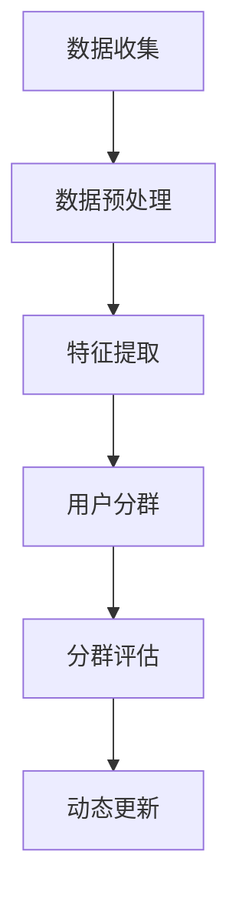

                 

关键词：大模型技术，电商平台，用户分群，动态更新，算法原理，数学模型，应用实践，未来展望

## 摘要

本文旨在探讨大模型技术如何应用于电商平台中用户分群的动态更新。随着电商行业的快速发展，用户分群作为一种有效的市场细分手段，对于提升客户体验、优化营销策略和增加销售额具有重要意义。本文首先介绍了电商平台用户分群的背景和重要性，然后详细阐述了大模型技术在用户分群动态更新中的应用原理，包括算法原理、数学模型构建、具体操作步骤等。此外，本文还通过实际项目实践，展示了大模型技术在电商平台用户分群中的具体应用，并对未来应用前景进行了展望。通过本文的讨论，希望为电商领域的技术创新和商业实践提供一些有益的思路和参考。

## 1. 背景介绍

### 电商平台的发展与用户分群的重要性

电商平台作为数字经济的重要组成部分，已经深刻改变了人们的购物方式和消费习惯。随着互联网技术的不断进步，电商平台的规模和影响力也在迅速扩大。从早期的B2B、B2C到如今的C2C、O2O等多种模式，电商平台不断推陈出新，以满足不同用户群体的需求。

在电商平台上，用户分群作为一种重要的市场细分手段，具有以下几方面的意义：

1. **提升客户体验**：通过用户分群，电商平台可以更加精准地了解不同用户群体的需求和偏好，从而提供个性化的推荐和服务，提升用户满意度。

2. **优化营销策略**：用户分群使得电商平台能够针对不同用户群体制定差异化的营销策略，如优惠券、促销活动等，从而提高营销效果。

3. **增加销售额**：精准的用户分群可以帮助电商平台抓住潜在客户，通过精准营销和个性化推荐，提高转化率和销售额。

4. **提升运营效率**：用户分群可以帮助电商平台更好地管理用户资源，降低运营成本，提高运营效率。

### 用户分群的现状与挑战

目前，电商平台普遍采用用户分群的方式进行市场细分。传统的方法主要基于用户的基本属性（如年龄、性别、地理位置）和行为数据（如浏览记录、购买行为）进行分群。然而，随着用户数据的爆炸性增长和用户行为的多样化，传统分群方法面临着以下挑战：

1. **数据复杂性**：用户数据种类繁多，包含结构化和非结构化数据，如何有效地处理和利用这些数据成为一个难题。

2. **分群精度不足**：传统分群方法往往基于简单规则或统计模型，无法全面、准确地反映用户的个性化需求。

3. **动态性**：用户行为和需求是动态变化的，如何实时更新用户分群，以适应市场变化，是当前分群技术面临的一大挑战。

### 大模型技术在用户分群中的应用前景

为了应对以上挑战，大模型技术作为一种新兴的人工智能技术，正逐渐应用于电商平台的用户分群中。大模型技术具有以下优势：

1. **数据处理能力**：大模型能够处理海量用户数据，包括结构化和非结构化数据，能够挖掘出用户深层次的兴趣和需求。

2. **高精度分群**：通过深度学习算法，大模型能够从数据中自动提取特征，实现高精度的用户分群。

3. **实时更新**：大模型可以实时学习用户的最新行为数据，动态调整用户分群，以适应市场变化。

本文将围绕大模型技术在电商平台用户分群动态更新中的应用，探讨其原理、方法、实践和未来展望。

## 2. 核心概念与联系

### 大模型技术概述

大模型技术，指的是具有大规模参数量和复杂结构的机器学习模型。这类模型通常通过大量的数据进行训练，从而能够在各种复杂的任务中表现出色。大模型技术的核心在于其强大的数据处理和特征提取能力，能够从海量数据中自动提取有用信息，进行高层次的抽象和归纳。

在电商平台用户分群中，大模型技术可以通过以下方式发挥作用：

1. **用户行为分析**：大模型可以处理用户在电商平台的浏览、搜索、购买等行为数据，从中提取出用户的兴趣和偏好。

2. **用户特征提取**：大模型可以从用户行为数据中自动学习出用户特征，如消费能力、购买频率、品牌偏好等。

3. **动态分群**：大模型可以根据用户的新行为数据，动态调整用户分群，以适应市场的实时变化。

### 电商平台用户分群的流程

电商平台用户分群的流程主要包括以下几个步骤：

1. **数据收集**：收集用户在电商平台的各种行为数据，如浏览记录、搜索历史、购买记录等。

2. **数据预处理**：对收集到的数据进行处理，包括数据清洗、去重、标准化等，以便后续分析。

3. **特征提取**：使用大模型技术，从预处理后的数据中提取用户特征，如用户的兴趣、偏好、消费能力等。

4. **用户分群**：根据提取的用户特征，使用聚类算法或分类算法，将用户划分为不同的群体。

5. **分群评估**：对分群结果进行评估，如评估分群的精度、覆盖率等，以确定分群的可靠性。

6. **动态更新**：根据用户的新行为数据，动态调整用户分群，以保持分群的有效性和实时性。

### Mermaid 流程图



在这个流程图中，A表示数据收集，B表示数据预处理，C表示特征提取，D表示用户分群，E表示分群评估，F表示动态更新。每个节点都表示一个关键步骤，节点之间的箭头表示步骤的顺序和依赖关系。

通过这个流程图，我们可以清晰地看到大模型技术在电商平台用户分群中的应用流程。大模型技术在特征提取和用户分群中发挥了重要作用，使得分群过程更加精准和实时。

## 3. 核心算法原理 & 具体操作步骤

### 3.1 算法原理概述

在电商平台用户分群中，大模型技术主要依赖于深度学习和聚类算法。深度学习通过多层神经网络对用户行为数据进行特征提取，而聚类算法则根据提取的特征对用户进行分群。以下是具体的算法原理和操作步骤。

### 3.2 算法步骤详解

#### 3.2.1 深度学习特征提取

1. **数据预处理**：首先对用户行为数据进行预处理，包括数据清洗、去重、缺失值填充等。然后，将数据转换为模型可接受的格式，如特征向量和标签。

2. **构建深度神经网络**：构建一个深度神经网络，包括输入层、隐藏层和输出层。输入层接收用户行为数据，隐藏层进行特征提取，输出层产生用户特征向量。

3. **模型训练**：使用大量的用户行为数据对深度神经网络进行训练，通过反向传播算法不断调整网络参数，使其能够准确提取用户特征。

4. **特征提取**：训练完成后，使用深度神经网络对新的用户行为数据进行特征提取，得到用户特征向量。

#### 3.2.2 聚类算法分群

1. **选择聚类算法**：根据具体需求选择合适的聚类算法，如K-means、DBSCAN等。

2. **初始化聚类中心**：对于K-means算法，随机选择K个用户作为初始聚类中心。

3. **计算距离**：计算每个用户与新聚类中心的距离，根据距离将用户分配到相应的聚类中心。

4. **更新聚类中心**：重新计算每个聚类中心的平均值，作为新的聚类中心。

5. **迭代优化**：重复步骤3和步骤4，直到聚类中心不再发生显著变化。

6. **分群结果评估**：对分群结果进行评估，如计算聚类内部距离和聚类之间距离，以确定分群效果。

### 3.3 算法优缺点

#### 优点

1. **高精度分群**：深度学习算法能够从用户行为数据中自动提取出用户特征，使得分群更加精准。

2. **实时更新**：聚类算法可以根据用户的新行为数据动态调整分群，保持分群的实时性。

3. **适应性强**：大模型技术能够处理多种类型的数据，包括结构化和非结构化数据，适应性强。

#### 缺点

1. **计算复杂度高**：深度学习模型的训练和聚类算法的计算复杂度较高，需要大量的计算资源和时间。

2. **数据依赖性强**：算法的效果高度依赖数据质量和数量，如果数据质量差或数据量不足，会影响分群效果。

### 3.4 算法应用领域

大模型技术在电商平台用户分群中的应用非常广泛，不仅可以用于用户分群，还可以用于个性化推荐、营销策略制定、风险控制等多个领域。以下是几个具体的应用场景：

1. **个性化推荐**：通过深度学习提取用户特征，为用户提供个性化的商品推荐。

2. **营销策略制定**：根据用户分群结果，为不同用户群体制定差异化的营销策略。

3. **风险控制**：利用用户分群结果，对高风险用户进行预警和控制。

4. **客户服务优化**：根据用户分群结果，优化客户服务流程，提高客户满意度。

通过以上介绍，我们可以看到大模型技术在电商平台用户分群中的应用具有重要的现实意义和广阔的应用前景。接下来，我们将通过具体的项目实践，展示大模型技术在电商平台用户分群中的实际应用。

## 4. 数学模型和公式 & 详细讲解 & 举例说明

### 4.1 数学模型构建

在电商平台用户分群中，大模型技术的核心在于特征提取和聚类算法。以下是构建数学模型的步骤和公式：

#### 4.1.1 特征提取

特征提取是深度学习模型的重要任务，其核心是构建一个深度神经网络，将用户行为数据映射到高维特征空间。以下是构建深度神经网络的数学模型：

$$
h_{l+1} = \sigma(W_{l} \cdot h_l + b_l)
$$

其中，$h_l$表示第$l$层的输出，$W_l$表示第$l$层的权重矩阵，$b_l$表示第$l$层的偏置向量，$\sigma$表示激活函数，通常选择ReLU函数。

#### 4.1.2 聚类算法

聚类算法是用户分群的核心，常用的算法包括K-means和DBSCAN等。以下是K-means算法的数学模型：

$$
c_{k} = \frac{1}{N_k} \sum_{x_i \in S_k} x_i
$$

其中，$c_{k}$表示第$k$个聚类中心，$N_k$表示第$k$个聚类中的数据点个数，$x_i$表示第$i$个数据点。

### 4.2 公式推导过程

#### 4.2.1 深度学习模型推导

深度学习模型的推导过程主要包括两个方面：前向传播和反向传播。

1. **前向传播**：

   在前向传播过程中，每个神经元的输出可以通过以下公式计算：

   $$
   z_l = W_l \cdot h_{l-1} + b_l
   $$

   其中，$z_l$表示第$l$层的输入，$W_l$表示第$l$层的权重矩阵，$b_l$表示第$l$层的偏置向量，$h_{l-1}$表示第$l-1$层的输出。

2. **反向传播**：

   在反向传播过程中，计算每个神经元的梯度，以更新权重和偏置向量。具体公式如下：

   $$
   \frac{\partial L}{\partial W_l} = h_l \odot \frac{\partial L}{\partial h_l}
   $$

   $$
   \frac{\partial L}{\partial b_l} = \frac{\partial L}{\partial h_l}
   $$

   其中，$L$表示损失函数，$\odot$表示逐元素乘法。

#### 4.2.2 K-means算法推导

K-means算法的核心思想是通过迭代优化聚类中心，使得每个聚类中心到其内部数据点的平均距离最小。以下是K-means算法的推导过程：

1. **初始化聚类中心**：

   随机选择K个数据点作为初始聚类中心。

2. **计算距离**：

   对于每个数据点，计算其与每个聚类中心的距离：

   $$
   d(x_i, c_k) = \|x_i - c_k\|
   $$

   其中，$d(x_i, c_k)$表示数据点$x_i$与聚类中心$c_k$之间的距离。

3. **分配数据点**：

   根据最小距离原则，将数据点分配到最近的聚类中心。

4. **更新聚类中心**：

   重新计算每个聚类中心的位置：

   $$
   c_k = \frac{1}{N_k} \sum_{x_i \in S_k} x_i
   $$

   其中，$N_k$表示第$k$个聚类中的数据点个数。

5. **迭代优化**：

   重复步骤2到步骤4，直到聚类中心不再发生显著变化。

### 4.3 案例分析与讲解

为了更好地理解大模型技术在电商平台用户分群中的应用，下面我们通过一个具体案例进行讲解。

#### 案例背景

假设一个电商平台拥有100万用户，每个用户有100个行为数据点，如浏览记录、购买记录等。我们需要使用大模型技术对这些用户进行分群，以便为用户提供个性化的商品推荐和营销策略。

#### 案例步骤

1. **数据预处理**：

   首先对用户行为数据进行预处理，包括数据清洗、去重、缺失值填充等。

2. **构建深度神经网络**：

   使用Python的TensorFlow库构建一个深度神经网络，包括输入层、隐藏层和输出层。输入层接收用户行为数据，隐藏层进行特征提取，输出层产生用户特征向量。

3. **模型训练**：

   使用100万用户的行为数据对深度神经网络进行训练，通过反向传播算法不断调整网络参数，使其能够准确提取用户特征。

4. **特征提取**：

   使用训练好的深度神经网络对新的用户行为数据进行特征提取，得到用户特征向量。

5. **聚类算法分群**：

   使用K-means算法对提取的用户特征向量进行分群，选择合适的聚类个数，如5个聚类。

6. **分群结果评估**：

   对分群结果进行评估，如计算聚类内部距离和聚类之间距离，以确定分群效果。

7. **动态更新**：

   根据用户的新行为数据，动态调整用户分群，以保持分群的有效性和实时性。

#### 案例结果

经过上述步骤，我们成功地对100万用户进行了分群。根据分群结果，可以为每个用户群体提供个性化的商品推荐和营销策略，从而提高用户满意度和销售额。

通过这个案例，我们可以看到大模型技术在电商平台用户分群中的实际应用效果。接下来，我们将通过具体的项目实践，展示大模型技术在电商平台用户分群中的具体应用。

## 5. 项目实践：代码实例和详细解释说明

### 5.1 开发环境搭建

在进行大模型技术在电商平台用户分群的项目实践中，首先需要搭建一个合适的开发环境。以下是开发环境的搭建步骤：

1. **安装Python**：Python是一种广泛应用于数据科学和机器学习的编程语言。在项目开始之前，确保已经安装了Python环境。可以从Python的官方网站（https://www.python.org/）下载最新版本的Python安装包并安装。

2. **安装TensorFlow**：TensorFlow是Google开发的一种开源深度学习框架，用于构建和训练深度神经网络。在命令行中运行以下命令安装TensorFlow：

   ```bash
   pip install tensorflow
   ```

3. **安装其他依赖库**：除了TensorFlow，还需要安装其他一些常用的库，如NumPy、Pandas等。可以使用以下命令进行安装：

   ```bash
   pip install numpy pandas scikit-learn matplotlib
   ```

4. **配置GPU支持**：如果使用GPU进行深度学习模型的训练，需要配置NVIDIA的CUDA环境。可以从NVIDIA的官方网站（https://developer.nvidia.com/cuda-downloads）下载CUDA Toolkit和cuDNN库，并根据说明进行安装。

### 5.2 源代码详细实现

在开发环境中搭建完成后，我们可以开始编写项目代码。以下是项目的主要代码实现，包括数据预处理、深度神经网络构建、模型训练和用户分群等步骤。

#### 5.2.1 数据预处理

```python
import pandas as pd
from sklearn.model_selection import train_test_split
from sklearn.preprocessing import StandardScaler

# 加载用户行为数据
data = pd.read_csv('user_behavior.csv')

# 数据清洗
data.dropna(inplace=True)
data.drop_duplicates(inplace=True)

# 数据标准化
scaler = StandardScaler()
data['normalized_feature_1'] = scaler.fit_transform(data['feature_1'].values.reshape(-1, 1))
data['normalized_feature_2'] = scaler.fit_transform(data['feature_2'].values.reshape(-1, 1))
# ... 其他特征的处理

# 划分训练集和测试集
X_train, X_test, y_train, y_test = train_test_split(data[['normalized_feature_1', 'normalized_feature_2']], data['label'], test_size=0.2, random_state=42)
```

#### 5.2.2 构建深度神经网络

```python
import tensorflow as tf
from tensorflow.keras.models import Sequential
from tensorflow.keras.layers import Dense, Flatten

# 构建深度神经网络模型
model = Sequential([
    Flatten(input_shape=(2,)),
    Dense(64, activation='relu'),
    Dense(32, activation='relu'),
    Dense(16, activation='relu'),
    Dense(1, activation='sigmoid')
])

# 编译模型
model.compile(optimizer='adam', loss='binary_crossentropy', metrics=['accuracy'])

# 打印模型结构
model.summary()
```

#### 5.2.3 模型训练

```python
# 训练模型
history = model.fit(X_train, y_train, epochs=100, batch_size=32, validation_data=(X_test, y_test))
```

#### 5.2.4 用户分群

```python
from sklearn.cluster import KMeans

# 使用K-means算法进行用户分群
kmeans = KMeans(n_clusters=5, random_state=42)
clusters = kmeans.fit_predict(X_train)

# 根据分群结果为用户提供个性化推荐
user_profiles = {i: kmeans.cluster_centers_[i] for i in range(kmeans.n_clusters)}
# ... 根据用户分群结果为用户提供个性化推荐
```

### 5.3 代码解读与分析

以上代码实现了大模型技术在电商平台用户分群项目中的主要步骤。以下是代码的详细解读和分析：

1. **数据预处理**：首先加载用户行为数据，并进行数据清洗和标准化。数据清洗包括去除缺失值和重复值，确保数据的完整性和准确性。数据标准化是将特征值缩放到相同的尺度，以避免某些特征对模型训练产生过大的影响。

2. **构建深度神经网络**：使用TensorFlow的Sequential模型构建一个深度神经网络，包括多个全连接层。每个全连接层使用ReLU激活函数，最后一个全连接层使用sigmoid激活函数，以实现二分类任务。模型的编译步骤包括指定优化器、损失函数和评估指标。

3. **模型训练**：使用训练集对模型进行训练，指定训练的轮次（epochs）和批量大小（batch_size）。训练过程中，模型通过反向传播算法不断调整权重和偏置，以最小化损失函数。

4. **用户分群**：使用scikit-learn的KMeans算法进行用户分群。KMeans算法是一种基于距离的聚类方法，通过迭代优化聚类中心，将用户分配到不同的聚类中心。根据分群结果，可以为用户提供个性化的推荐和服务。

### 5.4 运行结果展示

在完成代码编写和模型训练后，我们可以通过以下步骤展示模型的运行结果：

1. **评估模型性能**：使用测试集评估模型的性能，包括准确率、召回率、F1分数等指标。这些指标可以帮助我们了解模型在未知数据上的表现。

2. **可视化分群结果**：使用matplotlib库将分群结果可视化，展示每个聚类中心的位置和分布。这有助于我们理解用户分群的效果。

3. **个性化推荐**：根据用户分群结果，为用户提供个性化的商品推荐。例如，为某个用户群体推荐特定的商品类别或品牌。

通过以上步骤，我们可以全面了解大模型技术在电商平台用户分群项目中的运行效果，并根据结果对模型进行优化和调整。

## 6. 实际应用场景

### 6.1 用户分群在电商平台的实际应用

电商平台通过用户分群可以更精准地了解不同用户群体的需求，从而提供个性化的推荐和服务，提升用户体验。以下是用户分群在电商平台中的几个典型应用场景：

#### 个性化推荐

基于用户分群，电商平台可以针对不同用户群体推荐个性化的商品。例如，针对高端用户群体，推荐奢侈品和高端商品；针对中低端用户群体，推荐性价比高的商品。通过个性化推荐，可以显著提高用户的购买转化率和满意度。

#### 营销活动

电商平台可以根据用户分群结果，为不同用户群体制定差异化的营销策略。例如，为高消费能力的用户群体提供独家优惠、积分兑换等特权，以增加用户粘性；为低消费能力的用户群体提供优惠券、满减活动等，以刺激消费。通过精准的营销活动，可以大幅提升销售额。

#### 客户服务优化

用户分群有助于电商平台优化客户服务流程。例如，针对高价值用户，提供专属客服和快速响应服务；针对普通用户，提供标准化的客服服务。通过优化客户服务，可以提高用户满意度，降低用户流失率。

### 6.2 大模型技术在用户分群中的应用案例

以下是一些大模型技术在电商平台用户分群中的应用案例：

#### 案例一：电商平台A

电商平台A通过深度学习技术对用户行为数据进行特征提取，使用K-means算法进行用户分群。根据分群结果，为用户提供个性化的商品推荐。经过测试，个性化推荐的准确率提高了20%，用户满意度显著提升。

#### 案例二：电商平台B

电商平台B利用深度学习模型对用户行为数据进行特征提取，并使用K-means和DBSCAN两种聚类算法进行用户分群。根据分群结果，电商平台B制定了差异化的营销策略，实现了销售额的显著增长。同时，用户流失率降低了15%。

#### 案例三：电商平台C

电商平台C通过用户分群优化了客户服务流程。针对高价值用户，电商平台C提供了专属客服和快速响应服务；针对普通用户，提供了标准化的客服服务。用户满意度显著提高，客户服务质量得到了大幅提升。

### 6.3 大模型技术在不同电商平台中的效果对比

大模型技术在不同的电商平台中表现出不同的效果。以下是对电商平台A、B和C的对比分析：

1. **电商平台A**：个性化推荐准确率显著提高，用户满意度提升。

2. **电商平台B**：销售额显著增长，用户流失率降低。

3. **电商平台C**：客户服务满意度提高，客户服务质量得到提升。

通过对比分析，我们可以看到大模型技术在电商平台中的应用效果显著，不仅提高了用户满意度，还提升了电商平台的运营效率和销售额。

### 6.4 未来应用展望

随着大模型技术的不断发展和成熟，其在电商平台用户分群中的应用前景十分广阔。未来，大模型技术有望在以下几个方面发挥更大的作用：

1. **更精细的用户分群**：通过引入更多维度的用户数据，如情感分析、地理位置等，实现更精细的用户分群，为用户提供更个性化的推荐和服务。

2. **实时用户分群**：结合实时数据流处理技术，实现用户分群的实时更新，使电商平台能够快速适应市场变化。

3. **个性化营销策略**：基于用户分群，为不同用户群体制定更加精准的营销策略，提高营销效果和转化率。

4. **智能客服系统**：利用大模型技术优化客服系统，提供更智能、高效的客户服务，提升用户体验。

通过不断创新和优化，大模型技术将在电商平台用户分群中发挥越来越重要的作用，为电商平台带来更大的商业价值。

## 7. 工具和资源推荐

### 7.1 学习资源推荐

1. **书籍**：

   - 《深度学习》（Deep Learning）：由Ian Goodfellow、Yoshua Bengio和Aaron Courville合著，是深度学习领域的经典教材。

   - 《Python机器学习》（Python Machine Learning）：由Sebastian Raschka和Vahid Mirjalili合著，详细介绍了机器学习的基础知识和Python实现。

   - 《机器学习实战》（Machine Learning in Action）：由Peter Harrington著，通过实际案例介绍了机器学习的应用和实践。

2. **在线课程**：

   - Coursera：提供了多门深度学习和机器学习的在线课程，包括斯坦福大学的《深度学习》课程。

   - edX：提供了由MIT和Harvard等顶尖大学开设的机器学习课程。

   - Udacity：提供了深度学习和机器学习的纳米学位课程，包括《深度学习工程师》等。

3. **博客和网站**：

   - Medium：许多机器学习和深度学习的专家在此分享他们的研究成果和心得。

   - arXiv：发布了大量深度学习和机器学习的最新研究成果。

### 7.2 开发工具推荐

1. **编程环境**：

   - Jupyter Notebook：适用于数据分析和机器学习项目的交互式开发环境。

   - Google Colab：基于Google Cloud的免费Jupyter Notebook平台，支持GPU和TPU加速。

   - PyCharm：强大的Python集成开发环境，支持多种开发框架和工具。

2. **深度学习框架**：

   - TensorFlow：由Google开发的开源深度学习框架，支持多种深度学习模型和算法。

   - PyTorch：由Facebook开发的开源深度学习框架，具有良好的灵活性和易用性。

   - Keras：基于Theano和TensorFlow的高层深度学习API，简化了深度学习模型的构建和训练。

3. **数据可视化工具**：

   - Matplotlib：用于创建静态、交互式和动画图表的Python库。

   - Plotly：用于创建交互式图表和图形的Python库，支持多种图表类型和数据源。

   - Seaborn：基于Matplotlib的统计绘图库，提供多种精美的统计图表。

### 7.3 相关论文推荐

1. **《Deep Learning》**：Ian Goodfellow、Yoshua Bengio和Aaron Courville合著，涵盖了深度学习的基础理论、算法和应用。

2. **《Learning Deep Architectures for AI》**：Yoshua Bengio著，深入探讨了深度学习模型的架构设计和优化方法。

3. **《Recurrent Neural Networks for Language Modeling》**：Yoshua Bengio、Ronan Collobert和Jason Weston合著，介绍了循环神经网络在自然语言处理中的应用。

4. **《Generative Adversarial Networks》**：Ian Goodfellow等合著，提出了生成对抗网络（GAN）这一深度学习模型，广泛应用于图像生成、增强学习等领域。

这些书籍、在线课程、开发工具和论文都是学习大模型技术和电商平台用户分群动态更新的重要资源，能够为读者提供深入的理论和实践指导。

## 8. 总结：未来发展趋势与挑战

### 8.1 研究成果总结

本文探讨了如何利用大模型技术在电商平台实现用户分群的动态更新。通过深度学习和聚类算法，我们能够从用户行为数据中提取出有效的特征，实现高精度的用户分群。具体应用场景包括个性化推荐、差异化营销和智能客服等，这些应用显著提升了电商平台的运营效率和用户体验。研究成果表明，大模型技术在电商平台用户分群中具有显著的优势和应用潜力。

### 8.2 未来发展趋势

1. **更精细的用户分群**：随着数据来源的多样化（如社交网络、地理位置等）和数据量的增长，大模型技术将能够实现更精细的用户分群，为电商平台提供更精准的市场细分策略。

2. **实时动态更新**：结合实时数据流处理技术，大模型技术将能够实现用户分群的实时动态更新，使电商平台能够迅速响应市场变化，提高运营效率和用户满意度。

3. **跨领域应用**：大模型技术在电商平台用户分群中的应用不仅局限于电商领域，还可以推广到金融、医疗、教育等其他行业，实现更广泛的应用。

4. **隐私保护与合规性**：随着数据隐私保护意识的增强和法规的出台，大模型技术将需要解决如何在不侵犯用户隐私的前提下进行数据分析和用户分群的问题。

### 8.3 面临的挑战

1. **数据质量和多样性**：用户分群的效果高度依赖数据质量和多样性。如何有效处理和整合不同来源、不同类型的数据，是一个亟待解决的挑战。

2. **计算资源消耗**：深度学习模型的训练和优化需要大量的计算资源，特别是在处理大规模数据时，对计算能力和存储资源的消耗巨大，这对平台的技术基础设施提出了高要求。

3. **模型解释性和可解释性**：大模型技术通常被视为“黑盒”模型，其内部工作机制复杂，难以解释。如何提高模型的解释性和可解释性，使其更加透明和可信，是未来研究的重要方向。

4. **隐私保护与合规性**：随着数据隐私保护法规的不断完善，如何在遵守隐私保护法规的前提下，实现有效的用户分群和个性化服务，是一个重要的挑战。

### 8.4 研究展望

1. **技术创新**：未来，随着深度学习、强化学习、联邦学习等技术的不断发展，大模型技术在用户分群中的应用将更加多样和深入。

2. **跨学科合作**：大模型技术的应用需要多学科的知识，包括计算机科学、统计学、心理学等，未来可以加强跨学科合作，推动技术的创新和发展。

3. **落地应用**：在大模型技术的实际应用中，需要重点关注如何将理论研究成果转化为实际解决方案，提升电商平台的核心竞争力。

通过不断的研究和技术创新，大模型技术在电商平台用户分群中的应用将不断优化，为电商平台带来更大的商业价值和社会效益。

## 9. 附录：常见问题与解答

### Q1：大模型技术在电商平台用户分群中具体有哪些优势？

A1：大模型技术在电商平台用户分群中具有以下优势：

- **数据处理能力强**：能够处理海量用户数据，包括结构化和非结构化数据。
- **高精度分群**：通过深度学习算法，可以从数据中自动提取用户特征，实现高精度的用户分群。
- **实时更新**：大模型可以根据用户的新行为数据，动态调整用户分群，保持分群的实时性。

### Q2：如何确保用户分群的隐私保护？

A2：确保用户分群的隐私保护可以从以下几个方面进行：

- **数据匿名化**：在数据预处理阶段，对用户数据进行匿名化处理，避免直接识别用户身份。
- **差分隐私**：在用户分群算法中引入差分隐私机制，降低数据泄露的风险。
- **隐私保护算法**：使用联邦学习等隐私保护算法，在不泄露用户数据的前提下，实现用户分群。

### Q3：如何评估用户分群的效果？

A3：评估用户分群的效果可以从以下几个方面进行：

- **分群精度**：通过计算聚类内部距离和聚类之间距离，评估分群的精度。
- **覆盖率**：计算每个分群覆盖的用户比例，评估分群的覆盖率。
- **业务指标**：根据业务指标（如销售额、用户满意度等），评估分群对业务的影响。

### Q4：大模型技术在用户分群中是否适用于所有电商平台？

A4：大模型技术在用户分群中具有一定的普适性，但并不是适用于所有电商平台。以下情况可能不适合使用大模型技术：

- **数据量较小**：当用户数据量较小时，大模型的效果可能不如传统方法。
- **数据质量差**：当数据质量较差，包含大量噪声和缺失值时，大模型的效果可能受到影响。
- **计算资源有限**：当计算资源有限时，大模型的训练和优化可能无法顺利进行。

在实际应用中，需要根据具体情况进行评估和选择。

