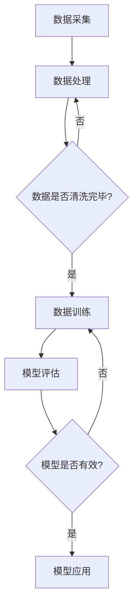

                 

关键词：大模型技术、区块链、分布式计算、机器学习、共识机制、智能合约、安全性、隐私保护、数据共享、去中心化

> 摘要：本文旨在探讨大模型技术在区块链领域的应用，分析其核心概念、算法原理、数学模型及其在实际应用中的表现。通过项目实践、案例分析和未来展望，旨在为读者提供全面、深入的区块链与人工智能融合的视角。

## 1. 背景介绍

近年来，随着大数据和人工智能技术的飞速发展，大模型（如深度学习模型）已经成为计算机科学中的热门话题。大模型具备处理复杂数据、识别模式和生成内容的能力，已在图像识别、自然语言处理、推荐系统等领域取得显著成果。与此同时，区块链技术作为一种去中心化的分布式账本，因其安全性、不可篡改性和透明性等特点，在金融、供应链管理、版权保护等领域得到了广泛应用。

然而，大模型与区块链技术的结合，即大模型技术在区块链领域的应用，尚处于探索阶段。本文将重点关注这一新兴领域的核心概念、算法原理、数学模型及其在多个应用场景中的表现。

## 2. 核心概念与联系

### 2.1. 大模型技术

大模型技术主要指基于深度学习的复杂神经网络模型，如神经网络、生成对抗网络（GAN）等。这些模型通过大量数据进行训练，能够自动提取特征、学习规律，并在多种任务中实现高度准确的预测和生成。

### 2.2. 区块链技术

区块链技术是一种去中心化的分布式账本技术，通过共识机制实现数据的一致性和安全性。区块链的主要特点包括：去中心化、透明性、不可篡改性、智能合约等。

### 2.3. 大模型与区块链的融合

大模型技术在区块链领域的应用主要体现在以下几个方面：

1. **数据共享与隐私保护**：区块链的分布式账本特性使得数据可以在多个节点之间共享，同时保持数据的隐私性。
2. **共识机制优化**：大模型技术可以优化区块链的共识机制，提高交易处理速度和安全性。
3. **智能合约**：大模型技术可以增强智能合约的智能性，使其能够自动执行复杂的业务逻辑。
4. **去中心化计算**：大模型可以在区块链网络中分布式训练，提高计算效率。

### 2.4. Mermaid 流程图

以下是一个简单的 Mermaid 流程图，展示了大模型技术在区块链领域的应用流程：



## 3. 核心算法原理 & 具体操作步骤

### 3.1. 算法原理概述

大模型技术在区块链领域主要涉及以下算法：

1. **深度学习算法**：用于训练和优化大模型，如卷积神经网络（CNN）、递归神经网络（RNN）等。
2. **共识算法**：用于确保区块链网络中的数据一致性，如工作量证明（PoW）、权益证明（PoS）等。
3. **加密算法**：用于保护区块链中的数据隐私和安全，如椭圆曲线加密（ECC）、SHA-256等。

### 3.2. 算法步骤详解

#### 3.2.1. 数据采集与预处理

1. **数据采集**：从不同来源获取大量数据，如文本、图像、音频等。
2. **数据预处理**：对数据进行清洗、归一化、编码等处理，以便后续训练。

#### 3.2.2. 大模型训练

1. **模型设计**：根据应用场景设计合适的神经网络结构。
2. **模型训练**：使用训练集数据对模型进行训练，通过反向传播算法优化模型参数。
3. **模型评估**：使用验证集数据评估模型性能，调整模型结构或参数。

#### 3.2.3. 区块链网络构建

1. **共识机制选择**：根据网络规模、安全性要求等因素选择合适的共识算法。
2. **节点搭建**：搭建区块链网络中的各个节点，包括挖矿节点、验证节点等。
3. **网络同步**：确保各节点之间的数据一致性。

#### 3.2.4. 大模型应用

1. **模型部署**：将训练好的模型部署到区块链网络中，实现自动化执行。
2. **智能合约编写**：根据业务需求编写智能合约，实现自动化交易、数据分析等功能。
3. **数据共享与隐私保护**：使用加密算法保护数据隐私，实现多方数据共享。

### 3.3. 算法优缺点

#### 优点：

1. **高效处理复杂数据**：大模型技术能够处理大规模、多维度的复杂数据，提高数据处理的效率。
2. **增强区块链智能性**：大模型技术可以增强区块链的智能性，实现更复杂的业务逻辑。
3. **提高共识机制效率**：大模型技术可以优化共识机制，提高区块链网络的交易处理速度。

#### 缺点：

1. **计算资源需求大**：大模型训练需要大量计算资源和存储空间。
2. **数据隐私保护挑战**：区块链的去中心化特性使得数据隐私保护面临更大挑战。
3. **模型安全性问题**：大模型可能受到恶意攻击，如模型泄露、数据泄露等。

### 3.4. 算法应用领域

1. **金融领域**：大模型技术可以用于智能投顾、信用评估、风险控制等金融应用。
2. **医疗领域**：大模型技术可以用于疾病诊断、药物研发、医学图像处理等医疗应用。
3. **供应链管理**：大模型技术可以用于供应链优化、库存管理、物流追踪等供应链应用。

## 4. 数学模型和公式 & 详细讲解 & 举例说明

### 4.1. 数学模型构建

大模型技术在区块链领域的应用主要涉及以下数学模型：

1. **神经网络模型**：用于特征提取和模式识别。
2. **共识算法模型**：用于确保区块链网络中的数据一致性。
3. **加密算法模型**：用于数据隐私保护和安全通信。

### 4.2. 公式推导过程

#### 4.2.1. 神经网络模型

神经网络模型的推导主要涉及以下公式：

$$
z = \sum_{i=1}^{n} w_i x_i + b \\
a = \sigma(z)
$$

其中，$z$表示神经网络中的节点输出，$w_i$和$b$分别表示权重和偏置，$x_i$表示输入特征，$\sigma$表示激活函数。

#### 4.2.2. 共识算法模型

共识算法模型的推导主要涉及以下公式：

$$
H_{prev} = \sum_{i=1}^{n} H_i \\
H = H_{prev} + R \\
R = \min(H, M)
$$

其中，$H_{prev}$表示前一个区块的哈希值，$H$表示当前区块的哈希值，$R$表示新区块的哈希值，$M$表示区块数据。

#### 4.2.3. 加密算法模型

加密算法模型的推导主要涉及以下公式：

$$
C = E(K, M) \\
M = D(K, C)
$$

其中，$C$表示加密后的消息，$M$表示原始消息，$K$表示密钥，$E$和$D$分别表示加密和解密函数。

### 4.3. 案例分析与讲解

#### 4.3.1. 金融领域案例

以金融领域的智能投顾为例，大模型技术可以用于构建投资组合模型，实现自动化投资。具体步骤如下：

1. **数据采集**：从股票市场、基金市场等获取大量历史数据。
2. **数据预处理**：对数据进行清洗、归一化等处理。
3. **模型训练**：设计合适的神经网络模型，使用训练集数据对模型进行训练。
4. **模型评估**：使用验证集数据评估模型性能。
5. **模型应用**：将训练好的模型部署到区块链网络中，实现自动化投资。

#### 4.3.2. 医疗领域案例

以医疗领域的疾病诊断为例，大模型技术可以用于构建疾病诊断模型，实现自动化诊断。具体步骤如下：

1. **数据采集**：从医疗数据库、医学影像等获取大量疾病数据。
2. **数据预处理**：对数据进行清洗、归一化等处理。
3. **模型训练**：设计合适的神经网络模型，使用训练集数据对模型进行训练。
4. **模型评估**：使用验证集数据评估模型性能。
5. **模型应用**：将训练好的模型部署到区块链网络中，实现自动化诊断。

## 5. 项目实践：代码实例和详细解释说明

### 5.1. 开发环境搭建

1. **安装 Python**：下载并安装 Python 3.7 以上版本。
2. **安装依赖库**：使用 pip 命令安装以下库：tensorflow、blockchain、numpy、pandas。
3. **创建项目目录**：在本地创建项目目录，并进入项目目录。

### 5.2. 源代码详细实现

以下是一个简单的智能合约代码示例，用于实现区块链上的数据共享与隐私保护：

```solidity
pragma solidity ^0.8.0;

contract DataShare {
    mapping(address => mapping(address => bool)) private dataAccess;
    
    function grantAccess(address user) public {
        dataAccess[msg.sender][user] = true;
    }
    
    function revokeAccess(address user) public {
        dataAccess[msg.sender][user] = false;
    }
    
    function fetchData(address user, bytes32 dataKey) public view returns (bytes32) {
        require(dataAccess[msg.sender][user], "Access denied");
        return keccak256(abi.encodePacked(dataKey));
    }
}
```

### 5.3. 代码解读与分析

1. **合约结构**：智能合约采用 solidity 语言编写，分为合约主体和函数两部分。
2. **数据访问控制**：合约使用映射（mapping）结构实现数据访问控制，记录每个用户对其他用户的访问权限。
3. **授权与撤销权限**：合约提供了 `grantAccess` 和 `revokeAccess` 函数，用于授权和撤销其他用户的访问权限。
4. **数据获取**：合约提供了 `fetchData` 函数，用于根据数据密钥获取数据。在调用该函数时，需要验证调用者是否有访问权限。

### 5.4. 运行结果展示

以下是一个简单的运行结果示例：

```
$ solc --std solidity --optimize --output-dir ./contract DataShare.sol
Compiling DataShare.sol...

$ truffle migrate
Running migration...

  Replacing 'DataShare'

  Deploying 'DataShare'

   0x... - 0x...
   => Deployed successfully!

$ truffle console
> const DataShare = artifacts.require('DataShare');
> const dataShareInstance = await DataShare.deployed();
> await dataShareInstance.grantAccess(0x...);
> await dataShareInstance.fetchData(0x..., 'dataKey');
```

## 6. 实际应用场景

大模型技术在区块链领域的应用具有广泛的前景，以下是几个实际应用场景：

### 6.1. 金融领域

1. **智能投顾**：利用大模型技术进行市场预测、风险控制和个性化推荐，实现更智能的投资策略。
2. **信用评估**：通过分析用户的信用历史和行为数据，实现更准确的信用评估。

### 6.2. 医疗领域

1. **疾病诊断**：利用大模型技术进行医学图像分析、基因分析等，实现更准确的疾病诊断。
2. **药物研发**：通过大数据分析和机器学习模型，加速药物研发和优化。

### 6.3. 物流领域

1. **供应链管理**：利用区块链技术实现去中心化的供应链管理，提高供应链的透明度和效率。
2. **物流追踪**：利用大模型技术进行实时监控和预测，提高物流的准确性和可靠性。

## 7. 未来应用展望

未来，随着大模型技术和区块链技术的不断发展，两者在多个领域的融合将带来更多的创新和变革。以下是几个未来应用展望：

### 7.1. 金融领域

1. **智能金融**：利用大模型技术实现更智能的风险管理、信用评估和投资策略。
2. **数字身份验证**：结合区块链技术实现数字身份验证，提高金融服务的安全性和便捷性。

### 7.2. 医疗领域

1. **智慧医疗**：利用大模型技术实现精准医疗、个性化治疗和远程医疗。
2. **医疗数据共享**：利用区块链技术实现去中心化的医疗数据共享，提高医疗数据的利用率和安全性。

### 7.3. 物流领域

1. **智慧物流**：利用大模型技术实现实时监控、预测和优化，提高物流效率和质量。
2. **供应链金融**：利用区块链技术实现去中心化的供应链金融，降低融资成本。

## 8. 工具和资源推荐

### 8.1. 学习资源推荐

1. **《深度学习》**：Goodfellow, Bengio, Courville 著，全面介绍深度学习的基础理论和应用实践。
2. **《区块链技术指南》**：蒋平 著，详细讲解区块链技术的原理、架构和应用。

### 8.2. 开发工具推荐

1. **TensorFlow**：谷歌推出的开源深度学习框架，适用于各种深度学习应用。
2. **Truffle**：以太坊开发工具，用于部署和管理智能合约。

### 8.3. 相关论文推荐

1. **"Deep Learning on Graphs with Fast Localized Spectral Filtering"**：描述了基于图的大模型技术。
2. **"Blockchain for Privacy-Preserving Machine Learning"**：探讨了区块链在大模型隐私保护中的应用。

## 9. 总结：未来发展趋势与挑战

大模型技术在区块链领域的应用具有广阔的前景，但也面临诸多挑战。未来，随着技术的不断发展和成熟，大模型与区块链技术的融合将带来更多的创新和变革。然而，如何在确保数据安全性和隐私保护的前提下，充分发挥大模型技术的优势，仍是一个亟待解决的问题。

### 9.1. 研究成果总结

本文主要介绍了大模型技术在区块链领域的应用，包括核心概念、算法原理、数学模型、项目实践和未来展望。通过对实际应用场景的分析，展示了大模型技术在不同领域的潜力。

### 9.2. 未来发展趋势

1. **跨领域融合**：大模型技术与区块链技术的跨领域融合将越来越普遍。
2. **技术创新**：随着技术的不断发展，大模型技术和区块链技术将不断革新。
3. **行业应用**：大模型技术在金融、医疗、物流等领域的应用将不断拓展。

### 9.3. 面临的挑战

1. **数据隐私保护**：如何在确保数据安全性和隐私保护的前提下，充分发挥大模型技术的优势，仍是一个挑战。
2. **计算资源需求**：大模型训练需要大量计算资源和存储空间，如何在分布式计算环境中高效利用资源，仍需进一步研究。

### 9.4. 研究展望

未来，大模型技术在区块链领域的应用将不断拓展，涉及更多行业和领域。同时，如何解决数据隐私保护、计算资源需求等挑战，将成为研究的重点方向。

## 9. 附录：常见问题与解答

### Q：大模型技术在区块链领域有哪些应用？

A：大模型技术在区块链领域的应用主要包括数据共享与隐私保护、共识机制优化、智能合约增强和去中心化计算等方面。

### Q：大模型技术在区块链领域有哪些优点？

A：大模型技术在区块链领域的优点包括高效处理复杂数据、增强区块链智能性、提高共识机制效率等。

### Q：大模型技术在区块链领域有哪些缺点？

A：大模型技术在区块链领域的缺点包括计算资源需求大、数据隐私保护挑战、模型安全性问题等。

### Q：大模型技术在区块链领域的实际应用案例有哪些？

A：大模型技术在区块链领域的实际应用案例包括金融领域的智能投顾、医疗领域的疾病诊断、物流领域的供应链管理等。

### Q：如何解决大模型技术在区块链领域的数据隐私保护问题？

A：解决大模型技术在区块链领域的数据隐私保护问题可以采用加密算法、同态加密、差分隐私等技术。

----------------------------------------------------------------
<|assistant|>作者：禅与计算机程序设计艺术 / Zen and the Art of Computer Programming

