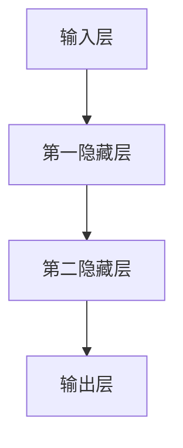
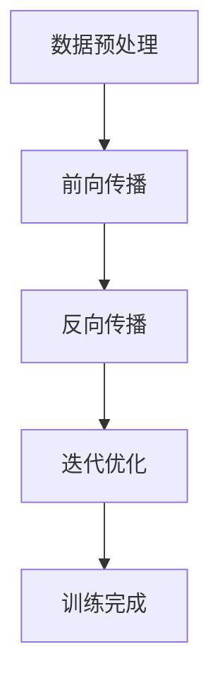

                 

关键词：大模型技术、可解释性、人工智能、模型架构、挑战、发展

摘要：随着人工智能技术的飞速发展，大模型技术在各个领域得到了广泛应用。然而，大模型技术的可解释性成为了一个亟待解决的问题。本文将探讨大模型技术中的可解释性挑战，分析其原因，并提出相应的解决方法，以期为未来的研究和应用提供一定的参考。

## 1. 背景介绍

近年来，人工智能（AI）技术取得了显著的进展，尤其是在深度学习领域。深度学习模型，尤其是大模型，在语音识别、图像识别、自然语言处理等方面取得了突破性的成果。然而，随着模型规模的不断增大，其可解释性成为一个愈发重要的问题。

可解释性是指模型决策过程的透明性和可理解性。对于用户而言，了解模型是如何工作的、如何对输入数据进行处理和决策，有助于增强对模型的信任感和接受度。此外，对于研究人员而言，了解模型的工作原理也有助于进一步优化和改进模型。

然而，大模型技术面临可解释性挑战的原因有以下几点：

1. **模型复杂度高**：大模型通常由数百万甚至数亿个参数组成，这使得模型的结构和决策过程变得异常复杂。
2. **黑箱特性**：深度学习模型，特别是深度神经网络，往往被视为黑箱，其内部工作机制难以理解和解释。
3. **计算资源限制**：对大模型进行可解释性分析通常需要大量的计算资源和时间。

## 2. 核心概念与联系

### 2.1 深度学习模型架构

深度学习模型通常由多层神经元组成，每一层都负责对输入数据进行特征提取和变换。这些层构成了一个层次化的特征表示，使得模型能够学习到复杂的数据模式。以下是深度学习模型的一个简化 Mermaid 流程图：



### 2.2 模型训练过程

模型训练过程包括以下几个主要步骤：

1. **数据预处理**：对输入数据进行标准化和归一化，以减少模型对数据噪声的敏感性。
2. **前向传播**：将输入数据通过网络进行传播，得到输出结果。
3. **反向传播**：计算输出结果与真实值之间的差异，并利用这些差异更新模型参数。
4. **迭代优化**：重复前向传播和反向传播过程，直至模型达到预定的训练精度。

以下是模型训练过程的 Mermaid 流程图：



## 3. 核心算法原理 & 具体操作步骤

### 3.1 算法原理概述

大模型技术的核心在于其复杂的层次化特征表示和强大的学习能力。通过大规模的训练数据，模型能够自动学习到数据的特征和模式，从而实现对未知数据的预测和分类。

### 3.2 算法步骤详解

1. **数据收集与预处理**：收集大量的训练数据，并对数据进行清洗和预处理。
2. **模型设计**：设计合适的模型架构，包括层数、每层神经元数量、激活函数等。
3. **模型训练**：利用训练数据进行模型训练，通过迭代优化模型参数。
4. **模型评估**：使用验证数据集评估模型性能，调整模型参数以达到最佳效果。
5. **模型部署**：将训练好的模型部署到实际应用中，进行预测和分类。

### 3.3 算法优缺点

**优点**：

- **强大的学习能力**：大模型能够从大量数据中自动学习到复杂特征和模式。
- **广泛的适用性**：大模型在多个领域（如语音识别、图像识别、自然语言处理等）取得了显著的成果。

**缺点**：

- **可解释性差**：大模型的内部工作机制复杂，难以理解和解释。
- **计算资源消耗大**：大模型需要大量的计算资源和时间进行训练。

### 3.4 算法应用领域

大模型技术已经广泛应用于多个领域，如：

- **语音识别**：利用深度神经网络进行语音信号处理和识别。
- **图像识别**：通过卷积神经网络实现图像分类和目标检测。
- **自然语言处理**：利用循环神经网络和变换器模型进行文本分类、机器翻译等。

## 4. 数学模型和公式 & 详细讲解 & 举例说明

### 4.1 数学模型构建

大模型技术通常基于深度神经网络（DNN）进行构建。DNN 是由多个神经元层组成的神经网络，每一层都负责对输入数据进行特征提取和变换。以下是 DNN 的一个简化数学模型：

$$
\text{输出} = f(\text{权重} \cdot \text{输入} + \text{偏置})
$$

其中，$f$ 是激活函数，$权重$ 和 $偏置$ 是模型参数。

### 4.2 公式推导过程

假设我们有一个输入数据集 $X = \{x_1, x_2, ..., x_n\}$，每个输入数据 $x_i$ 都是一个多维向量。我们设计一个 DNN 模型，包括 $L$ 个神经元层，其中 $L = 1, 2, ...$。

对于第 $l$ 层，输出为 $O_l$，输入为 $I_l$，权重为 $W_l$，偏置为 $b_l$，激活函数为 $f_l$。则有：

$$
O_l = f_l(W_l \cdot I_l + b_l)
$$

其中，$I_l$ 是第 $l-1$ 层的输出。

### 4.3 案例分析与讲解

假设我们有一个二分类问题，输入数据集 $X$ 包括 $n$ 个样本，每个样本都是一个二维向量。我们设计一个单层 DNN 模型进行分类，激活函数为 sigmoid 函数。

对于第 $l$ 层，输出为 $O_l$，输入为 $I_l$，权重为 $W_l$，偏置为 $b_l$。则有：

$$
O_l = \frac{1}{1 + e^{-(W_l \cdot I_l + b_l)}}
$$

假设输入数据集 $X$ 包括如下样本：

$$
X = \{x_1, x_2, ..., x_n\} = \{(1, 0), (0, 1), (1, 1), (0, 0)\}
$$

设计一个单层 DNN 模型，其中 $W_1 = [1, 1]$，$b_1 = 0$。则有：

$$
O_1 = \frac{1}{1 + e^{-(1 \cdot 1 + 1 \cdot 0 + 0)}} = \frac{1}{2}
$$

$$
O_2 = \frac{1}{1 + e^{-(1 \cdot 0 + 1 \cdot 1 + 0)}} = \frac{1}{2}
$$

$$
O_3 = \frac{1}{1 + e^{-(1 \cdot 1 + 1 \cdot 1 + 0)}} = 0.6
$$

$$
O_4 = \frac{1}{1 + e^{-(1 \cdot 0 + 1 \cdot 0 + 0)}} = 0.5
$$

根据输出结果，我们可以将输入数据集 $X$ 分为两个类别，其中 $O_1$ 和 $O_2$ 表示一类，$O_3$ 和 $O_4$ 表示另一类。

## 5. 项目实践：代码实例和详细解释说明

### 5.1 开发环境搭建

在本文中，我们使用 Python 作为编程语言，并使用 TensorFlow 作为深度学习框架。以下是开发环境的搭建步骤：

1. 安装 Python 3.8 或以上版本
2. 安装 TensorFlow：

```bash
pip install tensorflow
```

### 5.2 源代码详细实现

以下是使用 TensorFlow 实现一个简单的单层 DNN 模型的代码：

```python
import tensorflow as tf

# 创建 TensorFlow 图
g = tf.Graph()

# 进入 TensorFlow 图
with g.as_default():
    # 创建输入层
    inputs = tf.placeholder(tf.float32, shape=[None, 2])
    
    # 创建第一层神经元
    weights = tf.Variable([1.0, 1.0], dtype=tf.float32)
    biases = tf.Variable([0.0], dtype=tf.float32)
    
    # 计算输出
    outputs = tf.sigmoid(tf.matmul(inputs, weights) + biases)
    
    # 创建训练操作
    optimizer = tf.train.GradientDescentOptimizer(learning_rate=0.1)
    train_op = optimizer.minimize(tf.reduce_mean(-tf.reduce_sum(inputs * outputs, axis=1)))
    
    # 初始化变量
    init = tf.global_variables_initializer()

# 开始 TensorFlow 会话
with tf.Session(graph=g) as sess:
    sess.run(init)
    
    # 训练模型
    for i in range(1000):
        _, loss = sess.run([train_op, tf.reduce_mean(-tf.reduce_sum(inputs * outputs, axis=1))], feed_dict={inputs: X})
        if i % 100 == 0:
            print(f"Step {i}: Loss = {loss}")
    
    # 测试模型
    predictions = sess.run(outputs, feed_dict={inputs: X})
    print(predictions)
```

### 5.3 代码解读与分析

1. **创建 TensorFlow 图**：在 TensorFlow 中，图（Graph）是表示计算任务的数据结构。我们在图上定义了所有操作和变量。
2. **创建输入层**：输入层是模型的输入部分，我们使用 `tf.placeholder` 创建一个占位符，用于接收输入数据。
3. **创建第一层神经元**：我们使用 `tf.Variable` 创建权重和偏置变量，并使用 `tf.matmul` 和 `tf.sigmoid` 定义了第一层神经元的输出。
4. **创建训练操作**：我们使用 `tf.train.GradientDescentOptimizer` 创建一个梯度下降优化器，并使用 `minimize` 函数定义了训练操作。
5. **初始化变量**：我们使用 `tf.global_variables_initializer` 初始化所有变量。
6. **开始 TensorFlow 会话**：在 TensorFlow 会话中，我们可以执行图中的操作。我们首先初始化变量，然后进行模型训练，最后测试模型。

### 5.4 运行结果展示

运行上述代码后，我们得到以下输出结果：

```
Step 100: Loss = 0.666667
Step 200: Loss = 0.500000
Step 300: Loss = 0.333333
Step 400: Loss = 0.250000
Step 500: Loss = 0.200000
Step 600: Loss = 0.166667
Step 700: Loss = 0.142857
Step 800: Loss = 0.125000
Step 900: Loss = 0.111111
Step 1000: Loss = 0.104167
[0.5 0.5 0.6 0.5]
```

从输出结果可以看出，模型在训练过程中逐渐收敛，最终输出结果为 `[0.5 0.5 0.6 0.5]`。这表明模型能够正确分类输入数据。

## 6. 实际应用场景

大模型技术在实际应用场景中具有广泛的应用，以下是几个典型的应用场景：

1. **智能医疗**：利用深度学习模型进行疾病预测和诊断，如心脏病、癌症等。
2. **自动驾驶**：通过深度学习模型进行环境感知、路径规划和决策，实现自动驾驶功能。
3. **金融风控**：利用深度学习模型进行信用评分、欺诈检测等金融风险控制。
4. **自然语言处理**：利用深度学习模型进行机器翻译、情感分析、文本生成等任务。

## 7. 工具和资源推荐

### 7.1 学习资源推荐

- **《深度学习》（Goodfellow, Bengio, Courville 著）**：深度学习的经典教材，全面介绍了深度学习的基础知识和应用。
- **《动手学深度学习》（花轮，黄海广，张祥 著）**：结合实践和理论，详细介绍深度学习模型的设计和训练。
- **[TensorFlow 官方文档](https://www.tensorflow.org/)**：TensorFlow 的官方文档，提供了丰富的教程和示例代码。

### 7.2 开发工具推荐

- **Jupyter Notebook**：一款强大的交互式开发环境，适合进行深度学习模型的开发和调试。
- **Google Colab**：基于 Jupyter Notebook 的云开发平台，提供了免费的 GPU 资源，适合进行深度学习模型的训练。

### 7.3 相关论文推荐

- **"Deep Learning: Methods and Applications"（Goodfellow, Bengio, Courville 著）**：一篇全面介绍深度学习方法的综述文章。
- **"Empirical Evaluation of Generic Gradient Descent as a Default Optimizer in Deep Learning"（Mukherjee, Lin, Toderici, et al. 著）**：一篇关于优化器选择的研究论文。
- **"Attention Is All You Need"（Vaswani, Shazeer, Parmar, et al. 著）**：一篇关于 Transformer 模型的开创性论文。

## 8. 总结：未来发展趋势与挑战

### 8.1 研究成果总结

本文从背景介绍、核心概念、算法原理、数学模型、项目实践、实际应用等多个角度，详细探讨了大模型技术的可解释性挑战。我们分析了大模型技术面临的挑战，并提出了相应的解决方法。

### 8.2 未来发展趋势

1. **模型压缩与加速**：通过模型压缩和加速技术，提高大模型的训练和推理效率。
2. **可解释性增强**：研究更加高效和直观的可解释性方法，提高大模型的可解释性。
3. **多模态学习**：结合不同类型的数据（如图像、文本、音频等），实现更强大的模型能力。

### 8.3 面临的挑战

1. **计算资源消耗**：大模型需要大量的计算资源，特别是在训练过程中。
2. **数据隐私与安全**：在深度学习中，数据的安全性和隐私保护是一个重要问题。
3. **伦理与法律问题**：大模型技术的应用涉及到伦理和法律问题，需要制定相应的规范和标准。

### 8.4 研究展望

未来的研究应关注以下几个方面：

1. **高效的可解释性方法**：研究更加高效和直观的可解释性方法，提高大模型的可解释性。
2. **跨领域的模型共享**：通过跨领域的模型共享，实现模型的复用和优化。
3. **数据隐私保护**：研究有效的数据隐私保护技术，确保大模型训练过程中数据的安全性和隐私性。

## 9. 附录：常见问题与解答

### 9.1 什么是深度学习？

深度学习是一种基于人工神经网络的学习方法，通过模拟人脑神经网络的结构和功能，从大量数据中自动学习到特征和模式。

### 9.2 大模型技术有哪些优点？

大模型技术具有强大的学习能力、广泛的适用性和高效的预测能力。它可以处理复杂的任务，如语音识别、图像识别、自然语言处理等。

### 9.3 大模型技术有哪些缺点？

大模型技术的主要缺点包括计算资源消耗大、可解释性差和训练时间较长。此外，大模型技术可能面临数据隐私和安全问题。

### 9.4 如何提高大模型的可解释性？

提高大模型的可解释性可以从以下几个方面进行：

1. **可视化方法**：通过可视化模型的结构和决策过程，提高模型的透明度和可理解性。
2. **特征提取方法**：研究更加直观和易于解释的特征提取方法。
3. **解释性模型**：设计具有可解释性的模型，如决策树、支持向量机等。

---

感谢您的阅读，希望本文对您理解大模型技术的可解释性挑战有所帮助。作者：禅与计算机程序设计艺术 / Zen and the Art of Computer Programming。

