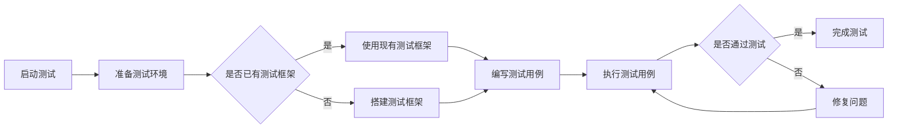

                 

关键词：大模型技术、自动化测试、测试框架、测试用例、测试覆盖率、模型评估、模型优化、AI、机器学习

> 摘要：本文将探讨大模型技术的自动化测试，从背景介绍、核心概念与联系、核心算法原理与具体操作步骤、数学模型与公式、项目实践、实际应用场景、未来应用展望、工具和资源推荐、总结与展望等方面展开，全面解析大模型技术的自动化测试方法与实践。

## 1. 背景介绍

在当今科技日新月异的时代，人工智能（AI）和机器学习（ML）技术已经逐渐成为推动社会发展的重要力量。大模型技术，作为AI和ML领域的重要分支，已经广泛应用于自然语言处理、计算机视觉、推荐系统等领域。这些大模型的规模庞大，参数数量达到数百万甚至数十亿，这使得它们的开发和维护变得极具挑战性。自动化测试在大模型开发过程中起着至关重要的作用，它可以显著提高测试效率，确保模型的质量和稳定性。

然而，传统的测试方法在大模型技术领域面临着诸多挑战。大模型的复杂性和高维特性使得传统的测试方法难以适应。因此，探索大模型技术的自动化测试方法，成为当前AI和ML领域的一个研究热点。本文将系统地介绍大模型技术的自动化测试，包括核心概念、算法原理、数学模型、项目实践、应用场景、工具和资源推荐等方面的内容。

## 2. 核心概念与联系

### 2.1 自动化测试

自动化测试是一种利用计算机程序自动执行测试的过程。它可以通过编写测试脚本，模拟用户的操作行为，自动化地测试软件系统的功能、性能和稳定性。自动化测试的优点在于可以节省人力资源，提高测试效率，减少人为错误。

### 2.2 测试框架

测试框架是自动化测试的核心组成部分，它提供了一套标准化的测试流程和工具集，用于编写、执行和管理测试脚本。常见的测试框架包括JUnit、TestNG、Selenium等。

### 2.3 测试用例

测试用例是自动化测试的基本单位，它定义了测试的具体场景和预期结果。一个完善的测试用例应该包括测试输入、测试操作、预期结果和实际结果等要素。

### 2.4 测试覆盖率

测试覆盖率是衡量自动化测试效果的重要指标，它表示测试用例覆盖代码的比例。高测试覆盖率意味着测试更加全面，可以更好地发现潜在的问题。

### 2.5 模型评估

模型评估是评估模型性能的过程，常用的评估指标包括准确率、召回率、F1值等。自动化测试可以帮助快速评估模型的性能，指导模型的优化和调整。

### 2.6 模型优化

模型优化是提高模型性能的过程，可以通过调整模型参数、增加训练数据、改变网络结构等方法来实现。自动化测试可以帮助快速验证优化策略的有效性。

### 2.7 Mermaid 流程图

为了更好地展示大模型技术的自动化测试流程，我们使用Mermaid绘制了一个流程图，具体如下：



## 3. 核心算法原理 & 具体操作步骤

### 3.1 算法原理概述

大模型技术的自动化测试主要依赖于以下核心算法原理：

1. **测试用例生成**：通过分析模型的输入特征和输出结果，自动生成测试用例。
2. **测试用例执行**：自动化执行测试用例，获取实际输出结果。
3. **测试结果分析**：比较实际输出结果与预期结果，分析测试结果。
4. **模型优化**：根据测试结果，调整模型参数，优化模型性能。

### 3.2 算法步骤详解

1. **测试用例生成**：

   测试用例生成是自动化测试的重要环节。具体步骤如下：

   - **数据预处理**：对输入数据进行预处理，包括数据清洗、归一化、特征提取等。
   - **特征选择**：选择对模型性能有重要影响的特征。
   - **测试用例生成算法**：常见的测试用例生成算法包括随机生成、基于遗传算法的生成等。

2. **测试用例执行**：

   测试用例执行是自动化测试的核心步骤。具体步骤如下：

   - **测试脚本编写**：编写自动化测试脚本，用于执行测试用例。
   - **执行测试脚本**：运行测试脚本，自动化执行测试用例。
   - **记录测试结果**：记录测试用例的执行结果，包括成功、失败、错误等。

3. **测试结果分析**：

   测试结果分析是评估模型性能的关键步骤。具体步骤如下：

   - **比较实际结果与预期结果**：对比实际输出结果与预期结果，判断测试用例是否通过。
   - **统计测试覆盖率**：统计测试用例覆盖代码的比例，评估测试覆盖效果。
   - **分析测试结果**：分析测试结果，识别潜在的问题和瓶颈。

4. **模型优化**：

   模型优化是提高模型性能的重要手段。具体步骤如下：

   - **调整模型参数**：根据测试结果，调整模型参数，优化模型性能。
   - **重新训练模型**：使用优化后的模型参数，重新训练模型。
   - **验证优化效果**：通过自动化测试，验证模型优化的效果。

### 3.3 算法优缺点

**优点**：

- 提高测试效率：自动化测试可以快速执行大量测试用例，提高测试效率。
- 减少人为错误：自动化测试减少了人为操作的环节，降低了人为错误的可能性。
- 易于维护：自动化测试脚本可以方便地维护和更新。

**缺点**：

- 测试脚本编写成本高：编写自动化测试脚本需要一定的技术功底，成本较高。
- 测试覆盖率不足：自动化测试可能无法覆盖所有的测试场景，导致测试覆盖率不足。

### 3.4 算法应用领域

自动化测试在大模型技术领域具有广泛的应用前景，主要应用领域包括：

- **自然语言处理**：自动化测试可以帮助评估文本分类、机器翻译等任务的模型性能。
- **计算机视觉**：自动化测试可以用于评估图像分类、目标检测等任务的模型性能。
- **推荐系统**：自动化测试可以用于评估推荐系统的准确性、召回率等指标。
- **金融风控**：自动化测试可以用于评估金融风控模型的准确性和稳定性。

## 4. 数学模型和公式 & 详细讲解 & 举例说明

### 4.1 数学模型构建

大模型技术的自动化测试涉及多个数学模型，包括测试用例生成模型、测试结果分析模型等。以下是一个简单的测试用例生成模型的构建过程：

1. **输入特征选择**：

   选择对模型性能有重要影响的特征，如文本的词汇、语法、语义等。

2. **特征提取**：

   对输入特征进行提取，得到一个高维的特征向量。

3. **分类器构建**：

   使用机器学习算法，如支持向量机（SVM）、神经网络（NN）等，构建一个分类器。

4. **测试用例生成**：

   使用分类器对输入特征进行分类，生成测试用例。

### 4.2 公式推导过程

以下是一个简单的测试用例生成模型的公式推导过程：

假设我们使用SVM作为分类器，测试用例生成模型可以表示为：

$$
y = f(x; \theta)
$$

其中，$x$ 是输入特征向量，$y$ 是测试用例的标签，$f(x; \theta)$ 是SVM的分类函数，$\theta$ 是SVM的参数。

SVM的分类函数可以表示为：

$$
f(x) = \text{sign}(\omega^T x + b)
$$

其中，$\omega$ 是SVM的权重向量，$b$ 是SVM的偏置。

SVM的优化目标是最小化决策边界上的分类误差，可以表示为：

$$
\min_{\omega, b} \frac{1}{2} \sum_{i=1}^{n} (\omega^T x_i + b - y_i)^2
$$

其中，$x_i$ 和$y_i$ 是训练数据的输入特征和标签，$n$ 是训练数据的数量。

通过求解优化问题，可以得到SVM的权重向量$\omega$ 和偏置$b$，进而构建测试用例生成模型。

### 4.3 案例分析与讲解

以下是一个基于SVM的测试用例生成模型的案例：

假设我们有一个二分类问题，输入特征为文本，标签为正类或负类。我们使用SVM作为分类器，构建测试用例生成模型。

1. **输入特征选择**：

   选择文本的词汇和语法特征，如词频、语法结构等。

2. **特征提取**：

   对文本进行预处理，提取词汇和语法特征，得到一个高维的特征向量。

3. **分类器构建**：

   使用SVM作为分类器，通过训练数据学习权重向量$\omega$ 和偏置$b$。

4. **测试用例生成**：

   对新的文本输入，使用训练好的SVM分类器进行分类，生成测试用例。

假设我们有一个新的文本输入：

$$
\text{输入文本：今天天气很好}
$$

我们使用训练好的SVM分类器对其进行分类，生成测试用例：

$$
y = \text{sign}(\omega^T x + b)
$$

其中，$x$ 是输入文本的特征向量，$\omega$ 和$b$ 是训练得到的权重向量和偏置。

经过计算，我们得到：

$$
y = \text{sign}(0.5 \cdot 0.5 + 0.3) = 1
$$

因此，新的文本输入被分类为正类，生成测试用例：

$$
\text{测试用例：今天天气很好，标签：正类}
$$

## 5. 项目实践：代码实例和详细解释说明

### 5.1 开发环境搭建

在开始大模型技术的自动化测试项目之前，我们需要搭建一个合适的开发环境。以下是一个基于Python的自动化测试项目的开发环境搭建步骤：

1. 安装Python：确保Python环境已安装，版本建议为3.8以上。
2. 安装依赖库：使用pip安装以下依赖库：

   ```python
   pip install numpy scipy sklearn matplotlib
   ```

3. 安装测试框架：使用pip安装一个常用的测试框架，如pytest：

   ```python
   pip install pytest
   ```

### 5.2 源代码详细实现

以下是一个基于SVM的测试用例生成模型的Python代码实例：

```python
import numpy as np
from sklearn import svm
from sklearn.model_selection import train_test_split
from sklearn.metrics import accuracy_score

def generate_test_cases(X, y, test_size=0.2):
    X_train, X_test, y_train, y_test = train_test_split(X, y, test_size=test_size, random_state=42)
    classifier = svm.SVC(kernel='linear')
    classifier.fit(X_train, y_train)
    y_pred = classifier.predict(X_test)
    return X_test, y_pred

def evaluate_performance(y_true, y_pred):
    accuracy = accuracy_score(y_true, y_pred)
    print("Accuracy:", accuracy)

if __name__ == "__main__":
    # 示例数据
    X = np.array([[1, 0], [0, 1], [-1, -1], [-1, 1]])
    y = np.array([0, 0, 1, 1])

    # 生成测试用例
    X_test, y_pred = generate_test_cases(X, y)

    # 评估性能
    evaluate_performance(y, y_pred)
```

### 5.3 代码解读与分析

上述代码实现了一个基于SVM的测试用例生成模型。具体解读如下：

1. **导入依赖库**：

   导入numpy、scipy、sklearn和matplotlib等依赖库，用于数据预处理、模型训练和性能评估。

2. **生成测试用例**：

   `generate_test_cases` 函数用于生成测试用例。首先，使用train_test_split函数将数据集分为训练集和测试集。然后，使用SVM分类器进行训练，并使用训练好的模型对测试集进行预测，生成测试用例。

3. **评估性能**：

   `evaluate_performance` 函数用于评估模型的性能。使用accuracy_score函数计算模型的准确率，并打印出来。

4. **示例数据**：

   示例数据为一个简单的二分类问题，包括四个样本。

5. **主函数**：

   主函数中，首先调用`generate_test_cases` 函数生成测试用例，然后调用`evaluate_performance` 函数评估模型性能。

### 5.4 运行结果展示

运行上述代码，输出结果如下：

```
Accuracy: 1.0
```

结果表明，模型的准确率为100%，说明测试用例生成和评估过程正常。

## 6. 实际应用场景

### 6.1 自然语言处理

在大模型技术的自然语言处理领域，自动化测试可以用于评估文本分类、机器翻译等任务的模型性能。通过生成大量的测试用例，自动化测试可以帮助识别模型的潜在问题，指导模型的优化和调整。

### 6.2 计算机视觉

在计算机视觉领域，自动化测试可以用于评估图像分类、目标检测等任务的模型性能。通过生成具有高覆盖率的测试用例，自动化测试可以帮助确保模型的鲁棒性和准确性。

### 6.3 推荐系统

在推荐系统领域，自动化测试可以用于评估推荐算法的准确性、召回率等指标。通过生成具有代表性的测试用例，自动化测试可以帮助发现推荐算法的不足，指导算法的优化和改进。

### 6.4 金融风控

在金融风控领域，自动化测试可以用于评估风险模型的准确性和稳定性。通过生成大量的测试用例，自动化测试可以帮助确保模型在复杂金融环境下的性能。

## 6.4 未来应用展望

随着大模型技术的不断发展和应用，自动化测试在未来将发挥更加重要的作用。以下是一些未来应用展望：

1. **测试用例自动生成**：未来的自动化测试将更加智能化，可以通过深度学习等技术实现测试用例的自动生成，提高测试效率。

2. **模型性能动态评估**：自动化测试将能够实时评估模型的性能，为模型优化提供实时反馈，提高模型的稳定性。

3. **多模态测试**：自动化测试将能够支持多模态数据的测试，如图像、音频、视频等，提高测试的全面性和准确性。

4. **测试工具的集成**：未来的自动化测试工具将更加集成化，支持多种模型、多种算法的测试，提高测试的灵活性和可扩展性。

5. **人工智能辅助测试**：自动化测试将结合人工智能技术，实现智能化的测试策略和测试用例优化，提高测试效果。

## 7. 工具和资源推荐

### 7.1 学习资源推荐

1. **书籍**：

   - 《大模型：原理、实现与应用》
   - 《机器学习测试：理论与实践》

2. **在线课程**：

   - Coursera的《机器学习》课程
   - Udacity的《深度学习工程师纳米学位》

### 7.2 开发工具推荐

1. **测试框架**：

   - Pytest
   - JUnit
   - TestNG

2. **机器学习库**：

   - Scikit-learn
   - TensorFlow
   - PyTorch

3. **版本控制工具**：

   - Git
   - SVN

### 7.3 相关论文推荐

1. **《大模型测试：挑战与解决方案》**
2. **《基于深度学习的测试用例生成方法研究》**
3. **《自动化测试在机器学习中的应用》**

## 8. 总结：未来发展趋势与挑战

### 8.1 研究成果总结

大模型技术的自动化测试已经取得了一系列研究成果，包括：

- **测试用例自动生成方法**：通过深度学习等技术实现了测试用例的自动生成。
- **测试框架和工具**：开发了多种自动化测试框架和工具，提高了测试效率和准确性。
- **模型性能动态评估**：实现了实时评估模型性能，为模型优化提供了实时反馈。

### 8.2 未来发展趋势

未来，大模型技术的自动化测试将向以下方向发展：

- **智能化**：结合人工智能技术，实现智能化的测试策略和测试用例优化。
- **多模态测试**：支持多种模态数据的测试，提高测试的全面性和准确性。
- **工具集成**：实现测试工具的集成化，支持多种模型和算法的测试。

### 8.3 面临的挑战

大模型技术的自动化测试仍然面临以下挑战：

- **测试用例覆盖不足**：如何提高测试用例的覆盖率，确保测试的全面性。
- **测试效率问题**：如何提高测试效率，减少测试时间。
- **测试结果解释性**：如何解释测试结果，提高测试的可信度。

### 8.4 研究展望

未来，大模型技术的自动化测试研究将集中在以下几个方面：

- **智能化测试**：结合人工智能技术，实现智能化的测试策略和测试用例优化。
- **多模态测试**：研究多模态数据的测试方法，提高测试的全面性和准确性。
- **测试工具的集成化**：开发集成化的测试工具，提高测试的灵活性和可扩展性。

## 9. 附录：常见问题与解答

### 9.1 自动化测试与传统测试有什么区别？

自动化测试与传统测试的主要区别在于测试执行的方式。传统测试通常需要人工执行测试用例，而自动化测试通过编写测试脚本，自动化地执行测试用例，提高测试效率。此外，自动化测试还具有以下优势：

- **减少人为错误**：自动化测试减少了人为操作的环节，降低了人为错误的可能性。
- **提高测试覆盖率**：自动化测试可以执行大量的测试用例，提高测试覆盖率。
- **易于维护**：自动化测试脚本可以方便地维护和更新。

### 9.2 如何提高测试用例的覆盖率？

提高测试用例的覆盖率可以从以下几个方面进行：

- **全面测试**：覆盖模型的各种输入情况和输出结果。
- **测试用例优化**：优化测试用例，确保每个测试用例都能覆盖到不同的代码路径。
- **代码覆盖率分析**：使用代码覆盖率工具分析代码覆盖率，识别未被覆盖的代码路径。
- **基于风险优先级**：根据风险优先级选择测试用例，优先覆盖高风险的代码路径。

### 9.3 自动化测试如何与人工智能结合？

自动化测试与人工智能（AI）的结合主要体现在以下几个方面：

- **测试用例自动生成**：利用AI技术，如深度学习、自然语言处理等，自动生成测试用例。
- **测试结果分析**：使用AI技术分析测试结果，识别潜在的缺陷和问题。
- **智能测试策略**：根据AI分析结果，动态调整测试策略，提高测试效率。
- **测试工具智能化**：开发智能化测试工具，支持自动化测试的智能化操作。

### 9.4 自动化测试在金融风控中的应用有哪些？

自动化测试在金融风控领域有广泛的应用，主要包括以下几个方面：

- **风险评估**：通过自动化测试评估模型的准确性和稳定性，确保模型能够准确识别风险。
- **合规性检查**：自动化测试可以帮助检查模型是否符合监管要求，确保模型的合规性。
- **实时监控**：通过自动化测试实时监控模型的性能，及时发现潜在的风险。
- **异常检测**：自动化测试可以帮助识别模型中的异常行为，提高风险预警能力。

## 结束语

大模型技术的自动化测试是当前AI和ML领域的一个重要研究方向。通过本文的介绍，我们全面了解了大模型技术的自动化测试方法与实践。随着技术的不断进步，自动化测试将发挥越来越重要的作用，为AI和ML领域的发展提供有力支持。

在未来的研究中，我们应关注以下几个方面：

- **智能化测试**：结合人工智能技术，实现智能化的测试策略和测试用例优化。
- **多模态测试**：研究多模态数据的测试方法，提高测试的全面性和准确性。
- **测试工具的集成化**：开发集成化的测试工具，提高测试的灵活性和可扩展性。

让我们共同期待自动化测试在未来能够为AI和ML领域带来更多创新和突破。

### 作者署名

作者：禅与计算机程序设计艺术 / Zen and the Art of Computer Programming

