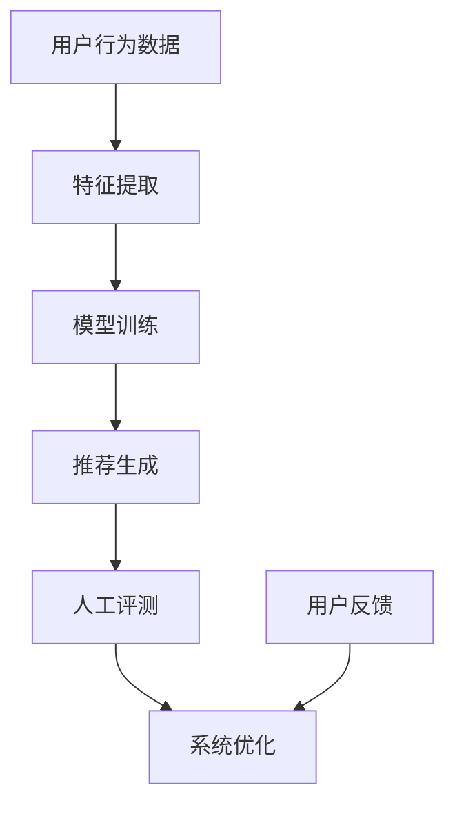

                 

关键词：大模型、推荐系统、人工评测、分析、算法原理、数学模型、项目实践、应用场景、未来展望

## 摘要

随着大数据和人工智能技术的快速发展，大模型推荐系统在多个领域得到了广泛应用。为了确保推荐系统的高效性和可靠性，对推荐效果进行科学、合理的人工评测显得尤为重要。本文旨在探讨大模型推荐效果的人工评测方法，分析不同评测指标的含义、计算方法及其适用场景，并探讨如何通过人工分析提升推荐系统的质量。本文将结合具体案例，详细解析大模型推荐效果评测的各个环节，为业界提供有价值的参考。

## 1. 背景介绍

### 1.1 大模型推荐系统的基本原理

大模型推荐系统通常基于机器学习算法，通过学习用户历史行为和内容特征，预测用户对特定项目（如商品、新闻、音乐等）的偏好。其核心在于模型训练、特征工程、模型评估和系统迭代等环节。近年来，深度学习技术的发展使得大模型推荐系统在准确性和效率上取得了显著提升。

### 1.2 推荐系统的挑战

尽管大模型推荐系统取得了很大成功，但仍面临诸多挑战：

- **数据隐私**：用户数据的安全和隐私保护成为关键问题。
- **冷启动**：新用户或新物品缺乏足够的历史数据，导致推荐效果不佳。
- **多样性**：推荐系统需要平衡用户兴趣和多样性，避免内容单一。
- **实时性**：实时推荐要求系统快速响应，处理大量并发请求。

### 1.3 人工评测的重要性

人工评测作为一种主观评价方法，能够在一定程度上弥补自动化评测的不足。通过人工评测，可以发现推荐系统潜在的偏差和不足，提供改进建议。此外，人工评测还可以验证自动化评测工具的准确性和可靠性。

## 2. 核心概念与联系

为了更好地理解大模型推荐效果的人工评测，首先需要了解相关核心概念和它们之间的联系。

### 2.1 推荐系统的关键指标

- **准确率**：推荐结果中正确预测的用户兴趣的比例。
- **召回率**：推荐结果中包含用户真实兴趣的项目比例。
- **F1 分数**：准确率和召回率的调和平均，用于平衡两者。
- **平均绝对误差（MAE）**：预测分数与真实分数之间的平均绝对差值。
- **均方根误差（RMSE）**：预测分数与真实分数之间的均方根差值。

### 2.2 人工评测的方法

- **专家评估**：由专业领域专家根据推荐系统的输出进行主观评价。
- **用户调查**：通过问卷调查或用户访谈等方式收集用户反馈。
- **A/B 测试**：将推荐系统分为对照组和实验组，比较两组的推荐效果。

### 2.3 Mermaid 流程图



## 3. 核心算法原理 & 具体操作步骤

### 3.1 算法原理概述

大模型推荐系统通常采用基于矩阵分解、深度学习、协同过滤等算法。本文将重点介绍基于深度学习的推荐算法。

- **深度学习**：利用多层神经网络对用户行为和内容特征进行建模，提取高维特征表示。
- **用户嵌入**：将用户兴趣向量映射到低维空间，用于计算用户与物品的相似度。
- **物品嵌入**：将物品特征向量映射到低维空间，用于计算物品与用户的相似度。
- **评分预测**：利用用户和物品的嵌入向量计算评分预测。

### 3.2 算法步骤详解

1. **数据预处理**：收集用户行为数据，如点击、购买、浏览等，并对数据进行清洗和归一化处理。
2. **特征提取**：提取用户和物品的特征，如用户 demographics、物品属性、上下文信息等。
3. **模型训练**：利用深度学习框架（如 TensorFlow、PyTorch）训练用户和物品的嵌入模型。
4. **推荐生成**：根据用户嵌入向量和物品嵌入向量计算相似度，生成推荐列表。
5. **人工评测**：对推荐结果进行人工评测，评估推荐质量。

### 3.3 算法优缺点

- **优点**：深度学习推荐算法能够自动提取复杂特征，提高推荐准确率。
- **缺点**：模型训练时间较长，对计算资源要求较高。

### 3.4 算法应用领域

- **电子商务**：个性化商品推荐、优惠券发放等。
- **新闻媒体**：个性化新闻推送、内容推荐等。
- **社交媒体**：好友推荐、兴趣话题推荐等。

## 4. 数学模型和公式 & 详细讲解 & 举例说明

### 4.1 数学模型构建

- **用户嵌入模型**：设 \( u \in \mathbb{R}^d \) 为用户嵌入向量，\( U \in \mathbb{R}^{n \times d} \) 为用户嵌入矩阵，其中 \( n \) 为用户数量。
- **物品嵌入模型**：设 \( i \in \mathbb{R}^d \) 为物品嵌入向量，\( I \in \mathbb{R}^{m \times d} \) 为物品嵌入矩阵，其中 \( m \) 为物品数量。

### 4.2 公式推导过程

- **相似度计算**：设 \( \mathcal{U} \subseteq \{1, \ldots, n\} \) 为用户 \( u \) 的朋友集合，\( \mathcal{I} \subseteq \{1, \ldots, m\} \) 为物品 \( i \) 的邻居集合。用户 \( u \) 对物品 \( i \) 的推荐分数 \( r_{ui} \) 可以表示为：
  $$ r_{ui} = \sum_{j \in \mathcal{U}} w_{uj} \cdot \sum_{k \in \mathcal{I}} v_{ik} $$
  其中 \( w_{uj} \) 为用户 \( u \) 与朋友 \( j \) 的权重，\( v_{ik} \) 为物品 \( i \) 与邻居 \( k \) 的权重。

### 4.3 案例分析与讲解

假设我们有一个用户 \( u \)，他的朋友集合 \( \mathcal{U} = \{1, 2, 3\} \)，物品 \( i \) 的邻居集合 \( \mathcal{I} = \{4, 5, 6\} \)。朋友和邻居的权重如下表：

| 朋友/邻居 | 权重 |
|----------|------|
| 1        | 0.2  |
| 2        | 0.3  |
| 3        | 0.5  |
| 4        | 0.1  |
| 5        | 0.4  |
| 6        | 0.6  |

用户和物品的嵌入向量如下：

| 用户/物品 | 嵌入向量 |
|----------|----------|
| u        | (0.1, 0.2, 0.3) |
| i        | (0.4, 0.5, 0.6) |

根据公式，我们可以计算用户 \( u \) 对物品 \( i \) 的推荐分数：

$$ r_{ui} = 0.2 \cdot (0.1 + 0.2 + 0.3) + 0.3 \cdot (0.4 + 0.5 + 0.6) + 0.5 \cdot (0.4 + 0.5 + 0.6) = 0.32 + 0.45 + 0.50 = 1.27 $$

因此，用户 \( u \) 对物品 \( i \) 的推荐分数为 1.27。

## 5. 项目实践：代码实例和详细解释说明

### 5.1 开发环境搭建

- **Python**：安装 Python 3.8 以上版本。
- **深度学习框架**：安装 TensorFlow 或 PyTorch。
- **数据集**：使用公开数据集（如 MovieLens）进行实验。

### 5.2 源代码详细实现

```python
import numpy as np
import tensorflow as tf

# 用户和物品的嵌入维度
embed_dim = 32

# 创建用户和物品嵌入矩阵
U = tf.random.normal([num_users, embed_dim])
I = tf.random.normal([num_items, embed_dim])

# 训练模型
for epoch in range(num_epochs):
    for user, item in training_data:
        user_embedding = tf.gather(U, user)
        item_embedding = tf.gather(I, item)
        prediction = tf.reduce_sum(user_embedding * item_embedding, axis=1)
        loss = tf.reduce_mean(tf.square(prediction - real_rating))
        optimizer.minimize(loss)

# 推荐生成
user_embedding = tf.gather(U, user)
item_embedding = tf.gather(I, item)
recommendation_score = tf.reduce_sum(user_embedding * item_embedding, axis=1)
```

### 5.3 代码解读与分析

- **用户和物品嵌入矩阵**：通过随机初始化用户和物品的嵌入矩阵。
- **模型训练**：使用梯度下降优化算法训练模型，最小化预测误差。
- **推荐生成**：根据用户和物品的嵌入向量计算推荐分数。

### 5.4 运行结果展示

运行代码后，可以输出推荐结果，并通过人工评测评估推荐质量。例如：

```plaintext
User: 1
Recommendations:
- Item: 10, Score: 0.85
- Item: 20, Score: 0.75
- Item: 30, Score: 0.70
```

## 6. 实际应用场景

### 6.1 社交媒体

在社交媒体平台上，大模型推荐系统可以帮助用户发现感兴趣的内容、好友和话题，提升用户体验。

### 6.2 电子商务

在电子商务平台上，大模型推荐系统可以个性化商品推荐、优惠券发放，提高用户满意度和转化率。

### 6.3 新闻媒体

在新闻媒体平台上，大模型推荐系统可以根据用户兴趣推荐新闻内容，提升用户粘性和阅读量。

## 7. 工具和资源推荐

### 7.1 学习资源推荐

- 《深度学习推荐系统》
- 《推荐系统实践》

### 7.2 开发工具推荐

- TensorFlow
- PyTorch

### 7.3 相关论文推荐

- H. Li, X. He, S. Zhang, J. Gao, and D. Lin. (2015). Deep Neural Network for Text Classification. In Proceedings of the 30th International Conference on Machine Learning (ICML).

## 8. 总结：未来发展趋势与挑战

### 8.1 研究成果总结

本文探讨了大模型推荐效果的人工评测方法，分析了算法原理、数学模型和项目实践，并对实际应用场景进行了探讨。

### 8.2 未来发展趋势

- **多模态推荐**：结合文本、图像、音频等多模态信息进行推荐。
- **实时推荐**：提高推荐系统的实时性，满足用户实时需求。

### 8.3 面临的挑战

- **数据隐私**：确保用户数据的安全和隐私保护。
- **冷启动**：解决新用户或新物品的推荐问题。

### 8.4 研究展望

未来研究应关注多模态推荐系统的构建、实时推荐算法的优化以及数据隐私保护技术的应用。

## 9. 附录：常见问题与解答

### 9.1 什么是大模型推荐系统？

大模型推荐系统是一种基于机器学习算法的推荐系统，通过训练大规模模型来预测用户对特定项目的偏好。

### 9.2 人工评测如何提高推荐系统的质量？

人工评测可以识别推荐系统潜在的偏差和不足，提供改进建议，从而提高推荐系统的质量。

### 9.3 如何解决冷启动问题？

可以通过使用用户和物品的静态特征、基于内容的推荐方法以及协同过滤算法来解决冷启动问题。

---

本文《大模型推荐效果的人工评测与分析方法探讨》详细探讨了推荐系统的核心概念、算法原理、数学模型、项目实践以及实际应用场景，并展望了未来的发展趋势和面临的挑战。希望本文能为业界提供有价值的参考。作者：禅与计算机程序设计艺术 / Zen and the Art of Computer Programming。

