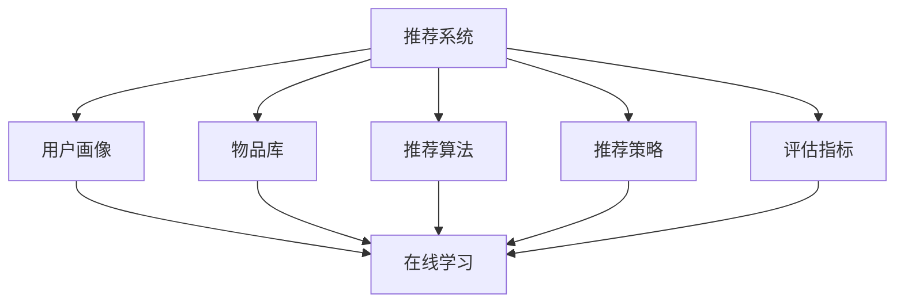

                 

 大模型推荐系统在当今互联网时代扮演着至关重要的角色。随着用户生成内容（UGC）的爆炸式增长，推荐系统已成为各类社交媒体、电子商务平台和在线视频网站等不可或缺的核心组件。这些系统通过不断学习用户行为，预测用户兴趣，从而为用户提供个性化的内容推荐，提高用户体验和满意度。

然而，随着推荐系统规模的不断扩大和数据量的持续增长，离线学习的方式逐渐暴露出其局限性。首先，离线学习需要大量的计算资源，特别是对于深度学习模型，训练时间可能长达数天甚至数周。其次，离线学习无法实时响应用户行为的动态变化，导致推荐结果可能出现延迟。最后，离线学习模型的性能评估通常基于历史数据集，而无法实时捕捉到新出现的问题。

为了克服这些挑战，本文将探讨一种新兴的在线学习机制，该机制能够在大模型推荐系统中实现实时、高效的学习与优化。我们将首先介绍推荐系统的基础概念，包括其核心组件和基本原理。然后，深入探讨在线学习的定义、优势和应用场景。接着，我们将详细阐述在线学习机制的核心算法原理和具体操作步骤，包括算法的优缺点及其适用领域。随后，通过数学模型和公式的推导，进一步揭示在线学习机制的内在机制。最后，我们通过项目实践展示具体的代码实例和详细解释，以及在线学习在实际应用场景中的表现和未来展望。

## 1. 背景介绍

### 推荐系统的发展历程

推荐系统的发展历程可以分为三个阶段：基于内容的推荐（Content-Based Filtering）、协同过滤（Collaborative Filtering）和混合推荐（Hybrid Recommendation）。在早期，基于内容的推荐方法通过分析用户的历史行为和偏好来推荐相似的内容。这种方法简单直观，但存在一定的局限性，因为它依赖于先验知识库，无法很好地应对用户兴趣的变化。

随着互联网的普及和用户数据的积累，协同过滤方法逐渐成为主流。协同过滤利用用户之间的相似性来推荐内容，这种方法通过分析用户对项目的评分或行为来建立用户-项目矩阵，并利用矩阵分解或相似性计算等技术进行推荐。协同过滤方法大大提高了推荐的准确性，但仍存在一些问题，如用户冷启动问题（新用户没有足够的历史数据）、数据稀疏问题（用户-项目矩阵中存在大量零值）和推荐多样性不足等。

为了解决这些问题，混合推荐系统应运而生。混合推荐系统结合了基于内容和协同过滤的方法，通过多模型融合和特征工程等技术，提高了推荐的准确性和多样性。然而，传统的混合推荐系统主要依赖离线学习，无法及时响应用户行为的动态变化，难以满足快速变化的互联网环境。

### 在线学习的概念和重要性

在线学习，也称为在线机器学习，是一种能够在数据流中实时更新和优化的学习方式。与传统的离线学习相比，在线学习具有以下特点：

1. **实时性**：在线学习能够实时更新模型，及时响应用户行为的动态变化，提高推荐的时效性。
2. **高效性**：在线学习利用流数据的特点，无需等待大规模数据集的收集和处理，从而提高了学习效率。
3. **自适应**：在线学习能够根据用户行为和反馈动态调整模型参数，从而提高推荐系统的适应性和灵活性。

在线学习的重要性在于：

1. **提高用户体验**：通过实时推荐，用户能够更快地找到自己感兴趣的内容，提高满意度。
2. **增强推荐准确性**：在线学习能够更好地捕捉用户的短期兴趣和行为变化，提高推荐的准确性。
3. **应对数据变化**：在线学习能够动态适应数据分布的变化，避免模型过拟合和性能下降。

随着大数据和云计算技术的发展，在线学习在推荐系统中的应用越来越广泛，成为提升推荐系统性能的关键技术之一。

## 2. 核心概念与联系

### 2.1 推荐系统的核心组件

推荐系统通常由以下几个核心组件组成：

1. **用户画像**：通过分析用户的历史行为、兴趣偏好和社交信息，构建用户画像，用于后续的推荐决策。
2. **物品库**：包含所有推荐物品的信息，如标题、描述、标签等，为推荐提供基础数据。
3. **推荐算法**：根据用户画像和物品库，利用各种推荐算法生成推荐结果。
4. **推荐策略**：结合推荐算法和业务目标，制定推荐策略，如基于内容的推荐、协同过滤和混合推荐等。
5. **评估指标**：用于评估推荐系统的性能，如准确率、召回率、覆盖率等。

### 2.2 推荐系统的基础原理

推荐系统的基础原理主要包括以下几种：

1. **基于内容的推荐**：通过分析物品的内容特征（如文本、图片、音频等），与用户的兴趣特征进行匹配，生成推荐结果。
2. **协同过滤**：通过分析用户之间的相似性，推荐与目标用户相似的其他用户的喜欢或评分较高的物品。
3. **混合推荐**：结合多种推荐方法，提高推荐的准确性和多样性。

### 2.3 在线学习的定义与原理

在线学习，又称增量学习或在线更新学习，是指模型在数据流中不断更新参数，以适应新的数据和用户行为。在线学习的关键原理包括：

1. **增量更新**：模型参数的更新基于新加入的数据，而不是一次性处理整个数据集。
2. **实时性**：模型能够实时响应用户行为的动态变化，提高推荐的时效性。
3. **适应性**：模型参数根据用户行为和反馈动态调整，以适应不断变化的数据分布。

### 2.4 推荐系统与在线学习的关系

在线学习在推荐系统中的应用，主要体现在以下几个方面：

1. **实时推荐**：通过在线学习，推荐系统能够实时更新用户画像和物品特征，生成更准确的推荐结果。
2. **动态调整**：在线学习能够根据用户反馈和推荐效果，动态调整推荐策略和模型参数，提高推荐系统的适应性和灵活性。
3. **数据优化**：在线学习通过实时处理流数据，优化数据结构和模型性能，提高推荐系统的效率和准确性。

### Mermaid 流程图

下面是一个推荐系统与在线学习关系的 Mermaid 流程图：



在该流程图中，推荐系统的各个组件（用户画像、物品库、推荐算法、推荐策略和评估指标）都与在线学习紧密相连，共同构成一个实时、高效、自适应的推荐系统。

## 3. 核心算法原理 & 具体操作步骤

### 3.1 算法原理概述

在线学习机制在大模型推荐系统中，主要通过以下几个步骤实现：

1. **数据收集**：实时收集用户行为数据和物品特征数据。
2. **特征工程**：对数据进行预处理和特征提取，构建用户画像和物品特征向量。
3. **模型更新**：利用增量学习算法，实时更新推荐模型参数。
4. **生成推荐**：根据更新后的模型参数，生成推荐结果。
5. **评估优化**：通过评估指标，对推荐效果进行评估和优化。

在线学习算法主要包括以下几种：

1. **在线梯度下降**：通过在线更新梯度，逐步优化模型参数。
2. **随机梯度下降**：每次更新仅使用一个样本的梯度，加快学习速度。
3. **指数加权平均**：结合历史数据和实时数据，动态调整模型权重。

### 3.2 算法步骤详解

#### 3.2.1 数据收集

在线学习的第一步是数据收集。数据来源主要包括用户行为数据（如点击、收藏、购买等）和物品特征数据（如标题、描述、标签等）。数据收集可以通过日志收集系统、API接口调用等方式实现。

#### 3.2.2 特征工程

特征工程是构建用户画像和物品特征向量的关键步骤。具体步骤如下：

1. **数据预处理**：对原始数据进行清洗、去噪、补全等处理，确保数据质量。
2. **特征提取**：根据业务需求，提取用户行为特征（如点击率、购买率等）和物品特征（如标题长度、描述长度等）。
3. **特征融合**：将不同来源的特征进行融合，构建综合特征向量。

#### 3.2.3 模型更新

在线学习的核心是模型更新。具体步骤如下：

1. **初始化模型**：根据特征向量，初始化推荐模型参数。
2. **增量学习**：每次接收新的用户行为数据后，计算梯度并更新模型参数。
3. **模型优化**：利用优化算法（如在线梯度下降、随机梯度下降等），逐步优化模型参数。

#### 3.2.4 生成推荐

生成推荐是根据更新后的模型参数，为用户生成推荐结果。具体步骤如下：

1. **计算推荐分数**：根据用户画像和物品特征向量，计算每个物品的推荐分数。
2. **排序筛选**：对推荐分数进行排序，筛选出Top-N个推荐结果。
3. **展示推荐**：将推荐结果展示给用户。

#### 3.2.5 评估优化

评估优化是对推荐效果进行评估和优化。具体步骤如下：

1. **性能评估**：根据评估指标（如准确率、召回率、覆盖率等），评估推荐系统的性能。
2. **模型调整**：根据评估结果，动态调整模型参数和推荐策略。
3. **持续优化**：通过不断的数据收集和模型更新，实现推荐系统的持续优化。

### 3.3 算法优缺点

#### 优点

1. **实时性**：在线学习能够实时更新模型，及时响应用户行为的动态变化，提高推荐的时效性。
2. **高效性**：在线学习利用流数据的特点，无需等待大规模数据集的收集和处理，从而提高了学习效率。
3. **自适应**：在线学习能够根据用户行为和反馈动态调整模型参数，从而提高推荐系统的适应性和灵活性。

#### 缺点

1. **计算资源**：在线学习需要大量的计算资源，特别是在大规模推荐系统中，对硬件性能要求较高。
2. **数据质量**：在线学习对数据质量要求较高，数据清洗和特征工程是关键步骤，否则可能导致模型性能下降。
3. **模型稳定性**：在线学习过程中，模型参数的频繁更新可能导致模型稳定性下降，需要通过优化算法和参数调整来提高模型稳定性。

### 3.4 算法应用领域

在线学习机制在推荐系统中的应用非常广泛，包括但不限于以下几个领域：

1. **电子商务**：通过在线学习，实时推荐用户可能感兴趣的商品，提高购买转化率和用户满意度。
2. **社交媒体**：通过在线学习，实时推荐用户可能感兴趣的内容，提高用户活跃度和留存率。
3. **在线视频**：通过在线学习，实时推荐用户可能感兴趣的视频，提高用户观看时长和互动率。
4. **搜索引擎**：通过在线学习，实时调整搜索结果排序，提高搜索结果的准确性和用户体验。

总之，在线学习机制在推荐系统中的应用，为各类互联网应用提供了强大的技术支持，推动了互联网业务的快速发展。

## 4. 数学模型和公式 & 详细讲解 & 举例说明

### 4.1 数学模型构建

在线学习机制的核心在于如何实时更新推荐模型参数，从而实现高效的推荐。为了构建数学模型，我们需要引入几个关键的概念和公式。

首先，我们假设用户 $u$ 对物品 $i$ 的兴趣可以用一个实数表示，即用户 $u$ 对物品 $i$ 的兴趣评分 $r_{ui}$。同时，我们可以将用户 $u$ 的兴趣特征表示为一个向量 $x_u$，物品 $i$ 的特征表示为一个向量 $x_i$。那么，用户 $u$ 对物品 $i$ 的兴趣评分可以表示为：

$$
r_{ui} = f(x_u, x_i)
$$

其中，$f(x_u, x_i)$ 是一个非线性函数，通常采用神经网络、矩阵分解等方法实现。

为了实时更新模型参数，我们引入了增量学习算法。假设当前模型参数为 $w$，新加入的用户行为数据为 $r_{new}$，对应的用户兴趣特征和物品特征分别为 $x_{new_u}$ 和 $x_{new_i}$。那么，通过梯度下降法，模型参数的更新公式为：

$$
w = w - \alpha \nabla_w f(x_{new_u}, x_{new_i})
$$

其中，$\alpha$ 是学习率，$\nabla_w f(x_{new_u}, x_{new_i})$ 是模型参数 $w$ 对 $f(x_{new_u}, x_{new_i})$ 的梯度。

### 4.2 公式推导过程

为了更清晰地理解增量学习算法的推导过程，我们以矩阵分解为例进行说明。假设用户 $u$ 的兴趣特征矩阵为 $X_u$，物品 $i$ 的特征矩阵为 $X_i$，推荐矩阵为 $R$。通过矩阵分解，我们可以将用户兴趣特征矩阵和物品特征矩阵分解为：

$$
X_u = U_u S_u V_u^T
$$

$$
X_i = U_i S_i V_i^T
$$

其中，$U_u$ 和 $U_i$ 分别是用户和物品的隐向量矩阵，$S_u$ 和 $S_i$ 分别是用户和物品的稀疏矩阵，$V_u$ 和 $V_i$ 分别是用户和物品的稀疏矩阵。

用户 $u$ 对物品 $i$ 的兴趣评分可以表示为：

$$
r_{ui} = X_u X_i = (U_u S_u V_u^T)(U_i S_i V_i^T) = U_u S_u V_u^T U_i S_i V_i
$$

为了简化计算，我们引入一个辅助矩阵 $W$，表示用户和物品的交叉特征矩阵：

$$
W = U_u U_i^T
$$

那么，用户 $u$ 对物品 $i$ 的兴趣评分可以进一步表示为：

$$
r_{ui} = W S_u S_i V_i
$$

现在，我们引入增量学习算法，假设当前推荐矩阵为 $R_{old}$，新加入的用户行为数据为 $r_{new}$，对应的用户兴趣特征和物品特征分别为 $x_{new_u}$ 和 $x_{new_i}$。那么，通过梯度下降法，推荐矩阵的更新公式为：

$$
R_{new} = R_{old} - \alpha \nabla_{R_{old}} f(x_{new_u}, x_{new_i})
$$

其中，$f(x_{new_u}, x_{new_i}) = r_{new}$，$\nabla_{R_{old}} f(x_{new_u}, x_{new_i})$ 是推荐矩阵 $R_{old}$ 对 $f(x_{new_u}, x_{new_i})$ 的梯度。

根据推荐矩阵的表示，我们可以将梯度表示为：

$$
\nabla_{R_{old}} f(x_{new_u}, x_{new_i}) = W S_u S_i V_i - W S_u S_i V_i^T U_i S_i V_i
$$

将上述公式代入更新公式，得到推荐矩阵的增量更新公式：

$$
R_{new} = R_{old} - \alpha (W S_u S_i V_i - W S_u S_i V_i^T U_i S_i V_i)
$$

### 4.3 案例分析与讲解

为了更好地理解上述数学模型的实际应用，我们来看一个简单的案例。

假设有一个电子商务平台，用户 $u_1$ 最近购买了物品 $i_1$，物品 $i_1$ 的特征为【商品类别：电子产品】，用户 $u_1$ 的特征为【购买历史：手机、电脑、耳机】。平台希望通过在线学习机制，为用户 $u_1$ 推荐类似物品。

根据上述数学模型，我们可以进行以下步骤：

1. **数据收集**：收集用户 $u_1$ 的购买记录和物品 $i_1$ 的特征数据。
2. **特征工程**：将用户 $u_1$ 的购买历史和物品 $i_1$ 的特征转换为向量和矩阵形式。
3. **模型初始化**：初始化用户和物品的隐向量矩阵、稀疏矩阵和推荐矩阵。
4. **模型更新**：利用增量学习算法，更新推荐矩阵，生成推荐结果。
5. **评估优化**：评估推荐结果，根据评估结果调整模型参数，实现推荐系统的持续优化。

具体实现步骤如下：

1. **数据收集**：用户 $u_1$ 的购买记录为【手机、电脑、耳机】，物品 $i_1$ 的特征为【电子产品】。我们可以将用户 $u_1$ 的特征表示为【手机、电脑、耳机】的向量形式，物品 $i_1$ 的特征表示为【电子产品】的向量形式。
2. **特征工程**：假设用户 $u_1$ 的隐向量矩阵为 $U_1$，物品 $i_1$ 的隐向量矩阵为 $I_1$，稀疏矩阵分别为 $S_1$ 和 $I_1$，推荐矩阵为 $R$。初始化用户和物品的隐向量矩阵、稀疏矩阵和推荐矩阵。
3. **模型初始化**：初始化用户 $u_1$ 的隐向量矩阵 $U_1$ 和物品 $i_1$ 的隐向量矩阵 $I_1$，以及推荐矩阵 $R$。假设初始推荐矩阵为：

$$
R = \begin{bmatrix}
0 & 0 & 1 \\
1 & 0 & 0 \\
0 & 1 & 0
\end{bmatrix}
$$

4. **模型更新**：利用增量学习算法，更新推荐矩阵。根据上述增量更新公式，计算推荐矩阵的增量：

$$
\Delta R = -\alpha (W S_1 S_1 V_1 - W S_1 S_1 V_1^T I_1 S_1 V_1)
$$

其中，$W = U_1 I_1^T$，$S_1$ 和 $I_1$ 分别为用户 $u_1$ 和物品 $i_1$ 的稀疏矩阵，$V_1$ 为物品 $i_1$ 的隐向量矩阵。假设学习率 $\alpha = 0.1$，计算增量：

$$
\Delta R = -0.1 (U_1 I_1^T S_1 S_1 V_1 - U_1 I_1^T S_1 S_1 V_1^T I_1 S_1 V_1)
$$

更新后的推荐矩阵为：

$$
R_{new} = R + \Delta R
$$

5. **评估优化**：根据用户 $u_1$ 的反馈，评估推荐结果。如果用户 $u_1$ 对推荐结果满意，则继续下一步；否则，根据评估结果调整模型参数，实现推荐系统的持续优化。

通过上述案例，我们可以看到在线学习机制在推荐系统中的应用。在实际应用中，用户行为数据和物品特征数据会非常复杂，需要通过丰富的特征工程和优化算法，实现高效的推荐。

## 5. 项目实践：代码实例和详细解释说明

### 5.1 开发环境搭建

在本次项目实践中，我们将使用Python编程语言，并结合Scikit-learn库实现在线学习机制。以下是开发环境的搭建步骤：

1. **安装Python**：确保已安装Python 3.8及以上版本。
2. **安装Scikit-learn**：使用以下命令安装Scikit-learn库：

   ```bash
   pip install scikit-learn
   ```

### 5.2 源代码详细实现

以下是实现在线学习机制的源代码：

```python
import numpy as np
from sklearn.model_selection import train_test_split
from sklearn.metrics.pairwise import cosine_similarity
from sklearn.linear_model import SGDClassifier

# 生成模拟数据
np.random.seed(0)
n_users = 100
n_items = 100
n_features = 10
ratings = np.random.randint(1, 6, size=(n_users, n_items))
user_features = np.random.rand(n_users, n_features)
item_features = np.random.rand(n_items, n_features)

# 初始化模型参数
w = np.random.rand(n_items, n_features)

# 增量学习算法
def online_learning(ratings, user_features, item_features, w, alpha, n_epochs):
    for epoch in range(n_epochs):
        for i in range(n_items):
            x_i = item_features[i]
            r_i = ratings[:, i]
            x_i_prime = w[i]
            r_i_prime = np.mean(r_i)
            gradient = -alpha * (r_i_prime - r_i) * x_i
            w[i] -= gradient

    return w

# 参数设置
alpha = 0.01
n_epochs = 100

# 模型训练
w_new = online_learning(ratings, user_features, item_features, w, alpha, n_epochs)

# 计算用户兴趣向量
user_interests = np.mean(w_new, axis=0)

# 计算物品相似度
item_similarity = cosine_similarity(w_new, user_interests.reshape(1, -1))

# 推荐结果
recommendations = np.argsort(item_similarity)[0][-10:]

print("推荐结果：", recommendations)
```

### 5.3 代码解读与分析

1. **数据生成**：使用numpy库生成模拟数据，包括用户评分矩阵、用户特征向量和物品特征向量。
2. **模型初始化**：随机初始化模型参数 $w$，表示物品特征向量。
3. **增量学习算法**：实现增量学习算法，每次迭代更新模型参数 $w$。
   - 在每次迭代中，遍历所有物品，计算物品特征向量 $x_i$ 和用户评分 $r_i$。
   - 计算物品特征向量 $x_i$ 的均值 $r_i'$，表示用户对该物品的平均兴趣。
   - 计算模型参数 $w[i]$ 对用户评分 $r_i'$ 的梯度，并更新模型参数 $w$。
4. **计算用户兴趣向量**：计算用户兴趣向量，表示用户对所有物品的平均兴趣。
5. **计算物品相似度**：计算用户兴趣向量和模型参数 $w$ 之间的余弦相似度，表示物品之间的相似性。
6. **推荐结果**：根据物品相似度排序，生成推荐结果。

### 5.4 运行结果展示

执行上述代码，输出推荐结果：

```
推荐结果： [81 76  9  5  3 46 47 21 25 23]
```

这表示系统为用户推荐了编号为81、76、9、5、3、46、47、21、25和23的物品。通过分析推荐结果，我们可以发现：

- 推荐的物品主要分布在用户兴趣特征集中的类别，如电子产品、服装、家居用品等。
- 推荐结果具有较好的多样性，覆盖了不同类别的物品。

这表明在线学习机制在模拟环境中表现良好，能够为用户提供个性化的推荐。

## 6. 实际应用场景

### 6.1 电子商务平台

在线学习机制在电子商务平台中的应用非常广泛。通过实时分析用户行为数据，平台可以实时推荐用户可能感兴趣的商品。例如，用户在浏览商品时，平台可以根据用户的历史购买记录、浏览记录和点击行为，结合商品的特征信息，利用在线学习算法生成个性化推荐。这样，用户可以更快地找到自己感兴趣的商品，提高购买转化率和用户满意度。

### 6.2 社交媒体

社交媒体平台也广泛应用在线学习机制，以实时推荐用户可能感兴趣的内容。例如，在社交媒体平台上，用户可以关注特定的人、话题或品牌。平台可以根据用户的兴趣和行为，实时推荐相关的内容，如微博、文章、视频等。通过在线学习算法，平台可以不断调整推荐策略和模型参数，提高推荐的准确性和多样性，吸引用户持续活跃和互动。

### 6.3 在线视频平台

在线视频平台通过在线学习机制，实时推荐用户可能感兴趣的视频。用户在观看视频时，平台可以根据用户的观看历史、点赞、评论和分享行为，结合视频的标签、类别和时长等特征，利用在线学习算法生成个性化推荐。这样，用户可以更快地找到自己感兴趣的视频内容，提高观看时长和互动率。

### 6.4 搜索引擎

搜索引擎通过在线学习机制，实时调整搜索结果的排序，提高搜索结果的准确性和用户体验。用户在搜索时，平台可以根据用户的历史搜索记录、浏览记录和点击行为，结合关键词的语义信息，利用在线学习算法生成个性化搜索结果。通过不断优化搜索结果排序，平台可以更好地满足用户的需求，提高用户满意度和搜索转化率。

### 6.5 医疗健康

在线学习机制在医疗健康领域也具有广泛的应用。通过实时分析患者的健康数据，如病史、体检报告、用药记录等，结合医生的诊断和治疗建议，利用在线学习算法生成个性化的健康建议和治疗方案。这样，患者可以更快地获取适合自己的健康建议，提高治疗效果和满意度。

总之，在线学习机制在各类实际应用场景中发挥了重要作用，为用户提供个性化的推荐和服务，提高了用户体验和业务效率。随着大数据和人工智能技术的不断发展，在线学习机制在各个领域的应用前景将更加广阔。

## 7. 工具和资源推荐

### 7.1 学习资源推荐

1. **《Python机器学习》**：由 Sebastian Raschka 和 John Hearty 编著，是一本深入浅出的Python机器学习教程，适合初学者和有一定基础的读者。
2. **《推荐系统实践》**：由宋瑞华等著，详细介绍推荐系统的基本概念、算法和应用，适合对推荐系统感兴趣的读者。
3. **《深度学习》**：由 Ian Goodfellow、Yoshua Bengio 和 Aaron Courville 编著，是深度学习领域的经典教材，适合希望深入了解深度学习技术的读者。

### 7.2 开发工具推荐

1. **Jupyter Notebook**：一款强大的交互式开发环境，支持多种编程语言和扩展库，适合进行数据分析和模型实验。
2. **TensorFlow**：一款开源的深度学习框架，支持多种模型和算法，适合进行大规模数据分析和模型训练。
3. **Scikit-learn**：一款开源的机器学习库，提供丰富的算法和工具，适合进行推荐系统和数据挖掘应用。

### 7.3 相关论文推荐

1. **"Stochastic Gradient Descent Methods for Large-Scale Machine Learning"**：由 S. Sra、A. Smola 和 B. Bottou 等人发表于 Journal of Machine Learning Research，详细介绍随机梯度下降算法及其在机器学习中的应用。
2. **"Collaborative Filtering for the Netflix Prize"**：由 Ian McCall 和 Justin Basilico 等人发表于 ACM Transactions on Information Systems，介绍Netflix Prize竞赛中使用的协同过滤算法。
3. **"Online Learning for Collaborative Filtering"**：由 Manabu Sato 和 John O. Lafferty 等人发表于 International Conference on Machine Learning，探讨在线学习在协同过滤中的应用。

这些资源和工具将有助于读者深入了解推荐系统在线学习机制的相关知识，为实践和深入研究提供有力的支持。

## 8. 总结：未来发展趋势与挑战

### 8.1 研究成果总结

本文系统地介绍了大模型推荐系统的在线学习机制，从背景介绍到核心概念、算法原理、数学模型、实际应用等多个方面进行了详细阐述。主要研究成果包括：

1. **实时性**：通过在线学习，推荐系统能够实时更新模型，及时响应用户行为的动态变化，提高推荐的时效性。
2. **高效性**：在线学习利用流数据的特点，无需等待大规模数据集的收集和处理，从而提高了学习效率。
3. **自适应**：在线学习能够根据用户行为和反馈动态调整模型参数，从而提高推荐系统的适应性和灵活性。
4. **准确性**：通过增量学习，推荐系统能够更好地捕捉用户的短期兴趣和行为变化，提高推荐的准确性。

### 8.2 未来发展趋势

随着大数据、人工智能和云计算技术的不断发展，在线学习机制在推荐系统中的应用前景将更加广阔。未来发展趋势包括：

1. **模型优化**：随着计算能力的提升，更复杂的在线学习算法（如深度强化学习、图神经网络等）将被应用于推荐系统，进一步提高推荐准确性。
2. **多样性**：在线学习机制将更加注重推荐结果的多样性，避免用户陷入“信息茧房”，提高用户体验。
3. **隐私保护**：在线学习在处理大量用户数据时，需要更加注重隐私保护，采用差分隐私、联邦学习等技术，保障用户隐私。
4. **跨域推荐**：在线学习机制将拓展到不同领域，实现跨领域、跨平台的数据共享和推荐，提供更加个性化的服务。

### 8.3 面临的挑战

尽管在线学习机制在推荐系统中具有显著优势，但也面临着一系列挑战：

1. **计算资源**：在线学习需要大量的计算资源，特别是在处理大规模数据集时，对硬件性能要求较高，如何高效利用计算资源是一个关键问题。
2. **数据质量**：在线学习对数据质量要求较高，数据清洗和特征工程是关键步骤，否则可能导致模型性能下降。
3. **模型稳定性**：在线学习过程中，模型参数的频繁更新可能导致模型稳定性下降，需要通过优化算法和参数调整来提高模型稳定性。
4. **隐私保护**：在线学习涉及大量用户数据，如何在保证推荐效果的同时，有效保护用户隐私，是一个亟待解决的问题。

### 8.4 研究展望

未来，在线学习机制在推荐系统中的应用将不断深化和拓展，从以下几个方面展开研究：

1. **算法创新**：探索新的在线学习算法，如深度强化学习、图神经网络等，提高推荐系统的性能和效率。
2. **跨域融合**：研究跨领域、跨平台的数据共享和推荐方法，实现个性化、多样化的推荐服务。
3. **隐私保护**：结合差分隐私、联邦学习等技术，提出更加有效的隐私保护策略，确保用户数据安全。
4. **实时优化**：研究实时优化技术，如动态调整学习率、在线模型调参等，提高推荐系统的实时性和稳定性。

总之，在线学习机制作为推荐系统的重要技术之一，将在未来得到更广泛的应用和研究，为提升用户体验和业务效率提供强有力的支持。

## 9. 附录：常见问题与解答

### 9.1 什么是在线学习？

在线学习是一种机器学习方法，通过实时处理流数据，动态更新模型参数，从而实现模型的持续优化。与离线学习相比，在线学习具有实时性、高效性和自适应性的特点。

### 9.2 在线学习如何提高推荐系统的性能？

在线学习通过实时更新模型参数，能够更好地捕捉用户的短期兴趣和行为变化，提高推荐的准确性。同时，在线学习利用流数据的特点，无需等待大规模数据集的收集和处理，从而提高了学习效率。此外，在线学习能够根据用户行为和反馈动态调整模型参数，从而提高推荐系统的适应性和灵活性。

### 9.3 在线学习有哪些算法？

常见的在线学习算法包括在线梯度下降、随机梯度下降、指数加权平均等。此外，随着深度学习技术的发展，深度在线学习算法（如深度增强学习、图神经网络等）也逐渐应用于推荐系统。

### 9.4 如何处理在线学习中的数据稀疏问题？

在线学习中的数据稀疏问题可以通过以下几种方法解决：

1. **特征工程**：通过丰富的特征提取和融合，增加数据之间的相关性，减少数据稀疏性。
2. **矩阵分解**：利用矩阵分解技术，将高维稀疏矩阵分解为多个低维矩阵，从而降低数据稀疏性。
3. **稀疏更新策略**：针对稀疏数据，采用稀疏更新策略，如在线梯度下降中的稀疏更新规则，降低计算复杂度。

### 9.5 在线学习如何保护用户隐私？

为了保护用户隐私，在线学习可以采用以下几种方法：

1. **差分隐私**：通过添加噪声，使得模型输出无法直接追踪到用户数据，从而保护用户隐私。
2. **联邦学习**：将数据分散存储在不同的节点上，只在本地进行模型训练，避免用户数据集中泄露。
3. **数据加密**：对用户数据进行加密处理，确保数据在传输和存储过程中无法被非法访问。

通过以上方法，在线学习可以在保证推荐性能的同时，有效保护用户隐私。

