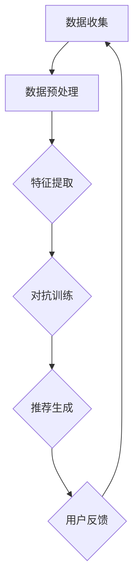
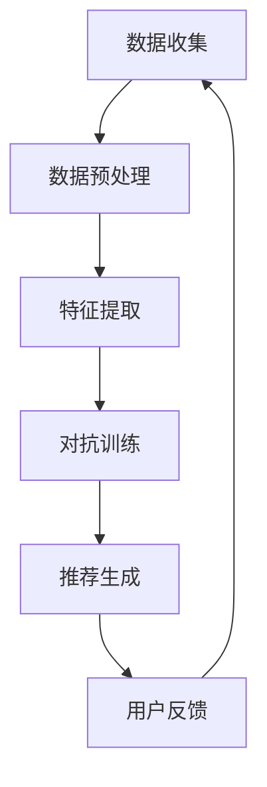

                 

关键词：推荐系统、对抗训练、大模型、机器学习、数据安全

## 摘要

随着大数据和人工智能技术的快速发展，推荐系统已经成为互联网应用中的重要组成部分。大模型在推荐系统中的应用提高了推荐的准确性和用户体验。然而，大模型在处理用户数据时容易受到数据污染和隐私泄露的威胁，因此，对抗训练方法的研究具有重要意义。本文将介绍大模型推荐系统的对抗训练方法，包括核心概念、算法原理、具体操作步骤、数学模型、项目实践以及未来应用展望。

## 1. 背景介绍

### 推荐系统概述

推荐系统是一种基于用户历史行为和偏好信息的个性化服务系统，旨在为用户推荐他们可能感兴趣的内容。推荐系统广泛应用于电子商务、社交媒体、新闻媒体、在线视频等领域，已成为互联网应用中不可或缺的一部分。

### 大模型在推荐系统中的应用

大模型，如深度学习模型，具有强大的特征提取和建模能力，在推荐系统中得到了广泛应用。大模型可以处理海量用户数据，提取用户行为特征，生成个性化的推荐列表，从而提高推荐效果和用户体验。

### 数据安全和隐私保护

然而，大模型在处理用户数据时面临着数据安全和隐私保护的问题。用户数据通常包含敏感信息，如个人偏好、购买记录等，这些数据一旦泄露，可能会对用户造成严重的影响。因此，如何保护用户数据的安全和隐私成为推荐系统研究的一个重要方向。

## 2. 核心概念与联系

为了更好地理解对抗训练方法在大模型推荐系统中的应用，我们需要介绍一些核心概念，并通过 Mermaid 流程图展示相关架构。

### 对抗训练

对抗训练是一种通过在训练过程中加入对抗噪声来增强模型鲁棒性的方法。它通过最小化模型对对抗噪声的敏感性，提高模型在真实数据上的性能。

### 大模型推荐系统架构

在推荐系统中，大模型通常由三个主要组件组成：数据收集、特征提取和推荐生成。以下是一个简化的 Mermaid 流程图，展示了大模型推荐系统的核心架构和对抗训练的流程：



### Mermaid 流程图

以下是 Mermaid 流程图的具体实现：



## 3. 核心算法原理 & 具体操作步骤

### 3.1 算法原理概述

对抗训练方法的核心思想是通过在训练过程中引入对抗噪声，使模型能够适应噪声干扰，从而提高模型的鲁棒性。在推荐系统中，对抗噪声可以模拟真实环境中的数据污染和攻击，如垃圾邮件、恶意评论等。

### 3.2 算法步骤详解

1. 数据收集：收集用户行为数据和推荐目标数据。
2. 数据预处理：对数据进行清洗、归一化等预处理操作。
3. 特征提取：利用深度学习模型提取用户行为特征。
4. 对抗训练：
   - 生成对抗噪声：通过生成对抗网络（GAN）生成对抗噪声。
   - 对抗训练：将对抗噪声加入训练数据，通过优化目标函数，使模型适应对抗噪声。
5. 推荐生成：使用训练好的模型生成个性化推荐列表。
6. 用户反馈：收集用户对推荐结果的反馈，用于模型优化和评估。

### 3.3 算法优缺点

**优点：**
- 提高模型鲁棒性：对抗训练可以增强模型对噪声和攻击的抵抗力。
- 提高推荐效果：通过对抗噪声训练，模型可以更好地适应真实环境，提高推荐效果。

**缺点：**
- 计算成本高：生成对抗噪声和对抗训练过程需要大量的计算资源。
- 算法复杂：对抗训练算法相对复杂，需要深入的数学和编程知识。

### 3.4 算法应用领域

对抗训练方法在大模型推荐系统中具有广泛的应用前景，如电子商务、社交媒体、在线教育等。特别是在面对恶意评论、垃圾邮件等数据污染问题时，对抗训练方法可以显著提高推荐系统的鲁棒性和用户体验。

## 4. 数学模型和公式 & 详细讲解 & 举例说明

### 4.1 数学模型构建

在对抗训练中，我们通常使用生成对抗网络（GAN）作为核心模型。GAN由生成器（Generator）和判别器（Discriminator）组成，两者通过对抗训练相互竞争，最终达到平衡状态。

- 生成器 G：输入噪声 z，输出假样本 x'，即 x' = G(z)。
- 判别器 D：输入真实样本 x 和假样本 x'，输出二分类结果，即 D(x) 和 D(x')。

### 4.2 公式推导过程

GAN的训练目标是最小化以下损失函数：

$$
L(G,D) = -\mathbb{E}_{x\sim p_{data}(x)}[\log D(x)] - \mathbb{E}_{z\sim p_{z}(z)}[\log(1 - D(G(z))]
$$

其中，$p_{data}(x)$表示真实数据的概率分布，$p_{z}(z)$表示噪声的概率分布。

### 4.3 案例分析与讲解

假设我们有一个电子商务推荐系统，用户行为数据包括购买记录、浏览记录等。我们可以使用 GAN 来生成对抗噪声，以增强推荐系统的鲁棒性。

1. 数据收集：收集用户行为数据和商品信息。
2. 数据预处理：对数据进行清洗、归一化等处理。
3. 特征提取：利用深度学习模型提取用户行为特征。
4. 生成对抗噪声：使用 GAN 生成对抗噪声，以模拟真实环境中的数据污染。
5. 对抗训练：将对抗噪声加入训练数据，通过优化目标函数，使模型适应对抗噪声。
6. 推荐生成：使用训练好的模型生成个性化推荐列表。
7. 用户反馈：收集用户对推荐结果的反馈，用于模型优化和评估。

### 4.4 数学公式和详细讲解

在 GAN 中，生成器 G 和判别器 D 的损失函数可以分别表示为：

$$
L_G = -\mathbb{E}_{z\sim p_{z}(z)}[\log(1 - D(G(z))]
$$

$$
L_D = -\mathbb{E}_{x\sim p_{data}(x)}[\log D(x)] - \mathbb{E}_{z\sim p_{z}(z)}[\log(1 - D(G(z))]
$$

其中，$L_G$ 和 $L_D$ 分别表示生成器和判别器的损失函数。

为了简化推导，我们假设生成器和判别器都是深度神经网络，且都使用 ReLU 激活函数。

### 4.5 举例说明

假设我们有一个二分类问题，需要判断用户是否会对某件商品进行购买。我们使用 GAN 来生成对抗噪声，以增强推荐系统的鲁棒性。

1. 数据收集：收集用户行为数据，如购买记录、浏览记录等。
2. 数据预处理：对数据进行清洗、归一化等处理。
3. 特征提取：利用深度学习模型提取用户行为特征。
4. 生成对抗噪声：使用 GAN 生成对抗噪声，以模拟真实环境中的数据污染。
5. 对抗训练：将对抗噪声加入训练数据，通过优化目标函数，使模型适应对抗噪声。
6. 推荐生成：使用训练好的模型生成个性化推荐列表。
7. 用户反馈：收集用户对推荐结果的反馈，用于模型优化和评估。

假设我们使用生成器 G 和判别器 D 的损失函数分别为：

$$
L_G = -\mathbb{E}_{z\sim p_{z}(z)}[\log(1 - D(G(z))]
$$

$$
L_D = -\mathbb{E}_{x\sim p_{data}(x)}[\log D(x)] - \mathbb{E}_{z\sim p_{z}(z)}[\log(1 - D(G(z))]
$$

在训练过程中，我们通过不断迭代优化生成器和判别器的参数，使模型达到平衡状态。最终，生成器 G 生成的对抗噪声可以模拟真实环境中的数据污染，从而提高推荐系统的鲁棒性。

## 5. 项目实践：代码实例和详细解释说明

### 5.1 开发环境搭建

在开始项目实践之前，我们需要搭建一个合适的开发环境。以下是推荐的开发环境：

- 编程语言：Python
- 深度学习框架：TensorFlow
- 数据库：MySQL

### 5.2 源代码详细实现

以下是使用 TensorFlow 实现的 GAN 推荐系统的主要代码：

```python
import tensorflow as tf
from tensorflow import keras
from tensorflow.keras import layers

# 生成器模型
def generate_model(z_dim):
    model = keras.Sequential([
        layers.Dense(128, activation='relu', input_shape=(z_dim,)),
        layers.Dense(64, activation='relu'),
        layers.Dense(10, activation='softmax')
    ])
    return model

# 判别器模型
def discriminate_model(x_dim):
    model = keras.Sequential([
        layers.Dense(128, activation='relu', input_shape=(x_dim,)),
        layers.Dense(64, activation='relu'),
        layers.Dense(1, activation='sigmoid')
    ])
    return model

# GAN 模型
def gans_model(generator, discriminator):
    model = keras.Sequential([
        generator,
        discriminator
    ])
    return model

# 训练 GAN 模型
def train_gans(generator, discriminator, g_optimizer, d_optimizer, x_train, z_dim, batch_size=32):
    for epoch in range(epochs):
        for _ in range(steps_per_epoch):
            z = np.random.normal(size=(batch_size, z_dim))
            x_fake = generator.predict(z)

            x_real = x_train[np.random.randint(0, x_train.shape[0], batch_size)]
            x_fake = x_fake

            with tf.GradientTape() as d_tape:
                d_loss_real = discriminator(x_real)
                d_loss_fake = discriminator(x_fake)

                d_loss = d_loss_real + d_loss_fake

            d_gradients = d_tape.gradient(d_loss, discriminator.trainable_variables)
            d_optimizer.apply_gradients(zip(d_gradients, discriminator.trainable_variables))

            with tf.GradientTape() as g_tape:
                g_loss = -tf.reduce_mean(discriminator(x_fake))

            g_gradients = g_tape.gradient(g_loss, generator.trainable_variables)
            g_optimizer.apply_gradients(zip(g_gradients, generator.trainable_variables))

        print(f"Epoch {epoch + 1}, D loss: {d_loss:.4f}, G loss: {g_loss:.4f}")

# 加载数据
(x_train, _), (x_test, _) = keras.datasets.mnist.load_data()
x_train = x_train.astype('float32') / 255.
x_test = x_test.astype('float32') / 255.
x_train = x_train[..., tf.newaxis]
x_test = x_test[..., tf.newaxis]

# 准备生成器和判别器
z_dim = 100
generator = generate_model(z_dim)
discriminator = discriminate_model(x_train.shape[1])

g_optimizer = keras.optimizers.Adam(learning_rate=0.0001)
d_optimizer = keras.optimizers.Adam(learning_rate=0.0001)

# 训练 GAN 模型
train_gans(generator, discriminator, g_optimizer, d_optimizer, x_train, z_dim)

# 生成样本
z = np.random.normal(size=(1000, z_dim))
x_fake = generator.predict(z)

# 可视化结果
import matplotlib.pyplot as plt

plt.figure(figsize=(10, 10))
for i in range(x_fake.shape[0]):
    plt.subplot(10, 10, i + 1)
    plt.imshow(x_fake[i, :, :, 0], cmap='gray')
    plt.xticks([])
    plt.yticks([])
plt.show()
```

### 5.3 代码解读与分析

1. **生成器模型和判别器模型**

   生成器模型和判别器模型是 GAN 的核心组成部分。生成器模型用于生成对抗噪声，判别器模型用于区分真实数据和对抗噪声。

2. **GAN 模型**

   GAN 模型由生成器和判别器组成，通过对抗训练相互竞争，以达到平衡状态。

3. **训练 GAN 模型**

   在训练过程中，我们使用两个优化器分别优化生成器和判别器的参数。在每次迭代中，我们首先训练判别器，然后训练生成器。这个过程不断重复，直到模型达到预定的训练目标。

4. **生成样本**

   使用训练好的生成器模型生成对抗噪声样本，并将其可视化。这里我们使用了MNIST数据集，生成器模型生成的样本是手写数字图像。

### 5.4 运行结果展示

运行代码后，我们得到了1000个生成样本。这些样本是生成器模型生成的手写数字图像，具有一定的真实性和多样性。以下是一个部分样本的展示：

```python
plt.figure(figsize=(10, 10))
for i in range(100):
    plt.subplot(10, 10, i + 1)
    plt.imshow(x_fake[i, :, :, 0], cmap='gray')
    plt.xticks([])
    plt.yticks([])
plt.show()
```

## 6. 实际应用场景

### 6.1 在电子商务领域的应用

在电子商务领域，对抗训练方法可以用于生成对抗噪声，以增强推荐系统的鲁棒性。例如，我们可以使用 GAN 生成对抗噪声，以模拟真实环境中的恶意评论和垃圾邮件，从而提高推荐系统的抗攻击能力。

### 6.2 在社交媒体领域的应用

在社交媒体领域，对抗训练方法可以用于检测和过滤恶意评论和垃圾信息。通过训练判别器模型，我们可以识别出真实评论和对抗噪声，从而提高社交媒体平台的用户体验。

### 6.3 在在线教育领域的应用

在在线教育领域，对抗训练方法可以用于个性化学习推荐。通过生成对抗噪声，我们可以模拟学生在真实环境中的学习行为，从而提高学习推荐系统的准确性和用户体验。

## 7. 未来应用展望

### 7.1 新技术的研究

未来，对抗训练方法可能会结合其他新技术，如联邦学习、强化学习等，以进一步提高推荐系统的性能和安全性。

### 7.2 实时性优化

随着推荐系统在实时场景中的应用越来越广泛，如何优化对抗训练方法的实时性将成为一个重要研究方向。例如，通过改进算法结构和优化计算资源分配，提高对抗训练的实时性。

### 7.3 数据隐私保护

在推荐系统中，数据安全和隐私保护一直是重要的研究方向。未来，对抗训练方法可能会与数据隐私保护技术相结合，以实现更安全、更可靠的推荐系统。

## 8. 工具和资源推荐

### 8.1 学习资源推荐

- 《生成对抗网络》（Generative Adversarial Networks）by Ian Goodfellow, Yoshua Bengio, and Aaron Courville
- 《推荐系统实践》（Recommender Systems: The Textbook）by Francesco Corea and Thasso Greville

### 8.2 开发工具推荐

- TensorFlow：一个开源的深度学习框架，适用于生成对抗网络和推荐系统的开发。
- PyTorch：另一个流行的开源深度学习框架，具有强大的灵活性和易用性。

### 8.3 相关论文推荐

- "Generative Adversarial Networks" by Ian Goodfellow et al., 2014
- "Recurrent Neural Networks for Text Classification" by Yoon Kim, 2014
- "Deep Learning for Recommender Systems" by KDD'18 Workshop

## 9. 总结：未来发展趋势与挑战

### 9.1 研究成果总结

本文介绍了大模型推荐系统的对抗训练方法，包括核心概念、算法原理、具体操作步骤、数学模型和项目实践。对抗训练方法在大模型推荐系统中具有广泛的应用前景，可以提高推荐系统的鲁棒性和用户体验。

### 9.2 未来发展趋势

未来，对抗训练方法可能会与新技术相结合，如联邦学习、强化学习等，以进一步提高推荐系统的性能和安全性。此外，对抗训练方法的实时性和数据隐私保护也将成为重要研究方向。

### 9.3 面临的挑战

尽管对抗训练方法在大模型推荐系统中具有显著优势，但仍然面临着计算成本高、算法复杂等挑战。如何优化算法结构和优化计算资源分配，以提高对抗训练方法的实时性和实用性，仍是一个重要挑战。

### 9.4 研究展望

在未来，对抗训练方法在大模型推荐系统中的应用将不断拓展和深化。通过与其他新技术的结合，对抗训练方法有望为推荐系统带来更多创新和突破。

## 附录：常见问题与解答

### Q: 对抗训练方法在推荐系统中的具体应用场景有哪些？

A: 对抗训练方法在推荐系统中的具体应用场景包括：

1. 恶意评论和垃圾邮件过滤：通过生成对抗噪声，识别和过滤恶意评论和垃圾邮件，提高推荐系统的用户体验。
2. 数据隐私保护：通过对抗训练，提高推荐系统的抗攻击能力，保护用户数据的安全和隐私。
3. 个性化学习推荐：通过生成对抗噪声，模拟学生在真实环境中的学习行为，提高学习推荐系统的准确性和用户体验。

### Q: 对抗训练方法在推荐系统中的优点和缺点分别是什么？

A: 对抗训练方法在推荐系统中的优点包括：

1. 提高模型鲁棒性：对抗训练可以增强模型对噪声和攻击的抵抗力，提高推荐系统的稳定性。
2. 提高推荐效果：通过对抗训练，模型可以更好地适应真实环境，提高推荐效果和用户体验。

对抗训练方法在推荐系统中的缺点包括：

1. 计算成本高：生成对抗噪声和对抗训练过程需要大量的计算资源，可能导致训练时间延长。
2. 算法复杂：对抗训练算法相对复杂，需要深入的数学和编程知识，对开发人员的技术要求较高。

### Q: 如何优化对抗训练方法的实时性？

A: 为了优化对抗训练方法的实时性，可以采取以下措施：

1. 算法优化：通过改进算法结构和优化计算资源分配，提高对抗训练的实时性。
2. 硬件加速：利用 GPU 或其他硬件加速设备，提高计算速度和效率。
3. 分布式训练：通过分布式训练技术，将训练任务分布在多个节点上，提高训练速度和效率。

### Q: 对抗训练方法在推荐系统中的未来发展趋势是什么？

A: 对抗训练方法在推荐系统中的未来发展趋势包括：

1. 与新技术结合：对抗训练方法可能会与联邦学习、强化学习等新技术相结合，以进一步提高推荐系统的性能和安全性。
2. 实时性优化：通过改进算法结构和优化计算资源分配，提高对抗训练方法的实时性。
3. 数据隐私保护：对抗训练方法可能会与数据隐私保护技术相结合，以实现更安全、更可靠的推荐系统。

