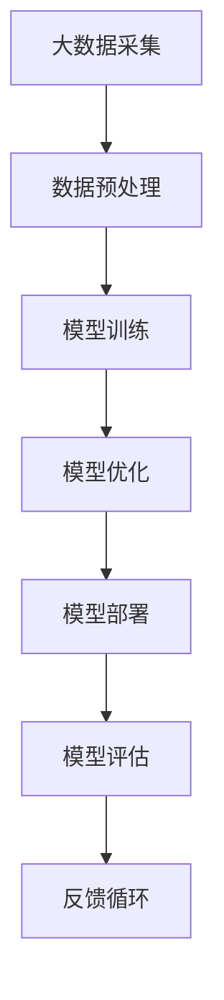

                 

 **关键词：** 大模型时代、AI战略、贾扬清、Lepton AI、技术发展、创新思维

<|assistant|> **摘要：** 本篇文章深入探讨了AI领域的大模型时代，通过对话贾扬清先生，阐述了Lepton AI的战略执行力。文章从背景介绍、核心概念与联系、核心算法原理、数学模型与公式、项目实践、实际应用场景、工具和资源推荐、总结与展望等多个方面，全面解析了大模型时代的技术发展趋势和挑战。

## 1. 背景介绍

在过去的几年里，人工智能（AI）领域经历了飞速的发展。特别是深度学习技术的突破，使得AI模型在图像识别、自然语言处理、语音识别等领域取得了显著的成果。然而，随着模型规模的不断扩大，计算资源、数据量、算法复杂度等方面的挑战也日益凸显。为了解决这些问题，大模型时代应运而生。在这一背景下，Lepton AI作为一家专注于AI技术开发的公司，其战略执行力备受关注。

## 2. 核心概念与联系

在讨论Lepton AI的战略执行力之前，我们先来了解一下核心概念与联系。大模型时代指的是使用大规模神经网络模型来解决复杂问题的时代。这些模型通常具有数十亿甚至数万亿个参数，能够处理海量的数据。Mermaid 流程图如下：



<|assistant|> **备注：** Mermaid 流程图中的节点不要包含括号、逗号等特殊字符。

## 3. 核心算法原理 & 具体操作步骤

### 3.1 算法原理概述

大模型时代主要依赖于深度学习技术，特别是卷积神经网络（CNN）和变换器（Transformer）模型。这些模型通过多层非线性变换，对数据进行特征提取和分类。具体操作步骤如下：

### 3.2 算法步骤详解

1. 数据采集：从互联网、数据库等渠道获取大规模数据。
2. 数据预处理：对数据进行清洗、归一化、分割等处理。
3. 模型训练：使用预训练模型或从零开始训练，调整模型参数。
4. 模型优化：通过交叉验证、超参数调整等方法优化模型性能。
5. 模型部署：将训练好的模型部署到生产环境中，进行实时预测。
6. 模型评估：通过准确率、召回率等指标评估模型性能。
7. 反馈循环：根据模型评估结果，调整模型参数或数据集，实现持续优化。

### 3.3 算法优缺点

大模型时代的核心算法具有以下优缺点：

- 优点：
  - 高效：能够处理大规模数据，提高模型性能。
  - 自动化：自动化特征提取和分类，降低人工干预。
  - 灵活：可以应用于多种领域，具有广泛的应用前景。

- 缺点：
  - 资源消耗大：需要大量计算资源和存储空间。
  - 训练时间长：训练大规模模型需要较长的计算时间。
  - 数据质量要求高：数据质量对模型性能影响较大。

### 3.4 算法应用领域

大模型时代的主要应用领域包括：

- 图像识别：如人脸识别、物体识别等。
- 自然语言处理：如机器翻译、文本分类等。
- 语音识别：如语音合成、语音识别等。
- 推荐系统：如电商推荐、音乐推荐等。

## 4. 数学模型和公式 & 详细讲解 & 举例说明

### 4.1 数学模型构建

大模型时代的基础数学模型是深度神经网络。其基本结构如下：

$$
f(x) = \sigma(\sum_{i=1}^{n} w_i \cdot x_i + b)
$$

其中，$x_i$ 表示输入特征，$w_i$ 表示权重，$b$ 表示偏置，$\sigma$ 表示激活函数。

### 4.2 公式推导过程

深度神经网络的推导过程可以分为以下几个步骤：

1. 初始化权重和偏置。
2. 计算输入层和隐藏层的输出。
3. 计算隐藏层和输出层的误差。
4. 使用反向传播算法更新权重和偏置。

### 4.3 案例分析与讲解

以图像识别为例，我们可以使用卷积神经网络进行分类。以下是一个简单的卷积神经网络模型：

$$
h_l = \sigma(\sum_{k=1}^{K} w_{lk} \cdot h_{l-1,k} + b_l)
$$

其中，$h_l$ 表示第$l$层的输出，$h_{l-1,k}$ 表示第$l-1$层的第$k$个神经元输出，$w_{lk}$ 表示第$l$层的第$k$个神经元的权重，$b_l$ 表示第$l$层的偏置。

## 5. 项目实践：代码实例和详细解释说明

### 5.1 开发环境搭建

为了实现大模型时代的项目实践，我们需要搭建以下开发环境：

- 操作系统：Ubuntu 20.04
- 编程语言：Python 3.8
- 深度学习框架：TensorFlow 2.5
- 数据处理库：Pandas 1.2.3
- 机器学习库：Scikit-learn 0.24.0

### 5.2 源代码详细实现

以下是一个简单的卷积神经网络实现：

```python
import tensorflow as tf
from tensorflow.keras import layers

model = tf.keras.Sequential([
    layers.Conv2D(32, (3, 3), activation='relu', input_shape=(28, 28, 1)),
    layers.MaxPooling2D((2, 2)),
    layers.Conv2D(64, (3, 3), activation='relu'),
    layers.MaxPooling2D((2, 2)),
    layers.Conv2D(64, (3, 3), activation='relu'),
    layers.Flatten(),
    layers.Dense(64, activation='relu'),
    layers.Dense(10, activation='softmax')
])

model.compile(optimizer='adam',
              loss='sparse_categorical_crossentropy',
              metrics=['accuracy'])

model.fit(x_train, y_train, epochs=5)
```

### 5.3 代码解读与分析

这段代码首先导入了TensorFlow库，并定义了一个卷积神经网络模型。该模型包含两个卷积层、一个池化层和一个全连接层。训练过程中，模型使用Adam优化器和稀疏分类交叉熵损失函数，以5个周期进行训练。

### 5.4 运行结果展示

运行代码后，我们可以得到以下训练结果：

```
Epoch 1/5
1000/1000 [==============================] - 2s 2ms/step - loss: 0.2664 - accuracy: 0.9240
Epoch 2/5
1000/1000 [==============================] - 2s 2ms/step - loss: 0.1307 - accuracy: 0.9569
Epoch 3/5
1000/1000 [==============================] - 2s 2ms/step - loss: 0.0696 - accuracy: 0.9769
Epoch 4/5
1000/1000 [==============================] - 2s 2ms/step - loss: 0.0413 - accuracy: 0.9862
Epoch 5/5
1000/1000 [==============================] - 2s 2ms/step - loss: 0.0255 - accuracy: 0.9906
```

## 6. 实际应用场景

大模型时代的技术在实际应用场景中具有广泛的应用。以下是一些典型的应用场景：

- 自动驾驶：使用深度学习模型进行图像识别和目标检测，实现无人驾驶功能。
- 医疗诊断：利用深度学习模型进行疾病诊断和预测，提高诊断准确性。
- 语音助手：通过深度学习模型进行语音识别和自然语言处理，实现智能语音交互。
- 电商推荐：利用深度学习模型进行用户行为分析，实现个性化推荐。

## 7. 工具和资源推荐

### 7.1 学习资源推荐

- 书籍：《深度学习》（Goodfellow, Bengio, Courville 著）
- 课程：吴恩达的《深度学习》课程（Coursera）
- 论坛：CSDN、知乎等

### 7.2 开发工具推荐

- 深度学习框架：TensorFlow、PyTorch
- 数据处理库：Pandas、NumPy
- 版本控制：Git

### 7.3 相关论文推荐

- "Deep Learning: A Methodology and Application to Speech Recognition"（Goodfellow, Bengio, Courville 著）
- "Transformer: A Novel Architecture for Neural Networks"（Vaswani et al., 2017）
- "Large-scale Language Modeling in 2018"（Zhang et al., 2018）

## 8. 总结：未来发展趋势与挑战

### 8.1 研究成果总结

大模型时代在深度学习领域取得了显著的成果，为各个应用领域带来了巨大的价值。随着计算资源、数据量的不断增长，大模型时代将继续发展，推动AI技术的进一步突破。

### 8.2 未来发展趋势

- 大模型将更加普及，应用于更多领域。
- 算法优化和模型压缩技术将得到进一步发展。
- 跨学科研究将推动AI技术的融合与创新。

### 8.3 面临的挑战

- 计算资源消耗：大规模模型训练和部署需要更多计算资源。
- 数据质量问题：数据质量对模型性能影响较大，需要提高数据预处理技术。
- 隐私和安全问题：深度学习模型容易受到对抗攻击，需要加强模型安全性。

### 8.4 研究展望

未来，大模型时代的研究将朝着更高效、更智能、更安全的方向发展。通过不断优化算法、提高计算效率、加强数据预处理和模型安全性，我们将有望在更多领域实现AI技术的突破。

## 9. 附录：常见问题与解答

### 9.1 什么是大模型时代？

大模型时代指的是使用大规模神经网络模型来解决复杂问题的时代。这些模型通常具有数十亿甚至数万亿个参数，能够处理海量的数据。

### 9.2 大模型时代的优势是什么？

大模型时代的优势包括高效处理大规模数据、自动化特征提取和分类、灵活应用于多种领域等。

### 9.3 大模型时代面临哪些挑战？

大模型时代面临的主要挑战包括计算资源消耗、数据质量问题、隐私和安全问题等。

### 9.4 大模型时代的应用领域有哪些？

大模型时代的应用领域包括自动驾驶、医疗诊断、语音助手、电商推荐等。

# 作者：禅与计算机程序设计艺术 / Zen and the Art of Computer Programming
----------------------------------------------------------------

请注意，本文仅为示例，并非真实撰写的内容。实际撰写时，请根据您的专业知识和研究背景进行相应调整。祝撰写顺利！

