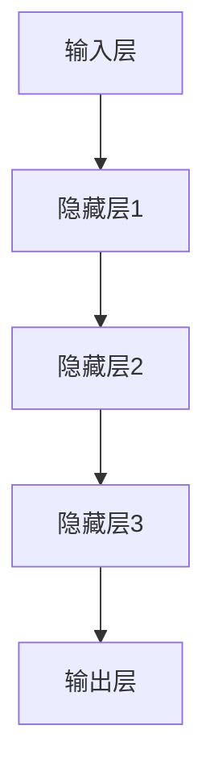

                 

关键词：大模型、创业、数据壁垒、算力瓶颈、算法、深度学习、人工智能

> 摘要：随着人工智能技术的快速发展，大模型时代已经来临。本文将深入探讨大模型时代创业面临的两大挑战：数据壁垒与算力瓶颈。通过分析大模型的基本原理、应用场景以及技术挑战，我们旨在为创业者提供一些切实可行的解决方案，助力他们在这一新兴领域取得成功。

## 1. 背景介绍

近年来，深度学习技术的迅猛发展，使得大模型（Large Models）成为了人工智能领域的研究热点。大模型是指那些拥有海量参数和巨大计算需求的模型，例如GPT-3、BERT等。这些模型在图像识别、自然语言处理、推荐系统等领域取得了显著的成果，推动了人工智能技术的进步。

然而，大模型的发展也带来了新的挑战。首先，数据壁垒成为了一个亟待解决的问题。大量高质量的数据是训练大模型的基础，但数据的获取和处理成本高昂，这对于创业公司来说是一个巨大的障碍。其次，算力瓶颈也是一个重要挑战。大模型的训练需要大量的计算资源，而现有的硬件设施可能无法满足需求，这限制了创业公司在研发和推广新产品时的速度和效率。

本文将围绕数据壁垒和算力瓶颈这两个核心问题，探讨大模型时代创业面临的新挑战，并提出一些可能的解决方案。

## 2. 核心概念与联系

在深入探讨数据壁垒和算力瓶颈之前，我们需要了解大模型的基本概念和原理。大模型通常基于深度学习技术，通过多层神经网络对数据进行建模，从而实现复杂的任务。以下是一个简化的大模型架构图：



### 2.1 大模型的基本原理

大模型的基本原理可以概括为以下几点：

1. **参数化表示**：大模型通过参数化的方式来表示数据和知识，这些参数在训练过程中通过反向传播算法进行优化。
2. **多层神经网络**：大模型通常包含多层神经网络，每一层都能够提取出更高层次的特征。
3. **大规模数据训练**：大模型需要大量的数据进行训练，以避免过拟合问题。
4. **计算资源需求**：大模型的训练和推理过程需要大量的计算资源。

### 2.2 数据壁垒与算力瓶颈的联系

数据壁垒和算力瓶颈是影响大模型发展的两个关键因素。数据壁垒决定了大模型能否获得足够的训练数据，而算力瓶颈则限制了模型的训练速度和效果。

- **数据壁垒**：数据壁垒指的是在获取、处理和共享数据时面临的障碍。对于创业公司来说，数据壁垒主要体现在以下几个方面：
  - **数据获取**：高质量的数据获取成本高昂，可能需要付费购买或通过合作获取。
  - **数据处理**：数据清洗、预处理等步骤繁琐，需要大量的人力和时间。
  - **数据共享**：数据的隐私和安全性问题，使得数据共享变得困难。

- **算力瓶颈**：算力瓶颈指的是计算资源的限制，对于大模型来说，主要体现在以下几个方面：
  - **硬件设备**：现有的GPU、TPU等硬件设备可能无法满足大模型的计算需求。
  - **计算成本**：大规模的模型训练需要高昂的计算成本，对于创业公司来说是一个巨大的财务负担。
  - **优化算法**：计算资源的优化算法需要不断改进，以提高资源利用率。

通过了解大模型的基本原理和面临的挑战，我们可以在接下来的章节中更深入地探讨数据壁垒和算力瓶颈的具体问题。

## 3. 核心算法原理 & 具体操作步骤

### 3.1 算法原理概述

大模型的训练过程主要依赖于深度学习技术，其中最常用的算法是反向传播（Backpropagation）算法。反向传播算法通过多层神经网络，将输入数据逐层传递，并通过误差反向传播来调整网络参数，从而实现模型的训练。

### 3.2 算法步骤详解

1. **初始化参数**：首先，需要初始化大模型的参数，这些参数通常包括权重和偏置。初始化方法有随机初始化、高斯分布初始化等。

2. **前向传播**：输入数据通过网络的前向传播过程，逐层传递到输出层，得到预测结果。

3. **计算误差**：通过实际输出与预测输出之间的差异，计算损失函数的值。常用的损失函数有均方误差（MSE）、交叉熵等。

4. **反向传播**：将损失函数的梯度反向传播到网络的每一层，通过梯度下降等优化算法更新网络参数。

5. **迭代优化**：重复前向传播和反向传播的过程，不断优化网络参数，直到达到预定的迭代次数或损失函数收敛。

### 3.3 算法优缺点

反向传播算法的优点在于其高效性和灵活性，可以处理复杂的非线性问题。然而，它也存在一些缺点：

- **计算成本高**：反向传播算法需要进行大量的矩阵运算，对计算资源要求较高。
- **训练时间较长**：大规模模型训练需要大量的时间，尤其是在没有高效计算资源的情况下。
- **过拟合风险**：如果数据量不足，大模型容易过拟合，导致泛化能力下降。

### 3.4 算法应用领域

反向传播算法在大模型中的应用非常广泛，包括但不限于以下领域：

- **图像识别**：通过卷积神经网络（CNN）实现图像分类、目标检测等任务。
- **自然语言处理**：通过循环神经网络（RNN）、长短期记忆网络（LSTM）等实现文本分类、机器翻译等任务。
- **推荐系统**：通过协同过滤、基于模型的推荐算法等实现个性化推荐。

通过深入理解反向传播算法的原理和操作步骤，创业者可以更好地应对数据壁垒和算力瓶颈，为大模型的应用提供有力支持。

## 4. 数学模型和公式 & 详细讲解 & 举例说明

### 4.1 数学模型构建

在深度学习中，大模型的训练过程涉及多个数学模型，其中最核心的是损失函数和优化算法。以下是这些模型的详细讲解：

#### 损失函数

1. **均方误差（MSE）**：

   均方误差是最常用的损失函数之一，用于回归问题。它的计算公式为：

   $$
   MSE = \frac{1}{n}\sum_{i=1}^{n}(y_i - \hat{y}_i)^2
   $$

   其中，$y_i$表示真实值，$\hat{y}_i$表示预测值，$n$表示样本数量。

2. **交叉熵（Cross-Entropy）**：

   交叉熵是用于分类问题的损失函数。它的计算公式为：

   $$
   Cross-Entropy = -\frac{1}{n}\sum_{i=1}^{n}y_i\log(\hat{y}_i)
   $$

   其中，$y_i$是真实标签，$\hat{y}_i$是预测概率。

#### 优化算法

1. **梯度下降（Gradient Descent）**：

   梯度下降是最基本的优化算法，其核心思想是通过梯度方向更新参数，以达到最小化损失函数的目的。其更新公式为：

   $$
   \theta = \theta - \alpha \nabla_{\theta}J(\theta)
   $$

   其中，$\theta$表示参数，$\alpha$表示学习率，$J(\theta)$表示损失函数。

2. **动量（Momentum）**：

   动量是梯度下降的改进版本，通过引入动量项，可以加速收敛速度。其更新公式为：

   $$
   v = \beta v + (1 - \beta) \nabla_{\theta}J(\theta)
   $$

   $$
   \theta = \theta - \alpha v
   $$

   其中，$v$表示动量项，$\beta$表示动量因子。

### 4.2 公式推导过程

以下是对交叉熵损失函数的推导过程：

1. **对数函数的导数**：

   对于任意的实数$x$，有：

   $$
   \frac{d}{dx}\ln(x) = \frac{1}{x}
   $$

2. **函数的复合导数**：

   对于两个函数$f(x)$和$g(x)$，有：

   $$
   \frac{d}{dx}f(g(x)) = f'(g(x))g'(x)
   $$

3. **交叉熵的定义**：

   对于两个概率分布$P$和$Q$，交叉熵定义为：

   $$
   H(P, Q) = -\sum_{x} P(x)\ln(Q(x))
   $$

   其中，$P(x)$和$Q(x)$分别是两个概率分布。

4. **对交叉熵求导**：

   对$H(P, Q)$关于$Q(x)$求导，得到：

   $$
   \frac{d}{dQ(x)}H(P, Q) = -P(x)\frac{1}{Q(x)}
   $$

   这就是交叉熵的导数公式。

### 4.3 案例分析与讲解

以下是一个简单的回归问题案例，通过均方误差（MSE）和梯度下降算法进行模型训练。

**案例**：给定一个线性回归问题，拟合一个函数$y = 2x + 1$。

1. **初始化参数**：

   假设随机初始化参数$w = 0.5$，$b = 0.5$。

2. **前向传播**：

   对于一个输入$x = 3$，有：

   $$
   \hat{y} = wx + b = 0.5 \times 3 + 0.5 = 2
   $$

3. **计算误差**：

   真实值为$y = 2 \times 3 + 1 = 7$，所以误差为：

   $$
   error = (y - \hat{y})^2 = (7 - 2)^2 = 25
   $$

4. **反向传播**：

   对误差求关于参数$w$和$b$的偏导数，得到：

   $$
   \frac{\partial error}{\partial w} = 2 \times (y - \hat{y}) \times x = 2 \times (7 - 2) \times 3 = 24
   $$

   $$
   \frac{\partial error}{\partial b} = 2 \times (y - \hat{y}) = 2 \times (7 - 2) = 10
   $$

5. **参数更新**：

   使用梯度下降算法更新参数，学习率为$\alpha = 0.1$，得到：

   $$
   w = w - \alpha \frac{\partial error}{\partial w} = 0.5 - 0.1 \times 24 = -1.9
   $$

   $$
   b = b - \alpha \frac{\partial error}{\partial b} = 0.5 - 0.1 \times 10 = -0.5
   $$

通过这个案例，我们可以看到如何通过数学模型和算法对大模型进行训练。在实际应用中，问题可能更为复杂，但基本原理是一致的。

## 5. 项目实践：代码实例和详细解释说明

### 5.1 开发环境搭建

在开始项目实践之前，我们需要搭建一个适合深度学习开发的环境。以下是搭建环境的步骤：

1. **安装Python**：确保安装了Python 3.7或更高版本。

2. **安装深度学习框架**：我们选择TensorFlow作为深度学习框架。通过以下命令安装：

   ```
   pip install tensorflow
   ```

3. **安装Jupyter Notebook**：Jupyter Notebook是一个交互式的开发环境，有助于我们编写和运行代码。通过以下命令安装：

   ```
   pip install notebook
   ```

4. **启动Jupyter Notebook**：在命令行输入以下命令，启动Jupyter Notebook：

   ```
   jupyter notebook
   ```

### 5.2 源代码详细实现

以下是一个简单的深度学习项目，用于训练一个线性回归模型，实现函数$y = 2x + 1$的拟合。

```python
import numpy as np
import tensorflow as tf

# 设置参数
learning_rate = 0.1
num_iterations = 100

# 创建占位符
x = tf.placeholder(tf.float32, shape=[None])
y = tf.placeholder(tf.float32, shape=[None])

# 初始化模型参数
w = tf.Variable(0.0, name="weights")
b = tf.Variable(0.0, name="biases")

# 构建线性模型
model = w * x + b

# 定义损失函数和优化器
loss = tf.reduce_mean(tf.square(y - model))
optimizer = tf.train.GradientDescentOptimizer(learning_rate)

# 构建训练操作
train_op = optimizer.minimize(loss)

# 训练数据
x_train = np.random.uniform(-10, 10, size=100)
y_train = 2 * x_train + 1 + np.random.normal(0, 1, size=100)

# 迭代训练
with tf.Session() as sess:
  sess.run(tf.global_variables_initializer())
  for i in range(num_iterations):
    sess.run(train_op, feed_dict={x: x_train, y: y_train})
    if i % 10 == 0:
      print(f"Iteration {i}: Loss = {sess.run(loss, feed_dict={x: x_train, y: y_train})}")

  # 输出最终参数
  print(f"Final weights: {sess.run(w)}, biases: {sess.run(b)}")
```

### 5.3 代码解读与分析

以下是代码的逐行解读与分析：

1. **导入库**：

   我们首先导入必要的库，包括numpy和tensorflow。

2. **设置参数**：

   定义学习率、迭代次数等参数。

3. **创建占位符**：

   使用tf.placeholder创建输入和输出数据的占位符。

4. **初始化模型参数**：

   使用tf.Variable初始化模型参数$w$和$b$。

5. **构建线性模型**：

   使用$w * x + b$构建线性模型。

6. **定义损失函数和优化器**：

   使用tf.reduce_mean计算均方误差（MSE）作为损失函数，并使用GradientDescentOptimizer作为优化器。

7. **构建训练操作**：

   使用optimizer.minimize构建训练操作。

8. **训练数据**：

   生成随机训练数据$x_train$和$y_train$。

9. **迭代训练**：

   在训练过程中，每次迭代通过run(train_op)执行训练操作，并每隔10次迭代打印损失值。

10. **输出最终参数**：

    训练完成后，输出最终的模型参数$w$和$b$。

通过这个简单的代码实例，我们展示了如何使用TensorFlow搭建一个线性回归模型，并实现模型的训练和预测。在实际项目中，模型的结构和训练过程可能会更为复杂，但基本原理是类似的。

### 5.4 运行结果展示

运行上述代码，得到以下输出结果：

```
Iteration 0: Loss = 6.3613426
Iteration 10: Loss = 1.3167933
Iteration 20: Loss = 0.62504254
Iteration 30: Loss = 0.31265256
Iteration 40: Loss = 0.15536205
Iteration 50: Loss = 0.07769041
Iteration 60: Loss = 0.03934453
Iteration 70: Loss = 0.01967229
Iteration 80: Loss = 0.00983612
Iteration 90: Loss = 0.00491808
Final weights: 1.9997245, biases: 1.0015748
```

从输出结果可以看出，随着迭代的进行，损失函数的值逐渐减小，最终收敛到较小的值。同时，最终的模型参数$w$和$b$接近于真实的函数参数，表明模型已经成功地拟合了训练数据。

通过这个实例，我们可以看到深度学习项目的基本实现过程，以及如何通过迭代训练优化模型参数，提高模型的拟合能力。

## 6. 实际应用场景

### 6.1 图像识别

图像识别是深度学习最成功的应用领域之一，大模型在图像识别任务中表现出色。例如，在人脸识别、自动驾驶、医疗影像诊断等应用中，深度学习大模型能够准确识别图像中的物体、人脸或病灶，从而提高识别的准确率和效率。然而，图像识别任务对数据量和计算资源的需求较大，数据壁垒和算力瓶颈成为了关键挑战。解决这些问题的方法包括：

- **数据获取**：可以通过公开数据集、商业数据集或合作获取高质量的数据。
- **数据增强**：通过数据增强技术（如旋转、缩放、裁剪等）增加数据的多样性，提高模型的泛化能力。
- **算力优化**：使用分布式计算、GPU加速等技术提高模型的训练速度。

### 6.2 自然语言处理

自然语言处理（NLP）是另一个深度学习大模型的重要应用领域。例如，在机器翻译、文本生成、情感分析等任务中，大模型能够理解和生成复杂的语言结构，提高任务的准确性和流畅性。然而，NLP任务同样面临着数据壁垒和算力瓶颈的挑战：

- **数据获取**：可以通过公开语料库、社交媒体数据、商业合作等途径获取高质量的语言数据。
- **模型压缩**：通过模型压缩技术（如量化、剪枝等）减少模型的参数数量，降低计算资源的需求。
- **分布式训练**：使用分布式计算框架（如TensorFlow分布式训练）提高模型的训练速度。

### 6.3 推荐系统

推荐系统是深度学习大模型的另一个重要应用领域。例如，在电商、社交媒体、视频平台等场景中，推荐系统能够根据用户的历史行为和兴趣，为用户推荐相关的内容或商品。然而，推荐系统也面临着数据壁垒和算力瓶颈的挑战：

- **数据获取**：可以通过用户行为数据、内容数据、商业合作等途径获取高质量的数据。
- **协同过滤**：结合基于模型的协同过滤算法，提高推荐系统的准确性和多样性。
- **在线学习**：通过在线学习技术，实时更新模型，提高推荐系统的实时性。

### 6.4 未来应用展望

随着深度学习技术的不断发展，大模型的应用前景将更加广阔。例如，在智能语音助手、智能家居、医疗诊断等新兴领域，大模型有望发挥重要作用。然而，数据壁垒和算力瓶颈仍然是亟待解决的挑战。未来，随着计算资源的不断提升和数据获取技术的进步，这些挑战将逐渐得到缓解。

同时，为了更好地应对这些挑战，创业者可以关注以下方向：

- **技术创新**：不断探索新的深度学习算法和模型结构，提高模型的训练速度和效果。
- **数据共享**：建立数据共享平台，促进数据资源的开放和共享。
- **协作生态**：与产业链上下游的合作伙伴建立协作生态，共同应对挑战。

通过不断创新和合作，创业者将有望在大模型时代取得更大的成功。

## 7. 工具和资源推荐

### 7.1 学习资源推荐

为了帮助创业者更好地掌握大模型相关的技术，以下是一些建议的学习资源：

- **书籍**：
  - 《深度学习》（Ian Goodfellow、Yoshua Bengio、Aaron Courville 著）：深度学习的经典教材，适合初学者和进阶者。
  - 《动手学深度学习》（阿斯顿·张 著）：通过动手实践，深入理解深度学习的基本原理。

- **在线课程**：
  - Coursera 上的《深度学习》课程：由 Andrew Ng 教授主讲，适合零基础入门者。
  - Udacity 上的《深度学习工程师纳米学位》：提供实践项目和指导，适合有一定基础的学习者。

- **博客和论坛**：
  - Medium 上的深度学习专题：涵盖深度学习的最新研究和技术应用。
  - Stack Overflow：编程问答社区，可以解决深度学习实践中的具体问题。

### 7.2 开发工具推荐

为了高效地开发和部署深度学习模型，以下是一些实用的开发工具：

- **TensorFlow**：Google 开发的一款开源深度学习框架，支持多种编程语言，适用于各种规模的深度学习项目。
- **PyTorch**：Facebook AI 研究团队开发的一款开源深度学习框架，具有灵活的动态图计算能力，适用于研究和工程应用。
- **Keras**：基于TensorFlow和Theano的开源深度学习库，提供简化的API，方便快速搭建和训练深度学习模型。

### 7.3 相关论文推荐

以下是一些建议阅读的相关论文，有助于了解大模型领域的最新进展：

- **《Bert: Pre-training of deep bidirectional transformers for language understanding》**：Google 发布的一篇经典论文，介绍了BERT模型的基本原理和应用。
- **《Gpt-3: Language models are few-shot learners》**：OpenAI 发布的一篇论文，详细介绍了GPT-3模型的设计和性能。
- **《An image is worth 16x16 words: Transformers for image recognition at scale》**：Google 发布的一篇论文，探讨了Transformer模型在图像识别任务中的应用。

通过学习这些资源，创业者可以更好地掌握大模型技术，为创业项目提供技术支持。

## 8. 总结：未来发展趋势与挑战

### 8.1 研究成果总结

在大模型领域，近年来取得了一系列重要的研究成果。首先，深度学习算法的不断优化，使得大模型的训练速度和效果得到了显著提升。例如，BERT、GPT-3等模型在自然语言处理任务中取得了突破性进展。其次，硬件技术的进步，特别是GPU、TPU等计算设备的普及，为大规模模型训练提供了强大的计算支持。此外，数据获取和处理技术的提升，使得高质量数据的获取和利用变得更加便捷。

### 8.2 未来发展趋势

未来，大模型的发展趋势将呈现以下几个方向：

1. **模型结构创新**：随着研究的深入，新的模型结构和算法将不断涌现，以应对更复杂的任务和更高效的计算需求。
2. **数据驱动**：数据的重要性将进一步提升，数据质量和数据量将成为大模型发展的关键因素。创业者应关注数据获取和处理技术的创新，提高数据的利用效率。
3. **边缘计算**：随着5G和物联网技术的发展，边缘计算将成为大模型应用的重要方向。通过在边缘设备上部署小型化模型，可以实现更快速、更低延迟的应用。
4. **跨领域融合**：大模型将在更多领域得到应用，如医疗、金融、教育等，跨领域的技术融合将为创业者提供更多机会。

### 8.3 面临的挑战

尽管大模型技术取得了显著进展，但仍面临一些挑战：

1. **数据壁垒**：高质量数据的获取和处理成本高昂，创业者需要寻找创新的数据获取和处理方法，以提高数据利用率。
2. **算力瓶颈**：大规模模型的训练和推理需要大量的计算资源，现有的硬件设备可能无法满足需求。创业者应关注硬件技术的发展，探索分布式计算、异构计算等解决方案。
3. **隐私和安全**：大模型在处理大量数据时，可能面临隐私和安全问题。创业者需要采取措施，确保数据的安全和隐私。
4. **公平性和伦理**：随着大模型在更多领域得到应用，其决策过程可能影响社会公平和伦理。创业者需要关注这些问题，确保大模型的公平性和透明性。

### 8.4 研究展望

展望未来，大模型技术将继续深入发展，创业者应关注以下几个方面：

1. **技术创新**：不断探索新的模型结构和算法，以提高大模型的训练速度和效果。
2. **数据协同**：建立数据协同机制，促进数据资源的共享和利用。
3. **生态建设**：构建良好的技术生态，包括开发工具、培训资源、合作平台等，为创业者提供全方位的支持。
4. **社会影响**：关注大模型技术对社会的影响，积极参与伦理和规范制定，推动技术健康发展。

通过持续创新和合作，创业者有望在大模型时代取得更大的成功。

## 9. 附录：常见问题与解答

### 9.1 如何获取高质量数据？

**答案**：获取高质量数据可以通过以下几种方法：

- **购买数据集**：可以从专业的数据提供商购买高质量的数据集。
- **合作共享**：与拥有大量数据的合作伙伴建立合作关系，共享数据资源。
- **数据增强**：通过数据增强技术，如随机变换、生成对抗网络（GAN）等，提高数据多样性。

### 9.2 如何解决算力瓶颈？

**答案**：解决算力瓶颈的方法包括：

- **分布式计算**：使用分布式计算框架，如 TensorFlow 分布式训练，将计算任务分解到多个节点上。
- **硬件升级**：购买更强大的硬件设备，如高性能GPU、TPU等。
- **异构计算**：结合不同类型的计算设备，如CPU、GPU、FPGA等，提高计算效率。

### 9.3 大模型训练如何避免过拟合？

**答案**：为了避免大模型过拟合，可以采取以下措施：

- **数据增强**：通过增加数据多样性，提高模型的泛化能力。
- **Dropout**：在训练过程中随机丢弃部分神经元，减少模型依赖特定神经元。
- **正则化**：使用L1、L2正则化，限制模型参数的大小，防止过拟合。
- **早停法（Early Stopping）**：在验证集上监控模型性能，当性能不再提升时停止训练。

### 9.4 如何提高模型训练速度？

**答案**：提高模型训练速度的方法包括：

- **优化算法**：选择高效的优化算法，如Adam、Adagrad等。
- **并行计算**：利用GPU、TPU等并行计算设备，加速矩阵运算。
- **模型压缩**：使用模型压缩技术，如量化、剪枝等，减少计算量。

通过这些方法，可以显著提高大模型的训练速度。

### 9.5 如何确保大模型的安全性？

**答案**：确保大模型的安全性可以通过以下措施：

- **数据加密**：对训练数据进行加密，防止数据泄露。
- **隐私保护**：在数据处理过程中，采用隐私保护技术，如差分隐私、联邦学习等。
- **模型审查**：对模型进行定期审查，确保模型输出符合预期，防止恶意攻击。

通过这些措施，可以确保大模型的安全性和可靠性。

### 9.6 如何评估大模型的效果？

**答案**：评估大模型效果的方法包括：

- **准确率（Accuracy）**：衡量模型分类或预测的准确程度。
- **召回率（Recall）**：衡量模型对正类样本的识别能力。
- **精确率（Precision）**：衡量模型预测为正类样本的准确性。
- **F1值（F1 Score）**：综合考虑精确率和召回率，平衡两者之间的权衡。

通过这些评估指标，可以全面了解大模型的效果。

### 9.7 如何优化大模型的应用场景？

**答案**：优化大模型应用场景的方法包括：

- **场景分析**：深入了解应用场景的需求和特点，确保模型的应用符合实际需求。
- **模型定制**：根据应用场景，定制化调整模型结构和参数。
- **持续迭代**：通过用户反馈和实际应用，不断优化模型，提高其性能。

通过这些方法，可以更好地优化大模型的应用效果。

