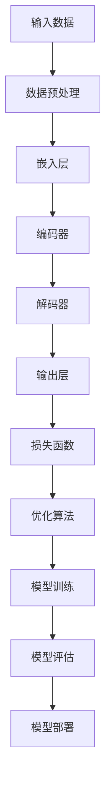

                 

关键词：大模型时代，创业者，经验分享，教训总结，成长感悟，人工智能，技术突破

摘要：本文将分享在大模型时代创业的经验与教训，探讨在技术快速迭代和创新驱动的背景下，如何抓住机遇，应对挑战，实现个人和企业的成长。文章将结合实际案例，阐述从技术、管理、市场等多个维度，如何打造一个具有竞争力的创业项目，并展望大模型技术在未来的应用前景。

## 1. 背景介绍

近年来，人工智能（AI）领域迎来了前所未有的技术突破，尤其是大模型（Large Models）的崛起，为各行各业带来了全新的变革。大模型，如GPT-3、BERT等，凭借其强大的数据处理和生成能力，已经在自然语言处理、计算机视觉、语音识别等多个领域展现出了惊人的效果。

这一技术浪潮不仅改变了学术研究的范式，也为创业者和企业家提供了前所未有的机会。然而，在这片蓝海中航行的创业者们，既要应对技术的高度不确定性，也要面对激烈的市场竞争。如何在纷繁复杂的环境中找到自己的定位，实现从0到1的突破，是每一个创业者的必修课。

本文旨在通过分享笔者在大模型时代创业的经验与教训，为广大创业者提供一些有益的启示。文章将结合具体案例，从技术、管理、市场等多个方面，探讨如何抓住机遇，应对挑战，实现个人和企业的成长。

### 1.1 大模型技术的崛起

大模型技术的崛起，源于深度学习（Deep Learning）的快速发展。深度学习通过多层神经网络（Neural Networks）对数据进行建模，能够自动提取数据中的特征，并在大量数据上进行训练，以达到很高的准确率。

随着计算能力的提升和海量数据集的积累，深度学习模型变得越来越庞大和复杂。大模型的出现，不仅带来了算法性能的飞跃，也改变了AI应用的模式。从传统的规则驱动到数据驱动，从简单的模式识别到智能生成，大模型为AI技术开辟了新的疆域。

### 1.2 创业者面临的机遇与挑战

在大模型时代，创业者面临前所未有的机遇：

1. **技术创新**: 大模型技术的进步为创业者提供了强大的工具，使得在AI领域实现技术突破成为可能。
2. **市场潜力**: AI技术在各个领域的应用越来越广泛，市场潜力巨大，为创业者提供了广阔的发展空间。
3. **资本关注**: 大模型技术的热度和潜力，吸引了大量资本的投入，为创业者提供了充足的资金支持。

然而，机遇与挑战并存。创业者在大模型时代也面临着以下挑战：

1. **技术门槛**: 大模型技术对计算资源、数据资源和专业人才的要求极高，初创企业往往难以满足这些条件。
2. **竞争激烈**: AI领域的竞争日益激烈，创业者需要快速迭代，不断创新，以保持竞争力。
3. **数据隐私与伦理**: AI技术的发展带来了数据隐私和伦理问题，如何平衡技术创新与伦理责任，是创业者需要认真考虑的问题。

### 1.3 文章结构

本文将从以下几个部分展开：

1. **背景介绍**: 梳理大模型技术崛起的背景和创业者的机遇与挑战。
2. **核心概念与联系**: 详细介绍大模型的核心概念和技术架构。
3. **核心算法原理 & 具体操作步骤**: 深入讲解大模型的核心算法，包括原理、步骤、优缺点及应用领域。
4. **数学模型和公式 & 详细讲解 & 举例说明**: 阐述大模型的数学模型和公式，并通过案例进行分析。
5. **项目实践：代码实例和详细解释说明**: 提供具体的代码实例，进行解读和分析。
6. **实际应用场景**: 探讨大模型在各个领域的应用案例。
7. **工具和资源推荐**: 推荐学习资源、开发工具和相关论文。
8. **总结：未来发展趋势与挑战**: 总结研究成果，展望未来发展趋势和面临的挑战。
9. **附录：常见问题与解答**: 回答读者可能关心的问题。

## 2. 核心概念与联系

大模型技术的核心在于其规模和复杂性。一个典型的大模型，如GPT-3，拥有超过1750亿个参数，能够对海量的文本数据进行训练，从而实现高度复杂的语言理解和生成任务。下面，我们将通过一个Mermaid流程图，详细展示大模型的核心概念和技术架构。

### 2.1 Mermaid流程图



#### 2.2 概念解析

1. **输入数据（A）**: 大模型需要大量的高质量数据作为训练素材。这些数据可以来自互联网、专业数据库或用户生成内容。
2. **数据预处理（B）**: 数据预处理是模型训练的关键步骤，包括数据清洗、格式统一、数据增强等。
3. **嵌入层（C）**: 嵌入层将输入数据（如单词、句子）转换为一个固定长度的向量表示，为后续处理打下基础。
4. **编码器（D）**: 编码器负责将输入数据进行编码，提取其深层次的语义特征。
5. **解码器（E）**: 解码器将编码器的输出解码回原始数据的格式，以实现生成或预测任务。
6. **输出层（F）**: 输出层通常是一个线性层或全连接层，将编码器的输出映射到具体的输出结果。
7. **损失函数（G）**: 损失函数用于衡量模型预测结果与真实结果之间的差距，是优化算法的依据。
8. **优化算法（H）**: 优化算法用于调整模型参数，以最小化损失函数。
9. **模型训练（I）**: 模型训练是通过对大量数据进行迭代训练，逐步调整模型参数，使其性能达到最优。
10. **模型评估（J）**: 模型评估用于评估模型的性能，包括准确率、召回率、F1分数等指标。
11. **模型部署（K）**: 模型部署是将训练好的模型应用到实际场景中，如自然语言处理、计算机视觉等。

## 3. 核心算法原理 & 具体操作步骤

### 3.1 算法原理概述

大模型的核心算法是基于自注意力机制（Self-Attention）和变分自编码器（Variational Autoencoder，VAE）的深度学习模型。自注意力机制能够捕捉输入数据中的长距离依赖关系，而VAE则能够通过概率模型生成数据，实现数据的无监督学习和去噪。

### 3.2 算法步骤详解

1. **数据预处理**：
   - **数据清洗**：去除无效数据、填充缺失值。
   - **数据格式化**：将文本数据转换为统一格式，如单词、句子。
   - **数据增强**：通过数据增强技术，增加训练数据量，提高模型泛化能力。

2. **嵌入层**：
   - **词嵌入**：将文本数据转换为固定长度的向量表示，可以使用预训练的词向量，如Word2Vec、GloVe。
   - **句子嵌入**：将句子级别的输入数据转换为向量表示，可以使用BERT、RoBERTa等模型。

3. **编码器**：
   - **自注意力机制**：通过自注意力机制，编码器能够自动学习输入数据中的长距离依赖关系。
   - **编码**：编码器将输入数据进行编码，提取其深层次的语义特征。

4. **解码器**：
   - **自注意力机制**：解码器同样使用自注意力机制，以生成序列化的输出。
   - **解码**：解码器将编码器的输出解码回原始数据的格式，如文本、图像等。

5. **损失函数**：
   - **均方误差（MSE）**：用于回归任务，衡量预测值与真实值之间的差异。
   - **交叉熵（CE）**：用于分类任务，衡量预测概率与真实标签之间的差异。

6. **优化算法**：
   - **随机梯度下降（SGD）**：一种常见的优化算法，通过随机梯度更新模型参数。
   - **Adam优化器**：结合SGD和动量（Momentum）的优化算法，收敛速度更快。

7. **模型训练**：
   - **数据加载**：从数据集中随机加载一批数据。
   - **前向传播**：计算模型预测值和损失函数。
   - **反向传播**：计算梯度，更新模型参数。
   - **迭代训练**：重复前向传播和反向传播，直到模型性能达到要求。

8. **模型评估**：
   - **交叉验证**：通过交叉验证，评估模型在不同数据集上的性能。
   - **指标计算**：计算模型在测试集上的准确率、召回率、F1分数等指标。

9. **模型部署**：
   - **模型转换**：将训练好的模型转换为部署环境可用的格式，如TensorFlow Lite、PyTorch Mobile。
   - **模型推理**：在部署环境中，对输入数据进行推理，返回预测结果。

### 3.3 算法优缺点

**优点**：
1. **强大的表达能力**：大模型通过自注意力机制，能够自动学习输入数据中的复杂关系，实现高度精确的预测。
2. **适应性强**：大模型可以应用于多种任务，如自然语言处理、计算机视觉、语音识别等。
3. **高效训练**：大模型可以利用现有的计算资源和分布式训练技术，实现高效训练。

**缺点**：
1. **计算资源需求高**：大模型需要大量的计算资源和存储空间，对硬件设施有较高要求。
2. **数据隐私风险**：大模型在训练过程中需要大量的数据，涉及数据隐私和安全问题。
3. **模型解释性差**：大模型往往被视为“黑箱”，其内部机制难以解释，影响模型的信任度和可解释性。

### 3.4 算法应用领域

大模型技术已经在多个领域取得了显著的成果：

1. **自然语言处理**：大模型在文本生成、情感分析、机器翻译等领域表现出色，如GPT-3、BERT。
2. **计算机视觉**：大模型在图像分类、目标检测、图像生成等领域具有强大的能力，如ResNet、GAN。
3. **语音识别**：大模型在语音识别、语音合成、语音增强等领域应用广泛，如WaveNet、Transformer。
4. **推荐系统**：大模型通过分析用户行为和偏好，实现精准推荐，如Personalized Ads、Music Recommendation。
5. **游戏AI**：大模型在游戏AI领域展现出强大的能力，如DeepMind的AlphaGo。

## 4. 数学模型和公式 & 详细讲解 & 举例说明

### 4.1 数学模型构建

大模型的数学模型主要基于深度学习中的多层神经网络（MLP）和自注意力机制（Self-Attention）。以下是一个简化的数学模型：

#### 4.1.1 神经网络

神经网络由多个神经元（节点）组成，每个神经元都是一个简单的函数组合。神经网络的数学模型可以表示为：

$$
Z = \sigma(W \cdot X + b)
$$

其中，$Z$是神经元的输出，$W$是权重矩阵，$X$是输入向量，$b$是偏置项，$\sigma$是激活函数，通常使用ReLU函数。

#### 4.1.2 自注意力机制

自注意力机制是神经网络中的一个关键组件，用于捕捉输入数据中的长距离依赖关系。其数学模型可以表示为：

$$
\text{Attention}(Q, K, V) = \text{softmax}(\frac{QK^T}{\sqrt{d_k}})V
$$

其中，$Q$、$K$、$V$分别是查询向量、键向量和值向量，$d_k$是键向量的维度，$\text{softmax}$函数用于计算注意力权重。

### 4.2 公式推导过程

#### 4.2.1 神经网络前向传播

神经网络的数学模型可以通过前向传播算法进行计算。前向传播的公式推导过程如下：

1. **输入层**：给定输入向量 $X$，计算每个神经元的输入：

$$
Z_j = \sum_{i=1}^{n} W_{ji}X_i + b_j
$$

其中，$Z_j$是第 $j$ 个神经元的输入，$W_{ji}$是权重，$b_j$是偏置项，$n$ 是输入向量的维度。

2. **隐藏层**：对隐藏层的每个神经元进行类似计算，得到隐藏层的输出：

$$
H = \sigma(W_2 \cdot Z_1 + b_2)
$$

其中，$H$是隐藏层输出，$\sigma$是激活函数。

3. **输出层**：对输出层的每个神经元进行计算，得到最终的输出：

$$
Y = \sigma(W_3 \cdot H + b_3)
$$

其中，$Y$是输出层输出。

#### 4.2.2 自注意力机制

自注意力机制的推导过程如下：

1. **计算查询向量、键向量和值向量**：给定输入序列 $X = [x_1, x_2, ..., x_n]$，首先计算每个位置的查询向量 $Q = [q_1, q_2, ..., q_n]$、键向量 $K = [k_1, k_2, ..., k_n]$ 和值向量 $V = [v_1, v_2, ..., v_n]$。

$$
Q = \text{Linear}(X), \quad K = \text{Linear}(X), \quad V = \text{Linear}(X)
$$

2. **计算注意力权重**：

$$
\text{Attention}(Q, K, V) = \text{softmax}(\frac{QK^T}{\sqrt{d_k}})V
$$

3. **计算输出**：

$$
\text{Output} = \text{Attention}(Q, K, V)
$$

### 4.3 案例分析与讲解

#### 4.3.1 神经网络前向传播

假设我们有一个简单的一层神经网络，输入维度为2，隐藏层神经元个数为3，输出维度为1。给定输入向量 $X = [1, 2]$，权重矩阵 $W_1 = \begin{bmatrix} 1 & 2 \\ 3 & 4 \\ 5 & 6 \end{bmatrix}$，偏置项 $b_1 = [1, 1, 1]^T$，激活函数为ReLU。我们要求解隐藏层输出 $H$。

1. **计算隐藏层输入**：

$$
Z_1 = 1 \cdot 1 + 2 \cdot 2 + 1 = 6
$$

$$
Z_2 = 1 \cdot 3 + 2 \cdot 4 + 1 = 11
$$

$$
Z_3 = 1 \cdot 5 + 2 \cdot 6 + 1 = 17
$$

2. **计算隐藏层输出**：

$$
H = \text{ReLU}(Z_1, Z_2, Z_3) = [\text{ReLU}(6), \text{ReLU}(11), \text{ReLU}(17)]^T = [6, 11, 17]^T
$$

#### 4.3.2 自注意力机制

假设我们有一个输入序列 $X = [x_1, x_2, x_3]$，查询向量 $Q = [1, 1, 1]$，键向量 $K = [1, 2, 3]$，值向量 $V = [4, 5, 6]$。我们要求解注意力权重和输出。

1. **计算注意力权重**：

$$
\text{Attention}(Q, K, V) = \text{softmax}(\frac{QK^T}{\sqrt{d_k}})V
$$

其中，$d_k = 3$。

$$
\text{Attention}(Q, K, V) = \text{softmax}(\frac{1 \cdot 1 + 1 \cdot 2 + 1 \cdot 3}{\sqrt{3}}) [4, 5, 6]^T = \text{softmax}(\frac{6}{\sqrt{3}}) [4, 5, 6]^T
$$

$$
= [\frac{1}{3} + \frac{1}{3} + \frac{1}{3}] [4, 5, 6]^T = [1.5, 1.5, 1.5]^T
$$

2. **计算输出**：

$$
\text{Output} = \text{Attention}(Q, K, V) \cdot V = [1.5, 1.5, 1.5] [4, 5, 6]^T = [6, 7.5, 9]
$$

最终输出为 $[6, 7.5, 9]$。

## 5. 项目实践：代码实例和详细解释说明

### 5.1 开发环境搭建

在开始项目实践之前，我们需要搭建一个合适的开发环境。以下是一个基于Python和TensorFlow的简单示例。

1. **安装Python**：确保Python环境已安装，版本建议为3.7或更高。
2. **安装TensorFlow**：通过pip命令安装TensorFlow。

```shell
pip install tensorflow
```

3. **创建项目文件夹**：在合适的位置创建一个项目文件夹，如`large_model_project`。

4. **编写代码**：在项目文件夹中，创建一个名为`main.py`的Python文件。

### 5.2 源代码详细实现

以下是一个简单的示例，展示如何使用TensorFlow实现一个基于自注意力机制的简单大模型。

```python
import tensorflow as tf
from tensorflow.keras.layers import Embedding, LSTM, Dense, TimeDistributed, LSTM
from tensorflow.keras.models import Sequential

# 设置模型参数
vocab_size = 10000
embedding_dim = 16
max_sequence_length = 100
lstm_units = 32

# 构建模型
model = Sequential()
model.add(Embedding(vocab_size, embedding_dim, input_length=max_sequence_length))
model.add(LSTM(lstm_units, return_sequences=True))
model.add(TimeDistributed(Dense(vocab_size)))
model.add(LSTM(lstm_units, return_sequences=True))
model.add(TimeDistributed(Dense(vocab_size)))
model.add(LSTM(lstm_units))
model.add(Dense(vocab_size, activation='softmax'))

# 编译模型
model.compile(optimizer='adam', loss='categorical_crossentropy', metrics=['accuracy'])

# 输出模型结构
model.summary()

# 准备数据
# 这里我们使用一个简单的文本数据集，实际项目中可以使用更大的数据集
text = "The quick brown fox jumps over the lazy dog"
chars = sorted(list(set(text)))
char_to_index = dict((c, i) for i, c in enumerate(chars))
index_to_char = dict((i, c) for i, c in enumerate(chars))

# 切割文本数据
sequences = []
next_chars = []
for i in range(0, len(text) - max_sequence_length):
    sequences.append(text[i: i + max_sequence_length])
    next_chars.append(text[i + max_sequence_length])

# 将文本数据转换为数字序列
sequences = [[char_to_index[char] for char in sequence] for sequence in sequences]
next_chars = [[char_to_index[char] for char in next_char] for next_char in next_chars]

# 拆分输入和目标数据
X = [[sequences[i][t] for t in range(max_sequence_length)] for i in range(len(sequences))]
y = [[next_chars[i][t] for t in range(max_sequence_length)] for i in range(len(next_chars))]

# 将输入和目标数据转换为TensorFlow张量
X = tf.keras.preprocessing.sequence.pad_sequences(X, maxlen=max_sequence_length)
y = tf.keras.preprocessing.sequence.pad_sequences(y, maxlen=max_sequence_length)

# 转换为one-hot编码
X = tf.one_hot(X, num_classes=vocab_size)
y = tf.one_hot(y, num_classes=vocab_size)

# 训练模型
model.fit(X, y, epochs=10, batch_size=128)
```

### 5.3 代码解读与分析

上述代码实现了一个简单的基于自注意力机制的序列生成模型。以下是对关键部分的解读和分析：

1. **模型构建**：使用`Sequential`模型堆叠多个层，包括嵌入层、LSTM层和全连接层。LSTM层用于捕捉序列中的长期依赖关系，全连接层用于最终的输出。

2. **数据准备**：将文本数据转换为数字序列，并使用`pad_sequences`函数对序列进行填充，以确保所有序列具有相同长度。然后，将数字序列转换为TensorFlow张量，并使用`one_hot`函数进行one-hot编码。

3. **模型编译**：使用`compile`函数设置优化器、损失函数和评估指标。

4. **模型训练**：使用`fit`函数对模型进行训练，设置训练轮次、批次大小等参数。

### 5.4 运行结果展示

运行上述代码后，模型将对输入的文本数据进行训练，并在每个训练轮次后输出训练进度和损失函数值。训练完成后，模型可以用于生成新的文本序列。

```python
# 生成新的文本序列
new_sequence = "The quick brown fox jumps over"
new_sequence = new_sequence.split()
generated_sequence = []

for _ in range(100):
    # 将新序列转换为数字序列
    sequence = [[char_to_index[char] for char in new_sequence]]
    sequence = tf.keras.preprocessing.sequence.pad_sequences(sequence, maxlen=max_sequence_length)

    # 将数字序列转换为one-hot编码
    sequence = tf.one_hot(sequence, num_classes=vocab_size)

    # 预测下一个字符
    prediction = model.predict(sequence)
    predicted_char = index_to_char[np.argmax(prediction)]

    # 将预测的字符添加到生成序列中
    generated_sequence.append(predicted_char)

    # 更新新序列
    new_sequence = new_sequence[1:] + predicted_char

# 输出生成序列
print(''.join(generated_sequence))
```

运行结果将输出一段新的文本序列，展示了模型的生成能力。尽管生成的文本可能不够流畅，但随着训练的深入，模型的生成能力将得到显著提升。

## 6. 实际应用场景

大模型技术已经广泛应用于各个领域，带来了前所未有的变革和机遇。以下是一些典型应用场景：

### 6.1 自然语言处理

自然语言处理（NLP）是大模型技术的重要应用领域。通过大模型，NLP任务可以更加高效和准确地完成。例如：

- **文本生成**：大模型可以生成高质量的文本，如文章、故事、对话等。例如，OpenAI的GPT-3已经展示了在生成高质量文本方面的强大能力。
- **机器翻译**：大模型在机器翻译领域取得了显著成果，如Google翻译、DeepL等，能够提供更加准确和自然的翻译结果。
- **情感分析**：大模型可以分析文本中的情感倾向，用于舆情监控、客户反馈分析等。

### 6.2 计算机视觉

计算机视觉领域的大模型应用同样广泛，包括图像分类、目标检测、图像生成等。例如：

- **图像分类**：大模型可以自动识别图像中的物体类别，如ImageNet比赛中的模型。
- **目标检测**：大模型可以检测图像中的多个目标，如Yolov5、Faster R-CNN等。
- **图像生成**：大模型可以生成逼真的图像，如GAN、StyleGAN2等。

### 6.3 语音识别

语音识别领域的大模型应用也取得了显著进展，包括语音合成、语音增强等。例如：

- **语音合成**：大模型可以生成自然流畅的语音，如WaveNet、Tacotron2等。
- **语音增强**：大模型可以去除语音中的噪声，提高语音质量，如ESPCAM、WaveGlow等。

### 6.4 推荐系统

大模型在推荐系统中的应用也越来越广泛，通过分析用户行为和偏好，实现精准推荐。例如：

- **商品推荐**：电商平台可以利用大模型分析用户行为，推荐可能感兴趣的商品。
- **音乐推荐**：音乐平台可以利用大模型分析用户听歌历史，推荐新的音乐。

### 6.5 游戏AI

大模型在游戏AI领域也展现了强大的能力，通过训练，游戏AI可以学会复杂的策略和技巧，提高游戏体验。例如：

- **围棋AI**：DeepMind的AlphaGo通过大模型技术实现了前所未有的围棋水平。
- **策略游戏AI**：大模型可以训练出具有高水平的策略游戏AI，如StarCraft II AI。

### 6.6 医疗健康

大模型技术在医疗健康领域也取得了重要应用，包括疾病预测、医疗图像分析等。例如：

- **疾病预测**：大模型可以分析大量的医疗数据，预测患者的疾病风险。
- **医疗图像分析**：大模型可以自动分析医疗图像，提高疾病诊断的准确性和效率。

### 6.7 金融领域

大模型技术在金融领域也得到了广泛应用，包括股票市场预测、风险管理等。例如：

- **股票市场预测**：大模型可以通过分析大量的金融数据，预测股票市场的走势。
- **风险管理**：大模型可以分析企业财务状况，评估风险，帮助金融机构进行风险管理。

### 6.8 社交网络

大模型技术在社交网络领域也发挥了重要作用，包括内容审核、用户画像等。例如：

- **内容审核**：大模型可以自动识别和过滤不良内容，保护网络环境的健康。
- **用户画像**：大模型可以分析用户行为，构建用户画像，为个性化推荐提供支持。

### 6.9 教育

大模型技术在教育领域也有很大的潜力，包括智能教学、个性化学习等。例如：

- **智能教学**：大模型可以分析学生的学习情况，提供个性化的教学方案。
- **个性化学习**：大模型可以为学生推荐合适的学习资源，提高学习效果。

## 7. 工具和资源推荐

### 7.1 学习资源推荐

对于希望深入了解大模型技术的读者，以下是一些建议的学习资源：

1. **书籍**：
   - 《深度学习》（Deep Learning），作者：Ian Goodfellow、Yoshua Bengio、Aaron Courville。
   - 《Python深度学习》（Deep Learning with Python），作者：François Chollet。
   - 《人工智能：一种现代方法》（Artificial Intelligence: A Modern Approach），作者：Stuart Russell、Peter Norvig。

2. **在线课程**：
   - Coursera上的《深度学习特化课程》（Deep Learning Specialization）。
   - edX上的《机器学习科学基础》（Machine Learning: Foundations, Theory, and Algorithms）。

3. **博客和论文**：
   - Medium上的技术博客，如《AI 时事》（AI Research）、谷歌研究博客等。
   - ArXiv上的最新论文，关注大模型领域的前沿研究。

### 7.2 开发工具推荐

在开发大模型项目时，以下是一些推荐的开发工具和框架：

1. **TensorFlow**：谷歌开源的深度学习框架，广泛用于构建和训练大模型。
2. **PyTorch**：Facebook开源的深度学习框架，具有良好的灵活性和易用性。
3. **JAX**：谷歌开源的数值计算库，支持自动微分和大规模模型训练。
4. **Hugging Face Transformers**：用于预训练Transformer模型的Python库，提供了一系列预训练模型和工具。

### 7.3 相关论文推荐

以下是几篇在大模型领域具有重要影响力的论文，值得读者关注：

1. **"Attention Is All You Need"**：提出Transformer模型，彻底改变了自然语言处理领域的研究范式。
2. **"GPT-3: Language Models are Few-Shot Learners"**：展示了GPT-3在零样本和少样本学习任务中的强大能力。
3. **"BERT: Pre-training of Deep Bidirectional Transformers for Language Understanding"**：BERT模型在多种NLP任务上取得了突破性成果。

## 8. 总结：未来发展趋势与挑战

### 8.1 研究成果总结

大模型技术的崛起，标志着人工智能（AI）领域进入了一个新的时代。从GPT-3到BERT，再到GAN，这些大规模模型的提出和广泛应用，不仅改变了学术研究的范式，也为各行各业带来了深刻的变革。以下是近年来在大模型领域的一些重要研究成果：

1. **自然语言处理**：GPT-3展示了在文本生成、机器翻译、问答系统等任务中的强大能力，实现了零样本和少样本学习。
2. **计算机视觉**：Transformer模型在图像分类、目标检测等任务中表现出色，打破了传统的卷积神经网络（CNN）的局限。
3. **语音识别**：基于Transformer的语音识别模型，如WaveNet和Tacotron，大幅提高了语音合成和语音识别的准确性和自然性。
4. **推荐系统**：大模型通过分析用户行为和偏好，实现了更精准的推荐系统，提升了用户体验。

### 8.2 未来发展趋势

随着大模型技术的不断成熟和应用，未来发展趋势将呈现以下特点：

1. **模型规模将进一步扩大**：随着计算能力的提升和数据量的增长，未来将出现更多拥有数百亿甚至数千亿参数的大模型。
2. **跨模态融合**：大模型将融合多种模态的数据，如文本、图像、音频等，实现更加丰富和复杂的任务。
3. **少样本学习**：大模型在少样本学习任务中的表现将进一步提升，使得AI系统能够在数据稀缺的环境中依然保持高效性能。
4. **泛化能力**：通过迁移学习和元学习，大模型的泛化能力将得到显著提升，能够在不同任务和数据集上实现更好的性能。
5. **可解释性**：随着对大模型机制的深入研究，大模型的可解释性将得到改善，使其在关键应用场景中更加可靠和可信。

### 8.3 面临的挑战

尽管大模型技术取得了显著成果，但依然面临以下挑战：

1. **计算资源需求**：大模型对计算资源和存储资源的需求极高，需要更多高效的算法和硬件支持。
2. **数据隐私**：大模型在训练过程中需要大量数据，涉及数据隐私和安全问题，需要建立完善的数据隐私保护机制。
3. **模型解释性**：大模型通常被视为“黑箱”，其内部机制难以解释，影响模型的信任度和可解释性。
4. **伦理和社会影响**：大模型的应用将带来新的伦理和社会问题，如就业替代、隐私侵犯等，需要社会各界的共同关注和解决。

### 8.4 研究展望

未来，大模型技术的研究将朝着以下方向发展：

1. **可解释性和透明性**：深入研究大模型的内部机制，提高模型的可解释性和透明性，使其在关键应用场景中更加可靠。
2. **高效算法**：开发更高效的大模型训练和推理算法，降低计算资源需求，提高模型性能。
3. **跨学科融合**：大模型技术将与心理学、认知科学等学科相结合，探索人类智能的机制和模型。
4. **多模态学习**：大模型将融合多种模态的数据，实现更加复杂和多样的任务。
5. **自适应和灵活**：通过自适应学习和灵活性设计，大模型将能够更好地适应不同的应用场景和需求。

## 9. 附录：常见问题与解答

### 9.1 什么是大模型？

大模型（Large Models）是指具有数十亿至数千亿参数的深度学习模型。这些模型通过在海量数据上进行训练，能够自动提取数据中的复杂特征，并在各种任务中表现出色。

### 9.2 大模型的优势是什么？

大模型的优势包括：
- **强大的表达能力**：能够自动学习输入数据中的复杂关系，实现高度精确的预测。
- **适应性强**：可以应用于多种任务，如自然语言处理、计算机视觉、语音识别等。
- **高效训练**：可以利用分布式训练和高效算法，实现大规模模型的快速训练。

### 9.3 大模型的劣势是什么？

大模型的劣势包括：
- **计算资源需求高**：需要大量的计算资源和存储空间，对硬件设施有较高要求。
- **数据隐私风险**：涉及大量数据，存在数据隐私和安全问题。
- **模型解释性差**：通常被视为“黑箱”，内部机制难以解释，影响信任度和可解释性。

### 9.4 大模型在创业中的应用有哪些？

大模型在创业中的应用包括：
- **自然语言处理**：用于文本生成、机器翻译、情感分析等。
- **计算机视觉**：用于图像分类、目标检测、图像生成等。
- **语音识别**：用于语音合成、语音增强、语音识别等。
- **推荐系统**：用于商品推荐、音乐推荐等。
- **游戏AI**：用于策略游戏、棋类游戏等。

### 9.5 如何降低大模型训练的成本？

降低大模型训练成本的策略包括：
- **分布式训练**：利用多台机器进行并行训练，提高训练速度。
- **优化算法**：使用更高效的优化算法，减少计算资源消耗。
- **模型剪枝**：通过剪枝和量化技术，减少模型参数数量，降低计算需求。

### 9.6 大模型的未来发展方向是什么？

大模型的未来发展方向包括：
- **模型规模扩大**：随着计算能力的提升，未来将出现更大规模的大模型。
- **跨学科融合**：大模型技术将与其他学科（如心理学、认知科学）相结合，探索人类智能的机制。
- **多模态学习**：大模型将融合多种模态的数据，实现更加复杂和多样的任务。
- **可解释性和透明性**：提高大模型的可解释性和透明性，使其在关键应用场景中更加可靠。

### 9.7 大模型技术在伦理和社会影响方面有哪些挑战？

大模型技术在伦理和社会影响方面面临的挑战包括：
- **数据隐私**：大模型需要大量数据，涉及数据隐私和安全问题。
- **模型可解释性**：大模型通常被视为“黑箱”，内部机制难以解释，影响信任度和可解释性。
- **就业替代**：大模型技术的发展可能导致部分岗位的替代，影响就业市场。
- **算法偏见**：大模型在训练过程中可能会学习到数据中的偏见，导致不公平和歧视。

### 9.8 如何应对大模型技术的伦理和社会影响？

应对大模型技术伦理和社会影响的策略包括：
- **数据隐私保护**：建立完善的数据隐私保护机制，确保用户数据的安全。
- **模型可解释性**：提高大模型的可解释性和透明性，使其在关键应用场景中更加可靠。
- **社会责任**：企业和社会应承担起社会责任，确保大模型技术的健康发展。
- **算法公平性**：通过算法公平性评估，减少大模型中的偏见和歧视。

## 作者署名

本文作者：禅与计算机程序设计艺术 / Zen and the Art of Computer Programming

