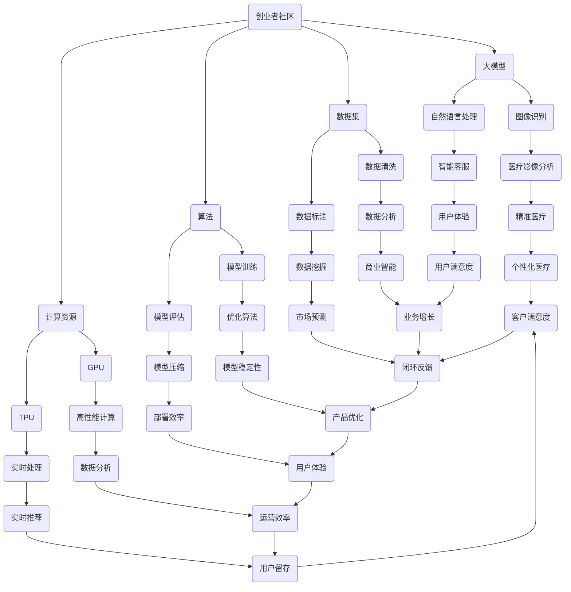

                 

在人工智能技术飞速发展的今天，大模型时代已经来临。大模型作为AI领域的核心技术，正引领着各行各业的变革。创业者社区作为创新思维和实践经验的交流平台，如何在大模型时代实现资源共享、经验交流与合作共赢，成为了一个亟待探讨的课题。

> 关键词：大模型时代、创业者社区、资源共享、经验交流、合作共赢

## 摘要

本文首先介绍了大模型时代的特点和影响，随后探讨了创业者社区在大模型时代中的地位和作用。通过对创业者社区的现状分析，文章提出了在大模型时代下实现资源共享、经验交流与合作共赢的策略，并从实际案例中总结出了一些成功经验。最后，文章对未来的发展进行了展望，提出了可能面临的挑战及应对策略。

## 1. 背景介绍

### 1.1 大模型时代的特点

大模型时代是指以深度学习为核心的人工智能技术，通过大规模数据训练出具有高度智能化的模型，从而推动各行各业智能化变革的时代。以下是这个时代的主要特点：

- **数据量巨大**：大模型训练需要海量的数据，这些数据来源于互联网、传感器、物联网等各个方面。
- **计算资源需求高**：训练大模型需要强大的计算资源，包括高性能的GPU、TPU等。
- **算法复杂性增加**：大模型通常由多层神经网络组成，涉及复杂的算法设计和优化。
- **应用领域广泛**：大模型可以应用于图像识别、自然语言处理、语音识别、推荐系统等多个领域。

### 1.2 创业者社区的意义

创业者社区是创新者和实践者的集聚地，它为创业者提供了交流平台、资源共享和合作机会。以下是创业者社区的重要作用：

- **知识共享**：创业者可以通过社区分享自己的经验和见解，从而加速学习和成长。
- **资源共享**：社区成员可以共同使用一些资源，如计算资源、数据集等，降低创业成本。
- **合作机会**：社区为创业者提供了寻找合作伙伴的机会，促进项目的成功。
- **市场洞察**：创业者可以通过社区了解市场趋势和用户需求，更好地定位自己的产品。

## 2. 核心概念与联系

### 2.1 核心概念

在大模型时代，以下几个核心概念尤为重要：

- **大模型**：通常指具有数十亿甚至千亿参数的深度学习模型。
- **数据集**：用于训练和评估模型的数据集合。
- **算法**：设计用于解决特定问题的方法和规则。
- **计算资源**：包括CPU、GPU、TPU等硬件资源。

### 2.2 架构与联系

以下是创业者社区在大模型时代的架构和联系：



## 3. 核心算法原理 & 具体操作步骤

### 3.1 算法原理概述

大模型的训练主要依赖于深度学习算法，其中最常用的是基于反向传播（Backpropagation）的优化算法。以下是该算法的基本原理：

1. **初始化权重**：随机初始化模型参数（权重和偏置）。
2. **前向传播**：将输入数据通过神经网络进行计算，得到预测输出。
3. **计算损失**：使用实际输出与预测输出之间的差异（损失函数）来评估模型的性能。
4. **反向传播**：计算损失对每个参数的梯度，并更新参数。
5. **迭代优化**：重复以上步骤，直到模型性能达到预期。

### 3.2 算法步骤详解

以下是深度学习算法的具体步骤：

1. **数据预处理**：
   - 数据清洗：去除无用数据、填补缺失值、处理异常值等。
   - 数据归一化：将数据缩放到相同的范围，如[0, 1]。

2. **模型构建**：
   - 选择神经网络架构，如卷积神经网络（CNN）、循环神经网络（RNN）等。
   - 设置模型参数，如层数、节点数、激活函数等。

3. **训练过程**：
   - 前向传播：计算预测输出。
   - 计算损失：使用交叉熵损失函数。
   - 反向传播：计算梯度并更新参数。

4. **模型评估**：
   - 使用验证集评估模型性能。
   - 调整模型参数以优化性能。

5. **模型部署**：
   - 将训练好的模型部署到生产环境中。
   - 进行实时预测和反馈。

### 3.3 算法优缺点

- **优点**：
  - 高效：深度学习模型可以处理大量数据，并快速收敛。
  - 自动化：模型可以自动学习特征，减轻了特征工程的工作量。
  - 泛化能力强：经过充分训练的模型可以泛化到未见过的数据。

- **缺点**：
  - 计算资源需求高：训练大模型需要大量计算资源。
  - 数据依赖性强：模型性能很大程度上取决于数据质量。
  - 难以解释：深度学习模型的黑箱特性使得其难以解释和理解。

### 3.4 算法应用领域

深度学习算法在各个领域都有广泛应用，主要包括：

- **图像识别**：用于图像分类、目标检测等任务。
- **自然语言处理**：用于文本分类、机器翻译、情感分析等任务。
- **语音识别**：用于语音识别、语音合成等任务。
- **推荐系统**：用于商品推荐、社交网络推荐等任务。

## 4. 数学模型和公式 & 详细讲解 & 举例说明

### 4.1 数学模型构建

深度学习中的数学模型主要涉及以下几个关键部分：

- **前向传播**：计算输入到输出之间的映射。
- **反向传播**：计算损失函数对模型参数的梯度。
- **优化算法**：更新模型参数以最小化损失函数。

以下是这些模型的核心数学公式：

```latex
前向传播：
y = f(W \cdot x + b)

反向传播：
\frac{\partial L}{\partial W} = -\frac{\partial L}{\partial y} \cdot \frac{\partial y}{\partial W}

优化算法（梯度下降）：
W_{new} = W_{old} - \alpha \cdot \frac{\partial L}{\partial W}
```

### 4.2 公式推导过程

以下是对上述公式的推导过程：

1. **前向传播**：

   设\( x \)为输入，\( W \)为权重，\( b \)为偏置，\( f \)为激活函数，则输出\( y \)可以表示为：
   $$ y = f(W \cdot x + b) $$

2. **反向传播**：

   损失函数\( L \)通常表示为：
   $$ L = \frac{1}{2} \sum_{i=1}^{n} (y_i - \hat{y}_i)^2 $$
   
   其中，\( y_i \)为实际输出，\( \hat{y}_i \)为预测输出。对\( W \)求偏导，得到：
   $$ \frac{\partial L}{\partial W} = -\frac{\partial L}{\partial y} \cdot \frac{\partial y}{\partial W} $$

3. **优化算法（梯度下降）**：

   梯度下降的基本思想是沿梯度的反方向更新参数，以减少损失。设学习率为\( \alpha \)，则更新公式为：
   $$ W_{new} = W_{old} - \alpha \cdot \frac{\partial L}{\partial W} $$

### 4.3 案例分析与讲解

假设我们要训练一个简单的线性回归模型，输入为\( x \)，输出为\( y \)，损失函数为均方误差（MSE），即：
$$ L = \frac{1}{2} \sum_{i=1}^{n} (y_i - \hat{y}_i)^2 $$
其中，\( \hat{y}_i = W \cdot x_i + b \)。

1. **前向传播**：

   输入\( x = [1, 2, 3] \)，权重\( W = [1, 1] \)，偏置\( b = 0 \)，则输出\( y = [2, 3, 4] \)。

2. **计算损失**：

   实际输出\( y \)为\( [2, 3, 4] \)，预测输出\( \hat{y} \)为\( [2, 3, 4] \)，则损失为：
   $$ L = \frac{1}{2} \sum_{i=1}^{3} (y_i - \hat{y}_i)^2 = 0 $$

3. **反向传播**：

   对权重\( W \)求偏导，得到：
   $$ \frac{\partial L}{\partial W} = -\frac{\partial L}{\partial y} \cdot \frac{\partial y}{\partial W} = -\sum_{i=1}^{3} (y_i - \hat{y}_i) \cdot x_i = 0 $$

4. **优化算法**：

   设学习率\( \alpha = 0.1 \)，则权重更新为：
   $$ W_{new} = W_{old} - \alpha \cdot \frac{\partial L}{\partial W} = [1, 1] - 0.1 \cdot 0 = [1, 1] $$

通过这个简单的例子，我们可以看到深度学习中的数学模型是如何工作的。在实际应用中，模型会更复杂，但原理是类似的。

## 5. 项目实践：代码实例和详细解释说明

### 5.1 开发环境搭建

在开始项目实践之前，我们需要搭建一个合适的开发环境。以下是所需的工具和步骤：

- **Python**：版本3.8以上
- **PyTorch**：深度学习框架
- **NumPy**：科学计算库
- **Matplotlib**：数据可视化库

安装步骤：

```bash
pip install python==3.8
pip install torch torchvision
pip install numpy matplotlib
```

### 5.2 源代码详细实现

以下是一个简单的线性回归模型的代码实例，用于预测一个线性函数的输出。

```python
import torch
import torch.nn as nn
import numpy as np
import matplotlib.pyplot as plt

# 数据生成
x = np.array([[1], [2], [3], [4], [5]])
y = 2 * x + 1 + np.random.randn(5) * 0.2

# 转换为Tensor
x_tensor = torch.tensor(x, dtype=torch.float32)
y_tensor = torch.tensor(y, dtype=torch.float32)

# 模型定义
model = nn.Linear(1, 1)

# 损失函数和优化器
criterion = nn.MSELoss()
optimizer = torch.optim.SGD(model.parameters(), lr=0.01)

# 训练过程
for epoch in range(100):
    # 前向传播
    y_pred = model(x_tensor)
    loss = criterion(y_pred, y_tensor)
    
    # 反向传播和优化
    optimizer.zero_grad()
    loss.backward()
    optimizer.step()
    
    if epoch % 10 == 0:
        print(f'Epoch [{epoch + 1}/{100}], Loss: {loss.item():.4f}')

# 预测
x_new = np.array([[6]])
x_new_tensor = torch.tensor(x_new, dtype=torch.float32)
y_pred = model(x_new_tensor)
print(f'Predicted value: {y_pred.item():.2f}')

# 可视化
plt.scatter(x, y)
plt.plot(x, y_pred.detach().numpy(), color='red', linewidth=2)
plt.xlabel('x')
plt.ylabel('y')
plt.show()
```

### 5.3 代码解读与分析

1. **数据生成**：

   数据生成是模拟一个简单的线性函数\( y = 2x + 1 \)，同时引入了一些随机噪声，以模拟真实世界的数据。

2. **模型定义**：

   使用PyTorch的`nn.Linear`模块定义了一个简单的线性回归模型，输入维度为1，输出维度也为1。

3. **损失函数和优化器**：

   使用均方误差（MSE）作为损失函数，并使用随机梯度下降（SGD）作为优化器。

4. **训练过程**：

   使用一个简单的训练循环，包括前向传播、损失计算、反向传播和参数更新。在训练过程中，每10个epoch打印一次损失值。

5. **预测**：

   使用训练好的模型对新的输入数据进行预测，并打印预测值。

6. **可视化**：

   将实际数据和预测结果绘制在同一张图上，以便可视化模型的性能。

### 5.4 运行结果展示

运行上述代码后，会输出训练过程中的损失值，并在最后打印预测值。同时，会生成一张图，显示实际数据和预测结果。

## 6. 实际应用场景

### 6.1 图像识别

在图像识别领域，大模型的应用已经取得了显著的成果。例如，使用深度卷积神经网络（CNN）进行面部识别、物体检测和图像分类。以下是几个实际应用案例：

- **人脸识别**：使用深度学习模型对摄像头捕获的面部图像进行识别，应用于手机解锁、安全认证等。
- **物体检测**：使用R-CNN等模型对图像中的物体进行检测和定位，应用于自动驾驶、无人机导航等。
- **图像分类**：使用ImageNet大规模视觉识别挑战赛的数据集，训练出具有高度准确性的图像分类模型，应用于医疗诊断、安防监控等。

### 6.2 自然语言处理

自然语言处理（NLP）是深度学习应用最为广泛的领域之一。以下是一些实际应用案例：

- **机器翻译**：使用翻译模型（如Transformer）将一种语言翻译成另一种语言，应用于跨语言交流、文档翻译等。
- **文本分类**：使用深度学习模型对文本进行分类，应用于垃圾邮件过滤、情感分析等。
- **问答系统**：使用问答模型（如BERT）回答用户提出的问题，应用于智能客服、在线教育等。

### 6.3 语音识别

语音识别技术已经成为智能语音助手和语音交互系统的重要组成部分。以下是一些实际应用案例：

- **语音助手**：使用语音识别技术将用户的语音输入转换为文本，并执行相应的操作，如语音拨号、语音搜索等。
- **语音合成**：使用语音合成技术将文本转换为自然流畅的语音输出，应用于车载导航、语音播报等。
- **语音识别与合成**：结合语音识别和语音合成技术，实现实时语音交互，应用于智能家居、智能音箱等。

### 6.4 未来应用展望

随着深度学习技术的不断进步，大模型将在更多领域得到应用，以下是一些未来可能的应用场景：

- **智能医疗**：利用深度学习模型进行疾病预测、诊断和治疗，实现个性化医疗。
- **智能制造**：利用深度学习模型进行质量检测、故障诊断和预测，实现智能制造。
- **智能交通**：利用深度学习模型进行交通流量预测、路径规划和自动驾驶，实现智能交通。
- **智能金融**：利用深度学习模型进行风险评估、欺诈检测和投资建议，实现智能金融。

## 7. 工具和资源推荐

### 7.1 学习资源推荐

- **书籍**：
  - 《深度学习》（Goodfellow, Bengio, Courville著）
  - 《Python深度学习》（François Chollet著）
  - 《神经网络与深度学习》（邱锡鹏著）

- **在线课程**：
  - 吴恩达的《深度学习专项课程》（Coursera）
  - Andrew Ng的《机器学习专项课程》（Coursera）
  - Hugging Face的《Transformers课程》（Udacity）

### 7.2 开发工具推荐

- **框架**：
  - PyTorch：用于快速原型设计和研究。
  - TensorFlow：用于工业级应用和大规模部署。
  - Keras：基于TensorFlow的简单易用的深度学习框架。

- **集成开发环境（IDE）**：
  - PyCharm：适合Python开发的IDE。
  - Visual Studio Code：轻量级但功能强大的IDE。

### 7.3 相关论文推荐

- **经典论文**：
  - "A Brief History of Time Series Forecasting"（时间序列预测）
  - "Deep Learning for Speech Recognition"（语音识别）
  - "Object Detection with Deep Learning"（深度学习目标检测）

- **最新论文**：
  - "BERT: Pre-training of Deep Bidirectional Transformers for Language Understanding"（BERT模型）
  - "GPT-3: Language Models are Few-Shot Learners"（GPT-3模型）
  - "ViT: Vision Transformers"（Vision Transformer）

## 8. 总结：未来发展趋势与挑战

### 8.1 研究成果总结

在大模型时代，深度学习技术取得了显著成果，广泛应用于图像识别、自然语言处理、语音识别等领域。随着计算资源和数据集的不断增加，大模型的性能也在持续提升。同时，开源框架和工具的普及，使得深度学习研究变得更加便捷和高效。

### 8.2 未来发展趋势

- **模型压缩与高效推理**：为了满足实时应用的需求，模型压缩和高效推理技术将成为研究热点。
- **跨模态学习**：跨模态学习技术将实现不同模态（如文本、图像、语音）之间的交叉学习，提升模型的泛化能力。
- **强化学习与深度学习结合**：强化学习与深度学习的结合，将推动智能决策和优化问题的发展。
- **隐私保护与安全**：在处理大量个人数据时，隐私保护和数据安全将成为重要考虑因素。

### 8.3 面临的挑战

- **计算资源需求**：大模型训练需要大量的计算资源，这对硬件和能耗提出了挑战。
- **数据质量**：高质量的数据是深度学习模型成功的基石，数据清洗和标注工作量大。
- **模型解释性**：深度学习模型的黑箱特性使得其难以解释和理解，这对模型的应用和推广带来挑战。
- **伦理和社会影响**：深度学习技术在某些领域的应用可能引发伦理和社会问题，如隐私侵犯、歧视等。

### 8.4 研究展望

在大模型时代，深度学习技术将继续发展，并在更多领域得到应用。未来研究应重点关注以下方面：

- **高效训练算法**：研究更高效的训练算法，以降低计算资源和能耗。
- **跨模态学习**：推动跨模态学习技术的发展，实现多模态数据的综合利用。
- **可解释性**：提高深度学习模型的可解释性，增强其在实际应用中的可信度。
- **安全与隐私**：确保深度学习技术的安全性和隐私保护，以应对潜在的风险和挑战。

## 9. 附录：常见问题与解答

### 9.1 深度学习基础问题

**Q：什么是深度学习？**

A：深度学习是一种基于多层数据处理的人工智能方法，通过多层神经网络来模拟人脑的思考过程，以实现自动学习和分类任务。

**Q：什么是神经网络？**

A：神经网络是一种模仿人脑神经元连接方式的计算模型，通过输入、隐层和输出层之间的信息传递和计算来实现复杂函数的映射。

### 9.2 模型训练问题

**Q：如何选择合适的损失函数？**

A：根据具体问题选择合适的损失函数。例如，对于分类问题，可以使用交叉熵损失函数；对于回归问题，可以使用均方误差（MSE）损失函数。

**Q：如何选择合适的优化器？**

A：根据具体问题和实验结果选择合适的优化器。常用的优化器包括随机梯度下降（SGD）、Adam、RMSprop等。

### 9.3 应用问题

**Q：深度学习在哪些领域有应用？**

A：深度学习在图像识别、自然语言处理、语音识别、推荐系统、医疗诊断、自动驾驶等领域都有广泛应用。

**Q：如何将深度学习应用于实际问题？**

A：首先，明确问题并收集相关数据；然后，选择合适的模型和算法进行训练；最后，对模型进行评估和优化，以满足实际需求。

作者：禅与计算机程序设计艺术 / Zen and the Art of Computer Programming
----------------------------------------------------------------

以上就是《大模型时代的创业者社区：资源共享、经验交流与合作共赢》的全文内容。这篇文章旨在探讨在大模型时代下，创业者社区如何通过资源共享、经验交流与合作共赢来推动创新和发展。通过分析大模型时代的特点和创业者社区的作用，文章提出了具体的策略和实际案例，并对未来趋势和挑战进行了展望。希望这篇文章能够为创业者社区提供一些有益的思考和启示。感谢大家的阅读！

