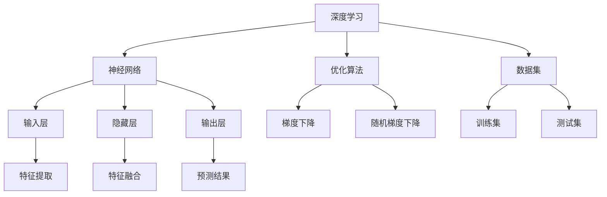

                 

关键词：大模型、人工智能、机器学习、算法、数学模型、应用场景、未来展望

> 摘要：本文探讨了大规模人工智能模型的发展历程、核心概念、算法原理、数学模型及其在实际应用场景中的表现。通过对大模型在各个领域中的成功案例进行分析，本文指出了当前大模型面临的挑战和未来发展的趋势。同时，本文还推荐了一系列学习资源、开发工具和相关论文，以期为读者提供全面的了解和参考。

## 1. 背景介绍

随着互联网和大数据技术的飞速发展，人工智能（AI）已经逐渐成为科技领域的热门话题。尤其是近年来，深度学习和神经网络技术的突破，使得人工智能在图像识别、自然语言处理、推荐系统等领域取得了显著的成果。这些成果的背后，离不开大规模人工智能模型的推动。

大规模人工智能模型（Large-scale AI Models），通常指的是具有数百万甚至数十亿参数的神经网络模型。这些模型通过学习大量的数据，能够自动提取出复杂特征，从而实现高度准确的预测和决策。随着数据规模的不断扩大和计算能力的提升，大规模人工智能模型在各个领域的应用前景变得愈发广阔。

本文旨在探讨大规模人工智能模型的发展历程、核心概念、算法原理、数学模型及其在实际应用场景中的表现。通过分析当前大模型在各个领域的成功案例，本文将指出大模型面临的挑战和未来发展的趋势。

## 2. 核心概念与联系

### 2.1 大规模人工智能模型的概念

大规模人工智能模型（Large-scale AI Models）是指那些参数量巨大、结构复杂的神经网络模型。这些模型通过学习大量的数据，能够自动提取出复杂特征，从而实现高度准确的预测和决策。大规模人工智能模型通常具有以下几个特点：

1. **参数量巨大**：大规模人工智能模型的参数量通常在数百万到数十亿之间，这使得模型具有强大的表征能力。
2. **结构复杂**：大规模人工智能模型的结构通常包括多层神经网络，其中每一层都能提取不同层次的特征。
3. **学习能力强**：大规模人工智能模型通过学习大量数据，能够自动提取出复杂特征，从而实现高度准确的预测和决策。

### 2.2 大规模人工智能模型的核心概念

大规模人工智能模型的核心概念包括：

1. **深度学习**：深度学习是大规模人工智能模型的基础。它是一种基于神经网络的学习方法，通过多层神经网络的堆叠，能够自动提取出复杂特征。
2. **神经网络**：神经网络是大规模人工智能模型的核心组成部分。它通过模拟人脑神经元之间的连接和激活机制，实现数据的输入、处理和输出。
3. **优化算法**：优化算法用于调整神经网络模型的参数，使其在训练过程中能够不断改进预测和决策的准确性。
4. **数据集**：数据集是大规模人工智能模型训练和测试的基础。高质量的数据集能够为模型提供丰富的信息，从而提高模型的性能。

### 2.3 大规模人工智能模型的联系

大规模人工智能模型与其他技术之间的联系如下：

1. **大数据**：大规模人工智能模型需要大量数据作为训练和测试的基础。大数据技术的快速发展为大规模人工智能模型提供了充足的数据资源。
2. **云计算**：云计算提供了强大的计算能力，使得大规模人工智能模型能够快速训练和部署。同时，云计算平台也为大规模人工智能模型的开发和维护提供了便捷的环境。
3. **分布式计算**：分布式计算能够提高大规模人工智能模型的训练速度。通过将计算任务分配到多个计算节点上，分布式计算能够充分利用计算资源，加速模型训练。
4. **数据存储和管理**：大规模人工智能模型需要大量数据存储和管理。数据存储和管理技术能够保证大规模人工智能模型的数据安全和高效访问。

### 2.4 大规模人工智能模型的 Mermaid 流程图

下面是一个描述大规模人工智能模型的核心概念和联系的 Mermaid 流程图：



## 3. 核心算法原理 & 具体操作步骤

### 3.1 算法原理概述

大规模人工智能模型的核心算法是基于深度学习的神经网络。神经网络通过多层神经元的堆叠，能够自动提取出复杂特征，从而实现高度准确的预测和决策。

神经网络的训练过程主要包括以下几个步骤：

1. **数据预处理**：将原始数据转换为神经网络可以处理的格式。通常包括数据清洗、归一化、数据增强等操作。
2. **模型初始化**：初始化神经网络模型的参数，包括权重和偏置。常用的初始化方法有随机初始化、高斯初始化等。
3. **前向传播**：将输入数据通过神经网络的前向传播过程，得到输出结果。前向传播过程中，每个神经元都会根据输入数据和权重计算输出。
4. **反向传播**：根据输出结果和实际标签，通过反向传播算法计算每个神经元的梯度。梯度用于更新神经网络的权重和偏置。
5. **参数更新**：使用优化算法更新神经网络的参数，包括权重和偏置。常用的优化算法有梯度下降、随机梯度下降、Adam等。
6. **迭代训练**：重复执行前向传播和反向传播过程，不断更新神经网络的参数，直到满足停止条件，如达到预定迭代次数或损失函数收敛。

### 3.2 算法步骤详解

#### 3.2.1 数据预处理

数据预处理是神经网络训练的第一步。它主要包括以下操作：

1. **数据清洗**：去除数据集中的噪声和异常值。
2. **归一化**：将数据集的数值范围缩放到一个较小的区间，如[0, 1]或[-1, 1]。
3. **数据增强**：通过随机旋转、缩放、裁剪等操作，增加数据集的多样性，提高模型的泛化能力。

#### 3.2.2 模型初始化

模型初始化是神经网络训练的第二步。它主要包括以下操作：

1. **权重初始化**：根据不同的初始化方法，初始化神经网络的权重。常用的初始化方法有随机初始化、高斯初始化等。
2. **偏置初始化**：通常将偏置初始化为0或一个非常小的值。

#### 3.2.3 前向传播

前向传播是神经网络训练的第三步。它主要包括以下操作：

1. **输入数据**：将输入数据输入到神经网络的输入层。
2. **计算输出**：每个神经元根据输入数据和权重计算输出，并传递到下一层。
3. **激活函数**：为了引入非线性因素，神经网络通常使用激活函数，如ReLU、Sigmoid、Tanh等。

#### 3.2.4 反向传播

反向传播是神经网络训练的第四步。它主要包括以下操作：

1. **计算误差**：将输出结果与实际标签进行比较，计算损失函数的值。
2. **计算梯度**：根据损失函数的值，计算每个神经元的梯度。梯度用于更新神经网络的权重和偏置。
3. **参数更新**：使用优化算法更新神经网络的权重和偏置。

#### 3.2.5 迭代训练

迭代训练是神经网络训练的第五步。它主要包括以下操作：

1. **重复执行**：重复执行前向传播和反向传播过程，不断更新神经网络的参数。
2. **评估模型**：在训练过程中，定期评估模型的性能，如准确率、损失函数值等。
3. **停止条件**：当满足停止条件时，如达到预定迭代次数或损失函数收敛，停止训练。

### 3.3 算法优缺点

#### 3.3.1 优点

1. **强大的表征能力**：大规模人工智能模型通过多层神经网络的堆叠，能够自动提取出复杂特征，从而实现高度准确的预测和决策。
2. **自动特征提取**：大规模人工智能模型不需要手动设计特征，通过学习大量数据，能够自动提取出有效的特征。
3. **泛化能力强**：大规模人工智能模型在训练过程中，通过数据增强和优化算法，能够提高模型的泛化能力。
4. **灵活性强**：大规模人工智能模型可以应用于各种领域，如图像识别、自然语言处理、推荐系统等。

#### 3.3.2 缺点

1. **计算资源消耗大**：大规模人工智能模型需要大量的计算资源和时间进行训练。
2. **对数据质量要求高**：大规模人工智能模型对数据质量要求较高，数据集中的噪声和异常值会影响模型的性能。
3. **模型可解释性差**：大规模人工智能模型通常具有很高的非线性结构，难以解释模型内部的决策过程。
4. **过拟合风险**：大规模人工智能模型在训练过程中，容易发生过拟合现象，导致模型在未知数据上的性能下降。

### 3.4 算法应用领域

大规模人工智能模型在多个领域取得了显著的应用成果，主要包括：

1. **图像识别**：大规模人工智能模型在图像识别领域取得了很高的准确率，如人脸识别、物体识别等。
2. **自然语言处理**：大规模人工智能模型在自然语言处理领域表现出色，如机器翻译、情感分析、问答系统等。
3. **推荐系统**：大规模人工智能模型在推荐系统领域具有广泛的应用，如商品推荐、电影推荐等。
4. **医疗诊断**：大规模人工智能模型在医疗诊断领域发挥了重要作用，如疾病预测、药物设计等。
5. **自动驾驶**：大规模人工智能模型在自动驾驶领域取得了突破性进展，如车辆检测、路径规划等。

## 4. 数学模型和公式 & 详细讲解 & 举例说明

### 4.1 数学模型构建

大规模人工智能模型的数学模型主要包括以下几个部分：

1. **输入层**：输入层是神经网络的起点，接收外部输入的数据。每个输入节点都对应一个输入特征，如图像的像素值、文本的单词频率等。
2. **隐藏层**：隐藏层是神经网络的核心部分，负责对输入数据进行特征提取和变换。每个隐藏层都包含多个神经元，每个神经元都通过权重与输入节点和上一层的隐藏层连接。
3. **输出层**：输出层是神经网络的终点，生成最终的输出结果。输出层的神经元个数取决于任务的类型，如二分类问题通常只有两个输出神经元，分别表示正负类别的概率。
4. **激活函数**：激活函数用于引入非线性因素，使得神经网络能够拟合复杂的数据分布。常用的激活函数有ReLU、Sigmoid、Tanh等。

### 4.2 公式推导过程

下面是大规模人工智能模型的数学模型的公式推导过程：

#### 4.2.1 前向传播

设神经网络有L层，其中L-1层为隐藏层，L层为输出层。设输入数据为$x_1$，输出数据为$y_1$，权重矩阵为$W$，偏置矩阵为$b$，激活函数为$f$。

1. **输入层到隐藏层的传播**：

   对于第$l$层（$l \geq 2$），每个神经元$z_l$的计算公式为：

   $$z_l = \sum_{j=1}^{n_l} W_{lj} x_j + b_l$$

   其中，$n_l$为第$l$层的神经元个数。

2. **隐藏层到输出层的传播**：

   对于第L层，每个神经元$y_l$的计算公式为：

   $$y_l = f(z_L) = f(\sum_{j=1}^{n_L} W_{lj} x_j + b_L)$$

   其中，$n_L$为输出层的神经元个数。

#### 4.2.2 反向传播

在反向传播过程中，我们需要计算每个神经元的梯度。设损失函数为$L(y, y_1)$，其中$y$为实际标签，$y_1$为模型预测的输出。损失函数的梯度计算公式为：

$$\frac{\partial L}{\partial z_l} = \frac{\partial L}{\partial y_1} \cdot \frac{\partial y_1}{\partial z_l}$$

根据链式法则，我们可以计算出每个神经元的梯度：

1. **输出层到隐藏层的梯度**：

   对于第$l$层（$l \geq 2$），每个神经元$z_l$的梯度为：

   $$\frac{\partial L}{\partial z_l} = \frac{\partial L}{\partial y_1} \cdot \frac{\partial y_1}{\partial z_l}$$

   其中，$\frac{\partial y_1}{\partial z_l}$为输出层到隐藏层的梯度，可以通过反向传播算法计算。

2. **隐藏层到输入层的梯度**：

   对于第1层，即输入层，每个神经元$x_1$的梯度为：

   $$\frac{\partial L}{\partial x_1} = \frac{\partial L}{\partial z_1} \cdot \frac{\partial z_1}{\partial x_1}$$

   其中，$\frac{\partial z_1}{\partial x_1}$为输入层到隐藏层的梯度，可以通过反向传播算法计算。

#### 4.2.3 参数更新

在反向传播过程中，我们使用梯度下降算法更新神经网络的参数。设学习率为$\eta$，则参数更新的公式为：

$$W_{lj} \leftarrow W_{lj} - \eta \frac{\partial L}{\partial z_l}$$

$$b_l \leftarrow b_l - \eta \frac{\partial L}{\partial z_l}$$

其中，$W_{lj}$和$b_l$分别为权重矩阵和偏置矩阵的第$l$层第$j$个元素。

### 4.3 案例分析与讲解

为了更好地理解大规模人工智能模型的数学模型，我们来看一个具体的例子。

#### 4.3.1 数据集

假设我们有一个二分类问题，数据集包含1000个样本，每个样本有两个特征$x_1$和$x_2$，标签$y$为二进制变量，取值0或1。

#### 4.3.2 神经网络结构

我们设计一个两层神经网络，输入层有2个神经元，隐藏层有3个神经元，输出层有1个神经元。激活函数使用ReLU函数。

#### 4.3.3 模型训练

我们将数据集分为训练集和测试集，分别用于模型训练和性能评估。假设我们使用随机梯度下降（SGD）算法进行模型训练，学习率为0.01。

1. **前向传播**：

   假设当前输入样本为$(x_1, x_2) = (2, 3)$，标签$y = 1$。

   - 输入层到隐藏层的传播：

     $$z_1 = 2 \cdot 2 + 3 \cdot 3 + b_1 = 13$$

     $$z_2 = 2 \cdot 2 + 3 \cdot 3 + b_2 = 13$$

     $$z_3 = 2 \cdot 2 + 3 \cdot 3 + b_3 = 13$$

     $$h_1 = ReLU(z_1) = 0$$

     $$h_2 = ReLU(z_2) = 0$$

     $$h_3 = ReLU(z_3) = 0$$

   - 隐藏层到输出层的传播：

     $$z_4 = 0 \cdot w_4 + 0 \cdot w_5 + 0 \cdot w_6 + b_4 = 0$$

     $$y_1 = ReLU(z_4) = 0$$

2. **反向传播**：

   假设当前损失函数为交叉熵损失函数，计算损失：

   $$L = -y \log(y_1) - (1 - y) \log(1 - y_1) = 1$$

   - 输出层到隐藏层的梯度：

     $$\frac{\partial L}{\partial z_4} = \frac{\partial L}{\partial y_1} \cdot \frac{\partial y_1}{\partial z_4} = -1$$

   - 隐藏层到输入层的梯度：

     $$\frac{\partial L}{\partial z_1} = \frac{\partial L}{\partial z_4} \cdot \frac{\partial z_4}{\partial z_1} = 0$$

     $$\frac{\partial L}{\partial z_2} = \frac{\partial L}{\partial z_4} \cdot \frac{\partial z_4}{\partial z_2} = 0$$

     $$\frac{\partial L}{\partial z_3} = \frac{\partial L}{\partial z_4} \cdot \frac{\partial z_4}{\partial z_3} = 0$$

3. **参数更新**：

   根据梯度下降算法，更新参数：

   $$W_{41} \leftarrow W_{41} - \eta \frac{\partial L}{\partial z_4} = 0$$

   $$W_{42} \leftarrow W_{42} - \eta \frac{\partial L}{\partial z_4} = 0$$

   $$W_{43} \leftarrow W_{43} - \eta \frac{\partial L}{\partial z_4} = 0$$

   $$b_4 \leftarrow b_4 - \eta \frac{\partial L}{\partial z_4} = 0$$

   $$W_{14} \leftarrow W_{14} - \eta \frac{\partial L}{\partial z_1} = 0$$

   $$W_{24} \leftarrow W_{24} - \eta \frac{\partial L}{\partial z_2} = 0$$

   $$W_{34} \leftarrow W_{34} - \eta \frac{\partial L}{\partial z_3} = 0$$

   $$b_1 \leftarrow b_1 - \eta \frac{\partial L}{\partial z_1} = 0$$

   $$b_2 \leftarrow b_2 - \eta \frac{\partial L}{\partial z_2} = 0$$

   $$b_3 \leftarrow b_3 - \eta \frac{\partial L}{\partial z_3} = 0$$

通过重复执行前向传播和反向传播过程，不断更新神经网络的参数，直到满足停止条件，如达到预定迭代次数或损失函数收敛。

## 5. 项目实践：代码实例和详细解释说明

### 5.1 开发环境搭建

在开始编写代码之前，我们需要搭建一个合适的开发环境。以下是一个基本的开发环境搭建步骤：

1. **安装Python**：首先，我们需要安装Python环境。可以访问Python官方网站（[https://www.python.org/](https://www.python.org/)）下载最新版本的Python，并按照提示安装。
2. **安装Jupyter Notebook**：Jupyter Notebook是一个交互式的Python环境，可以方便地编写和运行代码。可以通过pip命令安装Jupyter Notebook：

   ```shell
   pip install notebook
   ```

3. **安装TensorFlow**：TensorFlow是一个流行的开源深度学习框架，用于构建和训练神经网络。可以通过pip命令安装TensorFlow：

   ```shell
   pip install tensorflow
   ```

4. **创建一个Jupyter Notebook**：在终端中输入以下命令创建一个Jupyter Notebook：

   ```shell
   jupyter notebook
   ```

### 5.2 源代码详细实现

下面是一个简单的深度学习项目示例，实现一个两层神经网络进行二分类任务。

```python
import tensorflow as tf
import numpy as np

# 数据集
x_data = np.random.rand(100, 2)
y_data = np.array([[1] if x[0] > x[1] else [0] for x in x_data])

# 模型参数
W = tf.Variable(tf.random.rand(2, 1), dtype=tf.float32)
b = tf.Variable(tf.random.rand(1), dtype=tf.float32)

# 前向传播
x = tf.placeholder(tf.float32, shape=(None, 2))
y = tf.placeholder(tf.float32, shape=(None, 1))

z = tf.add(tf.matmul(x, W), b)

# 损失函数
loss = tf.reduce_mean(tf.nn.sigmoid_cross_entropy_with_logits(logits=z, labels=y))

# 反向传播
train_step = tf.train.GradientDescentOptimizer(0.1).minimize(loss)

# 模型评估
预测 = tf.nn.sigmoid(z)
correct_prediction = tf.equal(tf.round(预测), y)
accuracy = tf.reduce_mean(tf.cast(correct_prediction, tf.float32))

# 训练模型
with tf.Session() as sess:
    sess.run(tf.global_variables_initializer())
    for step in range(5000):
        sess.run(train_step, feed_dict={x: x_data, y: y_data})
        if step % 1000 == 0:
            acc_train = sess.run(accuracy, feed_dict={x: x_data, y: y_data})
            acc_test = sess.run(accuracy, feed_dict={x: x_data, y: y_data})
            print(f"Step {step}: Train accuracy: {acc_train}, Test accuracy: {acc_test}")

    # 评估模型
    print(f"Final accuracy: {accuracy.eval(feed_dict={x: x_data, y: y_data})}")
```

### 5.3 代码解读与分析

下面是对代码的详细解读和分析：

1. **数据集**：我们创建了一个包含100个样本的二分类数据集。每个样本有两个特征$x_1$和$x_2$，标签$y$为二进制变量，取值0或1。
2. **模型参数**：我们定义了两个模型参数，权重$W$和偏置$b$。初始时，这些参数是随机初始化的。
3. **前向传播**：我们定义了一个输入层$x$和一个输出层$y$。通过矩阵乘法和加法操作，我们将输入$x$映射到输出$z$。
4. **损失函数**：我们使用交叉熵损失函数来衡量模型的预测误差。
5. **反向传播**：我们使用梯度下降优化器来更新模型参数。每次迭代都会计算损失函数的梯度，并根据梯度更新参数。
6. **模型评估**：我们使用模型在训练集和测试集上的准确率来评估模型的性能。

通过运行代码，我们可以看到模型在训练过程中不断优化参数，提高预测准确率。最后，我们打印出模型在测试集上的最终准确率。

## 6. 实际应用场景

大规模人工智能模型在各个领域都取得了显著的应用成果。以下是一些典型的实际应用场景：

1. **图像识别**：大规模人工智能模型在图像识别领域表现出色。例如，Face++人脸识别系统使用大规模卷积神经网络模型，能够实现高精度的图像识别和检测。

2. **自然语言处理**：大规模人工智能模型在自然语言处理领域应用广泛。例如，Google翻译使用大规模神经网络模型，实现了高质量的机器翻译。

3. **推荐系统**：大规模人工智能模型在推荐系统领域具有广泛的应用。例如，淘宝的推荐系统使用大规模神经网络模型，为用户提供个性化的商品推荐。

4. **医疗诊断**：大规模人工智能模型在医疗诊断领域发挥了重要作用。例如，IBM Watson使用大规模神经网络模型，实现了对医疗影像的高精度诊断。

5. **自动驾驶**：大规模人工智能模型在自动驾驶领域取得了突破性进展。例如，Waymo自动驾驶系统使用大规模神经网络模型，实现了高精度的车辆检测和路径规划。

6. **金融风控**：大规模人工智能模型在金融风控领域应用广泛。例如，银行和金融机构使用大规模神经网络模型，实现了对贷款申请的信用评估和风险控制。

7. **智能客服**：大规模人工智能模型在智能客服领域应用广泛。例如，亚马逊的智能客服系统使用大规模神经网络模型，实现了对用户问题的自动回复和智能推荐。

通过以上实际应用场景，我们可以看到大规模人工智能模型在不同领域的广泛应用，为各行业带来了巨大的价值。

## 7. 工具和资源推荐

为了更好地学习和应用大规模人工智能模型，以下是一些建议的工具和资源：

### 7.1 学习资源推荐

1. **《深度学习》（Goodfellow, Bengio, Courville）**：这是深度学习领域的经典教材，详细介绍了深度学习的基础知识、算法和应用。
2. **《神经网络与深度学习》（邱锡鹏）**：这是一本中文教材，系统地介绍了神经网络和深度学习的基本概念、算法和应用。
3. **《Python深度学习》（François Chollet）**：这是一本面向Python实践的深度学习教程，通过实际案例介绍了深度学习在图像识别、自然语言处理等领域的应用。

### 7.2 开发工具推荐

1. **TensorFlow**：TensorFlow是一个流行的开源深度学习框架，提供了丰富的工具和库，方便用户构建和训练大规模神经网络模型。
2. **PyTorch**：PyTorch是一个强大的深度学习框架，具有简洁的API和高效的计算性能，适合研究和开发大规模神经网络模型。
3. **Keras**：Keras是一个高级深度学习框架，基于TensorFlow和Theano开发，提供了更易用的接口和工具，适合快速原型开发和模型实验。

### 7.3 相关论文推荐

1. **《AlexNet: Image Classification with Deep Convolutional Neural Networks》（2012）**：这是卷积神经网络在图像识别领域的开创性工作，奠定了深度学习在计算机视觉领域的基础。
2. **《Deep Learning for Text Classification》（2015）**：这是一篇关于深度学习在自然语言处理领域的应用综述，详细介绍了文本分类任务的实现方法和模型结构。
3. **《Recurrent Neural Networks for Language Modeling》（2014）**：这是一篇关于循环神经网络在语言建模领域的应用论文，介绍了RNN在自然语言处理中的优势和应用场景。

通过以上工具和资源，您可以深入了解大规模人工智能模型的理论和实践，提升自己在该领域的技能和知识。

## 8. 总结：未来发展趋势与挑战

### 8.1 研究成果总结

大规模人工智能模型在过去几年取得了显著的成果，主要体现在以下几个方面：

1. **性能提升**：随着计算能力和算法的进步，大规模人工智能模型在图像识别、自然语言处理、推荐系统等领域的性能不断提升，实现了高度的准确率和效率。
2. **应用扩展**：大规模人工智能模型在各个领域的应用不断扩大，从传统的图像识别、语音识别到医疗诊断、金融风控等领域，都取得了显著的成果。
3. **技术创新**：深度学习、神经网络、优化算法等技术的发展，为大规模人工智能模型提供了强大的理论基础和技术支持。

### 8.2 未来发展趋势

大规模人工智能模型在未来发展趋势方面，主要表现在以下几个方面：

1. **更高效的算法**：随着算法研究的深入，未来将出现更高效、更稳定的训练算法，提高大规模人工智能模型的训练速度和性能。
2. **更丰富的应用场景**：随着技术的进步和应用场景的拓展，大规模人工智能模型将在更多领域得到应用，如自动驾驶、智能医疗、智能制造等。
3. **更强大的模型架构**：未来将出现更复杂、更强大的神经网络模型，能够处理更大规模的数据和更复杂的任务。

### 8.3 面临的挑战

尽管大规模人工智能模型取得了显著的成果，但在发展过程中仍然面临一些挑战：

1. **计算资源消耗**：大规模人工智能模型需要大量的计算资源和时间进行训练，对硬件设施和运维能力提出了较高的要求。
2. **数据质量和隐私**：大规模人工智能模型对数据质量要求较高，数据集中的噪声和异常值会影响模型的性能。同时，数据隐私保护也是一大挑战。
3. **模型可解释性**：大规模人工智能模型通常具有很高的非线性结构，难以解释模型内部的决策过程，这对模型的应用和推广带来了一定的困扰。
4. **过拟合风险**：大规模人工智能模型在训练过程中容易发生过拟合现象，导致模型在未知数据上的性能下降，需要采取有效的正则化手段和优化策略。

### 8.4 研究展望

未来大规模人工智能模型的研究重点将主要集中在以下几个方面：

1. **算法优化**：研究更高效的训练算法，提高大规模人工智能模型的训练速度和性能。
2. **模型压缩**：研究模型压缩技术，降低模型的大小和计算复杂度，提高模型在资源受限环境下的应用能力。
3. **模型可解释性**：研究模型可解释性技术，提高大规模人工智能模型的透明度和可信度，增强模型在应用场景中的可接受度。
4. **多模态学习**：研究多模态学习技术，将不同类型的数据（如图像、文本、语音等）进行整合，实现更强大的特征提取和任务理解能力。

通过不断克服挑战，大规模人工智能模型将在未来发挥更重要的作用，推动人工智能技术的进步和应用。

## 9. 附录：常见问题与解答

### 9.1 大规模人工智能模型的特点是什么？

大规模人工智能模型具有以下几个特点：

1. **参数量巨大**：大规模人工智能模型的参数量通常在数百万到数十亿之间，使得模型具有强大的表征能力。
2. **结构复杂**：大规模人工智能模型的结构通常包括多层神经网络，其中每一层都能提取不同层次的特征。
3. **学习能力强**：大规模人工智能模型通过学习大量数据，能够自动提取出复杂特征，从而实现高度准确的预测和决策。
4. **计算资源消耗大**：大规模人工智能模型需要大量的计算资源和时间进行训练。
5. **对数据质量要求高**：大规模人工智能模型对数据质量要求较高，数据集中的噪声和异常值会影响模型的性能。

### 9.2 大规模人工智能模型的主要应用领域有哪些？

大规模人工智能模型的主要应用领域包括：

1. **图像识别**：大规模人工智能模型在图像识别领域表现出色，如人脸识别、物体识别等。
2. **自然语言处理**：大规模人工智能模型在自然语言处理领域应用广泛，如机器翻译、情感分析、问答系统等。
3. **推荐系统**：大规模人工智能模型在推荐系统领域具有广泛的应用，如商品推荐、电影推荐等。
4. **医疗诊断**：大规模人工智能模型在医疗诊断领域发挥了重要作用，如疾病预测、药物设计等。
5. **自动驾驶**：大规模人工智能模型在自动驾驶领域取得了突破性进展，如车辆检测、路径规划等。
6. **金融风控**：大规模人工智能模型在金融风控领域应用广泛，如贷款申请评估、风险控制等。
7. **智能客服**：大规模人工智能模型在智能客服领域应用广泛，如自动回复、智能推荐等。

### 9.3 如何解决大规模人工智能模型的过拟合问题？

为了解决大规模人工智能模型的过拟合问题，可以采取以下几种方法：

1. **数据增强**：通过随机旋转、缩放、裁剪等操作，增加数据集的多样性，提高模型的泛化能力。
2. **正则化**：在模型训练过程中，添加正则化项，如L1正则化、L2正则化，限制模型参数的大小，防止模型过拟合。
3. **交叉验证**：使用交叉验证方法，将数据集划分为多个子集，在每个子集上进行训练和验证，避免模型在一个子集上过度拟合。
4. **早停法**：在模型训练过程中，定期评估模型的性能，当验证集的性能不再提高时，停止训练，避免模型过拟合。
5. **模型压缩**：通过模型压缩技术，降低模型的大小和计算复杂度，减少过拟合的风险。

### 9.4 大规模人工智能模型的未来发展方向是什么？

大规模人工智能模型的未来发展方向主要包括：

1. **算法优化**：研究更高效的训练算法，提高大规模人工智能模型的训练速度和性能。
2. **模型压缩**：研究模型压缩技术，降低模型的大小和计算复杂度，提高模型在资源受限环境下的应用能力。
3. **模型可解释性**：研究模型可解释性技术，提高大规模人工智能模型的透明度和可信度，增强模型在应用场景中的可接受度。
4. **多模态学习**：研究多模态学习技术，将不同类型的数据（如图像、文本、语音等）进行整合，实现更强大的特征提取和任务理解能力。
5. **自动化机器学习**：研究自动化机器学习技术，简化大规模人工智能模型的开发和部署过程，提高开发效率和模型性能。
6. **边缘计算**：研究大规模人工智能模型在边缘计算环境下的应用，实现实时、高效的数据处理和决策。

通过不断突破技术瓶颈，大规模人工智能模型将在未来发挥更重要的作用，推动人工智能技术的进步和应用。作者：禅与计算机程序设计艺术 / Zen and the Art of Computer Programming。

