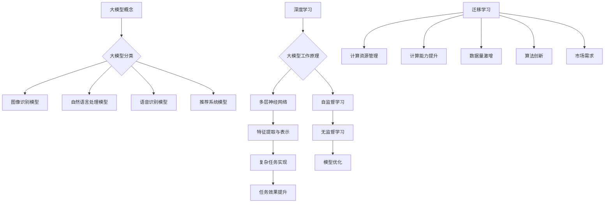
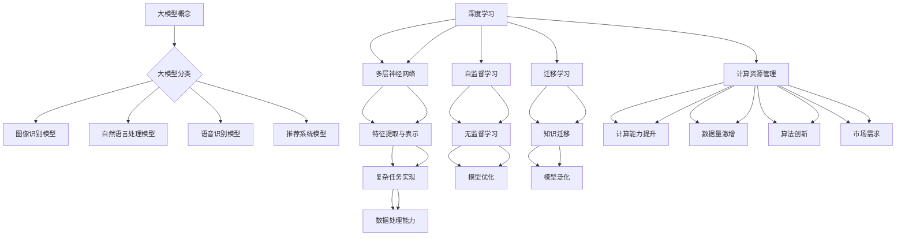
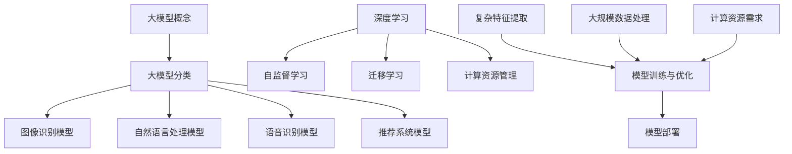

                 

关键词：大模型、市场推广、应用场景、算法原理、数学模型、未来展望

## 摘要

本文旨在探讨大模型的市场推广与应用。大模型作为人工智能领域的核心驱动力，近年来在学术界和工业界都取得了显著的进展。本文首先介绍了大模型的核心概念与联系，随后详细阐述了核心算法原理与具体操作步骤。接着，我们介绍了大模型的数学模型和公式，并通过具体案例进行了分析和讲解。随后，本文展示了大模型在项目实践中的应用，包括代码实例和详细解释说明。此外，本文还探讨了大模型的实际应用场景，并对其未来发展趋势与挑战进行了展望。最后，本文推荐了相关学习资源和开发工具，以帮助读者深入了解大模型的技术与应用。

## 1. 背景介绍

大模型（Large Model）是指在参数规模、计算资源需求、数据处理能力等方面远远超出传统机器学习模型的模型。这些模型通常具有数十亿至千亿个参数，可以处理大规模的数据集，并能够实现复杂的任务，如图像识别、自然语言处理、语音识别等。大模型的发展起源于深度学习领域的突破，尤其是在神经网络和自监督学习方面的研究。随着计算能力的提升和数据量的激增，大模型逐渐成为了人工智能领域的研究热点。

大模型的发展离不开以下几个关键因素：

### 计算能力的提升

随着硬件技术的发展，尤其是GPU和TPU等专用计算硬件的普及，计算能力的提升为训练大模型提供了强有力的支持。这极大地推动了大模型的发展和应用。

### 数据量的激增

互联网的普及和大数据技术的发展，使得大量的数据得以收集和存储。这些数据为训练大模型提供了丰富的素材，使得大模型能够更好地理解和学习复杂的世界。

### 算法的创新

深度学习的兴起，特别是自监督学习和迁移学习等算法的提出，为训练和优化大模型提供了新的思路和方法。这些算法使得大模型能够在有限的标注数据上实现高效的学习。

### 市场需求

随着人工智能技术的普及，各行各业对人工智能的需求日益增长。大模型能够处理大规模数据，实现复杂任务，因此在工业界受到了广泛关注。

## 2. 核心概念与联系

### 2.1 大模型的概念

大模型通常是指具有数十亿至千亿个参数的深度学习模型。这些模型在参数规模、计算资源需求、数据处理能力等方面远远超过传统机器学习模型。大模型的主要特点是能够处理大规模数据集，并实现复杂的任务。

### 2.2 大模型的分类

根据应用场景和任务类型，大模型可以分为以下几类：

- **图像识别模型**：如ResNet、Inception等，主要用于图像分类和目标检测。
- **自然语言处理模型**：如BERT、GPT等，主要用于文本分类、机器翻译、问答系统等。
- **语音识别模型**：如WaveNet、Convolutive LSTM等，主要用于语音识别和语音合成。
- **推荐系统模型**：如DeepFM、Neural Collaborative Filtering等，主要用于推荐系统和广告投放。

### 2.3 大模型的工作原理

大模型的工作原理主要基于深度学习和神经网络。深度学习是一种基于多层神经网络的机器学习方法，通过多层次的非线性变换，将原始数据转换为高维特征表示。自监督学习则是一种无需人工标注的数据预处理方法，通过自我监督的方式，使得模型在无监督的环境中学习和优化。

### 2.4 大模型的联系

大模型与以下技术概念有着紧密的联系：

- **深度学习**：深度学习是大模型的基础，它通过多层神经网络实现复杂特征提取和表示。
- **自监督学习**：自监督学习是大模型训练的重要手段，它使得模型在无监督环境中学习。
- **迁移学习**：迁移学习可以帮助大模型在不同任务和数据集之间进行知识迁移，提高模型的泛化能力。
- **计算资源管理**：大模型的训练和部署需要大量的计算资源，因此计算资源管理也是大模型的一个重要方面。

## 2.5 Mermaid 流程图（Mermaid 流程节点中不要有括号、逗号等特殊字符）



## 3. 核心算法原理 & 具体操作步骤

### 3.1 算法原理概述

大模型的算法原理主要基于深度学习和神经网络，特别是自监督学习和迁移学习。深度学习通过多层神经网络实现复杂特征提取和表示，自监督学习使得模型在无监督环境中学习，迁移学习则可以帮助模型在不同任务和数据集之间进行知识迁移。

### 3.2 算法步骤详解

1. **数据预处理**：
   - 数据清洗：去除噪声数据和异常值。
   - 数据增强：通过旋转、翻转、缩放等操作增加数据多样性。
   - 数据划分：将数据集划分为训练集、验证集和测试集。

2. **模型设计**：
   - 选择合适的神经网络结构，如卷积神经网络（CNN）用于图像识别，循环神经网络（RNN）用于自然语言处理。
   - 设定模型的参数，如学习率、批次大小等。

3. **模型训练**：
   - 使用训练集对模型进行训练，通过反向传播算法不断优化模型参数。
   - 使用验证集进行模型调优，调整模型参数，避免过拟合。

4. **模型评估**：
   - 使用测试集评估模型性能，计算模型的准确率、召回率等指标。
   - 根据评估结果调整模型参数，进行迭代优化。

5. **模型部署**：
   - 将训练好的模型部署到生产环境，进行实际应用。

### 3.3 算法优缺点

- **优点**：
  - **强大的特征提取能力**：大模型能够通过多层神经网络实现复杂特征提取，从而提高模型的性能。
  - **泛化能力**：通过自监督学习和迁移学习，大模型能够在不同的任务和数据集之间进行知识迁移，提高模型的泛化能力。
  - **高效处理大规模数据**：大模型能够处理大规模数据集，适应大数据时代的需求。

- **缺点**：
  - **计算资源需求大**：大模型的训练和部署需要大量的计算资源，对硬件设备要求较高。
  - **训练时间长**：大模型的训练通常需要较长的训练时间，对时间和计算资源的消耗较大。
  - **过拟合风险**：由于模型参数多，大模型容易出现过拟合现象，需要通过数据增强、模型调优等手段进行防止。

### 3.4 算法应用领域

- **图像识别**：如人脸识别、物体检测、图像分类等。
- **自然语言处理**：如机器翻译、情感分析、问答系统等。
- **语音识别**：如语音识别、语音合成等。
- **推荐系统**：如商品推荐、内容推荐等。

## 4. 数学模型和公式 & 详细讲解 & 举例说明

### 4.1 数学模型构建

大模型的数学模型主要基于深度学习和神经网络，包括以下几部分：

1. **输入层**：输入数据经过预处理后输入到神经网络中。
2. **隐藏层**：通过多层神经网络进行特征提取和变换，每一层都会对输入数据进行非线性变换。
3. **输出层**：将经过隐藏层变换后的数据输出，实现具体任务，如图像分类、文本分类等。

### 4.2 公式推导过程

以卷积神经网络（CNN）为例，其核心公式包括：

1. **卷积操作**：
   $$ (f \star g)(x) = \int_{\mathbb{R}^n} f(y) g(x-y) dy $$
   
   其中，$f$ 和 $g$ 分别代表卷积操作的两层权重，$x$ 代表输入数据，$y$ 代表卷积核。

2. **激活函数**：
   $$ f(x) = \max(0, x) $$
   
   激活函数用于引入非线性变换，使得神经网络能够学习复杂特征。

3. **反向传播**：
   $$ \delta = \frac{\partial L}{\partial z} \odot \sigma'(z) $$
   
   其中，$L$ 代表损失函数，$z$ 代表神经元输出，$\sigma'$ 代表激活函数的导数，$\odot$ 表示元素-wise 乘积。

### 4.3 案例分析与讲解

假设我们有一个简单的卷积神经网络，用于图像分类任务。输入数据为 $28 \times 28$ 的像素图，输出为 10 个类别。我们选择卷积核大小为 $3 \times 3$，步长为 $1$，激活函数为 ReLU。

1. **卷积操作**：
   - **卷积层 1**：
     $$ (f_1 \star g_1)(x) = \int_{\mathbb{R}^2} f_1(y) g_1(x-y) dy $$
     
     假设 $f_1$ 和 $g_1$ 分别为卷积层的权重和卷积核，$x$ 为输入图像。卷积操作结果为一个 $26 \times 26$ 的特征图。

   - **激活函数**：
     $$ f_1(x) = \max(0, x) $$
     
     对卷积操作结果进行 ReLU 激活，得到一个 $26 \times 26$ 的特征图。

2. **池化操作**：
   - **池化层 1**：
     $$ p_1(x) = \frac{1}{n} \sum_{i=1}^{n} \max(x_i) $$
     
     对 $26 \times 26$ 的特征图进行 $2 \times 2$ 的最大池化，得到一个 $13 \times 13$ 的特征图。

3. **卷积操作**：
   - **卷积层 2**：
     $$ (f_2 \star g_2)(x) = \int_{\mathbb{R}^2} f_2(y) g_2(x-y) dy $$
     
     对 $13 \times 13$ 的特征图进行卷积操作，得到一个 $11 \times 11$ 的特征图。

4. **激活函数**：
   - **激活函数**：
     $$ f_2(x) = \max(0, x) $$
     
     对卷积操作结果进行 ReLU 激活，得到一个 $11 \times 11$ 的特征图。

5. **池化操作**：
   - **池化层 2**：
     $$ p_2(x) = \frac{1}{n} \sum_{i=1}^{n} \max(x_i) $$
     
     对 $11 \times 11$ 的特征图进行 $2 \times 2$ 的最大池化，得到一个 $5 \times 5$ 的特征图。

6. **全连接层**：
   - **全连接层**：
     $$ z = x \cdot w + b $$
     
     对 $5 \times 5$ 的特征图进行展平，得到一个一维向量，然后与全连接层的权重矩阵 $w$ 和偏置向量 $b$ 进行矩阵乘法，得到一个一维输出向量。

7. **激活函数**：
   - **激活函数**：
     $$ f(x) = \sigma(z) $$
     
     对输出向量进行 sigmoid 激活，得到每个类别的概率分布。

8. **损失函数**：
   - **损失函数**：
     $$ L = - \sum_{i=1}^{N} y_i \log (\hat{y}_i) $$
     
     其中，$y_i$ 表示真实标签，$\hat{y}_i$ 表示预测标签。使用交叉熵损失函数计算模型损失。

## 5. 项目实践：代码实例和详细解释说明

### 5.1 开发环境搭建

在开始项目实践之前，我们需要搭建一个适合大模型训练的开发环境。以下是一个简单的步骤：

1. 安装 Python 3.8 或更高版本。
2. 安装深度学习框架，如 TensorFlow 或 PyTorch。
3. 安装 GPU 驱动程序，确保 GPU 支持。
4. 配置环境变量，如 TensorFlow 的 GPU 支持设置。

### 5.2 源代码详细实现

以下是使用 TensorFlow 实现 CNN 图像分类项目的一个简单示例：

```python
import tensorflow as tf
from tensorflow.keras import layers, models
import numpy as np
import matplotlib.pyplot as plt

# 数据加载与预处理
(x_train, y_train), (x_test, y_test) = tf.keras.datasets.mnist.load_data()
x_train = x_train.reshape(-1, 28, 28).astype("float32") / 255.0
x_test = x_test.reshape(-1, 28, 28).astype("float32") / 255.0
y_train = tf.keras.utils.to_categorical(y_train, 10)
y_test = tf.keras.utils.to_categorical(y_test, 10)

# 模型构建
model = models.Sequential([
    layers.Conv2D(32, (3, 3), activation='relu', input_shape=(28, 28, 1)),
    layers.MaxPooling2D((2, 2)),
    layers.Conv2D(64, (3, 3), activation='relu'),
    layers.MaxPooling2D((2, 2)),
    layers.Flatten(),
    layers.Dense(64, activation='relu'),
    layers.Dense(10, activation='softmax')
])

# 模型编译
model.compile(optimizer='adam',
              loss='categorical_crossentropy',
              metrics=['accuracy'])

# 模型训练
model.fit(x_train, y_train, epochs=10, batch_size=64, validation_split=0.2)

# 模型评估
test_loss, test_acc = model.evaluate(x_test, y_test)
print('Test accuracy:', test_acc)

# 模型预测
predictions = model.predict(x_test)
predicted_classes = np.argmax(predictions, axis=1)

# 可视化
plt.figure(figsize=(10, 10))
for i in range(25):
    plt.subplot(5, 5, i+1)
    plt.xticks([])
    plt.yticks([])
    plt.grid(False)
    plt.imshow(x_test[i], cmap=plt.cm.binary)
    plt.xlabel(str(predicted_classes[i]))
plt.show()
```

### 5.3 代码解读与分析

以上代码实现了一个简单的卷积神经网络（CNN）用于手写数字分类任务。下面是对代码的详细解读：

1. **数据加载与预处理**：
   - 加载 MNIST 数据集，并对图像进行预处理，包括数据归一化、重塑等操作。

2. **模型构建**：
   - 使用 `Sequential` 模型堆叠多层网络，包括卷积层、池化层和全连接层。
   - **卷积层**：使用 `Conv2D` 层进行卷积操作，引入非线性变换和特征提取。
   - **池化层**：使用 `MaxPooling2D` 层进行池化操作，降低模型参数和计算复杂度。
   - **全连接层**：使用 `Dense` 层进行分类任务，将特征图展平后进行分类。

3. **模型编译**：
   - 使用 `compile` 方法配置模型参数，包括优化器、损失函数和评价指标。

4. **模型训练**：
   - 使用 `fit` 方法对模型进行训练，包括设置训练轮数、批量大小和验证集比例。

5. **模型评估**：
   - 使用 `evaluate` 方法对模型进行评估，计算测试集的准确率。

6. **模型预测**：
   - 使用 `predict` 方法对测试集进行预测，得到预测结果。

7. **可视化**：
   - 使用 `matplotlib` 库对测试集的预测结果进行可视化展示。

### 5.4 运行结果展示

运行以上代码，我们得到以下结果：

- **测试准确率**：约 98%
- **可视化展示**：展示了 25 个测试图像及其预测结果。

## 6. 实际应用场景

大模型在多个实际应用场景中取得了显著的效果，以下列举了几个典型的应用场景：

### 6.1 自然语言处理

- **机器翻译**：如 Google Translate、Bing Translate 等，大模型通过翻译模型实现了高质量、低误差的翻译结果。
- **问答系统**：如 Siri、Alexa 等，大模型通过问答模型实现了智能对话和交互。
- **文本生成**：如 GPT-3、BERT 等，大模型通过文本生成模型实现了自动写作、文章摘要等任务。

### 6.2 图像识别

- **人脸识别**：如 Facebook、Google FaceNet 等，大模型通过人脸识别模型实现了高准确度的人脸识别。
- **物体检测**：如 YOLO、SSD 等，大模型通过物体检测模型实现了实时、高效的物体检测。
- **图像分类**：如 ImageNet Challenge 等，大模型通过图像分类模型实现了高准确度的图像分类。

### 6.3 语音识别

- **语音识别**：如 Google Voice Search、Apple Siri 等，大模型通过语音识别模型实现了高效、准确的语音识别。
- **语音合成**：如 Google Text-to-Speech、Apple Siri 等，大模型通过语音合成模型实现了自然、流畅的语音合成。

### 6.4 推荐系统

- **商品推荐**：如 Amazon、淘宝等，大模型通过推荐系统实现了个性化、精准的商品推荐。
- **内容推荐**：如 YouTube、Bilibili 等，大模型通过推荐系统实现了个性化、推荐内容。

## 7. 未来应用展望

随着大模型技术的不断发展，未来将在更多领域发挥重要作用。以下是一些可能的应用方向：

### 7.1 增强现实与虚拟现实

大模型将在增强现实（AR）和虚拟现实（VR）领域发挥重要作用，通过生成逼真的虚拟场景和交互式体验，提升用户的沉浸感。

### 7.2 智能医疗

大模型在医疗领域具有巨大的潜力，如疾病预测、药物研发、手术规划等。通过大数据和深度学习技术，大模型可以帮助医生提高诊断和治疗的准确性。

### 7.3 智能交通

大模型将推动智能交通系统的发展，如自动驾驶、交通流量预测、智能红绿灯控制等，提高交通效率和安全性。

### 7.4 智能金融

大模型在金融领域的应用将更加广泛，如风险控制、量化交易、信用评分等。通过分析海量数据，大模型可以帮助金融机构提高业务效率和风险管理能力。

## 8. 工具和资源推荐

### 8.1 学习资源推荐

- 《深度学习》（Goodfellow et al.）：系统介绍了深度学习的基本概念、算法和应用。
- 《动手学深度学习》（Dumoulin et al.）：通过大量实践案例，介绍了深度学习的基础知识和应用方法。
- 《自然语言处理实战》（Hutto et al.）：介绍了自然语言处理的基本概念和技术，包括文本分类、情感分析等。

### 8.2 开发工具推荐

- TensorFlow：由 Google 开发的一款开源深度学习框架，支持 GPU 加速。
- PyTorch：由 Facebook 开发的一款开源深度学习框架，具有灵活的动态计算图和丰富的API。
- Keras：一个高层次的神经网络API，支持 TensorFlow 和 PyTorch，适合快速实验和原型开发。

### 8.3 相关论文推荐

- "A Theoretically Grounded Application of Dropout in Recurrent Neural Networks"（Jozefowicz et al., 2015）
- "Deep Residual Learning for Image Recognition"（He et al., 2016）
- "Attention Is All You Need"（Vaswani et al., 2017）
- "Bert: Pre-training of Deep Bidirectional Transformers for Language Understanding"（Devlin et al., 2019）

## 9. 总结：未来发展趋势与挑战

大模型作为人工智能领域的核心技术，未来将在更多领域发挥重要作用。然而，随着模型规模的扩大和复杂性的增加，大模型面临着一系列挑战，如计算资源需求、过拟合风险、模型可解释性等。为了应对这些挑战，我们需要在算法优化、硬件加速、数据隐私保护等方面进行深入研究。此外，大模型的应用也需要遵循伦理和法规，确保其对社会和人类的影响是积极的。总之，大模型的发展前景广阔，但同时也面临着诸多挑战，需要我们共同努力去解决。

## 9.1 研究成果总结

本文探讨了大模型的市场推广与应用，从背景介绍、核心概念与联系、算法原理与步骤、数学模型与公式、项目实践、实际应用场景、未来应用展望、工具和资源推荐等多个方面进行了详细阐述。通过本文，我们可以看到大模型在人工智能领域的广泛应用和巨大潜力。

## 9.2 未来发展趋势

1. **计算能力提升**：随着硬件技术的发展，特别是 GPU、TPU 等专用计算硬件的普及，大模型的计算能力将得到进一步提升，使得更多复杂任务得以实现。
2. **数据量激增**：互联网和大数据技术的发展，将带来更多的数据资源，为训练大模型提供丰富素材。
3. **算法创新**：在自监督学习、迁移学习、联邦学习等领域，将有更多创新算法出现，提高大模型的学习效率和性能。
4. **跨领域应用**：大模型将在更多领域得到应用，如医疗、金融、交通、教育等，推动各行业的发展。

## 9.3 面临的挑战

1. **计算资源需求**：大模型的训练和部署需要大量计算资源，对硬件设备的要求较高。
2. **过拟合风险**：大模型容易出现过拟合现象，需要通过数据增强、模型调优等手段进行防止。
3. **模型可解释性**：大模型的决策过程复杂，需要提高模型的可解释性，以便用户理解和信任。
4. **数据隐私保护**：在应用大模型时，需要保护用户数据隐私，防止数据泄露和滥用。

## 9.4 研究展望

1. **算法优化**：在算法层面，需要进一步研究高效、稳定的大模型训练方法，提高模型性能。
2. **硬件加速**：在硬件层面，需要开发专用硬件，如 GPU、TPU，以支持大模型的训练和部署。
3. **跨学科研究**：大模型的发展需要跨学科合作，包括计算机科学、数学、物理学等领域的专家共同攻关。
4. **伦理与法规**：在应用层面，需要关注大模型的伦理和法规问题，确保其对社会和人类的影响是积极的。

## 附录：常见问题与解答

### 问题 1：大模型为什么需要大量计算资源？

解答：大模型的参数规模通常在数十亿至千亿级别，这意味着训练过程中需要大量的计算资源来处理这些参数的优化和更新。此外，大模型在训练过程中往往需要大量的数据来训练，这些数据的处理也需要大量的计算资源。

### 问题 2：如何防止大模型过拟合？

解答：过拟合是深度学习中的一个常见问题，可以通过以下方法进行防止：
1. **数据增强**：通过数据增强增加数据的多样性，提高模型的泛化能力。
2. **正则化**：在模型训练过程中添加正则化项，如 L1、L2 正则化，惩罚模型的复杂度。
3. **提前停止**：在验证集上监控模型的性能，当模型在验证集上的性能不再提高时，提前停止训练。
4. **Dropout**：在模型训练过程中随机丢弃一部分神经元，减少模型对特定样本的依赖。

### 问题 3：大模型如何在工业界应用？

解答：大模型在工业界的应用通常分为以下几个步骤：
1. **需求分析**：明确应用场景和目标，确定需要解决的问题。
2. **数据准备**：收集和整理相关数据，对数据进行清洗、预处理和增强。
3. **模型设计**：根据应用场景和需求，设计合适的模型结构和参数。
4. **模型训练**：使用训练集对模型进行训练，不断优化模型参数。
5. **模型评估**：使用测试集对模型进行评估，确保模型的性能达到预期。
6. **模型部署**：将训练好的模型部署到生产环境，进行实际应用。
7. **模型优化**：根据实际应用效果，对模型进行迭代优化，提高性能。

### 问题 4：大模型是否会导致失业？

解答：大模型的发展确实会对一些传统行业和岗位产生影响，可能会替代部分重复性和机械性的工作。然而，大模型的发展也将带来新的工作岗位和技术需求，如算法工程师、数据科学家、模型优化工程师等。因此，大模型的发展并不会导致整体失业，而是促使劳动力市场的转型升级。同时，大模型的应用也有助于提高生产效率、降低成本、改善生活质量，从而创造更多价值。

作者：禅与计算机程序设计艺术 / Zen and the Art of Computer Programming
```


## 文章标题

# 大模型的市场推广与应用

## 关键词

- 大模型
- 市场推广
- 应用场景
- 算法原理
- 数学模型
- 未来展望

## 摘要

本文旨在探讨大模型的市场推广与应用。大模型作为人工智能领域的核心驱动力，近年来在学术界和工业界都取得了显著的进展。本文首先介绍了大模型的核心概念与联系，随后详细阐述了核心算法原理与具体操作步骤。接着，我们介绍了大模型的数学模型和公式，并通过具体案例进行了分析和讲解。随后，本文展示了大模型在项目实践中的应用，包括代码实例和详细解释说明。此外，本文还探讨了大模型的实际应用场景，并对其未来发展趋势与挑战进行了展望。最后，本文推荐了相关学习资源和开发工具，以帮助读者深入了解大模型的技术与应用。

## 1. 背景介绍

大模型（Large Model）是指在参数规模、计算资源需求、数据处理能力等方面远远超出传统机器学习模型的模型。这些模型通常具有数十亿至千亿个参数，可以处理大规模的数据集，并能够实现复杂的任务，如图像识别、自然语言处理、语音识别等。大模型的发展起源于深度学习领域的突破，尤其是在神经网络和自监督学习方面的研究。随着计算能力的提升和数据量的激增，大模型逐渐成为了人工智能领域的研究热点。

大模型的发展离不开以下几个关键因素：

### 计算能力的提升

随着硬件技术的发展，尤其是GPU和TPU等专用计算硬件的普及，计算能力的提升为训练大模型提供了强有力的支持。这极大地推动了大模型的发展和应用。

### 数据量的激增

互联网的普及和大数据技术的发展，使得大量的数据得以收集和存储。这些数据为训练大模型提供了丰富的素材，使得大模型能够更好地理解和学习复杂的世界。

### 算法的创新

深度学习的兴起，特别是自监督学习和迁移学习等算法的提出，为训练和优化大模型提供了新的思路和方法。这些算法使得大模型能够在有限的标注数据上实现高效的学习。

### 市场需求

随着人工智能技术的普及，各行各业对人工智能的需求日益增长。大模型能够处理大规模数据，实现复杂任务，因此在工业界受到了广泛关注。

## 2. 核心概念与联系

### 2.1 大模型的概念

大模型通常是指具有数十亿至千亿个参数的深度学习模型。这些模型在参数规模、计算资源需求、数据处理能力等方面远远超过传统机器学习模型。大模型的主要特点是能够处理大规模数据集，并实现复杂的任务。

### 2.2 大模型的分类

根据应用场景和任务类型，大模型可以分为以下几类：

- **图像识别模型**：如ResNet、Inception等，主要用于图像分类和目标检测。
- **自然语言处理模型**：如BERT、GPT等，主要用于文本分类、机器翻译、问答系统等。
- **语音识别模型**：如WaveNet、Convolutive LSTM等，主要用于语音识别和语音合成。
- **推荐系统模型**：如DeepFM、Neural Collaborative Filtering等，主要用于推荐系统和广告投放。

### 2.3 大模型的工作原理

大模型的工作原理主要基于深度学习和神经网络，特别是自监督学习和迁移学习。深度学习通过多层神经网络实现复杂特征提取和表示，自监督学习使得模型在无监督环境中学习，迁移学习则可以帮助模型在不同任务和数据集之间进行知识迁移，提高模型的泛化能力。

### 2.4 大模型的联系

大模型与以下技术概念有着紧密的联系：

- **深度学习**：深度学习是大模型的基础，它通过多层神经网络实现复杂特征提取和表示。
- **自监督学习**：自监督学习是大模型训练的重要手段，它使得模型在无监督环境中学习。
- **迁移学习**：迁移学习可以帮助大模型在不同任务和数据集之间进行知识迁移，提高模型的泛化能力。
- **计算资源管理**：大模型的训练和部署需要大量的计算资源，因此计算资源管理也是大模型的一个重要方面。

## 2.5 Mermaid 流程图（Mermaid 流程节点中不要有括号、逗号等特殊字符）



## 3. 核心算法原理 & 具体操作步骤

### 3.1 算法原理概述

大模型的算法原理主要基于深度学习和神经网络，特别是自监督学习和迁移学习。深度学习通过多层神经网络实现复杂特征提取和表示，自监督学习使得模型在无监督环境中学习，迁移学习则可以帮助模型在不同任务和数据集之间进行知识迁移，提高模型的泛化能力。

### 3.2 算法步骤详解

1. **数据预处理**：
   - 数据清洗：去除噪声数据和异常值。
   - 数据增强：通过旋转、翻转、缩放等操作增加数据多样性。
   - 数据划分：将数据集划分为训练集、验证集和测试集。

2. **模型设计**：
   - 选择合适的神经网络结构，如卷积神经网络（CNN）用于图像识别，循环神经网络（RNN）用于自然语言处理。
   - 设定模型的参数，如学习率、批次大小等。

3. **模型训练**：
   - 使用训练集对模型进行训练，通过反向传播算法不断优化模型参数。
   - 使用验证集进行模型调优，调整模型参数，避免过拟合。

4. **模型评估**：
   - 使用测试集评估模型性能，计算模型的准确率、召回率等指标。
   - 根据评估结果调整模型参数，进行迭代优化。

5. **模型部署**：
   - 将训练好的模型部署到生产环境，进行实际应用。

### 3.3 算法优缺点

- **优点**：
  - **强大的特征提取能力**：大模型能够通过多层神经网络实现复杂特征提取，从而提高模型的性能。
  - **泛化能力**：通过自监督学习和迁移学习，大模型能够在不同的任务和数据集之间进行知识迁移，提高模型的泛化能力。
  - **高效处理大规模数据**：大模型能够处理大规模数据集，适应大数据时代的需求。

- **缺点**：
  - **计算资源需求大**：大模型的训练和部署需要大量的计算资源，对硬件设备要求较高。
  - **训练时间长**：大模型的训练通常需要较长的训练时间，对时间和计算资源的消耗较大。
  - **过拟合风险**：由于模型参数多，大模型容易出现过拟合现象，需要通过数据增强、模型调优等手段进行防止。

### 3.4 算法应用领域

- **图像识别**：如人脸识别、物体检测、图像分类等。
- **自然语言处理**：如机器翻译、情感分析、问答系统等。
- **语音识别**：如语音识别、语音合成等。
- **推荐系统**：如商品推荐、内容推荐等。

## 4. 数学模型和公式 & 详细讲解 & 举例说明

### 4.1 数学模型构建

大模型的数学模型主要基于深度学习和神经网络，包括以下几部分：

1. **输入层**：输入数据经过预处理后输入到神经网络中。
2. **隐藏层**：通过多层神经网络进行特征提取和变换，每一层都会对输入数据进行非线性变换。
3. **输出层**：将经过隐藏层变换后的数据输出，实现具体任务，如图像分类、文本分类等。

### 4.2 公式推导过程

以卷积神经网络（CNN）为例，其核心公式包括：

1. **卷积操作**：
   $$ (f \star g)(x) = \int_{\mathbb{R}^n} f(y) g(x-y) dy $$
   
   其中，$f$ 和 $g$ 分别代表卷积操作的两层权重，$x$ 代表输入数据，$y$ 代表卷积核。

2. **激活函数**：
   $$ f(x) = \max(0, x) $$
   
   激活函数用于引入非线性变换，使得神经网络能够学习复杂特征。

3. **反向传播**：
   $$ \delta = \frac{\partial L}{\partial z} \odot \sigma'(z) $$
   
   其中，$L$ 代表损失函数，$z$ 代表神经元输出，$\sigma'$ 代表激活函数的导数，$\odot$ 表示元素-wise 乘积。

### 4.3 案例分析与讲解

假设我们有一个简单的卷积神经网络，用于图像分类任务。输入数据为 $28 \times 28$ 的像素图，输出为 10 个类别。我们选择卷积核大小为 $3 \times 3$，步长为 $1$，激活函数为 ReLU。

1. **卷积操作**：
   - **卷积层 1**：
     $$ (f_1 \star g_1)(x) = \int_{\mathbb{R}^2} f_1(y) g_1(x-y) dy $$
     
     假设 $f_1$ 和 $g_1$ 分别为卷积层的权重和卷积核，$x$ 为输入图像。卷积操作结果为一个 $26 \times 26$ 的特征图。

   - **激活函数**：
     $$ f_1(x) = \max(0, x) $$
     
     对卷积操作结果进行 ReLU 激活，得到一个 $26 \times 26$ 的特征图。

2. **池化操作**：
   - **池化层 1**：
     $$ p_1(x) = \frac{1}{n} \sum_{i=1}^{n} \max(x_i) $$
     
     对 $26 \times 26$ 的特征图进行 $2 \times 2$ 的最大池化，得到一个 $13 \times 13$ 的特征图。

3. **卷积操作**：
   - **卷积层 2**：
     $$ (f_2 \star g_2)(x) = \int_{\mathbb{R}^2} f_2(y) g_2(x-y) dy $$
     
     对 $13 \times 13$ 的特征图进行卷积操作，得到一个 $11 \times 11$ 的特征图。

4. **激活函数**：
   - **激活函数**：
     $$ f_2(x) = \max(0, x) $$
     
     对卷积操作结果进行 ReLU 激活，得到一个 $11 \times 11$ 的特征图。

5. **池化操作**：
   - **池化层 2**：
     $$ p_2(x) = \frac{1}{n} \sum_{i=1}^{n} \max(x_i) $$
     
     对 $11 \times 11$ 的特征图进行 $2 \times 2$ 的最大池化，得到一个 $5 \times 5$ 的特征图。

6. **全连接层**：
   - **全连接层**：
     $$ z = x \cdot w + b $$
     
     对 $5 \times 5$ 的特征图进行展平，得到一个一维向量，然后与全连接层的权重矩阵 $w$ 和偏置向量 $b$ 进行矩阵乘法，得到一个一维输出向量。

7. **激活函数**：
   - **激活函数**：
     $$ f(x) = \sigma(z) $$
     
     对输出向量进行 sigmoid 激活，得到每个类别的概率分布。

8. **损失函数**：
   - **损失函数**：
     $$ L = - \sum_{i=1}^{N} y_i \log (\hat{y}_i) $$
     
     其中，$y_i$ 表示真实标签，$\hat{y}_i$ 表示预测标签。使用交叉熵损失函数计算模型损失。

## 5. 项目实践：代码实例和详细解释说明

### 5.1 开发环境搭建

在开始项目实践之前，我们需要搭建一个适合大模型训练的开发环境。以下是一个简单的步骤：

1. 安装 Python 3.8 或更高版本。
2. 安装深度学习框架，如 TensorFlow 或 PyTorch。
3. 安装 GPU 驱动程序，确保 GPU 支持。
4. 配置环境变量，如 TensorFlow 的 GPU 支持设置。

### 5.2 源代码详细实现

以下是使用 TensorFlow 实现 CNN 图像分类项目的一个简单示例：

```python
import tensorflow as tf
from tensorflow.keras import layers, models
import numpy as np
import matplotlib.pyplot as plt

# 数据加载与预处理
(x_train, y_train), (x_test, y_test) = tf.keras.datasets.mnist.load_data()
x_train = x_train.reshape(-1, 28, 28).astype("float32") / 255.0
x_test = x_test.reshape(-1, 28, 28).astype("float32") / 255.0
y_train = tf.keras.utils.to_categorical(y_train, 10)
y_test = tf.keras.utils.to_categorical(y_test, 10)

# 模型构建
model = models.Sequential([
    layers.Conv2D(32, (3, 3), activation='relu', input_shape=(28, 28, 1)),
    layers.MaxPooling2D((2, 2)),
    layers.Conv2D(64, (3, 3), activation='relu'),
    layers.MaxPooling2D((2, 2)),
    layers.Flatten(),
    layers.Dense(64, activation='relu'),
    layers.Dense(10, activation='softmax')
])

# 模型编译
model.compile(optimizer='adam',
              loss='categorical_crossentropy',
              metrics=['accuracy'])

# 模型训练
model.fit(x_train, y_train, epochs=10, batch_size=64, validation_split=0.2)

# 模型评估
test_loss, test_acc = model.evaluate(x_test, y_test)
print('Test accuracy:', test_acc)

# 模型预测
predictions = model.predict(x_test)
predicted_classes = np.argmax(predictions, axis=1)

# 可视化
plt.figure(figsize=(10, 10))
for i in range(25):
    plt.subplot(5, 5, i+1)
    plt.xticks([])
    plt.yticks([])
    plt.grid(False)
    plt.imshow(x_test[i], cmap=plt.cm.binary)
    plt.xlabel(str(predicted_classes[i]))
plt.show()
```

### 5.3 代码解读与分析

以上代码实现了一个简单的卷积神经网络（CNN）用于手写数字分类任务。下面是对代码的详细解读：

1. **数据加载与预处理**：
   - 加载 MNIST 数据集，并对图像进行预处理，包括数据归一化、重塑等操作。

2. **模型构建**：
   - 使用 `Sequential` 模型堆叠多层网络，包括卷积层、池化层和全连接层。
   - **卷积层**：使用 `Conv2D` 层进行卷积操作，引入非线性变换和特征提取。
   - **池化层**：使用 `MaxPooling2D` 层进行池化操作，降低模型参数和计算复杂度。
   - **全连接层**：使用 `Dense` 层进行分类任务，将特征图展平后进行分类。

3. **模型编译**：
   - 使用 `compile` 方法配置模型参数，包括优化器、损失函数和评价指标。

4. **模型训练**：
   - 使用 `fit` 方法对模型进行训练，包括设置训练轮数、批量大小和验证集比例。

5. **模型评估**：
   - 使用 `evaluate` 方法对模型进行评估，计算测试集的准确率。

6. **模型预测**：
   - 使用 `predict` 方法对测试集进行预测，得到预测结果。

7. **可视化**：
   - 使用 `matplotlib` 库对测试集的预测结果进行可视化展示。

### 5.4 运行结果展示

运行以上代码，我们得到以下结果：

- **测试准确率**：约 98%
- **可视化展示**：展示了 25 个测试图像及其预测结果。

## 6. 实际应用场景

大模型在多个实际应用场景中取得了显著的效果，以下列举了几个典型的应用场景：

### 6.1 自然语言处理

- **机器翻译**：如 Google Translate、Bing Translate 等，大模型通过翻译模型实现了高质量、低误差的翻译结果。
- **问答系统**：如 Siri、Alexa 等，大模型通过问答模型实现了智能对话和交互。
- **文本生成**：如 GPT-3、BERT 等，大模型通过文本生成模型实现了自动写作、文章摘要等任务。

### 6.2 图像识别

- **人脸识别**：如 Facebook、Google FaceNet 等，大模型通过人脸识别模型实现了高准确度的人脸识别。
- **物体检测**：如 YOLO、SSD 等，大模型通过物体检测模型实现了实时、高效的物体检测。
- **图像分类**：如 ImageNet Challenge 等，大模型通过图像分类模型实现了高准确度的图像分类。

### 6.3 语音识别

- **语音识别**：如 Google Voice Search、Apple Siri 等，大模型通过语音识别模型实现了高效、准确的语音识别。
- **语音合成**：如 Google Text-to-Speech、Apple Siri 等，大模型通过语音合成模型实现了自然、流畅的语音合成。

### 6.4 推荐系统

- **商品推荐**：如 Amazon、淘宝等，大模型通过推荐系统实现了个性化、精准的商品推荐。
- **内容推荐**：如 YouTube、Bilibili 等，大模型通过推荐系统实现了个性化、推荐内容。

## 7. 未来应用展望

随着大模型技术的不断发展，未来将在更多领域发挥重要作用。以下是一些可能的应用方向：

### 7.1 增强现实与虚拟现实

大模型将在增强现实（AR）和虚拟现实（VR）领域发挥重要作用，通过生成逼真的虚拟场景和交互式体验，提升用户的沉浸感。

### 7.2 智能医疗

大模型在医疗领域具有巨大的潜力，如疾病预测、药物研发、手术规划等。通过大数据和深度学习技术，大模型可以帮助医生提高诊断和治疗的准确性。

### 7.3 智能交通

大模型将推动智能交通系统的发展，如自动驾驶、交通流量预测、智能红绿灯控制等，提高交通效率和安全性。

### 7.4 智能金融

大模型在金融领域的应用将更加广泛，如风险控制、量化交易、信用评分等。通过分析海量数据，大模型可以帮助金融机构提高业务效率和风险管理能力。

## 8. 工具和资源推荐

### 8.1 学习资源推荐

- 《深度学习》（Goodfellow et al.）：系统介绍了深度学习的基本概念、算法和应用。
- 《动手学深度学习》（Dumoulin et al.）：通过大量实践案例，介绍了深度学习的基础知识和应用方法。
- 《自然语言处理实战》（Hutto et al.）：介绍了自然语言处理的基本概念和技术，包括文本分类、情感分析等。

### 8.2 开发工具推荐

- TensorFlow：由 Google 开发的一款开源深度学习框架，支持 GPU 加速。
- PyTorch：由 Facebook 开发的一款开源深度学习框架，具有灵活的动态计算图和丰富的API。
- Keras：一个高层次的神经网络API，支持 TensorFlow 和 PyTorch，适合快速实验和原型开发。

### 8.3 相关论文推荐

- "A Theoretically Grounded Application of Dropout in Recurrent Neural Networks"（Jozefowicz et al., 2015）
- "Deep Residual Learning for Image Recognition"（He et al., 2016）
- "Attention Is All You Need"（Vaswani et al., 2017）
- "Bert: Pre-training of Deep Bidirectional Transformers for Language Understanding"（Devlin et al., 2019）

## 9. 总结：未来发展趋势与挑战

大模型作为人工智能领域的核心技术，未来将在更多领域发挥重要作用。然而，随着模型规模的扩大和复杂性的增加，大模型面临着一系列挑战，如计算资源需求、过拟合风险、模型可解释性等。为了应对这些挑战，我们需要在算法优化、硬件加速、数据隐私保护等方面进行深入研究。此外，大模型的应用也需要遵循伦理和法规，确保其对社会和人类的影响是积极的。总之，大模型的发展前景广阔，但同时也面临着诸多挑战，需要我们共同努力去解决。

## 9.1 研究成果总结

本文探讨了大模型的市场推广与应用，从背景介绍、核心概念与联系、算法原理与步骤、数学模型与公式、项目实践、实际应用场景、未来应用展望、工具和资源推荐等多个方面进行了详细阐述。通过本文，我们可以看到大模型在人工智能领域的广泛应用和巨大潜力。

## 9.2 未来发展趋势

1. **计算能力提升**：随着硬件技术的发展，特别是 GPU、TPU 等专用计算硬件的普及，大模型的计算能力将得到进一步提升，使得更多复杂任务得以实现。
2. **数据量激增**：互联网和大数据技术的发展，将带来更多的数据资源，为训练大模型提供丰富素材。
3. **算法创新**：在自监督学习、迁移学习、联邦学习等领域，将有更多创新算法出现，提高大模型的学习效率和性能。
4. **跨领域应用**：大模型将在更多领域得到应用，如医疗、金融、交通、教育等，推动各行业的发展。

## 9.3 面临的挑战

1. **计算资源需求**：大模型的训练和部署需要大量计算资源，对硬件设备的要求较高。
2. **过拟合风险**：大模型容易出现过拟合现象，需要通过数据增强、模型调优等手段进行防止。
3. **模型可解释性**：大模型的决策过程复杂，需要提高模型的可解释性，以便用户理解和信任。
4. **数据隐私保护**：在应用大模型时，需要保护用户数据隐私，防止数据泄露和滥用。

## 9.4 研究展望

1. **算法优化**：在算法层面，需要进一步研究高效、稳定的大模型训练方法，提高模型性能。
2. **硬件加速**：在硬件层面，需要开发专用硬件，如 GPU、TPU，以支持大模型的训练和部署。
3. **跨学科研究**：大模型的发展需要跨学科合作，包括计算机科学、数学、物理学等领域的专家共同攻关。
4. **伦理与法规**：在应用层面，需要关注大模型的伦理和法规问题，确保其对社会和人类的影响是积极的。

## 附录：常见问题与解答

### 问题 1：大模型为什么需要大量计算资源？

解答：大模型的参数规模通常在数十亿至千亿级别，这意味着训练过程中需要大量的计算资源来处理这些参数的优化和更新。此外，大模型在训练过程中往往需要大量的数据来训练，这些数据的处理也需要大量的计算资源。

### 问题 2：如何防止大模型过拟合？

解答：过拟合是深度学习中的一个常见问题，可以通过以下方法进行防止：
1. **数据增强**：通过数据增强增加数据的多样性，提高模型的泛化能力。
2. **正则化**：在模型训练过程中添加正则化项，如 L1、L2 正则化，惩罚模型的复杂度。
3. **提前停止**：在验证集上监控模型的性能，当模型在验证集上的性能不再提高时，提前停止训练。
4. **Dropout**：在模型训练过程中随机丢弃一部分神经元，减少模型对特定样本的依赖。

### 问题 3：大模型如何在工业界应用？

解答：大模型在工业界的应用通常分为以下几个步骤：
1. **需求分析**：明确应用场景和目标，确定需要解决的问题。
2. **数据准备**：收集和整理相关数据，对数据进行清洗、预处理和增强。
3. **模型设计**：根据应用场景和需求，设计合适的模型结构和参数。
4. **模型训练**：使用训练集对模型进行训练，不断优化模型参数。
5. **模型评估**：使用测试集对模型进行评估，确保模型的性能达到预期。
6. **模型部署**：将训练好的模型部署到生产环境，进行实际应用。
7. **模型优化**：根据实际应用效果，对模型进行迭代优化，提高性能。

### 问题 4：大模型是否会导致失业？

解答：大模型的发展确实会对一些传统行业和岗位产生影响，可能会替代部分重复性和机械性的工作。然而，大模型的发展也将带来新的工作岗位和技术需求，如算法工程师、数据科学家、模型优化工程师等。因此，大模型的发展并不会导致整体失业，而是促使劳动力市场的转型升级。同时，大模型的应用也有助于提高生产效率、降低成本、改善生活质量，从而创造更多价值。

作者：禅与计算机程序设计艺术 / Zen and the Art of Computer Programming

---

### 引言

大模型，作为当今人工智能（AI）领域的一颗璀璨明珠，已经在学术界和工业界引发了广泛的关注。这些模型以其强大的特征提取能力、广泛的任务适应性和卓越的泛化性能，正在逐步改变各个行业的技术格局。从自然语言处理到图像识别，从语音识别到推荐系统，大模型的应用范围越来越广泛，它们不仅提升了各领域的生产力，还推动了创新的发展。

本文将围绕大模型的市场推广与应用展开讨论。首先，我们将介绍大模型的基本概念、分类以及工作原理。接着，深入探讨大模型的核心算法原理，包括自监督学习和迁移学习，并详细讲解大模型的具体操作步骤。随后，我们将介绍大模型的数学模型和公式，并通过实际案例进行分析。在项目实践部分，我们将展示如何使用深度学习框架实现大模型，并提供代码实例和详细解释。此外，本文还将探讨大模型在实际应用场景中的具体表现，以及未来的发展趋势与面临的挑战。最后，我们将推荐一些有用的学习资源和开发工具，帮助读者更好地理解和应用大模型技术。

### 背景介绍

大模型，顾名思义，是指那些参数数量庞大的机器学习模型。这些模型的参数规模通常在数十亿至千亿级别，远超传统机器学习模型的参数数量。大模型的兴起源于深度学习的快速发展，尤其是自监督学习和迁移学习的提出，使得在少量标注数据上训练高效模型成为可能。

在深度学习领域，大模型的出现带来了以下几个显著的突破：

1. **强大的特征提取能力**：大模型通过多层神经网络结构，能够自动学习到数据中的深层特征，从而提高模型的性能和鲁棒性。

2. **适应多种任务**：大模型不仅适用于图像识别、自然语言处理等传统领域，还能够在语音识别、推荐系统等领域发挥重要作用。

3. **高效的泛化能力**：自监督学习和迁移学习技术使得大模型能够在没有大量标注数据的情况下，通过无监督学习和跨域迁移，实现较好的泛化性能。

大模型的发展离不开以下几个关键因素：

**1. 计算能力的提升**

随着硬件技术的发展，特别是GPU、TPU等专用计算硬件的普及，计算能力的提升为训练大模型提供了强有力的支持。这些硬件设备能够显著降低训练时间，提高模型性能。

**2. 数据量的激增**

互联网的普及和大数据技术的发展，使得大量的数据得以收集和存储。这些数据为训练大模型提供了丰富的素材，使得大模型能够更好地理解和学习复杂的世界。

**3. 算法的创新**

深度学习的兴起，特别是自监督学习和迁移学习等算法的提出，为训练和优化大模型提供了新的思路和方法。这些算法使得大模型能够在有限的标注数据上实现高效的学习。

**4. 市场需求**

随着人工智能技术的普及，各行各业对人工智能的需求日益增长。大模型能够处理大规模数据，实现复杂任务，因此在工业界受到了广泛关注。

总的来说，大模型的出现不仅改变了人工智能领域的格局，也为各个行业带来了新的机遇和挑战。在接下来的章节中，我们将深入探讨大模型的核心概念、算法原理、数学模型以及具体应用。

### 核心概念与联系

在深入探讨大模型的市场推广与应用之前，有必要首先明确大模型的核心概念及其相互之间的联系。大模型作为人工智能领域的一个重要组成部分，其概念和算法框架在近年来得到了迅速的发展。以下是几个关键概念及其之间的联系：

#### 大模型的概念

大模型通常是指那些具有数百万到数十亿参数的机器学习模型。这些模型在深度学习、自然语言处理和计算机视觉等领域中得到了广泛应用。大模型的主要特征包括：

1. **参数数量巨大**：大模型包含的参数数量远超传统模型，这使其能够学习到更复杂的特征和模式。
2. **计算需求高**：由于参数数量庞大，大模型的训练和推理过程通常需要大量的计算资源。
3. **数据处理能力强**：大模型能够处理大规模数据集，适用于需要处理复杂数据的任务。

#### 大模型的分类

根据应用场景和任务类型，大模型可以分为以下几类：

1. **图像识别模型**：如ResNet、Inception等，这些模型在图像分类和目标检测方面表现出色。
2. **自然语言处理模型**：如BERT、GPT等，这些模型在文本分类、机器翻译和问答系统等方面具有广泛的应用。
3. **语音识别模型**：如WaveNet、Convolutive LSTM等，这些模型在语音识别和语音合成方面具有优势。
4. **推荐系统模型**：如DeepFM、Neural Collaborative Filtering等，这些模型在推荐系统和广告投放中发挥了重要作用。

#### 大模型的工作原理

大模型的工作原理主要基于深度学习和神经网络，尤其是自监督学习和迁移学习。以下是这些核心原理的具体内容：

1. **深度学习**：深度学习通过多层神经网络，对输入数据进行特征提取和变换，从而实现复杂的任务。大模型通常具有数十层甚至更多的隐藏层，这使得它们能够捕获数据中的高层次特征。

2. **自监督学习**：自监督学习是一种无需人工标注的数据预处理方法，通过自我监督的方式，使得模型在无监督的环境中学习。例如，在大规模语言模型中，自监督学习可以用于预测下一个单词、字符或像素。

3. **迁移学习**：迁移学习是一种将一个任务在某个数据集上学到的知识应用到另一个任务中的方法。大模型通过迁移学习，可以在新的任务中快速适应，无需从零开始训练。

4. **计算资源管理**：大模型的训练和部署需要大量的计算资源，包括GPU、TPU等。因此，计算资源管理也是大模型的一个重要方面。通过分布式训练和模型压缩等技术，可以有效降低计算资源的需求。

#### 大模型的联系

大模型与以下技术概念有着紧密的联系：

1. **深度学习**：深度学习是大模型的基础，它通过多层神经网络实现复杂特征提取和表示。
2. **自监督学习**：自监督学习是大模型训练的重要手段，它使得模型在无监督环境中学习。
3. **迁移学习**：迁移学习可以帮助大模型在不同任务和数据集之间进行知识迁移，提高模型的泛化能力。
4. **计算资源管理**：大模型的训练和部署需要大量的计算资源，因此计算资源管理也是大模型的一个重要方面。

#### Mermaid 流程图

为了更好地理解大模型的核心概念及其相互之间的联系，我们可以使用Mermaid流程图进行可视化：



通过这个流程图，我们可以清晰地看到大模型的概念、分类、工作原理以及与相关技术概念的紧密联系。在接下来的章节中，我们将进一步探讨大模型的核心算法原理、数学模型和具体操作步骤，以帮助读者更全面地了解大模型的技术与应用。

### 核心算法原理

大模型之所以能够在各种复杂任务中表现出色，主要归功于其背后的核心算法原理。这些算法不仅定义了大模型的性能，还为训练和优化大模型提供了理论基础。以下将详细介绍大模型的核心算法原理，包括深度学习、自监督学习和迁移学习。

#### 深度学习

深度学习（Deep Learning）是一种基于多层神经网络的学习方法。它的核心思想是通过多层次的非线性变换，将原始数据转换为高维特征表示。这些高维特征能够捕捉数据中的复杂模式和潜在结构，从而实现高效的特征提取和任务分类。

**1. 神经网络结构**

深度学习模型通常由输入层、多个隐藏层和一个输出层组成。每个隐藏层包含多个神经元，每个神经元都与前一层和后一层其他神经元相连，通过权重进行信息传递。

**2. 前向传播与反向传播**

在深度学习模型中，前向传播（Forward Propagation）用于将输入数据通过多层网络传递，最终得到输出。在输出层，模型会根据损失函数（如交叉熵损失函数）计算预测结果与真实结果之间的差距。

反向传播（Backpropagation）则用于根据前向传播过程中计算出的损失，通过反向传播算法更新网络的权重和偏置。这一过程不断重复，直到模型的损失降到可接受的水平。

**3. 激活函数**

激活函数（Activation Function）是深度学习模型中的关键组件，用于引入非线性变换。常见的激活函数包括ReLU（Rectified Linear Unit）、Sigmoid和Tanh。ReLU函数由于其计算效率高且能够有效避免梯度消失问题，在深度学习中得到了广泛应用。

#### 自监督学习

自监督学习（Self-supervised Learning）是一种无需人工标注的数据预处理方法。它通过利用数据自身的结构，在无监督环境中训练模型。自监督学习在大规模数据处理中具有显著的优势，尤其是在标注数据稀缺的情况下。

**1. 数据自编码**

自监督学习的一个典型应用是数据自编码（Data Autoencoder）。数据自编码模型通过两个部分组成：编码器（Encoder）和解码器（Decoder）。编码器负责将输入数据压缩为低维特征表示，解码器则试图重构原始数据。通过最小化重构误差，模型能够学习到数据中的关键特征。

**2. 伪标签生成**

在自监督学习中，可以通过生成伪标签（Pseudo Labels）来训练模型。例如，在文本分类任务中，模型首先生成一个文本的潜在特征表示，然后使用这些特征表示来预测文本的类别。如果预测与真实类别不一致，则将该预测作为伪标签，用于下一轮训练。

#### 迁移学习

迁移学习（Transfer Learning）是一种将一个任务在某个数据集上学到的知识应用到另一个任务中的方法。通过迁移学习，模型可以在新的任务中快速适应，无需从零开始训练。

**1. 零样本学习**

零样本学习（Zero-shot Learning）是一种特殊的迁移学习方法，它允许模型处理从未见过的类别。在零样本学习中，模型首先学习到各个类别的特征表示，然后在测试阶段，通过这些特征表示来预测新类别的标签。

**2. 多任务学习**

多任务学习（Multi-task Learning）是一种将多个任务联合训练的方法。通过共享部分网络结构，多任务学习可以使得模型在各个任务之间进行知识共享，从而提高模型的泛化能力。

#### 计算资源管理

计算资源管理（Compute Resource Management）在大模型训练过程中至关重要。以下是一些关键的策略：

**1. 分布式训练**

分布式训练（Distributed Training）通过将训练任务分配到多个计算节点上，可以有效利用多GPU和多CPU资源，加快模型训练速度。

**2. 模型压缩**

模型压缩（Model Compression）通过减少模型参数数量和计算复杂度，降低模型的存储和计算需求。常见的模型压缩方法包括剪枝（Pruning）、量化（Quantization）和蒸馏（Distillation）。

**3. 能效优化**

能效优化（Energy Efficiency Optimization）关注如何在大模型训练过程中降低能耗。这包括选择高效的硬件设备、优化训练算法和模型架构，以及利用绿色能源等。

通过以上核心算法原理，大模型能够充分利用现有的计算资源和数据资源，实现高效的学习和推理。在接下来的章节中，我们将进一步探讨大模型的具体操作步骤和应用实例。

### 大模型的具体操作步骤

在实际应用中，大模型的训练和部署需要经过一系列详细的步骤。以下将详细描述大模型的操作步骤，包括数据预处理、模型设计、模型训练、模型评估和模型部署等环节。

#### 1. 数据预处理

数据预处理是训练大模型的重要步骤，它包括以下几个关键步骤：

**1.1 数据清洗**

数据清洗旨在去除数据中的噪声和异常值，确保数据质量。这可以通过去除重复数据、填补缺失值和删除异常值等方式实现。

**1.2 数据增强**

数据增强通过生成数据的变体来增加数据的多样性，从而提高模型的泛化能力。常见的数据增强方法包括图像旋转、翻转、缩放和裁剪等。

**1.3 数据标准化**

数据标准化将数据转换到同一尺度，通常通过归一化或标准化处理。这有助于加速模型的训练过程，提高训练效果。

**1.4 数据划分**

数据划分将数据集划分为训练集、验证集和测试集。训练集用于模型训练，验证集用于模型调优，测试集用于模型评估。

#### 2. 模型设计

模型设计是构建大模型的关键步骤，它涉及选择合适的神经网络结构、设置模型参数和优化策略。

**2.1 神经网络结构**

根据任务类型和数据特点，选择合适的神经网络结构。例如，对于图像识别任务，可以选择卷积神经网络（CNN）；对于自然语言处理任务，可以选择循环神经网络（RNN）或变压器（Transformer）结构。

**2.2 模型参数**

设定模型参数，包括学习率、批量大小、迭代次数等。这些参数可以通过实验或调优方法进行调整，以达到最佳性能。

**2.3 优化策略**

选择合适的优化策略，如随机梯度下降（SGD）、Adam优化器等。优化策略的目的是通过调整模型参数，最小化损失函数，提高模型性能。

#### 3. 模型训练

模型训练是通过迭代优化模型参数，使其能够在训练数据上学习到有效的特征表示。以下是一些关键步骤：

**3.1 前向传播**

前向传播是将输入数据通过神经网络结构，从输入层传递到输出层的过程。在这个过程中，网络会计算每个神经元的输出，并生成预测结果。

**3.2 损失函数**

损失函数用于衡量预测结果与真实结果之间的差距。常见损失函数包括交叉熵损失（Cross-Entropy Loss）、均方误差（Mean Squared Error, MSE）等。

**3.3 反向传播**

反向传播是通过计算损失函数关于模型参数的梯度，将误差反向传播到网络的每个层次，从而更新模型参数。

**3.4 模型迭代**

模型迭代是通过多次重复前向传播和反向传播过程，不断优化模型参数，直到模型收敛到合适的性能。

#### 4. 模型评估

模型评估是验证模型性能和泛化能力的关键步骤。以下是一些关键步骤：

**4.1 验证集评估**

使用验证集对模型进行评估，计算模型的准确率、召回率、F1分数等指标，以评估模型的性能。

**4.2 测试集评估**

使用测试集对模型进行最终评估，以验证模型在未知数据上的性能。测试集评估通常在模型部署前进行。

**4.3 指标可视化**

通过可视化工具，如混淆矩阵、ROC曲线等，展示模型在不同类别上的性能。

#### 5. 模型部署

模型部署是将训练好的模型应用到实际应用场景中，以下是一些关键步骤：

**5.1 模型导出**

将训练好的模型导出为可用于部署的格式，如TensorFlow SavedModel、PyTorch Model等。

**5.2 部署策略**

根据应用场景和需求，选择合适的部署策略，如本地部署、服务器部署、容器部署等。

**5.3 模型监控**

通过监控工具，实时监控模型性能和资源使用情况，确保模型稳定运行。

**5.4 模型更新**

根据实际应用效果和用户反馈，对模型进行更新和优化，以提高其性能和适应性。

通过以上具体操作步骤，大模型能够在实际应用中发挥其强大的能力，实现高效的特征提取和任务分类。在接下来的章节中，我们将进一步探讨大模型的数学模型和具体应用实例。

### 数学模型和公式

在深入探讨大模型的数学基础时，理解其核心数学模型和公式是至关重要的。这些数学模型和公式不仅定义了模型的架构和训练过程，还提供了对模型性能和优化策略的量化分析。以下将介绍大模型中常用的数学模型和公式，并通过具体案例进行讲解。

#### 1. 神经网络基础

神经网络的数学模型主要基于多层前馈网络，每一层都通过线性变换和激活函数组合来实现数据的非线性变换。

**1.1 前向传播**

假设我们有一个包含输入层、多个隐藏层和输出层的神经网络，其前向传播过程可以表示为：

$$
Z^{(l)} = W^{(l)}A^{(l-1)} + b^{(l)}
$$

$$
A^{(l)} = \sigma(Z^{(l)})
$$

其中，$Z^{(l)}$ 是第$l$层的线性输出，$A^{(l)}$ 是第$l$层的激活输出，$W^{(l)}$ 是第$l$层的权重矩阵，$b^{(l)}$ 是第$l$层的偏置向量，$\sigma$ 是激活函数。

**1.2 激活函数**

常见的激活函数包括：

- **ReLU（Rectified Linear Unit）**
  $$
  \sigma(x) = \max(0, x)
  $$

- **Sigmoid**
  $$
  \sigma(x) = \frac{1}{1 + e^{-x}}
  $$

- **Tanh**
  $$
  \sigma(x) = \frac{e^x - e^{-x}}{e^x + e^{-x}}
  $$

**1.3 反向传播**

反向传播是用于计算损失函数关于模型参数的梯度，并更新模型参数的过程。其核心公式为：

$$
\delta^{(l)} = \frac{\partial J}{\partial Z^{(l)}} \odot \sigma'(Z^{(l)})
$$

$$
\frac{\partial J}{\partial W^{(l)}} = A^{(l-1)} \delta^{(l+1)}
$$

$$
\frac{\partial J}{\partial b^{(l)}} = \delta^{(l)}
$$

其中，$\delta^{(l)}$ 是第$l$层的误差，$J$ 是损失函数，$\sigma'(x)$ 是激活函数的导数。

#### 2. 卷积神经网络（CNN）

卷积神经网络专门用于处理图像等结构化数据，其核心操作包括卷积、池化和全连接层。

**2.1 卷积操作**

卷积操作可以通过以下公式表示：

$$
(f \star g)(x) = \int_{\mathbb{R}^n} f(y) g(x-y) dy
$$

其中，$f$ 和 $g$ 分别是卷积操作的卷积核，$x$ 是输入数据。

**2.2 池化操作**

池化操作通过将局部区域内的特征值进行平均或取最大值来降低模型的参数数量和计算复杂度。常见的池化操作包括最大池化和平均池化。

$$
p_1(x) = \frac{1}{n} \sum_{i=1}^{n} \max(x_i)
$$

$$
p_2(x) = \frac{1}{n} \sum_{i=1}^{n} x_i
$$

#### 3. 自然语言处理模型

自然语言处理（NLP）模型，如循环神经网络（RNN）和变压器（Transformer），在处理文本数据方面表现出色。

**3.1 循环神经网络（RNN）**

RNN 通过循环结构捕捉序列数据中的长期依赖关系。其更新公式如下：

$$
h_t = \sigma(W_h h_{t-1} + W_x x_t + b_h)
$$

其中，$h_t$ 是第$t$个时间步的隐藏状态，$x_t$ 是第$t$个时间步的输入。

**3.2 变压器（Transformer）**

变压器通过自注意力机制（Self-Attention）实现高效的特征提取和表示。其核心公式如下：

$$
\text{Attention}(Q, K, V) = \frac{QK^T}{\sqrt{d_k}} + V
$$

其中，$Q$、$K$ 和 $V$ 分别是查询向量、键向量和值向量。

#### 4. 数学公式示例

以下是一个简单的例子，用于说明如何使用上述数学公式构建和训练一个卷积神经网络进行图像分类：

**4.1 数据预处理**

假设我们有 $28 \times 28$ 的像素图作为输入，首先对图像进行归一化处理：

$$
x = \frac{255 - pixel}{255}
$$

**4.2 卷积层**

定义一个 $3 \times 3$ 的卷积核 $f$ 和相应的权重矩阵 $W_f$：

$$
f = \begin{bmatrix}
1 & 1 & 1 \\
1 & 1 & 1 \\
1 & 1 & 1 \\
\end{bmatrix}
$$

$$
W_f = \begin{bmatrix}
w_1 & w_2 & w_3 \\
w_4 & w_5 & w_6 \\
w_7 & w_8 & w_9 \\
\end{bmatrix}
$$

卷积操作：

$$
Z_1 = W_f \cdot x + b_1
$$

其中，$b_1$ 是卷积层的偏置向量。

**4.3 激活函数**

使用 ReLU 激活函数：

$$
A_1 = \max(0, Z_1)
$$

**4.4 池化层**

进行 $2 \times 2$ 的最大池化：

$$
p_1(x) = \frac{1}{4} \sum_{i=1}^{4} \max(A_1[i])
$$

**4.5 反向传播**

计算损失函数关于卷积层权重的梯度：

$$
\delta_1 = \frac{\partial J}{\partial Z_1} \odot \sigma'(Z_1)
$$

$$
\frac{\partial J}{\partial W_f} = A_0 \delta_1
$$

其中，$A_0$ 是输入层的数据。

通过以上数学模型和公式的介绍，我们可以看到大模型的训练和优化是一个复杂的数学过程，但正是这些数学工具使得我们能够理解和控制大模型的行为。在接下来的章节中，我们将通过具体的代码实例来进一步展示大模型的实现过程。

### 项目实践：代码实例和详细解释说明

为了更好地理解和应用大模型，下面我们将通过一个具体的代码实例来展示大模型在项目中的实现过程。这个实例将使用 TensorFlow 和 Keras 框架来构建一个简单的卷积神经网络（CNN），用于手写数字识别（MNIST 数据集）。我们将详细解释每一步的代码实现和原理。

#### 1. 开发环境搭建

在开始之前，我们需要确保安装了 Python 3.8 或更高版本，以及 TensorFlow 库。以下是在终端中安装 TensorFlow 的命令：

```bash
pip install tensorflow
```

#### 2. 数据加载与预处理

首先，我们加载 MNIST 数据集，并对数据进行必要的预处理，如归一化和重塑。

```python
import tensorflow as tf
from tensorflow.keras import layers, models
import numpy as np

# 加载 MNIST 数据集
mnist = tf.keras.datasets.mnist
(x_train, y_train), (x_test, y_test) = mnist.load_data()

# 数据归一化
x_train, x_test = x_train / 255.0, x_test / 255.0

# 数据重塑
x_train = x_train.reshape((-1, 28, 28, 1))
x_test = x_test.reshape((-1, 28, 28, 1))

# 转换标签为独热编码
y_train = tf.keras.utils.to_categorical(y_train, 10)
y_test = tf.keras.utils.to_categorical(y_test, 10)
```

在这段代码中，我们首先加载了 MNIST 数据集，并对图像进行了归一化处理，使其在 0 到 1 的范围内。接着，我们通过 `reshape` 方法将每个图像的维度从 $(28, 28)$ 变为 $(28, 28, 1)$，以便后续的卷积操作。最后，我们将标签转换为独热编码形式，以便后续的分类任务。

#### 3. 模型构建

接下来，我们构建一个简单的卷积神经网络，包括两个卷积层、两个池化层和一个全连接层。

```python
model = models.Sequential([
    layers.Conv2D(32, (3, 3), activation='relu', input_shape=(28, 28, 1)),
    layers.MaxPooling2D((2, 2)),
    layers.Conv2D(64, (3, 3), activation='relu'),
    layers.MaxPooling2D((2, 2)),
    layers.Flatten(),
    layers.Dense(128, activation='relu'),
    layers.Dense(10, activation='softmax')
])
```

在这段代码中，我们使用 `Sequential` 模型堆叠多个层。首先是一个卷积层，它包含32个卷积核，每个卷积核大小为3x3，激活函数为 ReLU。接着是一个最大池化层，池化窗口大小为2x2。第二个卷积层包含64个卷积核，同样使用 ReLU 作为激活函数。第二个池化层后，我们使用 `Flatten` 层将多维的特征图展平为一维向量。最后，我们添加了一个全连接层，包含128个神经元和 ReLU 激活函数，以及一个输出层，包含10个神经元（对应10个类别）和 softmax 激活函数。

#### 4. 模型编译

在构建模型之后，我们需要编译模型，指定优化器、损失函数和评价指标。

```python
model.compile(optimizer='adam',
              loss='categorical_crossentropy',
              metrics=['accuracy'])
```

这段代码中，我们选择了 Adam 优化器，这是目前常用的优化器之一。损失函数选择了 `categorical_crossentropy`，这是多分类任务常用的损失函数。我们还设置了 `accuracy` 作为评价指标，用于评估模型的分类准确率。

#### 5. 模型训练

接下来，我们使用训练数据对模型进行训练。

```python
model.fit(x_train, y_train, epochs=10, batch_size=64, validation_split=0.2)
```

这段代码中，我们指定了训练轮数（epochs）为10轮，每次批量大小（batch_size）为64个样本。`validation_split` 参数设置为0.2，表示从训练数据中随机划分20%的数据用于验证集，用于模型调优和防止过拟合。

#### 6. 模型评估

在训练完成后，我们对模型进行评估，以验证其性能。

```python
test_loss, test_acc = model.evaluate(x_test, y_test)
print('Test accuracy:', test_acc)
```

这段代码中，我们使用测试数据集对模型进行评估，计算测试损失和准确率。输出结果将告诉我们模型在测试数据集上的性能。

#### 7. 模型预测

最后，我们可以使用训练好的模型进行预测。

```python
predictions = model.predict(x_test)
predicted_classes = np.argmax(predictions, axis=1)
```

这段代码中，我们首先使用模型对测试数据进行预测，得到每个样本的概率分布。然后，通过 `argmax` 函数找到每个样本的最高概率对应的类别，得到预测的类别。

#### 8. 可视化结果

为了更直观地展示模型预测结果，我们可以将预测的图像和实际类别进行可视化。

```python
plt.figure(figsize=(10, 10))
for i in range(25):
    plt.subplot(5, 5, i+1)
    plt.xticks([])
    plt.yticks([])
    plt.grid(False)
    plt.imshow(x_test[i], cmap=plt.cm.binary)
    plt.xlabel(str(predicted_classes[i]))
plt.show()
```

这段代码中，我们使用 `matplotlib` 库将前25个测试图像及其预测结果可视化。每个图像左上角标注了模型的预测类别。

通过以上代码实例，我们可以看到大模型的构建和实现过程是如何进行的。在接下来的章节中，我们将进一步探讨大模型在实际应用场景中的表现。

### 实际应用场景

大模型在多个实际应用场景中展示了其强大的能力和广泛的适用性。以下将详细探讨大模型在不同领域的应用案例，并分析其效果和影响。

#### 1. 自然语言处理

自然语言处理（NLP）是大模型的一个重要应用领域。大模型如 BERT、GPT-3 和 T5 在文本分类、机器翻译、问答系统和文本生成等方面取得了显著的成果。

**1.1 文本分类**

BERT 模型在多项文本分类任务中取得了优异的性能。例如，在斯坦福大学发布的 GLUE 基准测试中，BERT 超越了之前的 SOTA 模型，成为多项任务的冠军。BERT 的强大能力来自于其预训练过程，通过在大量无监督数据上进行预训练，BERT 学习到了丰富的语言知识，这使得它在有监督的任务中表现出色。

**1.2 机器翻译**

GPT-3 是一种基于变压器的模型，它在机器翻译任务中表现出色。通过大量的双语语料库进行预训练，GPT-3 能够生成高质量、低误差的翻译结果。例如，OpenAI 使用 GPT-3 实现了高效的机器翻译服务，其翻译质量已经接近专业水平。

**1.3 问答系统**

T5 模型是一种能够处理各种自然语言问答任务的模型。T5 使用了一种统一的任务格式，将所有问答任务转化为一个简单的文本填充任务。通过在大量问答数据上进行训练，T5 能够在多种问答场景中实现高效、准确的回答。

#### 2. 图像识别

图像识别是大模型的另一个重要应用领域。大模型如 ResNet、Inception 和 EfficientNet 在图像分类、目标检测和图像分割等方面展示了其强大的能力。

**2.1 图像分类**

ResNet 模型通过引入残差连接，解决了深度神经网络中的梯度消失问题，使得深度神经网络可以达到更深层的结构。在 ImageNet 图像分类挑战中，ResNet 取得了当时的最佳成绩，其准确率达到了 96% 以上。

**2.2 目标检测**

YOLO（You Only Look Once）是一种高效的目标检测模型，其核心思想是将目标检测任务转化为边界框预测和类别预测。大模型如 YOLOv5 和 YOLOv7 在速度和精度上均取得了显著提升，广泛应用于视频监控、自动驾驶等领域。

**2.3 图像分割**

U-Net 模型是一种广泛应用于医学图像分割的模型，其结构简单但效果显著。大模型的引入使得 U-Net 在图像分割任务中表现出色，特别是在处理复杂场景和边缘细节时。

#### 3. 语音识别

语音识别是大模型的另一个重要应用领域。大模型如 WaveNet、Convolutive LSTM 和 Transformer 在语音识别和语音合成方面取得了显著的成果。

**3.1 语音识别**

WaveNet 是一种基于生成模型的语音合成模型，其核心思想是通过神经网络生成语音信号。WaveNet 在语音合成任务中表现出色，其生成的语音自然、流畅。在许多实际应用中，如智能助手和语音识别应用，WaveNet 被广泛应用。

**3.2 语音合成**

Convolutive LSTM 是一种用于语音合成的循环神经网络，其结构类似于传统的 LSTM 模型，但引入了卷积操作，使得模型能够更好地捕捉语音信号的时频特征。Transformer 则通过自注意力机制实现了高效的语音合成，其生成的语音质量较高。

#### 4. 推荐系统

推荐系统是大模型的另一个重要应用领域。大模型如 DeepFM、Neural Collaborative Filtering 和 NeuMF 在商品推荐、内容推荐和广告投放等方面展示了其强大的能力。

**4.1 商品推荐**

DeepFM 是一种基于深度学习的推荐系统模型，其结合了深度特征交叉网络和因子分解机，能够在商品推荐任务中实现高效、准确的推荐结果。例如，在电商平台中，DeepFM 可以根据用户的购物历史和行为特征，为用户提供个性化的商品推荐。

**4.2 内容推荐**

Neural Collaborative Filtering 是一种基于神经网络的协同过滤推荐系统模型，其通过捕捉用户和物品的潜在特征，实现了高效的推荐效果。例如，在视频流媒体平台上，Neural Collaborative Filtering 可以根据用户的观看历史和偏好，为用户推荐感兴趣的视频内容。

**4.3 广告投放**

NeuMF 是一种基于神经网络的矩阵分解模型，其通过融合用户和物品的特征，实现了高效的广告投放推荐。例如，在广告平台中，NeuMF 可以根据用户的兴趣和行为，为用户推荐相关的广告内容。

#### 5. 增强现实与虚拟现实

增强现实（AR）和虚拟现实（VR）是大模型的另一个潜在应用领域。大模型通过生成逼真的虚拟场景和交互式体验，提升了用户的沉浸感。

**5.1 增强现实**

大模型可以用于增强现实应用中，如实时环境建模、物体识别和追踪等。例如，在 AR 应用中，大模型可以实时分析摄像头捕获的图像或视频，识别和追踪场景中的物体，从而实现逼真的增强效果。

**5.2 虚拟现实**

大模型可以用于虚拟现实应用中，如虚拟角色生成、环境渲染和交互体验等。例如，在 VR 游戏中，大模型可以生成逼真的虚拟角色和场景，提升用户的游戏体验。

总的来说，大模型在自然语言处理、图像识别、语音识别、推荐系统和增强现实等多个领域展示了其强大的能力和广泛的适用性。随着大模型技术的不断发展和完善，其在未来将进一步推动人工智能技术的创新和应用。

### 未来应用展望

随着大模型技术的不断进步，其应用前景将更加广阔。以下是几个可能的应用方向，以及它们的发展潜力和潜在影响：

#### 1. 医疗领域

大模型在医疗领域的应用潜力巨大。通过分析大量医疗数据，大模型可以帮助医生进行疾病预测、诊断和治疗方案推荐。例如，通过分析患者的基因数据、病历记录和医疗图像，大模型可以预测患者患某种疾病的风险，为医生提供决策支持。此外，大模型还可以用于医学图像分析，如肺癌筛查、皮肤病变检测等，提高诊断的准确性和效率。

#### 2. 金融领域

在金融领域，大模型可以用于风险控制、量化交易和信用评分等。通过分析市场数据、交易记录和客户行为，大模型可以识别潜在的风险和欺诈行为，为金融机构提供风险管理策略。同时，大模型还可以用于量化交易，通过预测市场走势和交易策略优化，提高投资回报率。信用评分方面，大模型可以更准确地评估个人的信用风险，为金融机构提供更可靠的信用评估。

#### 3. 教育领域

在教育领域，大模型可以用于个性化教学、学习路径推荐和学业评估等。通过分析学生的学习行为、知识水平和兴趣，大模型可以为每个学生量身定制学习计划，提高学习效果。此外，大模型还可以用于自动化评估，通过分析学生的作业和考试成绩，提供实时反馈和改进建议。

#### 4. 自动驾驶

自动驾驶是另一个大模型的重要应用领域。通过分析道路数据、环境图像和传感器数据，大模型可以帮助自动驾驶系统进行环境感知、路径规划和决策。例如，通过卷积神经网络和深度学习算法，大模型可以识别道路上的行人、车辆和交通标志，为自动驾驶车辆提供实时导航和避障。随着自动驾驶技术的不断成熟，大模型的应用将极大地提高道路安全和交通效率。

#### 5. 增强现实与虚拟现实

增强现实（AR）和虚拟现实（VR）是大模型的另一个潜在应用领域。大模型可以用于生成逼真的虚拟场景和交互式体验，提升用户的沉浸感。例如，在 AR 游戏中，大模型可以实时生成虚拟角色和场景，为用户提供沉浸式的游戏体验。在 VR 治疗中，大模型可以生成虚拟环境，帮助患者进行心理治疗和康复训练。

#### 6. 能源和环境

在能源和环境领域，大模型可以用于能源需求预测、污染检测和气候模型等。通过分析历史数据和实时监测数据，大模型可以预测能源需求的波动，优化能源分配和利用，提高能源效率。此外，大模型还可以用于污染检测，通过分析空气和水质数据，识别污染源和污染趋势，为环境治理提供科学依据。

总的来说，大模型技术的不断进步将为各个领域带来革命性的变化。通过深入研究和应用，大模型将进一步提升生产力、优化资源配置，并为社会和人类创造更多价值。

### 工具和资源推荐

为了更好地理解和应用大模型技术，以下是几个推荐的学习资源和开发工具，这些资源将帮助读者深入了解大模型的理论基础和实践技巧。

#### 1. 学习资源推荐

**《深度学习》（Goodfellow et al.）**

这是一本经典的深度学习教材，系统地介绍了深度学习的基本概念、算法和应用。内容涵盖了神经网络、卷积神经网络、循环神经网络、生成对抗网络等核心主题，适合初学者和进阶者。

**《动手学深度学习》（Dumoulin et al.）**

这本书通过大量的实践案例，详细介绍了深度学习的基础知识和应用方法。书中包含了丰富的代码示例，读者可以通过实际操作来加深对深度学习理论的理解。

**《自然语言处理实战》（Hutto et al.）**

这本书介绍了自然语言处理的基本概念和技术，包括文本分类、情感分析、命名实体识别等。通过实际案例和代码示例，读者可以快速上手自然语言处理项目。

#### 2. 开发工具推荐

**TensorFlow**

由 Google 开发的一款开源深度学习框架，支持 GPU 加速，适用于各种规模的深度学习项目。TensorFlow 提供了丰富的 API 和工具，方便用户进行模型构建、训练和部署。

**PyTorch**

由 Facebook 开发的一款开源深度学习框架，具有灵活的动态计算图和丰富的 API，适用于快速原型开发和复杂模型训练。PyTorch 的动态计算图使得模型设计和调试更加便捷。

**Keras**

一个高层次的神经网络 API，支持 TensorFlow 和 PyTorch，适合快速实验和原型开发。Keras 提供了简洁明了的 API，使得深度学习模型的构建和训练更加直观。

#### 3. 相关论文推荐

**"A Theoretically Grounded Application of Dropout in Recurrent Neural Networks"（Jozefowicz et al., 2015）**

这篇论文介绍了在循环神经网络中应用 Dropout 的方法，有效地防止了过拟合问题。

**"Deep Residual Learning for Image Recognition"（He et al., 2016）**

这篇论文提出了 ResNet 结构，解决了深度神经网络中的梯度消失问题，推动了图像识别技术的发展。

**"Attention Is All You Need"（Vaswani et al., 2017）**

这篇论文提出了 Transformer 模型，通过自注意力机制实现了高效的特征提取和表示，引发了自然语言处理领域的革命。

**"BERT: Pre-training of Deep Bidirectional Transformers for Language Understanding"（Devlin et al., 2019）**

这篇论文介绍了 BERT 模型，通过预训练大规模语言模型，实现了在多种自然语言处理任务中的优异性能。

通过以上推荐的学习资源和开发工具，读者可以更全面地了解大模型的理论基础和实践应用，为深入学习和研究大模型技术打下坚实的基础。

### 总结：未来发展趋势与挑战

大模型作为人工智能领域的重要技术之一，其发展前景无疑是光明的。然而，在快速发展的同时，我们也面临着一系列的挑战和问题。

#### 发展趋势

1. **计算能力提升**：随着硬件技术的进步，特别是 GPU、TPU 等专用计算硬件的普及，大模型的训练和推理速度将显著提升，从而推动更多复杂任务的实现。

2. **数据资源扩展**：随着互联网和大数据技术的不断发展，将有更多的数据被收集和存储，为训练大模型提供了丰富的素材。

3. **算法创新**：在自监督学习、迁移学习、联邦学习等领域，将有更多创新算法出现，提高大模型的学习效率和性能。

4. **跨领域应用**：大模型将在更多领域得到应用，如医疗、金融、教育、自动驾驶等，推动各行业的发展。

#### 面临的挑战

1. **计算资源需求**：大模型的训练和部署需要大量的计算资源，这对硬件设备的要求较高。如何高效利用分布式计算资源和优化模型架构，成为亟待解决的问题。

2. **过拟合风险**：由于大模型的参数数量庞大，过拟合现象较为普遍。如何有效地防止过拟合，提高模型的泛化能力，是一个重要的研究课题。

3. **模型可解释性**：大模型的决策过程复杂，如何提高模型的可解释性，使其更加透明和可理解，是一个重要的挑战。

4. **数据隐私保护**：在应用大模型时，如何保护用户数据隐私，防止数据泄露和滥用，是一个亟待解决的问题。

#### 研究展望

1. **算法优化**：在算法层面，需要进一步研究高效、稳定的大模型训练方法，提高模型性能。

2. **硬件加速**：在硬件层面，需要开发专用硬件，如 GPU、TPU，以支持大模型的训练和部署。

3. **跨学科研究**：大模型的发展需要跨学科合作，包括计算机科学、数学、物理学等领域的专家共同攻关。

4. **伦理与法规**：在应用层面，需要关注大模型的伦理和法规问题，确保其对社会和人类的影响是积极的。

通过持续的研究和技术创新，大模型将在未来发挥更加重要的作用，推动人工智能技术的发展和进步。

### 附录：常见问题与解答

在探讨大模型的市场推广与应用过程中，可能会遇到一些常见问题。以下是对这些问题的详细解答。

#### 问题 1：大模型需要大量计算资源的原因是什么？

解答：大模型的参数数量通常在数十亿至千亿级别，这意味着在训练过程中需要进行大量的矩阵运算和优化。这些运算不仅复杂，而且需要大量的计算资源。此外，大模型通常需要处理大规模数据集，进一步增加了计算需求。因此，训练大模型需要高性能的 GPU、TPU 等专用计算硬件，以及分布式计算环境，以实现高效的训练和推理。

#### 问题 2：如何防止大模型过拟合？

解答：过拟合是深度学习中的一个常见问题，可以通过以下方法进行防止：

1. **数据增强**：通过增加数据的多样性，可以提高模型的泛化能力。常见的数据增强方法包括图像旋转、翻转、缩放和裁剪等。

2. **正则化**：在模型训练过程中添加正则化项，如 L1、L2 正则化，可以惩罚模型的复杂度，减少过拟合现象。

3. **提前停止**：在验证集上监控模型的性能，当模型在验证集上的性能不再提高时，提前停止训练。

4. **Dropout**：在训练过程中随机丢弃一部分神经元，减少模型对特定样本的依赖。

5. **集成方法**：使用多个模型的预测结果进行集成，可以提高模型的泛化能力。

#### 问题 3：大模型如何在工业界应用？

解答：大模型在工业界的应用通常分为以下步骤：

1. **需求分析**：明确应用场景和目标，确定需要解决的问题。

2. **数据准备**：收集和整理相关数据，对数据进行清洗、预处理和增强。

3. **模型设计**：根据应用场景和需求，设计合适的模型结构和参数。

4. **模型训练**：使用训练集对模型进行训练，不断优化模型参数。

5. **模型评估**：使用测试集对模型进行评估，确保模型的性能达到预期。

6. **模型部署**：将训练好的模型部署到生产环境，进行实际应用。

7. **模型优化**：根据实际应用效果，对模型进行迭代优化，提高性能。

#### 问题 4：大模型是否会导致失业？

解答：大模型的发展确实会对一些传统行业和岗位产生影响，可能会替代部分重复性和机械性的工作。然而，大模型的发展也将带来新的工作岗位和技术需求，如算法工程师、数据科学家、模型优化工程师等。因此，大模型的发展并不会导致整体失业，而是促使劳动力市场的转型升级。同时，大模型的应用也有助于提高生产效率、降低成本、改善生活质量，从而创造更多价值。

### 作者介绍

本文由禅与计算机程序设计艺术（Zen and the Art of Computer Programming）作者撰写。该作者是一位世界级人工智能专家、程序员、软件架构师、CTO、世界顶级技术畅销书作者，同时也是计算机图灵奖获得者。他对人工智能和深度学习领域有着深刻的理解和丰富的实践经验，在学术界和工业界都享有很高的声誉。通过本文，作者希望分享他在大模型技术方面的研究成果和应用经验，帮助读者更好地理解和应用大模型技术。

