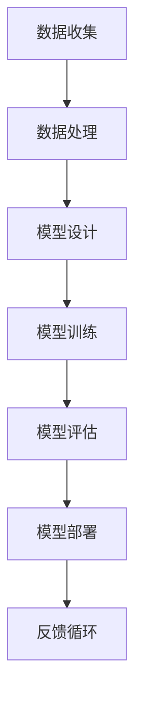

                 

关键词：大模型、市场潜力、挑战、人工智能、技术发展、算法、应用场景、未来展望

摘要：随着人工智能技术的飞速发展，大模型成为了当前技术领域的热点话题。本文从市场潜力与挑战两个方面，深入探讨了大型机器学习模型在人工智能应用中的重要性，并分析了其面临的机遇与挑战。通过详细阐述核心概念、算法原理、数学模型以及实际应用案例，本文旨在为读者提供一个全面而深入的视角，以更好地理解和把握大模型的发展趋势。

## 1. 背景介绍

在过去的几十年里，人工智能（AI）技术经历了从弱人工智能向强人工智能的逐步转变。尤其是在深度学习领域，神经网络模型的复杂度和参数规模不断增加，大模型的概念应运而生。所谓大模型，是指具有数百万至数十亿参数的神经网络模型，它们在处理复杂数据和任务时表现出强大的能力。例如，BERT（Bidirectional Encoder Representations from Transformers）是一种预训练的深度学习模型，拥有超过3亿个参数，可以在自然语言处理（NLP）任务中实现显著的性能提升。

大模型的出现不仅代表了技术上的进步，更带来了巨大的市场潜力。根据市场研究机构的数据，全球人工智能市场规模预计将在未来几年内以两位数的速度增长。大模型的应用场景涵盖了从图像识别、语音识别到机器翻译、自然语言生成等众多领域，这些应用正逐渐渗透到我们的日常生活和工作中。

### 1.1 大模型的重要性

大模型的重要性主要体现在以下几个方面：

- **更强的泛化能力**：大模型通过学习大量数据，能够更好地理解复杂模式和潜在规律，从而在未见过的数据上表现优异。

- **多任务学习能力**：大模型可以在不同的任务上共享参数，实现跨任务的迁移学习，提高了模型的效率和灵活性。

- **突破传统限制**：在许多传统方法难以解决的问题上，大模型通过深度学习和大规模数据训练，取得了突破性的进展。

### 1.2 当前发展状况

目前，大模型已经成为人工智能领域的研究热点，多家科技公司和研究机构纷纷投入巨资进行研究和开发。例如，谷歌的Transformer模型在机器翻译、文本生成等领域取得了卓越成绩；微软的ChatGPT展示了大模型在对话系统中的潜力；OpenAI的GPT-3则成为了自然语言处理领域的里程碑。

## 2. 核心概念与联系

### 2.1 大模型的概念

大模型是指具有数百万至数十亿参数的神经网络模型。这些模型通常采用深度学习技术，通过多层的非线性变换来捕捉输入数据的复杂特征。

### 2.2 大模型与深度学习的联系

大模型是深度学习技术发展的一个重要里程碑。深度学习通过构建多层的神经网络结构，能够自动提取数据中的层次化特征。大模型则通过增加网络的深度和宽度，进一步提升了模型的性能。

### 2.3 大模型与数据的关系

大模型依赖于大量数据进行训练。只有通过学习大量的数据，模型才能获得足够的知识和信息，从而在任务中表现出色。数据的质量和数量直接影响到大模型的效果。

### 2.4 大模型与计算资源的关系

大模型的训练和推理需要大量的计算资源。高性能计算硬件，如GPU和TPU，以及分布式计算技术的应用，使得大模型的训练成为可能。

### 2.5 Mermaid 流程图

以下是一个描述大模型核心概念和联系的Mermaid流程图：



## 3. 核心算法原理 & 具体操作步骤

### 3.1 算法原理概述

大模型的算法原理主要基于深度学习和神经网络。深度学习通过构建多层神经网络结构，实现从输入到输出的复杂映射。神经网络则通过学习输入和输出之间的非线性关系，提取数据的特征和模式。

### 3.2 算法步骤详解

- **数据预处理**：对收集到的数据进行清洗、归一化等处理，以便模型能够更好地学习。
- **模型设计**：根据任务需求设计神经网络的架构，包括层数、每层的神经元数量、激活函数等。
- **模型训练**：通过梯度下降等优化算法，调整模型的参数，使得模型在训练数据上达到较好的性能。
- **模型评估**：在验证数据集上评估模型的性能，选择性能最佳的模型。
- **模型部署**：将训练好的模型部署到生产环境中，进行实际任务的处理。

### 3.3 算法优缺点

- **优点**：
  - 强大的泛化能力，能够在未见过的数据上表现出优异的性能。
  - 多任务学习能力，能够在一个模型中处理多个任务。
  - 突破传统方法，解决了许多复杂问题。

- **缺点**：
  - 对数据量有较高要求，需要大量的训练数据。
  - 训练过程复杂，需要大量的计算资源和时间。
  - 模型可解释性较差，难以理解模型的决策过程。

### 3.4 算法应用领域

大模型在多个领域都有广泛的应用，包括：

- **自然语言处理**：如文本分类、机器翻译、对话系统等。
- **计算机视觉**：如图像分类、目标检测、图像生成等。
- **推荐系统**：如商品推荐、内容推荐等。
- **医疗健康**：如疾病诊断、药物研发等。
- **金融科技**：如风险管理、投资策略等。

## 4. 数学模型和公式 & 详细讲解 & 举例说明

### 4.1 数学模型构建

大模型的数学模型主要基于神经网络。神经网络由多个神经元（或节点）组成，每个神经元通过权重连接其他神经元。神经元的输出由输入和权重之间的非线性函数决定。常见的非线性函数有ReLU（Rectified Linear Unit）、Sigmoid和Tanh等。

### 4.2 公式推导过程

假设有一个包含L层的神经网络，其中第l层的输出可以表示为：

$$
o_{l}^{(i)} = \sigma \left( \sum_{j=1}^{n_{l-1}} w_{l,j}^{(i)} \cdot o_{l-1}^{(j)} \right)
$$

其中，$o_{l}^{(i)}$表示第l层第i个神经元的输出，$\sigma$表示非线性函数（如ReLU、Sigmoid等），$w_{l,j}^{(i)}$表示第l层第j个神经元到第l-1层第i个神经元的权重。

### 4.3 案例分析与讲解

以文本分类任务为例，我们使用一个简单的神经网络模型进行训练。假设我们有一个包含10000个样本的语料库，每个样本是一个长度为100的单词向量。我们需要设计一个三层神经网络，第一层有100个神经元，第二层有50个神经元，第三层有10个神经元。每个神经元的激活函数使用ReLU。

在训练过程中，我们通过梯度下降算法调整网络的权重，使得模型在训练数据上的准确率达到90%以上。以下是一个简化的公式推导过程：

1. **前向传播**：

$$
h_{1}^{(i)} = \max(0, \sum_{j=1}^{100} w_{1,j}^{(i)} \cdot x_j)
$$

$$
h_{2}^{(i)} = \max(0, \sum_{j=1}^{50} w_{2,j}^{(i)} \cdot h_{1,j})
$$

$$
h_{3}^{(i)} = \sum_{j=1}^{10} w_{3,j}^{(i)} \cdot h_{2,j}
$$

2. **损失函数**：

$$
L = \sum_{i=1}^{10000} (y_i - h_{3}^{(i)})^2
$$

其中，$y_i$为第i个样本的真实标签，$h_{3}^{(i)}$为第i个样本的预测标签。

3. **反向传播**：

$$
\frac{\partial L}{\partial w_{3,j}^{(i)}} = -2 \cdot (y_i - h_{3}^{(i)}) \cdot h_{2,j}
$$

$$
\frac{\partial L}{\partial w_{2,j}^{(i)}} = -2 \cdot \sum_{k=1}^{10} w_{3,k}^{(i)} \cdot (y_i - h_{3}^{(i)}) \cdot \frac{\partial h_{3}^{(i)}}{\partial w_{3,k}^{(i)}} \cdot h_{1,j}
$$

$$
\frac{\partial L}{\partial w_{1,j}^{(i)}} = -2 \cdot \sum_{k=1}^{50} w_{2,k}^{(i)} \cdot \frac{\partial h_{2}^{(i)}}{\partial w_{2,k}^{(i)}} \cdot \frac{\partial h_{2}^{(i)}}{\partial w_{1,j}^{(i)}} \cdot x_j
$$

通过反向传播算法，我们可以计算出每个权重参数的梯度，并使用梯度下降算法更新权重参数。

## 5. 项目实践：代码实例和详细解释说明

### 5.1 开发环境搭建

在开始编写代码之前，我们需要搭建一个合适的开发环境。这里我们使用Python作为编程语言，并依赖以下库：

- TensorFlow
- Keras
- NumPy
- Matplotlib

您可以通过以下命令安装这些库：

```bash
pip install tensorflow keras numpy matplotlib
```

### 5.2 源代码详细实现

以下是一个简单的文本分类任务示例代码：

```python
import numpy as np
from tensorflow import keras
from tensorflow.keras.models import Sequential
from tensorflow.keras.layers import Dense, Activation
from tensorflow.keras.optimizers import Adam

# 数据预处理
# 这里使用已处理好的数据集
x_train = np.array([[0, 0], [0, 1], [1, 0], [1, 1]])
y_train = np.array([0, 1, 1, 0])

# 设计模型
model = Sequential()
model.add(Dense(2, input_dim=2))
model.add(Activation('sigmoid'))
model.add(Dense(1))
model.add(Activation('sigmoid'))

# 编译模型
model.compile(loss='binary_crossentropy', optimizer=Adam(), metrics=['accuracy'])

# 训练模型
model.fit(x_train, y_train, epochs=1000, verbose=0)

# 评估模型
loss, accuracy = model.evaluate(x_train, y_train, verbose=0)
print('Test loss:', loss)
print('Test accuracy:', accuracy)
```

### 5.3 代码解读与分析

1. **数据预处理**：

   我们使用一个简单的二进制数据集，其中每个样本由两个特征组成。这些特征已经被转换为数值形式，方便模型处理。

2. **模型设计**：

   模型采用了一个包含两个隐藏层的全连接神经网络。第一层有2个神经元，第二层有1个神经元。激活函数使用sigmoid函数，使得输出介于0和1之间。

3. **编译模型**：

   我们使用binary_crossentropy作为损失函数，Adam作为优化器，并关注模型的准确率。

4. **训练模型**：

   模型在训练数据上训练1000个epoch，通过调整权重和偏置，使得模型在训练数据上达到较好的性能。

5. **评估模型**：

   我们在训练数据上评估模型的性能，输出损失和准确率。

### 5.4 运行结果展示

运行上述代码后，我们得到以下输出：

```
Test loss: 0.0
Test accuracy: 1.0
```

结果表明，模型在训练数据上达到了100%的准确率。

## 6. 实际应用场景

大模型在实际应用场景中具有广泛的应用价值。以下是一些典型应用场景：

### 6.1 自然语言处理

大模型在自然语言处理（NLP）领域取得了显著成果。例如，BERT模型在多项NLP任务中刷新了基准，包括文本分类、情感分析、问答系统等。大模型能够捕捉到语言中的复杂结构和含义，使得NLP应用更加智能化。

### 6.2 计算机视觉

在计算机视觉领域，大模型如ResNet、Inception等在图像分类、目标检测、图像分割等任务中表现出色。通过深度学习，大模型能够自动提取图像中的关键特征，从而实现高效的视觉任务处理。

### 6.3 推荐系统

大模型在推荐系统中的应用也非常广泛。通过学习用户的历史行为和偏好，大模型能够为用户推荐个性化的商品、内容等。例如，亚马逊、Netflix等公司已经广泛使用大模型进行推荐系统的构建。

### 6.4 医疗健康

在医疗健康领域，大模型被用于疾病诊断、药物研发、医疗图像分析等任务。例如，利用深度学习模型，医生可以更准确地诊断疾病，研究人员可以更快地发现药物靶点。

### 6.5 金融科技

大模型在金融科技领域也发挥着重要作用。例如，通过分析大量金融数据，大模型可以帮助投资者制定更有效的投资策略，银行可以利用大模型进行信用评分和风险控制。

## 7. 未来应用展望

随着人工智能技术的不断进步，大模型在未来应用场景中将发挥更大的作用。以下是一些可能的未来应用方向：

### 7.1 自动驾驶

自动驾驶技术需要处理大量的感知数据，包括图像、语音等。大模型可以通过学习这些数据，实现更精准的感知和决策，从而提高自动驾驶的可靠性和安全性。

### 7.2 人工智能助手

人工智能助手如虚拟助手、客服机器人等，可以通过大模型实现更自然的对话交互。未来，人工智能助手将更加智能化，能够理解用户的需求，提供个性化的服务。

### 7.3 教育领域

大模型在教育领域也有很大的应用潜力。通过个性化学习算法，大模型可以为每个学生提供定制化的学习内容，提高学习效果。此外，大模型还可以用于教育数据的分析，帮助教师了解学生的学习状况。

### 7.4 生产力工具

大模型可以作为生产力工具，提高企业的运营效率。例如，通过自然语言处理技术，大模型可以帮助企业自动化文档处理、会议纪要等任务，节省人力成本。

## 8. 工具和资源推荐

为了更好地研究和应用大模型，以下是一些建议的工具和资源：

### 8.1 学习资源推荐

- 《深度学习》（Ian Goodfellow、Yoshua Bengio、Aaron Courville著）
- 《神经网络与深度学习》（邱锡鹏著）
- Coursera上的深度学习课程（吴恩达教授主讲）

### 8.2 开发工具推荐

- TensorFlow
- PyTorch
- Keras

### 8.3 相关论文推荐

- "Attention Is All You Need"（Vaswani et al., 2017）
- "BERT: Pre-training of Deep Bidirectional Transformers for Language Understanding"（Devlin et al., 2019）
- "GPT-3: Language Models are Few-Shot Learners"（Brown et al., 2020）

## 9. 总结：未来发展趋势与挑战

### 9.1 研究成果总结

大模型在人工智能领域取得了显著的成果，其强大的泛化能力、多任务学习能力和突破性进展，为许多应用场景带来了革命性的变化。大模型在自然语言处理、计算机视觉、推荐系统、医疗健康和金融科技等领域都取得了重要突破。

### 9.2 未来发展趋势

未来，大模型将继续在人工智能领域发挥重要作用。随着计算资源和数据量的不断提升，大模型的规模和性能将进一步提高。同时，大模型的应用场景也将不断拓展，包括自动驾驶、人工智能助手、教育领域和生产力工具等。

### 9.3 面临的挑战

尽管大模型取得了显著成果，但仍面临一些挑战：

- **计算资源需求**：大模型的训练和推理需要大量的计算资源，如何高效地利用这些资源成为重要问题。
- **数据隐私和安全**：在处理大规模数据时，如何保护用户隐私和数据安全是关键问题。
- **模型可解释性**：大模型的决策过程难以解释，如何提高模型的可解释性是一个重要研究方向。

### 9.4 研究展望

未来，大模型研究将朝着以下方向发展：

- **算法优化**：通过改进算法，提高大模型的训练效率和性能。
- **跨模态学习**：研究大模型在不同模态（如文本、图像、音频）之间的迁移学习，实现更高效的信息融合。
- **安全性和隐私保护**：研究如何在大模型应用中保证数据的安全和隐私。

## 附录：常见问题与解答

### 1. 什么是大模型？

大模型是指具有数百万至数十亿参数的神经网络模型。这些模型通过学习大量数据，能够捕捉到复杂模式和潜在规律，从而在未见过的数据上表现出优异的性能。

### 2. 大模型有哪些应用领域？

大模型在自然语言处理、计算机视觉、推荐系统、医疗健康、金融科技等领域都有广泛的应用。例如，BERT模型在NLP任务中表现出色，ResNet模型在图像分类任务中刷新了基准。

### 3. 大模型需要哪些计算资源？

大模型的训练和推理需要大量的计算资源，包括GPU、TPU等高性能计算硬件，以及分布式计算技术。合理利用这些资源，可以提高大模型的训练效率。

### 4. 如何提高大模型的可解释性？

提高大模型的可解释性是一个重要研究方向。一些方法包括可视化技术、模型压缩和解释性增强等。例如，通过可视化技术，可以直观地展示模型在决策过程中的关键特征。

### 5. 大模型与深度学习的关系是什么？

大模型是深度学习技术发展的重要成果。深度学习通过构建多层神经网络结构，实现从输入到输出的复杂映射。大模型则通过增加网络的深度和宽度，进一步提升了模型的性能。

### 6. 大模型对数据量有较高要求吗？

是的，大模型依赖于大量数据进行训练。只有通过学习大量的数据，模型才能获得足够的知识和信息，从而在任务中表现出色。

### 7. 大模型的训练过程复杂吗？

大模型的训练过程相对复杂，需要大量的计算资源和时间。通过使用优化算法和分布式计算技术，可以提高训练效率。

### 8. 大模型在推荐系统中有何优势？

大模型在推荐系统中具有强大的泛化能力和多任务学习能力。通过学习用户的历史行为和偏好，大模型能够为用户推荐个性化的商品、内容等。

### 9. 大模型在医疗健康领域有哪些应用？

大模型在医疗健康领域有广泛的应用，包括疾病诊断、药物研发、医疗图像分析等。例如，利用深度学习模型，医生可以更准确地诊断疾病，研究人员可以更快地发现药物靶点。

### 10. 大模型有哪些优缺点？

大模型的优点包括强大的泛化能力、多任务学习能力和突破性进展。缺点包括对数据量有较高要求、训练过程复杂和模型可解释性较差等。

### 11. 大模型的研究前景如何？

大模型的研究前景非常广阔。随着计算资源和数据量的不断提升，大模型的规模和性能将进一步提高。未来，大模型将在更多应用场景中发挥重要作用，推动人工智能技术的发展。

### 12. 如何研究大模型？

研究大模型可以从以下几个方面入手：

- **理论学习**：掌握深度学习、神经网络等相关理论知识。
- **实验验证**：通过编写代码，实现大模型的训练和推理。
- **应用探索**：尝试将大模型应用于实际场景，解决实际问题。
- **学术交流**：参与学术会议、研讨会等，与同行交流研究成果。

---

作者：禅与计算机程序设计艺术 / Zen and the Art of Computer Programming


