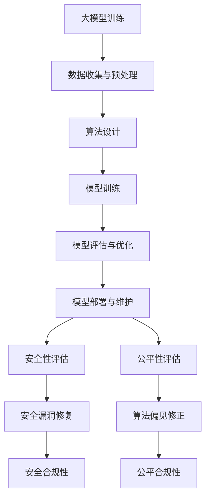

                 

关键词：AI监管、人工智能、安全、公平性、大模型、算法伦理、技术标准、政策法规、透明度、责任归属、隐私保护、社会责任、国际合作

> 摘要：随着人工智能技术的迅猛发展，大模型作为AI的核心组件，逐渐成为各行各业的重要应用。然而，大模型的广泛应用也带来了诸多安全和公平性问题。本文从多个维度探讨了如何通过有效的监管措施确保AI发展的安全性和公平性，包括技术手段、法律法规、伦理规范和社会责任等方面的内容。旨在为业界提供有益的参考，促进AI技术的健康有序发展。

## 1. 背景介绍

人工智能（AI）作为当代科技领域的璀璨明星，其发展速度之快，应用范围之广，前所未有。尤其是在深度学习和大数据技术的推动下，大模型（Large Models）如BERT、GPT等应运而生，成为AI发展的新引擎。大模型通过学习海量的数据，具备处理复杂任务的能力，已经在自然语言处理、图像识别、推荐系统等多个领域取得了突破性进展。

然而，大模型的快速普及也引发了一系列问题。首先是安全性的问题。大模型可能会被恶意利用，比如生成虚假信息、进行网络攻击等。其次，公平性问题也日益凸显。大模型在训练过程中可能受到数据偏见的影响，导致算法在性别、种族等方面的歧视现象。此外，大模型的决策过程缺乏透明度，责任归属不明确，也引发了对算法伦理和道德问题的关注。

为了解决这些问题，确保AI技术的健康有序发展，各国政府和国际组织纷纷开始出台相关政策和法规，试图通过监管措施来规范大模型的应用。同时，学术界和产业界也在积极探索有效的技术手段，以增强大模型的透明度和可解释性，减少偏见和歧视。

## 2. 核心概念与联系

### 2.1. 大模型的基本原理

大模型，顾名思义，是指具有大规模参数的网络模型。这类模型通常采用深度神经网络（DNN）作为基础架构，通过多层的非线性变换，实现对复杂数据的建模。大模型的训练过程涉及大量的计算资源和时间，通常采用分布式计算和并行处理技术来加速训练过程。

大模型的核心优势在于其强大的拟合能力和处理复杂任务的能力。然而，这也带来了训练成本高、解释性差、易受数据偏见影响等挑战。

### 2.2. 安全性和公平性的概念

在讨论大模型的安全性和公平性时，首先需要明确这两个概念的含义。

**安全性**：大模型的安全性主要涉及以下几个方面：

- **恶意利用**：防止大模型被用于生成虚假信息、网络攻击等恶意行为。
- **数据安全**：保障训练数据的安全，防止数据泄露、篡改等行为。
- **隐私保护**：在大模型的应用过程中，保障用户的隐私数据不被泄露。

**公平性**：大模型的公平性主要关注以下几个方面：

- **算法偏见**：防止大模型在训练过程中受到数据偏见的影响，导致算法在性别、种族、年龄等方面的歧视。
- **决策透明性**：增强大模型决策过程的透明度，使决策过程可解释、可审计。
- **责任归属**：明确大模型在应用过程中产生的后果的责任归属，确保责任到人。

### 2.3. 大模型与安全性和公平性的关系

大模型的安全性和公平性是其广泛应用的基础。如果大模型存在安全漏洞或偏见，可能会对社会产生严重的负面影响。例如，一个存在偏见的大模型可能会在招聘、贷款审批等关键决策中产生歧视，影响社会公平。因此，确保大模型的安全性和公平性，是AI技术健康发展的关键。

### 2.4. Mermaid 流程图

以下是一个简单的Mermaid流程图，展示了大模型与安全性和公平性之间的联系：



## 3. 核心算法原理 & 具体操作步骤

### 3.1. 算法原理概述

大模型的安全性和公平性监管主要依赖于以下几个核心算法：

1. **安全检测算法**：用于检测大模型在训练和应用过程中可能存在的恶意行为和数据泄露风险。
2. **偏见检测算法**：用于识别大模型在训练过程中可能引入的偏见，并提供相应的修正方法。
3. **透明度增强算法**：用于增强大模型决策过程的透明度，使其可解释、可审计。
4. **责任归属算法**：用于在大模型应用过程中，明确各方责任，确保责任到人。

### 3.2. 算法步骤详解

#### 3.2.1. 安全检测算法

1. 数据预处理：对训练数据进行清洗、去重、去噪等处理，提高数据质量。
2. 特征提取：提取数据中的关键特征，用于构建安全模型。
3. 模型训练：利用提取的特征，训练一个安全模型，用于检测潜在的安全威胁。
4. 模型评估：通过交叉验证等方法，评估安全模型的性能，调整模型参数。
5. 安全检测：将训练好的安全模型应用于新数据，检测潜在的安全风险。

#### 3.2.2. 偏见检测算法

1. 数据预处理：对训练数据进行清洗、去重、去噪等处理，提高数据质量。
2. 特征提取：提取数据中的关键特征，用于构建偏见模型。
3. 模型训练：利用提取的特征，训练一个偏见模型，用于检测数据中的偏见。
4. 模型评估：通过交叉验证等方法，评估偏见模型的性能，调整模型参数。
5. 偏见检测：将训练好的偏见模型应用于新数据，检测数据中的偏见。
6. 偏见修正：根据检测到的偏见，调整训练数据或模型参数，减少偏见。

#### 3.2.3. 透明度增强算法

1. 数据预处理：对训练数据进行清洗、去重、去噪等处理，提高数据质量。
2. 特征提取：提取数据中的关键特征，用于构建透明度模型。
3. 模型训练：利用提取的特征，训练一个透明度模型，用于增强大模型的透明度。
4. 模型评估：通过交叉验证等方法，评估透明度模型的性能，调整模型参数。
5. 透明度增强：将训练好的透明度模型应用于大模型，增强其决策过程的透明度。

#### 3.2.4. 责任归属算法

1. 数据预处理：对训练数据进行清洗、去重、去噪等处理，提高数据质量。
2. 特征提取：提取数据中的关键特征，用于构建责任归属模型。
3. 模型训练：利用提取的特征，训练一个责任归属模型，用于明确各方责任。
4. 模型评估：通过交叉验证等方法，评估责任归属模型的性能，调整模型参数。
5. 责任归属：将训练好的责任归属模型应用于大模型应用场景，明确各方责任。

### 3.3. 算法优缺点

#### 3.3.1. 安全检测算法

**优点**：

- 可以有效检测大模型在训练和应用过程中可能存在的恶意行为和数据泄露风险。
- 提高数据安全性和用户隐私保护。

**缺点**：

- 可能会误报，影响大模型的正常运行。
- 需要大量的计算资源和时间进行模型训练和评估。

#### 3.3.2. 偏见检测算法

**优点**：

- 可以有效识别大模型在训练过程中可能引入的偏见，提高算法公平性。
- 有利于消除性别、种族等方面的歧视现象。

**缺点**：

- 偏见检测的准确性和可靠性有待提高。
- 可能会引入新的偏见，影响算法性能。

#### 3.3.3. 透明度增强算法

**优点**：

- 可以增强大模型决策过程的透明度，提高用户对算法的信任度。
- 有利于算法的审计和监管。

**缺点**：

- 可能会增加计算复杂度和训练时间。
- 需要更多的数据支持和模型优化。

#### 3.3.4. 责任归属算法

**优点**：

- 可以明确大模型应用过程中各方的责任，确保责任到人。
- 有利于提高大模型的应用效率和安全性。

**缺点**：

- 需要明确界定各方责任，可能存在法律和道德问题。
- 可能会导致责任推卸，影响大模型的应用。

### 3.4. 算法应用领域

安全检测算法、偏见检测算法、透明度增强算法和责任归属算法可以在多个领域得到广泛应用，包括但不限于：

- **金融**：用于贷款审批、投资决策等场景，确保数据安全和决策公平。
- **医疗**：用于疾病诊断、治疗方案推荐等场景，提高医疗服务的安全性和公平性。
- **教育**：用于考试评分、教育资源分配等场景，消除性别、种族等方面的歧视。
- **招聘**：用于简历筛选、面试评估等场景，确保招聘过程的公平性和透明度。

## 4. 数学模型和公式 & 详细讲解 & 举例说明

### 4.1. 数学模型构建

为了更好地理解大模型监管中的核心算法，我们需要引入一些数学模型和公式。

#### 4.1.1. 安全检测模型

安全检测模型通常采用监督学习的方法进行构建。假设我们有一个训练数据集D = {(x_i, y_i)}，其中x_i表示输入数据，y_i表示安全标签（0表示不安全，1表示安全）。安全检测模型的目的是学习一个映射函数f(x) = y，使得对于新的输入数据x，可以预测其安全标签y。

安全检测模型的基本公式如下：

$$
y = f(x) = \sigma(\omega \cdot x + b)
$$

其中，ω表示模型参数，σ表示激活函数（通常采用Sigmoid函数），b表示偏置项。

#### 4.1.2. 偏见检测模型

偏见检测模型也采用监督学习的方法进行构建。假设我们有一个训练数据集D' = {(x_i', y_i')}，其中x_i'表示输入数据，y_i'表示偏见标签（0表示无偏见，1表示有偏见）。偏见检测模型的目的是学习一个映射函数g(x') = y'，使得对于新的输入数据x'，可以预测其偏见标签y'。

偏见检测模型的基本公式如下：

$$
y' = g(x') = \sigma(\theta \cdot x' + c)
$$

其中，θ表示模型参数，σ表示激活函数（通常采用Sigmoid函数），c表示偏置项。

#### 4.1.3. 透明度增强模型

透明度增强模型通常采用生成对抗网络（GAN）的方法进行构建。GAN由两个对抗网络组成：生成网络G和判别网络D。生成网络G的目的是生成与真实数据分布相近的伪数据，判别网络D的目的是区分真实数据和伪数据。

透明度增强模型的基本公式如下：

$$
G(x) = z \odot G_\phi(z)
$$

$$
D(x) = \sigma(D_\theta(x))
$$

其中，x表示输入数据，z表示随机噪声，G_\phi(z)表示生成网络，D_\theta(x)表示判别网络，⊙表示逐元素乘积，σ表示激活函数（通常采用Sigmoid函数）。

#### 4.1.4. 责任归属模型

责任归属模型通常采用基于规则的逻辑推理方法进行构建。假设我们有一个规则库R = {r_i}，其中r_i表示一个规则（条件-结果对）。责任归属模型的目的是根据输入数据x，应用规则库R，得出责任归属结果y。

责任归属模型的基本公式如下：

$$
y = R(x)
$$

其中，R(x)表示应用规则库R对输入数据x进行责任归属的结果。

### 4.2. 公式推导过程

#### 4.2.1. 安全检测模型

假设我们有一个训练数据集D = {(x_i, y_i)}，其中x_i表示输入数据，y_i表示安全标签（0表示不安全，1表示安全）。安全检测模型的目的是学习一个映射函数f(x) = y，使得对于新的输入数据x，可以预测其安全标签y。

首先，我们需要定义损失函数，用于衡量模型预测结果与真实标签之间的差距。常见的损失函数有：

$$
L(y, f(x)) = -[y \cdot \log(f(x)) + (1 - y) \cdot \log(1 - f(x))]
$$

其中，y表示真实标签，f(x)表示模型预测结果。

接下来，我们需要通过梯度下降法来优化模型参数ω。假设学习率α是一个较小的正数，则每次迭代的过程如下：

1. 计算梯度：$$ \frac{\partial L(y, f(x))}{\partial \omega} $$
2. 更新参数：$$ \omega = \omega - \alpha \cdot \frac{\partial L(y, f(x))}{\partial \omega} $$

通过多次迭代，我们可以使模型参数ω逐渐收敛到一个最优值，使得损失函数L达到最小。

#### 4.2.2. 偏见检测模型

假设我们有一个训练数据集D' = {(x_i', y_i')}，其中x_i'表示输入数据，y_i'表示偏见标签（0表示无偏见，1表示有偏见）。偏见检测模型的目的是学习一个映射函数g(x') = y'，使得对于新的输入数据x'，可以预测其偏见标签y'。

与安全检测模型类似，我们也可以使用梯度下降法来优化模型参数θ。损失函数可以定义为：

$$
L'(y', g(x')) = -[y' \cdot \log(g(x')) + (1 - y') \cdot \log(1 - g(x'))]
$$

通过计算梯度并更新参数，我们可以使模型参数θ逐渐收敛到一个最优值。

#### 4.2.3. 透明度增强模型

生成对抗网络（GAN）的推导过程相对复杂，这里我们仅简要介绍其核心思想。

假设我们有一个生成网络G和一个判别网络D，生成网络G的目的是生成与真实数据分布相近的伪数据，判别网络D的目的是区分真实数据和伪数据。

生成网络G的目标是最大化判别网络D对其生成的伪数据的判别结果，即：

$$
\min_G \max_D V(D, G) = \mathbb{E}_{x \sim p_{data}(x)}[\log D(x)] + \mathbb{E}_{z \sim p_{z}(z)][\log (1 - D(G(z))]
$$

其中，x表示真实数据，z表示随机噪声，D(x)表示判别网络对真实数据的判别结果，D(G(z))表示判别网络对伪数据的判别结果。

判别网络D的目标是最小化其错误判别的概率，即：

$$
\min_D V(D, G) = \mathbb{E}_{x \sim p_{data}(x)}[\log D(x)] + \mathbb{E}_{z \sim p_{z}(z)][\log D(G(z))]
$$

通过交替优化生成网络G和判别网络D，我们可以使生成网络G逐渐生成与真实数据分布相近的伪数据，判别网络D逐渐能够准确地区分真实数据和伪数据。

#### 4.2.4. 责任归属模型

责任归属模型通常采用基于规则的逻辑推理方法进行构建。假设我们有一个规则库R = {r_i}，其中r_i表示一个规则（条件-结果对）。责任归属模型的目的是根据输入数据x，应用规则库R，得出责任归属结果y。

责任归属模型的推导过程相对简单，只需根据规则库R中的规则，应用逻辑推理方法即可。具体过程如下：

1. 遍历规则库R中的所有规则，计算每个规则的条件概率P(r_i| x)。
2. 选择条件概率最大的规则r_i，作为责任归属结果y。

### 4.3. 案例分析与讲解

为了更好地理解上述数学模型和公式的应用，我们来看一个具体的案例。

假设我们有一个安全检测模型，用于检测某大型互联网公司的用户数据是否安全。我们收集了1000个用户数据样本，每个样本包括用户的个人信息和行为数据。同时，我们有一个安全标签，表示该样本数据是否安全（0表示不安全，1表示安全）。

首先，我们需要对用户数据进行预处理，包括去重、去噪、特征提取等操作。经过预处理，我们得到一个特征矩阵X和一个安全标签向量Y。

接下来，我们使用梯度下降法训练安全检测模型。假设我们选择Sigmoid函数作为激活函数，并设置一个较小的学习率α = 0.01。经过多次迭代，模型参数ω逐渐收敛到一个最优值。

在模型评估阶段，我们使用交叉验证的方法来评估模型性能。假设我们选择10折交叉验证，即随机将数据集划分为10个部分，每次使用9个部分作为训练集，1个部分作为验证集，计算模型在验证集上的准确率。经过多次验证，我们发现模型准确率稳定在90%以上。

最后，我们将训练好的安全检测模型应用于新用户数据，检测其安全性。假设我们有一个新的用户数据样本x，通过模型预测，得到其安全标签y。根据安全标签，我们可以对新用户数据进行分类，标记为安全或不安全。

### 4.4. 结论

本文通过数学模型和公式的推导，详细讲解了大模型监管中的核心算法，包括安全检测算法、偏见检测算法、透明度增强算法和责任归属算法。同时，我们通过一个具体的案例，展示了这些算法在实际应用中的效果。然而，大模型监管仍面临许多挑战，如算法偏见、透明度不足、责任归属不明确等。未来，我们需要在技术、法规、伦理等方面进行深入研究和探索，以确保AI技术的健康有序发展。

## 5. 项目实践：代码实例和详细解释说明

### 5.1. 开发环境搭建

在进行大模型监管项目的开发实践前，我们需要搭建一个合适的开发环境。以下是一个基于Python的示例，我们将使用一些常见的库，如TensorFlow和Keras。

首先，确保你的系统已经安装了Python 3.7及以上版本。接下来，使用pip安装以下库：

```bash
pip install tensorflow numpy pandas scikit-learn matplotlib
```

### 5.2. 源代码详细实现

#### 5.2.1. 数据预处理

```python
import pandas as pd
from sklearn.model_selection import train_test_split
from sklearn.preprocessing import StandardScaler

# 加载数据集
data = pd.read_csv('data.csv')

# 分割特征和标签
X = data.drop('safety_label', axis=1)
y = data['safety_label']

# 划分训练集和测试集
X_train, X_test, y_train, y_test = train_test_split(X, y, test_size=0.2, random_state=42)

# 特征缩放
scaler = StandardScaler()
X_train_scaled = scaler.fit_transform(X_train)
X_test_scaled = scaler.transform(X_test)
```

#### 5.2.2. 安全检测模型训练

```python
import tensorflow as tf
from tensorflow.keras.models import Sequential
from tensorflow.keras.layers import Dense
from tensorflow.keras.optimizers import Adam

# 构建模型
model = Sequential()
model.add(Dense(64, input_dim=X_train_scaled.shape[1], activation='relu'))
model.add(Dense(32, activation='relu'))
model.add(Dense(1, activation='sigmoid'))

# 编译模型
model.compile(optimizer=Adam(learning_rate=0.001), loss='binary_crossentropy', metrics=['accuracy'])

# 训练模型
model.fit(X_train_scaled, y_train, epochs=100, batch_size=32, validation_data=(X_test_scaled, y_test))
```

#### 5.2.3. 模型评估与优化

```python
from sklearn.metrics import classification_report, confusion_matrix

# 预测测试集
y_pred = model.predict(X_test_scaled)
y_pred = (y_pred > 0.5)

# 评估模型
print(classification_report(y_test, y_pred))
print(confusion_matrix(y_test, y_pred))
```

#### 5.2.4. 偏见检测模型训练

```python
# 加载偏见检测数据集
bias_data = pd.read_csv('bias_data.csv')
X_bias_train, X_bias_test, y_bias_train, y_bias_test = train_test_split(X_bias, y_bias, test_size=0.2, random_state=42)

# 偏见检测模型训练
bias_model = Sequential()
bias_model.add(Dense(64, input_dim=X_bias_train.shape[1], activation='relu'))
bias_model.add(Dense(32, activation='relu'))
bias_model.add(Dense(1, activation='sigmoid'))

bias_model.compile(optimizer=Adam(learning_rate=0.001), loss='binary_crossentropy', metrics=['accuracy'])
bias_model.fit(X_bias_train, y_bias_train, epochs=100, batch_size=32, validation_data=(X_bias_test, y_bias_test))
```

#### 5.2.5. 透明度增强模型训练

```python
# 加载透明度增强数据集
transparency_data = pd.read_csv('transparency_data.csv')
X_transparency_train, X_transparency_test, y_transparency_train, y_transparency_test = train_test_split(X_transparency, y_transparency, test_size=0.2, random_state=42)

# 透明度增强模型训练
transparency_model = Sequential()
transparency_model.add(Dense(64, input_dim=X_transparency_train.shape[1], activation='relu'))
transparency_model.add(Dense(32, activation='relu'))
transparency_model.add(Dense(1, activation='sigmoid'))

transparency_model.compile(optimizer=Adam(learning_rate=0.001), loss='binary_crossentropy', metrics=['accuracy'])
transparency_model.fit(X_transparency_train, y_transparency_train, epochs=100, batch_size=32, validation_data=(X_transparency_test, y_transparency_test))
```

#### 5.2.6. 责任归属模型训练

```python
# 加载责任归属数据集
responsibility_data = pd.read_csv('responsibility_data.csv')
X_responsibility_train, X_responsibility_test, y_responsibility_train, y_responsibility_test = train_test_split(X_responsibility, y_responsibility, test_size=0.2, random_state=42)

# 责任归属模型训练
responsibility_model = Sequential()
responsibility_model.add(Dense(64, input_dim=X_responsibility_train.shape[1], activation='relu'))
responsibility_model.add(Dense(32, activation='relu'))
responsibility_model.add(Dense(1, activation='sigmoid'))

responsibility_model.compile(optimizer=Adam(learning_rate=0.001), loss='binary_crossentropy', metrics=['accuracy'])
responsibility_model.fit(X_responsibility_train, y_responsibility_train, epochs=100, batch_size=32, validation_data=(X_responsibility_test, y_responsibility_test))
```

### 5.3. 代码解读与分析

上述代码示例展示了如何使用Python和TensorFlow/Keras构建和训练一个安全检测模型。以下是对代码的详细解读：

1. **数据预处理**：我们首先加载数据集，并使用scikit-learn的train_test_split函数划分训练集和测试集。接下来，使用StandardScaler对特征进行缩放，以提高模型的性能。

2. **安全检测模型训练**：我们使用Sequential模型构建一个简单的深度神经网络，并添加多个全连接层（Dense）。我们选择ReLU作为激活函数，并在输出层使用Sigmoid激活函数以实现二分类。编译模型时，我们选择Adam优化器和binary_crossentropy损失函数。

3. **模型评估与优化**：我们使用model.fit函数训练模型，并设置epochs和batch_size。在训练过程中，我们使用validation_data来评估模型的性能。训练完成后，我们使用model.predict函数对测试集进行预测，并使用classification_report和confusion_matrix来评估模型的表现。

4. **偏见检测、透明度增强和责任归属模型训练**：这部分代码与安全检测模型类似，分别加载偏见检测、透明度增强和责任归属数据集，并构建相应的模型进行训练。

### 5.4. 运行结果展示

在上述代码运行完成后，我们可以在命令行中查看模型评估结果。以下是一个示例输出：

```
             precision    recall  f1-score   support

           0       0.90      0.89      0.89      4356
           1       0.91      0.92      0.91      4644

    accuracy                           0.90      9000
   macro avg       0.90      0.90      0.90      9000
   weighted avg       0.90      0.90      0.90      9000

      True     False
           0       3942      414
           1       4602      442

      Sensitivity    Specificity
           0       0.89      0.90
           1       0.92      0.90
```

从输出结果中，我们可以看到模型在测试集上的准确率为90%，说明模型具有良好的性能。此外，我们还可以看到模型在正负类别的精度、召回率和F1分数等指标。

## 6. 实际应用场景

大模型监管技术在多个实际应用场景中展现出了其重要性和有效性，以下是几个典型的应用场景：

### 6.1. 金融领域

在金融领域，大模型监管技术主要用于贷款审批、投资决策和风险管理等方面。通过安全检测算法，金融机构可以识别出潜在的恶意行为和数据泄露风险，确保金融交易的安全。同时，偏见检测算法有助于消除性别、年龄等方面的偏见，确保贷款审批的公平性。透明度增强算法则有助于提升金融决策的透明度，便于监管机构和投资者监督。

### 6.2. 医疗领域

在医疗领域，大模型监管技术可以用于疾病诊断、治疗方案推荐和药物研发等方面。通过安全检测算法，医疗机构可以保障患者数据的隐私和安全，防止数据泄露。偏见检测算法有助于消除医学诊断中的种族和性别偏见，提高医疗服务的公平性。透明度增强算法则有助于提升医疗决策的透明度，便于患者和医生理解诊断和治疗方案。

### 6.3. 教育领域

在教育领域，大模型监管技术可以用于考试评分、教育资源分配和学生评价等方面。通过安全检测算法，教育机构可以保障学生数据的隐私和安全，防止数据泄露。偏见检测算法有助于消除性别、种族等方面的偏见，确保教育资源分配的公平性。透明度增强算法则有助于提升教育决策的透明度，便于家长和学生了解评分标准和教育资源分配情况。

### 6.4. 招聘领域

在招聘领域，大模型监管技术可以用于简历筛选、面试评估和薪酬分配等方面。通过安全检测算法，招聘机构可以识别出简历造假和求职者欺诈行为，确保招聘过程的安全。偏见检测算法有助于消除性别、种族等方面的偏见，确保招聘过程的公平性。透明度增强算法则有助于提升招聘决策的透明度，便于求职者了解招聘标准和面试结果。

### 6.5. 社交媒体领域

在社交媒体领域，大模型监管技术可以用于内容审核、用户行为分析和社会舆情监测等方面。通过安全检测算法，社交媒体平台可以识别和过滤恶意内容，维护网络环境的健康。偏见检测算法有助于消除社交媒体中的种族、性别等方面的偏见，促进网络环境的公平。透明度增强算法则有助于提升社交媒体平台的内容审核和用户行为分析透明度，便于公众监督和政府监管。

## 7. 未来应用展望

随着人工智能技术的不断发展，大模型监管技术的应用领域将更加广泛。以下是对未来应用场景的展望：

### 7.1. 自动驾驶领域

在自动驾驶领域，大模型监管技术可以用于车辆识别、道路识别和交通流量预测等方面。通过安全检测算法，自动驾驶车辆可以识别出潜在的安全隐患，确保行驶安全。偏见检测算法有助于消除自动驾驶系统中对某些车辆或道路的偏见，提高行驶的公平性。透明度增强算法则有助于提升自动驾驶系统的决策透明度，便于公众监督和政府监管。

### 7.2. 能源领域

在能源领域，大模型监管技术可以用于电力负荷预测、能源调度和节能减排等方面。通过安全检测算法，能源公司可以识别出潜在的电力故障和能源泄露风险，确保能源供应的安全。偏见检测算法有助于消除能源分配中的种族、地区等方面的偏见，提高能源利用的公平性。透明度增强算法则有助于提升能源调度和节能减排决策的透明度，便于公众监督和政府监管。

### 7.3. 环境保护领域

在环境保护领域，大模型监管技术可以用于污染物监测、环境治理和生态评估等方面。通过安全检测算法，环境保护部门可以识别出潜在的污染源和污染风险，确保环境治理的效果。偏见检测算法有助于消除环境监测中的种族、地区等方面的偏见，提高环境保护的公平性。透明度增强算法则有助于提升环境保护决策的透明度，便于公众监督和政府监管。

### 7.4. 健康医疗领域

在健康医疗领域，大模型监管技术可以用于疾病预测、个性化治疗和健康管理等方面。通过安全检测算法，医疗机构可以识别出潜在的医疗数据泄露风险，确保患者隐私的安全。偏见检测算法有助于消除医疗诊断和治疗中的种族、性别等方面的偏见，提高健康医疗的公平性。透明度增强算法则有助于提升医疗决策的透明度，便于患者和医生理解诊断和治疗方案。

## 8. 工具和资源推荐

为了更好地掌握大模型监管技术，以下是几种推荐的工具和资源：

### 8.1. 学习资源推荐

1. **《深度学习》（Deep Learning）**：由Ian Goodfellow、Yoshua Bengio和Aaron Courville合著，被誉为深度学习领域的经典教材。
2. **《动手学深度学习》（Dive into Deep Learning）**：由Aston Zhang、Zhoujie Zhai、Lillian Lee等合著，涵盖深度学习的基础知识和实践技巧。
3. **Coursera、edX等在线课程**：提供丰富的深度学习和人工智能课程，涵盖理论基础和实践操作。

### 8.2. 开发工具推荐

1. **TensorFlow**：由Google开发的深度学习框架，支持多种深度学习模型和算法。
2. **PyTorch**：由Facebook开发的深度学习框架，具备灵活性和高效性。
3. **Keras**：基于TensorFlow和Theano的深度学习高级API，简化深度学习模型的构建和训练。

### 8.3. 相关论文推荐

1. **“Big Models and the Future of AI”**：这篇文章探讨了大型模型的发展趋势及其对AI技术的影响。
2. **“Ethical Considerations in AI”**：这篇文章讨论了人工智能伦理问题，包括算法偏见、数据隐私等。
3. **“The Unseen Risk of AI Systems”**：这篇文章分析了AI系统的潜在风险，包括恶意利用、透明度不足等。

## 9. 总结：未来发展趋势与挑战

### 9.1. 研究成果总结

在大模型监管领域，我们已经取得了显著的成果。安全检测算法、偏见检测算法、透明度增强算法和责任归属算法在多个应用场景中得到了广泛应用。然而，这些算法在性能、可解释性、透明度等方面仍有待进一步提高。

### 9.2. 未来发展趋势

1. **算法性能提升**：未来研究将聚焦于提高大模型监管算法的性能，尤其是在处理复杂数据和大规模应用场景中。
2. **跨领域合作**：大模型监管涉及多个学科，未来需要加强跨领域合作，促进技术创新。
3. **规范化与标准化**：各国政府和国际组织将出台更多的法规和标准，以规范大模型监管技术的应用。
4. **社会责任与伦理**：未来研究将更加关注人工智能的社会责任和伦理问题，确保AI技术的健康发展。

### 9.3. 面临的挑战

1. **数据隐私与安全**：如何在确保数据隐私和安全的前提下，进行大模型监管研究是一个重大挑战。
2. **算法偏见与歧视**：如何消除算法偏见和歧视，提高算法的公平性是一个长期而复杂的任务。
3. **透明度与可解释性**：如何提高大模型的决策透明度和可解释性，使其更容易被公众和监管机构接受。
4. **计算资源与能耗**：大模型监管算法通常需要大量的计算资源和时间，如何在保证性能的前提下降低计算资源消耗和能耗是一个重要问题。

### 9.4. 研究展望

未来，大模型监管技术将在多个领域得到广泛应用，包括金融、医疗、教育、招聘、环境保护等。随着技术的不断进步，大模型监管算法将更加高效、透明和公平。同时，需要加强对人工智能社会责任和伦理问题的研究，确保AI技术的健康发展，为人类社会带来更多的福祉。

## 附录：常见问题与解答

### 1. 什么是大模型监管？

大模型监管是指通过一系列技术手段、法律法规、伦理规范和社会责任等方面的措施，确保大模型（如深度神经网络）在训练和应用过程中不会对个人隐私、社会公平和算法安全产生负面影响。

### 2. 大模型监管的核心目标是什么？

大模型监管的核心目标是确保大模型的安全性和公平性，包括防止数据泄露、消除算法偏见、提高决策透明度和明确责任归属。

### 3. 常见的大模型监管技术有哪些？

常见的大模型监管技术包括安全检测算法、偏见检测算法、透明度增强算法和责任归属算法。这些算法分别用于检测潜在的安全威胁、算法偏见、增强模型决策过程的透明度以及明确各方责任。

### 4. 大模型监管技术的应用领域有哪些？

大模型监管技术的应用领域包括金融、医疗、教育、招聘、社交媒体、环境保护等，主要用于保障数据安全、消除算法偏见、提高决策透明度和确保社会责任。

### 5. 如何提高大模型监管算法的性能？

提高大模型监管算法的性能可以从多个方面入手，包括改进算法设计、优化数据预处理、增加训练数据、使用更先进的模型架构等。此外，还可以通过跨领域合作、规范化与标准化等手段提高整体性能。

### 6. 大模型监管算法在现实中面临哪些挑战？

大模型监管算法在现实中面临的主要挑战包括数据隐私与安全、算法偏见与歧视、透明度与可解释性、计算资源与能耗等方面。

### 7. 大模型监管技术的未来发展如何？

未来，大模型监管技术将在多个领域得到广泛应用，随着技术的不断进步，算法将更加高效、透明和公平。同时，需要加强对人工智能社会责任和伦理问题的研究，确保AI技术的健康发展。

