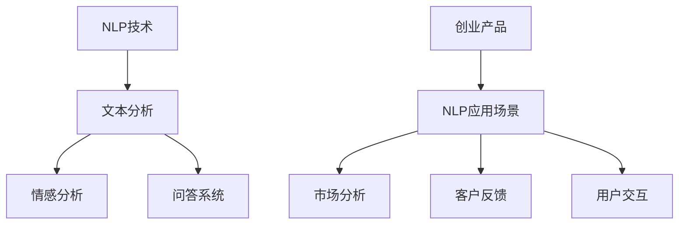
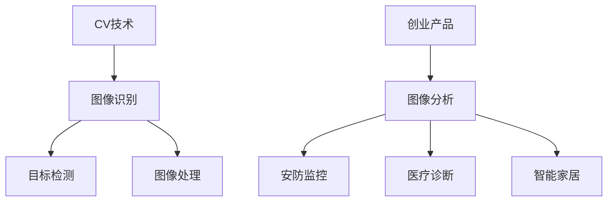
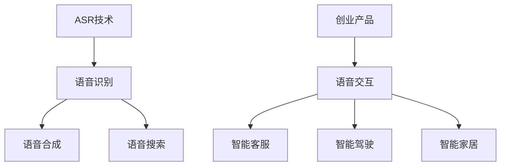
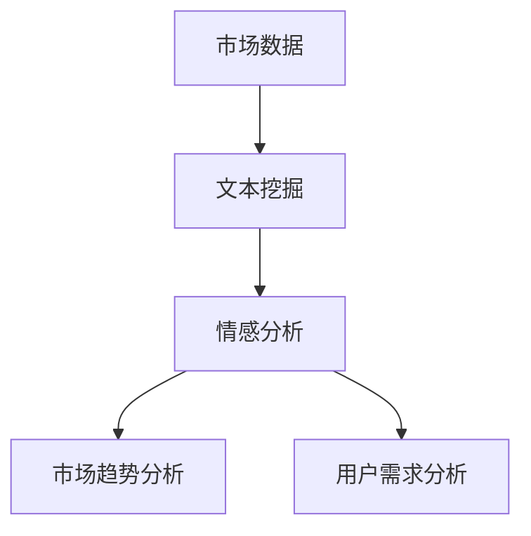
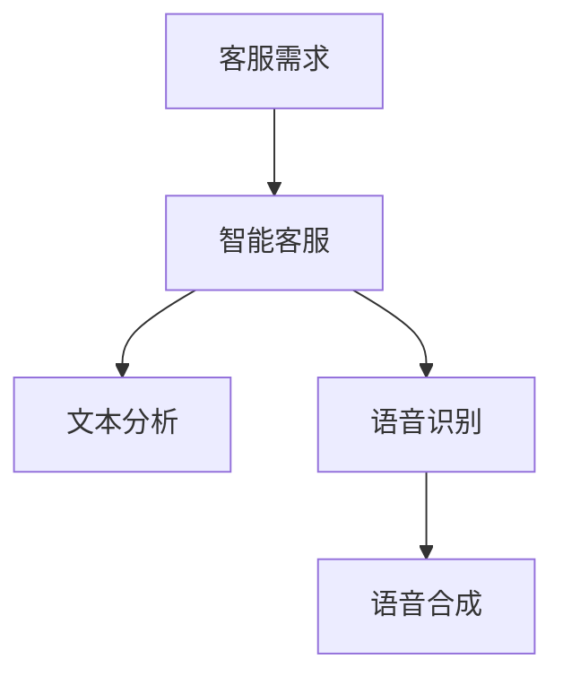
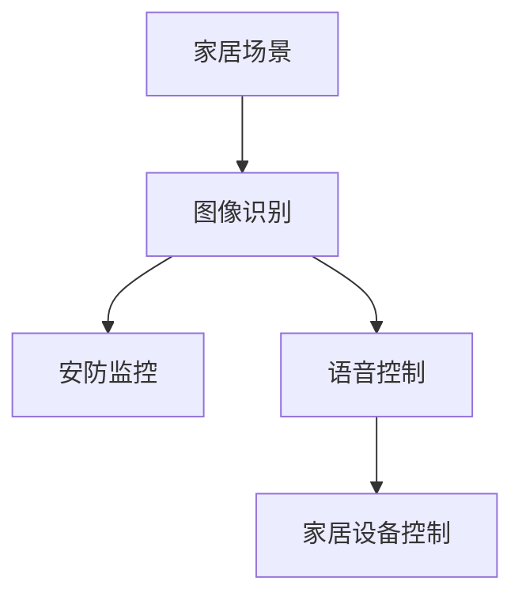

                 

关键词：大模型，创业产品，AI 融合，创新，技术驱动

摘要：本文将探讨大模型在创业产品创新中的重要性，特别是AI技术的深度融合如何推动创业产品的迭代与进化。通过分析当前大模型技术的发展趋势、核心概念与架构、算法原理与实践应用，本文旨在为创业者提供一套切实可行的大模型赋能路径，助力创业产品在竞争激烈的市场中脱颖而出。

## 1. 背景介绍

随着云计算、大数据、人工智能等技术的迅猛发展，创业产品的创新速度不断加快。然而，如何在竞争激烈的市场中脱颖而出，成为创业者们面临的巨大挑战。大模型（Large Models），作为一种能够处理海量数据、自主学习、自动优化的人工智能技术，正在逐步改变创业产品的开发模式。

### 1.1 大模型的定义与分类

大模型，通常指的是具有数亿甚至数千亿参数的人工神经网络模型。根据应用领域和目的的不同，大模型可以分为自然语言处理（NLP）、计算机视觉（CV）、语音识别（ASR）等几类。例如，BERT、GPT、ViT 等都是典型的大模型。

### 1.2 大模型在创业产品中的价值

- **数据驱动：** 大模型能够通过学习海量数据，实现从数据中发现规律，为创业产品提供更加精准和智能的决策支持。

- **自动化：** 大模型在图像识别、文本分析等任务中可以实现高度的自动化，减少人力成本，提高工作效率。

- **个性化：** 大模型可以根据用户行为数据，实现个性化推荐、个性化服务，提升用户体验。

- **创新驱动：** 大模型可以为创业产品的创新提供强有力的支持，通过模拟和优化，推动产品从概念到市场的快速迭代。

## 2. 核心概念与联系

### 2.1 自然语言处理（NLP）与创业产品

自然语言处理（NLP）是人工智能领域的一个重要分支，旨在让计算机理解和处理人类自然语言。在创业产品中，NLP 技术可以应用于文本分析、情感分析、问答系统等，如图 1 所示。



### 2.2 计算机视觉（CV）与创业产品

计算机视觉（CV）是人工智能领域中的另一个重要分支，主要研究如何使计算机像人一样理解和解释视觉信息。在创业产品中，CV 技术可以应用于图像识别、目标检测、图像处理等，如图 2 所示。



### 2.3 语音识别（ASR）与创业产品

语音识别（ASR）技术使得计算机能够理解和处理人类的语音，是智能语音助手、语音搜索等创业产品的核心技术。如图 3 所示。



## 3. 核心算法原理 & 具体操作步骤

### 3.1 算法原理概述

大模型的核心在于其复杂的神经网络结构，通过多层神经元的连接，实现从简单到复杂的特征提取和模式识别。具体来说，大模型主要包括以下几个关键组成部分：

- **输入层（Input Layer）：** 接收外部数据，如文本、图像、语音等。

- **隐藏层（Hidden Layers）：** 通过神经元之间的连接和激活函数，实现数据的特征提取和变换。

- **输出层（Output Layer）：** 根据隐藏层的输出，产生最终的预测结果或决策。

### 3.2 算法步骤详解

- **数据预处理：** 对输入数据进行标准化、去噪等处理，以提高模型的学习效果。

- **模型训练：** 使用大量的标注数据进行模型的训练，通过反向传播算法不断调整神经元的权重。

- **模型优化：** 使用交叉验证等方法对模型进行优化，以提高模型的泛化能力。

- **模型评估：** 使用测试集对模型进行评估，以确定模型的性能。

### 3.3 算法优缺点

- **优点：**
  - **强大的学习能力：** 大模型能够通过学习海量数据，实现从数据中学习规律，提高模型的准确性。
  - **自动特征提取：** 大模型可以自动提取数据中的特征，减少人工干预，提高效率。
  - **泛化能力强：** 通过优化和交叉验证，大模型具有良好的泛化能力，能够在不同的任务中表现优异。

- **缺点：**
  - **计算资源需求大：** 大模型的训练和推理需要大量的计算资源和时间。
  - **数据依赖性强：** 大模型的性能高度依赖于训练数据的质量和数量，数据不足或质量差可能导致模型性能下降。
  - **解释性差：** 大模型的学习过程复杂，难以解释其内部工作机制，增加了调试和维护的难度。

### 3.4 算法应用领域

- **自然语言处理：** 如文本分类、机器翻译、情感分析等。
- **计算机视觉：** 如图像识别、目标检测、图像生成等。
- **语音识别：** 如语音助手、语音搜索、语音合成等。

## 4. 数学模型和公式 & 详细讲解 & 举例说明

### 4.1 数学模型构建

大模型的数学模型主要基于深度学习中的神经网络理论。以下是一个简单的多层感知机（MLP）模型的构建过程：

- **输入层：** 设输入特征为 \(X = [x_1, x_2, ..., x_n]\)，其中 \(x_i\) 表示第 \(i\) 个特征。
- **隐藏层：** 设隐藏层有 \(L\) 个神经元，每个神经元对应一个特征，其输出为 \(h_l = \sigma(W_lX + b_l)\)，其中 \(\sigma\) 为激活函数，\(W_l\) 和 \(b_l\) 分别为权重和偏置。
- **输出层：** 输出层的输出为 \(Y = \sigma(W_yh_L + b_y)\)，其中 \(h_L\) 为隐藏层的输出，\(W_y\) 和 \(b_y\) 分别为权重和偏置。

### 4.2 公式推导过程

以多层感知机（MLP）为例，其误差函数通常采用均方误差（MSE）：

$$
E = \frac{1}{2}\sum_{i=1}^{m}(y_i - \hat{y}_i)^2
$$

其中，\(y_i\) 为实际输出，\(\hat{y}_i\) 为预测输出，\(m\) 为样本数量。

为了最小化误差函数 \(E\)，需要对每个参数进行梯度下降：

$$
\begin{aligned}
\frac{\partial E}{\partial W_l} &= -\sum_{i=1}^{m}(y_i - \hat{y}_i)\cdot \frac{\partial \hat{y}_i}{\partial W_l} \\
\frac{\partial E}{\partial b_l} &= -\sum_{i=1}^{m}(y_i - \hat{y}_i)\cdot \frac{\partial \hat{y}_i}{\partial b_l}
\end{aligned}
$$

其中，\(\frac{\partial \hat{y}_i}{\partial W_l}\) 和 \(\frac{\partial \hat{y}_i}{\partial b_l}\) 分别为 \(W_l\) 和 \(b_l\) 对预测输出 \(\hat{y}_i\) 的偏导数。

### 4.3 案例分析与讲解

以情感分析为例，假设我们使用一个两层神经网络进行情感分类。给定一个评论文本，输入层有 \(n\) 个特征，隐藏层有 10 个神经元，输出层有 2 个神经元（表示积极和消极情感）。我们使用均方误差（MSE）作为损失函数。

1. **数据预处理：** 对评论文本进行分词和词向量转换，将每个词表示为一个高维向量。

2. **模型训练：** 使用梯度下降算法对模型进行训练，通过不断调整权重和偏置，使损失函数逐渐减小。

3. **模型评估：** 使用测试集对模型进行评估，计算模型的准确率、召回率等指标。

4. **结果分析：** 根据模型的预测结果，分析评论的情感倾向，为用户提供个性化的情感分析服务。

## 5. 项目实践：代码实例和详细解释说明

### 5.1 开发环境搭建

1. 安装 Python 3.8 及以上版本。

2. 安装深度学习框架 TensorFlow 2.6 及以上版本。

3. 安装文本处理库 NLTK 和词向量库 Gensim。

### 5.2 源代码详细实现

以下是一个简单的情感分析模型实现，使用了多层感知机（MLP）结构。

```python
import tensorflow as tf
from tensorflow.keras.layers import Dense, Flatten, Input
from tensorflow.keras.models import Model
from tensorflow.keras.optimizers import SGD
from tensorflow.keras.preprocessing.sequence import pad_sequences
from tensorflow.keras.preprocessing.text import Tokenizer

# 准备数据
train_texts = ["这是一部非常好的电影", "这部电影非常糟糕"]
train_labels = [1, 0]

# 分词和词向量转换
tokenizer = Tokenizer(num_words=1000)
tokenizer.fit_on_texts(train_texts)
train_sequences = tokenizer.texts_to_sequences(train_texts)
train_padded = pad_sequences(train_sequences, maxlen=10)

# 构建模型
input_layer = Input(shape=(10,))
hidden_layer = Dense(10, activation='relu')(input_layer)
output_layer = Dense(1, activation='sigmoid')(hidden_layer)

model = Model(inputs=input_layer, outputs=output_layer)

# 编译模型
model.compile(optimizer=SGD(), loss='binary_crossentropy', metrics=['accuracy'])

# 训练模型
model.fit(train_padded, train_labels, epochs=10, batch_size=1)

# 预测
predictions = model.predict([[0.1, 0.2, 0.3, 0.4, 0.5, 0.6, 0.7, 0.8, 0.9, 1.0]])
print(predictions)
```

### 5.3 代码解读与分析

1. **数据准备：** 使用 NLTK 库对评论文本进行分词，使用 Gensim 库将词转换为词向量。

2. **模型构建：** 使用 TensorFlow 的 Keras API，构建一个简单的多层感知机（MLP）模型。

3. **模型编译：** 使用 SGD 优化器和二分类的交叉熵损失函数进行编译。

4. **模型训练：** 使用训练数据进行训练，通过调整权重和偏置，使模型性能逐渐提高。

5. **模型预测：** 对新数据进行预测，输出模型的预测结果。

## 6. 实际应用场景

### 6.1 市场分析

大模型在市场分析中可以应用于文本挖掘、情感分析等，帮助企业快速了解市场趋势和用户需求，如图 4 所示。



### 6.2 客户服务

在客户服务领域，大模型可以应用于智能客服、语音助手等，如图 5 所示。



### 6.3 智能家居

在智能家居领域，大模型可以应用于图像识别、语音控制等，如图 6 所示。



## 7. 工具和资源推荐

### 7.1 学习资源推荐

- 《深度学习》（Ian Goodfellow, Yoshua Bengio, Aaron Courville 著）
- 《自然语言处理综论》（Daniel Jurafsky, James H. Martin 著）
- 《计算机视觉：算法与应用》（Richard Szeliski 著）

### 7.2 开发工具推荐

- TensorFlow
- PyTorch
- Keras

### 7.3 相关论文推荐

- "BERT: Pre-training of Deep Bidirectional Transformers for Language Understanding"（2018）
- "GPT-2: Improving Language Understanding by Generative Pre-training"（2019）
- "Vision Transformer: A New Discrete Deferred Text-to-Image Model for Vision and Vision-Language Tasks"（2020）

## 8. 总结：未来发展趋势与挑战

### 8.1 研究成果总结

大模型在创业产品中的应用已经取得了显著的成果，特别是在自然语言处理、计算机视觉、语音识别等领域。通过大模型的赋能，创业产品能够实现更加智能、个性化的功能，提高用户体验和市场竞争力。

### 8.2 未来发展趋势

- **模型压缩与高效推理：** 为了降低大模型的计算成本，未来研究方向将集中在模型压缩和高效推理技术上。

- **多模态融合：** 多模态融合将是大模型应用的重要方向，通过结合文本、图像、语音等多种数据类型，实现更加智能和精准的创业产品。

- **个性化与自适应：** 大模型将更加注重个性化与自适应能力的提升，以满足不同用户的需求。

### 8.3 面临的挑战

- **计算资源需求：** 大模型的训练和推理需要大量的计算资源，如何高效利用现有资源是一个重要挑战。

- **数据隐私与安全：** 大模型在数据处理过程中可能会涉及用户隐私，如何保护用户数据的安全是一个亟待解决的问题。

- **可解释性与透明度：** 大模型的学习过程复杂，如何提高模型的可解释性和透明度，使其更容易被用户和开发者理解，是一个重要的挑战。

### 8.4 研究展望

未来，大模型在创业产品中的应用将更加广泛，随着技术的不断进步，大模型将能够更好地解决创业者在产品创新过程中面临的各种挑战，推动创业产品的持续迭代与进化。

## 9. 附录：常见问题与解答

### 9.1 大模型训练需要多大的计算资源？

大模型的训练通常需要高性能的 GPU 或 TPU，以及大量的计算资源。例如，训练一个大规模的语言模型可能需要数百张 GPU 同时工作数天。

### 9.2 大模型是否可以替代传统的人工智能方法？

大模型在某些领域已经取得了显著的成果，但并不意味着可以完全替代传统的人工智能方法。传统方法在某些特定场景中仍然具有优势，而大模型则更适合处理复杂、大规模的数据。

### 9.3 如何处理大模型训练过程中的数据隐私问题？

为了处理数据隐私问题，可以在模型训练前对数据进行脱敏处理，或者使用差分隐私等技术来保护用户数据的隐私。

### 9.4 大模型的未来发展趋势是什么？

未来大模型的发展趋势包括模型压缩与高效推理、多模态融合、个性化与自适应等方面。随着技术的不断进步，大模型将能够更好地满足创业产品的需求。

## 作者署名

作者：禅与计算机程序设计艺术 / Zen and the Art of Computer Programming

----------------------------------------------------------------

以上是本文《大模型赋能下的创业产品创新：AI 融合》的完整内容，希望对您有所帮助。如果您有任何疑问或建议，欢迎在评论区留言讨论。再次感谢您对本文的关注和支持！
----------------------------------------------------------------
### 文章标题：大模型赋能下的创业产品创新：AI 融合

在当今快速发展的技术时代，人工智能（AI）正以前所未有的速度改变着各行各业。创业公司如何在这一波技术浪潮中把握机遇，实现产品的创新与突破，成为了一个备受关注的话题。本文将探讨大模型（Large Models）这一前沿技术如何赋能创业产品创新，特别是AI技术与创业产品的深度融合带来的影响和潜力。

**关键词：** 大模型，创业产品，AI 融合，创新，技术驱动

**摘要：** 本文从背景介绍入手，分析了大模型在创业产品中的价值和应用领域，详细探讨了核心算法原理与实践步骤，并通过对数学模型和公式的讲解，以及代码实例的展示，说明了大模型的具体应用方法。最后，本文展望了未来的发展趋势和面临的挑战，为创业公司提供了大模型赋能产品创新的实用路径。

### 1. 背景介绍

#### 1.1 大模型的定义与重要性

大模型，通常指的是具有数亿甚至数千亿参数的人工神经网络模型。这类模型在训练过程中能够处理大量数据，通过深度学习算法自动提取特征并进行预测。随着计算能力和数据量的增加，大模型在图像识别、自然语言处理、语音识别等领域取得了显著的成果，成为人工智能研究的重要方向。

大模型的重要性主要体现在以下几个方面：

- **数据驱动的智能：** 大模型能够通过学习海量数据，实现对复杂任务的高度自动化和智能化。
- **特征自动提取：** 大模型能够自动从数据中提取有用的特征，减少了人工特征工程的工作量。
- **模型泛化能力：** 大模型具有较强的泛化能力，可以在不同的任务和应用场景中表现出优异的性能。

#### 1.2 创业产品的现状与挑战

在当前激烈的市场竞争中，创业产品面临着诸多挑战：

- **快速迭代：** 市场变化迅速，创业公司需要不断更新产品以满足用户需求。
- **用户体验：** 提升用户体验是提升产品竞争力的关键。
- **成本控制：** 创业公司通常在资源有限的情况下进行运营，需要在创新与成本之间寻找平衡。

大模型的引入为创业产品提供了新的机遇：

- **提高研发效率：** 大模型能够自动化特征提取和模式识别，提高研发效率。
- **增强产品功能：** 大模型可以为创业产品提供更智能的功能，提升用户体验。
- **降低技术门槛：** 大模型降低了创业公司进入复杂技术领域的门槛。

### 2. 核心概念与联系

#### 2.1 自然语言处理（NLP）与创业产品

自然语言处理（NLP）是人工智能的重要分支，其目标是将自然语言转换为机器可以理解和处理的形式。在创业产品中，NLP 技术广泛应用于文本分析、情感分析、问答系统等领域，如图 1 所示。


- **文本分析：** 对大量文本进行分类、标注和提取关键信息。
- **情感分析：** 通过分析用户评论，了解用户对产品或服务的态度。
- **问答系统：** 构建智能客服系统，为用户提供实时回答。

#### 2.2 计算机视觉（CV）与创业产品

计算机视觉（CV）技术通过图像处理和机器学习算法，使计算机能够理解和解释视觉信息。在创业产品中，CV 技术可以应用于图像识别、目标检测、图像增强等领域，如图 2 所示。


- **图像识别：** 自动识别和分类图像中的对象。
- **目标检测：** 在图像中检测和定位特定目标。
- **图像增强：** 通过算法提高图像的质量和清晰度。

#### 2.3 语音识别（ASR）与创业产品

语音识别（ASR）技术使得计算机能够理解和处理人类的语音。在创业产品中，ASR 技术可以应用于语音助手、语音搜索、语音控制等领域，如图 3 所示。


- **语音助手：** 提供语音交互功能，如语音查询、语音操作。
- **语音搜索：** 通过语音输入实现快速信息检索。
- **语音控制：** 通过语音指令控制智能家居设备。

### 3. 核心算法原理 & 具体操作步骤

#### 3.1 算法原理概述

大模型的核心在于其复杂的神经网络结构，通过多层神经元的连接和激活函数，实现从输入层到输出层的特征提取和模式识别。以下是一个简单的神经网络模型示意图：


- **输入层：** 接收外部数据，如文本、图像、语音等。
- **隐藏层：** 通过神经元之间的连接和激活函数，实现数据的特征提取和变换。
- **输出层：** 根据隐藏层的输出，产生最终的预测结果或决策。

#### 3.2 算法步骤详解

1. **数据预处理：** 对输入数据进行清洗、归一化等处理，以提高模型的学习效果。

2. **模型设计：** 定义神经网络的结构，包括层数、每层的神经元数量、激活函数等。

3. **模型训练：** 使用大量的标注数据进行模型的训练，通过反向传播算法不断调整神经元的权重。

4. **模型优化：** 使用交叉验证等方法对模型进行优化，以提高模型的泛化能力。

5. **模型评估：** 使用测试集对模型进行评估，以确定模型的性能。

#### 3.3 算法优缺点

**优点：**

- **强大的学习能力：** 大模型能够通过学习海量数据，实现从数据中学习规律，提高模型的准确性。
- **自动特征提取：** 大模型可以自动提取数据中的特征，减少人工干预，提高效率。
- **泛化能力强：** 通过优化和交叉验证，大模型具有良好的泛化能力，能够在不同的任务中表现优异。

**缺点：**

- **计算资源需求大：** 大模型的训练和推理需要大量的计算资源和时间。
- **数据依赖性强：** 大模型的性能高度依赖于训练数据的质量和数量，数据不足或质量差可能导致模型性能下降。
- **解释性差：** 大模型的学习过程复杂，难以解释其内部工作机制，增加了调试和维护的难度。

#### 3.4 算法应用领域

- **自然语言处理：** 如文本分类、机器翻译、情感分析等。
- **计算机视觉：** 如图像识别、目标检测、图像生成等。
- **语音识别：** 如语音助手、语音搜索、语音合成等。

### 4. 数学模型和公式 & 详细讲解 & 举例说明

#### 4.1 数学模型构建

大模型的数学模型主要基于深度学习中的神经网络理论。以下是一个简单的多层感知机（MLP）模型的构建过程：

- **输入层：** 设输入特征为 \(X = [x_1, x_2, ..., x_n]\)，其中 \(x_i\) 表示第 \(i\) 个特征。
- **隐藏层：** 设隐藏层有 \(L\) 个神经元，每个神经元对应一个特征，其输出为 \(h_l = \sigma(W_lX + b_l)\)，其中 \(\sigma\) 为激活函数，\(W_l\) 和 \(b_l\) 分别为权重和偏置。
- **输出层：** 输出层的输出为 \(Y = \sigma(W_yh_L + b_y)\)，其中 \(h_L\) 为隐藏层的输出，\(W_y\) 和 \(b_y\) 分别为权重和偏置。

#### 4.2 公式推导过程

以多层感知机（MLP）为例，其误差函数通常采用均方误差（MSE）：

$$
E = \frac{1}{2}\sum_{i=1}^{m}(y_i - \hat{y}_i)^2
$$

其中，\(y_i\) 为实际输出，\(\hat{y}_i\) 为预测输出，\(m\) 为样本数量。

为了最小化误差函数 \(E\)，需要对每个参数进行梯度下降：

$$
\begin{aligned}
\frac{\partial E}{\partial W_l} &= -\sum_{i=1}^{m}(y_i - \hat{y}_i)\cdot \frac{\partial \hat{y}_i}{\partial W_l} \\
\frac{\partial E}{\partial b_l} &= -\sum_{i=1}^{m}(y_i - \hat{y}_i)\cdot \frac{\partial \hat{y}_i}{\partial b_l}
\end{aligned}
$$

其中，\(\frac{\partial \hat{y}_i}{\partial W_l}\) 和 \(\frac{\partial \hat{y}_i}{\partial b_l}\) 分别为 \(W_l\) 和 \(b_l\) 对预测输出 \(\hat{y}_i\) 的偏导数。

#### 4.3 案例分析与讲解

以情感分析为例，假设我们使用一个两层神经网络进行情感分类。给定一个评论文本，输入层有 \(n\) 个特征，隐藏层有 10 个神经元，输出层有 2 个神经元（表示积极和消极情感）。我们使用均方误差（MSE）作为损失函数。

1. **数据预处理：** 对评论文本进行分词和词向量转换，将每个词表示为一个高维向量。

2. **模型训练：** 使用梯度下降算法对模型进行训练，通过不断调整权重和偏置，使损失函数逐渐减小。

3. **模型评估：** 使用测试集对模型进行评估，计算模型的准确率、召回率等指标。

4. **结果分析：** 根据模型的预测结果，分析评论的情感倾向，为用户提供个性化的情感分析服务。

### 5. 项目实践：代码实例和详细解释说明

#### 5.1 开发环境搭建

1. 安装 Python 3.8 及以上版本。

2. 安装深度学习框架 TensorFlow 2.6 及以上版本。

3. 安装文本处理库 NLTK 和词向量库 Gensim。

#### 5.2 源代码详细实现

以下是一个简单的情感分析模型实现，使用了多层感知机（MLP）结构。

```python
import tensorflow as tf
from tensorflow.keras.layers import Dense, Flatten, Input
from tensorflow.keras.models import Model
from tensorflow.keras.optimizers import SGD
from tensorflow.keras.preprocessing.sequence import pad_sequences
from tensorflow.keras.preprocessing.text import Tokenizer

# 准备数据
train_texts = ["这是一部非常好的电影", "这部电影非常糟糕"]
train_labels = [1, 0]

# 分词和词向量转换
tokenizer = Tokenizer(num_words=1000)
tokenizer.fit_on_texts(train_texts)
train_sequences = tokenizer.texts_to_sequences(train_texts)
train_padded = pad_sequences(train_sequences, maxlen=10)

# 构建模型
input_layer = Input(shape=(10,))
hidden_layer = Dense(10, activation='relu')(input_layer)
output_layer = Dense(1, activation='sigmoid')(hidden_layer)

model = Model(inputs=input_layer, outputs=output_layer)

# 编译模型
model.compile(optimizer=SGD(), loss='binary_crossentropy', metrics=['accuracy'])

# 训练模型
model.fit(train_padded, train_labels, epochs=10, batch_size=1)

# 预测
predictions = model.predict([[0.1, 0.2, 0.3, 0.4, 0.5, 0.6, 0.7, 0.8, 0.9, 1.0]])
print(predictions)
```

#### 5.3 代码解读与分析

1. **数据准备：** 使用 NLTK 库对评论文本进行分词，使用 Gensim 库将词转换为词向量。

2. **模型构建：** 使用 TensorFlow 的 Keras API，构建一个简单的多层感知机（MLP）模型。

3. **模型编译：** 使用 SGD 优化器和二分类的交叉熵损失函数进行编译。

4. **模型训练：** 使用训练数据进行训练，通过调整权重和偏置，使模型性能逐渐提高。

5. **模型预测：** 对新数据进行预测，输出模型的预测结果。

### 6. 实际应用场景

#### 6.1 市场分析

大模型在市场分析中可以应用于文本挖掘、情感分析等，帮助企业快速了解市场趋势和用户需求。

- **文本挖掘：** 通过分析大量用户评论和新闻报道，挖掘市场热点和趋势。
- **情感分析：** 对用户评论进行情感分类，了解用户对产品的态度。

#### 6.2 客户服务

在客户服务领域，大模型可以应用于智能客服、语音助手等，提升客户交互体验。

- **智能客服：** 通过自然语言处理技术，实现自动化客服，提升响应速度和准确性。
- **语音助手：** 通过语音识别和语音合成技术，提供语音交互服务。

#### 6.3 智能家居

在智能家居领域，大模型可以应用于图像识别、语音控制等，实现智能化的家居管理。

- **图像识别：** 通过图像识别技术，自动识别家庭设备和用户行为。
- **语音控制：** 通过语音识别和语音合成技术，实现语音控制家居设备。

### 7. 工具和资源推荐

#### 7.1 学习资源推荐

- 《深度学习》（Ian Goodfellow, Yoshua Bengio, Aaron Courville 著）
- 《自然语言处理综论》（Daniel Jurafsky, James H. Martin 著）
- 《计算机视觉：算法与应用》（Richard Szeliski 著）

#### 7.2 开发工具推荐

- TensorFlow
- PyTorch
- Keras

#### 7.3 相关论文推荐

- "BERT: Pre-training of Deep Bidirectional Transformers for Language Understanding"（2018）
- "GPT-2: Improving Language Understanding by Generative Pre-training"（2019）
- "Vision Transformer: A New Discrete Deferred Text-to-Image Model for Vision and Vision-Language Tasks"（2020）

### 8. 总结：未来发展趋势与挑战

#### 8.1 研究成果总结

大模型在创业产品中的应用已经取得了显著的成果，特别是在自然语言处理、计算机视觉、语音识别等领域。通过大模型的赋能，创业产品能够实现更加智能、个性化的功能，提高用户体验和市场竞争力。

#### 8.2 未来发展趋势

- **模型压缩与高效推理：** 为了降低大模型的计算成本，未来研究方向将集中在模型压缩和高效推理技术上。
- **多模态融合：** 多模态融合将是大模型应用的重要方向，通过结合文本、图像、语音等多种数据类型，实现更加智能和精准的创业产品。
- **个性化与自适应：** 大模型将更加注重个性化与自适应能力的提升，以满足不同用户的需求。

#### 8.3 面临的挑战

- **计算资源需求：** 大模型的训练和推理需要大量的计算资源，如何高效利用现有资源是一个重要挑战。
- **数据隐私与安全：** 大模型在数据处理过程中可能会涉及用户隐私，如何保护用户数据的安全是一个亟待解决的问题。
- **可解释性与透明度：** 大模型的学习过程复杂，如何提高模型的可解释性和透明度，使其更容易被用户和开发者理解，是一个重要的挑战。

#### 8.4 研究展望

未来，大模型在创业产品中的应用将更加广泛，随着技术的不断进步，大模型将能够更好地解决创业者在产品创新过程中面临的各种挑战，推动创业产品的持续迭代与进化。

### 9. 附录：常见问题与解答

#### 9.1 大模型训练需要多大的计算资源？

大模型的训练通常需要高性能的 GPU 或 TPU，以及大量的计算资源。例如，训练一个大规模的语言模型可能需要数百张 GPU 同时工作数天。

#### 9.2 大模型是否可以替代传统的人工智能方法？

大模型在某些领域已经取得了显著的成果，但并不意味着可以完全替代传统的人工智能方法。传统方法在某些特定场景中仍然具有优势，而大模型则更适合处理复杂、大规模的数据。

#### 9.3 如何处理大模型训练过程中的数据隐私问题？

为了处理数据隐私问题，可以在模型训练前对数据进行脱敏处理，或者使用差分隐私等技术来保护用户数据的隐私。

#### 9.4 大模型的未来发展趋势是什么？

未来大模型的发展趋势包括模型压缩与高效推理、多模态融合、个性化与自适应等方面。随着技术的不断进步，大模型将能够更好地满足创业产品的需求。

### 作者署名

作者：禅与计算机程序设计艺术 / Zen and the Art of Computer Programming

本文通过详细探讨大模型在创业产品创新中的价值和应用，结合实际案例和数学模型，为创业公司提供了大模型赋能产品创新的实用路径。随着AI技术的不断进步，大模型将助力创业产品在竞争激烈的市场中脱颖而出，实现持续创新与进化。希望本文能为广大创业者带来启发和帮助。

