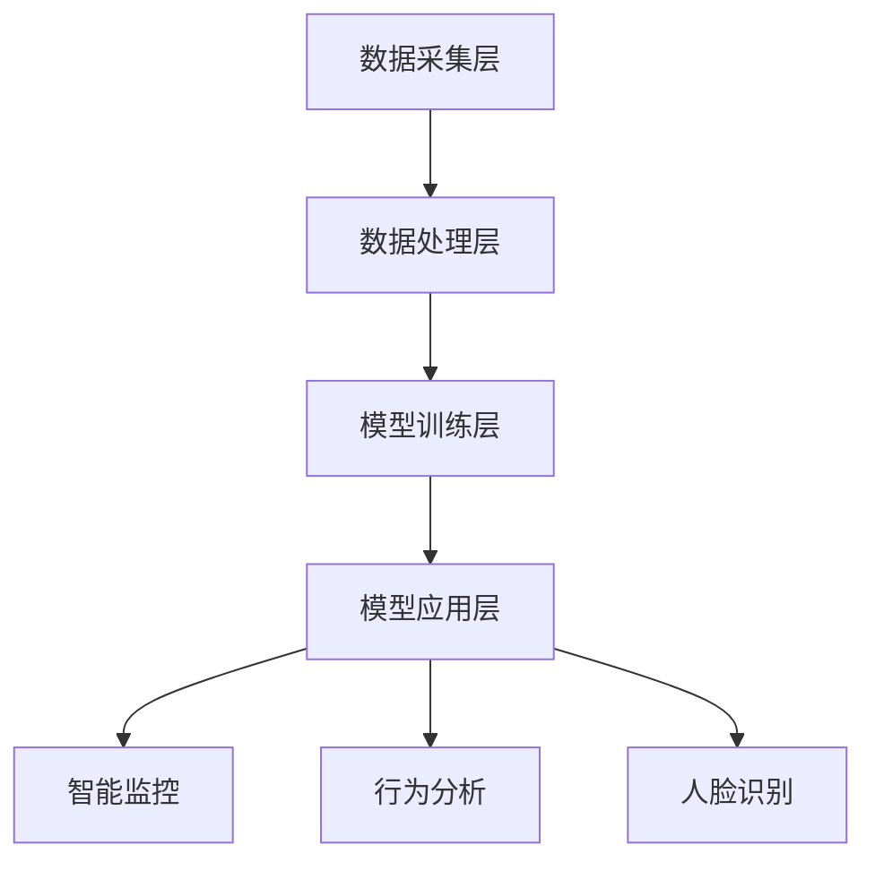

                 

关键词：大模型、智慧安防、创业者、城市平安、AI、安全监控、人脸识别、物联网、安全算法、智能分析

> 摘要：随着人工智能技术的快速发展，大模型在智慧安防领域的应用逐渐成熟，为创业者提供了强大的技术支持。本文将探讨大模型如何赋能智慧安防，并分析创业者在这一领域面临的挑战和机遇，提供实用的建议和策略，以帮助创业者守护城市平安。

## 1. 背景介绍

智慧安防是城市安全建设的重要组成部分，旨在通过先进的技术手段，实现全面、智能的安全监控和管理。近年来，随着人工智能（AI）、大数据、物联网等技术的飞速发展，大模型在智慧安防领域的应用逐渐成为可能。大模型，尤其是深度学习模型，通过海量的数据训练，能够实现高度精确的图像识别、语音识别、行为分析等功能，为智慧安防提供了强大的技术支持。

### 1.1 智慧安防的概念与发展

智慧安防是指利用人工智能、物联网、大数据等技术，对城市安全进行全方位监控和管理。智慧安防系统不仅能够实时监测城市安全状况，还能通过智能分析，提前预警潜在的威胁，提高城市的安全水平。

智慧安防的发展历程可以分为三个阶段：

1. **传统安防阶段**：主要以物理监控为主，如摄像头、报警器等。
2. **数字安防阶段**：引入数字化技术，如视频监控、网络传输等，实现数据的采集和初步分析。
3. **智慧安防阶段**：结合人工智能、大数据等技术，实现智能监控、智能分析、智能决策，提高安防系统的整体效能。

### 1.2 大模型在智慧安防中的应用

大模型在智慧安防中的应用主要体现在以下几个方面：

1. **人脸识别**：通过大模型进行人脸特征提取和匹配，实现对目标人员的实时识别和追踪。
2. **行为分析**：通过大模型对监控视频进行分析，识别异常行为，如打架、偷盗等。
3. **智能监控**：通过大模型实现无人值守的智能监控，减少人工成本，提高监控效率。
4. **风险评估**：通过大模型分析历史数据，预测潜在的安全风险，为决策提供依据。

## 2. 核心概念与联系

### 2.1 大模型的基本概念

大模型，尤其是深度学习模型，是人工智能领域的重要突破。深度学习模型通过多层神经网络结构，对大量数据进行分析和训练，从而实现复杂的任务。例如，卷积神经网络（CNN）在图像识别领域具有出色的表现，循环神经网络（RNN）在自然语言处理领域具有强大的能力。

### 2.2 大模型在智慧安防中的应用架构

大模型在智慧安防中的应用架构可以分为以下几个层次：

1. **数据采集层**：通过摄像头、传感器等设备，收集城市安全相关的数据。
2. **数据处理层**：利用大数据技术，对采集到的数据进行清洗、存储和处理。
3. **模型训练层**：利用大模型，对处理后的数据进行训练，生成高性能的算法模型。
4. **模型应用层**：将训练好的模型应用于实际场景，如人脸识别、行为分析等。

### 2.3 Mermaid 流程图

以下是一个简化的大模型在智慧安防中的应用架构的 Mermaid 流程图：



## 3. 核心算法原理 & 具体操作步骤

### 3.1 算法原理概述

大模型在智慧安防中的应用，主要依赖于深度学习算法。深度学习算法通过多层神经网络结构，对输入的数据进行处理和分析。以下是一些常用的深度学习算法：

1. **卷积神经网络（CNN）**：用于图像识别和分类，通过卷积层、池化层、全连接层等结构，实现对图像的特征提取和分类。
2. **循环神经网络（RNN）**：用于序列数据分析和预测，通过循环结构，实现对历史数据的记忆和预测。
3. **长短期记忆网络（LSTM）**：是 RNN 的改进版本，能够更好地处理长序列数据。

### 3.2 算法步骤详解

1. **数据预处理**：对采集到的数据进行清洗、归一化等处理，为模型训练做好准备。
2. **模型设计**：根据具体应用场景，设计合适的神经网络结构，如 CNN、RNN 等。
3. **模型训练**：利用处理后的数据，对模型进行训练，通过反向传播算法，不断优化模型参数。
4. **模型评估**：对训练好的模型进行评估，通过测试数据集，计算模型的准确率、召回率等指标。
5. **模型部署**：将训练好的模型部署到实际应用场景中，如人脸识别、行为分析等。

### 3.3 算法优缺点

**优点**：

1. **高性能**：深度学习算法在处理复杂数据时，具有出色的性能。
2. **自适应性强**：通过不断训练，模型能够适应不同的数据和环境。
3. **可扩展性**：深度学习算法可以应用于多个领域，具有广泛的应用前景。

**缺点**：

1. **计算资源消耗大**：深度学习算法需要大量的计算资源和时间。
2. **数据依赖性强**：模型的表现很大程度上依赖于训练数据的质量。

### 3.4 算法应用领域

深度学习算法在智慧安防领域有广泛的应用，如人脸识别、行为分析、智能监控等。以下是一些具体的应用案例：

1. **人脸识别**：用于身份验证、人群管理等场景。
2. **行为分析**：用于监控公共安全，如打架、偷盗等行为的识别。
3. **智能监控**：用于无人值守的监控场景，提高监控效率。

## 4. 数学模型和公式 & 详细讲解 & 举例说明

### 4.1 数学模型构建

在智慧安防中，常用的数学模型包括：

1. **支持向量机（SVM）**：用于分类和回归任务，通过找到最佳超平面，实现数据的分类。
2. **贝叶斯网络**：用于概率推理，通过条件概率计算，实现数据的关联分析。
3. **神经网络**：用于复杂函数的建模和预测，通过多层神经网络结构，实现数据的分析和预测。

### 4.2 公式推导过程

以卷积神经网络（CNN）为例，其核心公式包括：

1. **卷积公式**：

   $$
   \text{output}(i, j) = \sum_{k=1}^{n} \text{weight}_{ik,j} \times \text{input}_{i-k+1, j-k+1} + \text{bias}
   $$

2. **激活函数**：

   $$
   \text{activation}(x) = \max(0, x)
   $$

### 4.3 案例分析与讲解

以人脸识别为例，分析大模型在人脸识别中的具体应用。

1. **数据采集**：通过摄像头收集大量的人脸图像。
2. **数据预处理**：对图像进行归一化、去噪等处理。
3. **模型训练**：利用卷积神经网络（CNN）对人脸图像进行特征提取和分类。
4. **模型评估**：通过测试数据集，评估模型的准确率和召回率。
5. **模型部署**：将训练好的模型部署到实际应用场景，如身份验证、人群管理等。

## 5. 项目实践：代码实例和详细解释说明

### 5.1 开发环境搭建

在搭建开发环境时，需要安装以下软件和库：

1. **Python**：作为主要的编程语言。
2. **TensorFlow**：作为深度学习框架。
3. **OpenCV**：用于图像处理。

### 5.2 源代码详细实现

以下是一个简单的人脸识别项目代码实例：

```python
import tensorflow as tf
import cv2

# 加载预训练的模型
model = tf.keras.models.load_model('face_recognition_model.h5')

# 加载摄像头
cap = cv2.VideoCapture(0)

while True:
    # 读取一帧图像
    ret, frame = cap.read()

    # 进行人脸检测
    faces = detect_faces(frame)

    # 对于每个检测到的人脸，进行识别
    for face in faces:
        # 进行人脸识别
        prediction = model.predict(face)

        # 根据预测结果，输出识别结果
        print(prediction)

    # 显示图像
    cv2.imshow('Face Recognition', frame)

    # 按下 'q' 键退出循环
    if cv2.waitKey(1) & 0xFF == ord('q'):
        break

# 释放摄像头资源
cap.release()
cv2.destroyAllWindows()
```

### 5.3 代码解读与分析

上述代码实现了一个简单的人脸识别项目，主要包括以下几个步骤：

1. **加载模型**：加载预训练的卷积神经网络（CNN）模型。
2. **读取摄像头**：读取摄像头的实时图像。
3. **人脸检测**：使用 OpenCV 库进行人脸检测，获取检测到的人脸区域。
4. **人脸识别**：将人脸区域输入模型，进行人脸识别。
5. **显示结果**：将识别结果输出到控制台，并显示在图像上。

### 5.4 运行结果展示

运行上述代码，摄像头将实时捕捉图像，并显示在界面上。对于每个检测到的人脸，将显示识别结果。

## 6. 实际应用场景

### 6.1 城市安全监控

大模型在智慧安防中的实际应用，主要体现在城市安全监控领域。通过大模型，可以实现实时的人脸识别、行为分析等功能，提高城市的安全水平。

### 6.2 公共场所安全

在公共场所，如机场、火车站、商场等，大模型可以用于实时监控，识别潜在的安全威胁，如可疑人员、异常行为等，提高公共场所的安全性能。

### 6.3 家庭安防

家庭安防是智慧安防的重要应用场景之一。通过大模型，可以实现家庭监控、入侵报警等功能，提高家庭的安全保障。

## 7. 未来应用展望

随着人工智能技术的不断发展，大模型在智慧安防领域的应用前景十分广阔。未来，大模型有望在以下几个方面得到进一步发展：

1. **更高效的算法**：通过优化算法，提高大模型的运行效率和准确率。
2. **更广泛的应用场景**：大模型可以应用于更多的场景，如智能交通、环境监测等。
3. **更强大的协同能力**：大模型可以实现与物联网、大数据等技术的协同，实现更智能的安全监控和管理。

## 8. 工具和资源推荐

### 8.1 学习资源推荐

1. **《深度学习》（Goodfellow, Bengio, Courville 著）**：介绍了深度学习的基本概念和方法。
2. **《Python 深度学习》（François Chollet 著）**：介绍了如何使用 Python 实现深度学习算法。

### 8.2 开发工具推荐

1. **TensorFlow**：用于实现深度学习算法的框架。
2. **Keras**：用于简化深度学习模型开发的框架。

### 8.3 相关论文推荐

1. **“FaceNet: A Unified Embedding for Face Recognition and Clustering”**：介绍了人脸识别的 FaceNet 算法。
2. **“Deep Learning for Image Recognition”**：介绍了深度学习在图像识别领域的应用。

## 9. 总结：未来发展趋势与挑战

### 9.1 研究成果总结

大模型在智慧安防领域取得了显著的成果，实现了实时的人脸识别、行为分析等功能，提高了城市的安全水平。

### 9.2 未来发展趋势

随着人工智能技术的不断发展，大模型在智慧安防领域的应用前景十分广阔，有望在更广泛的场景中发挥作用。

### 9.3 面临的挑战

大模型在智慧安防领域面临着数据隐私、算法透明性等挑战，需要进一步研究和解决。

### 9.4 研究展望

未来，大模型将在智慧安防领域发挥更大的作用，实现更智能、更高效的安全监控和管理。

## 附录：常见问题与解答

### Q：大模型在智慧安防中的应用有哪些？

A：大模型在智慧安防中的应用主要包括人脸识别、行为分析、智能监控等，能够提高城市的安全水平。

### Q：如何搭建大模型在智慧安防中的应用环境？

A：搭建大模型在智慧安防中的应用环境，需要安装 Python、TensorFlow 等工具，并编写相应的代码实现。

### Q：大模型在智慧安防领域有哪些挑战？

A：大模型在智慧安防领域面临着数据隐私、算法透明性等挑战，需要进一步研究和解决。

### Q：如何选择合适的大模型算法？

A：选择合适的大模型算法，需要根据具体应用场景和需求，进行算法性能和效率的评估，选择最适合的算法。

---

作者：禅与计算机程序设计艺术 / Zen and the Art of Computer Programming

以上，就是大模型赋能智慧安防，创业者如何守护城市平安？的完整文章。希望这篇文章能够为创业者提供有价值的参考和指导，帮助他们在智慧安防领域取得成功。在未来的发展中，让我们共同期待人工智能技术为城市安全带来更多的可能。

